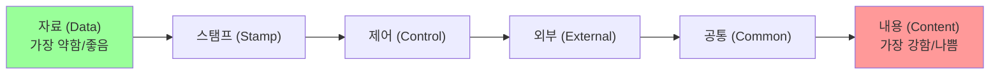
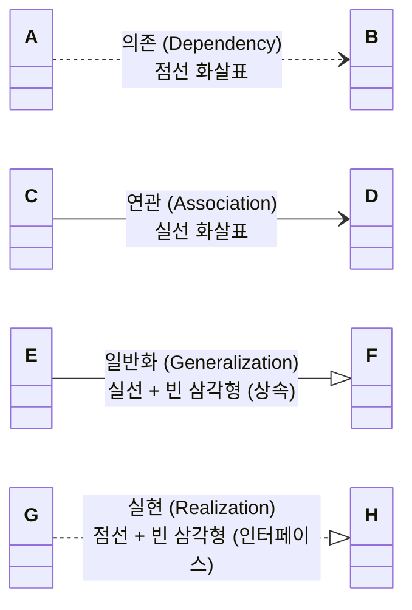

# Summary

> [!IMPORTANT]
> **실기 시험이 단 3일 남은 시점에서 불필요한 장황한 설명은 사치입니다.** 
> 본 문서는 프로그래밍 논리 연산은 완벽하나 **세부 문법/메서드 및 비개발 암기 파트(디자인 패턴, UML, 보안, DB 등)가 치명적으로 약한 수험생**을 위해 제작된 **기적의 10점 상승 최종 치트 시트(Cheat Sheet)**입니다. 
> 시험장 가기 직전까지 이 문서의 표와 공식, 두문자 족보만 무한 반복해서 외우십시오.

---

# 1. 🐍 프로그래밍 언어 - 초빈출 API 메서드 & 출력 포맷 족보

알고리즘 흐름은 맞추지만 메서드 반환값과 출력 괄호 하나 때문에 오답 처리되는 실수를 완벽히 방지합니다.

### 1.1 Java String 클래스 API의 불변성 함정
* **자바 String은 불변(Immutable) 객체**입니다. 즉, 메서드를 적용해도 원본은 바뀌지 않으며 반드시 **대입 연산자(`=`)**가 동반되어야 변수 값이 갱신됩니다.
```java
String s = "apple";
s.replace('p', 'b'); // 대입이 없으므로 s는 여전히 "apple"
s = s.replace('p', 'b'); // s는 이제 "abble"로 갱신됨!
```
* **핵심 메서드**:
  * `replace(old, new)`: 문자 치환.
  * `concat(str)`: 문자열 뒤에 접합.
  * `substring(begin, end)`: `begin`부터 `end - 1` 인덱스까지 슬라이싱. (파이썬 `[begin:end]`와 동일)

### 1.2 Java 컬렉션(List, Set, Map) 출력 포맷 약속
자바 객체를 `System.out.print`로 직접 출력할 시의 규격화된 문자열 변환 포맷입니다.
* **출력 기호**: 파이썬의 중괄호 `{}`나 일반 나열과 달리 **무조건 대괄호 `[ ]`**로 묶입니다.
* **구분자**: 요소 간에는 **`쉼표와 한 칸 공백 (", ")`**이 찍힙니다.
```java
Set<Integer> h = new HashSet<>();
h.add(2); h.add(1);
System.out.print(h); // 출력 결과: [1, 2] (대괄호와 공백 주의!)
```

### 1.3 C/Java 진법 출력 포맷팅 지정자 (`printf`)
16진수 변환 후 접두사 `0x` 유무와 대소문자 표기는 채점의 절대적 불합격 킬러 함정입니다.

| 서식 지정자 | 출력 포맷 | 10진수 51 변환 예시 |
| :--- | :--- | :--- |
| **`%x`** | 16진수 **소문자** (접두사 없음) | **`33`** (절대 0x33 아님) |
| **`%X`** | 16진수 **대문자** (접두사 없음) | **`33`** (A~F일 경우 대문자 출력) |
| **`%#x`** | 16진수 소문자 + **`0x` 접두사 자동 부여** | **`0x33`** |
| **`%#X`** | 16진수 대문자 + **`0X` 접두사 자동 부여** | **`0X33`** |
| **`%o`** | 8진수 정수 (접두사 없음) | **`63`** ($51 = 8 \times 6 + 3$) |
| **`%#o`** | 8진수 정수 + **`0` 접두사 자동 부여** | **`063`** |

---

# 2. 🏗️ 소프트웨어 공학 - 모듈 설계 (결합도 & 응집도)

가장 약하다고 지목하신 결합도와 응집도는 두문자 공식과 특징어 맵핑이 전부입니다.

### 2.1 결합도 (Coupling) - 모듈 간 상호 의존도
* 🌟 **두문자 암기**: **`자 ➔ 스 ➔ 제 ➔ 외 ➔ 공 ➔ 내`** (왼쪽이 약하고 좋은 설계 / 오른쪽이 강하고 나쁜 설계)



| 결합도 유형 | 핵심 기출 힌트 단어 (지문에서 이 단어가 보이면 정답) |
| :--- | :--- |
| **자료 결합도** (Data) | **`단순 파라미터`**, 단순 값만 매개변수로 주고받음 |
| **스탬프 결합도** (Stamp) | **`배열`**, **`구조체`**, **`객체`** 등 자료구조가 매개변수로 전달됨 |
| **제어 결합도** (Control) | **`제어 요소`**, **`신호(Flag)`**, 값뿐 아니라 처리 로직 지시 제어값 전달 |
| **외부 결합도** (External) | **`외부 데이터 포맷`**, **`통신 프로토콜`**, **`디바이스 인터페이스`** 공유 |
| **공통 결합도** (Common) | **`전역 변수`**, **`공동 데이터 영역`**을 여러 모듈이 공유 및 참조 |
| **내용 결합도** (Content) | 다른 모듈의 **`내부 변수 직접 참조`**, 내부 기능 내부 데이터 직접 사용 |

---

### 2.2 응집도 (Cohesion) - 모듈 내부 요소들의 집중도
* 🌟 **두문자 암기**: **`우 ➔ 논 ➔ 시 ➔ 절 ➔ 통 ➔ 순 ➔ 기`** (왼쪽이 약하고 나쁜 설계 / 오른쪽이 강하고 좋은 설계)

| 응집도 유형 | 핵심 기출 힌트 단어 (지문에서 이 단어가 보이면 정답) |
| :--- | :--- |
| **우연적 응집도** (Coincidental) | 아무런 관련 없는 작업들이 **`우연히`** 한 모듈에 뭉쳐 있음 |
| **논리적 응집도** (Logical) | **`유사한 성격`**이나 논리적으로 관련된 처리들이 한 모듈에서 수행됨 |
| **시간적 응집도** (Temporal) | **`특정 시간`**, **`초기화`**, **`종료 처리`** 등 동일한 시간대에 수행되는 작업들 |
| **절차적 응집도** (Procedural) | 모듈 안의 구성 요소들이 **`순차적인 경로`**를 따라 통제 흐름대로 실행됨 |
| **통신적 응집도** (Communication) | **`동일한 입력과 출력`** 데이터를 사용하여 서로 다른 기능을 수행함 |
| **순차적 응집도** (Sequential) | 한 활동의 **`출력 데이터가 다음 활동의 입력`** 데이터로 바로 사용됨 |
| **기능적 응집도** (Functional) | 모듈 내부의 모든 기능이 **`단일한 목적`**을 위해 완벽히 똘똘 뭉쳐 있음 |

---

# 3. 📊 UML (Unified Modeling Language) 핵심 요약

구조 다이어그램(정적)과 행위 다이어그램(동적)을 분류하는 단답형 및 다이어그램 간의 관계 화살표 문제가 핵심입니다.

### 3.1 UML 다이어그램 대분류

* **구조적 다이어그램 (Static / 정적)**:
  * **`클래스`**(Class), **`객체`**(Object), **`컴포넌트`**(Component), **`배치`**(Deployment), **`복합체 구조`**(Composite Structure), **`패키지`**(Package)
  * *벼락치기 연상*: 물리적/구조적 뼈대를 만드는 구조물들.
* **행위적 다이어그램 (Dynamic / 동적)**:
  * **`유스케이스`**(Use Case), **`시퀀스`**(Sequence), **`커뮤니케이션`**(Communication), **`상태`**(State), **`활동`**(Activity), **`상호작용 개요`**(Interaction Overview), **`타이밍`**(Timing)
  * *벼락치기 연상*: 시간의 흐름, 상호작용, 상태 변화 등 동적인 움직임.

---

### 3.2 UML 관계 (Relationships) 벼락치기 매핑



1. **의존 관계 (Dependency)**:
   * 한 클래스의 명세 변경이 다른 클래스에 영향을 주는 관계 (임시 참조).
   * **기호**: **`점선 화살표`** (`..>`)
2. **연관 관계 (Association)**:
   * 두 클래스가 서로 지속적인 의존성을 가짐.
   * **기호**: **`실선 화살표 또는 실선`** (`-->`)
3. **일반화 관계 (Generalization)**:
   * 객체지향의 **상속** 관계 (자식 $\rightarrow$ 부모).
   * **기호**: **`실선 + 빈 삼각형 화살표`** (`--|>`)
4. **실현 관계 (Realization)**:
   * 인터페이스를 상속받아 실제로 구현하는 관계.
   * **기호**: **`점선 + 빈 삼각형 화살표`** (`..|>`)
5. **집단 관계 (Aggregation)**:
   * 전체와 부분의 관계이며, 독립적 수명을 가짐 (소속 관계).
   * **기호**: **`실선 + 빈 마름모`**
6. **합성 관계 (Composition)**:
   * 전체와 부분의 관계이나, 부분이 전체에 종속되어 수명을 함께함 (부품 관계).
   * **기호**: **`실선 + 채워진 마름모`**

---

# 4. 🎨 디자인 패턴 (Design Patterns) - GoF 23대 패턴

23가지 패턴을 다 외우기는 불가능합니다. **시험에 무조건 나오는 초빈출 핵심 패턴 8선**의 지문 키워드를 머리에 구겨 넣으십시오.

### 4.1 GoF 3대 분류
* **생성 패턴 (Creational - 5개)**: 추상 팩토리, 빌더, 팩토리 메서드, 프로토타입, 싱글톤 (**`추빌팩프싱`**)
* **구조 패턴 (Structural - 7개)**: 어댑터, 브리지, 컴포지트, 데코레이터, 퍼사드, 플라이웨이트, 프록시 (**`어브컴데퍼플프`**)
* **행위 패턴 (Behavioral - 11개)**:나머지 전체 (템플릿 메서드, 옵저버, 상태, 전략, 메멘토, 반복자 등)

---

### 4.2 초빈출 핵심 디자인 패턴 8선 지문 키워드

| 패턴 이름 | 분류 | 핵심 지문 키워드 (이 단어 나오면 100% 이 패턴이 정답) |
| :--- | :--- | :--- |
| **싱글톤**<br>(Singleton) | 생성 | **`단 하나의 인스턴스`**, 글로벌 접근, 메모리 절약 |
| **팩토리 메서드**<br>(Factory Method) | 생성 | **`서브 클래스가 결정을 내림`**, 상속을 통한 인스턴스 생성 |
| **추상 팩토리**<br>(Abstract Factory) | 생성 | **`연관되거나 의존적인 객체들의 군`**을 생성, 구체적 클래스 명시 안 함 |
| **빌더**<br>(Builder) | 생성 | **`인스턴스 생성 과정을 단계별로 분리`**, 동일한 생성 절차에서 다른 결과 |
| **어댑터**<br>(Adapter) | 구조 | **`호환되지 않는 인터페이스`**를 중간에서 연결 및 변환 |
| **데코레이터**<br>(Decorator) | 구조 | **`상속을 쓰지 않고`** 객체에 **`동적으로 새로운 책임(기능) 추가`** |
| **옵저버**<br>(Observer) | 행위 | **`일대다(1:N) 의존성`**, **`상태 변화 시 자동 알림`** 및 갱신 |
| **템플릿 메서드**<br>(Template Method) | 행위 | **`알고리즘의 뼈대(골격)`**를 정의, 세부 단계는 서브클래스에 위임 |

---

# 5. 🛡️ 보안 & 사회공학적 위협 요점 족보

개발 보안 구축(9과목)과 인프라 보안의 핵심 키워드 정리입니다.

### 5.1 서비스 거부 공격 (DoS / DDoS) 작동 원리 요약

* **SYN Flooding**:
  * TCP 3-Way Handshake 중 클라이언트가 SYN만 보내고 ACK를 보내지 않아, 서버의 **`Half-Open 연결 대기 큐`**를 가득 채워 마비시키는 공격.
* **Smurfing (스머핑)**:
  * 출발지 IP 주소를 **`희생자의 IP`**로 위조(Spoofing)하여, 네트워크 전체 호스트에게 **`ICMP Echo Request를 브로드캐스트`**로 날려 엄청난 양의 Echo Reply가 희생자에게 쏟아지게 하는 공격.
* **Land Attack (랜드 어택)**:
  * 패킷의 **`출발지 IP와 목적지 IP를 희생자 IP로 동일하게 조작`**하여, 희생자가 자신에게 응답하게 만드는 무한 루프로 자원을 고갈시키는 공격.
* **Ping of Death (죽음의 핑)**:
  * 허용 범위 이상의 **`거대한 ICMP 패킷(65,535바이트 이상)`**을 전송하여, 네트워크 장비가 패킷 조각을 재조합하는 과정에서 버퍼 오버플로우를 일으키는 공격.
* **Teardrop (티어드롭)**:
  * IP 단편화(Fragment) 과정에서 **`조각들의 오프셋(Offset) 값을 중복되거나 빈틈이 생기도록 조작`**하여 수신측이 재조합할 때 시스템을 다운시키는 공격.

---

### 5.2 사회공학적 공격 & 신기술 보안 용어

* **워터링 홀 (Watering Hole)**:
  * 표적이 **`자주 방문하는 웹사이트를 먼저 감염`**시켜 두고 방문할 때까지 잠복하는 표적형 해킹 기법.
* **스피어 피싱 (Spear Phishing)**:
  * 불특정 다수가 아닌 **`특정 조직의 개인`**을 표적으로 정교하게 위조된 악성 메일을 발송하는 기법.
* **APT (지능형 지속 위협)**:
  * 다양한 IT 기술을 조합해 특정 기업이나 국가를 상대로 **`장기간 지속적으로 은밀히`** 공격하는 침투 공격.
* **제로데이 공격 (Zero-Day Attack)**:
  * 취약점이 발견되고 **`공식 보안 패치가 릴리즈되기 이전(0일째)`** 취약점 공백기를 노리는 무방비 기습 공격.

---

# 6. 💾 데이터베이스 & 네트워크 최종 요점

가장 기본이지만 놓치기 쉬운 DB 이론과 네트워크 2계층 핵심 요약입니다.

### 6.1 데이터베이스 정규화 6단계 (도부이결다조)
이 단계를 순서대로 쓰거나, 특정 단계를 유추하는 문제는 무조건 1문제가 나옵니다.
1. **`도` : 도메인이 원자값** (1NF) $\rightarrow$ 비원자값 다중값 쪼개기.
2. **`부` : 부분 함수적 종속성 제거** (2NF) $\rightarrow$ 기본키 전체에 완전 함수적 종속이 되도록 분해.
3. **`이` : 이행적 함수적 종속성 제거** (3NF) $\rightarrow$ $A \rightarrow B, B \rightarrow C \Rightarrow A \rightarrow C$ 제거.
4. **`결` : 결정자이면서 후보키가 아닌 것 제거** (BCNF) $\rightarrow$ 모든 결정자가 후보키가 되도록 분해.
5. **`다` : 다치 종속 제거** (4NF)
6. **`조` : 조인 종속성 제거** (5NF)

---

### 6.2 데이터 링크 계층(2계층)의 3대 제어 기능 기법 매핑

* **회선 제어 (Line Control)**:
  * 신호 간 충돌 방지 및 송수신 권한 통제.
  * *핵심 기법*: **`ENQ/ACK`** (1:1), **`폴링(Polling) / 셀렉션(Selection)`** (1:N).
* **흐름 제어 (Flow Control)**:
  * 송수신자 간 처리 속도 차이에 따른 데이터 전송량 조절.
  * *핵심 기법*: **`정지-대기 (Stop-and-Wait)`**, **`슬라이딩 윈도우 (Sliding Window)`**.
* **오류 제어 (Error Control)**:
  * 손실 및 왜곡 데이터 복구.
  * *핵심 기법*: **`전진오류수정 (FEC)`** $\rightarrow$ **`해밍 코드`** / **`후진오류수정 (BEC)`** $\rightarrow$ **`CRC`**, **`ARQ`**.

---

# Related Concepts
- [정보처리기사 실기 학습 대시보드](index.md)
- [개인 학습 기록 문서 (260713)](my_study_log_260713.md)
- [개인 학습 기록 문서 (260712)](my_study_log_260712.md)
