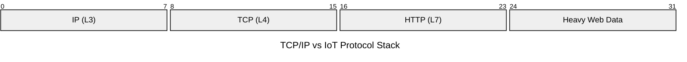
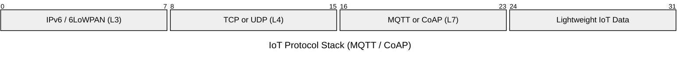
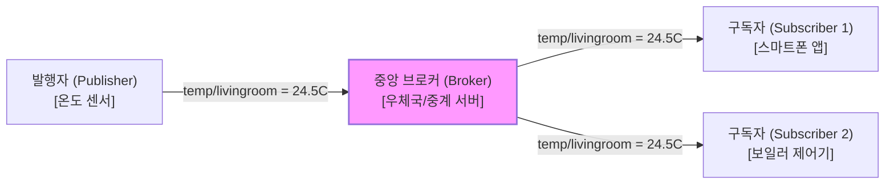
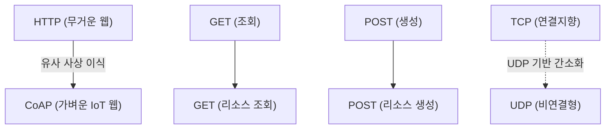

# Summary

정보기술 신기술 및 네트워크 과목에서 출제 비중이 매우 높은 **사물인터넷(IoT) 및 M2M 통신 프로토콜**의 동작 원리, 세부 구조(QoS, 메시지 유형), 그리고 상호 비교를 상세히 분석한 종합 학습 가이드입니다.

---

# 1. IoT 프로토콜 아키텍처 개요

사물인터넷 장치들은 하드웨어 제약(배터리, 메모리)이 크기 때문에, 기존의 무겁고 연결 지향적인 HTTP/TCP 스택 대신 **가볍고(Lightweight) 전력 소모가 적은** 특수한 애플리케이션 프로토콜을 사용합니다.

---

# 2. MQTT (Message Queuing Telemetry Transport) 심화

IBM이 최초 개발하고 OASIS 표준이 된 **TCP 기반의 발행/구독(Publish/Subscribe)** 메시징 프로토콜입니다.

### 2.1 동작 구성 요소

* **발행자 (Publisher)**: 특정 토픽(Topic)에 메시지를 실어 브로커에게 보냅니다.
* **구독자 (Subscriber)**: 관심 있는 토픽을 브로커에 구독 등록해 두고, 메시지가 발행될 때마다 수신합니다.
* **브로커 (Broker)**: 발행자와 구독자 사이에서 메시지 필터링 및 배달을 중계하는 핵심 허브 시스템입니다.
* **토픽 (Topic)**: 슬래시(`/`) 구분자를 사용하는 계층 구조의 메시지 카테고리입니다. (예: `home/livingroom/temperature`)

---

### 2.2 🌟 중요 기출: MQTT QoS (Quality of Service) 3단계 레벨
메시지 전송의 신뢰성을 보장하기 위해 MQTT는 3가지 수준의 QoS를 제공하며, 실기 시험에 아주 자주 출제됩니다.

* **QoS Level 0 (최대 한 번 전송 - At most once)**:
  * 메시지를 보낸 후 도달 여부를 확인하지 않습니다. (Fire and Forget)
  * 패킷 유실 가능성이 있지만, 오버헤드가 가장 낮아 단순 주기적 센서 데이터 전송에 적합합니다.
* **QoS Level 1 (적어도 한 번 전송 - At least once)**:
  * 메시지가 상대방에게 도달했는지 확인(`PUBACK` 수신)할 때까지 반복 전송합니다.
  * 메시지가 반드시 전달됨을 보장하지만, 네트워크 지연 시 **중복 수신**될 가능성이 있습니다.
* **QoS Level 2 (정확히 한 번 전송 - Exactly once)**:
  * 4단계 핸드셰이킹(`PUBLISH` $\rightarrow$ `PUBREC` $\rightarrow$ `PUBREL` $\rightarrow$ `PUBCOMP`)을 통해 **중복 없이 단 한 번만** 안전하게 메시지를 전달합니다.
  * 신뢰성이 극도로 중요한 금융/결제나 제어 명령에 사용되나, 네트워크 오버헤드가 가장 큽니다.

---

# 3. CoAP (Constrained Application Protocol) 심화

자원이 제약된(Constrained) 노드와 네트워크 환경을 위해 IETF Constrained RESTful Environments (core) 워킹그룹에서 제정한 **UDP 기반의 경량 RESTful 프로토콜**입니다.

### 3.1 HTTP와 CoAP의 맵핑 관계
CoAP은 무거운 웹 표준인 HTTP의 대안으로 고안되었기 때문에 HTTP와 거의 1대1 매칭되는 철학을 가지고 있습니다.

* **REST API 지원**: HTTP처럼 `GET`, `POST`, `PUT`, `DELETE` 요청 메서드를 그대로 사용하여 자원을 조작합니다.
* **Observe (관찰) 모드**: 클라이언트가 서버의 특정 리소스를 관찰 대상으로 등록해 두면, 서버의 리소스 상태가 변할 때마다 서버가 클라이언트에게 실시간 비동기 알림을 줍니다. (HTTP의 지속적 요청(Polling) 비효율을 극복)

---

### 3.2 CoAP 메시지 유형 (Message Types)
UDP의 불안정성을 극복하기 위해 CoAP 애플리케이션 계층에서 전송 신뢰성을 직접 제어합니다.

1. **Confirmable (CON)**:
   * 수신측의 응답(ACK)이 반드시 필요한 신뢰성 전송 메시지입니다. ACK가 안 오면 일정 시간 후 재전송합니다.
2. **Non-confirmable (NON)**:
   * 수신측의 응답이 필요 없는 비신뢰성 전송 메시지입니다. (유실되어도 무방한 일반 센서 모니터링 데이터에 사용)
3. **Acknowledgement (ACK)**:
   * CON 메시지를 정상적으로 수신했음을 알리는 응답 메시지입니다.
4. **Reset (RST)**:
   * 수신한 CON/NON 메시지에 오류가 있거나 컨텍스트를 이해할 수 없을 때 전송하는 거부 메시지입니다.

---

# 4. MQTT vs CoAP 최종 비교 분석표

실기 단답형 지문에서 두 프로토콜을 분별하는 기준표입니다.

| 비교 항목 | MQTT | CoAP |
| :--- | :--- | :--- |
| **제정 표준 단체** | OASIS / ISO | IETF |
| **전송 계층 프로토콜** | **TCP** (기본 Port: 1883 / SSL 8883) | **UDP** (기본 Port: 5683 / DTLS 5684) |
| **통신 패러다임** | **발행/구독 (Publish / Subscribe)** | **요청/응답 (Request / Response) & REST** |
| **통신 구조 아키텍처** | 중앙 집중형 (**브로커** 필수 중계) | 1대1 직접 통신 가능 (클라이언트-서버 / Peer-to-Peer) |
| **패킷 헤더 크기** | 최소 **2바이트** 고정 헤더 | 최소 **4바이트** 고정 헤더 |
| **신뢰성 보장 장치** | QoS Level 0, 1, 2 단계 설정 | CON, NON, ACK, RST 메시지 구조화 |
| **주요 활용 처** | 다수의 센서 데이터를 중앙 서버로 수집할 때 | 저사양 단말 간 분산 제어 및 가벼운 웹 요청 시 |

---

# 5. 기타 시험에 출제되는 IoT / M2M 핵심 무선 기술

* **지그비 (ZigBee)**:
  * **핵심어**: **`IEEE 802.15.4`**, **`메쉬(Mesh) 네트워크`**, **`저속/근거리 무선 표준`**
  * **특징**: 스마트홈 센서, 조명 제어 등에 널리 쓰이며, 전력 소모가 극히 적고 단말 간에 그물망(Mesh) 구조를 형성해 전송 신뢰도를 높입니다.
* **로라 (LoRa / Long Range)**:
  * **핵심어**: **`LPWAN (소형 저전력 광대역)`**, **`장거리 무선 통신`**, **`비면허 대역`**
  * **특징**: 수 km에서 수십 km에 이르는 초장거리 통신이 가능하여 가스 검침기, 상하수도 모니터링 등 도시 단위의 IoT 인프라 구축에 최적화되어 있습니다.
* **LWM2M (Lightweight M2M)**:
  * **핵심어**: **`CoAP 기반 디바이스 관리`**, **`OMA 표준`**
  * **특징**: 자원이 제한된 기기들의 설정 갱신, 펌웨어 업데이트, 모니터링을 효율적으로 수행하기 위한 초경량 장치 관리 프로토콜 표준입니다.

---

# Related Concepts
- [정보처리기사 실기 학습 대시보드](index.md)
- [[11과목] 응용 소프트웨어 기초 기술 활용](book2/subject11.md)
- [[5과목] 인터페이스 구현](book1/subject05.md)
- [[4과목] 통합 구현](book1/subject04.md)
- [개인 학습 기록 문서 (260709)](my_study_log_260709.md)
