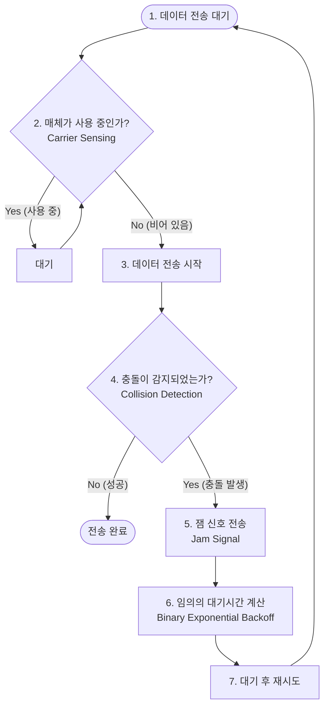
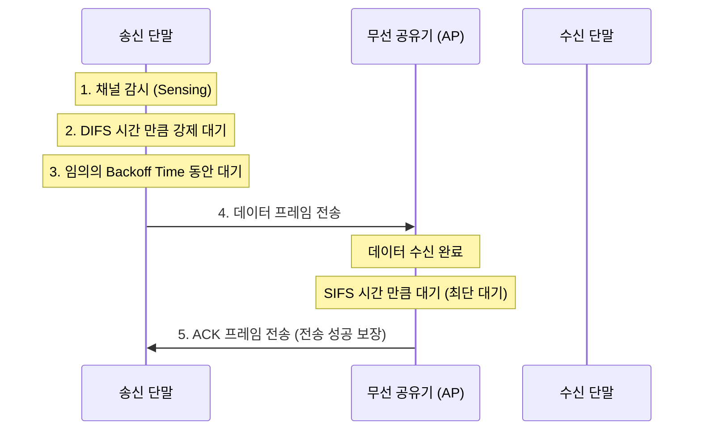
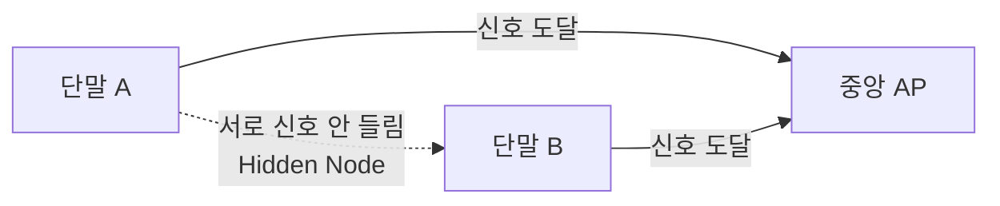

# Summary

네트워크 구축 과목에서 매체 액세스 제어(MAC)의 핵심을 차지하는 **CSMA/CD와 CSMA/CA**의 설계 철학, 상세 동작 절차, 유무선 환경에 따른 기술적 한계 및 해결책(RTS/CTS)을 심층 분석한 종합 학습 가이드입니다.

---

# 1. 다중 접근 제어 (Medium Access Control / MAC) 개요

단일 통신 매체(하나의 유선 케이블 또는 공기 중의 무선 주파수 대역)를 여러 개의 컴퓨터나 단말이 공유하여 데이터를 보낼 때, 신호가 겹쳐서 깨지는 **충돌(Collision)**을 예방하고 조율하는 규칙을 **다중 접근 제어(MAC)**라고 합니다.

---

# 2. CSMA/CD (Collision Detection) - 유선 LAN 표준

* **표준 규격**: **IEEE 802.3** (이더넷 / 유선 LAN)
* **전송 방식**: 반이중 방식 (Half Duplex)
* **사상**: **"말을 꺼내기 전에 먼저 남이 말하고 있는지 듣고(CS), 말이 부딪치면 감지해서(CD) 멈춘다."**

### 2.1 주요 세부 동작
1. **Carrier Sensing (반송파 감지)**: 케이블에 전기 신호가 흐르고 있는지 사전 감시합니다.
2. **Collision Detection (충돌 감지)**: 유선 구리선은 신호의 감쇄가 적어, 내가 보낸 전압 신호와 타인이 보낸 전압 신호가 부딪쳐 전압이 튀는 현상을 물리적으로 즉시 감지할 수 있습니다.
3. **Jam Signal (잼 신호)**: 충돌을 감지한 단말은 네트워크 상의 모든 다른 단말들이 전송을 멈추고 충돌 사실을 알 수 있도록 특수한 방해 신호(Jam Signal)를 브로드캐스트합니다.
4. **Binary Exponential Backoff (이진 지수 백오프)**: 충돌 직후 동시에 재전송을 하면 또 부딪치므로, 충돌 횟수가 늘어날 때마다 대기 시간 범위를 $2^k$ 배수로 늘려 임의의 시간만큼 기다린 후 재시도합니다.

---

# 3. CSMA/CA (Collision Avoidance) - 무선 LAN 표준

* **표준 규격**: **IEEE 802.11** (Wi-Fi / 무선 LAN)
* **전송 방식**: 반이중 방식 (Half Duplex)
* **사상**: **"무선은 내가 쏘는 신호 출력이 너무 강해 수신 안테나가 충돌을 감지할 수 없다. 그러므로 최대한 충돌을 예방(CA)하고 피해야 한다."**

### 3.1 무선에서 충돌 감지(CD)를 못 하는 이유
무선 단말은 안테나 하나로 송수신을 공유하는데, 자신의 송신 신호 출력이 공중을 타고 들어오는 미세한 타인의 수신 신호보다 수만 배 강력합니다. 이 때문에 송신 중에는 타인의 신호 유입을 감지(CD)할 수 없어, **사전에 피하는 회피(CA) 기법**이 필수적입니다.

### 3.2 🌟 중요 기출: 숨겨진 노드 문제(Hidden Node Problem)와 RTS/CTS
무선망에서는 장애물이나 거리 한계 때문에 서로의 존재를 모르는 단말들이 동시에 AP(공유기)로 패킷을 쏘아 충돌이 나는 **숨겨진 노드 문제**가 발생합니다.

* **해결책: RTS/CTS 핸드셰이킹**
  1. 송신 단말은 데이터를 보내기 전, 공유기(AP)에게 **"나 지금 보낼 테니 채널 좀 비워줘"**라는 짧은 제어 패킷인 **`RTS (Request to Send)`**를 보냅니다.
  2. 공유기는 다른 모든 단말이 들을 수 있게 큰 소리로 **"그래, A야 보내라. 딴 놈들은 다 아가리 닥치고 대기해!"**라는 **`CTS (Clear to Send)`** 신호를 보냅니다.
  3. CTS 신호를 들은 주변의 모든 단말(B 포함)은 지정된 시간(NAV) 동안 송신을 강제 중단하고 대기하여 충돌을 회피합니다.

### 3.3 무선 대기 시간: IFS (Inter-Frame Space) 3형제
무선은 우선순위 조율을 위해 프레임 전송 사이에 대기 시간을 둡니다. 대기 시간이 짧을수록 우선순위가 높습니다.

* **SIFS (Short IFS)**: 가장 짧은 대기 시간. 응답 피드백인 **`ACK`**나 **`CTS`** 프레임 전송 시 사용 (가장 중요하므로 우선권 보장).
* **PIFS (PCF IFS)**: 중간 대기 시간. 폴링 기반 제어 시 사용.
* **DIFS (DCF IFS)**: 가장 긴 대기 시간. 일반 **데이터 프레임** 전송 전 채널이 비어 있는지 감시하며 대기하는 표준 시간.

---

# 4. CSMA/CD vs CSMA/CA 최종 비교 분석표

두 프로토콜을 분별하는 핵심 특징 일람표입니다.

| 비교 항목 | CSMA/CD | CSMA/CA |
| :--- | :--- | :--- |
| **적용 매체** | **유선** LAN (IEEE 802.3 이더넷) | **무선** LAN (IEEE 802.11 Wi-Fi) |
| **충돌 제어 방식** | **Detection** (충돌 사후 **감지** 및 수습) | **Avoidance** (충돌 사전 **회피** 및 예방) |
| **충돌 확인 장치** | 잼 신호 (`Jam Signal`), 백오프 대기 | ACK 프레임 응답 확인 필수, 백오프 대기 |
| **숨겨진 노드 대책** | 해당 없음 (유선선로로 신호 공유함) | **`RTS/CTS`** 프레임 도입 해결 |
| **대기 시간 표준** | 없음 (즉시 충돌 감지 전류 모니터링) | **IFS** (DIFS, SIFS 등 우선순위 대기 간격) |
| **효율성** | 오버헤드가 낮고 채널 효율이 높음 | RTS/CTS, ACK 등으로 인해 프로토콜 오버헤드가 큼 |

---

# Related Concepts
- [정보처리기사 실기 학습 대시보드](index.md)
- [[11과목] 응용 소프트웨어 기초 기술 활용](book2/subject11.md)
- [[5과목] 인터페이스 구현](book1/subject05.md)
- [[4과목] 통합 구현](book1/subject04.md)
- [개인 학습 기록 문서 (260709)](my_study_log_260709.md)
