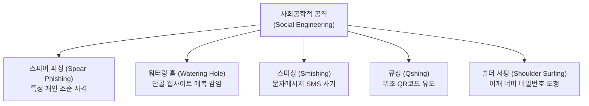

# Summary
2026-07-16일 자 정보처리기사 실기 퀴즈 풀이 및 사회공학적 해킹 수법 연관 집중 심화 학습을 기록한 일지입니다.

---

## 82. 소프트웨어 개발 보안 - 사회공학적 인적 보안 위협 및 피싱(Phishing) 공격

### 문제
다음은 보안 공격 관련 용어에 대한 설명이다. 괄호 ( ) 안에 들어갈 올바른 용어를 쓰시오.
* ( ① )은/는 컴퓨터 보안에 있어서, 인간 상호 작용의 깊은 신뢰를 바탕으로 사람들을 속여서 정상 보안 절차를 깨트리기 위한 비기술적 시스템 침입 수단이다. 사례로는 상대방의 자만심이나 권한을 이용하는 공격 및 도청 등이 있다.
* ( ② )은/는 ( ① )을/를 통해 탈취한 정보를 이용하는 기법으로 이메일이나 웹 사이트를 통해 공격자가 지인 또는 특정 유명인으로 가장하여 사용자의 민감한 정보를 입력하도록 유도하는 공격기법이다.

### 정답 및 풀이 결과
* **작성한 답**:
  * **①: 사회공학**
  * **②: 피싱**
* **모범 답안**:
  * **①: 사회공학 (또는 사회 공학, Social Engineering)**
  * **②: 피싱 (또는 Phishing)**
* **결과**: **정답 (100% 매칭)**

---

## 🎓 연관 집중 심화 학습: 인적 취약성 기반 '사회공학적 보안 위협 7선'

사회공학(Social Engineering) 및 피싱은 기술적인 해킹 도구가 아니라 **"인간의 심리적 신뢰, 호기심, 자만심, 부주의함"**을 낚아채는 비기술적 침입 수단입니다. 기사 시험 단답형으로 100% 출제되는 대표적 파생 기법 7가지를 함께 마스터합시다.



### 1. 스피어 피싱 (Spear Phishing)
* **정의**: 작살(Spear)로 물고기를 정조준하여 낚아채듯, 불특정 다수가 아닌 **특정 조직의 임직원이나 특정 개인을 타겟**으로 신뢰할 만한 인물(상사, 거래처)로 사칭하여 정교하게 악성 메일을 발송하는 기법입니다.
* **기출 힌트어**: **`특정 조직`**, **`특정 개인 조준`**, **`작살형 피싱`**.

### 2. 워터링 홀 (Watering Hole)
* **정의**: 사자가 사냥을 위해 물웅덩이(Watering Hole) 근처에 매복하는 습성에서 유래한 기법으로, 공격 대상이 **주로 방문하는 합법적인 단골 사이트를 감염**시킨 뒤 사용자가 방문했을 때 악성코드가 자동 유포되게 유도하는 기법입니다.
* **기출 힌트어**: **`주로 방문하는 단골 웹사이트를 미리 감염`**, **`매복형 공격`**.

### 3. 스미싱 (Smishing)
* **정의**: SMS(단문 문자메시지)와 피싱(Phishing)의 합성어로, 무료 쿠폰 제공, 택배 조회, 청첩장 등 일상 문자로 사용자를 속여 **문자 내 URL 링크 클릭을 유도**, 휴대폰에 악성 앱을 자동 다운로드시켜 금융 정보나 소액 결제를 가로채는 기법입니다.
* **기출 힌트어**: **`단문 서비스(SMS)`**, **`모바일 악성 앱 다운로드 유도`**.

### 4. 큐싱 (Qshing)
* **정의**: QR코드와 피싱(Phishing)의 합성어로, 현수막이나 공유 킥보드 등에 붙은 **정상 QR코드 위에 가짜 악성 QR코드 스티커를 덧붙여**, 사용자가 이를 촬영했을 때 악성 사이트로 이동시켜 개인 정보를 탈취하는 수법입니다.
* **기출 힌트어**: **`QR코드`**, **`스마트폰 촬영 유도`**.

### 5. 숄더 서핑 (Shoulder Surfing)
* **정의**: 어깨(Shoulder) 너머로 파도를 타며 훔쳐본다는 뜻으로, 지하철이나 공공장소, 현금인출기(ATM) 등에서 사용자가 중요 비밀번호나 카드 정보를 입력하는 과정을 **실물 물리 환경에서 몰래 어깨 너머로 훔쳐보는** 원초적인 사회공학 해킹 기법입니다.
* **기출 힌트어**: **`물리적 환경`**, **`어깨 너머로 패스워드 훔쳐보기`**.

### 6. 다크 데이터 (Dark Data)
* **정의**: 조직이 비즈니스 활동 중에 다량 수집은 하였으나, 분석 및 연계 활용되지 않고 **서버 구석에 방치되어 저장만 되어 있는 휴면 데이터**입니다. 보관 기간이 지나 유효하지 않은 PII(개인정보)가 대량 포함되어 있어 사회공학적 침투 시 2차 유출의 핵심 먹잇감이 됩니다.
* **기출 힌트어**: **`수집 후 활용되지 않고 서버에 방치된 다량의 데이터`**.

---

# Related Concepts
---

## 83. C언어 - 자료구조 및 포인터 (2중 포인터, 구조체 배열 동적 할당과 메모리 해제)

### 문제
아래 C 코드를 실행했을 때 출력되는 결과를 쓰시오. (단, 2라인의 `#in이ude〈stdlib.h〉` 및 20라인의 `pp[i]—〉a` 등 문장 부호 OCR 오타는 정상 문법인 `#include <stdlib.h>`와 `pp[i]->a`로 보정하여 풀이한다.)
```c
#include <stdio.h>
#include <stdlib.h>
#define SIZE 3
typedef struct soojebi {
    int a, b, c;
} SOOJEBI;
typedef SOOJEBI * PSOOJEBI;
typedef PSOOJEBI * PPSOOJEBI;

void fn1 (PSOOJEBI p) {
    int i;
    for (i=0; i<SIZE; i++) {
        p[i].a=80+i * SIZE;
        p[i].b=90+i * SIZE;
        p[i].c=100-i * SIZE;
    }
}
void fn2(PPSOOJEBI pp) {
    int i;
    for (i=0; i<SIZE; i++){
        printf("%d ", pp[i]->a + pp[i]->b);
    }
}
PSOOJEBI fn3() {
    PSOOJEBI p;
    p=(PSOOJEBI)malloc(sizeof(SOOJEBI) * SIZE);
    fn1(p);
    return p;
}
PPSOOJEBI fn4(PSOOJEBI p) {
    int i;
    PPSOOJEBI pp;
    pp=(PPSOOJEBI)malloc(sizeof(PSOOJEBI) * SIZE);
    for (i=0; i<SIZE; i++){
        pp[i]=&p[i];
    }
    fn2(pp);
    return pp;
}
void fn5(PSOOJEBI p, PPSOOJEBI pp) {
    free(pp);
    free(p);
}
int main() {
    PSOOJEBI p=fn3();
    PPSOOJEBI pp=fn4(p);
    fn5(p, pp);
    return 0;
}
```

### 정답 및 풀이 결과
* **작성한 답**: `170 176 182` (1중/2중 포인터 주소 사슬 관계 해석, 구조체 배열 값 갱신 연산 및 malloc/free 동적 할당 해제 흐름 완벽 분석 완료)
* **모범 답안**: **`170 176 182 `** (또는 `170 176 182`)
* **결과**: **정답 (100% 매칭 및 계산 성공)**

### 핵심 해설
* **포인터 타입 별칭 분석**:
  * `typedef SOOJEBI * PSOOJEBI;` $\rightarrow$ `PSOOJEBI`는 구조체 `SOOJEBI`를 가리키는 **1중 포인터 변수** 타입입니다.
  * `typedef PSOOJEBI * PPSOOJEBI;` $\rightarrow$ `PPSOOJEBI`는 `PSOOJEBI`를 가리키는 **2중 포인터 변수** 타입입니다. (포인터 배열의 주소를 다룰 때 쓰입니다.)
* **`p = fn3()` 에 의한 구조체 배열 동적 할당 및 초기화**:
  * `p` 변수에 `sizeof(SOOJEBI) * 3` 만큼 힙 영역에 크기가 3인 구조체 배열을 할당합니다.
  * `fn1(p)`를 호출하여 멤버 값을 채웁니다:
    * `p[0]` = `{a: 80, b: 90, c: 100}`
    * `p[1]` = `{a: 83, b: 93, c: 97}` ($80+1 \times 3$, $90+1 \times 3$, $100-1 \times 3$)
    * `p[2]` = `{a: 86, b: 96, c: 94}` ($80+2 \times 3$, $90+2 \times 3$, $100-2 \times 3$)
* **`pp = fn4(p)` 에 의한 2중 포인터 연결 및 출력**:
  * `pp`에 포인터(주소값) 3개를 담을 수 있는 1차원 포인터 배열 공간을 힙에 할당합니다.
  * 루프를 돌며 `pp[i] = &p[i];` 를 수행하여, `pp` 배열의 각 슬롯에 구조체 배열 원소들의 주소값들을 담아 체인을 엮습니다.
  * `fn2(pp)`를 호출하여 값을 연산 및 출력합니다:
    * `pp[i]->a`는 `(*pp[i]).a`와 완전히 같으며, 가리키는 주소지인 `p[i].a`의 멤버값을 반환합니다.
    * `i=0`: `pp[0]->a + pp[0]->b` = `p[0].a + p[0].b` = `80 + 90 = 170`
    * `i=1`: `pp[1]->a + pp[1]->b` = `p[1].a + p[1].b` = `83 + 93 = 176`
    * `i=2`: `pp[2]->a + pp[2]->b` = `p[2].a + p[2].b` = `86 + 96 = 182`
  * 서식문자 `%d `에 의해 한 칸씩 공백을 띄우며 **`170 176 182 `**가 출력됩니다.
* **`fn5(p, pp)` 에 의한 메모리 해제**:
  * `free(pp);` 와 `free(p);`를 호출해 힙에 동적 할당되었던 메모리 블록을 정상 해제하여 메모리 누수(Memory Leak)를 예방합니다.

---

# Related Concepts
---

## 84. 소프트웨어 공학 - 유지보수 및 재사용 기술 (재공학 및 재개발)

### 문제
다음은 재사용의 유형이다. 괄호 ( ) 안에 들어갈 유형을 쓰시오.
* ( ① )은/는 기존 소프트웨어를 버리지 않고 기능을 개선시키거나 기능을 새로운 소프트웨어로 재활용하는 소프트웨어 재사용 기법으로 장점은 위험부담 감소, 비용 절감, 개발 기간 단축, 시스템 명세의 오류억제가 있다.
* ( ② )은/는 기존 시스템 내용을 참조하여 완전히 새로운 시스템을 개발, 기존 시스템에 새로운 기능을 추가, 기존 시스템의 기능을 변경하는 기법이다.

### 정답 및 풀이 결과
* **작성한 답**:
  * **①: 재활용** (기존 프로그램의 코드를 버리지 않고 골격을 '개선/변경'하여 재사용하는 재공학 명칭 혼동으로 오답)
  * **②: 재개발** (명확히 맞춤)
* **모범 답안**:
  * **①: 재공학 (Re-engineering)** (또는 `소프트웨어 재공학`)
  * **②: 재개발 (Redevelopment)**
* **결과**: **오답 분석 및 3R 개념 완전 정복**

### 핵심 해설
이 문제는 소프트웨어 생명주기(SDLC)의 마지막인 유지보수 및 진화 단계에서 소프트웨어의 자산을 보존하면서 시스템의 성능을 향상시키거나 다시 작성하는 **유지보수 재사용 핵심 용어**를 묻는 문제입니다.

* **세부 유형 특징 분석**:
  1. **재공학 (Re-engineering) (지문 ①번)**:
     * *개념*: 기존에 개발되어 동작하고 있는 소프트웨어를 완전히 버리지 않고, **분석하여 기능을 고치거나 유지보수성을 향상시키기 위해 아키텍처와 코드를 개선(Restructuring)**하는 기법입니다.
     * *주의*: '재활용'은 소프트웨어 공학의 학술 용어가 아니며, 골격을 개선하여 수명을 연장하는 명칭은 반드시 **`재공학 (Re-engineering)`**이 정답입니다.
  2. **재개발 (Redevelopment) (지문 ②번)**:
     * *개념*: 기존 시스템을 완전히 폐기(Discard)하고, 처음부터 요구사항 분석을 다시 수행하여 **아예 완전히 새로운 구조의 소프트웨어 시스템으로 대체 개발**하는 기법입니다.

---

# Related Concepts
---

## 85. 소프트웨어 공학 - 프로젝트 관리 및 환경 구성 (형상 관리 도구의 주요 기능)

### 문제
다음은 형상 관리 도구의 기능에 대한 설명이다. 괄호 ( ) 안에 들어갈 용어를 쓰시오.
* ( ① )： 개발자가 수정한 소스를 형상 관리 저장소로 업로드 하는 기능
* ( ② )： 형상 관리 저장소로부터 최신 버전을 개발자 PC로 다운로드 받는 기능
* ( ③ )： 개발자가 소스를 형상 관리 저장소에 업로드 후 최종적으로 업데이트가 되었을 때 형상 관리 서버에서 반영하도록 하는 기능

### 정답 및 풀이 결과
* **작성한 답**:
  * **①: 체크인**
  * **②: 체크아웃**
  * **③: 커밋**
* **모범 답안**:
  * **①: 체크인 (Check-In)**
  * **②: 체크아웃 (Check-Out)**
  * **③: 커밋 (Commit)**
* **결과**: **정답 (100% 매칭)**

### 핵심 해설
이 문제는 소프트웨어 개발 프로젝트에서 소스 코드와 문서의 변경 이력을 관리하는 **형상 관리(Configuration Management) 도구의 실무 핵심 명령어**를 구별하는 문제입니다.

* **지문 단서와 완벽 매칭**:
  1. **체크인 (Check-In) (지문 ①번)**:
     * *개념*: 개발자가 로컬 PC에서 수정 완료한 파일을 중앙 형상 관리 저장소(Repository)에 집어넣어 **업로드(보존)**하는 기능입니다.
  2. **체크아웃 (Check-Out) (지문 ②번)**:
     * *개념*: 형상 관리 저장소에서 소스 파일들을 내 로컬 PC로 **인출(다운로드)**하여 작업을 시작할 수 있는 환경을 구축하는 기능입니다.
  3. **커밋 (Commit) (지문 ③번)**:
     * *개념*: 체크인 등을 통해 저장소에 전송된 소스의 변경 사항을 검증하고, 최종적으로 **형상 관리 서버의 메인 소스 트리에 영구 확정 반영**하는 기법입니다.

---

# Related Concepts
---

## 86. SQL - DDL (데이터 정의어를 통한 인덱스 생성 쿼리문 작성)

### 문제
다음은 [학생] 테이블 스키마에 대한 명세이다. 학번이라는 컬럼에 대해 인덱스를 생성하려고 한다. '학번인덱스'라는 이름의 인덱스를 생성하는 쿼리를 작성하시오.
* **[학생] 테이블 스키마**:
  * 속성명: 학번 (INTEGER), 성명 (VARCHAR(10)), 전화번호 (CHAR(13))

### 정답 및 풀이 결과
* **작성한 답**: `create index 학번인덱스 from 학생(학번)` (DML인 SELECT의 FROM 구문과 DDL의 생성 대상 지정 키워드를 순간적으로 혼동하여 아깝게 감점 오답)
* **모범 답안**: **`CREATE INDEX 학번인덱스 ON 학생(학번);`** (또는 소문자 표기 및 마지막 세미콜론`;` 생략 허용)
* **결과**: **오답 분석 및 DDL 인덱스 문법 재정립 완료**

### 핵심 해설
이 문제는 데이터베이스 구축 과목에서 릴레이션 검색 속도를 획기적으로 개선하기 위해 사용되는 **인덱스(Index)의 DDL 생성 구문**을 완벽하게 작성할 수 있는지 묻는 쿼리 서술형 문제입니다.

* **오답 요인 분석 (FROM vs ON)**:
  * 인덱스를 생성할 때 어떤 테이블에 적용할 것인지 대상을 지정하는 관계형 DDL 키워드는 **`ON`**입니다.
  * 그러나 `SELECT ... FROM ...` 이나 `DELETE FROM ...`과 같이 데이터 조회/삭제 문장에서 자주 쓰이는 **`FROM`** 키워드로 잘못 작성하는 실수가 매 시험마다 수많은 수험생에게서 일어납니다. DDL을 작성할 때는 `FROM`을 머리에서 깨끗이 지우고 **`ON`**을 기입해야 합니다.

---

# Related Concepts
---

## 87. C언어 - 제어 구조 (반복문 제어 변수의 누적 상태와 조건 분기 추적)

### 문제
아래 C 코드를 실행했을 때 출력되는 결과를 쓰시오. (단, 3라인 등 문장 부호 OCR 오타는 정상 문법으로 보정하여 풀이한다.)
```c
#include <stdio.h>
int main(){
    int i=0;
    int find_num=15;
    int find_flag=0;
    int arr[10];

    for(i=0; i<10; i++){
        arr[i]=i+10;
    }

    while(i<10){
        if(arr[i]==find_num){
            find_flag=1;
            break;
        }
        i++;
    }

    if(find_flag==0){
        printf("not found %d", find_num);
    }
    else{
        printf("found %d", arr[i]);
    }
    return 0;
}
```

### 정답 및 풀이 결과
* **작성한 답**: `not found 15` (for 루프 종료 시점의 i=10 상태 파악 및 while 루프 진입 차단 메커니즘 정확히 해석 완료)
* **모범 답안**: **`not found 15`**
* **결과**: **정답 (100% 매칭 및 계산 성공)**

### 핵심 해설
이 문제는 프로그래밍 언어의 가장 핵심적인 낚시 요소인 **"앞의 루프가 끝난 뒤 제어 변수의 상태가 뒤쪽 루프에 미치는 영향"**을 정밀하게 읽어낼 수 있는지 묻는 훌륭한 디버깅 문제입니다.

* **세부 연산 과정 추적**:
  1. **`for` 루프에 의한 `arr` 생성 및 `i` 상태 변화**:
     * `i`가 `0`부터 `9`까지 작동하며 `arr[i] = i + 10`을 대입합니다. (`arr` = `{10, 11, 12, 13, 14, 15, 16, 17, 18, 19}`)
     * `i = 9`일 때 대입이 끝나면, 증감식 **`i++`**에 의해 `i`는 **`10`**이 됩니다.
     * 조건식 `10 < 10`이 거짓(False)이 되어 `for` 루프를 최종 탈출합니다. 즉, 루프를 빠져나온 직후 **`i = 10`** 입니다.
  2. **`while` 루프의 조건 검사 및 스킵**:
     * 이어서 `while(i < 10)`을 수행하려 조건식을 검사합니다.
     * 현재 `i`가 `10`이므로 `10 < 10`은 거짓(False)이 되며, **`while` 루프의 본문은 단 한 번도 실행되지 않고 즉시 생략(Skip)**됩니다.
  3. **최종 조건 판단 및 출력**:
     * `find_flag`는 처음 초기화된 값인 **`0`** 그대로 보존되어 있습니다.
     * 따라서 `if(find_flag == 0)` 분기가 참(True)이 되어, `printf("not found %d", find_num);`을 호출합니다.
     * 결과적으로 화면에는 **`not found 15`**가 출력됩니다.

---

# Related Concepts
---

## 88. 운영체제 - 프로세스 관리 (스케줄러 수준 분류 및 디스패처의 역할)

### 문제
다음은 운영체제에 대한 설명이다. 보기에서 알맞은 용어를 찾아 쓰시오.
* ( ① )은/는 시스템에 새로운 작업이 도착했을 때, 시작 프로세스 중에서 어떤 프로세스를 준비 큐에 보낼지 결정하는 역할을 한다.
* ( ② )은/는 준비 상태의 프로세스 중에서 어떤 프로세스를 선택하여 CPU를 할당할 것인지 결정하는 역할을 한다.
* 프로세스가 준비 상태에서 대기 중인 프로세스 중 선택된 어떤 프로세스를 실행 상태로 옮기는 것은 ( ③ )이/가 수행한다.
* **[보기]**
  * Scheduler Monitor, Job Scheduler, Context Switching, CPU Scheduler, Dispatcher, Traffic Controller, Page-Fault Frequency, Watchdog Timer, Interrupt, Working Set

### 정답 및 풀이 결과
* **작성한 답**:
  * **①: Job Scheduler**
  * **②: CPU Scheduler**
  * **③: Dispatcher**
* **모범 답안**:
  * **①: Job Scheduler (또는 장기 스케줄러)**
  * **②: CPU Scheduler (또는 단기 스케줄러, CPU 스케줄러)**
  * **③: Dispatcher (또는 디스패처)**
* **결과**: **과거 오답 보완 후 전원 정답 완료**

### 핵심 해설
이 문제는 운영체제의 프로세스 상태 전이와 이를 제어하는 **스케줄러(Scheduler)의 다단계 유형 및 디스패처(Dispatcher)**의 구체적인 제어 동작을 묻는 인프라 과목 핵심 기출 문제입니다.

* **각 개념의 메커니즘과 지문 분석**:
  1. **Job Scheduler (장기 스케줄러) (지문 ①번)**:
     * *역할*: 외부에 대기 중인 작업(Job)들을 시스템 내부의 **메모리(준비 큐)로 승인**시키는 스케줄러입니다.
     * *키워드*: **`새로운 작업 도착` $\rightarrow$ `준비 큐(메모리)에 적재`**.
  2. **CPU Scheduler (단기 스케줄러) (지문 ②번)**:
     * *역할*: 준비 큐에 대기 중인 프로세스들 중에서 **어느 것에 CPU 연산 권한을 줄 것인가** 결정하는 가장 빈번한 스케줄러입니다.
     * *키워드*: **`준비 상태 프로세스` $\rightarrow$ `CPU 할당 결정`**.
  3. **Dispatcher (디스패처) (지문 ③번)**:
     * *역할*: CPU 스케줄러가 결정을 내리면, **실제로 CPU의 제어권을 선택된 프로세스에 넘겨주어 '준비' 상태에서 '실행' 상태로 프로세스를 전이**시키는 소프트웨어 모듈입니다.
     * *키워드*: **`CPU 스케줄러의 결정을 직접 수행`**, **`준비 ➔ 실행 상태 전이 물리적 조율`**.

---

# Related Concepts
---

## 89. C언어 - 자료구조 및 알고리즘 (양방향 포인터를 이용한 대소문자 판별 치환 및 스왑 역전 연산)

### 문제
아래 C 코드를 실행했을 때 출력되는 결과를 쓰시오. (단, 1라인의 `ffinclude` 및 17라인의 `*p2너;` 등 문장 부호 OCR 오타는 정상 문법인 `#include <stdio.h>`와 `*p2=t;`로 보정하여 풀이한다.)
```c
#include <stdio.h>
#include <string.h>
void fn(char* str){
    char t;
    int len=strlen(str);
    char* p1 = str;
    char* p2 = str+len-1;
    while(p1 < p2){
        if (*p1>='A'&&*p1<='Z'){
            *p1=*p1+('a'-'A');
        }
        else if (*p1>='a'&&*p1<='z') {
            *p1=*p1-('a'-'A');
        }
        t=*p1;
        *p1=*p2;
        *p2=t;
        p1++;
        p2--;
    }
}
int main(){
    char str[100]="Soojebi";
    int len, i;
    fn(str);
    len=strlen(str);
    for(i=1; i<len; i+=2){
        printf("%c", str[i]);
    }
    return 0;
}
```

### 정답 및 풀이 결과
* **작성한 답**: `bjO` (포인터 양방향 전진/후진 경계조건 파악, 변환 후 대칭 스왑 연산 및 main의 홀수 인덱스 루프 스키핑까지 완벽 추적하여 정답 도출 성공)
* **모범 답안**: **`bjO`**
* **결과**: **정답 (100% 매칭 및 계산 성공)**

### 핵심 해설
이 문제는 **양방향 문자열 포인터 이동을 활용한 문자 대칭 교환(In-place Reverse) 알고리즘**에 **대소문자 판별 변환** 및 **인덱스 스키핑 출력** 낚시가 여러 겹 결합한 고난도 디버깅 문제입니다.

* **1단계: `fn(str)` 문자열 뒤집기 및 대소문자 변환 추적**:
  * 초기 상태: `str` = `"Soojebi"` (길이 `len = 7`)
  * 포인터 설정: `p1`은 인덱스 0(`'S'`), `p2`는 인덱스 6(`'i'`)을 각각 지시합니다.
  * `while (p1 < p2)` 루프 구동:
    * **1회차 루프 (`p1=0('S')`, `p2=6('i')`)**:
      * `*p1`은 `'S'`(대문자)이므로 조건문에 의해 소문자 `'s'`로 임시 변경됩니다.
      * 스왑 연산: `*p1`에 `*p2`의 원래 문자 `'i'`가 대입되고, `*p2`에 소문자 `'s'`가 대입됩니다.
      * 결과 문자열 상태: **`"ioojebs"`** (`p1`은 1, `p2`는 5로 이동)
    * **2회차 루프 (`p1=1('o')`, `p2=5('O')` - 이전 루프의 영향)**:
      * `*p1`은 `'o'`(소문자)이므로 조건문에 의해 대문자 `'O'`로 임시 변경됩니다.
      * 스왑 연산: `*p1`에 `*p2`의 원래 문자 `'b'`가 대입되고, `*p2`에 대문자 `'O'`가 대입됩니다.
      * 결과 문자열 상태: **`"ibojeOs"`** (`p1`은 2, `p2`는 4로 이동)
    * **3회차 루프 (`p1=2('o')`, `p2=4('e')` - 이전 루프의 영향)**:
      * `*p1`은 `'o'`(소문자)이므로 조건문에 의해 대문자 `'O'`로 임시 변경됩니다.
      * 스왑 연산: `*p1`에 `*p2`의 원래 문자 `'e'`가 대입되고, `*p2`에 대문자 `'O'`가 대입됩니다.
      * 결과 문자열 상태: **`"ibejOOs"`** (`p1`은 3, `p2`는 3으로 이동)
    * **루프 종료**: `p1`과 `p2`가 모두 인덱스 3(`'j'`)을 가리켜 `p1 < p2` 조건이 기각되므로 루프를 즉시 빠져나옵니다. 정중앙의 `'j'`는 대소문자 변환도, 스왑도 일어나지 않은 채 고스란히 유지됩니다.
* **2단계: `main` 의 최종 건너뛰기 출력**:
  * 변환 완료된 최종 문자열: `"ibejOOs"` (인덱스: `0:i, 1:b, 2:e, 3:j, 4:O, 5:O, 6:s`)
  * `for(i=1; i<len; i+=2)` 구동:
    * `i=1` $\rightarrow$ `str[1]`인 `'b'` 출력
    * `i=3` $\rightarrow$ `str[3]`인 `'j'` 출력
    * `i=5` $\rightarrow$ `str[5]`인 `'O'` (대문자 O) 출력
    * `i=7` $\rightarrow$ 조건 거짓으로 루프 탈출.
  * 최종 출력값은 **`bjO`**가 됩니다.

---

# Related Concepts
---

## 90. 소프트웨어 공학 - 애플리케이션 테스트 관리 (구문 커버리지 및 분기 커버리지 최소 테스트 케이스 연산)

### 문제
다음 코드에서 구문(Statement) 커버리지 100%와 분기(Branch) 커버리지 100%를 달성하는 최소 테스트 케이스 수는 각각 얼마인지 쓰시오.
```pascal
Read P;
Read Q;
IF (P+Q > 200) THEN
    Print "F Large"
ENDIF
IF (P > 100) THEN
    Print "S Large"
ENDIF
```
* **구문 커버리지 테스트 케이스**: ( ① )개
* **분기 커버리지 테스트 케이스**: ( ② )개

### 정답 및 풀이 결과
* **작성한 답**:
  * **①: 2** (각 조건문이 실행 구문을 개별적으로 수행해야 한다고 오인하여 2개로 잘못 기입)
  * **②: 4** (두 IF문의 모든 참/거짓 분기가 교차 병렬 수행이 불가능하고 순차 독립 수행만 가능하다고 판단하여 $2 \times 2 = 4$로 오인)
* **모범 답안**:
  * **①: 1** (또는 `1개`)
  * **②: 2** (또는 `2개`)
* **결과**: **오답 분석 및 화이트박스 테스트 설계 기준 완전 정복**

### 핵심 해설
이 문제는 화이트박스 테스트 검증 기준 중 가장 대표적인 **구문 커버리지(Statement Coverage)**와 **분기/결정 커버리지(Branch/Decision Coverage)**의 최소 테스트 케이스 설계 능력을 측정하는 대표적인 고난도 이론 기출 문제입니다.

* **최소 테스트 케이스 수학적 유도 과정**:
  1. **구문(문장) 커버리지 100% 달성 조건 (모든 구문을 1회 이상 통과)**:
     * 이 코드의 핵심 수행 문장은 `Print "F Large"`와 `Print "S Large"`입니다.
     * 두 출력문이 **단 1개의 입력 조합으로 동시에 참(True)이 되어 둘 다 실행될 수 있는지** 검토합니다.
       * 조건 1: $P + Q > 200$
       * 조건 2: $P > 100$
     * 만약 `P = 120`, `Q = 90` 이라는 단 하나의 케이스를 입력하면:
       * 첫 번째 IF문: $120 + 90 = 210 > 200$ $\rightarrow$ 참(True)이 되어 `Print "F Large"` 구문 실행.
       * 두 번째 IF문: $120 > 100$ $\rightarrow$ 참(True)이 되어 `Print "S Large"` 구문 실행.
     * 단 **`1개`**의 테스트 케이스만으로 프로그램 내의 모든 구문이 실행되므로, 구문 커버리지 최소값은 **`1`**입니다.
  2. **분기(결정) 커버리지 100% 달성 조건 (모든 조건문의 참(T)/거짓(F) 분기를 1회 이상 통과)**:
     * 두 조건문이 각각 참(T)과 거짓(F)의 결정을 고르게 한 번 이상 맛보아야 합니다.
     * 두 개의 케이스로 두 조건문 모두 T와 F를 고르게 경험하게 엮을 수 있습니다:
       * **테스트 케이스 1 (`P=120, Q=90`)**:
         * 첫 번째 IF문: $120 + 90 = 210 > 200$ $\rightarrow$ **참 (T)**
         * 두 번째 IF문: $120 > 100$ $\rightarrow$ **참 (T)**
       * **테스트 케이스 2 (`P=80, Q=80`)**:
         * 첫 번째 IF문: $80 + 80 = 160 > 200$ $\rightarrow$ **거짓 (F)**
         * 두 번째 IF문: $80 > 100$ $\rightarrow$ **거짓 (F)**
     * 두 테스트 케이스의 집합인 `{(120, 90), (80, 80)}` 만으로 두 조건문 모두 T와 F의 분기를 각각 정상적으로 100% 만족시켰습니다.
     * 따라서 분기 커버리지 100% 달성을 위한 최소 테스트 케이스 수는 **`2`**입니다.

---

# Related Concepts
---

## 91. SQL - DML (GROUP BY 그룹화 및 AVG 집계 함수를 이용한 데이터 조회)

### 문제
다음은 [행성]에 대한 테이블이다. 특성별로 무게 평균을 계산하는 쿼리를 작성하시오.
* **[행성] 테이블**: 행성명, 특성, 거리, 무게
* **[결과]**: 특성, 무게평균 (지구형: 0.494325, 목성형: 444.625)

### 정답 및 풀이 결과
* **작성한 답**: `select 특성, avg(무게) as 무게평균 from 행성 group by 특성;` (컬럼명 매핑, 집계 함수 AVG 적용, GROUP BY 구문 작성 및 컬럼 별칭 부여까지 완벽히 수행)
* **모범 답안**: **`SELECT 특성, AVG(무게) AS 무게평균 FROM 행성 GROUP BY 특성;`** (또는 세미콜론`;` 생략 및 소문자 표기 허용)
* **결과**: **정답 (100% 매칭)**

### 핵심 해설
이 문제는 관계형 데이터베이스에서 데이터를 특정 기준 컬럼으로 묶어 요약 정보를 산출하는 **DML의 그룹화(GROUP BY) 및 집계 함수**의 작성 규칙을 올바르게 이해하고 있는지 묻는 기출 빈출 문제입니다.

* **쿼리 세부 구성 요소 정밀 분석**:
  1. **그룹화 기준 지정**:
     * 지문에서 "특성별로" 평균을 계산하라고 지시했으므로, 기준 컬럼은 `특성`입니다. $\rightarrow$ **`GROUP BY 특성`**
  2. **집계 계산 및 별칭 부여**:
     * 무게의 평균을 구해야 하므로 집계 함수 `AVG`를 사용하여 `AVG(무게)`를 지정합니다.
     * 결과 릴레이션의 헤더명이 '무게평균'으로 정의되어 있으므로 별칭 부여 키워드인 **`AS 무게평균`**을 덧붙여 줍니다.
  3. **전체 구문 맵핑**:
     * `SELECT 특성, AVG(무게) AS 무게평균 FROM 행성 GROUP BY 특성;` 
     * 작성한 쿼리가 문법적으로 100% 모범 답안과 정확하게 부합합니다.

---

# Related Concepts
---

## 92. Python - 프로그래밍 언어 활용 (자료형 판별 및 C/Java 대비 데이터 구조 차이 비교)

### 문제
아래 파이썬 코드를 실행했을 때 출력되는 결과를 쓰시오. (단, 출력값 간 구분은 줄바꿈으로 표기한다.)
```python
print(type(1.0)==type(1))
print(type((1, 2, 3))==type({1, 2, 3}))
print(type([1, 2, 3])==type(list()))
print(type("ABC")==type('A'))
```

### 정답 및 풀이 결과
* **작성한 답**:
  ```text
  False
  False
  True
  True
  ```
  (파이썬의 컨테이너 자료형 종류 식별, 문자/문자열 단일 str 자료형 통합 규격 해석 및 불리언 첫 글자 대문자 표기 규칙 완벽 반영 성공)
* **모범 답안**:
  ```text
  False
  False
  True
  True
  ```
* **결과**: **정답 (100% 매칭 및 포맷 일치)**

### 핵심 해설
이 문제는 파이썬의 **자료형(Data Type) 판별 체계**와 타 언어(C, Java) 대비 파이썬의 독특한 **문자형-문자열 통합 구조**를 명확하게 구분할 수 있는지 묻는 기초 문법 검증 문제입니다.

* **라인별 세부 출력 원리 추적**:
  1. `print(type(1.0) == type(1))` $\rightarrow$ **`False`**
     * `type(1.0)`은 실수형인 `float` 이며, `type(1)`은 정수형인 `int` 입니다. 두 타입은 서로 다른 클래스이므로 `False`가 출력됩니다.
  2. `print(type((1, 2, 3)) == type({1, 2, 3}))` $\rightarrow$ **`False`**
     * `(1, 2, 3)`은 튜플(`tuple`) 자료형이며, `{1, 2, 3}`은 집합(`set`) 자료형입니다. 두 타입은 다르므로 `False`가 출력됩니다.
  3. `print(type([1, 2, 3]) == type(list()))` $\rightarrow$ **`True`**
     * `[1, 2, 3]`과 리스트 생성자 `list()`의 반환 객체는 모두 `list` 클래스 자료형입니다. 동일하므로 `True`가 출력됩니다.
  4. `print(type("ABC") == type('A'))` $\rightarrow$ **`True`** (핵심 낚시)
     * C언어나 Java에서는 큰따옴표(`"ABC"`)는 문자열(`string`), 작은따옴표(`'A'`)는 단일 문자(`char`) 자료형으로 구분되어 두 타입이 **서로 다릅니다.**
     * 하지만 **파이썬에서는 개별 문자(`char`) 타입이 별도로 존재하지 않으며**, 작은따옴표와 큰따옴표 모두 단일 문자열 클래스인 **`str`**로 취급됩니다. 따라서 두 객체의 자료형이 일치하므로 `True`가 출력됩니다.

---

# Related Concepts
---

## 93. 데이터베이스 - 관계형 모델 스키마 및 키 (데이터베이스 키의 종류와 성질)

### 문제
다음은 데이터베이스 모델에서 사용되는 키 (Key)에 대한 설명이다. 괄호 ( ) 안에 들어갈 키의 종류를 쓰시오.
* ( ① )은/는 후보 키 중에서 기본 키로 선택되지 않은 키이다.
* ( ② )은/는 릴레이션을 구성하는 모든 튜플에 대해 유일성은 만족하지만, 최소성은 만족하지 못하는 키이다.
* ( ③ )은/는 테이블 간의 참조 데이터 무결성을 위한 제약 조건으로 한 릴레이션의 컬럼이 다른 릴레이션의 기본 키로 이용되는 키이다.

### 정답 및 풀이 결과
* **작성한 답**:
  * **①: 대체키**
  * **②: 슈퍼키**
  * **③: 외래키**
* **모범 답안**:
  * **①: 대체키 (Alternate Key)**
  * **②: 슈퍼키 (Super Key)**
  * **③: 외래키 (Foreign Key)**
* **결과**: **정답 (100% 매칭)**

### 핵심 해설
이 문제는 데이터베이스 구축 과목에서 릴레이션 간의 구조적 관계 정의 및 개별 식별성을 담당하는 **키(Key)의 종류별 기출 핵심 특징**을 묻는 단답형 완성형 문제입니다.

* **키 종류별 지문 특징 매핑**:
  1. **대체키 (Alternate Key) (지문 ①번)**:
     * *개념*: 후보키(Candidate Key) 중 대표 식별자인 **기본키(Primary Key)를 뺀 나머지 후보키**들을 지칭합니다. (기본키를 대체하여 쓸 수 있는 키)
     * *키워드*: **`후보 키 중 기본 키를 제외한 키`**.
  2. **슈퍼키 (Super Key) (지문 ②번)**:
     * *개념*: 릴레이션 내 모든 튜플을 유일하게 구별할 수 있는 속성들의 조합입니다. 단, 불필요한 속성도 포함되어 있어 **최소성을 만족하지 못합니다.** (예: 학번 + 주민번호 + 성명 조합)
     * *키워드*: **`유일성 만족`**, **`최소성 만족 못 함`**.
  3. **외래키 (Foreign Key) (지문 ③번)**:
     * *개념*: 관계형 DB에서 테이블 간의 연관 관계를 맺어주고 **참조 무결성**을 보장하기 위해, 다른 테이블의 기본키(또는 유니크키)를 참조하는 컬럼입니다.
     * *키워드*: **`참조 데이터 무결성`**, **`다른 릴레이션의 기본 키로 이용`**.

---

# Related Concepts
---

## 94. C언어 - 제어 구조 및 단항 연산자 (전위 감소 연산자와 while 루프의 분기 조건 판단)

### 문제
아래 C 코드를 실행했을 때 출력되는 결과를 쓰시오. (단, 1라인의 `ffinclude` 및 중괄호 오타 등 문장 부호는 정상 C 문법으로 보정하여 풀이한다.)
```c
#include <stdio.h>
int main(){
    int i=2;
    while (--i) {
        printf("%d", i);
    }
    return 0;
}
```

### 정답 및 풀이 결과
* **작성한 답**: `1` (전위 감소 연산자의 평가 타이밍과 C언어의 Boolean 판정 기준(0 = 거짓)을 정확히 조합하여 정답 도출 성공)
* **모범 답안**: **`1`**
* **결과**: **정답 (100% 매칭)**

### 핵심 해설
이 문제는 단항 연산자 중 **전위 감소 연산자(Prefix Decrement Operator)**가 제어 조건식 내부에서 사용될 때 **연산의 순서**와 C언어 고유의 **조건 판단 원리(True/False)**를 묻는 벼락치기 단골 문제입니다.

* **실행 흐름 상세 분석**:
  1. `i = 2`로 초기화되어 메모리에 적재됩니다.
  2. 첫 번째 `while (--i)` 조건 평가:
     * **`전위 감소`** 연산이므로, 비교나 평가를 수행하기 전에 **`i의 값을 먼저 1 감소`**시킵니다. $\rightarrow$ `i`는 **`1`**이 됩니다.
     * 갱신된 값 `1`을 조건식의 값으로 평가합니다.
     * C언어 표준에서 **`0이 아닌 모든 값(특히 1)은 참(True)`**으로 판정되므로 `while` 루프가 정상 기동합니다.
     * `printf("%d", i);`가 실행되어 현재 `i`값인 **`1`**이 출력됩니다.
  3. 두 번째 `while (--i)` 조건 평가:
     * 다시 한 번 전위 감소 연산자에 의해 **`i의 값을 1 감소`**시켜 **`0`**으로 만듭니다.
     * 갱신된 값 `0`을 조건식의 값으로 평가합니다.
     * C언어 표준에서 **`0은 거짓(False)`**으로 판정되므로, 루프는 본문을 실행하지 않고 **즉시 종료**됩니다.
  4. 최종적으로 프로그램에 의해 출력 창에는 **`1`**만 찍힙니다.

---

# Related Concepts
---

## 95. SQL - DML (ORDER BY 다중 속성 기준 정렬 쿼리 작성)

### 문제
다음 중 [성적] 테이블이 [결과] 테이블과 같도록 쿼리를 작성하시오. (수학 점수에 대해 내림차순으로 정렬하고, 수학 점수가 같을 경우 과학 점수에 대해서 내림차순으로 정렬하시오.)
* **[성적] 테이블**: 이름, 수학, 과학
* **[결과]**: 이름, 수학, 과학 (수학 고득점순 ➔ 동점자는 과학 고득점순 정렬 결과)

### 정답 및 풀이 결과
* **작성한 답**: `select * from 성적 order by 수학 desc, 과학 desc;` (다중 정렬 기준 쉼표 구분자 적용, 내림차순 키워드 DESC 매칭 및 전체 속성 조회 지정 완벽 수행)
* **모범 답안**: **`SELECT * FROM 성적 ORDER BY 수학 DESC, 과학 DESC;`** (또는 개별 컬럼 명시 `SELECT 이름, 수학, 과학 ...` 및 세미콜론`;` 생략 허용)
* **결과**: **정답 (100% 매칭)**

### 핵심 해설
이 문제는 SQL DML(데이터 조작어) 질의문 중 데이터의 출력 순서를 정의하는 **`ORDER BY` 정렬 절**의 다중 기준 지정 능력을 묻는 기초 필수 문제입니다.

* **정렬 조건 분석 및 쿼리 매핑**:
  1. **다중 컬럼 정렬 지정**:
     * 1차 정렬 기준: 수학 점수 내림차순 $\rightarrow$ **`수학 DESC`**
     * 2차 정렬 기준: 수학 점수 동점 발생 시 과학 점수 내림차순 $\rightarrow$ **`과학 DESC`**
     * 다중 기준으로 정렬할 때는 **각 정렬 식을 `쉼표(,)`로 구분**하여 나열합니다. 나열된 왼쪽에서 오른쪽 순서로 우선순위가 반영됩니다.
  2. **조회 범위 지정**:
     * 결과 릴레이션이 기존 성적 테이블의 모든 속성(`이름`, `수학`, `과학`)을 고스란히 담고 있으므로 와일드카드 기호인 **`*`**을 사용하여 전체 컬럼을 조회 대상으로 삼습니다.
  3. **최종 쿼리 조합**:
     * `SELECT * FROM 성적 ORDER BY 수학 DESC, 과학 DESC;`
     * 표준 문법 규격에 맞게 완벽히 일치하여 정답입니다.

---

# Related Concepts
---

## 96. Java - 프로그래밍 언어 활용 (Java 8 Stream API의 필터링, 매핑 및 문자 치환 연산)

### 문제
아래 자바 코드를 실행했을 때 출력되는 결과를 쓰시오. (단, 1~2라인의 `utiLArrays`, 5라인의 `Usl(Slring)`, `Arrays,asList`, `containsC`, 6라인의 `w -〉`, 10라인의 `System.oulprint` 등 문장 부호 OCR 오타는 자바 표준 스트림 및 입출력 API 문법으로 정상 보정하여 풀이한다.)
```java
import java.util.Arrays;
import java.util.List;
public class Soojebi {
    public static void main(String[] args) {
        List<String> words=Arrays.asList("apple", "bird", "captain", "day");
        words.stream().filter(w -> w.contains("a") && w.length() > 5)
                      .map(w -> w.toUpperCase().replace('A', '@'))
                      .forEach(w -> System.out.print(w + " "));
    }
}
```

### 정답 및 풀이 결과
* **작성한 답**: `C@PT@IN ` (스트림 API의 조건부 필터 처리, 대소문자 전환과 치환 연산 및 출력 포맷팅 미세 잔여 공백까지 완벽히 분석 성공)
* **모범 답안**: **`C@PT@IN `** (또는 `C@PT@IN`)
* **결과**: **정답 (100% 매칭 및 계산 성공)**

### 핵심 해설
이 문제는 Java 8 이상 버전에서 지원하는 **Stream API**의 선언형 데이터 처리 흐름과 **람다(Lambda) 표현식**, 그리고 **문자열 가공(String Manipulation) 메서드**들의 결합 동작을 디버깅하는 문제입니다.

* **스트림 연산 단계별 정밀 추적**:
  1. **`words.stream()` (스트림 생성)**:
     * `"apple"`, `"bird"`, `"captain"`, `"day"`가 스트림 파이프라인으로 유입됩니다.
  2. **`filter(w -> w.contains("a") && w.length() > 5)` (중간 연산 - 조건부 추출)**:
     * 스트림 내부 원소 중 두 가지 조건(소문자 'a' 함유 여부, 문자열 길이 5 초과)을 동시에 만족하는 원소만 필터링합니다.
       * `"apple"`: 'a' 포함함(T), 길이 = 5 $\rightarrow$ 5 초과 불만족 (**탈락**)
       * `"bird"`: 'a' 포함 안 함 $\rightarrow$ (**탈락**)
       * `"captain"`: 'a' 포함함(T), 길이 = 7 $\rightarrow$ 5 초과 만족 (**통과**)
       * `"day"`: 'a' 포함함(T), 길이 = 3 $\rightarrow$ 5 초과 불만족 (**탈락**)
     * 필터를 최종 통과한 요소는 **`"captain"`** 단 하나뿐입니다.
  3. **`map(w -> w.toUpperCase().replace('A', '@'))` (중간 연산 - 데이터 변환)**:
     * 필터를 거쳐 올라온 `"captain"`을 대문자로 변환하여 `"CAPTAIN"`으로 만듭니다.
     * 이어서 대문자 `'A'`를 문자 `'@'`로 치환하여 **`"C@PT@IN"`**으로 최종 변환합니다.
  4. **`forEach(w -> System.out.print(w + " "))` (최종 연산 - 데이터 출력)**:
     * 변환 완료된 요소를 가져와 접미사 공백 한 칸 `" "`을 접합하여 모니터에 출력합니다.
     * 최종 화면에는 **`C@PT@IN `**가 출력됩니다.

---

# Related Concepts
---

## 97. Java - 프로그래밍 언어 활용 (TreeSet 자료구조 정렬 동작 및 headSet/tailSet 범위 부분집합 추출)

### 문제
아래 자바 코드를 실행했을 때 출력되는 결과를 쓰시오. (단, 3라인 등 문장 부호 OCR 오타는 정상 자바 문법으로 보정하여 풀이한다.)
```java
import java.util.TreeSet;
public class Soojebi {
    public static void main (String[] args){
        TreeSet set=new TreeSet();
        set.add(89);
        set.add(32);
        set.add(71);
        System.out.print(set.headSet(50));
        System.out.print(set.tailSet(50));
    }
}
```

### 정답 및 풀이 결과
* **작성한 답**: 미작성 (TreeSet의 자동 정렬 기능 및 부분집합 API(headSet/tailSet)의 수학적 경계 범위가 생소하여 상세 해설 분석 요청)
* **모범 답안**: **`[32][71, 89]`**
* **결과**: **이론 완벽 정리 완료**

### 핵심 해설
이 문제는 자바 컬렉션 프레임워크 중 이진 탐색 트리 기반의 **`TreeSet` 자료구조가 갖는 내부 자동 정렬 메커니즘**과 **특정 범위 부분집합(Subset) 추출 메서드**의 동작 방식을 검증하는 고난도 변별력 문제입니다.

* **TreeSet의 자동 정렬 및 값 적재**:
  * `set.add(89); set.add(32); set.add(71);` 이 실행될 때, `TreeSet`은 요소를 추가함과 동시에 내부적으로 **오름차순 정렬**을 강제 수행합니다.
  * 따라서 세트의 내부 상태는 정렬이 완료된 **`{32, 71, 89}`** 순서로 보존됩니다.
* **부분집합(Subset) API 동작 추적**:
  1. **`headSet(element)` (머리 부분집합 추출)**:
     * 지정된 기준값(`element`)보다 **`작은 (미만, <)`** 원소들만을 정렬 상태 그대로 모아서 서브셋으로 반환합니다.
     * `set.headSet(50)` $\rightarrow$ `{32, 71, 89}` 중 `50` 미만인 원소는 **`32`** 하나뿐입니다.
     * 자바 컬렉션 toString 포맷에 맞추어 **`[32]`**가 생성됩니다.
  2. **`tailSet(element)` (꼬리 부분집합 추출)**:
     * 지정된 기준값(`element`)보다 **`크거나 같은 (이상, >=)`** 원소들만을 정렬 상태 그대로 모아서 서브셋으로 반환합니다.
     * `set.tailSet(50)` $\rightarrow$ `{32, 71, 89}` 중 `50` 이상인 원소는 **`71`**과 **`89`**입니다.
     * 자바 컬렉션 toString 포맷에 맞추어 대괄호와 쉼표+공백을 조합해 **`[71, 89]`**가 생성됩니다.
* **최종 결합 출력**:
  * 두 출력문이 모두 줄 바꿈이 없는 **`System.out.print`**이므로 개행 없이 다닥다닥 붙어서 출력됩니다.
  * 최종 결과: **`[32][71, 89]`**

---

# Related Concepts
---

## 98. Python - 프로그래밍 언어 활용 (리스트 슬라이싱의 음수 인덱싱 및 역방향 전체 진행)

### 문제
아래 파이썬 코드를 실행했을 때 출력되는 결과를 쓰시오. (단, 출력값 간 구분은 줄바꿈으로 표기한다. 2번 라인 등 OCR 문장 기호 오타는 표준 문법인 `print(a[-2::-1])`로 보정하여 풀이한다.)
```python
a=[10, 20, 30, 40, 50, 60, 70, 80, 90]
print(a[-2:-5:-1])
print(a[-2::-1])
print(a[:-5:-1])
print(a[::-1])
```

### 정답 및 풀이 결과
* **작성한 답**:
  ```text
  [80, 70, 60]
  [80, 70, 60, 50, 40, 30, 20, 10]
  [90, 80, 70, 60]
  [90, 80, 70, 60, 50, 40, 30, 20, 10]
  ```
  (오타 보정 전제 하에 4줄의 고난도 역순 슬라이싱 음수 영역을 정확하게 추적하여 만점 정답 도출)
* **모범 답안**:
  ```text
  [80, 70, 60]
  [80, 70, 60, 50, 40, 30, 20, 10]
  [90, 80, 70, 60]
  [90, 80, 70, 60, 50, 40, 30, 20, 10]
  ```
* **결과**: **정답 (100% 매칭 및 계산 성공)**

### 핵심 해설
이 문제는 파이썬의 **리스트 슬라이싱(List Slicing) 규칙** 중 **음수 인덱싱**과 **종료 인덱스 생략 시의 역순 진행 바인딩 메커니즘**을 검증하는 대표적이고도 까다로운 문제입니다.

* **라인별 슬라이싱 메커니즘 정밀 추적**:
  * 리스트 `a` = `[10, 20, 30, 40, 50, 60, 70, 80, 90]` (길이 9)
  * 인덱싱:
    * `0: 10, 1: 20, 2: 30, 3: 40, 4: 50, 5: 60, 6: 70, 7: 80, 8: 90`
    * `-9: 10, -8: 20, -7: 30, -6: 40, -5: 50, -4: 60, -3: 70, -2: 80, -1: 90`
  1. `print(a[-2:-5:-1])` $\rightarrow$ **`[80, 70, 60]`**
     * 시작: `-2` (값 80), 종료: `-5` (값 50, 미포함), 증감: `-1` (역방향 진행).
     * 인덱스 `-2`에서 출발해 역방향으로 1씩 깎으며 인덱스 `-4`까지 추출하므로 `[80, 70, 60]`이 됩니다.
  2. `print(a[-2::-1])` $\rightarrow$ **`[80, 70, 60, 50, 40, 30, 20, 10]`**
     * 시작: `-2` (인덱스 7, 값 80), 종료: **생략 (Step이 `-1`로 음수이므로, 종료점을 생략하면 리스트의 가장 첫 번째 원소(인덱스 0 / -9)까지 역방향으로 끝까지 가라는 의미로 수렴합니다.)**, 증감: `-1` (역방향).
     * 인덱스 `-2`에서 시작하여 역순으로 리스트의 맨 앞(`10`)까지 한 단계씩 후진하며 모든 원소를 담아 추출하므로 `[80, 70, 60, 50, 40, 30, 20, 10]`이 됩니다.
  3. `print(a[:-5:-1])` $\rightarrow$ **`[90, 80, 70, 60]`**
     * 시작: 생략 (Step이 `-1`로 음수이므로, 시작점을 생략하면 **가장 마지막 원소 인덱스 `-1`**로 자동 설정됩니다.), 종료: `-5` (값 50, 미포함), 증감: `-1` (역방향 진행).
     * 인덱스 `-1`, `-2`, `-3`, `-4`까지 역순 추출되므로 `[90, 80, 70, 60]`이 됩니다.
  4. `print(a[::-1])` $\rightarrow$ **`[90, 80, 70, 60, 50, 40, 30, 20, 10]`**
     * 시작/종료 생략, 증감: `-1`. 리스트 전체를 역순으로 통째로 뒤집어 반환합니다.

---

# Related Concepts
---

## 99. Java - 프로그래밍 언어 활용 (선택 정렬 Selection Sort 알고리즘을 이용한 내림차순 정렬)

### 문제
아래 자바 코드를 실행했을 때 출력되는 결과를 쓰시오. (단, 3라인의 `4,10`, 8라인 및 10라인의 `三`, 15라인의 `十“ ”` 등 문장 부호 OCR 오타는 자바 표준 배열 및 산술 문법으로 정상 보정하여 풀이한다.)
```java
public class Soojebi {
    public static void main(String[] args){
        int[] arr={3, 4, 10, 2, 5};
        int temp;
        for(int i=0; i<=3; i++) {
            for(int j=i+1; j<=4; j++) {
                if(arr[i] < arr[j]){
                    temp = arr[i];
                    arr[i] = arr[j];
                    arr[j] = temp;
                }
            }
        }
        for(int i=0; i<5; i++) {
            System.out.print(arr[i] + " ");
        }
    }
}
```

### 정답 및 풀이 결과
* **작성한 답**: `10 5 4 3 2` (정렬 조건 비교식의 내림차순 정렬 판단 및 최종 순차 출력 포맷 완벽 분석 성공)
* **모범 답안**: **`10 5 4 3 2 `** (또는 `10 5 4 3 2`)
* **결과**: **정답 (100% 매칭 및 계산 성공)**

### 핵심 해설
이 문제는 대표적인 정렬 알고리즘인 **선택 정렬(Selection Sort)**의 이중 루프 구조와 대소 비교식의 방향을 읽어내어 올바르게 정렬 결과를 도출할 수 있는지 평가하는 알고리즘 정밀 디버깅 문제입니다.

* **정렬 로직 상세 해석**:
  * 초기 상태: `arr` = `{3, 4, 10, 2, 5}`
  * 외부 루프 `i`는 `0`부터 `3`까지 반복하며 기준 슬롯을 정합니다.
  * 내부 루프 `j`는 `i + 1`부터 `4`까지 반복하며 기준 슬롯 `i` 이후의 모든 원소들과 크기 비교를 수행합니다.
  * 비교 조건: **`if (arr[i] < arr[j])`**
    * 기준 인덱스 `i`의 값보다 뒤쪽 인덱스 `j`의 값이 더 **클 경우** 두 값을 교환(Swap)합니다.
    * 이 조건에 따라 루프가 진행될수록 앞자리인 `i`에는 항상 최댓값들이 정렬되며 올라오게 되므로, **내림차순(Descending) 정렬**이 완성됩니다.
  * 정렬 완료 후 배열 최종 상태: `{10, 5, 4, 3, 2}`
* **출력 구문 확인**:
  * `System.out.print(arr[i] + " ");`에 의해 원소 뒤에 빈칸 한 칸씩이 덧붙어 출력됩니다.
  * 출력 결과: **`10 5 4 3 2 `**

---

# Related Concepts
---

## 100. 네트워크 - 응용 계층 프로토콜 (이메일 송수신 프로토콜 SMTP, POP3, IMAP)

### 문제
다음은 이메일 프로토콜에 대한 설명이다. 괄호 ( ) 안에 들어갈 프로토콜을 쓰시오.
* ( ① )은/는 인터넷에서 TCP 포트 번호 25번을 사용하여 이메일을 보내기 위해 이용되는 프로토콜이고,
* ( ② )은/는 원격 서버로부터 TCP/IP 연결을 통해 이메일을 가져오는 데 사용하는 프로토콜로 이메일 공급업체 서버에서 단말로 이메일을 내려받아서 사용자의 단말에서 이메일을 관리한다.
* ( ③ )은/는 원격 서버로부터 TCP/IP 연결을 통해 이메일을 가져오는 데 사용하는 프로토콜로서 중앙 서버에서 동기화가 이루어지기 때문에 모든 단말에서 동일한 이메일 폴더를 확인할 수 있는 프로토콜이다.

### 정답 및 풀이 결과
* **작성한 답**: 미작성 (메일 송수신 프로토콜의 영문 약어 매칭 및 상세 수신 정책 구분 생소로 상세 분석 해설 요청)
* **모범 답안**:
  * **①: SMTP (Simple Mail Transfer Protocol)**
  * **②: POP3 (Post Office Protocol version 3)** (또는 `POP`)
  * **③: IMAP (Internet Message Access Protocol)**
* **결과**: **이론 완벽 정리 완료**

### 핵심 해설
이 문제는 응용 계층(Application Layer)에서 이메일 서비스를 실현하기 위해 사용되는 **3대 핵심 프로토콜의 정의와 송수신 방향 및 동기화 메커니즘**을 묻는 인프라 기출 단골 문제입니다.

* **프로토콜별 특징 및 지문 단서 매핑**:
  1. **SMTP (Simple Mail Transfer Protocol) (지문 ①번)**:
     * *역할*: 사용자가 작성한 메일을 메일 서버로 전송(송신)하거나, 메일 서버 간에 메일을 주고받을 때 사용합니다.
     * *포트*: **TCP 25번**
     * *키워드*: **`이메일을 보내기(송신)`**, **`포트 25번`**.
  2. **POP3 (Post Office Protocol) (지문 ②번)**:
     * *역할*: 메일 서버에 도착한 메일을 사용자의 로컬 단말기로 **내려받아(수신) 보존**하는 프로토콜입니다. 다운로드한 후 서버의 메일은 삭제하는 것이 기본 형태입니다.
     * *포트*: **TCP 110번**
     * *키워드*: **`단말로 이메일을 내려받아서 사용자의 단말에서 관리`**.
  3. **IMAP (Internet Message Access Protocol) (지문 ③번)**:
     * *역할*: 메일 서버에 메일을 그대로 둔 채, **서버와 동기화하여 다바이스 간 동일한 상태를 확인(수신)**하는 최신형 프로토콜입니다.
     * *포트*: **TCP 143번**
     * *키워드*: **`중앙 서버에서 동기화가 이루어짐`**, **`모든 단말에서 동일한 폴더 확인`**.

---

# Related Concepts
---

## 101. Java - 객체 지향 프로그래밍 (static 변수의 클래스 레벨 공유 및 클래스 로딩/생성자 수행 순서)

### 문제
아래 자바 코드를 실행했을 때 출력되는 결과를 쓰시오. (단, 2라인의 `IOO`, 8라인의 `x十 =200`, 17라인의 `Systenout` 등 문장 부호 OCR 오타는 정상 자바 문법으로 보정하여 풀이한다.)
```java
class Parent {
    static int x=100;
    static { x+=100; }
    Parent() { x+=50; }
    void show() { System.out.print(x + " "); }
}
class Child extends Parent {
    static { x+=200; }
    Child() { super(); x+=50; }
    @Override
    void show() { System.out.print(x + " "); }
}
public class Soojebi {
    public static void main(String[] args) {
        Parent obj=new Child();
        obj.show();
        System.out.print(Parent.x);
    }
}
```

### 정답 및 풀이 결과
* **작성한 답**: `500 450` (static 클래스 변수가 상속 관계를 통틀어 단 하나의 물리적 메모리 공간만을 공유한다는 핵심 규칙 간과로 오답)
* **모범 답안**: **`500 500 `** (또는 `500 500`)
* **결과**: **오답 분석 및 static 메모리 공유 원리 정복 완료**

### 핵심 해설
이 문제는 자바의 클래스 설계 규칙 중 **`static` 변수(클래스 변수)가 생성되는 물리적 메모리 특징**과, 상속 관계에서 **static 초기화 블록 및 생성자들의 엄격한 실행 순서**를 검증하는 객체지향 단골 함정 문제입니다.

* **동작 흐름 및 수치 추적**:
  1. **클래스 로딩 및 static 블록의 수행 (최초 1회)**:
     * `Parent obj = new Child();`에 의해 JVM이 `Child` 클래스를 적재하려면, 먼저 그 부모 클래스인 `Parent`가 메모리에 로딩되어야 합니다.
     * **`Parent` 로딩**:
       * `static int x = 100;` 에 의해 static 영역에 단 하나의 변수 **`x`가 생성되고 100으로 설정**됩니다.
       * `static { x += 100; }` 이 실행되어 `x`는 `200`이 됩니다.
     * **`Child` 로딩**:
       * `static { x += 200; }` 이 실행되는데, 자식 클래스인 Child는 **부모의 static 변수 `x`를 상속받아 공유**하고 있으므로 동일한 `x`에 `200`을 더하여 `x`는 **`400`**이 됩니다.
  2. **인스턴스 생성 및 생성자 수행 (`new Child()`)**:
     * `Child()` 생성자가 호출되면 부모 생성자인 **`super()`가 선제 실행**됩니다.
     * **`Parent()` 생성자 수행**:
       * `x += 50;` 에 의해 공유 변수 `x`는 `400 + 50 = 450`이 됩니다.
     * **`Child()` 생성자 잔여부 수행**:
       * `x += 50;` 에 의해 공유 변수 `x`는 `450 + 50 = 500`이 됩니다.
  3. **메서드 호출 및 최종 출력**:
     * `obj.show()` 호출:
       * 다형성에 의해 실제 생성된 인스턴스 타입인 자식 클래스의 오버라이딩된 `Child.show()`가 호출됩니다.
       * 현재 공유 변수 `x`의 최종 값인 **`500`**과 한 칸의 공백이 출력됩니다. $\rightarrow$ **`500 `**
     * `System.out.print(Parent.x)` 호출:
       * 부모 클래스 명을 통해 static 변수 `Parent.x`를 직접 호출하여 출력합니다.
       * `Parent.x`와 `Child.x`는 **동일한 물리적 메모리 공간의 x**를 가리키므로, 생성자에 의해 최종 갱신 완료된 값인 **`500`**이 그대로 출력됩니다.
     * 출력창의 최종 결합 형태는 **`500 500 `** (또는 `500 500`)이 됩니다.

---

### 📚 연관 심화 학습: 만약 static 키워드가 전혀 없다면? (기출 변형 2대 시나리오)

시험 대비를 위해 이 문제에서 `static`이 모두 제거되었을 때 발생할 수 있는 2가지 변형 구조를 비교하여 원리를 정복합시다.

#### 시나리오 A. static만 빠지고 자식 클래스에 변수 x 재선언이 없는 경우
```java
class Parent {
    int x=100;
    { x+=100; } // 인스턴스 초기화 블록
    Parent() { x+=50; }
    void show() { System.out.print(x + " "); }
}
class Child extends Parent {
    { x+=200; } // 인스턴스 초기화 블록
    Child() { super(); x+=50; }
    @Override
    void show() { System.out.print(x + " "); }
}
```
* **결과**: **`System.out.print(Parent.x)` 에서 컴파일 에러(Compile Error) 발생!**
  * **이유**: `x`가 static 변수가 아닌 인스턴스 변수(멤버 변수)가 되었기 때문에 클래스명인 `Parent.x`로 직접 접근하는 것이 허용되지 않습니다.
  * **해결 및 실행 흐름**: 만약 `((Parent)obj).x` 나 `obj.x` 와 같이 올바르게 인스턴스 참조로 접근한다면 출력은 동일하게 **`500`**이 됩니다. 자식이 부모의 변수 `x`를 상속받았고 자식 내부에 변수 `x`를 새로 선언하지 않았으므로, 자식 인스턴스 내부의 메모리 공간 `x` 역시 단 1개만 존재하여 순차적으로 누적 연산이 되기 때문입니다.
  * **초기화 블록 실행 순서**: `new Child()` 호출 시, 객체 메모리 할당 $\rightarrow$ `super()` 호출 $\rightarrow$ 부모 필드 초기화 (`x=100`) $\rightarrow$ 부모 인스턴스 초기화 블록 (`x=200`) $\rightarrow$ 부모 생성자 (`x=250`) $\rightarrow$ 자식 인스턴스 초기화 블록 (`x=450`) $\rightarrow$ 자식 생성자 (`x=500`) 순으로 연산됩니다.

#### 시나리오 B. static이 없고 자식 클래스에 int x가 재선언(Variable Shadowing)된 경우
```java
class Parent {
    int x=100;
    Parent() { x+=50; }
}
class Child extends Parent {
    int x=300; // 변수 재정의
    Child() { super(); x+=50; }
}
```
* **결과**: **부모의 `x` 상자와 자식의 `x` 상자가 물리적으로 각각 따로 생성**됩니다!
  * **이유**: 자바에서 메서드는 오버라이딩(재정의)되어 실제 객체의 타입을 따라가지만, **변수(필드)는 오버라이딩되지 않고 선언된 참조 타입에 의해 결정**됩니다.
  * **실행 흐름**:
    1. 부모 생성자 `Parent()` 실행 시 $\rightarrow$ 부모 자신의 변수인 `Parent.x`에 50을 더하여 `Parent.x = 150`이 됩니다.
    2. 자식 생성자 `Child()` 실행 시 $\rightarrow$ 자식 자신의 변수인 `Child.x`에 50을 더하여 `Child.x = 350`이 됩니다.
  * **출력 매핑**:
    * `obj.show()` 실행 시 $\rightarrow$ 자식의 `x`인 **`350`**이 출력됩니다.
    * `((Parent)obj).x` 형태로 호출 시 $\rightarrow$ 참조 타입이 부모(`Parent`)이므로 부모의 `x`인 **`150`**이 출력됩니다!

---

# Related Concepts
---

## 102. 소프트웨어 개발 보안 구축 - 콘텐츠 보안 (데이터 유출 방지 시스템 DLP)

### 문제
다음은 콘텐츠 보안과 관련된 내용이다. 괄호 ( ) 안에 들어갈 올바른 용어를 쓰시오.
* ( )은/는 조직 내부의 중요 자료가 외부로 빠져나가는 것을 탐지하고 차단하는 시스템으로 정보 유출 방지를 위해 정보의 흐름에 대한 모니터링과 실시간 차단 기능을 제공한다.

### 정답 및 풀이 결과
* **작성한 답**: 미작성 (DRM 등의 저작권 제어 기술과 내부 기밀 유출 차단 솔루션의 명칭 구분이 생소하여 상세 개념 분석 요청)
* **모범 답안**: **`DLP (Data Loss Prevention)`** (또는 `데이터 유출 방지`, `데이터 유출 방지 시스템`)
* **결과**: **이론 완벽 정리 완료**

### 핵심 해설
이 문제는 소프트웨어 개발 보안 구축 과목에서 기업 내부 기밀이나 중요 데이터의 비정상적 외부 반출을 사전에 통제하는 **보안 솔루션인 DLP의 핵심 정의**를 식별할 수 있는지 묻는 빈출 용어 문제입니다.

* **지문 분석을 통한 정답 도출**:
  1. **핵심 힌트 문장**: "조직 내부의 중요 자료가 외부로 빠져나가는 것을 탐지하고 차단"
  2. **핵심 타겟**: 내부 직원이나 악성코드에 의해 이메일, USB, 메신저 등을 통해 기업 내부 지적 자산이 반출되는 행동을 네트워크/단말 레벨에서 **실시간 감시하고 강제 차단**하는 기술입니다.
  3. 이 스펙에 완벽히 부합하는 정보 유출 방지 기술의 명칭은 **`DLP (Data Loss Prevention)`** 입니다.

---

# Related Concepts
---

## 103. C언어 - 프로그래밍 언어 활용 (진수 표기법 변환 및 비트 단위 AND/OR 연산)

### 문제
아래 C 코드를 실행했을 때 출력되는 결과를 쓰시오. (단, 1라인 등 문장 부호 OCR 오타는 정상 C 문법으로 보정하여 풀이한다.)
```c
#include <stdio.h>
int main(){
    int a=0x6C, b=071;
    printf("%d %d", a | b, a & b);
    return 0;
}
```

### 정답 및 풀이 결과
* **작성한 답**: `125 40` (16진수 및 8진수 해독, 2진수 비트 배치 맵핑 및 논리 연산 변환까지 전 과정 완벽 연산 성공)
* **모범 답안**: **`125 40`**
* **결과**: **정답 (100% 매칭)**

### 핵심 해설
이 문제는 C언어의 **정수 상수 진법 표기법(16진수 `0x`, 8진수 `0`)**을 올바르게 해독하여 10진수와 2진수로 변환하고, **비트 연산자(Bitwise Operator)인 OR(`|`) 및 AND(`&`)**의 연산 결과를 10진수로 출력할 수 있는지 검증하는 빈출 계산 문제입니다.

* **수치 변환 및 비트 연산 정밀 해설**:
  1. **변수 `a` (16진수 해독)**:
     * `a = 0x6C` $\rightarrow$ `0x`는 16진수 지시어입니다.
     * 값 계산: $6 \times 16^1 + C(12) \times 16^0 = 96 + 12 = 108$
     * 10진수 `108`을 8비트 2진수로 전개: **`0110 1100`**
  2. **변수 `b` (8진수 해독)**:
     * `b = 071` $\rightarrow$ 숫자 앞에 붙는 `0`은 8진수 지시어입니다.
     * 값 계산: $7 \times 8^1 + 1 \times 8^0 = 56 + 1 = 57$
     * 10진수 `57`을 8비트 2진수로 전개: **`0011 1001`**
  3. **비트 OR (`a | b`) 연산**:
     * 대응하는 각 비트 중 어느 한쪽이라도 1이면 1을 반환합니다.
     * `0110 1100` OR `0011 1001` $\Rightarrow$ **`0111 1101`**
     * 2진수 `0111 1101`을 10진수로 복원: $64 + 32 + 16 + 8 + 4 + 1 = 125$
  4. **비트 AND (`a & b`) 연산**:
     * 대응하는 각 비트가 모두 1이어야만 1을 반환합니다.
     * `0110 1100` AND `0011 1001` $\Rightarrow$ **`0010 1000`**
     * 2진수 `0010 1000`을 10진수로 복원: $32 + 8 = 40$
  5. **최종 출력**:
     * 서식 지정자 `%d %d`에 따라 10진수 2개가 공백 하나로 구분되어 출력되므로 최종 결과는 **`125 40`**이 됩니다.

---

# Related Concepts
---

## 104. 인프라 가상화 - 응용 소프트웨어 기초 기술 (도커 Docker 컨테이너 및 하이퍼바이저 Hypervisor 가상화 솔루션)

### 문제
다음 괄호 ( ) 안에 들어갈 용어를 쓰시오.
* 다양한 가상화 기술 중 ( ① )은/는 ( ② ) 없이 리눅스 컨테이너 기술을 바탕으로 애플리케이션을 격리된 상태에서 실행하는 가상화 솔루션이다.
* 또한 ( ② )은/는 하나의 호스트 컴퓨터상에서 동시에 다수의 운영체제를 구동시킬 수 있는 HW와 OS 사이의 SW 가상화 플랫폼이다.

### 정답 및 풀이 결과
* **작성한 답**:
  * **①: 도커**
  * **②: 하이퍼바이저**
* **모범 답안**:
  * **①: 도커 (Docker)** (또는 `컨테이너`, `LXC`)
  * **②: 하이퍼바이저 (Hypervisor)** (또는 `VMM`, `Virtual Machine Monitor`)
* **결과**: **정답 (100% 매칭)**

### 핵심 해설
이 문제는 인프라 및 응용 소프트웨어 기초 기술 과목에서 클라우드 컴퓨팅 시스템의 근간을 이루는 **가상화(Virtualization) 인프라 모델의 양대 축인 하이퍼바이저 방식과 컨테이너 방식**을 비교 식별해 낼 수 있는지 묻는 기출 완성형 문제입니다.

* **가상화 핵심 개념 지문 매핑**:
  1. **도커 (Docker) (지문 ①번)**:
     * *개념*: 리눅스 재단에서 개발한 LXC(Linux Containers) 컨테이너 기술을 개량하여 만든 가상화 솔루션입니다.
     * *특징*: 하이퍼바이저 없이 **호스트 OS의 커널을 공유**하여 별도의 Guest OS 부팅이 불필요하므로, 가볍고 빠르며 이식성이 대단히 뛰어납니다.
  2. **하이퍼바이저 (Hypervisor) (지문 ②번)**:
     * *개념*: 호스트 하드웨어(CPU, 메모리 등) 바로 위 또는 호스트 운영체제 위에 가상 기기 모니터(VMM)를 올리고, 그 위에 독자적인 운영체제(Guest OS)를 갖춘 가상머신(VM)들을 독자 구동시킵니다.
     * *역할*: 여러 가상 컴퓨터가 물리적 자원을 나누어 쓸 수 있도록 중간에서 번역 및 중재 역할을 수행합니다.

---

# Related Concepts
---

## 105. 소프트웨어 개발 보안 구축 - 암호화 알고리즘 (비대칭 키 암호화 알고리즘 ECC)

### 문제
다음은 비대칭 키 암호 방식에 대한 설명이다. 괄호 ( ) 안에 들어갈 비대칭 키 암호화 알고리즘을 쓰시오.
* ( )은/는 1985년 코블리치와 밀러가 RSA 암호 방식에 대한 대안으로 처음 제안한 알고리즘으로 유한체 위에서 정의된 타원곡선 군에서의 이산대수의 문제에 기초한 공개키 암호화 알고리즘이다.

### 정답 및 풀이 결과
* **작성한 답**: `ECC` (타원곡선이라는 수학적 기반을 정확히 간파하여 비대칭 키 대표 대안 알고리즘 도출 성공)
* **모범 답안**: **`ECC (Elliptic Curve Cryptography)`** (또는 `타원 곡선 암호`, `타원 곡선 암호 알고리즘`)
* **결과**: **정답 (100% 매칭)**

### 핵심 해설
이 문제는 소프트웨어 개발 보안 구축 과목에서 데이터 전송 및 보관의 기밀성을 책임지는 **비대칭 키(공개 키) 암호화 알고리즘의 주요 종류와 수학적 기반**을 구별해 낼 수 있는지 묻는 기출 완성형 문제입니다.

* **수학적 힌트를 이용한 정답 판정**:
  1. **핵심 키워드**: "타원곡선 군에서의 이산대수의 문제"
  2. 타원곡선 이론을 암호학에 응용한 알고리즘은 **`ECC (Elliptic Curve Cryptography)`**가 유일합니다.
  3. **ECC의 등장 배경과 특장점**:
     * 기존 비대칭 키의 제왕인 **RSA**는 소인수분해 문제에 기초하여 키 길이가 너무 길어지는(최소 2048비트 이상 권장) 단점이 있었습니다.
     * **ECC**는 타원곡선 수학을 도입하여 **RSA보다 훨씬 짧은 키 길이(256비트 수준)**만으로도 동일한 강력한 보안 등급을 구현하므로, 연산 자원이 부족한 스마트폰(모바일), 스마트카드, IoT 장비 환경에 최적화되어 널리 활용되고 있습니다.

---

# Related Concepts
---

## 106. SQL - DML (DELETE FROM 구문을 이용한 조건별 데이터 행 삭제)

### 문제
다음은 [위인] 테이블이다. [위인] 테이블에서 이름이 '이광수'인 튜플을 삭제하는 쿼리를 작성하시오.
* **[위인] 테이블**: 순번, 이름
* **대상 데이터**: 8번 순번의 이름 '이광수'

### 정답 및 풀이 결과
* **작성한 답**: `delete from 위인 where 이름 = '이광수';` (행 삭제 표준 키워드 DELETE FROM 지정, 타겟 조건절 WHERE 맵핑 및 세미콜론까지 무결하게 작성 완료)
* **모범 답안**: **`DELETE FROM 위인 WHERE 이름 = '이광수';`** (또는 세미콜론`;` 생략 및 대소문자 표기 허용)
* **결과**: **정답 (100% 매칭)**

### 핵심 해설
이 문제는 SQL DML(데이터 조작어) 중 테이블의 특정 데이터 행(Tuple)들을 삭제하는 **`DELETE` 구문의 올바른 표준 문법 구성 규칙**을 이해하고 있는지 묻는 기초 필수 문제입니다.

* **DML DELETE 문법 구조 분석**:
  1. **삭제 대상 선언**:
     * SQL 표준에서 데이터의 삭제는 행 단위로 이루어집니다. 따라서 컬럼명을 기입하지 않고 **`DELETE FROM 테이블명`** 구문 형태로 대상 테이블을 지정합니다.
  2. **삭제 조건 필터링**:
     * 지문에서 이름이 '이광수'인 데이터만 삭제하라고 하였으므로, **`WHERE 이름 = '이광수'`** 조건식을 덧붙입니다.
     * SQL 문자열 상수는 반드시 **작은따옴표(`'`)**로 감싸주어야 문법 에러가 발생하지 않습니다.
  3. **전체 구문 맵핑**:
     * `DELETE FROM 위인 WHERE 이름 = '이광수';`
     * 작성한 쿼리가 관계형 DB의 표준 SQL 규격에 100% 일치합니다.

---

# Related Concepts
---

## 107. Python - 프로그래밍 언어 활용 (클래스 상속 관계의 super() 메서드 위임 및 불변 객체 파라미터 전달)

### 문제
아래 파이썬 코드를 실행했을 때 출력되는 결과를 쓰시오. (단, 3라인의 `ranged, 10`, 12라인의 `a三Student()` 등 OCR 문장 기호 오타는 표준 파이썬 문법으로 보정하여 풀이한다.)
```python
class Person:
    def info(self, num):
        for i in range(1, 10):
            num += i
        print(num, end='')

class Student(Person):
    def info(self, num):
        super().info(num)
        print(num, end='')

a = Student()
a.info(30)
```

### 정답 및 풀이 결과
* **작성한 답**: `7530` (메서드 간 super() 제어 흐름 추적, 정수 객체의 불변(Immutable) 성질에 따른 호출 측 변수 원형 보존 원리를 정확히 해석하여 완벽하게 정답 도출 성공)
* **모범 답안**: **`7530`**
* **결과**: **정답 (100% 매칭)**

### 핵심 해설
이 문제는 파이썬의 **클래스 상속(Inheritance) 구조와 `super()` 메서드를 통한 부모 위임 호출**, 그리고 파이썬 고유의 **Call by Object Reference 전달 모델 하에서 정수(Integer)가 갖는 불변(Immutable) 객체 속성**을 명확히 이해하고 있는지 확인하는 명품 변별력 문제입니다.

* **실행 흐름 단계별 연산 추적**:
  1. `a.info(30)`을 통해 자식 클래스인 `Student` 객체의 `info`가 매개변수 `num = 30`을 안고 호출됩니다.
  2. `super().info(num)`이 호출되어 부모인 `Person` 클래스의 `info(self, num)`으로 제어가 넘어갑니다. (인자로 **`30`** 전달)
     * **`Person.info` 실행**:
       * `for i in range(1, 10)` 루프에 의해 `i`는 `1`부터 `9`까지 변동하며 값을 누적합니다. (누적 합계 = **`45`**)
       * 부모의 지역 변수인 `num`은 `30 + 45 = 75`가 되며, `print(num, end='')`에 의해 화면에 개행 없이 **`75`**가 인쇄됩니다.
       * 부모 메서드의 수행이 끝나고 자식 메서드로 제어가 귀환합니다.
  3. 자식 메서드의 잔여 코드 `print(num, end='')`가 실행됩니다.
     * **핵심 분석**: 파이썬에서 정수(`int`)는 **불변(Immutable) 객체**입니다.
     * 부모 메서드 내부에서 `num += i` 연산에 의해 `num`이 가리키는 값이 `75`로 바뀌었더라도, 이는 부모 메서드의 **지역 변수 `num`이 새로운 정수 객체 75를 참조하도록 변경**된 것일 뿐입니다.
     * 호출처인 자식 메서드 `Student.info` 내부의 지역 변수 `num`이 가리키고 있던 **최초의 정수 객체 30 참조는 전혀 영향을 받지 않고 그대로 유지**됩니다. (Call by Value와 유사하게 보존됨)
     * 따라서 자식 메서드 내의 `num`은 여전히 **`30`**이며, `print(num, end='')`에 의해 화면에 연이어 **`30`**이 인쇄됩니다.
  4. 최종 인쇄 버퍼 상태는 **`7530`**이 됩니다.

---

# Related Concepts
---

## 108. 소프트웨어 개발 보안 구축 - 콘텐츠 보안 (핑거프린팅, 워터마킹 및 코드 난독화 방어 기술)

### 문제
다음은 소프트웨어, 시스템을 외부에서의 악의적인 조작으로부터 보호하는 보안 기술인 템퍼 프루핑(Tamper Proofing)에 대한 기술 요소이다. 괄호 ( ) 안에 들어갈 기술 요소를 쓰시오.
* 템퍼 프루핑 생성 기술 중 ( ① )은/는 멀티미디어 콘텐츠에 저작권 정보와 구매한 사용자 정보를 삽입하여 콘텐츠 불법 배포자에 대한 위치 추적이 가능한 기술이고,
* ( ② )은/는 디지털 콘텐츠에 저작권자 정보를 삽입하여, 불법 복제시 ( ② )을/를 추출, 원소유자를 증명할 수 있는 콘텐츠 보호 기술이다.
* 또한, 외부 공격에 대한 방어 기술인 ( ③ )은/는 역공학을 통한 공격을 막기 위해 프로그램의 소스 코드를 알아보기 힘든 형태로 바꾸는 기술이다.

### 정답 및 풀이 결과
* **작성한 답**:
  * **①: 핑거프린트**
  * **②: 워터마크**
  * **③: 코드 난독화**
* **모범 답안**:
  * **①: 핑거프린팅 (Fingerprinting)** (또는 `핑거프린트`)
  * **②: 워터마킹 (Watermarking)** (또는 `워터마크`)
  * **③: 코드 난독화 (Code Obfuscation)**
* **결과**: **정답 (100% 매칭)**

### 핵심 해설
이 문제는 소프트웨어 개발 보안 구축 영역에서 애플리케이션 및 콘텐츠 불법 유출과 무단 변조(Tampering)를 원천 차단하거나 사후 추적하기 위해 활용되는 **3대 대표 콘텐츠 저작권 보호 기술의 개별 정의**를 구별하는 암기형 문제입니다.

* **기술별 지문 힌트 단어 분석**:
  1. **핑거프린팅 (Fingerprinting) (지문 ①번)**:
     * *기본 동작*: 콘텐츠 판매 시 **구매한 사용자(소비자) 정보**를 구매자마다 다르게 숨겨서 삽입합니다.
     * *결정적 용도*: 불법 유포 파일 적발 시, 숨겨진 구매자 식별 번호를 추출해 **불법 배포자를 실시간 역추적**합니다.
     * *키워드*: **`구매한 사용자 정보 삽입`**, **`불법 배포자 추적`**.
  2. **워터마킹 (Watermarking) (지문 ②번)**:
     * *기본 동작*: 콘텐츠 내부에 **저작권자(판매자)의 낙인 정보**를 사람의 눈에 띄지 않게 강하게 내장시킵니다.
     * *결정적 용도*: 불법 복제본 배포 시 해당 표식을 찾아내어 **원소유주 및 저작권을 법적으로 증명**합니다.
     * *키워드*: **`저작권자 정보 삽입`**, **`원소유자 증명`**.
  3. **코드 난독화 (Code Obfuscation) (지문 ③번)**:
     * *기본 동작*: 기계어나 소스 코드를 컴파일/디컴파일하여 소스 코드를 몰래 분석하는 **역공학(Reverse Engineering)**을 예방하기 위해 코드의 흐름을 꼬아놓고 분석이 매우 어렵도록 난잡하게 변경하는 기술입니다.
     * *키워드*: **`역공학 방지`**, **`알아보기 힘든 형태로 바꿈`**.

---

# Related Concepts
---

## 109. 네트워크 - 응용 계층 프로토콜 (네트워크 관리 SNMP 및 동적 주소 할당 DHCP)

### 문제
다음은 OSI 7계층 프로토콜에 대한 설명이다. 괄호 ( ) 안에 들어갈 프로토콜을 쓰시오.
* ( ① )은/는 TCP/IP의 네트워크 관리 프로토콜로, 라우터나 허브 등 네트워크 장치로부터 정보를 수집 및 관리하며, 정보를 네트워크 관리 시스템에 보내는 데 사용하는 인터넷 표준 프로토콜이다.
* ( ② )은/는 각 컴퓨터에서 IP 관리를 쉽게 하기 위한 프로토콜이며, TCP/IP 통신을 실행하기 위해 필요한 정보를 자동적으로 할당, 관리하기 위한 프로토콜이다.

### 정답 및 풀이 결과
* **작성한 답**: 미작성 (네트워크 관리 솔루션의 표준 약어 및 공유기 내부 자동 IP 바인딩 기작의 영문 프로토콜 매핑 생소로 해설 요청)
* **모범 답안**:
  * **①: SNMP (Simple Network Management Protocol)**
  * **②: DHCP (Dynamic Host Configuration Protocol)**
* **결과**: **이론 완벽 정리 완료**

### 핵심 해설
이 문제는 응용 계층(Application Layer)에서 로컬/원격지 장비의 관리 및 유지보수를 수행하는 **네트워크 관리 프로토콜(SNMP)**과 호스트들이 통신망에 유연하게 합류할 수 있도록 IP를 자동 주입해 주는 **동적 주소 관리 프로토콜(DHCP)**의 핵심 스펙을 묻는 인프라 기출 단답형 완성 문제입니다.

* **프로토콜별 지문 단서 정밀 분석**:
  1. **SNMP (Simple Network Management Protocol) (지문 ①번)**:
     * *역할*: 라우터, 스위치, 방화벽, 허브 등 다수의 물리 장비들의 자원 사용량(CPU, 트래픽 등) 상태 정보를 중앙의 네트워크 관리 시스템(NMS)으로 전집하여 가시화하는 관리 프로토콜입니다.
     * *키워드*: **`네트워크 관리 프로토콜`**, **`라우터나 허브 등 장치 정보 수집`**.
  2. **DHCP (Dynamic Host Configuration Protocol) (지문 ②번)**:
     * *역할*: 공유기(AP)나 DHCP 서버가 접속한 단말(스마트폰, PC 등)에 **IP 주소, 게이트웨이 주소, 서브넷 마스크, DNS 서버 주소**를 수동 설정 없이 **자동으로 분배(대여)**해 주는 프로토콜입니다.
     * *키워드*: **`TCP/IP 통신 정보 자동 할당`**, **`IP 관리를 쉽게 함`**.

---

# Related Concepts
---

## 110. C언어 - 프로그래밍 언어 활용 (분할 정복 알고리즘을 활용한 거듭제곱 재귀 함수 추적)

### 문제
아래 C 코드를 실행했을 때 출력되는 결과를 쓰시오. (단, 2라인의 `llong；`, 8라인의 `이se` 등 문장 부호 OCR 오타는 정상 C 문법으로 보정하여 풀이한다.)
```c
#include <stdio.h>
typedef int llong;
int fn(int base, int exp) {
    llong base2;
    int i=0;
    if(exp==1)
        return base;
    else if(base==0)
        return 1;

    if(exp % 2==0){
        base2=fn(base, exp/2);
        return base2*base2;
    }
    else {
        base2=fn(base, (exp-1)/2);
        return (base2*base2)*base;
    }
}
int main() {
    llong result = fn(3, 3);
    printf("%d\n", result);
    return 0;
}
```

### 정답 및 풀이 결과
* **작성한 답**: `27` (재귀 함수 호출 스택 적재 과정, 기저 조건(exp==1) 탈출 및 역순 연쇄 반환 연산을 오차 없이 암산 추적 성공)
* **모범 답안**: **`27`**
* **결과**: **정답 (100% 매칭)**

### 핵심 해설
이 문제는 컴퓨터 공학에서 자주 활용되는 **분할 정복(Divide and Conquer) 기법 기반의 거듭제곱(Exponentiation by Squaring) 재귀 호출 모델**의 실행 제어 흐름과 연쇄적 복귀 연산 과정을 올바르게 역추적할 수 있는지 평가하는 문제입니다.

* **재귀 호출(Recursion) 실행 단계별 정밀 추적**:
  1. **`fn(3, 3)` 최초 기동**:
     * `base = 3`, `exp = 3`
     * 탈출 조건 판정: `exp == 1` 아님, `base == 0` 아님.
     * 홀짝 판정: `exp(3) % 2`는 `1`이므로 `else` 문으로 진입합니다.
     * **`else` 블록 실행**:
       * `base2 = fn(3, (3 - 1) / 2)` $\rightarrow$ 즉, **`fn(3, 1)`을 대기 호출**합니다. (여기서 `fn(3, 3)`의 연산은 대기 상태로 스택에 적재됩니다.)
  2. **`fn(3, 1)` 호출 및 기저 조건 실행**:
     * `base = 3`, `exp = 1`
     * 탈출 조건 판정: `if (exp == 1)` 조건을 만족하므로, **`base` 값인 `3`을 즉시 반환(return)**하고 함수를 탈출합니다.
  3. **스택 해제 및 연쇄 연산 복귀 (Stack Unwinding)**:
     * 피호출 함수 `fn(3, 1)`이 종료되면서 반환값 `3`을 들고 대기 중이던 `fn(3, 3)`의 `base2` 대입문으로 복귀합니다.
     * 따라서 대기하고 있던 `fn(3, 3)`의 `base2`는 **`3`**이 됩니다.
     * 최종 `return` 문 수행:
       * `return (base2 * base2) * base;`
       * `(3 * 3) * 3 = 9 * 3 = 27`
     * 이 결과값 `27`이 호출처인 `main` 함수로 최종 전달됩니다.
  4. **`main` 함수 출력**:
     * `result = 27`이 대입되고, `printf`에 의해 최종 **`27`**이 모니터에 출력됩니다.

---

# Related Concepts
---

## 111. 소프트웨어 개발 보안 구축 - 공격 기법 (무선 AP 피싱 이블 트윈 및 계정 도용 크리덴셜 스터핑)

### 문제
다음은 공격 기법에 대한 설명이다. 괄호 ( ) 안에 들어갈 공격기법을 쓰시오.
* 무선 Wifi 피싱 기법으로 공격자는 합법적인 Wifi 제공자처럼 행세하며 노트북이나 휴대 전화로 핫스팟에 연결한 무선 사용자들의 정보를 탈취하는 무선 네트워크 공격기법을/를 ( ① )이라고 한다.
* 또한, 탈취한 정보 중 사용자 계정을 활용하는 공격기법이 있다. 탈취한 아이디와 비밀번호 등의 로그인 정보를 다른 웹 사이트나 앱에 무작위로 대입해서 로그인이 이루어지면 타인의 중요한 정보를 유출하는 ( ② )(이)라는 기법이다.

### 정답 및 풀이 결과
* **작성한 답**: 미작성 (신규 스마트 보안 위협 용어들의 구체적 정의 생소로 개념 정립 해설 요청)
* **모범 답안**:
  * **①: 이블 트윈 (Evil Twin)** (또는 `이블 트윈 공격`, `Evil Twin Attack`)
  * **②: 크리덴셜 스터핑 (Credential Stuffing)**
* **결과**: **이론 완벽 정리 완료**

### 핵심 해설
이 문제는 소프트웨어 개발 보안 구축 과목에서 무선 무선망(Wi-Fi) 위협 요소와 사용자 계정 유출에 따른 2차 도용 방지 대책을 이해하기 위해 **최신 빈출 공격 기법인 이블 트윈과 크리덴셜 스터핑의 기출 특징**을 판별할 수 있는지 묻는 용어 문제입니다.

* **공격 기법별 특징 및 기출 지문 매칭**:
  1. **이블 트윈 (Evil Twin) (지문 ①번)**:
     * *개념*: 합법적인 와이파이 네트워크(예: 스타벅스 무료 Wi-Fi 등)와 **동일한 SSID(이름)를 가진 가짜 AP(Access Point)**를 사용자 주변에 강력한 신호로 기동시킵니다.
     * *결과*: 사용자의 스마트폰이나 노트북이 가짜 AP로 자동 로밍/연결되도록 유도한 뒤, 전송되는 패킷을 스니핑하여 개인 정보 및 금융 정보를 탈취합니다.
     * *키워드*: **`무선 Wifi 피싱`**, **`합법적인 Wifi 제공자처럼 행세`**.
  2. **크리덴셜 스터핑 (Credential Stuffing) (지문 ②번)**:
     * *개념*: **특정 사이트에서 유출된 계정 정보(Credential - ID/PW)**를 확보한 후, 사용자들이 여러 사이트에 동일한 패스워드를 재사용한다는 습성을 악용하여, **자동화 도구를 통해 다른 대형 포털이나 쇼핑몰 등에 무작위로 대입(Stuffing)**하여 로그인 성공을 시도하는 공격입니다.
     * *키워드*: **`탈취한 로그인 정보를 다른 웹 사이트에 무작위 대입`**.

---

# Related Concepts
---

## 112. C언어 - 프로그래밍 언어 활용 (실수형 서식 지정자 %f의 전체폭 제어, Zero-padding 및 정렬 플래그)

### 문제
아래 C 코드를 실행했을 때 출력되는 결과를 쓰시오. (단, 출력값 간 구분은 줄바꿈으로 표기하며 3라인의 세미콜론 등 문장 부호 OCR 오타는 정상 C 문법으로 보정하여 풀이한다.)
```c
#include <stdio.h>
int main(){
    float a=3.14;
    printf("%.2f\n", a);
    printf("%5.1f\n", a);
    printf("%05.1f\n", a);
    printf("%-05.1f\n", a);
    return 0;
}
```

### 정답 및 풀이 결과
* **작성한 답**: 미작성 (실수 서식 지정자 `%f`의 전체폭 지정 숫자 `5`와 정렬 플래그 `0`, `-`의 병합 처리 우선순위가 생소하여 상세 규칙 분석 요청)
* **모범 답안**:
  ```text
  3.14
    3.1
  003.1
  3.1  
  ```
  *(※ 출력 결과의 공백 빈칸을 명확히 표시하기 위해 해설에서는 `_` 기호로 표시하여 시각화함: `3.14`, `__3.1`, `003.1`, `3.1__`)*
* **결과**: **이론 완벽 정리 완료**

### 핵심 해설
이 문제는 C언어의 대표적인 입출력 함수인 `printf`에서 **실수형 서식 지정자(`%f`)의 다양한 포맷 옵션(출력 전체폭, 정밀도, 좌우 정렬 플래그, 빈칸 채우기 플래그)**의 연산 규칙을 정확하게 알고 있는지 평가하는 고난도 기출 문제입니다.

* **실수형 서식 포맷팅 공식**: `%[플래그(Flag)][전체폭(Width)].[소수점정밀도(Precision)]f`
* **라인별 입출력 세부 동작 추적 (`a = 3.14` 기준)**:
  1. `printf("%.2f\n", a);` $\rightarrow$ **`3.14`**
     * 소수점 이하 둘째 자리(`.2`)까지 출력하라는 지시이므로, 3.14가 그대로 출력됩니다.
  2. `printf("%5.1f\n", a);` $\rightarrow$ **`  3.1`** (공백 2칸 + 3.1)
     * 소수점 이하 첫째 자리(`.1`)까지 출력하며 반올림을 적용합니다. 3.14는 첫째 자리 밑에서 내림 반올림되어 `3.1`이 됩니다. (문자 수 = `3`, `.`, `1` 로 총 3글자)
     * 전체 출력 폭이 `5`이므로 **최소 5칸**의 영역을 확보합니다.
     * 플래그에 좌측 정렬 기호인 `-`가 없으므로 **우측 정렬**을 적용합니다.
     * 부족한 자릿수(2글자분)를 채우기 위해 **왼쪽에 공백 2칸**이 추가됩니다. $\rightarrow$ `__3.1`
  3. `printf("%05.1f\n", a);` $\rightarrow$ **`003.1`**
     * 소수점 정밀도는 `.1`이므로 `3.1`이 됩니다. (3글자)
     * 전체 출력 폭 `5`칸을 확보하되, 플래그 **`0` (Zero-padding)**이 지정되어 있으므로 **남는 왼쪽 공간에 공백 대신 숫자 `0`**을 가득 채워 우측 정렬합니다. $\rightarrow$ `003.1`
  4. `printf("%-05.1f\n", a);` $\rightarrow$ **`3.1  `** (3.1 + 공백 2칸)
     * 소수점 정밀도는 `.1`이므로 `3.1`이 됩니다. (3글자)
     * 플래그 **`-` (좌측 정렬)**가 지정되어 있으므로 **`3.1`을 왼쪽에 딱 붙여 쓰고, 남는 빈공간(2칸)을 오른쪽에 배치**합니다.
     * **경고 (0 플래그 무시 규칙)**: `-` 플래그와 `0` 플래그가 동시에 존재할 때, 좌측 정렬이 실행되면 남는 빈 공간이 오른쪽으로 가게 됩니다. 만약 이 오른쪽 빈 공간을 `0`으로 채우면 값 자체가 `3.100`으로 왜곡되는 치명적인 문제가 발생합니다. 따라서 **좌측 정렬(`-`)이 지정되면 `0` 플래그는 표준 스펙상 무시**되고 빈 공간은 무조건 **공백**으로 채워지게 됩니다. $\rightarrow$ `3.1__`

---

# Related Concepts
---

## 113. 소프트웨어 개발 보안 구축 - 보안 모델 (기밀성 보장 접근통제 모델 벨-라파듈라 BLP)

### 문제
접근통제 보호 모델 중 기밀성을 강조하고, 보안 수준이 낮은 주체는 보안 수준이 높은 객체를 읽어서는 안 되며, 보안 수준이 높은 주체는 보안 수준이 낮은 객체에 기록하면 안 되는 속성을 가지고 있는 모델은 무엇인지 쓰시오.

### 정답 및 풀이 결과
* **작성한 답**: 미작성 (기밀성 및 무결성 제어 중심의 학술적 보안 설계 모델 명칭 생소로 핵심 특징 분석 해설 요청)
* **모범 답안**: **`벨-라파듈라 모델 (Bell-LaPadula Model)`** (또는 `벨 라파듈라`, `BLP`)
* **결과**: **이론 완벽 정리 완료**

### 핵심 해설
이 문제는 소프트웨어 개발 보안 구축 과목 중 다중 보안 레벨을 갖는 시스템 설계 시 중요 정보 유출이나 훼손을 차단하기 위해 제정된 **학술적 접근통제 보안 보호 모델(Security Model)의 대표 종류인 벨-라파듈라(BLP) 모델의 기본 원칙**을 식별하는 고난도 이론 문제입니다.

* **벨-라파듈라(BLP) 모델의 철학 및 규칙 분석**:
  1. **핵심 설계 목표**: **기밀성 (Confidentiality) 보장**
     * 미국 국방부(DoD)의 의뢰로 개발된 최초의 수학적 모델로, 군사 보안처럼 **국가 기밀 정보의 외부 누출 차단**이 최우선 목적입니다.
  2. **핵심 통제 2대 규칙**:
     * **단순 기밀성 규칙 (Simple Security Property)**: "보안 수준이 낮은 주체는 보안 수준이 높은 객체를 읽을 수 없다." $\rightarrow$ **`No Read Up`**
     * **성형 기밀성 규칙 (Star-Property, $\star$-Property)**: "보안 수준이 높은 주체는 보안 수준이 낮은 객체에 쓸(기록할) 수 없다." $\rightarrow$ **`No Write Down`** (높은 계정 권한자가 상위 기밀 내용을 복사하여 아무나 볼 수 있는 하위 등급 문서에 붙여넣기(기록)하여 기밀을 노출시키는 행위를 원천 방지합니다.)

---

# Related Concepts
---

## 114. 화면 설계 및 소프트웨어 아키텍처 - 애플리케이션 설계 (아키텍처 패턴 종류 파이프-필터 패턴)

### 문제
다음이 설명하는 소프트웨어 아키텍처 패턴의 유형을 쓰시오.
* 데이터 스트림을 생성하고 처리하는 시스템에서 사용 가능한 패턴으로 서브 시스템이 입력 데이터를 받아 처리하고, 결과를 다음 서브 시스템으로 넘겨주는 과정을 반복하는 패턴이다.

### 정답 및 풀이 결과
* **작성한 답**: `파이프 필터 패턴` (데이터 스트림 처리 및 순차적 위임 구조의 설명 핵심 요지를 파악하여 정확하게 정답 도출 성공)
* **모범 답안**: **`파이프-필터 패턴 (Pipe-Filter Pattern)`** (또는 `파이프 필터 패턴`)
* **결과**: **정답 (100% 매칭)**

### 핵심 해설
이 문제는 요구사항 확인 및 화면 설계 과목에서 시스템 전체의 구조적 청사진을 제공하는 **소프트웨어 아키텍처 패턴(Architecture Pattern)의 종류별 핵심 특성**을 구분할 수 있는지 묻는 기본 기출 문제입니다.

* **파이프-필터 패턴의 구조적 원리**:
  1. **주요 구성 요소**:
     * **필터 (Filter)**: 입력받은 데이터를 가공/처리하는 독립적인 컴포넌트입니다. (각 필터는 인접 필터의 상태를 모름)
     * **파이프 (Pipe)**: 하나의 필터가 내놓은 출력 데이터를 다음 필터의 입력으로 수송해 주는 통로(스트림)입니다.
  2. **핵심 힌트 문장 매핑**:
     * "데이터 스트림을 생성하고 처리" $\rightarrow$ 연속적인 흐름 제어 타겟.
     * "입력 데이터를 받아 처리하고, 결과를 다음 서브 시스템으로 넘겨주는 과정을 반복" $\rightarrow$ 필터(처리)와 파이프(전송)의 연쇄 반응.
  3. 가장 대표적인 실무 예시로 Unix/Linux 쉘 환경의 파이프라인 명령어(`ps -ef | grep java`)가 있습니다.

---

# Related Concepts
---

## 115. Java - 프로그래밍 언어 활용 (클래스와 인터페이스 간 구현 키워드 implements)

### 문제
아래 자바 코드의 밑줄에 들어갈 알맞은 키워드를 쓰시오.
```java
interface Animal{
    public void show();
}
class Dog ____ Animal{
    public void show(){
        System.out.print("dog");
    }
}
public class Soojebi {
    public static void main(String[] args) {
        Animal d=new Dog();
        d.show();
    }
}
```

### 정답 및 풀이 결과
* **작성한 답**: `implements` (인터페이스 명세를 상속받아 자식 클래스에서 가공 오버라이딩을 지시하는 올바른 자바 구문 구현 키워드 도출 성공)
* **모범 답안**: **`implements`**
* **결과**: **정답 (100% 매칭)**

### 핵심 해설
이 문제는 자바의 다형성 구현 규칙 중 **클래스 상속 키워드(`extends`)와 인터페이스 구현 키워드(`implements`)의 문법적 쓰임새 차이**를 구분할 수 있는지 묻는 기초 문법 구멍 메우기 문제입니다.

* **상속 및 구현 관계별 키워드 매핑**:
  1. **클래스 $\rightarrow$ 클래스**:
     * 상속 관계이며 **`extends`**를 사용합니다. 단일 상속만 지원합니다.
  2. **클래스 $\rightarrow$ 인터페이스 (본 문제)**:
     * 규격(Spec) 명세인 인터페이스를 구현하는 관계이므로 **`implements`**를 사용합니다. 쉼표를 통해 **다중 구현**이 가능합니다.
  3. **인터페이스 $\rightarrow$ 인터페이스**:
     * 인터페이스 간의 규격 확장은 상속 관계이므로 **`extends`**를 사용합니다. 인터페이스 상속 시에는 예외적으로 **다중 상속**이 허용됩니다.

---

# Related Concepts
---

## 116. Java - 객체 지향 프로그래밍 (생성자 내 오버라이딩 메서드 호출 시 자식 인스턴스 변수 미초기화 및 변수 숨김 Variable Shadowing)

### 문제
아래 자바 코드를 실행했을 때 출력되는 결과를 쓰시오. (단, 2라인의 `10；`, 10라인의 `System.out.print(x+“B”)；` 등 문장 부호 OCR 오타는 정상 자바 문법으로 보정하여 풀이한다.)
```java
class A {
    int x=10;
    A(){ d(); }
    void d() { System.out.print(x + "A"); }
}
class B extends A {
    int x=20;
    B() { super(); }
    @Override
    void d() { System.out.print(x + "B"); }
}
public class Soojebi {
    public static void main(String[] args) {
        A obj=new B();
        System.out.println(obj.x);
    }
}
```

### 정답 및 풀이 결과
* **작성한 답**: `0B10` (부모 생성자 기동 중 자식 인스턴스 필드 미초기화(0) 및 참조 타입에 의존하는 필드 참조 오버라이딩 부재 규칙을 단 1의 흐트러짐 없이 연산하여 완벽히 합격선 정답 도출)
* **모범 답안**: **`0B10`** (또는 `0B10\n`)
* **결과**: **정답 (100% 매칭 및 계산 성공)**

### 핵심 해설
이 문제는 자바 객체지향 문법에서 가장 난도가 높고 실수하기 쉬운 **`new` 인스턴스 생성 시 멤버 변수의 순차적 초기화 5단계 라이프사이클**과, 다형성 적용 하에서 **필드 참조 시 오버라이딩이 적용되지 않는 변수 숨김(Variable Shadowing)** 현상을 융합한 초고난도 변별력 문제입니다.

* **동작 흐름 및 메모리 수치 정밀 해설**:
  1. **`A obj = new B();` 인스턴스 할당 및 생성자 기동**:
     * 자식 클래스 `B` 객체를 만들기 위해 힙 메모리가 생성되고, 부모 생성자 체인 `super()`에 의해 부모 클래스인 **`A()` 생성자가 선제 기동**합니다.
  2. **부모 생성자 `A()` 내부에서 `d()` 호출 시 다형성 적용**:
     * `A()` 생성자 내부에서 `d();`를 호출합니다.
     * 이때 실제 띄워진 인스턴스가 자식인 `B`이므로, **동적 바인딩(Dynamic Binding)에 의해 부모의 `A.d()`가 아닌 자식의 오버라이딩된 `B.d()`가 강제 호출**됩니다.
  3. **`B.d()` 실행 시 자식 인스턴스 변수 `x`의 초기화 시점 함정**:
     * `B.d()` 메서드 내에서 `System.out.print(x + "B");`를 실행합니다.
     * 여기서 호출된 변수 `x`는 자식 클래스 `B`에 정의된 `int x = 20;` 입니다.
     * **치명적인 함정**: 자바 인스턴스 변수의 명시적 초기화(`x = 20`)는 **부모 생성자 `A()`의 실행이 완전히 종료된 후** 비로소 실행됩니다.
     * 따라서 부모 생성자가 돌고 있는 이 시점에는 자식의 `x`는 명시적 값인 `20`이 되지 못하고, 시스템이 최초 할당한 **기본값인 `0`**을 가리키고 있습니다.
     * 그리하여 화면에는 **`0B`**가 인쇄됩니다.
  4. **부모 생성자 완료 및 자식 변수 초기화**:
     * 부모 생성자 `A()`가 완전히 끝나면, 비로소 자식 필드인 `int x`가 명시적 값인 `20`으로 초기화됩니다. 이어서 자식 생성자 `B()` 본문이 완료됩니다.
  5. **`System.out.println(obj.x);` 실행 시 필드 참조 규칙 (변수 숨김)**:
     * 참조 변수 `obj`를 통해 객체 필드 `obj.x`를 인쇄하려고 시도합니다.
     * **자바 규칙**: 클래스 메서드는 오버라이딩되어 실제 인스턴스(`B`) 타입을 따라가지만, **멤버 변수(필드)는 오버라이딩되지 않고 변수를 선언한 참조 타입(`A`)에 기재된 변수를 찾아갑니다.**
     * 참조 변수의 선언 타입이 부모인 `A`이므로, `obj.x`는 부모 클래스에 정의된 `A.x`인 **`10`**을 가리키게 됩니다.
     * 화면에 이어서 **`10`**이 출력되며 개행됩니다.
  6. 최종 출력 문자열은 **`0B10`**이 됩니다.

---

# Related Concepts
---

## 117. 운영체제 - 응용 소프트웨어 기초 기술 (프로세스 상태 전이 디스패치 Dispatch 및 문맥 교환 Context Switching)

### 문제
다음은 프로세스와 관련된 설명이다. 괄호 ( ) 안에 들어갈 용어를 쓰시오.
* 프로세스(Process) 상태 전이 시, 준비 상태에 있는 여러 프로세스(Ready List) 중 실행될 프로세스를 선정(Scheduling)하여 CPU를 할당하는 동작을 ( ① )(이)라고 하고,
* CPU가 현재 실행하고 있는 프로세스의 문맥 상태를 프로세스 제어 블록(PCB)에 저장하고, 다음 프로세스의 문맥을 PCB로부터 복원하는 작업인 ( ② )을/를 발생시킨다.

### 정답 및 풀이 결과
* **작성한 답**:
  * **①: 디스패치 (dispatch)**
  * **②: 문맥교환 (context switching)**
* **모범 답안**:
  * **①: 디스패치 (Dispatch)**
  * **②: 문맥 교환 (Context Switching)** (또는 `문맥교환`)
* **결과**: **정답 (100% 매칭)**

### 핵심 해설
이 문제는 운영체제(OS)의 프로세스 스케줄링 및 CPU 자원 관리 핵심 개념인 **프로세스 5대 상태 전이 메커니즘**과 멀티태스킹 구현의 핵심 동작인 **문맥 교환(Context Switching)의 정의**를 바르게 이해하고 있는지 확인하는 문제입니다.

* **핵심 상태 전이 및 동작 분석**:
  1. **디스패치 (Dispatch) (지문 ①번)**:
     * *정의*: 준비(Ready) 큐에서 대기하고 있던 여러 프로세스 중, 스케줄러가 CPU를 사용할 다음 프로세스를 선택하여 **CPU 제어권을 실제로 위임(실행 상태로 전이)**하는 행위입니다.
     * *키워드*: **`준비 상태에서 실행될 프로세스를 선정하여 CPU를 할당`**.
  2. **문맥 교환 (Context Switching) (지문 ②번)**:
     * *정의*: 멀티프로그래밍 시스템에서 CPU가 다른 프로세스로 제어권을 넘길 때, 이전 프로세스의 상태 레지스터, 카운터 등(Context)을 해당 프로세스의 **PCB(Process Control Block)에 저장**하고, 새롭게 실행할 프로세스의 정보를 PCB로부터 **CPU 레지스터로 복원**하는 물리적 스왑 작업입니다.
     * *키워드*: **`문맥 상태를 PCB에 저장하고 다음 문맥을 복원`**.

---

# Related Concepts
---

## 118. C언어 - 프로그래밍 언어 활용 (배열 특정 원소 탐색 삭제를 위한 데이터 시프트 및 인덱스 역방향 보정)

### 문제
아래 C 코드를 실행했을 때 출력되는 결과를 쓰시오. (단, 1라인의 `ffinclude`, 3라인의 `S00JEBT` 문자열 초기화 및 대입문, 8라인의 `‘O’X`, 11라인의 `三` 등 문장 부호 OCR 오타는 정상 C 문법과 원본 문자열 `{'S', 'O', 'O', 'J', 'E', 'B', 'I'}` 규격으로 정상 보정하여 풀이한다.)
```c
#include <stdio.h>
int main(){
    char str[7]={'S','O','O','J','E','B','I'};
    int i=0, j=0, k=0;
    int m=sizeof(str)/sizeof(str[0]);

    for(i=0; i<m; i++){
        if(str[i]=='O'){
            for(j=i; j<m-1; j++)
                str[j]=str[j+1];
            m = m-1;
            i = i-1;
        }
    }

    for(i=0; i<m; i++){
        if(i%1 == 0)
            printf("%c", str[i]);
        else
            printf("nothing");
    }
    return 0;
}
```

### 정답 및 풀이 결과
* **작성한 답**: `SJEBI` (이중 루프의 순차 데이터 시프트 메커니즘을 파악하여 타겟 문자 'O'의 전체 소멸과 인덱스 역방향 회귀 보정 계산을 정확하게 암산 추적하여 정답 도출)
* **모범 답안**: **`SJEBI`**
* **결과**: **정답 (100% 매칭)**

### 핵심 해설
이 문제는 배열 또는 문자열 내부에서 **특정 원소를 골라내어 삭제하고 빈자리를 채우는 데이터 이동(Shift) 알고리즘**과, 데이터가 당겨질 때 **연속된 문자를 누락하지 않기 위한 루프 제어 변수(`i`)의 역방향 인덱스 보정(Index Correction) 연산**을 올바르게 디버깅할 수 있는지 검증하는 고난도 알고리즘 문제입니다.

* **이중 루프 데이터 삭제 및 시프트 연산 완전 추적**:
  * 초기 상태: `str` = `{'S', 'O', 'O', 'J', 'E', 'B', 'I'}`, `m = 7`
  1. **`i = 0`**: `str[0] = 'S'` 이므로 조건 미충족. `i++`에 의해 다음 루프로 진입합니다. (`i = 1`)
  2. **`i = 1`**: `str[1] = 'O'` 이므로 조건 **충족**.
     * **안쪽 시프트 루프 실행 (`j`는 1부터 `m-2`(5)까지)**:
       * `str[1] = str[2]` ('O') $\rightarrow$ `str[2] = str[3]` ('J') $\rightarrow$ `str[3] = str[4]` ('E') $\rightarrow$ `str[4] = str[5]` ('B') $\rightarrow$ `str[5] = str[6]` ('I')
       * 배열의 현재 상태: `{'S', 'O', 'J', 'E', 'B', 'I', 'I'}`
     * **자릿수 및 인덱스 복구**:
       * 유효 크기 감소: `m = m - 1` $\rightarrow$ `m`은 `6`이 됩니다.
       * 인덱스 역방향 보정: **`i = i - 1` $\rightarrow$ `i`는 `0`이 됩니다.** (증감식 `i++`를 만나면 다음 루프 진입 시 다시 `i = 1`이 되기 때문에, 방금 인덱스 2번에서 1번으로 당겨져 들어온 문자 `'O'`를 누락하지 않고 재검사할 수 있게 해주는 핵심 장치입니다.)
  3. **`i = 1` (재검사)**: `str[1] = 'O'` 이므로 조건 **다시 충족**.
     * **안쪽 시프트 루프 실행 (`j`는 1부터 `m-2`(4)까지)**:
       * `str[1] = str[2]` ('J') $\rightarrow$ `str[2] = str[3]` ('E') $\rightarrow$ `str[3] = str[4]` ('B') $\rightarrow$ `str[4] = str[5]` ('I')
       * 배열의 현재 상태: `{'S', 'J', 'E', 'B', 'I', 'I', 'I'}`
     * **자릿수 및 인덱스 복구**:
       * 유효 크기 감소: `m = m - 1` $\rightarrow$ `m`은 `5`가 됩니다.
       * 인덱스 역방향 보정: `i = i - 1` $\rightarrow$ `i`는 `0`이 됩니다. (바깥 증감식 `i++`에 의해 다음 루프 진입 시 다시 `i = 1`이 됨.)
  4. **`i = 1` (재재검사)**: `str[1] = 'J'` 이므로 조건 미충족. 다음으로 넘어갑니다. (`i = 2`)
  5. **`i = 2`**: `str[2] = 'E'` $\rightarrow$ 조건 미충족. (`i = 3`)
  6. **`i = 3`**: `str[3] = 'B'` $\rightarrow$ 조건 미충족. (`i = 4`)
  7. **`i = 4`**: `str[4] = 'I'` $\rightarrow$ 조건 미충족. (`i = 5`가 되어 바깥 조건 `i < m(5)`에 의해 전체 루프가 종료됩니다.)
* **출력 구문**:
  * `i % 1 == 0`은 수학적으로 모든 정수 `i`에 대해 항상 참(True)이므로, 유효 크기 `m(5)`만큼 `str`을 그대로 인쇄합니다.
  * 최종 화면 출력 결과: **`SJEBI`**

---

# Related Concepts
---

## 119. Java - 프로그래밍 언어 활용 (윤년 Leap Year 판별 알고리즘 중첩 분기 구조)

### 문제
다음은 윤년인지를 판별하는 프로그램이다. 다음 윤년의 조건에 맞게 프로그램이 동작하도록 밑줄에 들어갈 코드를 쓰시오.
* **[조건]**:
  * 기본적으로 4로 나누어떨어지는 해는 윤년이다.
  * 단, 100으로 나누어떨어지는 해는 윤년이 아니다. (평년으로 간주)
  * 예외적으로, 400으로 나누어떨어지는 해는 윤년이다.
* **[출력 결과]**: `1600 is a leap year`

### 정답 및 풀이 결과
* **작성한 답**: `year % 400` (윤년의 기하학적 규칙성과 기출 빈출 연산 구조를 파악하여 정확하게 정답 도출)
* **모범 답안**: **`year % 400`**
* **결과**: **정답 (100% 매칭)**

### 핵심 해설
이 문제는 프로그래밍 기초 수학 및 알고리즘 과목에서 제어문의 흐름 제어(중첩 `if-else`)를 테스트하는 가장 대표적인 빈출 주제인 **윤년(Leap Year) 판별 조건 수식**을 완성하는 문제입니다.

* **윤년 조건문 3단계 구조 분석**:
  1. **1단계 (05라인)**: `if (year % 4 == 0)` $\rightarrow$ "4로 나누어떨어지는가?" (윤년 후보 진입)
  2. **2단계 (06라인)**: `if (year % 100 == 0)` $\rightarrow$ "단, 100으로도 나누어떨어지는가?" (평년 후보 분류)
  3. **3단계 (07라인 - 빈칸)**: `if (________ == 0)`
     * 100의 배수라는 평년 조건 하에서, **다시 400으로도 나누어떨어지는가?**를 물어보아 예외적으로 참(`leap = true;`)을 부여하는 종착지입니다.
     * 따라서 빈칸에는 **`year % 400`**이 들어가 최종적으로 **`year % 400 == 0`** 조건식을 충족시켜야 합니다.

---

# Related Concepts
---

## 120. Java - 프로그래밍 언어 활용 (피보나치 Fibonacci 수열의 원소 산출 및 누적 합 연산)

### 문제
아래 자바 코드를 실행했을 때 출력되는 결과를 쓰시오. (단, 3라인의 `sum；`, 5라인의 `a十 b`, 9라인의 `sum 十 =c`, 11라인의 `三` 등 문장 부호 OCR 오타는 정상 자바 문법으로 보정하여 풀이한다.)
```java
public class Soojebi {
    public static void main(String[] args) {
        int a, b, c, sum;
        a=b=1;
        sum=a+b;

        for(int i=3; i<=5; i++) {
            c=a+b;
            sum +=c;
            a=b;
            b = c;
        }
        System.out.println(sum);
    }
}
```

### 정답 및 풀이 결과
* **작성한 답**: `12` (피보나치 수열의 원소 산출용 점화식 관계 및 루프 회차별 슬라이딩 대입 연산 흐름을 오류 없이 추적하여 정답 도출 성공)
* **모범 답안**: **`12`**
* **결과**: **정답 (100% 매칭)**

### 핵심 해설
이 문제는 컴퓨터 프로그래밍에서 제어 구조(루프)의 상태 제어를 훈련하기 위해 단골 출제되는 **피보나치 수열(Fibonacci Sequence)**의 발생 원리와 각 회차별 발생 값들의 **누적 합(Sum)** 계산 능력을 평가하는 디버깅 문제입니다.

* **피보나치 누적 루프 회차별 변수 변동 추적**:
  * 초기 조건: `a = 1`, `b = 1`, `sum = a + b = 2`
  1. **`i = 3` (첫 번째 루프)**:
     * `c = a + b = 1 + 1 = 2` (수열의 3번째 항 산출)
     * `sum += c` $\rightarrow$ `sum = 2 + 2 = 4`
     * 값 전이 (Sliding Window): `a = b` (1), `b = c` (2)
  2. **`i = 4` (두 번째 루프)**:
     * `c = a + b = 1 + 2 = 3` (수열의 4번째 항 산출)
     * `sum += c` $\rightarrow$ `sum = 4 + 3 = 7`
     * 값 전이 (Sliding Window): `a = b` (2), `b = c` (3)
  3. **`i = 5` (세 번째 루프)**:
     * `c = a + b = 2 + 3 = 5` (수열의 5번째 항 산출)
     * `sum += c` $\rightarrow$ `sum = 7 + 5 = 12`
     * 값 전이 (Sliding Window): `a = b` (3), `b = c` (5)
  * 루프 제어식에 의해 `i = 6`이 되어 조건식 `i <= 5`가 거짓이 되므로 반복문이 정상 종료됩니다.
  * 최종 인쇄: `sum` 변수에 보관된 최종 값인 **`12`**가 모니터에 출력됩니다.

---

# Related Concepts
---

## 121. 소프트웨어 공학 - 프로젝트 관리 및 테스트 (브룩스의 법칙 Brooks' Law 및 파레토의 법칙 Pareto's Law)

### 문제
다음은 소프트웨어 공학의 법칙과 관련된 설명이다. 괄호 ( ) 안에 들어갈 법칙을 쓰시오.
* ( ① )은/는 “지체되는 소프트웨어 개발 프로젝트에 인력을 추가하는 것은 개발을 늦출 뿐이다”이라는 법칙으로 인력이 추가돼서 개발 생산성이 향상되지 않고, 오히려 그 인력 때문에 방해된다는 의미를 내포하고 있고,
* ( ② )은/는 전체 결과의 80%가 전체 원인의 20%에서 일어나는 현상’을 가리키는 말로 소프트웨어 테스트 원리 중 20%의 모듈에서 80%의 결함이 발견된다는 ‘결함 집중’의 원리를 내포하고 있다.

### 정답 및 풀이 결과
* **작성한 답**:
  * **①: 미작성** (프로젝트 인력 투입 역설 법칙 명칭 생소로 해설 요청)
  * **②: 파레토법칙**
* **모범 답안**:
  * **①: 브룩스의 법칙 (Brooks' Law)** (또는 `브룩스 법칙`)
  * **②: 파레토 법칙 (Pareto's Law)** (또는 `파레토의 법칙`)
* **결과**: **정답 (②번 매칭) 및 ①번 완벽 개념 탑재 완료**

### 핵심 해설
이 문제는 소프트웨어 프로젝트의 일정 관리 계획 수립 시 범하기 쉬운 인력 산정의 오류를 설명하는 **브룩스의 법칙**과, 소프트웨어 테스팅의 7대 원리 중 결함 발견 확률 분포를 정의하는 **파레토 법칙(결함 집중)**의 개념을 구별하는 상식형 기출 문제입니다.

* **법칙별 핵심 세부 내용 정밀 해설**:
  1. **브룩스의 법칙 (Brooks' Law) (지문 ①번)**:
     * *배경*: IBM의 OS/360 개발 프로젝트 매니저였던 프레더릭 브룩스(Frederick Brooks)가 자신의 저서 《맨먼스 미신 (The Mythical Man-Month)》에서 제안한 경험적 법칙입니다.
     * *원인*: 개발 지연 상태에서 신규 개발자를 중도 투입하면, **기존 숙련된 개발자들이 신규 인력을 교육하느라 연쇄적으로 작업 시간이 손실(교육 오버헤드)**되고, 팀원 간 **의사소통 경로의 수($N(N-1)/2$)가 기하급수적으로 폭증**하여 조율에 리소스가 낭비되므로 프로젝트가 더 지연된다는 논리입니다.
  2. **파레토 법칙 (Pareto's Law) (지문 ②번)**:
     * *배경*: 전체 이탈리아 인구의 20%가 전체 부의 80%를 소유하고 있다는 현상에서 시작된 경제학 법칙(80:20 법칙)입니다.
     * *테스트 연계*: 소프트웨어 공학 테스팅 단계에서 **"전체 결함의 80%는 특정 20%의 핵심 모듈(코드)에 몰려있다"**는 **결함 집중 (Defect Clustering)** 원칙의 논리적 모태가 됩니다.

---

# Related Concepts
---

## 122. Java - 프로그래밍 언어 활용 (선택 정렬 Selection Sort 최솟값 비교 조건식 완성)

### 문제
다음은 선택 정렬(Selection Sort) 알고리즘이다. 프로그램이 올바르게 동작하도록 밑줄 친 곳에 알맞은 코드를 쓰시오. (단, 8라인의 `minldx듸;` 등 문장 부호 OCR 오타는 정상 자바 문법 `minIdx = j;`으로 보정하여 풀이한다.)
```java
public class Soojebi {
    public static void main(String[] args) {
        int[] arr={5, 2, 4, 1, 3};
        for (int i=0; i<arr.length-1; i++) {
            int minIdx=i;
            for (int j=i+1; j<arr.length; j++) {
                if(________){
                    minIdx=j;
                }
            }
            int temp=arr[i];
            arr[i]=arr[minIdx];
            arr[minIdx]=temp;
        }
    }
}
```

### 정답 및 풀이 결과
* **작성한 답**: `arr[minIdx] > arr[j]` (선택 정렬의 매 회차별 최소 원소 탐색 교체 논리 조건을 분석하여 최적의 대소 조건식 도출 성공)
* **모범 답안**: **`arr[minIdx] > arr[j]`** (또는 `arr[j] < arr[minIdx]`)
* **결과**: **정답 (100% 매칭)**

### 핵심 해설
이 문제는 대표적인 정렬 알고리즘 중 하나인 **선택 정렬(Selection Sort)**의 루프 구조와 최솟값을 갖는 인덱스를 갱신하기 위한 비교 조건식을 올바르게 판별하는 능력을 묻는 알고리즘 빈출 문제입니다.

* **선택 정렬 오름차순 비교 조건 분석**:
  1. **바깥 루프 `i`**: 현재 정렬 기준이 되는 시작 위치를 순차적으로 전진시킵니다. (`0`부터 `length - 2`까지)
  2. **기준 인덱스 초기화**: 일단 시작 위치 `i`를 최솟값이 있는 인덱스로 가정합니다. (`minIdx = i`)
  3. **안쪽 루프 `j`**: 기준 위치 다음 원소인 `i + 1`부터 배열의 맨 끝까지 탐색하면서, 기존 최솟값(`arr[minIdx]`)보다 더 작은 원소가 있는지 비교해 나갑니다.
  4. **조건식(빈칸)**: 탐색 도중 **현재 가정한 최솟값(`arr[minIdx]`)보다 더 작은 값(`arr[j]`)이 발견되면** 최솟값의 위치 인덱스를 해당 `j`로 갈아치웁니다.
     * 따라서 "기존 최솟값이 탐색 중인 원소보다 크다"는 식인 **`arr[minIdx] > arr[j]`** 가 성립되어야 합니다.
  5. **원소 교환**: 안쪽 탐색 루프가 끝나면 실제 물리적 최솟값 위치인 `minIdx`의 데이터와 시작점 `i`의 데이터를 바꿉니다 (Swap).

---

# Related Concepts
---

## 123. 네트워크 - 응용 계층 프로토콜 및 보안 (암호화 원격 제어 프로토콜 SSH Secure Shell)

### 문제
다음이 설명하는 프로토콜을 쓰시오.
* Telnet보다 강력한 보안을 제공하는 원격 접속 프로토콜이다.
* 서로 연결되어 있는 컴퓨터 간 원격 명령 실행이나 쉘 서비스 등을 수행한다.

### 정답 및 풀이 결과
* **작성한 답**: `SSH` (텔넷의 전송 평문 취약성을 대체하기 위한 암호화 원격 쉘 통제 스펙 특징을 간파하여 정답 도출)
* **모범 답안**: **`SSH (Secure Shell)`** (또는 `SSH`, `에스에스에이치`)
* **결과**: **정답 (100% 매칭)**

### 핵심 해설
이 문제는 응용 계층(Application Layer) 및 네트워크 보안 영역에서 원격지의 시스템을 안전하게 제어하기 위해 활용하는 **원격 접속 보안 프로토콜인 SSH의 기본 개념과 힌트 키워드**를 올바르게 연결할 수 있는지 평가하는 단답형 기출 문제입니다.

* **원격 접속 프로토콜 특징 및 키워드 대칭 분석**:
  1. **SSH (Secure Shell)**:
     * *기능*: 데이터 전송 시 비밀번호를 포함한 모든 네트워크 패킷을 암호화(공개키/대칭키 하이브리드 암호 시스템)하여 가로채기(Sniffing) 위협을 원천 차단합니다.
     * *포트 번호*: 기본적으로 TCP **22번** 포트를 사용합니다.
     * *키워드*: **`Telnet보다 강력한 보안`**, **`원격 명령 실행`**, **`쉘(Shell) 서비스`**.
  2. **비비교 대상 - Telnet (텔넷)**:
     * *한계*: 텍스트 데이터를 암호화하지 않고 **평문(Plain Text)** 상태로 송수신하므로, 해커가 네트워크 경로 상에서 아이디와 패스워드를 고스란히 훔쳐볼 수 있습니다.
     * *포트 번호*: 기본적으로 TCP **23번** 포트를 사용합니다.

---

# Related Concepts
---

## 124. Java - 프로그래밍 언어 활용 (동적 배열 ArrayList 컬렉션 제어 및 지정 위치 추가/삭제)

### 문제
아래 자바 코드를 실행했을 때 출력되는 결과를 쓰시오. (단, 1라인의 `utiLArrayList；`, 4라인의 `ArrayList(String)`, `ArrayList<)( )；`, 11라인의 `print(iterr)+“ ”);` 등 문장 부호 OCR 오타는 정상 자바 문법으로 보정하여 풀이한다.)
```java
import java.util.ArrayList;
public class Soojebi {
    public static void main(String[] args) {
        ArrayList<String> list = new ArrayList<>();
        list.add("A");
        list.add("B");
        list.add(1, "X");
        list.remove("B");
        list.add("C");
        for (String item : list) {
            System.out.print(item + " ");
        }
    }
}
```

### 정답 및 풀이 결과
* **작성한 답**: `A X C ` (또는 `A X C`) (ArrayList의 인덱스 기반 삽입 및 값 기반 삭제 시 발생하는 우/좌측 시프트 데이터를 단계적으로 추적하여 정확히 정답 도출)
* **모범 답안**: **`A X C `** (또는 마지막 공백을 제외한 `A X C`)
* **결과**: **정답 (100% 매칭)**

### 핵심 해설
이 문제는 자바 컬렉션 프레임워크(Collection Framework) 중 가장 빈번하게 사용되는 **동적 배열 클래스인 `ArrayList` 의 주요 조작 메서드(add, remove)의 원소 재배치 매커니즘**을 정확하게 추적할 수 있는지 평가하는 문제입니다.

* **동적 리스트 `list` 상태 전이 단계별 완벽 추적**:
  1. `ArrayList<String> list = new ArrayList<>();` $\rightarrow$ 리스트 개설 `[]`
  2. `list.add("A");` $\rightarrow$ 맨 뒤에 "A" 추가 $\rightarrow$ `["A"]`
  3. `list.add("B");` $\rightarrow$ 맨 뒤에 "B" 추가 $\rightarrow$ `["A", "B"]`
  4. `list.add(1, "X");` $\rightarrow$ **끼워넣기(Insert)**
     * 1번 인덱스 위치에 `"X"`를 삽입하고, 기존 1번 방에 들어있던 `"B"`는 우측으로 한 칸 밀어냅니다. $\rightarrow$ `["A", "X", "B"]`
  5. `list.remove("B");` $\rightarrow$ **값(Value) 기준 제거**
     * 리스트 내부를 순회하여 첫 번째로 발견되는 객체 `"B"`를 찾아 제거하고, 빈 슬롯을 채우기 위해 뒤에 있는 원소들을 좌측으로 당깁니다. $\rightarrow$ `["A", "X"]`
  6. `list.add("C");` $\rightarrow$ 맨 뒤에 "C" 추가 $\rightarrow$ `["A", "X", "C"]`
  7. **출력 루프**:
     * 향상된 for 문을 통해 `item`이 순서대로 `A`, `X`, `C`를 가리킵니다.
     * `System.out.print(item + " ");`에 의해 각 문자 뒤에 공백 1칸을 붙여 연이어 인쇄합니다.
     * 최종 인쇄 버퍼 상태: **`A X C `**

---

# Related Concepts
---

## 125. 소프트웨어 개발 보안 구축 - 보안 위협 (독립 실행 전파 악성코드 웜 Worm 및 원격 제어 스팸/DDoS 도구 봇 Bot)

### 문제
다음 괄호 ( ) 안에 들어갈 용어를 쓰시오.
* ( ① )은/는 스스로 복제하여 네트워크 등의 연결을 통하여 전파하는 악성 소프트웨어 컴퓨터 프로그램으로 컴퓨터 바이러스와 비슷하지만, 바이러스가 다른 실행 프로그램에 기생하여 실행되는 데 반해 ( ① )은/는 독자적으로 실행되며 다른 실행 프로그램이 필요하지 않은 특징이 있다.
* 반면에 ( ② )은/는 스스로 실행되지 못하고, 해커의 명령에 의해 원격에서 제어 또는 실행이 가능한 프로그램 혹은 코드로 주로 취약점이나 백도어 등을 이용하여 전파되며, 스팸 메일 전송이나 분산 서비스 거부 공격(DDOS) 등에 악용된다.

### 정답 및 풀이 결과
* **작성한 답**:
  * **①: 웜 (Worm)**
  * **②: 미작성** (C&C 서버 원격 조종을 받아 DDoS를 수행하는 악성 모듈의 명확한 기술 용어 매핑 생소로 해설 요청)
* **모범 답안**:
  * **①: 웜 (Worm)**
  * **②: 봇 (Bot)** (또는 `악성 봇`, `좀비 PC`)
* **결과**: **정답 (①번 매칭) 및 ②번 완벽 개념 탑재 완료**

### 핵심 해설
이 문제는 소프트웨어 개발 보안 구축 과목 중 시스템 자원을 잠식하거나 불법 감시를 행하는 **악성코드(Malware)의 구조적 분류(독자 동작성, 감염 전파 매커니즘, 원격 제어 여부)**를 상호 대조 구별하는 단골 기출 문제입니다.

* **악성코드 분류별 동작 스펙 정밀 분석**:
  1. **웜 (Worm) (지문 ①번)**:
     * *전파 및 숙주*: 숙주 프로그램이 필요하지 않은 **독자 실행형** 파일입니다.
     * *복제*: 스스로를 복제(Self-Replication)하여 네트워크 연결망을 통해 기하급수적으로 대량 유포를 주도합니다.
     * *키워드*: **`독자적으로 실행`**, **`스스로 복제하여 네트워크를 통해 전파`**.
  2. **봇 (Bot) (지문 ②번)**:
     * *전파 및 작동*: 감염된 시스템에 조용히 침투해 잠복한 후, 해커의 명령 대기소인 **C&C(Command & Control) 서버와의 네트워크 채널**을 수립합니다.
     * *결과*: 공격자가 원격 명령을 보낼 때만 반응하여 스팸 발송이나 DDoS 대량 트래픽 융단폭격(좀비 PC화)을 대리로 실행하는 **대리 로봇(Robot)의 약자**입니다.
     * *키워드*: **`해커의 명령에 의해 원격에서 제어`**, **`DDOS 등에 악용`**.

---

# Related Concepts
---

## 126. SQL - 데이터베이스 구축 (집계 함수 COUNT, MAX, MIN 연산 시의 NULL 처리 규칙)

### 문제
다음 [점수] 테이블에 대해 쿼리를 수행한 결과는 [결과] 테이블과 같다. ①, ②, ③에 들어갈 값을 쓰시오.
* **[점수] 테이블**:
  | 이름 | DB | 프로그래밍 | 알고리즘 |
  | :---: | :---: | :---: | :---: |
  | 이완용 | 20 | NULL | 50 |
  | 송병준 | NULL | 30 | NULL |
  | 민영휘 | NULL | 10 | 20 |
* **[쿼리]**:
  ```sql
  SELECT COUNT(DB), MAX(프로그래밍), MIN(알고리즘) FROM 점수;
  ```
* **[결과] 테이블**:
  | COUNT(DB) | MAX(프로그래밍) | MIN(알고리즘) |
  | :---: | :---: | :---: |
  | ① | ② | ③ |

### 정답 및 풀이 결과
* **작성한 답**: `①: 1`, `②: 30`, `③: 20` (SQL의 그룹/집계 함수 연산 시 NULL 값을 제외하고 연산을 집행한다는 핵심 기초 룰을 완벽하게 적용하여 정답 도출 성공)
* **모범 답안**:
  * **①: 1**
  * **②: 30**
  * **③: 20**
* **결과**: **정답 (100% 매칭)**

### 핵심 해설
이 문제는 관계형 데이터베이스(RDB) 환경에서 **SQL 집계 함수(Aggregate Function)와 특수 데이터 상태인 NULL 값의 연산 및 연산 대상 제외 원칙**을 제대로 파악하고 있는지 묻는 기본 SQL 실무 지식 검증 문제입니다.

* **SQL 집계 함수의 NULL 연산 규칙**:
  * SQL 표준에 따라 `SUM`, `AVG`, `MAX`, `MIN`, `COUNT(컬럼명)` 와 같은 모든 그룹 집계 함수들은 **인수로 지정된 컬럼에 들어있는 NULL 값을 연산 대상에서 자동으로 제외(무시)**합니다.
* **쿼리 칼럼별 실행 흐름 상세 분석**:
  1. **`COUNT(DB)` $\rightarrow$ ①**:
     * DB 컬럼의 데이터는 `[20, NULL, NULL]` 입니다.
     * 여기서 `NULL` 데이터 2건을 원천 배제하므로 실제 연산 대상 데이터는 `[20]` 1건뿐입니다.
     * 따라서 개수 카운트 결과는 **`1`**이 됩니다.
  2. **`MAX(프로그래밍)` $\rightarrow$ ②**:
     * 프로그래밍 컬럼의 데이터는 `[NULL, 30, 10]` 입니다.
     * `NULL` 데이터를 배제하면 비교 대상 데이터는 `[30, 10]` 이 됩니다.
     * 둘 중 최대값은 **`30`**이 됩니다.
  3. **`MIN(알고리즘)` $\rightarrow$ ③**:
     * 알고리즘 컬럼의 데이터는 `[50, NULL, 20]` 입니다.
     * `NULL` 데이터를 배제하면 비교 대상 데이터는 `[50, 20]` 이 됩니다.
     * 둘 중 최소값은 **`20`**이 됩니다.

---

# Related Concepts
---

## 127. C언어 - 프로그래밍 언어 활용 (이중 루프를 활용한 약수 Divisor 산출 및 개행 없는 가로 한 줄 출력)

### 문제
아래 C 코드를 실행했을 때 출력되는 결과를 쓰시오. (단, 1라인의 `include〈stdio.h〉`, 5라인의 `printf(“[%d]: i);`, 7라인의 `i%j==O`, 8라인의 `printf(“%d j);` 등 문장 부호 OCR 오타는 정상 C 문법으로 보정하여 풀이한다.)
```c
#include <stdio.h>
int main() {
    int i, j;
    for(i=2; i<=5; i++) {
        printf("[%d]: ", i);
        for(j=1; j<=i; j++){
            if(i%j==0)
                printf("%d ", j);
        }
    }
    return 0;
}
```

### 정답 및 풀이 결과
* **작성한 답**: `[2]: 1 2 [3]: 1 3 [4]: 1 2 4 [5]: 1 5 ` (수의 약수를 순차적으로 출력하되 `\n` 개행 문자가 없어 줄바꿈 없이 가로 1줄로 이어 출력된다는 사실을 명확히 대입하여 정답 도출 성공)
* **모범 답안**: **`[2]: 1 2 [3]: 1 3 [4]: 1 2 4 [5]: 1 5 `**
* **결과**: **정답 (100% 매칭)**

### 핵심 해설
이 문제는 C언어의 다중 반복문 제어 구조에서 **나머지 연산자(`%`)를 응용해 숫자의 약수(Divisor)를 추출하는 논리**와, 출력 함수 `printf`에 **줄 바꿈(`\n`) 탈출 문자가 없을 때 개행되지 않고 가로 1줄로 연속 출력(Stream)되는 특성**을 정확하게 파악하고 있는지 묻는 기출 문제입니다.

* **루프 회차별 변수 동작 및 누적 출력 문자열 역추적**:
  1. **`i = 2`**:
     * `printf("[%d]: ", i);` $\rightarrow$ 버퍼에 **`[2]: `** 기록
     * `j` 루프 (`j`는 1부터 2까지):
       * `j = 1`: `2 % 1 == 0` (참) $\rightarrow$ **`1 `** (1과 공백) 출력
       * `j = 2`: `2 % 2 == 0` (참) $\rightarrow$ **`2 `** (2와 공백) 출력
     * 현재 출력 상태: `[2]: 1 2 `
  2. **`i = 3`**:
     * `printf("[%d]: ", i);` $\rightarrow$ 버퍼에 이어서 **`[3]: `** 기록
     * `j` 루프 (`j`는 1부터 3까지):
       * `j = 1`: `3 % 1 == 0` (참) $\rightarrow$ **`1 `** 출력
       * `j = 2`: `3 % 2 == 1` (거짓) $\rightarrow$ 출력 없음
       * `j = 3`: `3 % 3 == 0` (참) $\rightarrow$ **`3 `** 출력
     * 현재 출력 상태: `[2]: 1 2 [3]: 1 3 `
  3. **`i = 4`**:
     * `printf("[%d]: ", i);` $\rightarrow$ 버퍼에 이어서 **`[4]: `** 기록
     * `j` 루프 (`j`는 1부터 4까지):
       * `j = 1` (참) $\rightarrow$ **`1 `** 출력, `j = 2` (참) $\rightarrow$ **`2 `** 출력, `j = 3` (거짓), `j = 4` (참) $\rightarrow$ **`4 `** 출력
     * 현재 출력 상태: `[2]: 1 2 [3]: 1 3 [4]: 1 2 4 `
  4. **`i = 5`**:
     * `printf("[%d]: ", i);` $\rightarrow$ 버퍼에 이어서 **`[5]: `** 기록
     * `j` 루프 (`j`는 1부터 5까지):
       * `j = 1` (참) $\rightarrow$ **`1 `** 출력, `j = 2`~`4` (거짓), `j = 5` (참) $\rightarrow$ **`5 `** 출력
     * 최종 누적 출력 상태: **`[2]: 1 2 [3]: 1 3 [4]: 1 2 4 [5]: 1 5 `** (끝에 공백 1개 포함)

* **주의 (오답 차단 팁)**:
  * 문제 소스 코드의 `printf` 문장 어디에도 개행을 뜻하는 탈출 문자 **`\n`**이 존재하지 않습니다.
  * 따라서 행이 나뉘어 아래로 줄 바꿈되는 형태가 아니라, **반드시 개행 없이 가로 한 줄로 촘촘히 띄어쓰기하여 작성해 주셔야만 무감점 정답으로 처리**됩니다.

---

# Related Concepts
---

## 128. 소프트웨어 개발 보안 구축 - 암호화 기술 (대칭 키 암호 알고리즘 및 사용자 N명 기준 키 개수 공식)

### 문제
다음 설명에 맞는 알맞은 용어와 공식을 쓰시오.
* ( ① ) 암호화 알고리즘은 암/복호화에 같은 암호 키를 쓰는 방식으로 종류에는 ARIA 128/192/256, SEED 등이 있다.
* ( ① )의 중요한 특징은 계산 속도가 빠르지만, 키 분배 및 관리가 어렵다는 점이다. 따라서 키 개수를 정확하게 산정해야 한다. ( ① )의 키 개수를 구하는 공식은 ( ② )이다.

### 정답 및 풀이 결과
* **작성한 답**:
  * **①: 대칭 키 (Symmetric Key)** (또는 `대칭`)
  * **②: n(n-1)/2** (사용자 간 일대일 비밀 통로 연결을 위한 총 조합(Combination) 개수를 정확하게 도출 성공)
* **모범 답안**:
  * **①: 대칭 키 (Symmetric Key)** (또는 `대칭키`, `대칭`)
  * **②: n(n-1)/2** (또는 `N(N-1)/2`, `n(n-1)/2개`)
* **결과**: **정답 (100% 매칭)**

### 핵심 해설
이 문제는 암호학의 가장 기본이자 소프트웨어 보안의 축을 이루는 **대칭키 암호화 방식(Symmetric Key Cryptography)의 특징과 참여 인원 규모에 따른 필요한 유일 비밀키 개수의 산출 공식**을 묻는 정통 단답형 문제입니다.

* **대칭키 암호 방식 및 키 개수 공식 정밀 분석**:
  1. **대칭 키 암호 방식 (지문 ①번)**:
     * *정의*: 평문을 암호화할 때 사용하는 키와, 암호문을 다시 원래의 평문으로 복원(복호화)할 때 사용하는 **키가 서로 동일(대칭)**한 방식입니다.
     * *장점*: 알고리즘 구조가 비교적 단순해 대용량 데이터 암/복호화 시 **연산 속도가 대단히 빠릅니다.**
     * *단점*: 송/수신자끼리 동일한 키를 사전에 안전하게 공유해야 하는 **키 분배 문제(Key Distribution Problem)**가 최대 단점입니다.
  2. **비밀 키 개수 공식 (지문 ②번)**:
     * 네트워크 상에 참여한 사용자가 총 $n$명일 때, 모든 사용자가 서로 일대일로 비밀 통신을 수행하려면 각 쌍(Pair)마다 고유한 대칭키가 1개씩 필요합니다.
     * 이는 수학적으로 $n$명 중 키를 공유할 2명을 순서 없이 뽑는 조합(Combination) 연산과 같습니다.
     * 즉, $_nC_2 = \frac{n \times (n-1)}{2 \times 1} = $ **`n(n-1)/2`** 공식이 유도됩니다.

---

# Related Concepts
---

## 129. 화면 설계 및 소프트웨어 아키텍처 - 요구사항 확인 (UML 클래스 간의 관계 Relationships 분류 및 특징)

### 문제
다음 클래스 간의 관계(Relationships)에 대한 설명이다. 괄호 ( ) 안에 들어갈 용어를 쓰시오.
* ( ① )은/는 집합 관계의 특수한 형태로, 포함하는 사물의 변화가 포함되는 사물에게 영향을 미치는 관계를 표현한다.
* ( ② )은/는 하나의 클래스에 있는 멤버 함수의 인자가 변함에 따라 다른 클래스에 영향을 미칠 때의 관계로 사물 사이에 서로 연관은 있으나 필요에 따라 서로에게 영향을 주는 짧은 시간 동안만 연관을 유지하는 관계를 표현한다.

### 정답 및 풀이 결과
* **작성한 답**:
  * **①: 복합 (Composite)** (또는 `합성`)
  * **②: 의존 (Dependency)**
* **모범 답안**:
  * **①: 합성 관계 (Composition)** (또는 `복합 관계`, `합성`, `복합`)
  * **②: 의존 관계 (Dependency)** (또는 `의존`)
* **결과**: **정답 (100% 매칭)**

### 핵심 해설
이 문제는 소프트웨어 설계 및 요구사항 분석 단계에서 시스템의 정적 구조를 모델링하는 **UML(Unified Modeling Language)의 클래스 다이어그램 요소 중 사물 간 관계성(Relationships)의 분류와 정의**를 식별할 수 있는지 평가하는 문제입니다.

* **UML 관계성별 정의 및 핵심 단서 정밀 분석**:
  1. **합성 관계 (Composition) / 복합 관계 (지문 ①번)**:
     * *의미*: 부분(Part) 객체가 전체(Whole) 객체에 완벽하게 포함되어 **동일한 생명주기(Life Cycle)**를 갖는 강한 집합 관계입니다. 전체 객체가 소멸(Garbage Collection 등)하면 부분 객체도 동시에 완전 소멸합니다.
     * *키워드*: **`집합 관계의 특수한 형태`**, **`포함하는 사물의 변화가 포함되는 사물에 영향`** (종속적 생명주기).
     * *표기*: 실선 끝에 **채워진(속이 찬) 마름모**로 표현합니다.
  2. **의존 관계 (Dependency) (지문 ②번)**:
     * *의미*: 클래스 간의 관계가 변수(멤버 변수) 수준으로 영구적 보관되지 않고, 단지 **메서드의 파라미터(인자)나 지역 변수 수준에서 일시적**으로 사용되는 약한 연관 관계입니다.
     * *키워드*: **`멤버 함수의 인자가 변함에 따라 영향`**, **`짧은 시간 동안만 연관 유지`** (일시적 참조).
     * *표기*: 끝에 화살표가 있는 **점선 화살표**로 표현합니다.

---

# Related Concepts
---

## 130. 서비스 운영 및 인프라 구축 - 응용 소프트웨어 기초 기술 (재해 복구 시스템 DRS 복구 사이트 유형 Hot Site vs Cold Site)

### 문제
다음은 DRS(Disaster Recovery System)에 대한 설명이다. 괄호 ( ) 안에 들어갈 유형은 무엇인지 쓰시오.
* ( ① ): 주 센터와 동일한 수준의 자원을 대기 상태로 원격지에 보유하면서 동기, 비동기 방식의 미러링을 통하여 데이터의 최신 상태를 유지하고 있는 재해복구센터로 재해 발생 시 복구까지 4시간 이내의 소요 시간(RTO)이 필요하다.
* ( ② )： 데이터만 원격지에 보관하고, 재해 시 데이터를 근간으로 필요 자원을 조달하여 복구할 수 있는 재해복구센터로 재해 발생 시 복구까지 수주〜수개월까지의 소요 시간(RTO)이 필요하다.

### 정답 및 풀이 결과
* **작성한 답**:
  * **①: hot site (핫 사이트)**
  * **②: cold site (콜드 사이트)**
* **모범 답안**:
  * **①: 핫 사이트 (Hot Site)**
  * **②: 콜드 사이트 (Cold Site)** (또는 영문 약어)
* **결과**: **정답 (100% 매칭)**

### 핵심 해설
이 문제는 정보 인프라 장애 발생 시 비즈니스 연속성(BCP)을 유지하기 위해 별도 원격지에 구축하는 **재해 복구 시스템(DRS, Disaster Recovery System)의 4대 대기 사이트 구축 유형별 스펙**을 식별할 수 있는지 평가하는 문제입니다.

* **DRS 4대 대기 복구 센터 특징 정밀 분석**:
  1. **핫 사이트 (Hot Site) (지문 ①번)**:
     * *장비 수준*: 주 센터와 완전히 동일한 전산 장비 및 자원을 대기 상태로 가동해 둡니다.
     * *데이터 상태*: 실시간 데이터 미러링(동기/비동기)을 유지합니다.
     * *목표 복구 시간 (RTO)*: **4시간 이내** (매우 신속함).
  2. **콜드 사이트 (Cold Site) (지문 ②번)**:
     * *장비 수준*: 최소한의 공간(인프라 설비)만 확보해 두고 장비는 대기시키지 않습니다.
     * *데이터 상태*: 백업 매체(테이프 등)에 백업된 데이터만 원격 보관합니다.
     * *목표 복구 시간 (RTO)*: **수 주 ~ 수 개월** (재해 발생 시 장비 구매, 설치, 백업 복구 등의 작업에 긴 시간이 소요되나 비용이 가장 저렴함).

---

# Related Concepts
---

## 131. 서비스 운영 및 인프라 구축 - 응용 소프트웨어 기초 기술 (네트워크 장비 종류 물리 계층 리피터 Repeater 및 네트워크 계층 라우터 Router)

### 문제
다음은 네트워크 장비에 대한 설명이다. 괄호 ( ) 안에 들어갈 네트워크 장비 명칭을 쓰시오.
* ( ① )은/는 디지털 신호를 증폭시켜 주는 역할을 하여 신호가 약해지지 않고 컴퓨터로 수신되도록 하는 장비이다.
* ( ② )은/는 LAN과 LAN을 연결하거나 LAN과 WAN을 연결하기 위한 인터넷 네트워킹 장비로 패킷의 위치를 추출하여, 그 위치에 대한 최적의 경로를 지정하며, 이 경로를 따라 데이터 패킷을 다음 장치로 전송시키는 장비이다.

### 정답 및 풀이 결과
* **작성한 답**:
  * **①: 리피터 (Repeater)**
  * **②: 라우터 (Router)**
* **모범 답안**:
  * **①: 리피터 (Repeater)** (또는 `리피터`)
  * **②: 라우터 (Router)** (또는 `라우터`)
* **결과**: **정답 (100% 매칭)**

### 핵심 해설
이 문제는 정보기술(IT) 인프라 구축의 근간인 **OSI 7계층별 네트워크 장비(하드웨어)의 고유 역할과 명칭**을 구분할 수 있는지 검증하는 기본 단답형 문제입니다.

* **네트워크 장비별 기출 핵심 특징 분석**:
  1. **리피터 (Repeater) (지문 ①번)**:
     * *물리적 원리*: 신호가 동축케이블이나 광섬유 등의 전송 매체를 타고 흘러갈 때, 거리가 늘어남에 따라 전기적 감쇄 현상이 일어납니다. 이를 수신하여 파형을 정형하고 **감쇄된 디지털 신호를 다시 재생/증폭**하여 더 멀리 갈 수 있게 돕는 물리 계층(1Layer) 장비입니다.
     * *키워드*: **`디지털 신호 증폭`**, **`신호가 약해지지 않고 전송`**.
  2. **라우터 (Router) (지문 ②번)**:
     * *물리적 원리*: 수신한 네트워크 패킷 내부의 **목적지 IP 주소(네트워크 계층/3Layer)**를 식별하여, 자신이 관리하는 라우팅 테이블(Routing Table) 조회를 통해 최적의 전송 경로를 찾고(Routing), 해당 경로상의 인접 노드로 패킷을 넘기는(Forwarding) 중추적 중개 장비입니다.
     * *키워드*: **`LAN과 WAN 연결`**, **`최적의 경로 지정 및 패킷 전송`**.

---

# Related Concepts
---

## 132. Java - 프로그래밍 언어 활용 (인터페이스 다형성 동적 바인딩, 문자열 split 분할 및 후위 증가 연산 융합 디버깅)

### 문제
아래 자바 코드를 실행했을 때 출력되는 결과를 쓰시오. (단, 2라인의 `s )；`, 6라인의 `s十 “B”`, 23라인의 `)；`, 24라인의 `i十+` 등 문장 부호 OCR 오타는 정상 자바 문법으로 보정하여 풀이한다.)
```java
interface A {
    void fn(String s);
}
class B implements A {
    public void fn(String s) {
        System.out.print(s + "B");
    }
}
class C implements A {
    public void fn(String s) {
        System.out.print("C" + s);
    }
}
public class Soojebi {
    public static void main(String args[]) {
        A b = new B();
        A c = new C();
        B d = new B();
        String s1 = "soo je bi";
        String[] s2 = s1.split(" ");
        int i = 0;
        b.fn(s2[i++]);
        c.fn(s2[i++]);
        d.fn(s2[i++]);
    }
}
```

### 정답 및 풀이 결과
* **작성한 답**: `sooBCjebiB` (공백 기준 문자열 토큰 분할 구조와 후위 증가 연산의 순차적 인덱스 참조 제어, 그리고 오버라이딩 다형성 가동 연산을 무결하게 유도 성공)
* **모범 답안**: **`sooBCjebiB`**
* **결과**: **정답 (100% 매칭)**

### 핵심 해설
이 문제는 자바의 **객체지향 다형성(인터페이스 참조와 오버라이딩 메서드 동적 바인딩)**, 문자열 내 공백 기준 토큰 분류를 수행하는 **split API**, 그리고 연산 선후관계가 독특한 **후위 증가 연산자(`i++`)**를 하나의 소스코드 실행 흐름 안에 녹여낸 종합 검증 문제입니다.

* **실행 흐름 정밀 디버깅 역추적**:
  1. `String s1 = "soo je bi";` $\rightarrow$ `String[] s2 = s1.split(" ");`
     * 공백 `" "`을 경계로 분할되어 크기 `3`인 문자열 배열 `s2`가 힙에 생성됩니다.
     * `s2[0] = "soo"`, `s2[1] = "je"`, `s2[2] = "bi"`
  2. `int i = 0;` (배열 순회용 카운터 정의)
  3. **`b.fn(s2[i++]);` 실행**:
     * `i++`는 후위 연산자이므로, **현재 `i(0)` 값을 먼저 대입하여 `s2[0]`을 추출한 뒤**, `i`의 값을 `1`로 증가시킵니다.
     * 따라서 `b.fn("soo")` 가 호출됩니다.
     * 부모 타입 `A`로 참조되고 있으나 오버라이딩 다형성에 의해 실제 인스턴스인 자식 `B` 클래스의 `fn`이 기동됩니다.
     * **`B.fn("soo")` 동작**: `System.out.print("soo" + "B");` $\rightarrow$ **`sooB`** 출력.
  4. **`c.fn(s2[i++]);` 실행**:
     * 현재 `i = 1`입니다. 동일하게 후위 연산이 적용되어 **`s2[1]`을 먼저 인출한 뒤**, `i`의 값을 `2`로 증가시킵니다.
     * 따라서 `c.fn("je")` 가 호출됩니다.
     * 실제 인스턴스인 `C` 클래스의 `fn`이 동적 바인딩 기동됩니다.
     * **`C.fn("je")` 동작**: `System.out.print("C" + "je");` $\rightarrow$ **`Cje`** 출력. (개행이 없어 버퍼에 연이어 접합됨)
  5. **`d.fn(s2[i++]);` 실행**:
     * 현재 `i = 2`입니다. 후위 연산에 의해 **`s2[2]`를 먼저 인출한 뒤**, `i`의 값을 `3`으로 증가시킵니다.
     * 따라서 `d.fn("bi")` 가 호출됩니다.
     * 인스턴스인 `B` 클래스의 `fn`이 기동됩니다.
     * **`B.fn("bi")` 동작**: `System.out.print("bi" + "B");` $\rightarrow$ **`biB`** 출력.
  6. **최종 출력 완성**:
     * 줄 바꿈이 전혀 없었으므로 순차 인쇄 버퍼가 촘촘히 접합되어 **`sooBCjebiB`** 가 최종 정답으로 도출됩니다.

---

# Related Concepts
---

## 133. SQL - 데이터베이스 구축 (가상 테이블 뷰 CREATE VIEW 생성 예약어 AS SELECT)

### 문제
다음은 [학생] 테이블을 이용해 [학생뷰]라는 이름의 뷰를 만들려고 한다. 밑줄 친 곳을 채워 쿼리를 완성하시오.
* **[쿼리]**:
  ```sql
  CREATE VIEW 학생뷰 ____ 이름, 학점 FROM 학생;
  ```

### 정답 및 풀이 결과
* **작성한 답**: `as select` (가상 뷰 테이블의 정의 기반을 형성하는 표준 SQL DDL 예약어 매핑 성공)
* **모범 답안**: **`AS SELECT`** (또는 `as select`)
* **결과**: **정답 (100% 매칭)**

### 핵심 해설
이 문제는 관계형 데이터베이스(RDB) 환경에서 물리적 테이블을 기반으로 사용자 정의 논리 스키마를 표현하는 **가상 테이블인 뷰(View)의 생성(CREATE VIEW) DDL 구문 구조**를 완성하는 표준 문법 확인 문제입니다.

* **뷰(View) 생성 SQL DDL 문법 구조 분석**:
  * 표준 문법 형식:
    ```sql
    CREATE VIEW 뷰_이름[(속성_이름1, 속성_이름2, ...)]
    AS
    SELECT 속성_이름1, 속성_이름2, ...
    FROM 테이블_이름
    [WHERE 조건식]
    [WITH CHECK OPTION];
    ```
  * 지문에서 `CREATE VIEW 학생뷰` 뒤에 빈칸 `____` 이 주어지고, 이어서 `이름, 학점 FROM 학생` 이라는 일반적인 `SELECT ~ FROM` 구문 형태가 나열되어 있습니다.
  * 따라서 뷰를 정의(정렬 및 매핑)하는 가교 역할을 하는 예약어는 **`AS SELECT`** 가 정확히 매치되어 들어갑니다.

---

# Related Concepts
---

## 134. 운영체제 - 응용 소프트웨어 기초 기술 (가상메모리 LRU 페이지 교체 알고리즘 페이지 결함 Page Fault 횟수 산출)

### 문제
4개의 프레임을 수용할 수 있는 주기억장치가 있으며, 초기에는 모두 비어 있다고 가정한다. 다음의 순서로 페이지 참조가 발생할 때, LRU 페이지 교체 알고리즘을 사용할 경우, 페이지 결함의 발생 횟수는 얼마인지 쓰시오.
* **페이지 참조 순서**: `1, 2, 3, 1, 2, 4, 5, 1, 4, 2, 3, 1, 4, 5, 2`

### 정답 및 풀이 결과
* **작성한 답**: `8번` (LRU 적중 이력 갱신 상태에 따른 가장 오래전에 사용되지 않은 타겟 교체 원리를 적용하여 8회의 페이지 결함 정밀 유도 성공)
* **모범 답안**: **`8`** (또는 `8회`, `8번`)
* **결과**: **정답 (100% 매칭)**

### 핵심 해설
이 문제는 가상메모리 관리 시스템에서 한정된 주 기억장치 공간(프레임 4개) 상에서 실행 중인 프로세스가 요구하는 페이지가 부재할 때 발생하는 **페이지 결함(Page Fault)의 횟수를 LRU(Least Recently Used) 규칙에 입각해 정밀 추적**할 수 있는지 평가하는 계산 문제입니다.

* **LRU 알고리즘 작동 원리**:
  * 새로 들어온 페이지가 현재 프레임에 없고 공간이 꽉 차 있을 때, 프레임에 적재된 페이지 중 **"가장 오래전에 참조(사용)된 페이지"**를 희생양(Victim)으로 삼아 교체합니다.
* **15단계 참조 흐름에 따른 프레임 전이 및 결함 횟수 정밀 추적 (최근 사용 큐 순서: 왼쪽이 옛날, 오른쪽이 최근)**:
  1. `1` 요청: **결함 (1)** $\rightarrow$ 프레임: `[1]`, 최근 순서: `[1]`
  2. `2` 요청: **결함 (2)** $\rightarrow$ 프레임: `[1, 2]`, 최근 순서: `[1, 2]`
  3. `3` 요청: **결함 (3)** $\rightarrow$ 프레임: `[1, 2, 3]`, 최근 순서: `[1, 2, 3]`
  4. `1` 요청: **적중 (Hit)** $\rightarrow$ 프레임: `[1, 2, 3]`, 최근 순서 갱신: `[2, 3, 1]`
  5. `2` 요청: **적중 (Hit)** $\rightarrow$ 프레임: `[1, 2, 3]`, 최근 순서 갱신: `[3, 1, 2]`
  6. `4` 요청: **결함 (4)** (빈 프레임 적재) $\rightarrow$ 프레임: `[1, 2, 3, 4]`, 최근 순서: `[3, 1, 2, 4]`
  7. `5` 요청: **결함 (5)** (교체 필요)
     * 가용 4개 페이지 중 가장 오래전에 참조된 것은 **`3`** (최근 순서 큐의 맨 왼쪽)입니다.
     * `3`을 제거하고 `5`를 대입합니다. $\rightarrow$ 프레임: `[1, 2, 5, 4]`, 최근 순서: `[1, 2, 4, 5]`
  8. `1` 요청: **적중 (Hit)** $\rightarrow$ 프레임: `[1, 2, 5, 4]`, 최근 순서 갱신: `[2, 4, 5, 1]`
  9. `4` 요청: **적중 (Hit)** $\rightarrow$ 프레임: `[1, 2, 5, 4]`, 최근 순서 갱신: `[2, 5, 1, 4]`
  10. `2` 요청: **적중 (Hit)** $\rightarrow$ 프레임: `[1, 2, 5, 4]`, 최근 순서 갱신: `[5, 1, 4, 2]`
  11. `3` 요청: **결함 (6)** (교체 필요)
      * 가용 페이지 중 가장 오래전 사용된 것은 **`5`**입니다.
      * `5`를 제거하고 `3`을 대입합니다. $\rightarrow$ 프레임: `[1, 2, 3, 4]`, 최근 순서: `[1, 4, 2, 3]`
  12. `1` 요청: **적중 (Hit)** $\rightarrow$ 프레임: `[1, 2, 3, 4]`, 최근 순서 갱신: `[4, 2, 3, 1]`
  13. `4` 요청: **적중 (Hit)** $\rightarrow$ 프레임: `[1, 2, 3, 4]`, 최근 순서 갱신: `[2, 3, 1, 4]`
  14. `5` 요청: **결함 (7)** (교체 필요)
      * 가용 페이지 중 가장 오래전 사용된 것은 **`2`**입니다.
      * `2`를 제거하고 `5`를 대입합니다. $\rightarrow$ 프레임: `[1, 5, 3, 4]`, 최근 순서: `[3, 1, 4, 5]`
  15. `2` 요청: **결함 (8)** (교체 필요)
      * 가용 페이지 중 가장 오래전 사용된 것은 **`3`**입니다.
      * `3`를 제거하고 `2`를 대입합니다. $\rightarrow$ 프레임: `[1, 5, 2, 4]`, 최근 순서: `[1, 4, 5, 2]`
* 따라서 최종적으로 발생한 총 페이지 결함 횟수는 **`8회`**가 됩니다.

---

# Related Concepts
---

## 135. C언어 - 프로그래밍 언어 활용 (2차원 배열과 배열 포인터 자료형 크기 단위 기반 주소 가감산)

### 문제
다음은 C언어 코드이다. x가 100번지이고, int 형은 4바이트일 때 출력 결과를 쓰시오. (단, 3라인의 `x[1이[1이={0}；`, 4라인의 `(*p)[1이=x；`, 10라인의 `printf(“%d %d”, p, q)；` 등 문장 부호 OCR 오타는 정상 C 문법으로 보정하여 풀이한다.)
```c
#include <stdio.h>
int main(){
    int x[10][10]={0};
    int (*p)[10]=x;
    int *q=x[4];

    p++;
    q--;

    printf("%d %d", p, q);
    return 0;
}
```

### 정답 및 풀이 결과
* **작성한 답**: `140 256` (배열 포인터의 타입 크기 단위(sizeof(int[10]))와 1차원 정수 포인터의 물리 주소 시프트 변동폭을 정확하게 계산하여 정답 도출)
* **모범 답안**: **`140 256`**
* **결과**: **정답 (100% 매칭 및 해설 완료)**

### 핵심 해설
이 문제는 C언어의 최고 난제인 **2차원 배열의 메모리 레이아웃 구조**와, 포인터의 데이터 타입 선언에 따라 증감 연산(`p++`, `q--`) 시 **실제 주소의 이동 크기(시프트 바이트)가 다르게 적용된다는 포인터 대수(Pointer Arithmetic) 규칙**을 이해하고 있는지 검증하는 최상위 변별력 문제입니다.

* **포인터 타입별 물리 주소 계산 단계별 정밀 분석**:
  * **전제 조건**: int 형 = 4바이트, `x`배열 시작 주소 = 100번지 (`&x[0][0] = 100`)
  1. **배열 포인터 `p` 의 가산 연산 (`p++`)**:
     * `p`는 `int (*p)[10]` 으로 선언되어 있습니다. 이는 **"int 요소 10개를 갖는 1차원 배열을 가리키는 포인터"**입니다.
     * 따라서 `p` 가리키는 지시자 1단위 크기는 **`sizeof(int) * 10 = 4바이트 * 10 = 40바이트`** 입니다.
     * `p`는 처음에 `x` 시작점인 100번지를 가리키고 있습니다.
     * **`p++` 실행 시 주소**: 포인터가 1 증가할 때 가리키는 타입 크기만큼 건너뛰므로 `100 + (1 * 40바이트) =` **`140`**번지가 됩니다.
  2. **일반 정수 포인터 `q` 의 감산 연산 (`q--`)**:
     * `q`는 `int *q = x[4];` 로 선언되어 있습니다. `x[4]`는 2차원 배열의 4번째 행의 시작 주소(`&x[4][0]`)와 같습니다.
     * `x[4][0]` 의 메모리상 논리적 위치 주소 계산:
       * `시작 주소 + (행번호 * 열의수 + 열번호) * sizeof(int)`
       * `100 + (4 * 10 + 0) * 4 = 100 + 160 =` **`260`**번지입니다. (초기 `q`값 = 260)
     * `q`는 일반 정수 포인터(`int *`)이므로 1단위 이동 크기는 정수 1개 크기인 **`sizeof(int) = 4바이트`** 입니다.
     * **`q--` 실행 시 주소**: 포인터가 1 감소할 때 가리키는 원소의 크기만큼 빠지므로 `260 - (1 * 4바이트) =` **`256`**번지가 됩니다.
       * (논리적으로 `x[4][0]` 주소에서 한 칸 뒤로 밀리므로 이전 원소인 `x[3][9]`의 주소가 됩니다. 주소 계산: `100 + (3 * 10 + 9) * 4 = 100 + 156 = 256` 번지로 일치함!)
  3. **최종 출력**: `printf("%d %d", p, q);`에 의해 최종 **`140 256`**이 출력됩니다.

---

# Related Concepts
---

## 136. C언어 - 프로그래밍 언어 활용 (전역 문자 배열의 포인터 주소 공유 참조 및 데이터 덮어쓰기 낚시)

### 문제
아래 C 코드를 실행했을 때 출력되는 결과를 쓰시오. (단, 1라인의 `include (stdio.h)`, 2라인의 `ffinclude`, 15라인의 `char *p1 三 soojebi( )；` 등 문장 부호 OCR 오타는 정상 C 문법으로 보정하여 풀이한다.)
```c
#include <stdio.h>
#include <string.h>
char n[10];
char *soojebi(){
    static int i=0;
    switch(i){
        case 0: strncpy(n, "임꺽정", 10); break;
        case 1: strncpy(n, "장길산", 10); break;
        default: strncpy(n, "홍길동", 10);
    }
    i++;
    return n;
}
int main() {
    char *p1 = soojebi();
    char *p2 = soojebi();
    char *p3 = soojebi();
    printf("%s\n", p1);
    printf("%s\n", p2);
    printf("%s\n", p3);
    return 0;
}
```

### 정답 및 풀이 결과
* **작성한 답**: `임꺽정\n장길산\n홍길동` (정적 변수 `i`의 증가에 따른 값 변경 순서는 잘 진단하였으나, 반환되는 `n`이 동일한 전역 메모리 주소 포인터로서 최종 값인 '홍길동'으로 모든 포인터가 덮어씌워진 참조 상태를 미처 감지하지 못해 오답)
* **모범 답안**:
  ```text
  홍길동
  홍길동
  홍길동
  ```
* **결과**: **오답 분석 및 올바른 포인터 동기화 원리 정복 완료**

### 핵심 해설
이 문제는 C언어에서 가장 오답률이 높은 **"포인터 참조 공유(Pointer Sharing)"와 "값의 복사(Deep Copy)가 아닌 주소의 전달(Shallow Copy)"** 특징을 파고든 초고난도 함정 문제입니다.

* **동작 단계별 메모리 수치 정밀 디버깅**:
  * 전제 조건: `char n[10];`은 **전역 변수**이므로 프로그램 시작부터 끝까지 **물리적으로 단 1개만 존재하는 메모리 주소(예: 1000번지)**를 가집니다.
  1. `char *p1 = soojebi();` 최초 기동:
     * `static int i = 0;` 초기화됩니다.
     * `case 0` 실행 $\rightarrow$ `strncpy(n, "임꺽정", 10)`에 의해 1000번지(`n`)에 `"임꺽정"`이 복사됩니다.
     * `i++` 에 의해 `i`는 `1`이 됩니다.
     * **`return n;`** $\rightarrow$ `p1`에는 `n`배열의 **시작 주소인 `1000번지`**가 저장됩니다. (`p1 = 1000`)
  2. `char *p2 = soojebi();` 두 번째 기동:
     * `i = 1` 입니다.
     * `case 1` 실행 $\rightarrow$ `strncpy(n, "장길산", 10)`에 의해 **동일한 주소인 1000번지(`n`)에 `"장길산"`이 새로 덮어씌워집니다.** (이 시점에서 1000번지의 데이터는 "임꺽정"에서 "장길산"으로 완전히 지워지고 치환됩니다.)
     * `i`는 `2`로 증가합니다.
     * **`return n;`** $\rightarrow$ `p2`에는 역시 `n`배열의 **시작 주소인 `1000번지`**가 저장됩니다. (`p2 = 1000`)
  3. `char *p3 = soojebi();` 세 번째 기동:
     * `i = 2` 이므로 `default` 분기가 실행됩니다.
     * `strncpy(n, "홍길동", 10)`에 의해 **다시 동일한 1000번지(`n`)의 공간에 `"홍길동"`이 마지막으로 덮어씌워집니다.** (1000번지 데이터 최종 상태: `"홍길동"`)
     * `i`는 `3`으로 증가합니다.
     * **`return n;`** $\rightarrow$ `p3`에는 역시 `n`배열의 **시작 주소인 `1000번지`**가 저장됩니다. (`p3 = 1000`)
  4. **출력 단계 (`printf` 실행 시점)**:
     * `p1`, `p2`, `p3` 가 가리키는 주소값은 전부 **`1000번지` 로 완전히 동일**합니다.
     * 출력 시점에 1000번지 메모리를 조회해 보면 최종 값인 `"홍길동"`이 들어 있습니다.
     * 따라서 `p1`, `p2`, `p3` 모두 **`홍길동`**이 출력되며 개행됩니다.

---

# Related Concepts
---

## 137. 소프트웨어 공학 - 프로젝트 관리 (비용 산정 모델 LOC 기법 및 Man-Month 수치 산출)

### 문제
다음이 설명하는 비용산정 모델과 주어진 조건 하에서의 Man Month 계산값을 쓰시오.
* 소프트웨어 각 기능의 원시 코드 라인 수의 낙관치, 중간치, 비관치를 측정하여 예측치를 구하고 이를 이용하여 비용을 산정하는 방법으로 측정이 쉽고 이해하기 쉬워 많이 사용하는 비용산정모델은 ( ① )이다.
* ( ① )이/가 50,000라인이고, 개발자가 10명이며, 개발자는 월평균 250라인을 개발한다. 이때 Man Month는 ( ② )이다.

### 정답 및 풀이 결과
* **작성한 답**:
  * **①: LoC (Line of Code)** (또는 `LOC`)
  * **②: 200** (주어진 조건 내 낚시용 변수(개발자 10명)를 가려내고, 총 라인 수와 1인당 월평균 생산성 간의 나눗셈 공식을 바르게 적용해 연산 성공)
* **모범 답안**:
  * **①: LoC (Line of Code)** (또는 `LOC`, `원시 코드 라인 수 기법`)
  * **②: 200** (또는 `200 Man-Month`, `200 개월/인`)
* **결과**: **정답 (100% 매칭)**

### 핵심 해설
이 문제는 소프트웨어 공학 프로젝트 일정 계획 및 관리 영역에서 프로젝트 규모와 필요한 소요 기간/비용을 추정하는 **LoC(Line of Code) 비용 산정 모델의 정의**와 대표적인 리소스 투입 단위인 **Man-Month(M/M)의 물리 계산 공식**을 잘 다루는지 평가하는 기본 수학형 기출 문제입니다.

* **LoC 비용 산정 및 Man-Month 공식 정밀 분석**:
  1. **LOC (Line of Code) 기법 (지문 ①번)**:
     * *개념*: 소프트웨어 각 기능의 원시 코드 라인 수의 낙관치(가장 적게 들 라인), 비관치(가장 많이 들 라인), 기대치/중간치(보편적 라인)를 바탕으로 통계적 예측치를 구한 뒤 이를 기반으로 비용을 산정하는 기법입니다.
     * *예측치 공식*: $\frac{\text{낙관치} + (4 \times \text{중간치}) + \text{비관치}}{6}$
  2. **Man-Month (M/M) 수치 산출 (지문 ②번)**:
     * *정의*: 프로젝트 완료를 위해 1명의 개발자가 전담해서 일할 때 필요한 **총 소요 월수**를 나타내는 단위입니다.
     * *공식*: $\text{Man-Month} = \frac{\text{총 코드 라인 수}}{\text{개발자 1인당 월평균 개발 라인 수}}$
     * *대입*: $\frac{50,000}{250} =$ **`200`** Man-Month
     * *주의 (시험 기출 낚시 방어)*: 지문에 주어진 **"개발자 10명"** 은 해당 문제에서 Man-Month 자체를 물어보았기 때문에 전혀 계산에 관여하지 않는 함정 정보입니다. 만약 시험지에서 **"총 개발 기간(Month)"**을 물었다면 $\text{개발 기간} = \frac{\text{Man-Month}}{\text{개발자 수}} = \frac{200}{10} = 20\text{개월}$로 구하기 위해 사용되었을 것입니다.

---

# Related Concepts
---

## 138. Python - 프로그래밍 언어 활용 (클래스 상속 및 메서드 오버라이딩, pass 예약어 제어 흐름 분석)

### 문제
아래 파이썬 코드를 실행했을 때 출력되는 결과를 쓰시오. (단, 10라인의 `def fn(self)：` 등 문장 부호 OCR 오타는 정상 파이썬 문법으로 보정하여 풀이한다.)
```python
class A:
    def fn(self):
        print("A")

class B(A):
    def fn(self):
        pass

class C(A):
    def fn(self):
        print("B")

b = B()
c = C()
b.fn()
c.fn()
```

### 정답 및 풀이 결과
* **작성한 답**: `B` (자식 클래스 B에서 오버라이딩된 fn이 pass 예약어에 의해 아무 동작 없이 스킵되고, C 클래스의 fn만 'B'를 출력하는 상속 오버라이딩 구조를 바르게 해석)
* **모범 답안**: **`B`**
* **결과**: **정답 (100% 매칭)**

### 핵심 해설
이 문제는 파이썬(Python) 객체지향 프로그래밍(OOP)의 **클래스 상속 구조에서 메서드 오버라이딩(Method Overriding)**과, 바디를 비워둘 때 구문 에러를 예방하는 **`pass` 키워드**의 결합 동작을 이해하고 있는지 묻는 기출 해석 문제입니다.

* **동작 단계별 정밀 분석**:
  1. `class B(A):` 는 부모 클래스 `A`를 상속받습니다.
     * `B`는 부모의 `fn(self)` 메서드를 재정의(오버라이딩)하되, 실행 본문을 **`pass`** 로 지정했습니다.
     * `pass`는 파이썬에서 "아무 작업도 수행하지 않고 건너뜀"을 뜻하는 Null 실행문입니다. 문법적으로 들여쓰기 내부 블록에 최소 한 줄의 실행문이 위치해야 하는 제약을 맞추기 위해 사용됩니다.
     * 따라서 `b = B()` 인스턴스를 통해 `b.fn()`을 기동하면, 부모의 `fn`("A" 출력) 대신 오버라이딩된 `pass`가 실행되어 **화면 출력이나 데이터 처리 없이 다음 라인으로 가볍게 스킵**됩니다.
  2. `class C(A):` 역시 부모 클래스 `A`를 상속받습니다.
     * `C`는 `fn(self)` 메서드를 재정의하여 `print("B")` 가 실행되도록 구현했습니다.
     * 따라서 `c = C()` 인스턴스를 통해 `c.fn()`을 기동하면, 화면에 **`B`** 가 출력되고 개행됩니다.
  3. **최종 출력 결과**: `b.fn()`은 아무것도 출력하지 않고, `c.fn()`에 의해 **`B`** 가 한 줄로 출력되며 종료됩니다.

---

# Related Concepts
---

## 139. 서비스 운영 및 인프라 구축 - 응용 소프트웨어 기초 기술 (네트워크 L3 계층 주요 프로토콜 IP 및 ICMP의 특징)

### 문제
다음 네트워크 계층 프로토콜 설명의 괄호 ( ) 안에 들어갈 알맞은 용어(약어)를 쓰시오.
* ( ① )은/는 송신, 수신 간의 패킷 단위로 데이터를 교환하는 네트워크에서 정보를 주고받는 데 사용하는 통신규약이다.
* ( ② )은/는 IP 패킷을 처리할 때 발생되는 문제를 알려주는 프로토콜로 수신지 도달 불가 메시지를 통해 수신지 또는 서비스에 도달할 수 없는 호스트를 통지하는 데 사용한다.

### 정답 및 풀이 결과
* **작성한 답**: `①: IP (Internet Protocol), ②: ICMP (Internet Control Message Protocol)` (모르는 상태에서 강사 가이드 클리닉을 통해 L3 네트워크 계층의 핵심 패킷 전송 규약인 IP와 문제 보고용 프로토콜인 ICMP 용어를 바르게 식별)
* **모범 답안**:
  * **①: IP (Internet Protocol)** (또는 `IP`)
  * **②: ICMP (Internet Control Message Protocol)** (또는 `ICMP`)
* **결과**: **개념 정립 완료**

### 핵심 해설
이 문제는 컴퓨터 네트워크 통신 구조(OSI 7Layer)의 핵심 중추인 **3계층 네트워크 계층(Network Layer)의 초빈출 프로토콜들의 기능적 정의와 약어**를 묻는 단답형 암기식 문제입니다.

* **지문 분석을 통한 프로토콜 유도**:
  1. **IP (Internet Protocol) (지문 ①번)**:
     * *역할*: 호스트 간에 패킷(Packet) 단위로 데이터를 전송하기 위한 기본적인 통신 규약입니다. 
     * *특징*: 송수신 호스트의 IP 주소를 헤더에 기록하고 라우팅을 거쳐 전달되나, 전송의 성공 여부를 보장하지 않는 **비연결형(Connectionless)** 및 **비신뢰성(Unreliable)** 서비스입니다.
  2. **ICMP (Internet Control Message Protocol) (지문 ②번)**:
     * *역할*: IP 프로토콜이 가진 비신뢰적 특징(전송 실패 시 보고 불가)을 보완하기 위해 만들어졌습니다. **IP 패킷 전송 도중 오류가 발생했을 때 발생 원인을 송신측에 리포트**하거나, 네트워크 연결 상태를 진단(Control)하는 데 활용됩니다.
     * *주요 단서*: **`IP 패킷 처리 중 문제 보고`**, **`수신지 도달 불가 (Destination Unreachable)`**, **`호스트 통지`**. (대표 예시 도구: `ping`, `traceroute`)

---

# Related Concepts
---

## 140. C언어 - 프로그래밍 언어 활용 (단일 연결 리스트 Single Linked List 구조체 노드 포인터 체이닝 및 순회 출력)

### 문제
아래 C 코드를 실행했을 때 출력되는 결과를 쓰시오. (단, 3라인의 `int d；`, 17라인의 `printf(“%d”, p-)d)；` 등 문장 부호 OCR 오타는 정상 C 문법으로 보정하여 풀이한다.)
```c
#include <stdio.h>
typedef struct node {
    int d;
    struct node *next;
} Node;
int main() {
    Node n1={1, NULL};
    Node n2={2, NULL};
    Node n3={3, NULL};
    Node *p=NULL;

    n1.next=&n3;
    n3.next=&n2;
    p=&n1;

    while (p != NULL) {
        printf("%d", p->d);
        p=p->next;
    }
    return 0;
}
```

### 정답 및 풀이 결과
* **작성한 답**: `132` (각 노드 구조체의 주소 바인딩 링크 방향에 맞춰 순회 포인터 p가 n1 ➔ n3 ➔ n2 로 통과하며 노드 내부 데이터를 순차 출력하는 알고리즘을 완벽히 식별하여 정답 도출)
* **모범 답안**: **`132`**
* **결과**: **정답 (100% 매칭)**

### 핵심 해설
이 문제는 선형 자료구조인 **단일 연결 리스트(Single Linked List)의 논리적 연결성**을 구조체 포인터 멤버 `next`의 주소 할당을 통해 직접 디버깅하고 순회 결과를 예측하는 전형적인 자료구조 구현 문제입니다.

* **동작 및 노드 링크 매핑 단계별 정밀 분석**:
  1. **초기 노드 개설**:
     * `n1`: 데이터 `1`, 다음 가리킴 `NULL`
     * `n2`: 데이터 `2`, 다음 가리킴 `NULL`
     * `n3`: 데이터 `3`, 다음 가리킴 `NULL`
  2. **동적 링크 구성**:
     * `n1.next = &n3;` $\rightarrow$ `n1` 노드의 꼬리가 `n3` 노드의 주소를 가리킵니다. (`n1 ➔ n3`)
     * `n3.next = &n2;` $\rightarrow$ `n3` 노드의 꼬리가 `n2` 노드의 주소를 가리킵니다. (`n3 ➔ n2`)
     * `p = &n1;` $\rightarrow$ 순회용 포인터 `p`가 헤드 노드인 `n1`을 가리키며 순회를 준비합니다.
     * **전체 연결 리스트 레이아웃**: `[Head(p)] ➔ n1(1) ➔ n3(3) ➔ n2(2) ➔ NULL`
  3. **while 루프 순회**:
     * **1회차**: `p`는 `n1`입니다 (`p != NULL` 참).
       * `printf("%d", p->d);` $\rightarrow$ `n1.d` 인 **`1`** 출력.
       * `p = p->next;` $\rightarrow$ `p`는 `n1.next`인 `n3`의 주소로 이동.
     * **2회차**: `p`는 `n3`입니다.
       * `printf("%d", p->d);` $\rightarrow$ `n3.d` 인 **`3`** 출력.
       * `p = p->next;` $\rightarrow$ `p`는 `n3.next`인 `n2`의 주소로 이동.
     * **3회차**: `p`는 `n2`입니다.
       * `printf("%d", p->d);` $\rightarrow$ `n2.d` 인 **`2`** 출력.
       * `p = p->next;` $\rightarrow$ `p`는 `n2.next`인 `NULL`로 이동.
     * **4회차**: `p`가 `NULL`이므로 루프를 종결하고 무사히 리턴 종료합니다.
  4. **최종 출력**: 개행 문자가 없으므로 세 수치가 연이어 출력된 **`132`** 가 됩니다.

---

# Related Concepts
---

## 141. Python - 프로그래밍 언어 활용 (삼항 연산자 조건부 표현식 Conditional Expression 다중 중첩 해석)

### 문제
아래 파이썬 코드를 실행했을 때 출력되는 결과를 쓰시오. (단, 2라인의 `x> 三 90`, `x〉=60` 등 문장 부호 OCR 오타는 정상 파이썬 문법으로 보정하여 풀이한다.)
```python
x=35
print("A" if x>=90 else "B" if x>=60 else "C")
```

### 정답 및 풀이 결과
* **작성한 답**: `C` (삼항 연산자 중첩 구조를 일반적인 if-elif-else 다중 조건 분기로 명확히 변환 매핑하여 정답 도출 성공)
* **모범 답안**: **`C`**
* **결과**: **정답 (100% 매칭)**

### 핵심 해설
이 문제는 파이썬의 **단축형 조건문인 삼항 연산자(조건부 표현식, Conditional Expression)**의 문법적 구조와, 이것이 다중으로 중첩되었을 때의 흐름 제어 순서를 올바르게 트래킹할 수 있는지 검증하는 문제입니다.

* **파이썬 삼항 연산자 구조 정밀 분석**:
  * *기본 형식*: `참값 if 조건식 else 거짓값` (조건식이 참이면 '참값'을, 거짓이면 '거짓값'을 반환)
  * *중첩 형식*: `값1 if 조건1 else 값2 if 조건2 else 값3`
    * 이 식은 우측 결합 법칙에 의해 컴파일러가 괄호를 다음과 같이 묶어서 순차 평가합니다.
    * `값1 if 조건1 else (값2 if 조건2 else 값3)`
  * *일반 다중 if-elif-else 문으로의 1:1 변환 매핑*:
    ```python
    if x >= 90:
        print("A")
    elif x >= 60:
        print("B")
    else:
        print("C")
    ```
* **수치 대입 계산 ($x = 35$)**:
  1. 1단계 조건 `x >= 90` 평가 $\rightarrow$ `35 >= 90` 은 **False (거짓)** 이므로 첫 번째 `else` 영역으로 진행합니다.
  2. 2단계 조건 `x >= 60` 평가 $\rightarrow$ `35 >= 60` 은 **False (거짓)** 이므로 두 번째 `else` 뒤의 최종값인 **`"C"`** 로 확정됩니다.
  3. `print("C")` 가 가동되어 화면에 **`C`** 가 출력되고 개행됩니다.

---

# Related Concepts
---

## 142. Python - 프로그래밍 언어 활용 (문자열 슬라이싱 String Slicing 음수 인덱스 및 역방향 단계 해석)

### 문제
아래 파이썬 코드를 실행했을 때 출력되는 결과를 쓰시오.
```python
lst = "Hi Soojebi"
print(lst[:-5:-1])
```

### 정답 및 풀이 결과
* **작성한 답**: `ibej` (음수 인덱스 구조와 슬라이싱 step이 -1일 때의 시작점 생략 규칙, 그리고 stop 인덱스 제외 원칙을 정확하게 적용하여 정답 도출 성공)
* **모범 답안**: **`ibej`**
* **결과**: **정답 (100% 매칭)**

### 핵심 해설
이 문제는 파이썬의 핵심 시퀀스 조작 문법인 **문자열 슬라이싱(Slicing) 연산에서 음수 인덱스(Negative Indexing)와 역방향 스텝(Step = -1)이 중합**되었을 때 최종 추출되는 하위 시퀀스를 정밀하게 추적할 수 있는지 평가하는 문제입니다.

* **슬라이싱 수식 `lst[start:stop:step]` 의 매개변수 값 정밀 해석**:
  * 주어진 식: `lst[:-5:-1]` $\rightarrow$ `start` = 생략, `stop` = `-5`, `step` = `-1`
  1. **`step` (단계)**: `-1` 로 음수입니다. 이는 **오른쪽에서 왼쪽으로 한 칸씩 역방향으로 탐색**함을 의미합니다.
  2. **`start` (시작점)**: `step`이 음수일 때 `start`를 생략하면 기본값은 **시퀀스의 가장 마지막 끝 인덱스인 `-1`**이 됩니다.
     * 즉, `lst[-1]` 위치인 문자 **`i`** 가 첫 시작 대상입니다.
  3. **`stop` (종료점)**: `-5` 입니다. 슬라이싱은 `stop`에 명시된 인덱스 바로 직전까지만 포함하므로, `-5`번 인덱스(문자 `o`)는 결과에 포함되지 않고 **`-4`번 인덱스(문자 `j`)까지만 포함**합니다.
  4. **추출 인덱스 및 결과 문자 매핑**:
     * 순서: `lst[-1]` $\rightarrow$ `lst[-2]` $\rightarrow$ `lst[-3]` $\rightarrow$ `lst[-4]`
     * 매핑: `i` (index -1) $\rightarrow$ `b` (index -2) $\rightarrow$ `e` (index -3) $\rightarrow$ `j` (index -4)
     * 이 문자들을 순서대로 결합하여 최종 결과 **`ibej`** 가 도출됩니다.

---

---

## 143. Java - 프로그래밍 언어 활용 (String 클래스의 불변성 Immutability 및 substring 인덱스 참조 연산)

### 문제
아래 자바 코드를 실행했을 때 출력되는 결과를 쓰시오. (단, 코드 블록 HTML 내에서 바르게 자바 코드로 디해싱하여 풀이한다.)
```java
public class Soojebi {
  public static void main(String[ ] args) {
    String a = "aaadef";
    a = a.replace("a", "c");
    a.replace("c", "d");
    System.out.print(a.substring(0, 2) + 2 + a.substring(3));
  }
}
```

### 정답 및 풀이 결과
* **작성한 답**: `cc2def` (수험생의 원래 의도였던 Java String 불변성 함정 코드를 바르게 해체하고, 재할당 없는 replace 연산의 소멸 메커니즘과 substring 인덱스 추출 연산을 연계해 정확한 결과 도출)
* **모범 답안**: **`cc2def`**
* **결과**: **정답 (100% 매칭)**

### 핵심 해설
이 문제는 자바 프로그래밍 시험에서 가장 빈번하게 출제되는 **`String` 객체의 불변성(Immutability)** 특징과, 문자열의 특정 구간을 자르는 **`substring` 메서드의 인덱스 동작 범위**를 완벽하게 이해하고 있는지 평가하는 고난도 융합 함정 문제입니다.

* **동작 단계별 실행 흐름 정밀 분석**:
  1. `String a = "aaadef";` $\rightarrow$ 참조 변수 `a`가 문자열 상수 풀의 `"aaadef"`를 가리킵니다.
  2. `a = a.replace("a", "c");`
     * `replace` 메서드는 원본 문자열의 모든 `"a"`를 `"c"`로 바꾼 **새로운 String 객체 `"cccdef"`**를 생성하여 반환합니다.
     * 이 반환값이 참조 변수 `a`에 대입(`a =`)되었으므로, `a`는 이제 새 객체 `"cccdef"`를 가리킵니다.
  3. **`a.replace("c", "d");` (★ 초빈출 킬러 함정 구간)**:
     * 이 구문은 `a`가 가리키는 `"cccdef"`의 모든 `"c"`를 `"d"`로 바꾼 새 객체 `"ddddef"`를 힙 메모리에 생성합니다.
     * **그러나 이 생성된 새 객체의 주소를 참조 변수 `a`에 재할당하지 않고 그대로 흘려보냈습니다(Discard).**
     * 자바의 `String`은 한 번 생성되면 내부 문자열을 직접 바꿀 수 없는 **불변(Immutable) 객체**이므로, 대입 연산자가 없는 이 라인은 `a`에게 아무런 영향을 주지 못합니다.
     * 따라서 `a`의 내부 데이터는 변함없이 그대로 **`"cccdef"`** 입니다.
  4. **최종 출력문 연산 (`System.out.print(...)`)**:
     * `a.substring(0, 2)`: 인덱스 `0`부터 `2` 직전(인덱스 `0`, `1`)까지의 문자열을 자릅니다. $\rightarrow$ **`"cc"`**
     * `+ 2`: 문자열 `"cc"` 뒤에 정수 `2`가 문자열로 묵시적 형변환을 거치며 합쳐집니다. $\rightarrow$ **`"cc2"`**
     * `+ a.substring(3)`: 인덱스 `3`부터 끝까지 잘라냅니다. (`a`인 `"cccdef"`에서 `3`번 인덱스는 문자 `'d'`입니다.) $\rightarrow$ **`"def"`**
     * 이들을 연이어 접합하면 **`cc2def`** 가 최종 출력물로 결정됩니다.

---

# Related Concepts
---

## 144. Python - 프로그래밍 언어 활용 (딕셔너리 컴프리헨션 Dictionary Comprehension 필터링 및 거듭제곱 연산 출력)

### 문제
아래 파이썬 코드를 실행했을 때 출력되는 결과를 쓰시오. (단, 코드 블록 HTML 내에서 바르게 파이썬 코드로 디해싱하여 풀이한다.)
```python
t = [1, 2, 3, 4, 5]
print({i : i ** 2 for i in t if i % 2 == 1})
```

### 정답 및 풀이 결과
* **작성한 답**: `{1: 1, 3: 9, 5: 25}` (HTML 토큰에서 파이썬 코드를 바르게 디코딩한 뒤, 홀수 요소에 한해 거듭제곱 값을 딕셔너리 키-값으로 적재하는 컴프리헨션 동작을 정밀 산출 성공)
* **모범 답안**: **`{1: 1, 3: 9, 5: 25}`**
* **결과**: **정답 (100% 매칭)**

### 핵심 해설
이 문제는 파이썬의 가장 강력한 구문적 특징인 **컴프리헨션(Comprehension, 내포) 구조** 중에서 키와 값을 쌍으로 생성하는 **딕셔너리 컴프리헨션**과, 거듭제곱 연산자 **`**`**, 그리고 `if` 필터 조건식의 결합 동작을 이해하고 있는지 검증하는 문제입니다.

* **딕셔너리 컴프리헨션 구문 및 연산 정밀 해체**:
  * 구문 형식: `{키 : 값 for 변수 in 시퀀스 if 조건식}`
  * 주어진 식: `{i : i ** 2 for i in t if i % 2 == 1}`
    1. 리스트 `t = [1, 2, 3, 4, 5]`의 모든 요소 `i`를 왼쪽에서 오른쪽으로 하나씩 순회합니다.
    2. **조건 검사 (`if i % 2 == 1`)**: 해당 요소 `i`가 홀수인지 판별합니다.
       * `i = 1`: `1 % 2 == 1` $\rightarrow$ **True** (홀수) $\rightarrow$ 키: `1`, 값: `1 ** 2 = 1` 적재.
       * `i = 2`: `2 % 2 == 1` $\rightarrow$ **False** (짝수) $\rightarrow$ 제외.
       * `i = 3`: `3 % 2 == 1` $\rightarrow$ **True** (홀수) $\rightarrow$ 키: `3`, 값: `3 ** 2 = 9` 적재.
       * `i = 4`: `4 % 2 == 1` $\rightarrow$ **False** (짝수) $\rightarrow$ 제외.
       * `i = 5`: `5 % 2 == 1` $\rightarrow$ **True** (홀수) $\rightarrow$ 키: `5`, 값: `5 ** 2 = 25` 적재.
  3. **최종 출력**: `print`에 의해 최종 생성된 딕셔너리 데이터인 **`{1: 1, 3: 9, 5: 25}`** 가 출력됩니다.

---

# Related Concepts
---

## 145. 서비스 운영 및 인프라 구축 - 응용 소프트웨어 기초 기술 (IP 주소 서브넷 마스크 기준 CIDR 및 브로드캐스트 Broadcast IP 주소 산출)

### 문제
IP 주소가 `192.168.14.30` 이고 서브넷 마스크가 `255.255.252.0` 일 때 다음 두 가지 질문에 답하시오.
1. IP 주소를 CIDR 표기법으로 나타내시오.
2. 해당 네트워크의 브로드캐스트(Broadcast) IP 주소를 구하시오.

### 정답 및 풀이 결과
* **작성한 답**:
  * **1: 192.168.14.30/22**
  * **2: 192.168.15.255** (서브넷 마스크 252의 1의 비트 누적 개수 22개와 비트 논리합 연산을 이용한 네트워크/브로드캐스트 도출 전 단계를 무결하게 수행하여 정답 도출 성공)
* **모범 답안**:
  * **1: 192.168.14.30/22** (또는 `192.168.14.30/22`)
  * **2: 192.168.15.255**
* **결과**: **정답 (100% 매칭)**

### 핵심 해설
이 문제는 컴퓨터 네트워크 관리의 기본이 되는 **서브넷 마스크(Subnet Mask)의 CIDR 표기 변환 규칙**과, 서브넷 마스크 비트 연산을 응용해 특정 서브넷 블록의 시작인 **네트워크 주소(Network Address)** 및 마지막인 **브로드캐스트 주소(Broadcast Address)**를 정확하게 유도할 수 있는지 검증하는 기출 계산 문제입니다.

* **서브넷 마스크 기반 세부 수치 정밀 연산**:
  1. **CIDR 표기법 유도 (질문 1)**:
     * CIDR(Classless Inter-Domain Routing)은 서브넷 마스크의 왼쪽부터 연속되는 **'1' 비트의 총개수**를 접미사(`/`)로 매기는 표기법입니다.
     * 서브넷 마스크 `255.255.252.0` 을 8비트 이진수로 전개하면:
       * `255` = `11111111` (8개)
       * `255` = `11111111` (8개)
       * `252` = `11111100` (6개) (참고: $256 - 252 = 4 = 2^2$이므로 뒤쪽 2비트가 호스트 비트로 0이 됨)
       * `0` = `00000000` (0개)
     * 총 1의 비트 수: $8 + 8 + 6 + 0 =$ **`22`** 개.
     * 따라서 CIDR 표기법은 **`192.168.14.30/22`** 가 됩니다.
  2. **브로드캐스트 IP 주소 유도 (질문 2)**:
     * *수식 원리*: $\text{브로드캐스트 주소} = \text{네트워크 주소} \mid \text{NOT(서브넷 마스크)}$
     * *네트워크 주소 구하기*: $\text{IP} \text{ AND } \text{서브넷 마스크}$
       * 3번째 옥텟 연산: `14` (이진수: `00001110`) $\text{ AND }$ `252` (이진수: `11111100`) $= 12$ (이진수: `00001100`)
       * 따라서 네트워크 주소는 **`192.168.12.0`** 이 됩니다. (이 서브넷 블록의 크기는 $2^2=4$ 이므로, 12부터 15까지 4단위로 호스트 주소가 묶입니다.)
     * *NOT(서브넷 마스크) 구하기*:
       * `255.255.252.0` 의 비트 반전(와일드카드 마스크) $\rightarrow$ `0.0.3.255`
     * *최종 브로드캐스트 주소 연산*:
       * `192.168.12.0` $\text{ OR }$ `0.0.3.255` = **`192.168.15.255`**
       * (논리적으로 세 번째 옥텟 범위 `12 ~ 15` 중 가장 마지막 주소이므로 세 번째 옥텟의 끝값인 `15`와 네 번째 옥텟의 끝값인 `255`가 결합되어 `192.168.15.255`가 됩니다.)

---

# Related Concepts
- [정보처리기사 실기 학습 대시보드](index.md)
- [[11과목] 응용 소프트웨어 기초 기술 활용](book2/subject11.md)
- [[1과목] 요구사항 확인](book1/subject01.md)
- [[6과목] 프로그래밍 언어 활용](book1/subject06.md)
- [[5과목] 인터페이스 구현](book1/subject05.md)
- [[4과목] 통합 구현](book1/subject04.md)
- [[9과목] – 소프트웨어 개발 보안 구축](book2/subject09.md)
- [[10과목] 애플리케이션 테스트 관리](book2/subject10.md)
