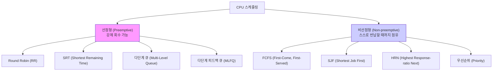

# Summary

정보기사 실기 및 컴퓨터 시스템 구조에서 출제율이 매우 높은 **CPU/프로세스 스케줄링 알고리즘**의 대분류, 상세 연산 메커니즘, 그리고 득점과 직결되는 스케줄링 평가 지표 공식들을 집대성한 종합 가이드입니다.

---

# 1. 스케줄링(Scheduling) 분류 및 핵심 원리

CPU 스케줄링은 실행 준비 상태에 있는 프로세스들에게 CPU 자원을 효율적으로 배분하는 OS 커널의 핵심 기능입니다. 스케줄링은 강제 회수 여부에 따라 크게 **선점형**과 **비선점형**으로 나뉩니다.

---

# 2. 비선점형 스케줄링 (Non-preemptive)

한번 CPU를 차지한 프로세스는 실행이 완료되거나 대기 상태로 스스로 전환되기 전까지 **CPU를 빼앗기지 않는 방식**입니다.

### 2.1 FCFS (First-Come, First-Served) / FIFO
* **개념**: 준비 큐에 **도착한 순서대로** CPU를 할당합니다.
* **단점**: 서비스 시간이 매우 긴 프로세스가 먼저 도착하면 뒤에 있는 짧은 프로세스들이 하염없이 대기하는 **호위 효과(Convoy Effect / 콘보이 효과)**가 발생합니다.

### 2.2 SJF (Shortest Job First)
* **개념**: 준비 큐의 대기자 중 **서비스(실행) 시간이 가장 짧은** 프로세스에게 먼저 CPU를 할당합니다.
* **단점**: 서비스 시간이 긴 프로세스는 계속 뒤로 밀려 CPU를 평생 할당받지 못하는 **기아 현상(Starvation)**이 발생합니다.

### 2.3 HRN (Highest Response-ratio Next)
* **개념**: SJF의 기아 현상을 해결하기 위해 대기 시간과 서비스 시간을 조합한 **에이징(Aging) 기법**을 적용한 알고리즘입니다.
* **우선순위 산정 공식**:
  $$\text{우선순위} = \frac{\text{대기 시간} + \text{서비스 시간}}{\text{서비스 시간}}$$
* **특징**: 수치가 클수록 우선순위가 높으며, 대기 시간이 길어질수록 분자가 커져 언젠가는 반드시 실행되게 보장합니다.

---

# 3. 선점형 스케줄링 (Preemptive)

OS가 강제로 CPU 점유를 해제하고 **더 높은 우선순위의 프로세스에게 할당할 수 있는 방식**입니다. 현대 OS(Windows, Linux 등)는 모두 선점형 방식을 취합니다.

### 3.1 라운드 로빈 (Round Robin / RR)
* **개념**: FCFS와 동일하게 도착 순서대로 할당하되, 각 프로세스에 동일한 **시간 할당량(Time Slice / Time Quantum)**을 부여하여 시간 내에 끝나지 않으면 강제로 큐 맨 뒤로 보내는 시분할 방식입니다.
* **특징**: 시간 할당량이 너무 크면 FCFS와 동일해지고, 너무 작으면 문맥 교환(Context Switching) 오버헤드가 극대화됩니다.

### 3.2 SRT (Shortest Remaining Time)
* **개념**: SJF를 선점형으로 개조한 방식입니다. 현재 실행 중인 프로세스의 **남은 실행 시간**보다 더 짧은 남은 시간을 가진 프로세스가 도착하면 CPU를 빼앗아 할당합니다.
* **단점**: 잦은 실행 잔여 시간 모니터링으로 오버헤드가 발생합니다.

### 3.3 다단계 큐 (Multi-Level Queue)
* **개념**: 준비 큐를 여러 개(예: 시스템 큐, 대화형 큐, 배치 큐 등)로 분할하고 각 큐에 고유한 스케줄링과 독자적 우선순위를 부여합니다.
* **단점**: 한 번 지정된 큐에서 **다른 큐로 프로세스가 이동할 수 없어**, 하위 큐의 무한 기아 현상이 발생할 수 있습니다.

### 3.4 다단계 피드백 큐 (Multi-Level Feedback Queue / MLFQ)
* **개념**: 다단계 큐의 기아 문제를 해결하기 위해 **큐 간에 프로세스가 이동할 수 있도록 설계**된 최신 알고리즘입니다.
* **동작**: 
  * 신규 프로세스는 최상위 우선순위 큐(작은 Time Quantum)에 삽입됩니다.
  * 자신의 할당 시간 내에 작업을 끝내지 못한 프로세스는 한 단계 아래의 우선순위 큐(더 큰 Time Quantum)로 강등됩니다.
  * 오랫동안 하위 큐에서 대기한 프로세스는 에이징(Aging)을 통해 상위 큐로 격상(Promotion)됩니다.
* **의의**: 대화형(Interactive) 짧은 작업은 우대하고, 계산형(CPU-bound) 긴 작업은 하위로 격하해 전체 처리 효율을 극대화하는 현대적 스케줄링의 표준입니다.

---

# 4. 🌟 기출 빈출: 스케줄링 평가 지표 연산 공식

주관식 계산 문제에 대입해야 하는 3대 시간 지표 공식입니다.

```mermaid
gantt
    title Process Time Definition
    dateFormat X
    axisFormat %s
    
    section Timeline
    도착 : milestone, active, 1, 0
    대기 시간 (준비 큐 대기) : active, 1, 5
    서비스 시간 (실제 CPU 작동) : crit, 5, 8
    완료 : milestone, active, 8, 0
```

1. **대기 시간 (Waiting Time)**:
   * 프로세스가 준비 큐에 도착하여 실제로 CPU를 할당받기 전까지 기다린 순수 시간입니다.
   $$\text{대기 시간} = \text{최종 시작 시간} - \text{도착 시간}$$
   $$\text{대기 시간} = \text{반환 시간} - \text{서비스 시간}$$
2. **반환 시간 (Turnaround Time)**:
   * 프로세스가 도착한 순간부터 실행이 완전히 종료되어 시스템을 빠져나갈 때까지 걸린 전체 시간입니다.
   $$\text{반환 시간} = \text{완료 시간} - \text{도착 시간}$$
   $$\text{반환 시간} = \text{대기 시간} + \text{서비스 시간}$$
3. **반응 시간 (Response Time)**:
   * 프로세스가 준비 큐에 들어온 후 **최초로 CPU를 할당받아 첫 번째 출력을 낼 때까지** 걸린 시간입니다.
   * 비선점형에서는 대기 시간과 반응 시간이 동일하지만, 선점형(RR 등)에서는 다르게 나타납니다.

---

# 5. 스케줄링 알고리즘 종합 비교표

| 알고리즘 | 대분류 | 우선순위 결정 기준 | 장점 | 단점 |
| :--- | :--- | :--- | :--- | :--- |
| **FCFS** | 비선점형 | 도착 순서 (FIFO) | 단순함, 오버헤드 없음 | **호위 효과 (Convoy Effect)** |
| **SJF** | 비선점형 | 서비스 시간 짧은 순 | 평균 대기시간 최소화 | **기아 현상 (Starvation)** |
| **HRN** | 비선점형 | 에이징 비율 (공식 적용) | 기아 현상 완화 | 우선순위 수시 계산 오버헤드 |
| **RR** | 선점형 | 순환 대기 (시분할) | 공평함, 대화형 적합 | 할당량 조절 실패 시 효율 급감 |
| **SRT** | 선점형 | 남은 서비스 시간 짧은 순 | 실시간 응답성 좋음 | 잔여 시간 모니터링 부하 |
| **MLFQ** | 선점형 | 동적 우선순위 피드백 | 적응형 최적화, 기아 방지 | 설계가 복잡함 |

---

# Related Concepts
- [정보처리기사 실기 학습 대시보드](index.md)
- [[11과목] 응용 소프트웨어 기초 기술 활용](book2/subject11.md)
- [HRN 스케줄링 문제 풀이 기록 (260712)](my_study_log_260712.md)
