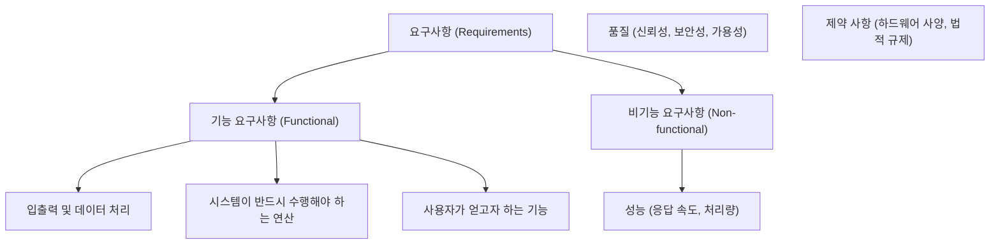

# Summary

소프트웨어 개발의 시작이자 실기 시험의 빈출 과목인 **요구사항 엔지니어링**의 전체 프로세스(도출 $\rightarrow$ 분석 $\rightarrow$ 명세 $\rightarrow$ 확인)와 각 단계별 다양한 수집/분석/검증 기법들을 체계적으로 일람하기 위해 작성된 종합 학습 문서입니다.

---

# 1. 요구사항의 분류

요구사항은 크게 소프트웨어가 **'무엇을 하는가'**와 **'어떻게 동작(제약)하는가'**에 따라 두 가지로 분류됩니다.



* **기능 요구사항 (Functional Requirements)**:
  * 시스템이 반드시 제공해야 하는 **기능, 연산, 데이터 입출력**과 관련된 요구사항입니다.
  * 예: "회원은 아이디와 비밀번호를 입력해 로그인할 수 있어야 한다.", "결제 버튼을 누르면 영수증 PDF가 생성되어야 한다."
* **비기능 요구사항 (Non-functional Requirements)**:
  * 시스템의 **성능, 보안, 신뢰성, 품질, 제약사항**과 관련된 요구사항입니다.
  * 예: "로그인 응답 속도는 3초 이내여야 한다.", "서버는 연중무휴 99.9%의 가용성을 유지해야 한다.", "모든 개인정보는 AES-256 알고리즘으로 암호화되어야 한다."

---

# 2. 요구사항 개발 프로세스 (4단계)

요구사항 개발은 다음의 순서대로 순환 반복하며 정교화됩니다. **"도 - 분 - 명 - 확"** 순서로 무조건 암기해야 합니다.

```mermaid
flowchart LR
    Elicitation["1. 도출<br>(Elicitation)"] --> Analysis["2. 분석<br>(Analysis)"]
    Analysis --> Specification["3. 명세<br>(Specification)"]
    Specification --> Validation["4. 확인/검증<br>(Validation)"]
    Validation -- 요구사항 변경/보완 필요 시 -- Loop --> Elicitation
```

### 1️⃣ 요구사항 도출 (Elicitation / 수집)
* **목적**: 시스템 개발에 참여하는 이해관계자들의 의견을 청취하여 필요한 시스템 사양을 수집하는 단계입니다.
* **주요 기법**:
  * **인터뷰 (Interview)**: 1대1 질의응답을 통한 깊이 있는 대면 수집 기법
  * **설문조사 (Questionnaire)**: 광범위한 대규모 대중 사용자 대상 의견 수집
  * **브레인스토밍 (Brainstorming)**: 비판 없이 자유분방하게 의견을 쏟아내는 회의 기법
  * **워크숍 (Workshop)**: JAD 등 전 직군 이해관계자가 단기간 모여 진행하는 집중 회의
  * **프로토타이핑 (Prototyping)**: 견본(시제품)을 만들어 사용자의 직관적인 피드백을 유도하는 기법
  * **롤플레잉 (Role Playing / 역할 연기)**: 현실 장면을 설정해 두고 배역을 맡아 연기하며 직관적 요구 도출
  * **시나리오 (Scenario)**: 기능 조작의 연쇄 흐름을 글이나 그림(스토리보드)으로 문서화하여 시뮬레이션
  * **관찰 (Observation)**: 사용자의 업무 수행 현장을 직접 동행(섀도잉)하며 잠재 요구사항 포착
  * **델파이 기법 (Delphi Method)**: 전문가 집단을 대상으로 익명으로 설문과 피드백을 여러 차례 회수하며 합의 도출
  * **벤치마킹 (Benchmarking)**: 동종 업계 베스트 프랙티스 모델이나 경쟁사 제품을 비교 분석하여 도입

---

### 2️⃣ 요구사항 분석 (Analysis)
* **목적**: 수집된 요구사항의 타당성을 검토하고, 충돌이 나는 요구사항을 조율하여 비즈니스 논리에 맞게 분석하는 단계입니다.
* **주요 분석 도구 및 개념**:
  * **자료 흐름도 (DFD / Data Flow Diagram)**: 시스템 내 데이터가 가공되어 흐르는 경로를 프로세스(원), 자료 흐름(화살표), 자료 저장소(직선), 외부 엔티티(사각형)로 도식화한 도구
  * **자료 사전 (DD / Data Dictionary)**: DFD에 사용된 모든 데이터의 속성을 체계적으로 정의한 명세 (정의 `=`, 구성 `+`, 선택 `[|]`, 반복 `{ }`, 주석 `(* *)` 기호 암기 필수)
  * **상태 전이도 (STD / State Transition Diagram)**: 시스템에 가해진 이벤트에 따라 상태가 어떻게 전이되는지 보여주는 도구
  * **UML (Unified Modeling Language)**: 객체지향 분석/설계를 위한 표준화된 모델링 언어 (유스케이스, 클래스, 시퀀스 다이어그램 등)

---

### 3️⃣ 요구사항 명세 (Specification)
* **목적**: 분석된 요구사항을 바탕으로 누락 없이 문서화하여 소프트웨어 요구사항 명세서(SRS)를 작성하는 단계입니다.
* **주요 기법**:
  * **정형 명세 기법**:
    * **기반**: 수학적 모델, 형식 논리 (Z, VDM, Larch 등)
    * **특징**: 요구사항의 모호성이 없고 무결성을 논리적으로 증명 가능하나, 작성과 해석이 대단히 어렵습니다.
  * **비정형 명세 기법**:
    * **기반**: 자연어(Natural Language), 그림, 표, 유스케이스
    * **특징**: 작성과 의사소통이 쉬우나 해석의 모호성이 발생할 수 있고 작성자마다 스타일이 달라 완전성 검증이 어렵습니다.

---

### 4️⃣ 요구사항 확인 및 검증 (Validation / Verification)
* **목적**: 최종 완성된 요구사항 명세서(SRS)가 실제 고객이 원한 요구사항과 일치하는지(확인), 그리고 요구사항 명세서의 완성도와 일관성이 올바른지(검증) 검토하는 단계입니다.
* **주요 기법 (정적 테스트 검토 기법)**:
  * **요구사항 검토 (Review)**: 문서의 결함 유무를 확인하는 검토 회의
  * **동료 검토 (Peer Review)**: 작성자가 동료 앞에서 명세서 내용을 설명하고 피드백을 받는 기법
  * **워크스루 (Walkthrough)**: 회의 전에 미리 명세서를 검토하고, 회의 당일 짧은 시간 동안 에러를 검출하기 위해 비형식적으로 진행하는 검토 기법
  * **인스펙션 (Inspection)**: 요구사항 명세서 작성자를 제외한 별도의 전문가/검토팀이 표준 규격과 체크리스트에 맞춰 엄격하고 정식으로 문서를 상세 조밀하게 검증하는 가장 정형화된 정적 검토 기법

---

# Related Concepts
- [정보처리기사 실기 학습 대시보드](index.md)
- [[1과목] 요구사항 확인](book1/subject01.md)
- [[10과목] 애플리케이션 테스트 관리](book2/subject10.md)
- [[11과목] 응용 소프트웨어 기초 기술 활용](book2/subject11.md)
- [개인 학습 기록 문서](my_study_log_260707.md)
