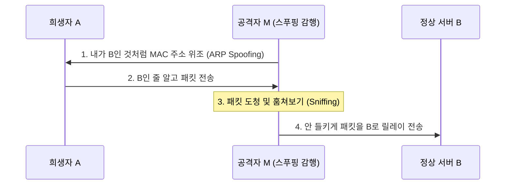
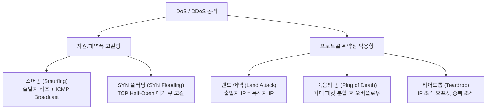

# Summary

정보기사 실기 및 시스템 보안 과목에서 가장 방대한 암기량을 요구하는 **보안 공격 기법**의 동작 원리, 네트워크 패킷 조작 메커니즘, 그리고 득점과 직결되는 핵심 보안 키워드들을 일목요연하게 정리한 종합 가이드입니다.

---

# 1. 패스워드 크래킹 및 무단 접근 공격

인증 수단인 패스워드를 알아내어 불법 권한을 획득하는 공격 수법입니다.

| 공격 기법 명칭 | 작동 메커니즘 | 방어 대책 |
| :--- | :--- | :--- |
| **사전 공격** (Dictionary Attack) | 자주 사용되는 단어, 사전 속 어휘, 흔한 비밀번호 패턴을 텍스트 파일에 담아 순차 대입하는 기법 | 사전에 없는 조합 사용, 특수문자 강제화 |
| **무차별 대입 공격** (Brute-Force) | 가능한 모든 영문자, 숫자, 특수문자 조합을 무작위로 처음부터 끝까지 무식하게 대입하는 기법 | 로그인 시도 횟수 제한 (Account Lockout) |
| **하이브리드 공격** (Hybrid Attack) | 사전의 단어 뒤에 숫자가 붙는 등의 실사용 변종 패턴을 조합해 사전 대입과 무차별 대입을 혼합한 기법 | 정기적인 비밀번호 변경 유도 |
| **레인보우 테이블 공격** (Rainbow Table) | 비밀번호 해시값을 미리 수백만 개 계산해 둔 표(레인보우 테이블)를 사용해, 유출된 해시값을 역추적하여 평문을 찾는 기법 | 패스워드 해싱 시 임의의 소금값(**Salt**) 추가 |

---

# 2. 네트워크 위조 및 도청 공격 (스푸핑 vs 스니핑)

네트워크 전송 계층의 약점을 악용해 가로채거나 가짜 주소를 던지는 능동적/수동적 위협 기법입니다.

* **스푸핑 (Spoofing - 속이기)**:
  * **ARP 스푸핑**: 로컬 네트워크에서 특정 IP의 MAC 주소를 자신의 MAC 주소로 위조한 ARP 응답을 보내 희생자의 ARP 테이블을 교란하고 패킷을 가로챕니다.
  * **IP 스푸핑**: IP 패킷의 출발지 IP 주소를 신뢰받는 외부/내부 IP 주소로 위조하여 방화벽 등의 인증을 우회해 접근하는 기법입니다.
  * **DNS 스푸핑**: DNS 서버를 오염시키거나 DNS 응답을 위조하여 사용자가 포털 주소를 입력했을 때 해커가 만든 가짜 피싱 사이트로 접속을 유도하는 기법입니다.
* **스니핑 (Sniffing - 훔쳐보기)**:
  * 네트워크 카드(NIC)를 **Promiscuous(무차별) 모드**로 설정하여 자신에게 오지 않는 목적지 패킷도 수집해 계정 정보나 데이터를 몰래 훔쳐보는 수동적 도청 행위입니다.
* **세션 하이재킹 (Session Hijacking - 가로채기)**:
  * TCP의 3-Way Handshaking이 완료된 안전한 연결 상태에서, 패킷의 일련번호(Sequence Number)를 위조 및 동기화하여 연결 세션을 강제로 훔쳐 권한을 가로채는 기법입니다.

---

# 3. 🌟 초빈출: 서비스 거부 공격 (DoS / DDoS)

시스템 리소스를 고갈시키거나 대역폭을 꽉 채워 정상적인 서비스를 마비시키는 공격입니다. 기출 출제율이 가장 높습니다.

### 3.1 SYN 플러딩 (SYN Flooding)
* **메커니즘**: TCP 3-Way Handshaking 중, 공격자가 서버에 `SYN` 패킷만 계속 보내고, 서버가 보낸 `SYN-ACK`에 대해 최종 `ACK`를 보내지 않고 잠적해 버립니다.
* **결과**: 서버의 세션 연결 대기 큐(Half-Open Connection Queue)가 가득 차서 정상 사용자의 연결 요청을 처리할 수 없게 됩니다.

### 3.2 스머핑 (Smurfing / 스머프 공격)
* **메커니즘**: 공격자가 출발지 IP 주소를 **희생자의 IP**로 위조한 뒤, 네트워크 전체에 `ICMP Echo Request`를 **브로드캐스트(Broadcast)**로 쏩니다.
* **결과**: 네트워크 내의 수많은 호스트들이 동시에 희생자의 IP 주소로 수많은 `ICMP Echo Reply` 응답을 쏟아내어 대역폭을 고갈시킵니다.

### 3.3 랜드 어택 (Land Attack)
* **메커니즘**: 패킷의 **출발지 IP 주소와 목적지 IP 주소를 희생자의 IP 주소로 똑같이 만들어** 서버에 전송합니다.
* **결과**: 희생자 시스템은 자기가 자신에게 응답하게 만드는 무한 루프에 빠져 시스템 과부하가 걸려 마비됩니다.

### 3.4 죽음의 핑 (Ping of Death)
* **메커니즘**: 규격 외로 **비정상적으로 큰 ICMP 패킷(65,535바이트 이상)**을 쏘아 보냅니다.
* **결과**: 네트워크를 통과하기 위해 조각난(Fragment) 거대 패킷을 수신측이 다시 재조합하는 과정에서 메모리 버퍼 오버플로우가 나거나 다운됩니다.

### 3.5 티어드롭 (Teardrop)
* **메커니즘**: 패킷을 쪼개서 보낼 때 **조각난 패킷들의 오프셋(Offset) 값을 겹치게 중복되거나 아예 빈틈을 주는 형태**로 왜곡해서 전송합니다.
* **결과**: 수신측 시스템이 오프셋 오류가 난 조각을 재조합하다가 에러를 내며 멈추거나 다운됩니다.

---

# 4. 사회공학적 & 기타 신기술 보안 공격

인간의 심리적 취약성이나 어플리케이션 취약점을 이용하는 공격 형태입니다.

* **워터링 홀 (Watering Hole)**:
  * 공격 대상이 자주 방문하는 특정 웹사이트를 먼저 악성코드로 오염시킨 뒤, 사용자가 방문하면 감염시키는 매복형 표적 공격입니다.
* **스피어 피싱 (Spear Phishing)**:
  * 불특정 다수가 아닌 특정 조직의 개인을 타겟으로 유포하는 정교한 타겟 피싱 이메일입니다.
* **APT (지능형 지속 위협)**:
  * 다양한 해킹 기법을 장기간에 걸쳐 특정 타겟에 은밀하고 지속적으로 쏘아 침투하는 침투형 복합 공격입니다.

---

# Related Concepts
- [정보처리기사 실기 학습 대시보드](index.md)
- [[9과목] 소프트웨어 개발 보안 구축](book2/subject09.md)
- [개인 학습 기록 문서 (260712)](my_study_log_260712.md)
