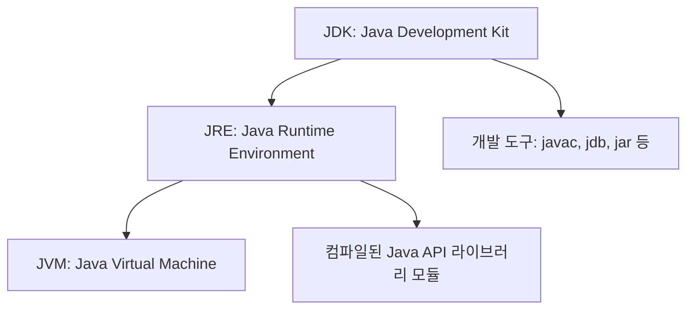

# 1. 자바 실행과 개발의 핵심: JVM, JRE, JDK

자바(Java) 프로그램을 개발하고 실행하기 위해서는 자바 실행 환경과 개발 도구가 필요합니다. 이와 관련된 핵심 개념인 JVM, JRE, JDK의 정의와 이들 간의 포함 관계를 컴퓨터 과학(CS) 관점에서 정리합니다.



### 1) JVM (Java Virtual Machine, 자바 가상 머신)
* **정의**: 자바 바이트코드(`.class` 파일)를 실행하는 가상의 컴퓨터 하드웨어 플랫폼입니다.
* **역할**: 
  * 플랫폼 독립성(Platform Independence)을 실현하는 핵심 요소입니다. "Write Once, Run Anywhere (WORA)" 원칙에 따라, 개발자는 운영체제(OS)에 상관없이 동일한 바이트코드를 생성하면 각 OS에 최적화된 JVM이 이를 기계어로 번역하여 실행합니다.
  * 메모리 관리(Garbage Collection)를 자동으로 수행하여 개발자가 직접 메모리를 할당/해제해야 하는 부담을 줄입니다.

### 2) JRE (Java Runtime Environment, 자바 실행 환경)
* **정의**: 자바 프로그램을 실행하는 데 필요한 라이브러리 파일들과 JVM을 포함한 패키지입니다.
* **구성**: `JVM` + `자바 클래스 라이브러리(Java API)` + `기타 파일`
* **대상**: 자바 기반 애플리케이션을 직접 개발하지 않고, 이미 빌드된 프로그램을 실행하기만 하는 일반 사용자용 환경입니다. (개발자가 아닌 경우 JRE만 다운로드하여 사용할 수 있습니다.)

### 3) JDK (Java Development Kit, 자바 개발 도구)
* **정의**: 자바 프로그램을 개발하고 컴파일하기 위해 필요한 컴파일러 및 디버깅 툴을 JRE와 함께 제공하는 배포판입니다.
* **구성**: `JRE` + `개발 도구(compiler(javac), debugger(jdb), archiver(jar) 등)` + `샘플 코드`
* **대상**: 자바 애플리케이션을 작성, 컴파일, 디버깅하려는 소프트웨어 개발자용 환경입니다.

---

# 2. 통합 개발 환경 (IDE, Integrated Development Environment)

### 1) IDE의 정의와 필요성
* **IDE(통합 개발 환경)**는 소스 코드 편집(Editor), 컴파일(Compiler), 디버깅(Debugger), 빌드 및 배포 도구를 단 하나의 소프트웨어 인터페이스 내부에서 유기적으로 연동하여 제공하는 통합 소프트웨어입니다.
* 개발자는 터미널에서 `javac Hello.java`와 `java Hello`를 매번 실행하는 번거로움 없이, GUI 기반 환경에서 코드 작성부터 실행 결과를 검증하는 단계를 빠르게 수행할 수 있어 생산성이 크게 향상됩니다.

### 2) 이클립스 (Eclipse) 개요
* **특징**: IBM에 의해 초기 개발되어 오픈 소스로 전환된 프로젝트로, 자바 응용 프로그램 개발에 가장 널리 쓰이는 통합 개발 환경 중 하나입니다.
* **플러그인 아키텍처**: 확장성이 매우 뛰어나 자바뿐만 아니라 C/C++, 웹 개발 등 다양한 언어 및 프레임워크를 지원할 수 있는 플러그인 생태계를 갖추고 있습니다.

---

# 3. 자바 프로그램의 기초 구조 분석

아래는 자바 프로그램의 동작 원리를 이해하기 위한 가장 단순한 예제 코드(`Hello2030.java`)의 구조적 설명입니다.

```java
public class Hello2030 {
    public static void main(String[] args) {
        int n = 2030;
        System.out.println("헬로" + n);
    }
}
```

### 1) 클래스 선언부 (`public class Hello2030`)
* 자바는 **객체 지향 언어(Object-Oriented Language)**이므로 모든 코드는 반드시 클래스 내부에 작성되어야 합니다.
* `public class`의 이름(`Hello2030`)은 **소스 파일의 이름(`Hello2030.java`)과 정확히 일치**해야 하며, 대소문자도 같아야 합니다.
* 클래스의 범위는 중괄호 `{`와 `}` 사이에 정의됩니다.

### 2) main() 메서드 (`public static void main(String[] args)`)
* 자바 프로그램의 **진입점(Entry Point)** 역할을 하는 특수한 메서드입니다.
* JVM은 프로그램을 실행할 때 해당 클래스 내부의 `main()` 메서드를 찾아 실행을 시작하므로, 실행의 시작점이 되는 클래스에는 반드시 이 메서드가 하나 존재해야 합니다.
* 각 키워드의 의미:
  * `public`: JVM이 외부에서 자유롭게 접근할 수 있도록 공개하는 접근 제한자입니다.
  * `static`: 객체를 생성하지 않고도 메모리에 상주시켜 JVM이 바로 호출할 수 있도록 만드는 정적 지정자입니다.
  * `void`: 메서드 실행 종료 후 반환(Return)하는 값이 없음을 의미하는 리턴 타입입니다.
  * `String[] args`: 커맨드 라인에서 전달하는 실행 인자(Argument)들을 문자열 배열로 받는 매개변수입니다.

### 3) 변수 선언 및 출력문
* `int n = 2030;`: 4바이트 정수형 지역 변수 `n`을 선언하고 초기값 `2030`을 대입합니다. 이 변수는 `main()` 메서드 블록 내부에서 선언되었으므로 메서드가 종료되면 메모리에서 자동으로 소멸하는 지역 변수(Local Variable)입니다.
* `System.out.println("헬로" + n);`:
  * `System.out` 객체는 JDK의 표준 라이브러리 패키지(`java.lang.System`)에서 제공하는 콘솔 출력용 스트림 객체입니다.
  * `+` 연산자는 문자열("헬로")과 정수(`n`)를 결합하여 최종적으로 하나의 문자열("헬로2030")로 변환한 뒤 화면에 출력하고, 자동으로 줄 바꿈(New Line)을 수행합니다.

---

# 4. 이클립스를 이용한 개발 프로세스

1. **프로젝트 생성 (Create a Java Project)**
   * `File -> New -> Project... -> Java Project`를 선택합니다.
   * 프로젝트 이름(예: `SampleProject`)을 지정하고, 설치된 JDK 버전(예: JavaSE-17)을 선택합니다.
   * **주의**: 모듈 지향 프로그래밍을 진행하지 않는 기본 학습 단계에서는 `Create module-info.java file` 옵션을 **체크 해제(Uncheck)**하여 단순 패키지 기반 구조로 실습을 단순화합니다.
2. **클래스 생성 (Create a Class)**
   * 프로젝트 아래 `src` 폴더를 우클릭하고 `New -> Class`를 선택합니다.
   * 클래스 이름(예: `Hello2030`)을 입력합니다. (기본 패키지 경고가 뜰 수 있으나, 단순 학습 시 디폴트 패키지 사용 가능)
   * `public static void main(String[] args)` 항목을 체크하면 진입점 메서드가 자동으로 뼈대 코드로 생성됩니다.
3. **컴파일 및 실행 (Compile & Run)**
   * 소스 파일 저장 시(Ctrl + S), 이클립스 빌더가 백그라운드에서 자바 컴파일러(`javac`)를 호출하여 자동으로 바이트코드(`.class` 파일)를 생성합니다.
   * 상단의 녹색 실행(Run) 버튼 또는 `Run -> Run` 메뉴를 실행하면, JVM이 기동되며 콘솔 뷰(Console View)에 실행 결과가 즉시 출력됩니다.

---

# Citations
* [01개발 환경 구축.pdf](../../../raw/notes/java/01개발 환경 구축.pdf)
