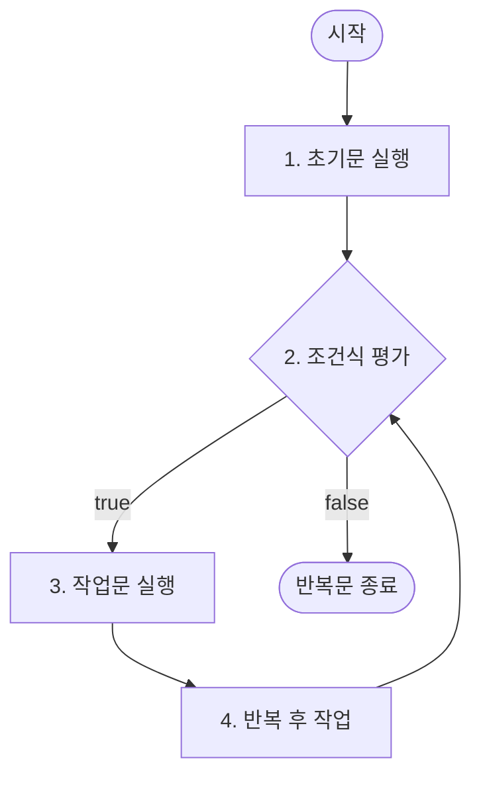

# 1. 자바 반복문의 종류 및 핵심 특징

컴퓨터가 동일하거나 규칙적인 명령을 자동으로 여러 번 실행하도록 제어하는 구조입니다. 자바에서는 `for`, `while`, `do-while` 세 가지 반복 구조를 제공합니다.

---

# 2. for 문의 구조와 작동 프로세스

`for` 문은 반복 횟수가 명확하거나 범위가 뚜렷할 때 사용하는 가장 대중적인 반복문입니다.

### 1) 기본 형식 및 실행 순서
```java
for (초기문; 조건식; 반복 후 작업) {
    // 작업문
}
```



1. **초기문(Initialization)**: 루프 제어 변수의 초기값을 설정합니다. 단 한 번만 실행됩니다.
2. **조건식(Condition)**: 조건식이 `true`이면 작업문을 실행하고, `false`이면 루프를 종료하고 빠져나갑니다.
3. **작업문(Body)**: 조건이 참일 때 실행할 코드 블록입니다.
4. **반복 후 작업(Post-loop Action)**: 작업문이 끝나면 실행되어 루프 변수를 증감시키는 등의 처리를 수행합니다. 이후 다시 2단계 조건식 평가로 돌아갑니다.

### 2) for 문의 특이하고 고도화된 형태
* **무한 루프(Infinite Loop)**:
  * 반복 조건이 항상 `true`로 고정된 상태입니다.
  * 예: `for (초기작업; true; 반복후작업)`
  * 예: `for (초기작업; ; 반복후작업)` $\rightarrow$ **자바 문법상 `for` 문의 조건식을 비워두면 컴파일러는 이를 `true`로 자동 간주**하여 무한 루프가 생성됩니다.
* **복수 초기문 및 증감문 기술**:
  * 콤마(`,`) 구분자를 사용하면 초기문과 반복 후 작업 영역에 여러 실행문을 기술할 수 있습니다.
  * 예: `for (i = 0, sum = 0; i <= 100; i++)`
* **루프 변수의 스코프(Scope)**:
  * 초기문 내부에서 직접 제어 변수를 선언할 수 있습니다. (예: `for (int i = 0; i < 10; i++)`)
  * 이 방식으로 선언된 변수 `i`는 **해당 `for` 문 블록 내부에서만 존재**하며, `for` 문을 벗어나는 즉시 메모리에서 소멸하여 접근이 불가능합니다. 반면, `for` 문 실행 전 선언된 변수는 루프가 끝나도 값이 보존됩니다.

---

# 3. while 문의 구조와 특징

`while` 문은 반복 횟수가 사전에 명확히 정해져 있지 않고, 특정한 조건 만족 여부에 따라 반복을 유지할 때 유용합니다.

### 1) 기본 형식
```java
while (조건식) {
    // 작업문
}
```
* **동작 원리**: 진입 시 조건식을 먼저 평가합니다. 참이면 작업문을 수행하고 다시 조건식을 평가합니다. 처음부터 조건식이 `false`이면 작업문은 한 번도 실행되지 않고 즉시 통과합니다.
* **컴파일 제약**: `for` 문과 다르게 `while` 문은 **조건식을 비워둘 수 없으며**, 비워둘 경우 컴파일 에러가 발생합니다. 무한 루프를 돌리기 위해서는 명시적으로 `while(true)` 형태를 지정해야 합니다.

---

# 4. do-while 문의 구조와 차별점

`do-while` 문은 작업문을 반드시 최소 한 번은 무조건 실행해야 할 때 사용됩니다.

### 1) 기본 형식
```java
do {
    // 작업문
} while (조건식); // 세미콜론(;) 생략 불가!
```
* **실행 순서**: **[작업문 실행 $\rightarrow$ 조건식 평가]** 순서로 진행됩니다.
* **차이점**: `while` 문은 조건에 따라 실행 횟수가 0회 이상이지만, `do-while` 문은 조건과 관계없이 **무조건 최소 1회 실행이 보장**됩니다.
* **주의**: `do-while` 문의 닫는 소괄호 뒤에는 반드시 세미콜론 `;`을 붙여 구문의 끝을 알려야 하며, 생략 시 컴파일 오류를 초래합니다.

---

# 5. 이중 중첩 루프 (Nested Loop)

* 반복문 내부에 또 다른 반복문이 위치하는 구조입니다.
* 이론적으로는 무한히 중첩할 수 있으나 프로그램의 시간 복잡도($O(N^2)$, $O(N^3)$)와 구조적 복잡성을 고려하여 대개 2중 또는 3중 중첩 수준으로 제어합니다.
* **구구단 예제 분석**:
  ```java
  for(int i = 1; i < 10; i++) {       // 바깥쪽 루프 (행 제어)
      for(int j = 1; j < 10; j++) {   // 안쪽 루프 (열 제어)
          System.out.print(i + "*" + j + "=" + i * j + "\t");
      }
      System.out.println(); // 한 단이 끝나면 줄바꿈
  }
  ```
  안쪽 루프가 9번 완전히 돌고 나야 바깥쪽 루프의 변수 `i`가 1 증가하여 다시 안쪽 루프를 처음부터 수행하는 원리입니다.

---

# 6. 루프 제어문: break와 continue

루프 내의 기본 순차 흐름을 강제로 분기하여 바꾸기 위한 키워드입니다.

### 1) continue 문
* **기능**: 현재 반복 회차의 남은 코드 실행을 즉시 스킵(Skip)하고, 다음 반복 회차를 시작하기 위해 이동합니다.
* **반복문 종류별 분기 위치**:
  * `for` 문: `continue`를 만나면 **'반복 후 작업(증감문)'** 영역으로 즉시 점프합니다.
  * `while` 및 `do-while` 문: `continue`를 만나면 곧바로 **'조건식'** 평가 단계로 점프합니다.
* **주의**: `while` 문에서 조건 변수의 증감식을 `continue` 아래에 적어두면 증감 단계가 누락되어 무한 루프에 빠질 수 있으므로 코드 배치에 주의해야 합니다.

### 2) break 문
* **기능**: 자신이 포함된 단 하나의 반복문을 즉시 완전히 탈출하여 루프 밖의 다음 실행 코드로 이동합니다.
* **중첩 루프에서의 범위**: 중첩 루프(Nested Loop) 안에서 `break`가 호출되면, **가장 가깝게 둘러싸고 있는 단 하나의 안쪽 루프만 탈출**하며 바깥쪽 루프는 계속 실행됩니다. 전체 중첩 루프를 한 번에 벗어나기 위해서는 자바의 Label(레이블) 지정을 사용하거나 플래그 변수를 설정해야 합니다.

---

# 7. CS 지식: 문자열 비교 시 equals() 사용 원인

반복 조건문 등에서 사용자 입력값 등을 문자열과 비교할 때 `==` 연산자 대신 `equals()` 메서드를 사용해야 합니다.

```java
String text = scanner.nextLine();
if (text == "exit") { ... }       // (X) 참조 주소 비교
if (text.equals("exit")) { ... }  // (O) 내용값 직접 비교
```

* **`==` 연산자**: 기본 타입(Primitive)에 대해서는 값을 비교하지만, 참조 타입(Reference)인 객체에 대해서는 **힙(Heap) 메모리에 할당된 객체의 주소값(Reference Address)을 비교**합니다.
* `scanner.nextLine()` 등으로 런타임에 새로 입력받은 문자열 객체는 상수로 캐싱된 `"exit"` 리터럴과 메모리 주소가 다릅니다. 따라서 내용은 둘 다 `"exit"`로 같을지라도 `==` 연산 결과는 `false`가 나옵니다.
* **`equals()` 메서드**: 객체가 가리키는 메모리 주소와 상관없이, 두 문자열의 **실제 데이터 내용(Character Array 단위)을 직접 순차적으로 비교**하여 같으면 `true`를 반환하도록 재정의(Override)되어 있어 논리적 무결성을 보장합니다.

---

# Citations
* [03자바 기본 프로그래밍.pdf](../../../raw/notes/java/03자바 기본 프로그래밍.pdf)
