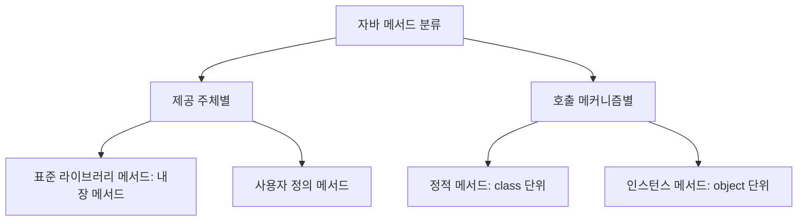

# 1. 메서드(Method)의 정의와 소프트웨어 공학적 필요성

메서드는 특정 기능이나 연산을 수행하기 위해 유기적으로 조직된 코드 블록의 집합입니다. 객체 지향 언어인 자바에서 메서드는 클래스의 멤버로서만 정의될 수 있습니다.

### [메서드의 필요성 3가지]
1. **재사용성 (Reusability)**:
   * 동일한 로직이 소스 코드의 여러 곳에서 반복될 때, 이를 하나의 메서드로 정의해 두면 중복 작성을 피할 수 있습니다. 
   * 수정 사항이 생겼을 때 해당 메서드 내부의 한 군데만 수정하면 이를 호출하는 모든 위치에 반영되므로 중복성을 최소화합니다.
2. **가독성 (Readability)**:
   * 수백 라인의 복잡한 로직이 하나의 `main()` 메서드에 작성되어 있으면 흐름 파악이 매우 어렵습니다. 
   * 각 기능 단위를 명확한 이름의 메서드로 추상화하여 분할 호출하면 전체 프로그램의 실행 제어 흐름이 깔끔하게 시각화됩니다.
3. **유지보수성 (Maintainability)**:
   * 로직의 물리적 분리를 통해 특정 기능의 오동작 시 해당 메서드 단위의 단위 테스트(Unit Test) 및 리팩토링이 신속하게 이루어질 수 있어 시스템의 고장 포착 및 수리가 쉬워집니다.

---

# 2. 메서드의 분류

자바 메서드는 소스 제공 주체 및 호출 메커니즘에 따라 아래와 같이 나뉩니다.



### 1) 제공 주체에 따른 분류
* **표준 라이브러리 메서드 (Standard Library Methods)**: 자바 Development Kit(JDK) 라이브러리 클래스 내부에 사전 정의(Predefined)된 내장 메서드입니다. 임포트하여 즉시 호출 가능합니다. (예: `Math.sqrt()`, `System.out.println()`)
* **사용자 정의 메서드 (User-Defined Methods)**: 개발자가 애플리케이션 요구 조건에 부합하게 직접 설계하고 작성한 메서드입니다.

### 2) 메모리 로딩 방식에 따른 분류
* **정적 메서드 (Static Methods)**:
  * 메서드 선언부에 `static` 키워드가 붙습니다.
  * 객체 생성 과정(`new`) 없이 클래스 영역에 자동으로 로드되므로, `클래스명.메서드명()` 형식을 사용해 곧바로 호출할 수 있습니다.
* **인스턴스 메서드 (Instance Methods)**:
  * `static` 키워드가 없는 일반 메서드입니다.
  * 반드시 힙 메모리에 해당 클래스의 객체가 생성되어 있어야만(`new`), 해당 객체 레퍼런스를 통해서만 인스턴스 멤버로서 호출이 가능합니다.

---

# 3. 메서드의 기본 구조

메서드는 크게 인터페이스 명세를 나타내는 **선언부**와 실질적 작업 내용이 기술되는 **구현부**로 나뉩니다.

```java
[접근제한자] [반환유형] [메서드명]([매개변수목록]) {
    // 메서드 본문 (구현부)
}
```

* **선언부 (Method Signature / Header)**:
  * **접근 제한자 (Access Modifier)**: 메서드를 호출할 수 있는 범위(`public`, `protected`, `private`, `default`)를 지정합니다.
  * **반환 유형 (Return Type)**: 메서드가 연산을 수행한 뒤 돌려주는 결과값의 데이터 타입을 선언합니다. 결과값이 없다면 `void`로 선언합니다.
  * **메서드명**: 카멜 케이스 규칙을 따르는 고유한 식별자 이름입니다.
  * **매개변수 목록 (Parameter List)**: 메서드 외부로부터 값을 주입받기 위한 변수 명세입니다. 매개변수가 없을 수도 있습니다.
* **구현부 (Method Body)**:
  * 중괄호 `{ }` 내에 작성되는 영역으로, 호출 시 순차적으로 수행될 실제 코드입니다. 반환 유형이 `void`가 아닐 때는 구현부 최하단 혹은 종료 시점에 `return` 문을 사용해 올바른 형식의 값을 반드시 반환해야 합니다.

---

# 4. 사용자 정의 메서드 설계의 4가지 패턴

입력값(Parameter)과 출력값(Return Value)의 존재 유무에 따라 메서드 구조는 4가지 패턴으로 분기됩니다.

### 1) 패턴 1: 입력(X) / 출력(O)
매개변수는 없으나 실행 결과로 어떠한 값을 호출한 곳으로 돌려주는 메서드입니다.
```java
public static String greeting() {
    return "Hi"; // String 타입의 값을 반환
}
```

### 2) 패턴 2: 입력(O) / 출력(O)
매개변수 인자를 전달받아 연산을 가한 뒤, 최종 결과값을 리턴하는 가장 일반적인 순수 함수(Pure Function) 형태의 메서드입니다.
```java
// 두 정수를 입력받아 더한 결과를 리턴하는 메서드
public static int add(int x, int y) {
    return x + y;
}

// 두 정수 중 더 큰 값을 리턴하는 메서드
public static int max(int x, int y) {
    int result;
    if (x > y) result = x;
    else result = y;
    return result;
}
```

### 3) 패턴 3: 입력(X) / 출력(X)
입력 변수도 없고 출력되는 결과값도 없이 오직 내부 콘솔 출력이나 정해진 동작만 수행하고 종료되는 메서드입니다. 반환 유형은 `void`입니다.
```java
public static void print() {
    System.out.println("Hi! Java"); // 단순히 출력하고 종료
}
```

### 4) 패턴 4: 입력(O) / 출력(X)
입력 매개변수들은 전달받으나 별도의 리턴값은 없이 내부에서 처리 및 출력을 한 번에 종결하는 구조입니다. 반환 유형은 `void`입니다.
```java
public static void calculate(int x, double y) {
    System.out.println(2 * x * y); // 전달받은 인자로 연산하고 즉시 출력
}
```

---

# 5. 메서드 설계 연습 예제 분석

### 예제 A: 정육면체의 부피 구하기
* **목적**: 한 변의 길이가 $n$인 정육면체의 부피 $V = n^3$을 계산하는 메서드 정의 및 호출.
* **구현**: 입력 인자가 존재하고 그에 따른 결과값(정수 또는 실수)을 돌려줘야 하므로 **패턴 2 [입력(O) / 출력(O)]**이 가장 적합합니다.
```java
public class VolumeCalculator {
    public static int volume(int n) {
        return n * n * n; // 부피 n의 3제곱 연산 및 반환
    }
    public static void main(String[] args) {
        int side = 3;
        int v = volume(side);
        System.out.println("한 변의 길이가 " + side + "인 정육면체의 부피: " + v); // 출력: 27
    }
}
```

### 예제 B: 삼겹살 칼로리 계산하기
* **목적**: 삼겹살 $n$인분의 칼로리 계산. (조건: 1인분 중량 = $180\text{g}$, $1\text{g}$당 칼로리 = $5.179\text{kcal}$)
* **수식**: $\text{Total kcal} = n \times 180 \times 5.179$
* **구현**: 인분 수($n$)를 매개변수로 받아 소수점을 포함한 칼로리 값(`double`)을 돌려주는 **패턴 2** 설계 방식을 채택합니다.
```java
public class CalorieCalculator {
    public static double calckacl(int n) {
        double oneServingWeight = 180.0;
        double kcalPerGram = 5.179;
        return n * oneServingWeight * kcalPerGram; // 칼로리 연산 및 반환
    }
    public static void main(String[] args) {
        int servings = 3;
        double totalKcal = calckacl(servings);
        System.out.printf("삼겹살 %d인분의 칼로리: %.2fkcal\n", servings, totalKcal); // 출력: 2796.66kcal
    }
}
```

---

# Citations
* [05자바 기본 프로그래밍.pdf](../../../raw/notes/java/05자바 기본 프로그래밍.pdf)
