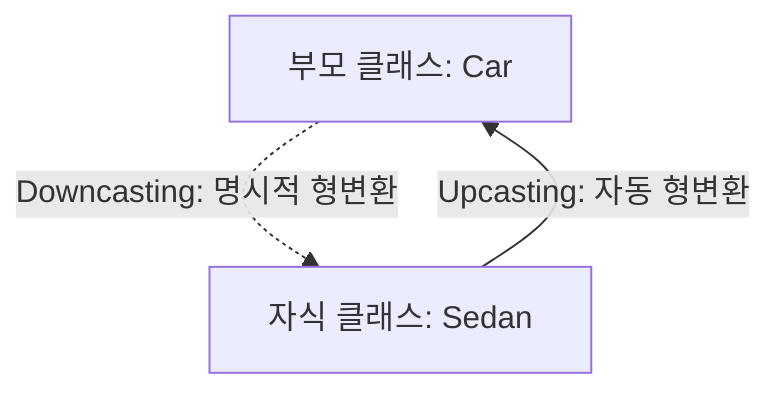

# Summary

본 장에서는 자바 객체지향 프로그래밍의 깊이 있는 구현인 **상속의 확장**에 대해 다룹니다. 객체의 타입 형변환인 **업캐스팅(Upcasting)**과 **다운캐스팅(Downcasting)**의 원리와 런타임 객체 타입을 판별하는 `instanceof` 연산자의 중요성을 학습합니다. 또한 자바의 메서드 호출 결정 방식인 **동적 바인딩(Dynamic Binding)**과 **다형성(Polymorphism)**의 메커니즘을 규명하고, 객체지향 설계의 기둥인 **추상 클래스(Abstract Class)**와 **인터페이스(Interface)**의 구조적 특징 및 설계상 차이점을 명확히 비교 분석합니다.

---

# Why it matters

* **코드의 범용성 및 유연성 확보**: 다형성을 활용하여 하나의 상위 타입으로 여러 다양한 하위 객체들을 일관되게 제어함으로써 구체적인 클래스에 대한 의존도를 낮추고 결합도를 줄일 수 있습니다.
* **표준 규격 정의 및 설계 강제**: 추상 클래스와 인터페이스를 활용해 시스템의 핵심 설계 아키텍처(동작 규격)를 정의하고 하위 클래스들로 하여금 반드시 이를 구현하도록 강제하여 전체 프로그램 구조의 일관성을 유지할 수 있습니다.

---

# Key Ideas

## 1. 업캐스팅(Upcasting)과 다운캐스팅(Downcasting)

자바는 참조 변수의 다형적 타입을 지원하기 위해 클래스 간 형변환을 제공합니다. 이는 실제 인스턴스 타입과 참조 변수 타입 사이의 계층 차이를 조율하는 기법입니다.



### 업캐스팅 (Upcasting)
* **정의**: 자식 클래스의 객체를 부모 클래스 타입의 참조 변수에 대입(변환)하는 것입니다.
* **특징**:
  * **자동 형변환**: 자식 클래스는 부모 클래스의 속성을 내포하고 있으므로 명시적인 캐스팅 연산자 없이 묵시적으로 변환이 가능합니다.
  * **기능 제약**: 업캐스팅된 참조 변수로는 **부모 클래스에 정의된 멤버 변수와 메서드만 사용**할 수 있습니다. 자식 클래스에서 새롭게 정의한 속성이나 메서드는 직접 접근할 수 없습니다.
  ```java
  Sedan sedan = new Sedan();
  Car car = sedan; // 업캐스팅 (묵시적 형변환)
  
  // 또는 바로 생성 시 업캐스팅
  Car car2 = new Sedan();
  ```

### 다운캐스팅 (Downcasting)
* **정의**: 부모 클래스 타입으로 저장된(업캐스팅된) 참조 변수를 다시 원래의 자식 클래스 타입으로 되돌리는 것입니다.
* **특징**:
  * **명시적 형변환**: 개발자가 소괄호(`()`)를 사용하는 캐스팅 연산자를 반드시 지정해야 컴파일이 됩니다.
  * **원상복구**: 다운캐스팅을 완료하면 자식 클래스 고유의 멤버와 메서드에 다시 접근할 수 있게 됩니다.
  ```java
  Car car = new Sedan(); // 업캐스팅 상태
  Sedan sedan = (Sedan) car; // 다운캐스팅 (명시적 캐스팅 필수)
  ```

### `instanceof` 연산자와 안전한 형변환
* **문제점**: 부모 타입의 참조 변수가 실제로 가리키는 객체가 자식 객체가 아님에도 불구하고 강제로 다운캐스팅을 시도할 경우, 컴파일은 통과하나 실행 중에 **`ClassCastException`** 예외가 발생하며 프로그램이 강제 종료됩니다.
* **해결책**: `instanceof` 연산자를 사용하여 런타임에 참조 변수가 실제 어떤 인스턴스를 가리키고 있는지 검증한 뒤 다운캐스팅을 적용합니다.
* **구문**: `참조변수 instanceof 클래스명` (결과는 `true` 또는 `false` 반환)
```java
Car car = new Car(); // 부모 객체 생성
// Sedan sedan = (Sedan) car; // ClassCastException 발생!

Car car2 = new Sedan(); // 자식 객체로 업캐스팅 상태
if (car2 instanceof Sedan) {
    Sedan sedan = (Sedan) car2; // 안전한 다운캐스팅 실행
    sedan.showSpeed();
}
```

---

## 2. 동적 바인딩(Dynamic Binding)과 다형성(Polymorphism)

### 동적 바인딩 (Dynamic Binding)
* **정의**: 메서드 호출 시, 호출할 구체적인 메서드의 코드가 컴파일 타임이 아닌 **프로그램이 실행되는 시점(Runtime)에 실제 객체의 타입에 따라 결정**되는 메커니즘을 의미합니다.
* **자바의 기본 동작**: 자바에서는 오버라이딩된 메서드가 있을 때 참조 변수의 선언된 타입이 아닌, **실제 인스턴스로 존재하는 객체의 오버라이딩된 자식 메서드를 실행**합니다.
```java
class Car {
    void show() { System.out.println("나는 자동차 입니다."); }
}
class Sedan extends Car {
    @Override
    void show() { System.out.println("나는 세단 자동차 입니다."); }
}

Car car = new Sedan(); // 업캐스팅
car.show(); // 출력 결과: "나는 세단 자동차 입니다." (동적 바인딩 작동)
```

### 다형성 (Polymorphism)
* **정의**: 하나의 부모 타입 참조 변수로 다양한 하위 자식 객체들을 참조하고, 오버라이딩된 메서드를 호출하여 객체마다 각각 다른 형태로 동작하게 만드는 객체지향적 성질입니다.
* **다형성의 3대 작동 조건**:
  1. **상속**: 자식 클래스가 부모 클래스의 멤버와 기능을 상속받아야 합니다.
  2. **오버라이딩**: 자식 클래스에서 부모 클래스의 메서드를 재정의해야 합니다.
  3. **업캐스팅**: 자식 객체를 부모 타입의 변수(또는 배열)에 대입하여 일관되게 관리해야 합니다.
```java
Car[] cars = { new Car(), new Sedan(), new Truck() };
for (Car car : cars) {
    car.show(); // 하나의 코드로 각 객체마다 다르게 반응 (다형성 실현)
}
```

---

## 3. 추상 클래스(Abstract Class)

### 개념
* **정의**: 부모 클래스가 기능의 선언(시그니처)만 해두고, 구체적인 바디(구현부)는 자식 클래스가 직접 상황에 맞게 완성하도록 규격을 제시하고 강제하는 특수 클래스입니다.
* **키워드**: `abstract` 예약어를 클래스 선언과 메서드 선언에 사용합니다.

### 추상 메서드 (Abstract Method)
* 완성되지 않은 메서드로, 몸체(중괄호 `{}`)가 없으며 세미콜론 `;`으로 선언을 종료합니다.
```java
abstract void show(); // 추상 메서드
```
* **동작 규칙**:
  1. 추상 메서드에는 절대 구체적인 코드가 구현되어 있으면 안 됩니다.
  2. **클래스 내부에 추상 메서드가 하나라도 존재한다면, 그 클래스는 반드시 추상 클래스(`abstract class`)로 선언되어야 합니다.**

### 추상 클래스의 특징 및 설계적 가치
1. **인스턴스화 불가**: 불완전한 상태의 클래스이므로 `new` 연산자를 이용해 직접 객체를 생성할 수 없습니다.
   ```java
   // Car가 추상 클래스인 경우
   // Car car = new Car(); // 컴파일 에러 발생!
   ```
2. **상속과 오버라이딩 강제**: 추상 클래스를 상속받은 일반 자식 클래스는 **부모의 모든 추상 메서드를 반드시 구현(오버라이딩)**해야만 하며, 만약 구현하지 않을 경우 자식 클래스 자체도 추상 클래스로 지정되어야 합니다.
3. **장점**:
  * 자식 클래스에 **공통된 동작 규칙을 강제**함으로써 프로그램 아키텍처의 일관성을 갖춥니다.
  * 다형성의 부모 규격으로서 매우 유용하게 작동합니다.

---

## 4. 인터페이스(Interface)

### 개념
* **정의**: 클래스가 구현해야 하는 공통 행위(동작)의 표준 규격을 지정하여 결합도를 낮추고 다차원적인 다형성을 제공하는 추상 자료형입니다. '이 기능은 필수적으로 구현해야 한다'는 강한 계약(Contract)의 의미를 가집니다.
* **키워드**: `interface`로 정의하고, 클래스는 이를 `implements` 예약어로 구현합니다.

### 인터페이스 구성 요소들의 진화 (Java 8/9 포함)

1. **상수 필드 (Constant Field)**:
   * 모든 변수는 묵시적으로 **`public static final`**로 처리되며, 값을 변경할 수 없습니다. (생략 가능)
2. **추상 메서드 (Abstract Method)**:
   * 인터페이스의 기본 요소입니다. 묵시적으로 **`public abstract`**로 지정됩니다. (생략 가능)
3. **default 메서드 (Java 8 이후)**:
   * 인터페이스 내에 구체적인 구현 코드를 포함할 수 있는 메서드입니다. `default` 키워드를 붙여 선언하며, 이를 구현하는 클래스들에 자동으로 상속됩니다. 클래스에서 재정의할 의무는 없습니다.
4. **static 메서드 (Java 8 이후)**:
   * 인터페이스 이름으로 직접 호출하는 정적 메서드입니다. 객체 없이도 사용 가능합니다.
5. **private 메서드 (Java 9 이후)**:
   * 인터페이스 내부의 코드 중복을 제거하기 위해 내부 default 메서드 등에서만 사용할 목적으로 호출하도록 캡슐화된 메서드입니다.

### 인터페이스의 핵심 특징
1. **인스턴스화 불가**: 추상 클래스와 마찬가지로 객체를 생성할 수 없습니다.
2. **참조 변수 타입 지원**: 인터페이스 타입의 참조 변수를 선언하고 이를 구현한 자식 클래스 객체를 대입할 수 있습니다. (업캐스팅 지원)
3. **클래스의 다중 구현(다중 상속 효과) 지원**: 자바 클래스는 단일 상속만 지원하지만, **인터페이스는 한 클래스가 여러 개를 동시에 구현(쉼표로 구분)할 수 있으며**, 인터페이스가 다른 인터페이스를 다중 상속하는 것도 가능합니다.
```java
interface Car { void move(); }
interface CarInfo { void color(); }

class Sedan implements Car, CarInfo {
    public void move() { System.out.println("달립니다."); }
    public void color() { System.out.println("검정색입니다."); }
}
```

---

## 5. 추상 클래스 vs 인터페이스 비교

| 비교 항목 | 추상 클래스 (Abstract Class) | 인터페이스 (Interface) |
| :--- | :--- | :--- |
| **정의 키워드** | `abstract class` | `interface` |
| **적용 키워드** | `extends` (상속) | `implements` (구현) |
| **다중성** | **단일 상속**만 가능 | **다중 구현** 가능 |
| **멤버 변수** | 일반 멤버 변수(상태 정보) 정의 가능 | 오직 **상수(`public static final`)**만 정의 가능 |
| **생성자** | **생성자 존재 가능** (자식 생성자에서 super 호출) | **생성자 정의 불가** |
| **기본 구성 요소** | 일반 변수, 생성자, 일반 메서드, 추상 메서드 | 추상 메서드, default/static/private 메서드, 상수 |
| **사용 목적 (용도)** | 계층 구조 내에서 **관련 있는 클래스들의 공통 상태와 행위를 추출 및 공유**하기 위함 | 계층 관계와 무관하게 **서로 다른 클래스 간의 특정 행동 계약을 정의 및 연결**하기 위함 (다형적 표준화) |

---

# Citations
* [08객체지향 - 상속 확장.pdf](../../../raw/notes/java/08객체지향 - 상속 확장.pdf)
