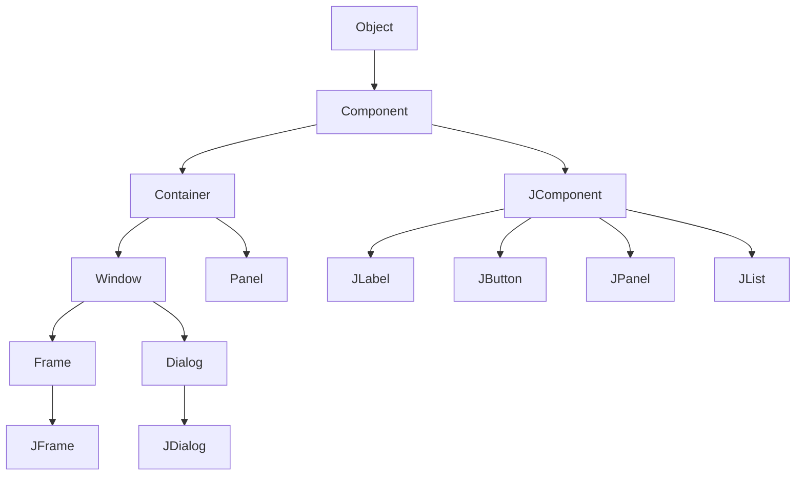
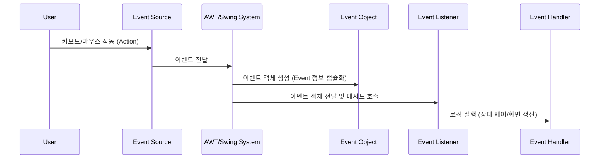

# 1. 자바 GUI 프로그래밍 개요: AWT와 Swing

자바(Java)는 강력한 GUI(Graphical User Interface) 라이브러리를 통해 데스크톱 애플리케이션 개발을 지원합니다. 자바의 GUI 개발 도구는 크게 **AWT**와 **Swing** 패키지로 나뉩니다.

### 1) AWT (Abstract Windowing Toolkit)
* **정의**: 자바 초기 버전에 탑재되어 배포된 GUI 라이브러리입니다 (`java.awt` 패키지).
* **특징**:
  * **중량 컴포넌트(Heavyweight components)**: Native OS의 GUI 구성 요소(Peer)의 힘을 빌려 작동합니다.
  * OS에 종속적이므로, 애플리케이션이 실행되는 운영체제에 따라 컴포넌트의 외형(Look and Feel)이 달라지며 운영체제에 많은 부담을 줍니다.
  * 상대적으로 처리 속도는 빠르지만, 운영체제별 화면 왜곡이나 호환성 문제가 발생할 수 있습니다.

### 2) Swing (스윙)
* **정의**: AWT 기술을 기반으로 하되, 순수 자바 언어로 재작성된 크로스 플랫폼 GUI 라이브러리입니다 (`javax.swing` 패키지).
* **특징**:
  * **경량 컴포넌트(Lightweight components)**: 운영체제의 GUI 컴포넌트에 의존하지 않고 JVM이 직접 화면을 그립니다.
  * 어느 운영체제에서나 동일한 모양과 동작을 보장하며, AWT보다 다양하고 세련된 고급 컴포넌트(Table, Tree 등)를 제공합니다.
  * 모든 컴포넌트의 클래스명이 `J`로 시작합니다 (예: `JButton`, `JFrame`).
  * 시스템 구조상 OS 부담이 적으며 외형을 코드로 쉽게 자유롭게 변경할 수 있습니다.

---

# 2. GUI 라이브러리 계층 구조 (Class Hierarchy)

자바 GUI 클래스들은 컴포넌트를 직접 그리는 클래스와 이들을 포함하는 컨테이너 클래스로 나뉩니다.



### 1) Component & Container
* **Component (컴포넌트)**: 화면에 표시되는 모든 GUI 요소를 위한 추상 클래스입니다. `java.awt.Component`를 상속받습니다.
* **Container (컨테이너)**: 다른 GUI 컴포넌트를 내부에 포함하고 배치할 수 있는 특수한 컴포넌트입니다. `java.awt.Container`를 상속받으며, 다른 컨테이너에 포함될 수도 있습니다.
  * AWT 컨테이너: `Panel`, `Frame`, `Applet`, `Dialog`, `Window`
  * Swing 컨테이너: `JPanel`, `JFrame`, `JApplet`, `JDialog`, `JWindow`
* **최상위 컨테이너 (Top-level Container)**: 다른 컨테이너에 포함되지 않고 독립적으로 화면에 출력되는 윈도우(창) 역할을 하는 컨테이너입니다. 스윙에서는 `JFrame`, `JDialog`, `JApplet`이 이에 해당합니다.

### 2) JComponent
* **정의**: 스윙 컴포넌트들의 공통 속성을 구현한 추상 클래스로, `java.awt.Container`를 상속받습니다.
* **특징**: 추상 클래스이므로 `new JComponent()`로 인스턴스를 생성할 수 없으며, 대부분의 스윙 컴포넌트(JButton, JLabel, JTextField 등)가 이를 상속받아 구현됩니다.

---

# 3. 스윙 GUI 프로그램 개발 프로세스

스윙 애플리케이션은 기본적으로 프레임을 생성하고, 그 프레임의 컨텐트 팬(Content Pane)에 컴포넌트들을 추가하는 방식으로 개발됩니다.

```java
import javax.swing.*;
import java.awt.*;

public class MyFrame extends JFrame {
    public MyFrame() {
        setTitle("스윙 프레임 예제"); // 프레임 타이틀 지정
        setDefaultCloseOperation(JFrame.EXIT_ON_CLOSE); // 프레임 종료 시 프로세스 종료 설정
        
        // 프레임의 컨텐트 팬을 획득
        Container contentPane = getContentPane();
        contentPane.setBackground(Color.ORANGE); // 배경색 설정
        contentPane.setLayout(new FlowLayout()); // 배치 관리자 설정
        
        // 컴포넌트 추가
        contentPane.add(new JButton("OK"));
        contentPane.add(new JButton("Cancel"));
        contentPane.add(new JButton("Ignore"));
        
        setSize(350, 150); // 창 크기 설정
        setVisible(true); // 창을 화면에 표시
    }
    
    public static void main(String[] args) {
        new MyFrame(); // 프레임 인스턴스 생성
    }
}
```

### 1) 컨텐트 팬 (Content Pane)
* 스윙 프레임(`JFrame`)에서 화면에 출력될 실제 컴포넌트들이 부착되는 공간입니다.
* 프레임 내부에는 메뉴바 영역과 컨텐트 팬 영역이 명확하게 구분되어 있으며, 컴포넌트 부착 시 `getContentPane()` 메서드를 통해 컨텐트 팬을 받아와 여기에 추가(`add()`)해야 합니다.

### 2) 종료 코드와 프로세스 종료 (`EXIT_ON_CLOSE`)
* **`System.exit(0)`**: 소스 코드 어느 곳에서든 프로세스를 강제 종료시킵니다.
* **`setDefaultCloseOperation(JFrame.EXIT_ON_CLOSE)`**: 프레임 우측 상단의 닫기 버튼(X)을 눌렀을 때 윈도우 창이 닫힐 뿐만 아니라 실행 중인 자바 프로그램 프로세스도 메모리에서 완전히 종료되도록 만듭니다.
  * 이 설정을 생략하면 창은 닫혀 보이지 않지만, 백그라운드 프로세스는 계속 메모리에 유지되어 실행 중인 상태로 남습니다.

---

# 4. 배치 관리자 (Layout Manager)

컨테이너마다 하나의 배치 관리자가 존재하며, 이 배치 관리자는 삽입되는 컴포넌트들의 **위치와 크기를 자동으로 결정**합니다. 또한 컨테이너의 크기가 조절되면 내부 컴포넌트들의 레이아웃을 다시 계산하여 재배치합니다.

`java.awt` 패키지에 구현되어 있는 대표적인 배치 관리자 4가지는 다음과 같습니다.

| 배치 관리자 | 배치 방식 | 특징 |
| :--- | :--- | :--- |
| **`FlowLayout`** | 왼쪽에서 오른쪽으로, 위에서 아래로 순서대로 배치 | 컴포넌트의 원래 크기를 유지하며 배치 공간이 부족하면 다음 행으로 넘어갑니다. 디폴트 정렬은 중앙입니다. |
| **`BorderLayout`** | 동(EAST), 서(WEST), 남(SOUTH), 북(NORTH), 중앙(CENTER) 5개 구역으로 분할 배치 | 영역당 1개의 컴포넌트만 배치 가능하며, 영역의 크기에 맞춰 컴포넌트가 강제로 확장됩니다. `JFrame`의 디폴트 배치 관리자입니다. |
| **`GridLayout`** | 바둑판 형태의 동일한 크기 격자(Grid)로 분할 배치 | 행과 열을 지정하여 순서대로 빈 격자에 균등한 크기로 컴포넌트를 채워 넣습니다. |
| **`CardLayout`** | 컴포넌트를 카드 쌓듯이 포개어 배치 | 여러 개의 컴포넌트 중 오직 한 번에 하나의 페이지만 보여줄 때 사용합니다. |

### 1) 배치 관리자 설정 변경
```java
// 컨텐트 팬의 배치 관리자를 FlowLayout으로 변경
Container c = frame.getContentPane();
c.setLayout(new FlowLayout(FlowLayout.LEFT, 30, 40)); // 왼쪽 정렬, 수평 간격 30px, 수직 간격 40px
```

### 2) 배치 관리자가 없는 컨테이너 (Null Layout)
개발자가 직접 컴포넌트의 크기와 좌표를 수치(픽셀 단위)로 절대 지정하여 임의로 배치하고자 할 때 사용합니다. 게임 프로그램이나 컴포넌트들이 겹쳐서 출력되어야 하는 화면 개발 시 주로 쓰입니다.
* **설정 방법**: `container.setLayout(null);`
* **크기/위치 수동 설정 메서드**:
  * `component.setSize(int width, int height);`
  * `component.setLocation(int x, int y);`
  * `component.setBounds(int x, int y, int width, int height);` (위치와 크기를 동시에 설정)

---

# 5. 스윙 이벤트 처리 (Event Handling) 모델

자바의 GUI 이벤트 처리는 **위임 이벤트 모델(Delegation Event Model)**을 따릅니다. 컴포넌트에서 이벤트가 발생하면, 등록된 리스너가 이를 감지하여 위임받은 이벤트를 처리하는 방식입니다.

### 1) 주요 개념
* **이벤트 (Event)**: 마우스 클릭, 키보드 입력, 창 닫기 등 사용자의 행위에 의해 발생하는 사건입니다.
* **이벤트 소스 (Event Source)**: 이벤트를 발생시킨 GUI 컴포넌트입니다.
* **이벤트 객체 (Event Object)**: 발생한 이벤트의 구체적인 세부 정보(소스 컴포넌트 레퍼런스, 클릭된 좌표, 입력 키 코드 등)를 관리하는 객체입니다. `java.util.EventObject`를 최상위로 둡니다.
* **이벤트 리스너 (Event Listener)**: 이벤트를 수신하여 처리하는 인터페이스입니다.
* **이벤트 핸들러 (Event Handler)**: 이벤트 리스너 인터페이스 내부에 구현된 메서드로, 실제 비즈니스 로직이 들어가는 영역입니다.



### 2) 주요 이벤트와 리스너 매핑

* **`ActionEvent`** / **`ActionListener`**: 버튼(JButton) 클릭, 메뉴(JMenuItem) 선택, 텍스트 필드(JTextField)에서 Enter 키 입력 시 발생합니다.
* **`ItemEvent`** / **`ItemListener`**: 체크박스(JCheckBox), 라디오버튼(JRadioButton) 등의 선택 상태가 변화할 때 발생합니다.
* **`KeyEvent`** / **`KeyListener`**: 키보드 입력 시 발생합니다.
* **`MouseEvent`** / **`MouseListener`**, **`MouseMotionListener`**: 마우스 조작 시 발생합니다.
* **`WindowEvent`** / **`WindowListener`**: 창 열기, 닫기, 최소화 등의 창 상태 변화 시 발생합니다.

---

# 6. 이벤트 리스너 작성의 3가지 방법

### 1) 독립 클래스(Outer Class)로 작성
이벤트 리스너 클래스를 완전한 독립된 파일이나 별도의 탑 레벨 클래스로 정의합니다.
* **장점**: 동일한 기능을 여러 GUI 프레임에서 재사용할 때 적합합니다.
* **단점**: 리스너 클래스 내부에서 메인 프레임의 멤버 변수(컴포넌트)에 접근하기 어려워 코드가 복잡해집니다.

### 2) 내부 클래스(Inner Class)로 작성
메인 GUI 클래스의 멤버 클래스로 리스너를 작성합니다.
* **장점**: 외부 클래스의 private 멤버 변수나 메서드에 직접 접근할 수 있어 매우 직관적이고 편리합니다.
* **단점**: 다른 프레임 클래스 등 외부에서 리스너를 재사용할 수 없습니다.

```java
public class MyFrame extends JFrame {
    private JButton btn = new JButton("Action");
    
    public MyFrame() {
        // ... 생략 ...
        btn.addActionListener(new MyActionListener());
    }
    
    // 내부 클래스로 리스너 정의
    private class MyActionListener implements ActionListener {
        public void actionPerformed(ActionEvent e) {
            JButton b = (JButton)e.getSource();
            if(b.getText().equals("Action")) {
                b.setText("액션");
                MyFrame.this.setTitle("타이틀 변경"); // 외부 클래스 멤버에 직접 접근 가능
            } else {
                b.setText("Action");
            }
        }
    }
}
```

### 3) 익명 클래스(Anonymous Class)로 작성
클래스 정의와 객체 생성을 한 번에 결합하여 이름 없이 바로 리스너를 생성하는 방식입니다.
* **장점**: 가장 간결하며, 특정 컴포넌트에서만 사용될 짧은 리스너 구현 시 가독성이 매우 뛰어납니다.
* **단점**: 코드가 길어지면 오히려 유지보수가 어려울 수 있습니다.

```java
btn.addActionListener(new ActionListener() {
    public void actionPerformed(ActionEvent e) {
        JButton b = (JButton)e.getSource();
        b.setText("익명 클래스 실행");
    }
});
```

---

# 7. 마우스 이벤트와 어댑터 클래스 (Adapter Class)

### 1) 마우스 이벤트 인터페이스의 분화
마우스 이벤트 조작은 성격에 따라 3가지 인터페이스로 나뉩니다.
1. **`MouseListener`**: 마우스 버튼 조작 관련 (5개 메서드)
   * `mousePressed()`, `mouseReleased()`, `mouseClicked()`, `mouseEntered()`, `mouseExited()`
2. **`MouseMotionListener`**: 마우스 움직임 관련 (2개 메서드)
   * `mouseDragged()`, `mouseMoved()`
3. **`MouseWheelListener`**: 마우스 휠 스크롤 관련 (1개 메서드)
   * `mouseWheelMoved(MouseWheelEvent e)`

### 2) 어댑터 클래스 (Adapter Class)
인터페이스를 구현할 때, 쓰지 않는 이벤트 핸들러 메서드까지 빈 상태(`{}`)로 모두 오버라이딩해야 하는 번거로움을 해결하기 위해 자바는 **어댑터 클래스**를 제공합니다.
* 어댑터 클래스는 해당 리스너 인터페이스를 빈 본문으로 미리 전부 구현해 둔 추상 클래스입니다. 개발자는 이 어댑터를 상속(extends)받아 **필요한 메서드만 오버라이딩**하여 사용할 수 있습니다.
* 예: `MouseAdapter`는 `MouseListener`, `MouseMotionListener`, `MouseWheelListener`를 모두 상속받아 구현하고 있습니다.
* **주의**: 추상 메서드가 `actionPerformed()` 단 하나뿐인 `ActionListener`나 `itemStateChanged()` 하나뿐인 `ItemListener` 등은 구현 부담이 없으므로 어댑터 클래스가 제공되지 않습니다.

```java
// MouseListener를 직접 구현하여 mousePressed만 사용하려고 해도 5개 메서드를 다 작성해야 함
class MyMouseListener implements MouseListener {
    public void mousePressed(MouseEvent e) { /* 구현 */ }
    public void mouseReleased(MouseEvent e) {} // 불필요한 빈 오버라이딩
    public void mouseClicked(MouseEvent e) {}
    public void mouseEntered(MouseEvent e) {}
    public void mouseExited(MouseEvent e) {}
}

// MouseAdapter를 상속받으면 원하는 메서드만 깔끔하게 작성 가능
class MyMouseAdapter extends MouseAdapter {
    @Override
    public void mousePressed(MouseEvent e) {
        int x = e.getX(); // 마우스 클릭 X 좌표
        int y = e.getY(); // 마우스 클릭 Y 좌표
        System.out.println("Clicked position: " + x + ", " + y);
    }
}
```

---

# 8. 키 이벤트(KeyEvent)와 포커스(Focus)

키보드 조작에 의해 발생하는 `KeyEvent`는 컴포넌트가 화면 상의 **포커스(Focus)**를 가지고 있어야만 제대로 동작합니다. 포커스는 사용자의 키 입력을 수신할 수 있는 권한을 의미합니다.

### 1) 컴포넌트에 포커스 지정하기
자바 가상 머신(JVM) 및 OS 실행 환경에 관계없이 컴포넌트가 키 이벤트를 안정적으로 독점하도록 하려면 아래의 2라인 코드가 필요합니다.
```java
component.setFocusable(true); // 컴포넌트가 포커스를 받을 수 있도록 활성화
component.requestFocus();     // 컴포넌트에 강제로 포커스 지정
```
> [!IMPORTANT]
> 스윙 프레임이 생성될 때 기본적으로 포커스를 특정 컴포넌트에 할당하고 싶다면, 반드시 **`JFrame.setVisible(true)`가 호출되어 프레임이 실질적으로 화면에 출력된 이후**에 `requestFocus()`를 호출해야 정상 작동합니다.

### 2) 가상 키 (Virtual Key)
컴포넌트에 입력된 키가 특수 기능 키(방향키, Shift, Enter 등)인지 확인하기 위해, 자바는 `KeyEvent` 클래스 내부 상수로 정의된 **가상 키 코드**를 사용합니다.
* `KeyEvent.VK_UP`, `KeyEvent.VK_DOWN`, `KeyEvent.VK_LEFT`, `KeyEvent.VK_RIGHT` (방향키)
* `KeyEvent.VK_ENTER` (엔터 키)
* `KeyEvent.VK_F1` ~ `KeyEvent.VK_F12` (기능 키)
* `KeyEvent.VK_CONTROL`, `KeyEvent.VK_SHIFT`, `KeyEvent.VK_ALT` (제어 키)

### 3) 입력 키 감지 메서드
`KeyListener`의 `keyPressed()`나 `keyReleased()` 핸들러가 호출되었을 때, 아래의 메서드를 통해 키 상세 정보가 담긴 `KeyEvent e` 객체에서 정보를 추출합니다.
* **`e.getKeyChar()`**: 입력된 키의 유니코드 문자 값(예: 'a', '가', '%')을 리턴합니다. 문자 키인 경우에만 정상 동작합니다.
* **`e.getKeyCode()`**: 입력된 키의 가상 키 코드 정수 값을 리턴합니다. 모든 키에 대해 동작합니다.
* **`KeyEvent.getKeyText(int keyCode)`**: `static` 메서드로, 전달받은 가상 키 코드에 해당하는 문자열 설명(예: "F1", "Ctrl", "Home")을 반환합니다.

---

# Citations
* [10GUI.pdf](../../../raw/notes/java/10GUI.pdf)
