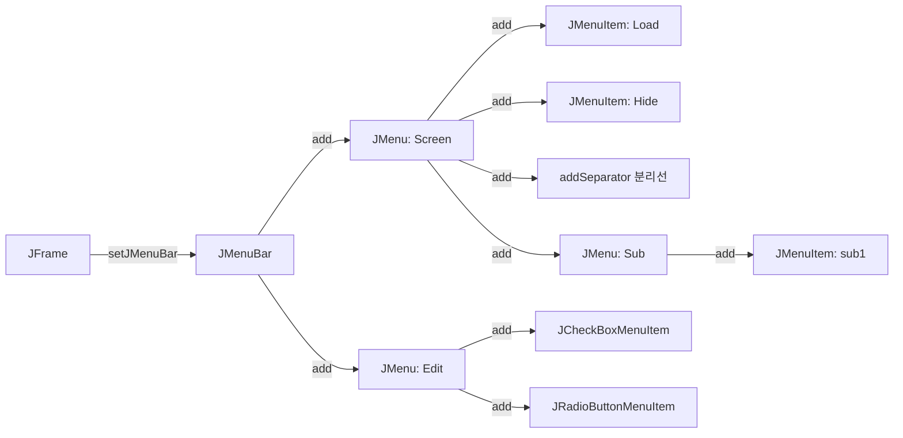

# 1. JTable (테이블 컴포넌트)

`JTable`은 데이터를 행(Row)과 열(Column)의 2차원 표 형태로 출력하고 사용자가 수정할 수 있게 제공하는 컴포넌트입니다.

### 1) 주요 특징
* `JTable` 컴포넌트 자체는 화면에 데이터를 격자 형태로 보여주는 **뷰(View)** 역할만 수행하며, 내부적인 데이터는 데이터 모델(`TableModel`) 객체에서 별도로 관리 및 보관합니다.
* **컬럼명(헤더) 노출 규칙**: `JTable`을 컨테이너에 단독으로 추가하면 상단 컬럼명이 정상적으로 표시되지 않습니다. 테이블에 컬럼 헤더가 정상 노출되게 하려면 반드시 **`JScrollPane`**에 테이블 객체를 담아 부착해야 합니다.

### 2) 주요 생성자
* `JTable()`: 기본 데이터 모델, 컬럼 모델 등으로 빈 테이블을 생성합니다.
* `JTable(int rows, int cols)`: `rows` 개수의 행과 `cols` 개수의 열을 빈 상태로 가지는 테이블을 만듭니다.
* `JTable(Object[][] rowData, Object[] columnNames)`: 초기 데이터 배열 `rowData`와 열 이름 배열 `columnNames`를 기반으로 테이블을 생성합니다.
  ```java
  String[] colNm = {"사번", "이름", "근무부서"};
  Object[][] data = {
      {"260001", "박길동", "총무부"},
      {"260002", "이순신", "관리부"}
  };
  JTable jt = new JTable(data, colNm);
  ```

### 3) 셀 편집 잠금 (isCellEditable 오버라이딩)
`JTable`은 기본적으로 모든 셀을 더블클릭하여 수정할 수 있도록 동작합니다. 특정 셀이나 테이블 전체를 읽기 전용(Read-Only)으로 만들려면 `JTable` 인스턴스 생성 시 `isCellEditable()` 메서드를 직접 오버라이딩해야 합니다.
```java
JTable jt = new JTable(data, colNm) {
    @Override
    public boolean isCellEditable(int row, int column) {
        return false; // 모든 셀 수정 불가능하도록 설정
    }
};
```

---

# 2. DefaultTableModel을 이용한 데이터 동적 제어

`JTable`은 한 번 생성되고 나면 직접 데이터를 수정하거나 행을 추가/삭제하기 까다롭습니다. 이를 원활하게 수행하기 위해 자바는 **`DefaultTableModel`** 클래스를 지원합니다.

### 1) 주요 동적 제어 메서드
* **열 추가**: `void addColumn(Object columnName, Object[] columnData)`
* **행 추가**: `void addRow(Object[] rowData)`
* **행 삽입**: `void insertRow(int row, Object[] rowData)` (지정한 인덱스 `row` 위치에 행을 삽입)
* **행 삭제**: `void removeRow(int row)` (지정한 인덱스 `row` 위치의 행을 제거)
* **데이터 읽기 및 수정**:
  * `Object getValueAt(int r, int c)`: 특정 좌표의 값을 조회합니다.
  * `void setValueAt(Object val, int r, int c)`: 특정 좌표의 값을 `val` 객체로 변경합니다.
* **전체 데이터 교체**: `void setDataVector(Vector d, Vector c)`
* **크기 강제 고정**:
  * `void setRowCount(int n)`: 행 개수를 고정합니다 (0으로 설정하면 테이블 내부 데이터가 한 번에 전체 삭제됩니다).
  * `void setColumnCount(int n)`: 열 개수를 고정합니다.

### 2) 구현 예시
```java
DefaultTableModel dm = new DefaultTableModel(data, colNm);
JTable jt = new JTable(dm); // TableModel을 전달하여 생성

// 새로운 데이터 추가
dm.addColumn("나이", new Object[]{"40", "30"}); // 나이 열 추가 및 데이터 대입
dm.addRow(new Object[]{"260004", "강감찬", "홍보부", "35"}); // 새로운 행 추가
dm.insertRow(2, new Object[]{"260003", "임꺽정", "기획부", "37"}); // 2번 인덱스에 행 삽입
```

---

# 3. JTable 이벤트 처리: ListSelectionListener

테이블의 특정 행(Row)을 사용자가 마우스로 클릭하여 선택했을 때 발생하는 이벤트를 가로채 처리하기 위해 **`ListSelectionListener`** 인터페이스를 사용합니다.

### 1) 사용 예시 및 주의점 (getValueIsAdjusting)
* 테이블 행 선택 이벤트는 마우스를 누를 때(Pressed)와 뗄 때(Released) 각각 호출되어 두 번 연속 처리되는 오동작이 일어날 수 있습니다.
* 최종 선택 결정 상태일 때만 비즈니스 로직을 한 번 실행하도록 **`!e.getValueIsAdjusting()`** 가드 조건문을 반드시 사용해야 합니다.

```java
jt.getSelectionModel().addListSelectionListener(new ListSelectionListener() {
    public void valueChanged(ListSelectionEvent e) {
        // 중복 이벤트 처리 방지 가드 코드
        if (!e.getValueIsAdjusting()) {
            int selectRow = jt.getSelectedRow(); // 현재 선택된 행의 인덱스 획득
            if (selectRow != -1) {
                // 선택한 행의 0번째 열(사번) 값 조회
                String val = jt.getValueAt(selectRow, 0).toString();
                System.out.println("Selected Row Key Value: " + val);
            }
        }
    }
});
```

---

# 4. 스윙 메뉴 컴포넌트

자바 애플리케이션 상단 윈도우 프레임에 부착되는 메뉴 시스템은 `JMenuBar`, `JMenu`, `JMenuItem` 클래스의 계층 트리 구조로 만들어집니다.



### 1) 메뉴의 구성 요소
* **`JMenuBar`**: 프레임 상단에 한 줄로 가로배치되는 메뉴 표시줄입니다. `frame.setJMenuBar(menubar)` 메서드를 통해 부착합니다.
* **`JMenu`**: 메뉴바에 위치하거나 다른 메뉴의 하위(Sub) 메뉴로 포함되는 메뉴 본체입니다. 클릭 시 자식 메뉴 항목 리스트를 팝업합니다.
* **`JMenuItem`**: 메뉴의 말단 리프 노드로, 실제 클릭 액션 처리가 일어나는 개별 메뉴 항목입니다.
  * 특수 메뉴 항목:
    * `JCheckBoxMenuItem`: 체크 상태(Check Mark)를 유지할 수 있는 메뉴 항목
    * `JRadioButtonMenuItem`: 그룹 중 단 하나만 선택 상태가 되도록 제어하는 라디오 버튼 메뉴 항목
  * **분리선 (Separator)**: `menu.addSeparator()`를 호출하면 메뉴 항목 사이에 가로 분리선이 추가되어 항목 간 구조적 시각화에 도움을 줍니다.

### 2) 메뉴 제어를 위한 키 매핑
1. **단축키 (Mnemonic)**:
   * **`setMnemonic(int key)`**: 메뉴바가 열린 상태에서 `Alt` 키와 조합하여 메뉴에 빠르게 접근하는 수단입니다 (예: `setMnemonic(KeyEvent.VK_S)` -> `Alt + S`).
2. **가속키 (Accelerator)**:
   * **`setAccelerator(KeyStroke key)`**: 메뉴바를 열지 않은 상태에서 어느 화면에서든 바로 메뉴 항목의 이벤트를 발생시키는 단축키 조합입니다. 주로 `Ctrl` 또는 `Shift` 키와의 결합으로 생성합니다 (예: `KeyStroke.getKeyStroke(KeyEvent.VK_L, InputEvent.CTRL_DOWN_MASK)` -> `Ctrl + L`).

---

# 5. JToolBar (툴바)와 ToolTip (툴팁)

### 1) JToolBar (도구 모음)
자주 사용되는 버튼이나 기능을 모아서 메뉴바 밑에 가로 혹은 세로 한 줄의 도구 창으로 제공하는 컨테이너입니다.
* **부착 규칙**: 반드시 **`BorderLayout` 배치 관리자를 사용하는 컨테이너**에 부착해야 하며, 보통 모서리 구역(`BorderLayout.NORTH`, `SOUTH`, `WEST`, `EAST`) 중 하나를 지정하여 부착합니다.
* **이동 및 고정 기능 (setFloatable)**:
  * `toolBar.setFloatable(true)`: 툴바의 앞부분에 핸들(손잡이)이 생기며, 사용자가 이 핸들을 드래그하여 다른 모서리로 툴바를 이동하거나 완전히 독립된 별도 플로팅 다이얼로그 창으로 떼어낼 수 있습니다.
  * `toolBar.setFloatable(false)`: 이동용 핸들이 없어지며, 툴바의 위치가 그 모서리에 단단히 고정됩니다.

```java
JToolBar toolBar = new JToolBar("My Toolbar");
toolBar.setFloatable(false); // 위치 고정

JButton btnNew = new JButton("New");
toolBar.add(btnNew);
toolBar.addSeparator(); // 툴바 버튼 사이에 공백 구분선 삽입
toolBar.add(new JTextField("text field"));

container.add(toolBar, BorderLayout.NORTH);
```

### 2) ToolTip (도구 설명 상자)
사용자가 컴포넌트 위에 마우스 포인터를 대고 가만히 머무를 때, 잠시 동안 해당 기능의 동작과 성격을 안내하는 작은 텍스트 말풍선 툴팁 박스가 표시되도록 설정합니다.
* **설정 메서드**: `void setToolTipText(String text)`
  ```java
  btnNew.setToolTipText("새 문서를 작성합니다."); // 마우스 오버 시 툴팁 출력
  ```

---

# Citations
* [12Swing.pdf](../../../raw/notes/java/12Swing.pdf)
