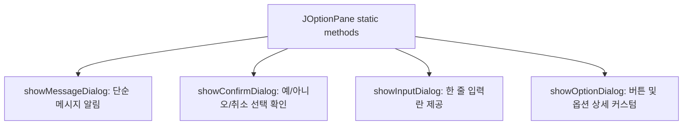

# 1. JDialog (다이얼로그/대화상자)

`JDialog`는 사용자로부터 특별한 입력을 받거나 표준적인 정보를 출력하기 위한 임시 윈도우 창입니다. `JFrame`과 같이 독립적인 화면 출력이 가능한 최상위 컨테이너(Top-level Container)의 일종입니다.

### 1) 주요 생성자
* `JDialog(Frame owner)`: 지정한 부모 프레임(`owner`)에 종속된 다이얼로그를 생성합니다 (기본적으로 비모달 상태).
* `JDialog(Frame owner, String title)`: 창 제목을 지정하여 생성합니다.
* `JDialog(Frame owner, String title, boolean modal)`: 창 제목과 **모달(Modal) 여부**를 설정하여 생성합니다.

### 2) 모달(Modal) vs 모달리스(Modal-less/Modeless) 다이얼로그

자바 GUI에서 다이얼로그는 입력을 차단하는 성격에 따라 두 가지 작동 모드를 지원합니다.

| 구분 | 모달 (Modal) 다이얼로그 | 모달리스 (Modal-less) 다이얼로그 |
| :--- | :--- | :--- |
| **특징** | 사용자 입력을 독점합니다. | 부모 창과 독립적으로 작업이 진행됩니다. |
| **제한 사항** | 다이얼로그가 닫히기(X 버튼 또는 Close) 전에는 부모 창(`JFrame`)에 포커스를 주거나 클릭, 타이핑 등 다른 상호작용 작업을 전혀 할 수 없습니다. | 다이얼로그 창이 띄워져 있는 상태에서도 언제든지 부모 창으로 포커스를 이동하여 자유롭게 작업이 가능합니다. |
| **설정 방법** | 생성자 세 번째 매개변수에 `true`를 대입하거나 `setModal(true)`을 호출합니다. | 생성자에서 생략하거나 `setModal(false)`을 설정합니다 (디폴트). |

### 3) 주요 제어 메서드
* `void setModal(boolean b)`: 다이얼로그의 모달 여부를 동적으로 전환합니다.
* `boolean isModal()`: 현재 모달 모드로 동작 중인지 확인합니다.
* `void dispose()`: 다이얼로그를 닫고 해당 창과 하위 모든 컴포넌트가 점유하고 있던 운영체제의 시스템 자원(Memory, Thread 등)을 반환하여 해제합니다.
* `void setLocationRelativeTo(Component c)`: 다이얼로그가 뜨는 위치를 지정 컴포넌트 `c` (주로 부모 프레임)의 정중앙에 나타나도록 조율합니다. `null`을 넘겨주면 화면 정중앙에 뜹니다.
* `void setUndecorated(boolean b)`: 다이얼로그 상단의 타이틀바와 외각 테두리를 삭제합니다 (`setVisible(true)` 호출 전에 사전 설정해야 합니다).
* `void pack()`: 다이얼로그 내부에 배치된 컴포넌트들의 기본 선호 크기(Preferred Size)에 맞추어 창 크기를 타이트하게 자동 조정합니다.

---

# 2. JOptionPane (옵션 팬)

`JOptionPane`은 간단하고 정형화된 안내창, 입력창, 확인창을 개발자가 복잡하게 프레임이나 다이얼로그를 새로 설계하지 않고도 **정적(static) 메서드 호출 단 한 줄**로 띄울 수 있도록 돕는 유틸리티 팝업 다이얼로그 클래스입니다.



### 1) 메시지 다이얼로그 (Message Dialog)
사용자에게 단순히 중요한 알림 문자열을 전하거나 오류를 경고할 목적으로 사용합니다.
```java
JOptionPane.showMessageDialog(
    null, // 부모 컴포넌트 (null이면 화면 정중앙에 위치)
    "파일을 찾을 수 없습니다.", // 출력 메시지 내용
    "오류", // 타이틀 바 텍스트
    JOptionPane.ERROR_MESSAGE // 메시지 타입 (아이콘 및 경고음 결정)
);
```
* **메시지 타입 정적 상수**:
  * `JOptionPane.ERROR_MESSAGE`: 심각한 실패/에러 알림 (빨간색 X 아이콘)
  * `JOptionPane.INFORMATION_MESSAGE`: 일반 정보 알림 (기본값, 파란색 i 아이콘)
  * `JOptionPane.WARNING_MESSAGE`: 임시 경고/주의 사항 전파 (노란색 느낌표 아이콘)
  * `JOptionPane.QUESTION_MESSAGE`: 질문 팝업 (초록색 물음표 아이콘)
  * `JOptionPane.PLAIN_MESSAGE`: 특정 내장 아이콘 없이 플레인 텍스트만 출력

### 2) 확인 다이얼로그 (Confirm Dialog)
어떤 작업을 수행하기 전 사용자에게 동의(예/아니오) 및 확인 동작을 명시적으로 수집하여 정수 응답을 받습니다.
```java
int result = JOptionPane.showConfirmDialog(
    null,
    "변경 사항을 저장하시겠습니까?",
    "확인",
    JOptionPane.YES_NO_OPTION, // 버튼 조합 옵션
    JOptionPane.QUESTION_MESSAGE // 메시지 타입
);

if (result == JOptionPane.YES_OPTION) {
    // 저장 로직 실행
} else if (result == JOptionPane.NO_OPTION) {
    // 저장 없이 계속 진행
} else if (result == JOptionPane.CLOSED_OPTION) {
    // 사용자가 X 버튼을 눌러 창을 닫은 경우
}
```
* **버튼 조합 옵션 (`optionType`)**:
  * `YES_NO_OPTION`: [예], [아니오] 버튼 제공
  * `YES_NO_CANCEL_OPTION`: [예], [아니오], [취소] 버튼 제공
  * `OK_CANCEL_OPTION`: [확인], [취소] 버튼 제공
* **반환 상수 결과값**: `YES_OPTION`, `NO_OPTION`, `CANCEL_OPTION`, `OK_OPTION`, `CLOSED_OPTION`

### 3) 입력 다이얼로그 (Input Dialog)
사용자에게 텍스트 입력창이 있는 팝업 창을 띄워 한 줄 문자열을 입력받습니다.
```java
String userInput = JOptionPane.showInputDialog(
    null,
    "사용자 이름을 입력하세요.",
    "로그인 정보 입력",
    JOptionPane.QUESTION_MESSAGE
);

if (userInput != null) {
    System.out.println("입력된 이름: " + userInput);
} else {
    System.out.println("사용자가 입력을 취소했습니다."); // 취소 버튼 클릭 혹은 창 닫기 시 null 반환
}
```

---

# 3. JFileChooser (파일 선택 상자)

`JFileChooser`는 운영체제(OS)의 내장 파일 탐색기 창을 호출하여 사용자가 로컬 디렉터리 및 파일을 안전하고 손쉽게 탐색하고 열기/저장할 수 있게 지원합니다.

### 1) 주요 파일 다이얼로그 출력 메서드
* `int showOpenDialog(Component parent)`: 파일 열기용 창을 띄웁니다.
* `int showSaveDialog(Component parent)`: 파일 저장용 창을 띄웁니다.
* **반환값 상수**:
  * `JFileChooser.APPROVE_OPTION`: 사용자가 정상적으로 파일 선택 후 [열기/저장] 버튼을 클릭함.
  * `JFileChooser.CANCEL_OPTION`: 사용자가 작업을 중단하고 [취소] 버튼을 클릭함.
  * `JFileChooser.ERROR_OPTION`: 예상치 못한 에러가 발생했거나 다이얼로그를 강제로 비정상 종료함.

### 2) 파일 확장자 필터 설정 (FileNameExtensionFilter)
특정 확장자(예: 이미지 포맷 `.jpg`, `.gif`)의 파일만 파일 선택 목록창에 걸러져 나오도록 파일 필터를 구성하여 적용할 수 있습니다.
```java
JFileChooser chooser = new JFileChooser();

// 파일 필터 객체 생성 (설명 텍스트, 적용 확장자 나열...)
FileNameExtensionFilter filter = new FileNameExtensionFilter("JPG & GIF Images", "jpg", "gif");
chooser.setFileFilter(filter); // 필터 적용

int ret = chooser.showOpenDialog(null); // 다이얼로그 가동
if (ret == JFileChooser.APPROVE_OPTION) {
    // 사용자가 최종 선택한 파일의 절대 경로와 파일 이름 획득
    String pathName = chooser.getSelectedFile().getPath();
    String fileName = chooser.getSelectedFile().getName();
    System.out.println("선택 파일 경로: " + pathName);
}
```

> [!WARNING]
> **`JFileChooser`는 물리적 자원의 이름과 경로 텍스트(String) 및 파일 핸들러(`File`) 객체만을 반환할 뿐입니다.** 실제 해당 파일을 디스크에서 읽어 들이거나 데이터를 기록하는 입출력(I/O) 흐름 제어(Stream)는 `FileInputStream`, `BufferedReader` 등 자바 파일 I/O 클래스를 통해 **별도로 작성해야 합니다.**

---

# 4. JColorChooser (색상 선택 상자)

`JColorChooser`는 사용자에게 다채로운 컬러 팔레트 창을 팝업 형식으로 제공하여 정교한 색상 값을 직관적으로 고를 수 있게 돕는 모달 다이얼로그입니다.

```java
// 컬러 다이얼로그 출력 및 선택
Color selectedColor = JColorChooser.showDialog(
    null, // 부모 컴포넌트
    "글자 색상 선택", // 다이얼로그 창 타이틀
    Color.YELLOW // 초기 노출 선택 색상
);

if (selectedColor != null) {
    // 사용자가 '확인' 버튼을 클릭하여 정상적으로 색을 선택함
    myLabel.setForeground(selectedColor); // 글씨 색상을 선택 색으로 갱신
} else {
    // 사용자가 '취소'를 누르거나 창을 강제 종료하여 무효화됨 (null 반환)
}
```

---

# Citations
* [13Swing.pdf](../../../raw/notes/java/13Swing.pdf)
