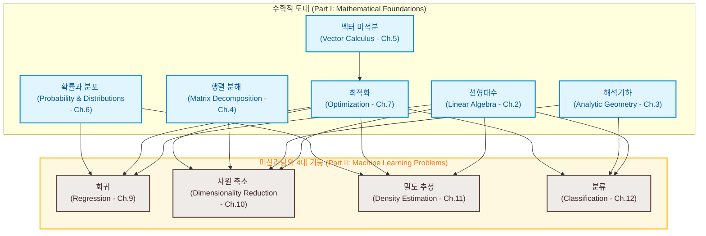

# 1. 서론 및 동기 (Introduction and Motivation)

머신러닝(Machine learning)은 데이터로부터 가치 있는 정보를 **자동으로(automatically)** 추출하는 알고리즘을 설계하는 학문입니다. 여기서 강조점은 "자동"에 있습니다. 즉, 머신러닝은 수많은 데이터셋에 보편적으로 적용할 수 있는 일반적인 목적의 방법론(general-purpose methodologies)을 다루는 동시에, 이를 통해 의미 있는 결과물을 만들어내는 데 관심을 둡니다. 

머신러닝의 핵심에는 크게 세 가지 개념이 자리 잡고 있습니다. 바로 **데이터(data)**, **모델(model)**, **학습(learning)**입니다.

* **데이터 (Data)**: 머신러닝은 본질적으로 데이터 기반(data-driven) 학문이기 때문에 데이터가 가장 중심에 놓입니다. 머신러닝의 목표는 도메인 고유의 전문 지식(domain-specific expertise)에 과도하게 의존하지 않고도, 데이터 내에서 가치 있는 패턴을 추출할 수 있는 범용 방법론을 설계하는 것입니다. 예를 들어, 방대한 문서 말뭉치(예: 수많은 도서관의 책들)가 주어졌을 때 머신러닝 기법을 사용하면 문서들 사이에 공유되는 관련 주제들을 자동으로 찾아낼 수 있습니다 (Hoffman et al., 2010).
* **모델 (Model)**: 이러한 목표를 달성하기 위해 우리는 일반적으로 데이터를 생성하는 프로세스와 관련된 모델을 설계합니다. 이 모델은 우리가 부여받은 실제 데이터셋과 유사하게 동작하도록 고안됩니다. 예를 들어, 회귀(regression) 문제 설정에서 모델은 입력값을 실수 값 출력값으로 매핑하는 함수를 묘사하게 됩니다.
* **학습 (Learning)**: 톰 미첼(Tom Mitchell, 1997)의 말을 빌리자면, "주어진 작업(task)에 대한 모델의 성능이 데이터를 반영한 이후에 향상된다면, 그 모델은 데이터로부터 학습한다"고 말할 수 있습니다. 궁극적인 목표는 우리가 미래에 관심을 가질 법한, 아직 보지 못한 데이터(unseen data)에 대해서도 훌륭하게 일반화(generalize)할 수 있는 좋은 모델을 찾아내는 것입니다. 이때 학습이란 모델의 매개변수(parameters)를 최적화함으로써 데이터 안의 패턴과 구조를 자동으로 찾아내는 일련의 과정으로 이해할 수 있습니다.

머신러닝 분야는 그동안 수많은 성공 사례를 만들어냈고 풍부하고 유연한 머신러닝 시스템을 설계하고 훈련할 수 있는 소프트웨어도 시중에 손쉽게 구할 수 있게 되었습니다. 하지만 저자들은 더욱 복잡한 머신러닝 시스템이 구축되는 기본 원리를 이해하기 위해 **머신러닝의 수학적 기초(mathematical foundations)**를 아는 것이 매우 중요하다고 믿습니다. 이러한 수학적 원리를 이해하는 것은 새로운 머신러닝 솔루션을 창조하고, 기존의 접근법을 이해하며 디버깅하고, 우리가 다루는 방법론 내에 내재된 가정들과 한계점을 명확히 인지하는 데 큰 도움을 줍니다.

---

# 1.1 직관을 위한 단어 정립 (Finding Words for Intuitions)

머신러닝을 공부하며 정기적으로 마주하는 큰 과제 중 하나는 **개념과 단어들이 모호하고 미끄러지기 쉽다(slippery)**는 점입니다. 머신러닝 시스템의 특정 구성 요소는 서로 다른 수학적 개념으로 추상화될 수 있습니다. 

예를 들어, **"알고리즘(algorithm)"**이라는 단어는 머신러닝의 문맥에서 최소 두 가지 이상의 서로 다른 의미로 혼용됩니다.
1. **예측기 (Predictor)**: 입력 데이터를 기반으로 예측을 수행하는 시스템 그 자체를 의미할 때 "머신러닝 알고리즘"이라는 단어를 씁니다.
2. **훈련 과정 (Training)**: 예측기가 미래의 새로운 입력 데이터에 대해 잘 작동할 수 있도록 예측기 내부의 일부 매개변수를 조정(적응)시키는 시스템을 의미할 때도 똑같이 "머신러닝 알고리즘"이라는 단어를 씁니다. 본서에서는 이러한 조정을 **시스템을 훈련한다(training a system)**고 부릅니다.

이 책이 이러한 용어의 모호성 문제를 완벽히 해결해주지는 못하겠지만, 문맥에 따라 동일한 표현이 전혀 다른 의미를 지닐 수 있다는 점을 미리 강조하고자 합니다. 다만, 저자들은 문맥을 충분히 명확하게 제공하여 모호함의 수준을 최소화하도록 노력할 것입니다.

본서의 1부(Part I)는 머신러닝 시스템의 세 가지 핵심 구성 요소인 데이터, 모델, 학습에 대해 말하기 위해 필요한 수학적 개념과 기초를 소개합니다. 아래에서 이 세 가지를 간략하게 스케치하고, 필요한 수학적 도구들을 모두 논의한 뒤인 8장에서 이를 다시 자세히 조명하겠습니다.

* **벡터로서의 데이터 (Data as vectors)**: 세상의 모든 데이터가 수치형(numerical)인 것은 아니지만, 데이터를 숫자 형식으로 간주하는 것이 유용한 경우가 많습니다. 본서에서는 데이터가 컴퓨터 프로그램으로 읽어 들이기에 적합한 수치적 표현으로 이미 적절하게 변환되었다고 가정합니다. 따라서 우리는 데이터를 **벡터(vectors)**로 생각합니다. 벡터라는 단어 역시 굉장히 미묘한데, 이를 바라보는 관점은 최소 세 가지가 존재합니다.
  1. **컴퓨터 과학적 관점**: 수(numbers)의 배열(array)로 바라봄.
  2. **물리학적 관점**: 방향(direction)과 크기(magnitude)를 가진 화살표로 바라봄.
  3. **수학적 관점**: 덧셈과 스케일링(실수배) 규칙을 따르는 추상적인 객체로 바라봄.
* **모델 (Model)**: 모델은 대개 당장의 데이터셋과 유사한 데이터를 만들어내는 물리적/수학적 과정을 묘사하는 데 사용됩니다. 따라서 좋은 모델은 데이터를 생성하는 실제(그러나 우리가 알지 못하는) 프로세스의 단순화된 버전으로 생각할 수 있으며, 데이터를 모델링하고 그 안에 숨겨진 패턴을 추출하는 데 유용한 측면들을 담아냅니다. 잘 만들어진 좋은 모델이 있다면 실제 세계에서 직접 실험을 거치지 않고도 어떤 일이 일어날지 가상으로 예측할 수 있습니다.
* **학습 (Learning)**: 이제 머신러닝의 가장 핵심적인 '학습' 구성 요소를 살펴봅니다. 우리에게 데이터셋과 적절한 모델이 주어졌다고 가정해 봅시다. 모델을 훈련한다는 것은 확보된 데이터를 활용하여 모델이 훈련 데이터를 얼마나 잘 예측하는지 평가하는 **효용 함수(utility function)**를 기준으로 모델의 파라미터를 최적화하는 것을 의미합니다. 대부분의 훈련 방식은 산을 기어올라 정상에 도달하는 **언덕 오르기(hill climbing)** 방식과 유사합니다. 이 비유에서 산의 정상은 우리가 달성하고자 하는 어떤 성능 지표의 최댓값에 대응합니다. 
  그러나 실제 상황에서 우리가 진정 바라는 것은 모델이 아직 보지 못한 데이터(unseen data)에 대해서도 훌륭히 작동하는 것입니다. 이미 본 데이터(훈련 데이터)에 대해서만 극도로 잘 작동하는 것은 데이터를 그저 단순 암기(memorize)한 것에 불과할 수 있습니다. 이는 새로운 데이터에 대한 **일반화(generalization)** 성능을 떨어뜨릴 수 있으며, 실제 응용에서는 머신러닝 시스템이 이전에 겪어보지 못한 낯선 상황에 노출되는 일이 빈번하므로 주의해야 합니다.

### 머신러닝 핵심 개념 요약
1. 우리는 데이터를 **벡터**로 표현합니다.
2. 확률적 관점 또는 최적화 관점을 사용하여 적절한 **모델**을 선택합니다.
3. 훈련에 사용되지 않은 데이터에 대해서도 모델이 잘 작동하는 것을 목표로 삼고, 수치적 최적화 기법을 적용하여 가용한 데이터로부터 **학습**을 진행합니다.

---

# 1.2 이 책을 읽는 두 가지 방법 (Two Ways to Read This Book)

머신러닝을 위한 수학을 이해하는 전략에는 크게 두 가지가 있습니다.

* **상향식 (Bottom-up)**: 기초적인 개념에서 시작하여 점진적으로 고도의 수학 개념을 쌓아 올리는 방식입니다. 이는 수학과 같은 기술적 분야에서 주로 선호되는 방식입니다. 이 전략의 장점은 독자가 항상 이전에 완벽히 학습한 개념에 기반하여 다음 단계로 나아갈 수 있다는 점입니다. 단점은 실무자나 응용 연구자 입장에서 기초 개념 그 자체만으로는 흥미를 느끼기 어렵고, 동기부여가 부족하여 기초 정의들을 금방 잊어버리게 된다는 점입니다.
* **하향식 (Top-down)**: 실무적인 필요성에서 출발하여 아래에 깔린 수학적 요구 조건들을 역으로 추적해 들어가는 방식입니다. 이 목표 지향적인 접근법의 장점은 독자가 특정 수학 개념을 왜 공부해야 하는지 그 이유를 언제나 명확히 알고 시작할 수 있다는 점입니다. 반면 단점은 모래 위에 성을 쌓듯 수학적 기반이 흔들릴 수 있으며, 제대로 이해하지 못한 채 암기해야 하는 낯선 단어들의 집합을 안고 가야 한다는 점입니다.

저자들은 기초적인 수학 개념과 머신러닝 응용 부문을 모듈식으로 분리하여 설계함으로써 이 책이 상향식과 하향식 두 가지 방법 모두로 읽힐 수 있도록 저술했습니다. 본서는 크게 두 부분으로 나뉩니다.
* **1부 (Part I)**: 수학적 토대(Mathematical Foundations)를 다집니다. 1부의 챕터들은 대개 이전 장들의 내용을 토대로 구축되지만, 필요에 따라 특정 장을 건너뛰고 역방향으로 돌아와서 공부하는 것도 가능합니다.
* **2부 (Part II)**: 1부의 개념들을 기반으로 구축된 머신러닝의 **네 가지 기둥(four pillars of machine learning)**인 **회귀, 차원 축소, 밀도 추정, 분류** 문제를 해결하는 데 적용합니다. 2부의 각 장들은 서로 느슨하게 연결되어 있어 어떤 순서로든 독립적으로 읽을 수 있습니다. 

책 전체에 걸쳐 1부의 수학적 개념과 2부의 머신러닝 알고리즘을 유기적으로 엮어주는 수많은 앞뒤 참조 표시(forward and backward pointers)가 배치되어 있습니다. 물론 두 가지 방법 외에도 대다수 독자는 상향식과 하향식을 적절히 융합하여 더 복잡한 개념에 도전하기 전에 기초 수학을 먼저 다지고, 응용 분야의 필요에 맞춰 수학 장들을 오가는 하이브리드 방식으로 학습하게 될 것입니다.

---

### [시각 자료 분석] 머신러닝의 수학적 기초와 4대 기둥 (Figure 1.1)

MML 서론의 핵심인 **Figure 1.1**은 1부의 수학 도구들과 2부의 머신러닝 핵심 문제들이 어떻게 상호 관계를 맺고 지탱하는지 보여줍니다. 아래 다이어그램은 원서의 레이아웃을 반영하여 재구성한 매핑 구조입니다.

---

## 1.2.1 Part I: 수학에 대하여 (Part I Is about Mathematics)

머신러닝의 4대 기둥을 떠받치기 위해서는 견고한 수학적 기초가 필수적이며, 이는 1부에서 다루어집니다.

* **선형대수 (Linear Algebra - Chapter 2)**: 수치 데이터를 벡터로 표현하고, 이러한 데이터의 테이블(행렬)을 다루는 학문입니다. 벡터와 행렬의 정의, 그리고 행렬의 연산 등을 학습합니다.
* **해석기하 (Analytic Geometry - Chapter 3)**: 실제 세계의 객체들을 나타내는 두 벡터가 주어졌을 때, 이들의 **유사도(similarity)**를 파악해야 합니다. 우리의 머신러닝 알고리즘(예측기)이 유사한 입력 벡터들에 대해 유사한 출력값을 내놓아야 하기 때문입니다. 이러한 유사도와 거리(distances) 개념을 수학적으로 엄밀하게 구성하는 핵심 원리가 해석기하에 담겨 있습니다.
* **행렬 분해 (Matrix Decomposition - Chapter 4)**: 행렬에 대한 특정 분해 연산들은 머신러닝에서 극도로 유용합니다. 이를 통해 데이터에 대한 직관적인 해석을 얻을 수 있고, 보다 효율적인 학습 연산을 수행할 수 있게 됩니다.
* **확률과 분포 (Probability & Distributions - Chapter 6)**: 우리는 보통 획득한 데이터를 실제 내재된 신호(true underlying signal)에 **노이즈(noise)**가 섞여서 관측된 것으로 생각합니다. 머신러닝을 적용해 노이즈로부터 본래의 신호를 찾아내려면 우선 "노이즈"가 무엇인지 정량화할 수 있는 언어가 필요합니다. 또한 특정 테스트 데이터 포인트에서 모델이 예측한 값에 대해 스스로가 얼마나 확신을 가졌는지(불확실성, uncertainty) 정량화하여 표현해 주는 예측기를 만드는 데도 확률론이 핵심적인 기여를 합니다.
* **벡터 미적분 (Vector Calculus - Chapter 5)**: 머신러닝 모델을 학습시킬 때, 우리는 어떤 성능 측정 지표를 극대화하는 매개변수를 찾고자 합니다. 수많은 최적화 기법은 솔루션을 어느 방향으로 찾아갈지 안내해 주는 **그래디언트(gradient)** 개념을 필요로 합니다. 벡터 미적분 장에서는 그래디언트의 수학적 개념을 상세히 설명합니다.
* **최적화 (Optimization - Chapter 7)**: 벡터 미적분에서 다룬 그래디언트를 실제로 활용하여 함수의 최댓값 또는 최솟값을 수치적으로 찾아 나가는 최적화 기법들을 학습합니다.

---

## 1.2.2 Part II: 머신러닝에 대하여 (Part II Is about Machine Learning)

책의 2부는 머신러닝의 4대 기둥을 본격적으로 다루며, 1부의 수학이 각 기둥에서 어떻게 구체적으로 사용되는지 설명합니다. 장들은 대략 난이도가 상승하는 순서로 배치되어 있습니다.

* **머신러닝의 세 가지 구성 요소 (Chapter 8)**: 1부의 수학적 기초를 다 배운 뒤, 머신러닝의 3대 요소(데이터, 모델, 매개변수 추정)를 엄밀한 수학적 수식으로 재정의합니다. 아울러 머신러닝 시스템이 과거 데이터에만 과도하게 최적화되어 낙관적으로 오평가되는 것을 방지하기 위해, 보지 못한 데이터에 대해 강건하게 작동하도록 실험 환경을 구성하는 가이드라인을 제공합니다.
* **회귀 (Regression - Chapter 9)**: 회귀의 목표는 입력값 $\mathbf{x} \in \mathbb{R}^D$를 그에 대응하는 관측된 함수 값 $y \in \mathbb{R}$ (여기서 $y$는 레이블 역할)로 매핑하는 함수를 찾는 것입니다. 최대 우도(Maximum Likelihood, ML) 및 최대 사후 확률(Maximum A Posteriori, MAP) 추정을 통한 전통적인 매개변수 피팅 기법뿐만 아니라, 최적화 대신 파라미터 자체를 적분하여 소거하는 베이지안 선형 회귀(Bayesian linear regression)까지 상세히 탐구합니다.
* **차원 축소 (Dimensionality Reduction - Chapter 10)**: 주성분 분석(PCA)을 활용해 차원 축소를 배웁니다. 고차원 데이터 $\mathbf{x} \in \mathbb{R}^D$를 원래 정보보다 분석하기 쉬운 저차원의 조밀한 표현으로 변환하는 것이 핵심 목표입니다. 회귀와 달리 차원 축소는 순수하게 데이터 자체를 모델링하는 데 주력하며, 데이터 포인트 $\mathbf{x}$에 대응하는 정답 레이블($y$)이 존재하지 않는 비지도 학습 영역입니다.
* **밀도 추정 (Density Estimation - Chapter 11)**: 주어진 데이터셋을 가장 잘 설명하는 확률 분포(probability distribution)를 찾아내는 모델을 구축합니다. 본서에서는 가우시안 혼합 모델(Gaussian Mixture Models, GMM)을 중점적으로 다루며, 이 모델의 파라미터를 찾아내기 위한 반복적인 최적화 방법론을 논의합니다. 차원 축소와 마찬가지로 정답 레이블이 없으나, 저차원 표상을 찾는 대신 데이터를 묘사하는 연속적인 밀도 모델 자체를 구한다는 점에서 차이가 있습니다.
* **분류 (Classification - Chapter 12)**: 머신러닝의 네 번째 기둥인 분류 문제를 서포트 벡터 머신(Support Vector Machines, SVM)의 맥락에서 심도 있게 다루며 책을 마무리합니다. 회귀와 유사하게 입력 $\mathbf{x}$와 레이블 $y$를 매핑하지만, 회귀의 레이블이 연속적인 실수였던 것과 달리 분류의 레이블은 이산적인 정수(integers) 형태를 띠므로, 이를 처리하기 위한 특별한 수학적 처리가 요구됩니다.

---

# 1.3 연습문제와 피드백 (Exercises and Feedback)

책의 1부(Part I) 수학 파트에는 펜과 종이로 직접 풀어볼 수 있는 유용한 연습문제들이 수록되어 있습니다. 2부(Part II) 머신러닝 파트에서는 우리가 논의한 머신러닝 알고리즘들의 여러 성질을 코드로 직접 실험하고 탐구해 볼 수 있는 프로그래밍 튜토리얼(Jupyter Notebooks)이 제공됩니다.

출판사인 Cambridge University Press는 교육과 배움의 대중화를 지향하는 저자들의 취지를 적극 지지하여, 아래 공식 홈페이지를 통해 책의 디지털 버전을 무료로 다운로드할 수 있도록 지원하고 있습니다.
* 공식 홈페이지: [https://mml-book.com](https://mml-book.com)

이 웹사이트에서 코딩 튜토리얼, 정오표(errata), 그리고 추가 학습 자료들을 이용할 수 있으며, 책의 오류 보고나 피드백 제출 역시 해당 URL을 통해 진행할 수 있습니다.

---

# Related Concepts
* [MML Study Index](index.md)
* [ML Index](../index.md)

# Citations
* [Marc Peter Deisenroth, A. Aldo Faisal, Cheng Soon Ong, *Mathematics for Machine Learning* (Chapter 1)](../../../raw/notes/math_for_deeplearning/mml-book.pdf)
