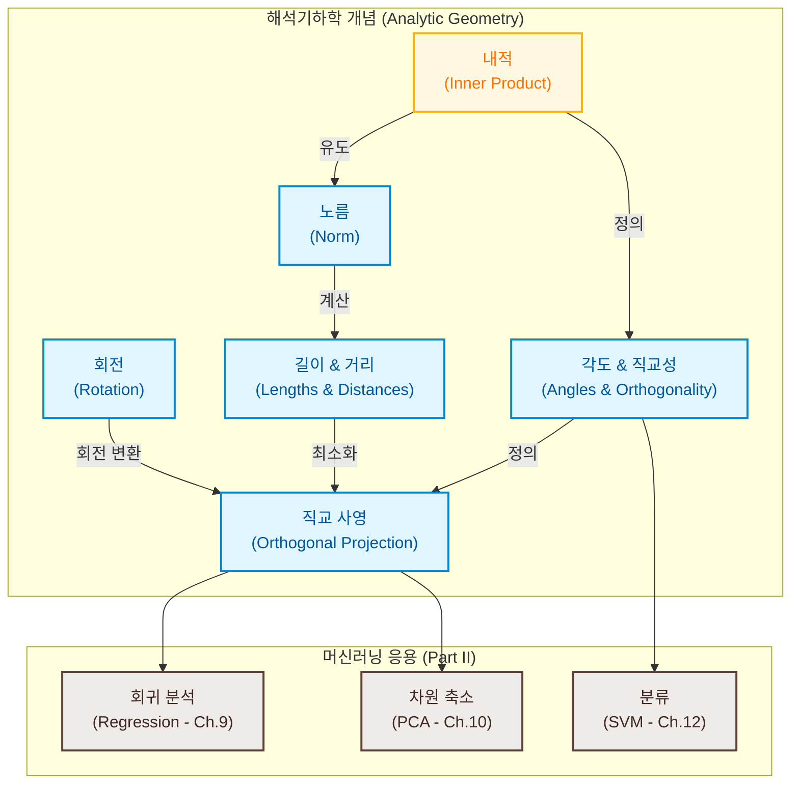

# 3. 해석기하학 (Analytic Geometry)

선형대수의 추상적인 벡터 공간 구조 위에 기하학적인 직관(길이, 거리, 각도 등)을 부여하기 위해서는 벡터 공간에 **내적(inner product)**이라는 추가적인 연산 체계를 장착해야 합니다. 내적과 이로부터 유도되는 **노름(norm)** 및 **거리(metric)**는 머신러닝의 유사도(similarity) 평가의 근간이 되며, 서포트 벡터 머신(SVM), 주성분 분석(PCA), 그리고 최소제곱 회귀 분석의 기초 뼈대를 구성합니다.

---

### [시각 자료] 해석기하학 개념 마인드맵 (Figure 3.1)

본 장에서 다루는 기하학적 개념들과 머신러닝 문제 사이의 유기적 매핑 관계를 나타낸 도식입니다.



---

# 3.1 노름 (Norms)

기하 벡터의 길이는 직관적으로 시작점(원점)에서 끝점까지의 거리를 의미합니다. 임의의 일반적인 벡터 공간 상에서 이 '길이'의 개념을 수학적으로 추상화하여 공리화한 함수가 **노름(Norm)**입니다.

### [정의 3.1] 노름
벡터 공간 $V$ 위에서 정의된 함수 $\|\cdot\|: V \to \mathbb{R}$가 모든 $\lambda \in \mathbb{R}$ 및 $\mathbf{x}, \mathbf{y} \in V$에 대하여 다음 세 공리를 만족할 때, 이를 **노름**이라 정의하고 $\|\mathbf{x}\|$를 벡터 $\mathbf{x}$의 **길이(length)**라고 합니다.
1. **절대 동차성 (Absolutely homogeneous)**:
   $$\|\lambda\mathbf{x}\| = |\lambda|\|\mathbf{x}\|$$
2. **삼각부등식 (Triangle inequality)**:
   $$\|\mathbf{x} + \mathbf{y}\| \le \|\mathbf{x}\| + \|\mathbf{y}\|$$
   (기하학적으로 삼각형의 임의의 한 변의 길이는 나머지 두 변의 길이의 합보다 작거나 같음을 뜻합니다; Figure 3.2 참조.)
3. **양의 정치성 (Positive definite)**:
   $$\|\mathbf{x}\| \ge 0 \quad \text{and} \quad \|\mathbf{x}\| = 0 \Longleftrightarrow \mathbf{x} = \mathbf{0}$$

### 대표적인 노름의 예시

* **맨해튼 노름 (Manhattan Norm / $\ell_1$ 노름)**:
   $$\|\mathbf{x}\|_1 := \sum_{i=1}^{n} |x_i| \tag{3.3}$$
   * 각 성분의 절대값의 합으로 계산됩니다. 격자 형태의 도시 도로망에서 두 지점 사이의 최단 거리를 구하는 방식과 유사하여 맨해튼 노름이라 불립니다.
   * 2차원 공간 상에서 맨해튼 노름의 크기가 1인 벡터들의 집합($\|\mathbf{x}\|_1 = 1$)은 원점을 중심으로 기울어진 정사각형 다이아몬드 형상을 띱니다 (Figure 3.3 좌측 묘사).
* **유클리드 노름 (Euclidean Norm / $\ell_2$ 노름)**:
   $$\|\mathbf{x}\|_2 := \sqrt{\sum_{i=1}^{n} x_i^2} = \sqrt{\mathbf{x}^{\top}\mathbf{x}} \tag{3.4}$$
   * 우리가 기하학적으로 생각하는 일반적인 최단 직선거리에 해당합니다.
   * 2차원 공간 상에서 유클리드 노름의 크기가 1인 벡터들의 집합($\|\mathbf{x}\|_2 = 1$)은 원점을 중심으로 하는 반지름 1의 **단위 원**을 형성합니다 (Figure 3.3 우측 묘사).
   * **본서에서는 특별한 명시가 없는 한 기본 노름으로 유클리드 노름을 채택합니다.**

---

# 3.2 내적 (Inner Products)

내적은 두 벡터를 입력받아 실수를 출력하는 연산으로, 공간 상에서 두 벡터의 방향적 유사도, 각도, 직교성 등을 정의하는 핵심 대수 구조입니다.

### 3.2.1 쌍선형 사상 (Bilinear Mapping)
내적의 토대가 되는 **쌍선형 사상 $\Omega$**는 두 개의 벡터 인자를 받아 각각의 인자에 대해 독립적으로 선형성(Linearity)을 보존하는 함수입니다. 즉, 임의의 $\mathbf{x}, \mathbf{y}, \mathbf{z} \in V$ 및 $\lambda, \psi \in \mathbb{R}$에 대해 다음이 성립합니다.
* 첫 번째 인자에 대한 선형성:
  $$\Omega(\lambda\mathbf{x} + \psi\mathbf{y}, \mathbf{z}) = \lambda\Omega(\mathbf{x}, \mathbf{z}) + \psi\Omega(\mathbf{y}, \mathbf{z}) \tag{3.6}$$
* 두 번째 인자에 대한 선형성:
  $$\Omega(\mathbf{x}, \lambda\mathbf{y} + \psi\mathbf{z}) = \lambda\Omega(\mathbf{x}, \mathbf{y}) + \psi\Omega(\mathbf{x}, \mathbf{z}) \tag{3.7}$$

### 3.2.2 일반 내적의 정의

### [정의 3.2 & 3.3] 내적 (Inner Product)
벡터 공간 $V$ 위에서 정의된 대칭적이고(symmetric) 양의 정치적인(positive definite) 쌍선형 사상 $\langle \cdot, \cdot \rangle : V \times V \to \mathbb{R}$을 **내적**이라 정의합니다. 즉, 다음 세 공리를 만족합니다.
1. **쌍선형성 (Bilinearity)**: 식 (3.6) 및 (3.7)을 만족한다.
2. **대칭성 (Symmetry)**: 두 인자의 순서를 바꾸어도 결과가 같다.
   $$\forall \mathbf{x}, \mathbf{y} \in V: \langle\mathbf{x}, \mathbf{y}\rangle = \langle\mathbf{y}, \mathbf{x}\rangle$$
3. **양의 정치성 (Positive definiteness)**: 영벡터가 아닌 자기 자신과의 내적은 언제나 양수이다.
   $$\forall \mathbf{x} \in V \setminus \{\mathbf{0}\}: \langle\mathbf{x}, \mathbf{x}\rangle > 0 \quad \text{and} \quad \langle\mathbf{0}, \mathbf{0}\rangle = 0$$

* **내적 공간 (Inner Product Space)**: 내적이 장착된 벡터 공간 쌍 $(V, \langle \cdot, \cdot \rangle)$을 내적 공간이라고 부릅니다. 
* **유클리드 벡터 공간**: 내적으로 일반 도트 곱(dot product, $\mathbf{x}^{\top}\mathbf{y} = \sum x_iy_i$)을 사용하는 특수한 내적 공간입니다.

---

### 3.2.3 대칭 양의 정치 행렬 (Symmetric, Positive Definite Matrices)

임의의 $n$차원 유한 차원 내적 공간 $V$와 그 순서 기저 $B = (\mathbf{b}_1, \dots, \mathbf{b}_n)$가 주어졌을 때, 임의의 두 벡터 $\mathbf{x} = \sum \psi_i\mathbf{b}_i$, $\mathbf{y} = \sum \lambda_j\mathbf{b}_j$의 내적은 쌍선형성에 의해 기저 벡터 간의 내적들의 가중합으로 완벽히 표현됩니다:
$$\langle\mathbf{x}, \mathbf{y}\rangle = \left\langle \sum_{i=1}^{n}\psi_i\mathbf{b}_i, \sum_{j=1}^{n}\lambda_j\mathbf{b}_j \right\rangle = \sum_{i=1}^{n}\sum_{j=1}^{n}\psi_i\langle\mathbf{b}_i, \mathbf{b}_j\rangle\lambda_j = \hat{\mathbf{x}}^{\top}\mathbf{A}\hat{\mathbf{y}} \tag{3.10}$$

여기서 행렬 성분 $A_{ij} := \langle\mathbf{b}_i, \mathbf{b}_j\rangle$ 이며, $\hat{\mathbf{x}}, \hat{\mathbf{y}}$는 각 벡터의 기저 $B$ 하에서의 좌표 벡터입니다. 내적의 대칭성과 양의 정치성은 행렬 $\mathbf{A}$가 다음과 같은 성질을 갖는 **대칭 양의 정치 행렬**임을 뜻합니다.

### [정의 3.4] 대칭 양의 정치 행렬
실수 대칭 정사각 행렬 $\mathbf{A} \in \mathbb{R}^{n \times n}$이 다음 조건을 만족할 때, 이를 **대칭 양의 정치(Symmetric, positive definite) 행렬**이라고 정의합니다.
$$\forall \mathbf{x} \in \mathbb{R}^n \setminus \{\mathbf{0}\}: \mathbf{x}^{\top}\mathbf{A}\mathbf{x} > 0 \tag{3.11}$$
(위 식에서 등호($\ge$) 조건만 만족하면 **대칭 양의 반정치, positive semidefinite** 행렬이라 부르며, Ch.12 SVM의 커널 정의의 핵심이 됩니다.)

### [정리 3.5] 내적과 대칭 양의 정치 행렬의 동치성
> 실수 유한 차원 벡터 공간 상의 임의의 사상 $\langle \cdot, \cdot \rangle$이 올바른 내적이 될 필요충분조건은, 좌표계 상에서 어떤 대칭 양의 정치 행렬 $\mathbf{A}$가 존재하여 $\langle\mathbf{x}, \mathbf{y}\rangle = \hat{\mathbf{x}}^{\top}\mathbf{A}\hat{\mathbf{y}}$ 로 계산되는 것입니다.

* **양의 정치 행렬의 성질**:
  1. 영공간(null space / kernel)은 오직 영벡터만 포함합니다. 즉, $\mathbf{A}$는 가역(regular) 행렬입니다.
  2. 행렬의 모든 주대각선 성분 $A_{ii}$는 언제나 엄격한 양수($A_{ii} > 0$)입니다.

---

# 3.3 길이와 거리 (Lengths and Distances)

임의의 내적이 정의되면, 그 내적은 자연스럽게 기하학적 **노름(길이)**을 다음과 같이 유도(induce)합니다:
$$\|\mathbf{x}\| := \sqrt{\langle\mathbf{x}, \mathbf{x}\rangle} \tag{3.16}$$
(단, 그 역은 성립하지 않습니다. 예컨대 맨해튼 노름은 어떤 내적으로도 유도할 수 없는 노름의 인스턴스입니다.)

### [정리] 코시-슈바르츠 부등식 (Cauchy-Schwarz Inequality)
> 내적 공간 상에서 임의의 두 벡터 $\mathbf{x}, \mathbf{y}$의 내적과 유도 노름 사이에는 언제나 다음 부등식이 지켜집니다.
> $$|\langle\mathbf{x}, \mathbf{y}\rangle| \le \|\mathbf{x}\|\|\mathbf{y}\| \tag{3.17}$$

### [정의 3.6] 거리와 메트릭 (Metric)
내적 공간 $(V, \langle \cdot, \cdot \rangle)$ 상에서 두 벡터 $\mathbf{x}, \mathbf{y}$의 **거리(distance)**는 다음과 같이 정의됩니다.
$$d(\mathbf{x}, \mathbf{y}) := \|\mathbf{x} - \mathbf{y}\| = \sqrt{\langle\mathbf{x}-\mathbf{y}, \mathbf{y}-\mathbf{x}\rangle} \tag{3.21}$$
이때 거리 함수 $d : V \times V \to \mathbb{R}$를 **메트릭(metric)**이라 부르며, 다음 3대 조건을 만족합니다:
1. **양의 정치성**: $d(\mathbf{x}, \mathbf{y}) \ge 0$ 이며, $d(\mathbf{x}, \mathbf{y}) = 0 \Longleftrightarrow \mathbf{x} = \mathbf{y}$.
2. **대칭성**: $d(\mathbf{x}, \mathbf{y}) = d(\mathbf{y}, \mathbf{x})$.
3. **삼각부등식**: $d(\mathbf{x}, \mathbf{z}) \le d(\mathbf{x}, \mathbf{y}) + d(\mathbf{y}, \mathbf{z})$.

> [!NOTE]
> 내적과 거리는 **반대 방향**으로 작동합니다. 두 벡터가 대단히 유사할수록 내적 값은 크게 나타나고, 거리 메트릭 값은 0에 가까운 매우 작은 값을 출력합니다.

---

# 3.4 각도와 직교성 (Angles and Orthogonality)

코시-슈바르츠 부등식(식 (3.17)) 덕분에, 영벡터가 아닌 임의의 두 벡터에 대해 분수식의 범위가 항상 $[-1, 1]$ 사이에 갇힘이 보증됩니다:
$$-1 \le \frac{\langle\mathbf{x}, \mathbf{y}\rangle}{\|\mathbf{x}\|\|\mathbf{y}\|} \le 1 \tag{3.24}$$

이 성질을 이용해 두 벡터 사이의 **기하학적 각도 $\omega \in [0, \pi]$**를 유일하게 정의할 수 있습니다.
$$\cos\omega = \frac{\langle\mathbf{x}, \mathbf{y}\rangle}{\|\mathbf{x}\|\|\mathbf{y}\|} \tag{3.25}$$

### [정의 3.7] 직교성과 정규직교성
* **직교 (Orthogonal)**: 두 벡터 $\mathbf{x}, \mathbf{y}$의 내적이 0일 때 이들은 서로 직교한다고 정의하고, $\mathbf{x} \perp \mathbf{y}$ 로 표기합니다. ($\langle\mathbf{x}, \mathbf{y}\rangle = 0$)
* **정규직교 (Orthonormal)**: 두 벡터가 서로 직교하는 동시에 각각의 크기가 $1$인 단위 벡터일 때 이들을 정규직교한다고 정의합니다. ($\mathbf{x} \perp \mathbf{y}$ 이며 $\|\mathbf{x}\| = \|\mathbf{y}\| = 1$)
* **영벡터의 특징**: 영벡터 $\mathbf{0}$은 정의에 의해 공간 내의 모든 벡터와 직교합니다.

### [정의 3.8] 직교 행렬 (Orthogonal Matrix)
정사각 행렬 $\mathbf{A} \in \mathbb{R}^{n \times n}$의 열벡터들이 서로 정규직교할 때, 이 행렬을 **직교 행렬**이라 부르고 다음 성질을 만족합니다:
$$\mathbf{A}\mathbf{A}^{\top} = \mathbf{I} = \mathbf{A}^{\top}\mathbf{A} \quad \Longrightarrow \quad \mathbf{A}^{-1} = \mathbf{A}^{\top} \tag{3.29}$$

* **보존 법칙**: 직교 행렬에 의한 선형 변환은 유클리드 공간의 기하 구조를 완벽히 유지합니다. 즉, 변환 후에도 **벡터의 길이(식 (3.31))**와 **벡터 간 각도(식 (3.32))**가 조금도 변하지 않고 보존됩니다. 이러한 변환은 공간 상에서의 **회전(Rotation)** 또는 **반사(Reflection)**를 의미합니다.

---

# 3.5 정규직교기저 (Orthonormal Basis)

### [정의 3.9] 정규직교기저 (ONB)
임의의 $n$차원 내적 공간 $V$의 기저 $\{\mathbf{b}_1, \dots, \mathbf{b}_n\}$이 다음 조건을 만족할 때, 이를 **정규직교기저(Orthonormal Basis, ONB)**라고 정의합니다.
* $\langle\mathbf{b}_i, \mathbf{b}_j\rangle = 0 \quad (\forall i \neq j) \tag{3.33}$
* $\langle\mathbf{b}_i, \mathbf{b}_i\rangle = 1 \quad (\forall i) \tag{3.34}$
(길이가 1이 아닌 직교성만 갖추면 **직교기저, orthogonal basis**라고 부릅니다.)

가장 대표적인 ONB는 유클리드 공간 $\mathbb{R}^n$의 표준 데카르트 기저 $\{\mathbf{e}_1, \dots, \mathbf{e}_n\}$입니다. 비직교 기저로부터 ONB를 체계적이고 순차적으로 구축해 나가는 알고리즘을 **그람-슈미트 과정(Gram-Schmidt process)**이라고 하며, 3.8.3에서 자세히 설명합니다.

---

# 3.6 직교 여공간 (Orthogonal Complement)

전체 차원이 $D$차원인 벡터 공간 $V$와 그 $M$차원 부분공간 $U \subseteq V$가 주어졌을 때, $U$ 내의 **모든 벡터와 수직인** $V$의 원소들만을 모아 놓은 집합을 $U$의 **직교 여공간(Orthogonal complement)**이라 부르고 $U^{\perp}$ 로 표기합니다.
* $U^{\perp}$ 은 $V$의 $D-M$차원 부분공간을 이룹니다.
* $U \cap U^{\perp} = \{\mathbf{0}\}$ 이며, 전체 공간 $V$ 내의 모든 벡터 $\mathbf{x}$는 다음과 같이 부분공간 성분과 직교 여공간 성분의 합으로 **유일하게 분해(Decomposition)**됩니다:
  $$\mathbf{x} = \sum_{m=1}^{M}\lambda_m\mathbf{b}_m + \sum_{j=1}^{D-M}\psi_j\mathbf{b}_j^{\perp} \tag{3.36}$$
* **법선 벡터 (Normal Vector)**: 3차원 공간에서 2차원 평면 $U$의 직교 여공간 $U^{\perp}$은 1차원 직선 공간이 되며, 이를 스팬하는 크기 1의 기저 벡터 $\mathbf{w}$를 평면 $U$의 법선 벡터라고 정의합니다 (Figure 3.7 참조).

---

# 3.7 함수의 내적 (Inner Product of Functions)

내적은 이산적인 차원을 지닌 실수 벡터에만 국한되지 않고, 연속적인 공간 상의 함수로 자연스럽게 확장될 수 있습니다. 
원소가 무한히 뻗어 나가는 연속 함수 $u : \mathbb{R} \to \mathbb{R}$와 $v : \mathbb{R} \to \mathbb{R}$의 유사도를 정량화하기 위해, 이산 합 연산을 특정 구간 $[a, b]$에 대한 **정적분 연산**으로 치환하여 내적을 정의합니다.
$$\langle u, v\rangle := \int_{a}^{b} u(x)v(x)dx \tag{3.37}$$
* **삼각함수의 직교성 (Example 3.9)**:
  구간 $[-\pi, \pi]$ 상에서 $u(x) = \sin(x)$와 $v(x) = \cos(x)$의 곱 $f(x) = \sin(x)\cos(x)$는 기함수(odd function)이므로 적분 결과가 정확히 0이 됩니다. 즉, $\sin(x)$와 $\cos(x)$는 내적 함수 공간 상에서 **서로 직교하는 함수**입니다.
  더 나아가, 함수 집합 $\{1, \cos(x), \cos(2x), \cos(3x), \dots\}$ 은 모든 쌍이 서로 직교하는 무한 차원의 직교 기저를 형성하며, 임의의 주기 함수를 이 기저 공간으로 사영하여 주파수 성분을 추출하는 수학적 기법이 **푸리에 급수(Fourier series)**의 근간이 됩니다.

---

# 3.8 직교 사영 (Orthogonal Projections)

사영(투영)은 고차원의 고밀도 데이터를 정보 손실을 최소화하면서 저차원 공간으로 차원 축소하기 위해 사용하는 가장 중요한 선형 변환입니다.

### [정의 3.10] 사영 (Projection)
벡터 공간 $V$와 그 부분공간 $U \subseteq V$에 대하여, 합성해도 변화가 없는 **멱등성(Idempotency)**을 충족하는 선형 사상 $\pi : V \to U$를 사영이라 정의합니다.
$$\pi^2 = \pi \circ \pi = \pi \tag{3.47}$$
(행렬 표현 식 상으로도 사영 행렬 $\mathbf{P}_{\pi}$는 $\mathbf{P}_{\pi}^2 = \mathbf{P}_{\pi}$ 성질을 만족합니다.)

---

### 3.8.1 1차원 부분공간(직선)으로의 사영

원점을 지나고 방향 기저가 $\mathbf{b} \in \mathbb{R}^n$인 1차원 직선 공간 $U = \text{span}[\mathbf{b}]$ 위로 임의의 벡터 $\mathbf{x} \in \mathbb{R}^n$를 투영하여 가장 가까운 투영점 $\pi_U(\mathbf{x})$를 구하는 수학적 유도입니다.

```mermaid
geom2d
%% 기하학적 사영 직관도
%% x_0에서 x로 향하는 사영 오차 벡터 (x - \pi(x))는 기저 b와 직교함
```
1. **기하적 최소 거리 조건**:
   투영점 $\pi_U(\mathbf{x})$는 $U$의 원소이므로 기저의 실수배인 $\pi_U(\mathbf{x}) = \lambda\mathbf{b}$로 표현됩니다. 최단거리가 되기 위해서는 투영 오차 벡터인 $\mathbf{x} - \pi_U(\mathbf{x})$가 방향 기저 $\mathbf{b}$와 반드시 수직(직교)해야 합니다:
   $$\langle\mathbf{x} - \pi_U(\mathbf{x}), \mathbf{b}\rangle = 0 \quad \Longleftrightarrow \quad \langle\mathbf{x} - \lambda\mathbf{b}, \mathbf{b}\rangle = 0 \tag{3.39}$$
2. **좌표 $\lambda$의 도출**:
   내적의 쌍선형성에 의해 식을 전개하여 1차원 좌표 $\lambda$를 구합니다.
   $$\langle\mathbf{x}, \mathbf{b}\rangle - \lambda\langle\mathbf{b}, \mathbf{b}\rangle = 0 \quad \Longleftrightarrow \quad \lambda = \frac{\langle\mathbf{x}, \mathbf{b}\rangle}{\|\mathbf{b}\|^2} \tag{3.40}$$
   (유클리드 도트 곱의 경우 $\lambda = \frac{\mathbf{b}^{\top}\mathbf{x}}{\|\mathbf{b}\|^2}$ 가 되며, 특히 기저가 단위 벡터 $\|\mathbf{b}\|=1$ 이면 $\lambda = \mathbf{b}^{\top}\mathbf{x}$로 극도로 단순화됩니다.)
3. **투영점 및 투영 행렬의 도출**:
   투영점 $\pi_U(\mathbf{x})$와 사영 연산자 행렬 $\mathbf{P}_{\pi}$는 다음과 같이 도출됩니다.
   $$\pi_U(\mathbf{x}) = \lambda\mathbf{b} = \frac{\mathbf{b}^{\top}\mathbf{x}}{\|\mathbf{b}\|^2}\mathbf{b} = \frac{\mathbf{b}\mathbf{b}^{\top}}{\|\mathbf{b}\|^2}\mathbf{x} \tag{3.45}$$
   $$\mathbf{P}_{\pi} = \frac{\mathbf{b}\mathbf{b}^{\top}}{\|\mathbf{b}\|^2} \tag{3.46}$$
   (1차원 사영 행렬 $\mathbf{P}_{\pi}$는 언제나 대칭 행렬이며 랭크는 1입니다.)

---

### 3.8.2 다차원 부분공간으로의 사영

$m$차원 임의의 부분공간 $U \subseteq \mathbb{R}^n$의 기저 벡터들을 열로 하는 행렬 $\mathbf{B} = [\mathbf{b}_1 \mid \dots \mid \mathbf{b}_m] \in \mathbb{R}^{n \times m}$이 주어졌을 때, 임의의 벡터 $\mathbf{x}$를 $U$ 상에 투영하는 수식의 엄밀한 일반화 유도 과정입니다.

1. **직교 조건의 수식화**:
   사영 벡터는 기저의 선형 결합 $\pi_U(\mathbf{x}) = \mathbf{B}\mathbf{\lambda}$ 로 정의됩니다. 투영 오차 벡터 $\mathbf{x} - \mathbf{B}\mathbf{\lambda}$는 부분공간을 구성하는 모든 기저 벡터 $\mathbf{b}_i$들과 동시에 직교해야 하므로 $m$개의 수직 조건 연립식이 유도됩니다:
   $$\mathbf{b}_i^{\top}(\mathbf{x} - \mathbf{B}\mathbf{\lambda}) = 0 \quad (\forall i=1,\dots,m) \tag{3.53-3.54}$$
   이를 행렬로 묶어 표현하면 다음과 같습니다:
   $$\begin{bmatrix} \mathbf{b}_1^{\top} \\ \vdots \\ \mathbf{b}_m^{\top} \end{bmatrix} \begin{bmatrix} \mathbf{x} - \mathbf{B}\mathbf{\lambda} \end{bmatrix} = \mathbf{0} \quad \Longleftrightarrow \quad \mathbf{B}^{\top}(\mathbf{x} - \mathbf{B}\mathbf{\lambda}) = \mathbf{0} \tag{3.55}$$
2. **규칙 방정식 (Normal Equation) 도출**:
   식 (3.55)를 대수적으로 전개하면 선형계 최적화의 핵심인 규칙 방정식이 도출됩니다.
   $$\mathbf{B}^{\top}\mathbf{B}\mathbf{\lambda} = \mathbf{B}^{\top}\mathbf{x} \tag{3.56}$$
   기저 벡터들은 서로 독립이므로 정사각 행렬 $\mathbf{B}^{\top}\mathbf{B} \in \mathbb{R}^{m \times m}$은 언제나 풀 랭크 가역 행렬입니다. 따라서 좌표 벡터 $\mathbf{\lambda}$는 다음과 같이 유일하게 계산됩니다:
   $$\mathbf{\lambda} = (\mathbf{B}^{\top}\mathbf{B})^{-1}\mathbf{B}^{\top}\mathbf{x} \tag{3.57}$$
3. **투영 행렬의 도출**:
   $$\pi_U(\mathbf{x}) = \mathbf{B}\mathbf{\lambda} = \mathbf{B}(\mathbf{B}^{\top}\mathbf{B})^{-1}\mathbf{B}^{\top}\mathbf{x} \tag{3.58}$$
   $$\mathbf{P}_{\pi} = \mathbf{B}(\mathbf{B}^{\top}\mathbf{B})^{-1}\mathbf{B}^{\top} \tag{3.59}$$

> [!TIP]
> 만약 부분공간의 기저가 단순 기저가 아닌 **정규직교기저(ONB)**라면, $\mathbf{B}^{\top}\mathbf{B} = \mathbf{I}$가 되므로 복잡하고 무거운 역행렬 계산 연산이 통째로 증발하여 수식이 다음과 같이 비약적으로 최적화됩니다:
> $$\pi_U(\mathbf{x}) = \mathbf{B}\mathbf{B}^{\top}\mathbf{x}, \quad \mathbf{\lambda} = \mathbf{B}^{\top}\mathbf{x} \tag{3.65-3.66}$$

---

### 3.8.3 그람-슈미트 정규직교화 (Gram-Schmidt Orthogonalization)

임의의 일반 비직교 기저 $(\mathbf{b}_1, \dots, \mathbf{b}_n)$를 직교 사영의 개념을 응용하여 서로 수직인 정규직교기저 $(\mathbf{u}_1, \dots, \mathbf{u}_n)$로 점진적 변환하는 알고리즘입니다.

1. **첫 번째 기저 지정**: 첫 벡터를 기준으로 삼습니다.
   $$\mathbf{u}_1 := \mathbf{b}_1 \tag{3.67}$$
2. **직교화 반복 수행**: 
   다음 단계의 벡터 $\mathbf{b}_k$에서, 앞서 구축한 $k-1$차원 부분공간 위로의 사영 성분을 계산하여 이를 $\mathbf{b}_k$로부터 차감해 냄으로써 수직 벡터 성분만을 남깁니다:
   $$\mathbf{u}_k := \mathbf{b}_k - \pi_{\text{span}[\mathbf{u}_1, \dots, \mathbf{u}_{k-1}]}(\mathbf{b}_k), \quad k=2,\dots,n \tag{3.68}$$
3. **정규화**: 각 직교 벡터의 크기를 1로 나누어 최종 ONB를 완성합니다.
   (2차원 공간 상의 그람-슈미트 기하 도식은 Figure 3.12 참조)

---

### 3.8.4 아핀 부분공간으로의 사영

원점을 지나지 않고 지지점 $\mathbf{x}_0$로 오프셋된 아핀 공간 $L = \mathbf{x}_0 + U$ 위로의 사영은, 지지점을 원점으로 옮기는 평행 이동 연산을 조합하여 해결합니다.

1. **평행 이동**: 투영하려는 벡터 $\mathbf{x}$와 아핀 공간 $L$에서 지지점을 빼서 표준 벡터 공간으로 이동시킵니다: $\mathbf{x} - \mathbf{x}_0 \to U$.
2. **사영**: $U$ 위로의 표준 직교 사영 $\pi_U(\mathbf{x} - \mathbf{x}_0)$을 계산합니다.
3. **복원**: 지지점을 다시 더해 아핀 공간 상의 최종 투영점을 도출합니다:
   $$\pi_L(\mathbf{x}) = \mathbf{x}_0 + \pi_U(\mathbf{x} - \mathbf{x}_0) \tag{3.72}$$
   (기하학적 매핑 과정은 Figure 3.13 참조)

---

# 3.9 회전 (Rotations)

회전 변환은 유클리드 공간의 두 핵심 기하 정보인 **벡터의 길이**와 **벡터 간 각도**를 완벽하게 보존하는 가역 선형 변환(Automorphism)입니다.

### 3.9.1 2차원 평면에서의 회전
2차원 데카르트 좌표계의 표준 기저를 원점 기준으로 반시계 방향으로 $\theta$만큼 회전시켜 얻는 기하학적 투영 관계식은 다음과 같습니다 (Figure 3.16 참조):
$$\Phi(\mathbf{e}_1) = \begin{bmatrix} \cos\theta \\ \sin\theta \end{bmatrix}, \quad \Phi(\mathbf{e}_2) = \begin{bmatrix} -\sin\theta \\ \cos\theta \end{bmatrix} \tag{3.75}$$
이를 열벡터로 조립하여 만든 2차원 회전 행렬 $\mathbf{R}(\theta)$는 다음과 같습니다:
$$\mathbf{R}(\theta) = \begin{bmatrix} \cos\theta & -\sin\theta \\ \sin\theta & \cos\theta \end{bmatrix} \tag{3.76}$$

### 3.9.2 3차원 공간에서의 회전
3차원 공간에서는 평면 회전과 다르게 특정 1차원 직선 회전축을 고정하고 나머지 2차원 평면을 돌리는 방식으로 정의됩니다. 각 축별 반시계 회전 행렬식은 다음과 같습니다 (Figure 3.17 참조):
* **$e_1$ 축 고정 회전 (Roll)**:
  $$\mathbf{R}_1(\theta) = \begin{bmatrix} 1 & 0 & 0 \\ 0 & \cos\theta & -\sin\theta \\ 0 & \sin\theta & \cos\theta \end{bmatrix} \tag{3.77}$$
* **$e_2$ 축 고정 회전 (Pitch)**:
  $$\mathbf{R}_2(\theta) = \begin{bmatrix} \cos\theta & 0 & \sin\theta \\ 0 & 1 & 0 \\ -\sin\theta & 0 & \cos\theta \end{bmatrix} \tag{3.78}$$
* **$e_3$ 축 고정 회전 (Yaw)**:
  $$\mathbf{R}_3(\theta) = \begin{bmatrix} \cos\theta & -\sin\theta & 0 \\ \sin\theta & \cos\theta & 0 \\ 0 & 0 & 1 \end{bmatrix} \tag{3.79}$$

### 3.9.3 $n$차원 회전: 기븐스 회전 (Givens Rotation)
$n$차원 공간에서의 회전은 $n-2$개의 차원을 고정하고, 선택한 임의의 2차원 평면 상에서만 평면 회전을 수행하는 방식으로 추상화되며, 이를 **기븐스 회전**이라 정의합니다.
항등행렬 $\mathbf{I}_n$에서 $i$행 $i$열, $j$행 $j$열 성분을 $\cos\theta$로 바꾸고, $i$행 $j$열 성분을 $-\sin\theta$, $j$행 $i$열 성분을 $\sin\theta$로 대체하여 $\mathbf{R}_{ij}(\theta)$를 빌드합니다 (식 (3.80) 구조).

### 3.9.4 회전 변환의 대수적 특성
* **거리 및 각도 보존**: $\|\mathbf{x} - \mathbf{y}\| = \|\mathbf{R}_{\theta}(\mathbf{x}) - \mathbf{R}_{\theta}(\mathbf{y})\|$
* **비가환성 (Non-commutative)**: 2차원 평면 회전은 언제나 교환법칙이 성립하여 가환군(Abelian)을 형성하지만, **3차원 이상의 공간 회전은 순서가 바뀌면 결과가 달라집니다** ($\mathbf{R}_1\mathbf{R}_2 \neq \mathbf{R}_2\mathbf{R}_1$).

---

# Related Concepts
* [MML Study Index](index.md)
* [ML Index](../index.md)

# Citations
* [Marc Peter Deisenroth, A. Aldo Faisal, Cheng Soon Ong, *Mathematics for Machine Learning* (Chapter 3)](../../../raw/notes/math_for_deeplearning/mml-book.pdf)
