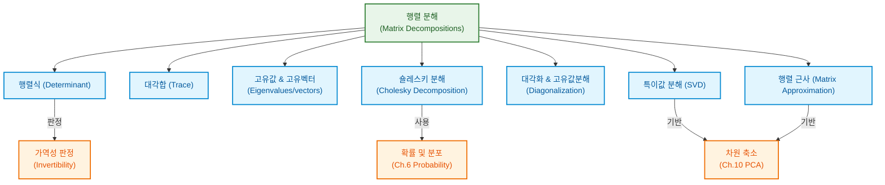
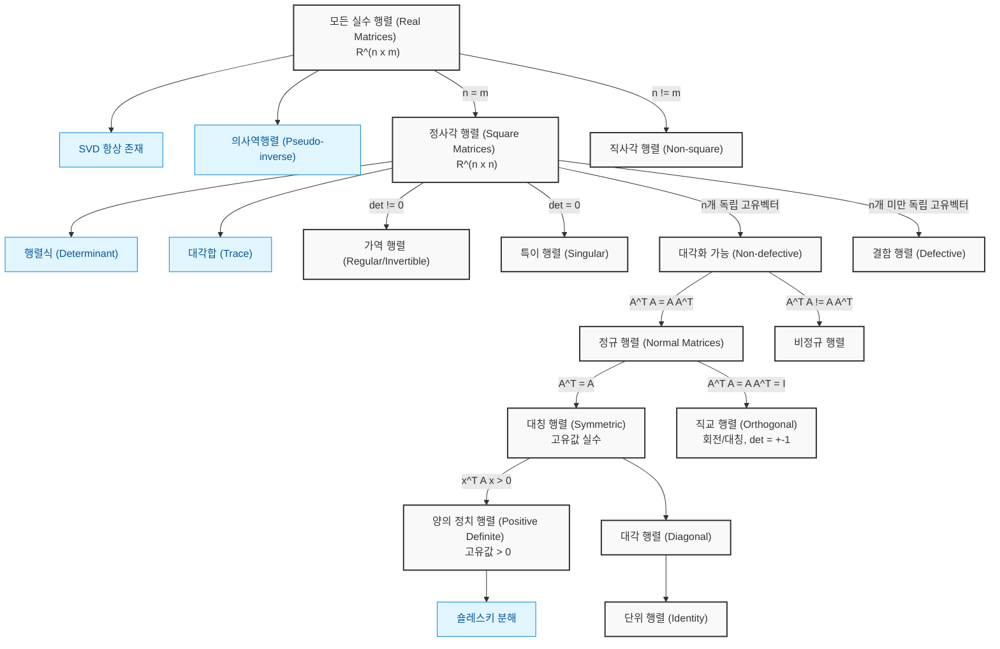

# 4. 행렬 분해 (Matrix Decompositions)

선형대수와 해석기하학의 기초를 바탕으로, 본 장에서는 행렬과 선형 사상의 핵심 물리적 특성을 숫자로 요약하는 방법과 대형 행렬을 다루기 쉬운 기본 인자 행렬들의 곱으로 쪼개는 **행렬 분해(Matrix Decomposition / Matrix Factorization)** 기법들을 다룹니다.

행렬 분해는 정수를 소수들의 곱(예: $21 = 7 \times 3$)으로 분해하여 수의 성질을 파악하는 것과 유사합니다. 대규모 데이터나 복잡한 선형 변환을 기하학적·대수적으로 해석하기 쉬운 특수한 행렬(삼각행렬, 대각행렬, 직교행렬 등)의 곱으로 표현함으로써 계산 효율성을 극대화하고 머신러닝 알고리즘의 수치적 안정성을 보장합니다.

---

### [시각 자료] 행렬 분해 개념 마인드맵 (Figure 4.1)

본 장에서 다루는 주요 개념과 이들이 머신러닝의 다른 장에서 어떻게 응용되는지 보여주는 도식입니다.



---

# 4.1 행렬식과 대각합 (Determinant and Trace)

행렬식과 대각합은 정사각 행렬 $A \in \mathbb{R}^{n \times n}$의 전반적인 성질을 단 하나의 실수(scalar)로 요약하여 나타내는 대표적인 함수입니다.

## 4.1.1 행렬식 (Determinant)

행렬식은 선형 연립방정식의 해의 존재 여부를 분석하고 판별하는 데 사용되는 핵심 대수적 도구입니다. 오직 정사각 행렬 $A \in \mathbb{R}^{n \times n}$에 대해서만 정의되며, $\det(A)$ 또는 $|A|$로 표기합니다.

$$\det(A) = \begin{vmatrix} a_{11} & a_{12} & \cdots & a_{1n} \\ a_{21} & a_{22} & \cdots & a_{2n} \\ \vdots & \vdots & \ddots & \vdots \\ a_{n1} & a_{n2} & \cdots & a_{nn} \end{vmatrix} \tag{4.1}$$

행렬식은 정사각 행렬을 입력받아 실수를 출력하는 함수입니다. 일반적인 $n \times n$ 차원의 행렬식을 정의하기에 앞서, 작은 크기의 행렬식과 특수 행렬의 행렬식을 살펴보겠습니다.

### [정리 4.1] 행렬의 가역성과 행렬식
임의의 정사각 행렬 $A \in \mathbb{R}^{n \times n}$에 대하여, **$A$가 역행렬을 가질(invertible) 필요충분조건은 $\det(A) \neq 0$인 것이다.**
즉,
$$A \text{ is invertible} \Longleftrightarrow \det(A) \neq 0$$

### 소형 행렬의 행렬식 공식
* **$1 \times 1$ 행렬**: Scalar 값 자체가 행렬식이 됩니다.
  $$\det(A) = \det(a_{11}) = a_{11} \tag{4.5}$$
* **$2 \times 2$ 행렬**: 역행렬 공식 $A^{-1} = \frac{1}{a_{11}a_{22} - a_{12}a_{21}} \begin{bmatrix} a_{22} & -a_{12} \\ -a_{21} & a_{11} \end{bmatrix}$의 분모 항에 해당합니다.
  $$\det(A) = \begin{vmatrix} a_{11} & a_{12} \\ a_{21} & a_{22} \end{vmatrix} = a_{11}a_{22} - a_{12}a_{21} \tag{4.6}$$
* **$3 \times 3$ 행렬 (사루스 법칙, Sarrus' Rule)**: diagonal 방향 곱들의 합에서 반대 대각 방향 곱들의 합을 빼서 계산합니다.
  $$\begin{vmatrix} a_{11} & a_{12} & a_{13} \\ a_{21} & a_{22} & a_{23} \\ a_{31} & a_{32} & a_{33} \end{vmatrix} = a_{11}a_{22}a_{33} + a_{21}a_{32}a_{13} + a_{31}a_{12}a_{23} - a_{31}a_{22}a_{13} - a_{11}a_{32}a_{23} - a_{21}a_{12}a_{33} \tag{4.7}$$

### 삼각행렬의 행렬식
주대각선 성분의 아래쪽 성분이 모두 0인 **상삼각행렬 (Upper-triangular matrix)** 또는 주대각선의 위쪽 성분이 모두 0인 **하삼각행렬 (Lower-triangular matrix)** $T \in \mathbb{R}^{n \times n}$의 행렬식은 단순히 **주대각선 성분들의 곱**입니다.
$$\det(T) = \prod_{i=1}^{n} T_{ii} \tag{4.8}$$

---

### [시각 자료] 행렬식의 기하학적 의미 (Figure 4.2 & 4.3)

행렬식은 행렬의 열벡터들이 형성하는 도형의 **유향 부피(Signed Volume)**를 나타냅니다.
* 2차원 공간에서 두 열벡터 $\mathbf{b}$와 $\mathbf{g}$가 이루는 평행사변형의 넓이는 $|\det([\mathbf{b}, \mathbf{g}])|$입니다. 두 벡터가 선형 종속(일직선상에 존재)이 되면 넓이는 $0$이 됩니다.
* 3차원 공간에서 세 열벡터 $\mathbf{r}, \mathbf{b}, \mathbf{g}$가 이루는 평행육면체의 부피는 $|\det([\mathbf{r}, \mathbf{b}, \mathbf{g}])|$입니다.
* 행렬식의 **부호(Sign)**는 표준 기저에 대한 열벡터들의 **지향성(Orientation)**을 나타냅니다. 열벡터의 순서를 바꾸면(우방향계에서 좌방향계로 변경 등) 부호가 뒤집힙니다.

```
[2차원 평행사변형 면적]                [3차원 평행육면체 부피]
      g                                       g
     / \                                     / \
    /   \   Area = |det([b, g])|            /   \   Volume = |det([r, b, g])|
   /     \                                 /     \
  0-------b                               0-------b
                                           \     /
                                            \   /
                                              r
```

### [예제 4.2] 3차원 부피 계산
다음과 같이 정의된 3차원 공간의 세 선형 독립 벡터 $\mathbf{r}, \mathbf{g}, \mathbf{b} \in \mathbb{R}^3$가 있습니다.
$$\mathbf{r} = \begin{bmatrix} 2 \\ 0 \\ -8 \end{bmatrix}, \quad \mathbf{g} = \begin{bmatrix} 6 \\ 1 \\ 0 \end{bmatrix}, \quad \mathbf{b} = \begin{bmatrix} 1 \\ 4 \\ -1 \end{bmatrix} \tag{4.9}$$
이 벡터들을 열벡터로 가지는 행렬 $A$를 조립하면 다음과 같습니다.
$$A = [\mathbf{r}, \mathbf{g}, \mathbf{b}] = \begin{bmatrix} 2 & 6 & 1 \\ 0 & 1 & 4 \\ -8 & 0 & -1 \end{bmatrix} \tag{4.10}$$
이 세 벡터가 이루는 평행육면체의 부피 $V$는 행렬식의 절대값으로 계산됩니다.
$$V = |\det(A)| = 186 \tag{4.11}$$

---

### 라플라스 전개 (Laplace Expansion)

$3 \times 3$보다 큰 일반적인 $n \times n$ 정사각 행렬의 행렬식을 계산하기 위해, 고차원 행렬식을 하위 차원인 $(n-1) \times (n-1)$ 정사각 행렬식들의 합으로 재귀적으로 환원시키는 **라플라스 전개 (여인수 전개)**를 사용합니다.

### [정리 4.2] 라플라스 전개
정사각 행렬 $A \in \mathbb{R}^{n \times n}$에 대하여, 임의의 열 인덱스 $j \in \{1, \dots, n\}$ 또는 임의의 행 인덱스 $j \in \{1, \dots, n\}$를 선택하여 다음을 수행할 수 있습니다.
1. **$j$번째 열 기준 전개**:
   $$\det(A) = \sum_{k=1}^{n} (-1)^{k+j} a_{kj} \det(A_{k,j}) \tag{4.12}$$
2. **$j$번째 행 기준 전개**:
   $$\det(A) = \sum_{k=1}^{n} (-1)^{k+j} a_{jk} \det(A_{j,k}) \tag{4.13}$$
여기서 $A_{k,j} \in \mathbb{R}^{(n-1) \times (n-1)}$는 행렬 $A$에서 $k$번째 행과 $j$번째 열을 제거하고 남은 소행렬(Submatrix)입니다. 이때 $\det(A_{k,j})$를 **소행렬식(Minor)**이라 부르고, 부호를 포함한 $(-1)^{k+j}\det(A_{k,j})$를 **여인수(Cofactor)**라고 정의합니다.

### [예제 4.3] 라플라스 전개 계산
다음 행렬 $A$의 행렬식을 첫 번째 행을 기준으로 전개하여 구합니다.
$$A = \begin{bmatrix} 1 & 2 & 3 \\ 3 & 1 & 2 \\ 0 & 0 & 1 \end{bmatrix} \tag{4.14}$$
식 (4.13)을 적용하면 다음과 같습니다.
$$\det(A) = (-1)^{1+1} \cdot 1 \cdot \begin{vmatrix} 1 & 2 \\ 0 & 1 \end{vmatrix} + (-1)^{1+2} \cdot 2 \cdot \begin{vmatrix} 3 & 2 \\ 0 & 1 \end{vmatrix} + (-1)^{1+3} \cdot 3 \cdot \begin{vmatrix} 3 & 1 \\ 0 & 0 \end{vmatrix} \tag{4.15}$$
각 $2 \times 2$ 소행렬식을 계산하여 더합니다.
$$\det(A) = 1 \cdot (1 - 0) - 2 \cdot (3 - 0) + 3 \cdot (0 - 0) = 1 - 6 + 0 = -5 \tag{4.16}$$
참고로, 사루스 법칙(식 (4.7))을 적용해 계산해도 동일한 결과가 도출됩니다.
$$\det(A) = (1\cdot 1\cdot 1 + 3\cdot 0\cdot 3 + 0\cdot 2\cdot 2) - (0\cdot 1\cdot 3 + 1\cdot 0\cdot 2 + 3\cdot 2\cdot 1) = 1 - 6 = -5 \tag{4.17}$$

---

### 행렬식의 대수적 성질들
임의의 정사각 행렬 $A, B \in \mathbb{R}^{n \times n}$ 및 스칼라 $\lambda \in \mathbb{R}$에 대해 다음 성질들이 성립합니다.
* **곱의 행렬식**: $\det(AB) = \det(A)\det(B)$
* **전치 행렬식**: $\det(A) = \det(A^{\top})$ (행과 열에 대한 연산 성질이 완전히 대칭적임을 뜻합니다.)
* **역행렬의 행렬식**: $A$가 가역일 때, $\det(A^{-1}) = \frac{1}{\det(A)}$
* **기저 변환(닮음) 불변성**: 닮음 관계($B = S^{-1}AS$)에 있는 행렬들은 동일한 행렬식을 가집니다. 따라서 선형 사상의 행렬식은 어떤 기저를 선택하여 표현하든 동일하게 보존됩니다.
* **기본 행 연산과 행렬식**:
  * 한 행(또는 열)에 다른 행(또는 열)의 배수를 더해도 행렬식은 변하지 않습니다 ($\det(A)$ 유지).
  * 한 행(또는 열)에 $\lambda$배를 곱하면 행렬식 전체가 $\lambda$배 스칼라배 됩니다. 따라서 $\det(\lambda A) = \lambda^n \det(A)$가 성립합니다.
  * 두 행(또는 열)을 서로 맞바꾸면 행렬식의 부호가 반대로 바뀝니다 ($-\det(A)$).

이 성질들을 이용하면, 복잡한 고차원 행렬식 계산 시 라플라스 전개를 반복하는 대신 **가우스 소거법**을 사용하여 행렬을 상삼각행렬 형태로 변환한 뒤 대각선 성분들만 곱함으로써 매우 효율적으로 행렬식을 계산할 수 있습니다.

### [정리 4.3] 행렬식과 랭크의 관계
정사각 행렬 $A \in \mathbb{R}^{n \times n}$에 대하여,
$$\det(A) \neq 0 \Longleftrightarrow \text{rk}(A) = n$$
즉, 행렬식이 0이 아니라는 것은 행렬의 모든 열벡터가 선형 독립이며 풀 랭크(Full rank)를 가짐을 의미합니다.

---

## 4.1.2 대각합 (Trace)

대각합은 정사각 행렬 $A \in \mathbb{R}^{n \times n}$의 주대각선 성분들의 총합을 구하는 연산으로, $\text{tr}(A)$로 표기합니다.

$$\text{tr}(A) := \sum_{i=1}^{n} a_{ii} \tag{4.18}$$

### 대각합의 주요 성질
임의의 정사각 행렬 $A, B \in \mathbb{R}^{n \times n}$ 및 임의의 스칼라 $\alpha \in \mathbb{R}$에 대해 다음 성질들이 항상 만족됩니다.
1. **선형성**: $\text{tr}(A + B) = \text{tr}(A) + \text{tr}(B)$
2. **비례성**: $\text{tr}(\alpha A) = \alpha \text{tr}(A)$
3. **단위행렬의 대각합**: $\text{tr}(\mathbf{I}_n) = n$
4. **곱셈 교환의 순환 대칭성**: $A \in \mathbb{R}^{n \times k}$이고 $B \in \mathbb{R}^{k \times n}$일 때, 비록 두 행렬의 크기가 다르더라도 다음이 성립합니다.
   $$\text{tr}(AB) = \text{tr}(BA) \tag{4.12}$$

이 네 가지 성질을 동시에 만족하는 유일한 선형 연산자가 바로 대각합입니다.

### 순환 대칭성의 일반화
대각합의 곱셈 순환 대칭성은 임의의 수의 행렬 곱으로 확장됩니다. 행렬 $A \in \mathbb{R}^{a \times k}, K \in \mathbb{R}^{k \times l}, L \in \mathbb{R}^{l \times a}$의 곱에 대해 다음이 성립합니다.
$$\text{tr}(AKL) = \text{tr}(KLA) = \text{tr}(LAK) \tag{4.19}$$
단, 행렬의 순서가 순환적으로(cyclic) 회전하는 조합에 대해서만 성립하며, 임의로 순서를 바꾸는 일반적인 교환법칙($\text{tr}(AKL) \neq \text{tr}(ALK)$)은 성립하지 않으므로 주의해야 합니다.

### [특수 사례] 벡터의 외적과 내적의 관계
두 벡터 $\mathbf{x}, \mathbf{y} \in \mathbb{R}^n$에 의해 생성되는 $n \times n$ 외적 행렬(Outer product) $\mathbf{x}\mathbf{y}^{\top}$의 대각합은 두 벡터의 내적(Inner product)과 동일합니다.
$$\text{tr}(\mathbf{x}\mathbf{y}^{\top}) = \text{tr}(\mathbf{y}^{\top}\mathbf{x}) = \mathbf{y}^{\top}\mathbf{x} \in \mathbb{R} \tag{4.20}$$

### 선형 사상의 기저 독립성
선형 사상 $\Phi: V \to V$가 주어졌을 때, 임의의 기저 하에서 이 사상을 표현하는 변환 행렬을 $A$라 합시다. 다른 기저를 선택했을 때의 변환 행렬을 $B$라 하면 기저 변환 공식에 의해 적절한 가역 행렬 $S$에 대해 $B = S^{-1}AS$가 성립합니다. 이때 $B$의 대각합은 다음과 같습니다.
$$\text{tr}(B) = \text{tr}(S^{-1}AS) \stackrel{(4.19)}{=} \text{tr}(A S S^{-1}) = \text{tr}(A\mathbf{I}) = \text{tr}(A) \tag{4.21}$$
따라서, **선형 사상의 대각합은 기저의 선택에 무관하게 항상 일정하게 유지되는 기저 독립적(basis independent)인 고유한 특성 물리량**입니다.

---

## 4.1.3 특성 다항식 (Characteristic Polynomial)

행렬식과 대각합을 결합하여, 정사각 행렬 $A \in \mathbb{R}^{n \times n}$의 핵심 대수적 성질을 변수 $\lambda$에 대한 다항식 형태로 기술한 것을 **특성 다항식**이라 정의합니다.

### [정의 4.5] 특성 다항식 (Characteristic Polynomial)
스칼라 변수 $\lambda \in \mathbb{R}$와 정사각 행렬 $A \in \mathbb{R}^{n \times n}$에 대하여,
$$p_A(\lambda) := \det(A - \lambda\mathbf{I}) \tag{4.22a}$$
를 행렬 $A$의 **특성 다항식**이라 합니다. 이를 전개하면 다음과 같은 $n$차 다항식의 형태를 띱니다.
$$p_A(\lambda) = c_0 + c_1\lambda + c_2\lambda^2 + \cdots + c_{n-1}\lambda^{n-1} + (-1)^n \lambda^n \tag{4.22b}$$
이때 최고차항과 최저차항 등 주요 계수들은 다음과 같은 성질을 갖습니다.
$$c_0 = \det(A) \tag{4.23}$$
$$c_{n-1} = (-1)^{n-1} \text{tr}(A) \tag{4.24}$$

이 특성 다항식의 해를 구함으로써 우리는 고유값과 고유벡터를 도출하게 됩니다.

---

# 4.2 고유값과 고유벡터 (Eigenvalues and Eigenvectors)

선형 변환 $\Phi$를 표현하는 행렬 $A \in \mathbb{R}^{n \times n}$를 곱했을 때, 방향은 변하지 않고 오직 크기만 실수배로 늘어나거나 줄어드는 특별한 벡터들이 존재합니다. 이 특수한 벡터들을 **고유벡터**, 변환 배율을 **고유값**이라 부릅니다.

### [정의 4.6] 고유값과 고유벡터
정사각 행렬 $A \in \mathbb{R}^{n \times n}$에 대하여, 영벡터가 아닌 임의의 벡터 $\mathbf{x} \in \mathbb{R}^n \setminus \{\mathbf{0}\}$와 스칼라 $\lambda \in \mathbb{R}$가 다음 방정식을 만족할 때, **$\lambda$를 행렬 $A$의 고유값(Eigenvalue)**이라 하고, **$\mathbf{x}$를 $\lambda$에 대응하는 고유벡터(Eigenvector)**라고 정의합니다.
$$A\mathbf{x} = \lambda\mathbf{x} \tag{4.25}$$
위 방정식을 **고유값 방정식(Eigenvalue Equation)**이라 부릅니다.

> [!NOTE]
> 'Eigen'은 '특유의', '독자적인'을 뜻하는 독일어 형용사에서 유래하였습니다. 고유값과 고유벡터는 선형 사상이 벡터 공간 내의 특정 축들을 어떻게 스케일링하는지 보여주는 사상 고유의 뼈대 정보를 담고 있습니다.

### 고유값의 동치 조건들
다음 문장들은 수학적으로 완전히 동치(Equivalent)입니다.
1. $\lambda$는 행렬 $A \in \mathbb{R}^{n \times n}$의 고유값이다.
2. $A\mathbf{x} = \lambda\mathbf{x}$를 만족하는 비영벡터 $\mathbf{x} \neq \mathbf{0}$가 존재한다. 즉, 동차선형연립방정식 $(A - \lambda\mathbf{I})\mathbf{x} = \mathbf{0}$이 자명하지 않은 해(Non-trivial solution)를 갖는다.
3. 행렬 $A - \lambda\mathbf{I}$의 랭크가 완전하지 않다: $\text{rk}(A - \lambda\mathbf{I}) < n$
4. 행렬 $A - \lambda\mathbf{I}$의 행렬식이 0이다: $\det(A - \lambda\mathbf{I}) = 0$

### [정의 4.7] 공선성과 공향성
* **공향성 (Codirection)**: 두 벡터가 완벽하게 가리키는 방향이 같을 때 이를 공향 벡터라고 합니다.
* **공선성 (Collinearity)**: 두 벡터가 가리키는 방향이 같거나 또는 정반대(일직선상에 정렬)일 때 이를 공선 벡터라고 합니다.

### 고유벡터의 비유일성 (방향의 대표성)
만약 벡터 $\mathbf{x}$가 고유값 $\lambda$에 대응하는 $A$의 고유벡터라면, 0이 아닌 임의의 스칼라 $c \in \mathbb{R} \setminus \{0\}$배를 해 준 $c\mathbf{x}$ 역시 동일한 고유값 $\lambda$를 공유하는 고유벡터가 됩니다.
$$A(c\mathbf{x}) = c(A\mathbf{x}) = c(\lambda\mathbf{x}) = \lambda(c\mathbf{x}) \tag{4.26}$$
따라서 고유벡터는 단일 벡터로 유일하게 결정되는 것이 아니라, 특정 **직선 방향(Line)** 전체가 고유벡터의 성질을 공유합니다. 일반적으로는 크기가 1인 단위벡터 형태로 정규화하여 대표 벡터로 사용합니다.

### [정리 4.8] 특성 다항식의 근으로서의 고유값
$\lambda \in \mathbb{R}$가 행렬 $A \in \mathbb{R}^{n \times n}$의 고유값이 될 필요충분조건은 $\lambda$가 특성 다항식 $p_A(\lambda) = \det(A - \lambda\mathbf{I}) = 0$의 근(Root)이 되는 것입니다.

### [정의 4.9] 대수적 중복도 (Algebraic Multiplicity)
행렬 $A$의 특성 다항식을 인수분해하였을 때, 특정 고유값 $\lambda_i$에 해당하는 인수 $(\lambda - \lambda_i)$가 곱해진 거듭제곱 횟수 $m$을 해당 고유값의 **대수적 중복도**라고 정의합니다.

### [정의 4.10] 고유공간 (Eigenspace)과 고유 스펙트럼 (Eigenspectrum)
* **고유공간 (Eigenspace)**: 특정 고유값 $\lambda$에 대응하는 모든 고유벡터들과 영벡터 $\mathbf{0}$를 모은 집합은 $\mathbb{R}^n$의 부분공간을 형성하며, 이를 고유공간 $E_{\lambda}$라고 합니다.
  $$E_{\lambda} = \text{ker}(A - \lambda\mathbf{I}) \tag{4.27b}$$
* **고유 스펙트럼 (Eigenspectrum / Spectrum)**: 행렬 $A$가 가지는 모든 고유값들의 집합을 의미합니다.

---

### [예제 4.5] 고유값, 고유벡터, 고유공간 계산
다음 $2 \times 2$ 행렬 $A$의 고유값과 고유벡터를 계산합니다.
$$A = \begin{bmatrix} 4 & 2 \\ 1 & 3 \end{bmatrix} \tag{4.28}$$

1. **특성 다항식 도출**:
   $$\det(A - \lambda\mathbf{I}) = \begin{vmatrix} 4 - \lambda & 2 \\ 1 & 3 - \lambda \end{vmatrix} = (4 - \lambda)(3 - \lambda) - 2 \cdot 1 = \lambda^2 - 7\lambda + 10 \tag{4.29}$$
2. **고유값 계산**:
   특성 다항식을 인수분해합니다.
   $$p_A(\lambda) = (\lambda - 2)(\lambda - 5) = 0 \tag{4.30}$$
   따라서 서로 다른 두 근 $\lambda_1 = 2$, $\lambda_2 = 5$를 고유값으로 가집니다.
3. **$\lambda = 5$에 대응하는 고유공간 계산**:
   $$(A - 5\mathbf{I})\mathbf{x} = \begin{bmatrix} -1 & 2 \\ 1 & -2 \end{bmatrix} \begin{bmatrix} x_1 \\ x_2 \end{bmatrix} = \begin{bmatrix} 0 \\ 0 \end{bmatrix} \tag{4.32}$$
   방정식을 풀면 $x_1 = 2x_2$가 도출되므로, 고유공간 $E_5$는 다음과 같이 1차원 부분공간이 됩니다.
   $$E_5 = \text{span}\left( \begin{bmatrix} 2 \\ 1 \end{bmatrix} \right) \tag{4.33}$$
4. **$\lambda = 2$에 대응하는 고유공간 계산**:
   $$(A - 2\mathbf{I})\mathbf{x} = \begin{bmatrix} 2 & 2 \\ 1 & 1 \end{bmatrix} \begin{bmatrix} x_1 \\ x_2 \end{bmatrix} = \begin{bmatrix} 0 \\ 0 \end{bmatrix} \tag{4.34}$$
   방정식을 풀면 $x_2 = -x_1$이 도출되므로, 고유공간 $E_2$는 다음과 같이 1차원 부분공간이 됩니다.
   $$E_2 = \text{span}\left( \begin{bmatrix} 1 \\ -1 \end{bmatrix} \right) \tag{4.35}$$

---

### [정의 4.11] 기하적 중복도 (Geometric Multiplicity)
특정 고유값 $\lambda_i$에 대응하는 고유공간 $E_{\lambda_i}$의 차원(Dimension)을 해당 고유값의 **기하적 중복도**라고 정의합니다. 즉, 고유값 $\lambda_i$에 대응하는 선형 독립인 고유벡터의 최대 개수입니다.

> [!IMPORTANT]
> 임의의 고유값의 기하적 중복도는 **최소 1 이상**이어야 하며, 해당 고유값의 **대수적 중복도를 절대로 초과할 수 없습니다.**
> $$\text{Geometric Multiplicity}(\lambda_i) \le \text{Algebraic Multiplicity}(\lambda_i)$$

### [예제 4.6] 대수적 중복도와 기하적 중복도가 일치하지 않는 경우
다음 행렬 $A$가 주어졌을 때,
$$A = \begin{bmatrix} 2 & 1 \\ 0 & 2 \end{bmatrix}$$
특성 다항식은 $p_A(\lambda) = (2 - \lambda)^2 = 0$이므로 고유값은 $\lambda = 2$ 단 하나이며 대수적 중복도는 2입니다.
그러나 고유벡터를 찾기 위해 $(A - 2\mathbf{I})\mathbf{x} = \mathbf{0}$을 전개하면 다음과 같습니다.
$$\begin{bmatrix} 0 & 1 \\ 0 & 0 \end{bmatrix} \begin{bmatrix} x_1 \\ x_2 \end{bmatrix} = \begin{bmatrix} 0 \\ 0 \end{bmatrix} \implies x_2 = 0$$
이때 자유 변수는 $x_1$ 하나뿐이므로, 고유벡터는 $\begin{bmatrix} 1 \\ 0 \end{bmatrix}$ 스칼라배 형태만 존재합니다. 즉, 고유공간 $E_2$의 차원(기하적 중복도)은 $1$입니다. 이와 같이 대수적 중복도보다 기하적 중복도가 작은 행렬이 존재합니다.

---

### [시각 자료] 2차원 공간에서의 선형 변환별 고유 스펙트럼 기하 예시 (Figure 4.4)

2차원 격자점들에 상이한 변환 행렬 $A_i$를 가했을 때 기하학적으로 일어나는 변화와 고유 스펙트럼 상태입니다.

1. **스케일링 변환** ($A_1 = \begin{bmatrix} 0.5 & 0 \\ 0 & 2 \end{bmatrix}$, $\det=1.0$):
   * 고유값: $\lambda_1 = 2.0$ (세로 방향 두 배 인장), $\lambda_2 = 0.5$ (가로 방향 반으로 압축).
   * 고유벡터는 표준 축 방향 $\mathbf{e}_1, \mathbf{e}_2$로 직교 유지. 면적 보존.
2. **전단 변환 (Shearing)** ($A_2 = \begin{bmatrix} 1 & 0.5 \\ 0 & 1 \end{bmatrix}$, $\det=1.0$):
   * 고유값: $\lambda_1 = 1.0$ (대수적 중복도 2, 기하적 중복도 1).
   * 고유벡터들이 가로축 방향 $\begin{bmatrix} 1 \\ 0 \end{bmatrix}$ 일직선상으로 찌그러짐(공선 벡터화).
3. **회전 변환 (Rotation)** ($A_3 = \begin{bmatrix} \cos(\pi/6) & -\sin(\pi/6) \\ \sin(\pi/6) & \cos(\pi/6) \end{bmatrix}$, $\det=1.0$):
   * 고유값: 복소수 $\lambda_{1,2} = 0.87 \pm 0.5j$.
   * 실수 공간 상에는 고유벡터가 존재하지 않으므로 어떠한 선형 독립 축도 제자리를 지키지 못하고 회전합니다.
4. **차원 붕괴 변환 (Collapse)** ($A_4 = \begin{bmatrix} 1 & -1 \\ -1 & 1 \end{bmatrix}$, $\det=0.0$):
   * 고유값: $\lambda_1 = 0$ (방향 붕괴), $\lambda_2 = 2.0$ (수직축 방향 확대).
   * 2차원 평면이 1차원 직선 공간으로 짓눌려 투영되므로 면적이 0이 됩니다.
5. **전단 및 스케일링 복합 변환** ($A_5 = \begin{bmatrix} 1 & 0.5 \\ 0.5 & 1 \end{bmatrix}$, $\det=0.75$):
   * 고유값: $\lambda_1 = 0.5$, $\lambda_2 = 1.5$.
   * 공간을 대칭적으로 늘리고 줄여 면적을 원래의 75% 크기로 축소시킵니다.

---

### [예제 4.7] 생물학적 신경망의 고유 스펙트럼 분석
머신러닝과 데이터 과학에서 네트워크 노드 간의 연결 구조를 분석하는 데 고유값 분석이 널리 쓰입니다.
선충류 생물인 예쁜꼬마선충(C. Elegans)의 뇌는 총 277개의 뉴런으로 구성되어 있습니다. 이들의 연결 정보를 나타내는 인접 행렬 $A \in \mathbb{R}^{277 \times 277}$은 비대칭 행렬이므로 복소수 고유값을 갖습니다.
방향성을 지우고 뉴런 간 연결 여부만 고려하기 위해 대칭화된 연결 행렬 $A_{\text{sym}} := A + A^{\top}$을 만듭니다. 이 대칭 행렬의 고유값들을 정렬하여 시각화한 **고유 스펙트럼(Eigenspectrum)**은 특유의 S자 곡선을 띱니다. 이는 수많은 뇌 세포 신경망이 가진 위상학적 성질을 행렬의 고유값 분포로 집약하여 보여주는 대표적인 신경과학 분석 도구입니다.

---

### [정리 4.12] 고유벡터의 선형 독립성
서로 다른 $n$개의 고유값 $\lambda_1, \dots, \lambda_n$을 가지는 정사각 행렬 $A \in \mathbb{R}^{n \times n}$의 대응 고유벡터 $\mathbf{x}_1, \dots, \mathbf{x}_n$은 **서로 선형 독립**입니다.
따라서, $n$개의 서로 다른 고유값을 갖는 행렬의 고유벡터들은 벡터 공간 $\mathbb{R}^n$의 기저(Basis)를 형성하게 됩니다.

### [정의 4.13] 결함 행렬 (Defective Matrix)
정사각 행렬 $A \in \mathbb{R}^{n \times n}$이 선형 독립인 고유벡터를 $n$개보다 적게 가질 때, 이 행렬을 **결함 행렬**이라고 합니다.
결함 행렬은 적어도 하나 이상의 고유값의 기하적 중복도가 대수적 중복도보다 엄격히 작으며, 고유벡터들로 $\mathbb{R}^n$의 기저를 구성하는 것이 불가능합니다.

---

### 대칭행렬과 고유값의 특별한 관계

실수 대칭 행렬 $S = S^{\top}$은 수학적으로 매우 유용한 고유값 성질을 가집니다.

### [정리 4.14] 임의의 행렬을 통한 대칭 반정치 행렬의 빌드
임의의 행렬 $A \in \mathbb{R}^{m \times n}$에 대하여, $S := A^{\top}A \in \mathbb{R}^{n \times n}$로 정의된 행렬은 항상 **대칭(Symmetric) 행렬**이며 **양의 반정치(Positive semidefinite) 행렬**입니다.
> [!NOTE]
> * **대칭성 증명**: $S^{\top} = (A^{\top}A)^{\top} = A^{\top}(A^{\top})^{\top} = A^{\top}A = S$
> * **양의 반정치성 증명**: 임의의 $\mathbf{x} \in \mathbb{R}^n$에 대하여, $\mathbf{x}^{\top}S\mathbf{x} = \mathbf{x}^{\top}A^{\top}A\mathbf{x} = (A\mathbf{x})^{\top}(A\mathbf{x}) = \|A\mathbf{x}\|_2^2 \ge 0$. 만약 $A$의 랭크가 $n$이라면 $S$는 양의 정치(Positive definite) 행렬이 되어 임의의 비영벡터 $\mathbf{x} \neq \mathbf{0}$에 대해 $\mathbf{x}^{\top}S\mathbf{x} > 0$이 항상 성립합니다.

### [정리 4.15] 스펙트럼 정리 (Spectral Theorem)
실수 대칭 행렬 $A \in \mathbb{R}^{n \times n}$에 대하여 다음 두 성질이 항상 보장됩니다.
1. $A$의 모든 고유값은 항상 **실수(Real number)**입니다.
2. $A$의 고유벡터들로 구성된 $\mathbb{R}^n$의 **정규직교기저(Orthonormal Basis)**가 항상 존재합니다.

따라서 대칭행렬 $A$는 항상 고유벡터들의 직교행렬 $P$와 대각선 성분이 고유값으로 이루어진 대각행렬 $D$에 대해 $A = PDP^{\top}$ 형태로 고유값 분해가 가능합니다.

---

### [예제 4.8] 대칭행렬 고유벡터의 정규직교화 과정
다음과 같은 실수 대칭 행렬 $A$가 주어져 있습니다.
$$A = \begin{bmatrix} 3 & 2 & 2 \\ 2 & 3 & 2 \\ 2 & 2 & 3 \end{bmatrix} \tag{4.37}$$
이 행렬의 특성 다항식은 다음과 같이 유도됩니다.
$$p_A(\lambda) = -(\lambda - 1)^2(\lambda - 7) = 0 \tag{4.38}$$
고유값은 중복도가 2인 $\lambda_1 = 1$과 단일근인 $\lambda_2 = 7$입니다. 각 고유값에 대응하는 고유공간을 구하면 다음과 같습니다.
$$E_1 = \text{span}\left( \underbrace{\begin{bmatrix} -1 \\ 1 \\ 0 \end{bmatrix}}_{\mathbf{x}_1}, \underbrace{\begin{bmatrix} -1 \\ 0 \\ 1 \end{bmatrix}}_{\mathbf{x}_2} \right), \quad E_7 = \text{span}\left( \underbrace{\begin{bmatrix} 1 \\ 1 \\ 1 \end{bmatrix}}_{\mathbf{x}_3} \right) \tag{4.39}$$
$\mathbf{x}_3$는 $\mathbf{x}_1$ 및 $\mathbf{x}_2$와 내적을 해 보면 직교함($\mathbf{x}_1^{\top}\mathbf{x}_3 = 0, \mathbf{x}_2^{\top}\mathbf{x}_3 = 0$)을 확인할 수 있습니다.
그러나 동일한 고유값공간 $E_1$ 내에 있는 두 기저 벡터 $\mathbf{x}_1$과 $\mathbf{x}_2$는 직교하지 않습니다 ($\mathbf{x}_1^{\top}\mathbf{x}_2 = 1 \neq 0$). 스펙트럼 정리가 보장하는 정규직교기저를 완성하기 위해서는 같은 고유공간 내부의 벡터들을 직교화해 주어야 합니다.

동일한 고유공간 내의 모든 선형 결합 역시 고유벡터임을 이용하여, **그람-슈미트 직교화 알고리즘**을 $E_1$의 기저 벡터인 $\mathbf{x}_1, \mathbf{x}_2$에 적용합니다.
1. 첫 번째 직교 벡터 $\mathbf{x}_1'$ 지정:
   $$\mathbf{x}_1' = \mathbf{x}_1 = \begin{bmatrix} -1 \\ 1 \\ 0 \end{bmatrix}$$
2. 두 번째 성분에서 사영 성분 차감하여 $\mathbf{x}_2'$ 계산:
   $$\mathbf{x}_2' = \mathbf{x}_2 - \frac{\mathbf{x}_2^{\top}\mathbf{x}_1'}{\|\mathbf{x}_1'\|_2^2}\mathbf{x}_1' = \begin{bmatrix} -1 \\ 0 \\ 1 \end{bmatrix} - \frac{1}{2}\begin{bmatrix} -1 \\ 1 \\ 0 \end{bmatrix} = \begin{bmatrix} -0.5 \\ -0.5 \\ 1 \end{bmatrix} \propto \begin{bmatrix} -1 \\ -1 \\ 2 \end{bmatrix}$$
상수배 정리를 통해 얻은 최종 직교화 고유벡터 쌍은 다음과 같으며, 이들은 서로 직교하고 $\mathbf{x}_3$와도 완벽한 수직 관계를 이룹니다.
$$\mathbf{x}_1' = \begin{bmatrix} -1 \\ 1 \\ 0 \end{bmatrix}, \quad \mathbf{x}_2' = \begin{bmatrix} -1 \\ -1 \\ 2 \end{bmatrix} \tag{4.41}$$

---

### 고유값과 행렬식·대각합의 대수/기하적 관계

정사각 행렬 $A \in \mathbb{R}^{n \times n}$이 가지는 고유값 $\lambda_1, \dots, \lambda_n$ (중복도 포함 및 복소근 포함)에 대해 다음 정리들이 성립합니다.

### [정리 4.16] 행렬식과 고유값의 관계
행렬식은 모든 고유값들의 **곱**과 같습니다.
$$\det(A) = \prod_{i=1}^{n} \lambda_i \tag{4.42}$$

### [정리 4.17] 대각합과 고유값의 관계
대각합은 모든 고유값들의 **합**과 같습니다.
$$\text{tr}(A) = \sum_{i=1}^{n} \lambda_i \tag{4.43}$$

---

### [시각 자료] 고유값의 기하학적 면적/둘레 변환 효과 (Figure 4.6)

정규직교 고유벡터 기저 $(\mathbf{x}_1, \mathbf{x}_2)$로 이루어진 2차원 평면의 단위 정사각형이 사상 $A$에 의해 변환될 때 기하학적 외곽 형상의 변화율입니다.
* **면적의 변화**: 각 고유벡터 축이 고유값 크기 $\lambda_1, \lambda_2$만큼 스케일링되므로, 변환된 사각형의 면적은 원래 넓이(1)에서 고유값의 곱인 $|\lambda_1\lambda_2|$배로 바뀝니다 ($\det(A)$의 물리적 의미와 일치).
* **둘레의 변화**: 원래 정사각형의 둘레는 $2(1 + 1) = 4$입니다. 변환 후의 직사각형 둘레는 $2(|\lambda_1| + |\lambda_2|)$가 되므로, 고유값의 절대값 합이 둘레의 변화율을 결정짓습니다.

---

### [예제 4.9] 구글의 페이지랭크 (Google PageRank)
초기 구글의 검색 엔진을 정립한 페이지랭크 알고리즘은 거대한 웹페이지 링크 관계를 유향 그래프로 표현하고, 이에 따른 전이 확률 행렬(Transition Matrix) $A$를 작성합니다.
임의의 웹 사용자가 링크를 무작위로 클릭하여 도달하는 최종 상태의 페이지 확률 분포 벡터 $\mathbf{x}^*$는 시간이 지남에 따라 변하지 않는 상태에 도달합니다. 즉, $A\mathbf{x}^* = \mathbf{x}^*$를 만족합니다. 이는 **고유값이 1인 전이 행렬의 고유벡터**를 찾는 문제와 정확히 동일합니다. 구글은 이 주 고유벡터(Principal Eigenvector)의 성분 크기를 바탕으로 각 웹페이지의 상대적 중요도 등급을 평가하였습니다.

---

# 4.3 숄레스키 분해 (Cholesky Decomposition)

양의 실수 영역에서 임의의 수를 동일한 수의 제곱근 곱(예: $9 = 3 \times 3$)으로 쪼개는 것과 유사하게, 행렬 연산에서도 대칭 양의 정치 행렬을 대상으로 제곱근에 해당하는 삼각행렬로 분해하는 기법이 존재하는데, 이를 **숄레스키 분해**라고 합니다.

### [정리 4.18] 숄레스키 분해 (Cholesky Decomposition)
임의의 대칭 양의 정치(Symmetric, positive-definite) 행렬 $A \in \mathbb{R}^{n \times n}$는 **하삼각행렬 $L$과 그의 전치행렬 $L^{\top}$의 곱**으로 유일하게 분해됩니다.
$$A = L L^{\top} \tag{4.44}$$
여기서 $L$은 주대각선 성분이 모두 양의 실수인 하삼각행렬이며, 이를 **숄레스키 인자(Cholesky Factor)**라고 부릅니다.

$$\begin{bmatrix} a_{11} & \cdots & a_{1n} \\ \vdots & \ddots & \vdots \\ a_{n1} & \cdots & a_{nn} \end{bmatrix} = \begin{bmatrix} l_{11} & \cdots & 0 \\ \vdots & \ddots & \vdots \\ l_{n1} & \cdots & l_{nn} \end{bmatrix} \begin{bmatrix} l_{11} & \cdots & l_{n1} \\ \vdots & \ddots & \vdots \\ 0 & \cdots & l_{nn} \end{bmatrix}$$

---

### [예제 4.10] $3 \times 3$ 행렬의 숄레스키 분해 공식 유도
대칭 양의 정치 행렬 $A \in \mathbb{R}^{3 \times 3}$에 대해 분해 식 $A = LL^{\top}$을 대수적으로 직접 계산해 보겠습니다.
$$\begin{bmatrix} a_{11} & a_{21} & a_{31} \\ a_{21} & a_{22} & a_{32} \\ a_{31} & a_{32} & a_{33} \end{bmatrix} = \begin{bmatrix} l_{11} & 0 & 0 \\ l_{21} & l_{22} & 0 \\ l_{31} & l_{32} & l_{33} \end{bmatrix} \begin{bmatrix} l_{11} & l_{21} & l_{31} \\ 0 & l_{22} & l_{32} \\ 0 & 0 & l_{33} \end{bmatrix} \tag{4.45}$$
오른쪽 행렬 곱을 연산하면 다음과 같습니다.
$$LL^{\top} = \begin{bmatrix} l_{11}^2 & l_{21}l_{11} & l_{31}l_{11} \\ l_{21}l_{11} & l_{21}^2 + l_{22}^2 & l_{31}l_{21} + l_{32}l_{22} \\ l_{31}l_{11} & l_{31}l_{21} + l_{32}l_{22} & l_{31}^2 + l_{32}^2 + l_{33}^2 \end{bmatrix} \tag{4.46}$$
좌변과 우변의 각 원소를 일대일 비교하여 삼각행렬 $L$의 대각 원소 $l_{ii}$들을 다음과 같이 순차적으로 유도해낼 수 있습니다.
$$l_{11} = \sqrt{a_{11}}, \quad l_{22} = \sqrt{a_{22} - l_{21}^2}, \quad l_{33} = \sqrt{a_{33} - (l_{31}^2 + l_{32}^2)} \tag{4.47}$$
마찬가지로 대각 아래 원소 $l_{ij} \ (i > j)$들도 유도됩니다.
$$l_{21} = \frac{a_{21}}{l_{11}}, \quad l_{31} = \frac{a_{31}}{l_{11}}, \quad l_{32} = \frac{a_{32} - l_{31}l_{21}}{l_{22}} \tag{4.48}$$
이와 같이 이미 계산된 앞 단계의 $l_{ij}$ 값들을 재사용하여 역으로 거슬러 계산해 나가는 방식으로 하삼각행렬의 모든 계수를 유일하게 결정할 수 있습니다.

---

### 머신러닝에서의 숄레스키 분해의 중요성 및 응용
* **가우시안 샘플링**: 평균이 $\mathbf{\mu}$이고 공분산 행렬이 $\mathbf{\Sigma}$인 다변량 가우시안 변수 $\mathbf{x} \sim \mathcal{N}(\mathbf{\mu}, \mathbf{\Sigma})$를 컴퓨터 상에서 직접 난수로 생성하려 할 때, 공분산 행렬의 숄레스키 분해 $\mathbf{\Sigma} = L L^{\top}$가 결정적인 역할을 수행합니다. 표준 정규분포 난수 벡터 $\mathbf{z} \sim \mathcal{N}(\mathbf{0}, \mathbf{I})$에 변환을 가해 $\mathbf{x} = \mathbf{\mu} + L\mathbf{z}$를 생성할 수 있습니다.
* **재매개변수화 트릭 (Reparameterization Trick)**: 딥러닝 확률 모델인 변이형 오토인코더(VAE) 등에서 확률적 오차를 유지하면서 역전파(Backpropagation) 기울기를 미분 가능하게 흘려보내기 위해 이 숄레스키 변환 구조를 사용합니다.
* **효율적인 행렬식 계산**: 가역 대칭 행렬 $A$의 행렬식을 직접 구하는 대신 숄레스키 분해를 수행하면 다음과 같이 계산 효율이 극대화됩니다.
  $$\det(A) = \det(LL^{\top}) = \det(L)\det(L^{\top}) = \det(L)^2 = \left( \prod_{i} l_{ii} \right)^2 = \prod_{i} l_{ii}^2$$
  하삼각행렬의 행렬식은 주대각선 성분의 곱에 불과하므로 복잡한 행렬식 연산이 단순 스칼라들의 곱셈 연산으로 치환됩니다.

---

# 4.4 고유값 분해와 대각화 (Eigendecomposition and Diagonalization)

대각행렬 $D$는 역행렬 계산($d_{ii}$의 역수), 거듭제곱($D^k = \text{diag}(d_{ii}^k)$), 행렬식 계산($d_{ii}$들의 곱) 측면에서 엄청난 컴퓨터 수치 계산상의 강점을 갖습니다. 일반 행렬의 곱 변환을 이러한 축방향 독립 스케일링으로 단순화하기 위해 기저 변환을 결합하는 과정을 **대각화**라고 합니다.

### [정의 4.19] 대각화 가능성 (Diagonalizable)
행렬 $A \in \mathbb{R}^{n \times n}$에 대하여, 어떤 가역 행렬 $P \in \mathbb{R}^{n \times n}$가 존재하여 $P^{-1}AP = D$ 형태의 대각행렬로 만들 수 있을 때, 이 행렬 $A$를 **대각화 가능**하다고 정의합니다.

닮음 변환 행렬 $P$를 열벡터들로 분할하여 $P = [\mathbf{p}_1, \dots, \mathbf{p}_n]$이라 하고, 대각행렬 $D = \text{diag}(\lambda_1, \dots, \lambda_n)$이라 두었을 때,
$$AP = PD \tag{4.50}$$
의 행렬 곱을 직접 전개하면 다음과 같습니다.
$$A[\mathbf{p}_1, \dots, \mathbf{p}_n] = [A\mathbf{p}_1, \dots, A\mathbf{p}_n] \tag{4.51}$$
$$[\mathbf{p}_1, \dots, \mathbf{p}_n] \text{diag}(\lambda_1, \dots, \lambda_n) = [\lambda_1\mathbf{p}_1, \dots, \lambda_n\mathbf{p}_n] \tag{4.52}$$
따라서 $AP = PD$가 성립하려면 모든 열벡터 축에 대해 다음 관계가 정확하게 만족되어야 합니다.
$$A\mathbf{p}_i = \lambda_i\mathbf{p}_i, \quad i=1, \dots, n \tag{4.53-4.54}$$
이는 $P$의 열벡터 $\mathbf{p}_i$가 행렬 $A$의 고유벡터들이고, $D$의 대각 원소 $\lambda_i$가 이에 대응하는 고유값들이어야 함을 의미합니다.

### [정리 4.20] 고유값 분해 (Eigendecomposition)
정사각 행렬 $A \in \mathbb{R}^{n \times n}$가 **$A = P D P^{-1}$로 인수분해(고유값 분해)될 필요충분조건은 $A$의 고유벡터들이 $\mathbb{R}^n$의 기저를 형성(즉, $n$개의 선형 독립 고유벡터를 보유)하는 것입니다.**

### [정리 4.21] 대칭행렬의 대각화 보장
모든 실수 대칭행렬 $S = S^{\top} \in \mathbb{R}^{n \times n}$은 고유벡터들이 언제나 정규직교기저를 형성하므로 가역행렬 $P$가 직교행렬 $P^{\top} = P^{-1}$이 되어 **항상 직교 대각화가 가능**합니다.
$$S = P D P^{\top}$$

---

### [시각 자료] 고유값 분해의 기하학적 단계별 사상 흐름 (Figure 4.7)

임의의 사상 $A$를 고유값 분해 단계로 쪼개어 이해하는 기하 흐름도입니다.

```
[표준 기저 벡터 v] ------------------ A (직접 사상) -----------------> [최종 사상 결과 Av]
         |                                                                      ^
         | P^-1 (표준기저 -> 고유기저 변환)                                      | P (기저 복원)
         v                                                                      |
[고유기저상의 벡터 v'] -------------- D (고유값 대각 스케일링) ----------> [고유기저 스케일링 Dv']
```

1. **$P^{-1}$ 단계**: 표준 기저 하의 입력 벡터 $\mathbf{v}$를 고유벡터들이 이루는 새로운 기저 좌표계(Eigenbasis)로 회전 및 변환하여 $\mathbf{v}'$를 얻습니다.
2. **$D$ 단계**: 고유기저 축 방향으로 각 성분을 고유값 $\lambda_i$ 비율만큼 독립적으로 확장 혹은 축소하여 $D\mathbf{v}'$를 도출합니다 (원형의 점들이 타원 형태로 찌그러집니다).
3. **$P$ 단계**: 타원형으로 스케일링이 완료된 벡터들을 다시 원래의 표준 좌표계로 역변환하여 최종 사상 결과 $A\mathbf{v}$를 도출합니다.

---

### [예제 4.11] 고유값 분해의 대수적 전개
다음 행렬 $A$의 고유값 분해를 수행합니다.
$$A = \frac{1}{2} \begin{bmatrix} 5 & -2 \\ -2 & 5 \end{bmatrix} \tag{4.61-A}$$

1. **고유값 계산**:
   $$\det(A - \lambda\mathbf{I}) = \left( \frac{5}{2} - \lambda \right)^2 - 1 = \lambda^2 - 5\lambda + \frac{21}{4} = \left( \lambda - \frac{7}{2} \right)\left( \lambda - \frac{3}{2} \right) = 0 \tag{4.56}$$
   고유값은 $\lambda_1 = \frac{7}{2}$, $\lambda_2 = \frac{3}{2}$입니다.
2. **단위 고유벡터 유도**:
   $$\mathbf{p}_1 = \frac{1}{\sqrt{2}}\begin{bmatrix} 1 \\ -1 \end{bmatrix}, \quad \mathbf{p}_2 = \frac{1}{\sqrt{2}}\begin{bmatrix} 1 \\ 1 \end{bmatrix} \tag{4.58}$$
   고유벡터 $\mathbf{p}_1$과 $\mathbf{p}_2$는 서로 독립이므로 대각화가 보장됩니다.
3. **대각화 변환 행렬 조립**:
   $$P = [\mathbf{p}_1, \mathbf{p}_2] = \frac{1}{\sqrt{2}} \begin{bmatrix} 1 & 1 \\ -1 & 1 \end{bmatrix} \tag{4.59}$$
   고유벡터들이 직교하므로 $P^{-1} = P^{\top}$입니다. 최종 분해를 수행하면 다음과 같습니다.
   $$A = P D P^{-1} = \left( \frac{1}{\sqrt{2}}\begin{bmatrix} 1 & 1 \\ -1 & 1 \end{bmatrix} \right) \begin{bmatrix} 7/2 & 0 \\ 0 & 3/2 \end{bmatrix} \left( \frac{1}{\sqrt{2}}\begin{bmatrix} 1 & -1 \\ 1 & 1 \end{bmatrix} \right) \tag{4.61}$$

### 행렬의 거듭제곱 가속화
고유값 분해를 얻게 되면, 행렬을 $k$번 연속으로 곱해야 하는 엄청난 계산량의 수치 연산이 다음과 같이 최적화됩니다.
$$A^k = (P D P^{-1})^k = P D^k P^{-1} \tag{4.62}$$
대각행렬 $D$의 거듭제곱은 각 대각성분 $d_{ii}$에만 $k$제곱을 가하면 되므로 거듭제곱 연산이 순식간에 이루어집니다.

---

# 4.5 특이값 분해 (Singular Value Decomposition - SVD)

고유값 분해는 오직 특정 대각화 조건을 충족하는 정사각 행렬에서만 사용할 수 있는 한계가 있습니다. 이러한 한계를 넘어 **어떠한 형태의 임의의 직사각 행렬 $A \in \mathbb{R}^{m \times n}$에 대해서도 항상 존재하고 적용할 수 있는 강력한 일반화 행렬 분해 기법**이 바로 **특이값 분해 (SVD)**입니다.

### [정리 4.22] SVD 정리 (SVD Theorem)
임의의 랭크 $r \in [0, \min(m, n)]$를 갖는 실수 직사각 행렬 $A \in \mathbb{R}^{m \times n}$는 다음과 같이 세 행렬의 곱으로 항상 분해될 수 있습니다.
$$A = U \Sigma V^{\top} \tag{4.64}$$
* **$U \in \mathbb{R}^{m \times m}$**: 공역 공간 $\mathbb{R}^m$의 정규직교기저를 형성하는 **직교 행렬**입니다. 이 열벡터 $\mathbf{u}_i$들을 **좌특이벡터 (Left-singular vectors)**라고 부릅니다.
* **$V \in \mathbb{R}^{n \times n}$**: 정의역 공간 $\mathbb{R}^n$의 정규직교기저를 형성하는 **직교 행렬**입니다. 이 열벡터 $\mathbf{v}_j$들을 **우특이벡터 (Right-singular vectors)**라고 부릅니다.
* **$\Sigma \in \mathbb{R}^{m \times n}$**: $A$와 크기가 같은 행렬로, 대각선 이외의 모든 성분은 0이며 주대각선 성분으로 비음(Non-negative)의 실수값 $\sigma_i$를 내림차순 정렬하여 갖습니다 ($\sigma_1 \ge \sigma_2 \ge \dots \ge \sigma_r \ge 0$). 이 $\sigma_i$들을 **특이값 (Singular values)**이라고 부릅니다.

### 특이값 행렬 $\Sigma$의 크기별 제로 패딩 구조
$\Sigma$는 정사각 행렬이 아닌 직사각 행렬이므로 잔여 행/열 부분을 0으로 채워 행렬의 형태를 맞춰야 합니다.
* **$m > n$ 인 경우 (세로가 더 긴 행렬)**: $n$행까지 대각선에 특이값이 들어가고 아래쪽은 행벡터 $\mathbf{0}^{\top}$들로 채워집니다.
  $$\Sigma = \begin{bmatrix} \sigma_1 & 0 & 0 \\ 0 & \ddots & 0 \\ 0 & 0 & \sigma_n \\ 0 & \cdots & 0 \\ \vdots & \ddots & \vdots \\ 0 & \cdots & 0 \end{bmatrix} \in \mathbb{R}^{m \times n} \tag{4.65}$$
* **$m < n$ 인 경우 (가로가 더 긴 행렬)**: $m$열까지 대각선에 특이값이 들어가고 우측은 열벡터 $\mathbf{0}$들로 채워집니다.
  $$\Sigma = \begin{bmatrix} \sigma_1 & 0 & 0 & 0 & \cdots & 0 \\ 0 & \ddots & 0 & \vdots & \ddots & \vdots \\ 0 & 0 & \sigma_m & 0 & \cdots & 0 \end{bmatrix} \in \mathbb{R}^{m \times n} \tag{4.66}$$

---

## 4.5.1 SVD의 기하학적 직관 (Figure 4.8 & 4.9)

고유값 분해는 입력과 출력이 동일한 차원의 동일한 좌표계 상에서 기저 변환이 가해지는 반면, SVD는 정의역 $\mathbb{R}^n$과 공역 $\mathbb{R}^m$이라는 전혀 다른 두 공간 사이의 기하학적 매핑 관계를 보여줍니다.

```
[정의역 R^n의 기저 B~ (v1, v2)] -------- V^T (정의역 기저 변환) ------> [정의역 R^n의 표준 기저 B]
                                                                                |
                                                                                | Σ (차원 매핑 & 스케일링)
                                                                                v
[공역 R^m의 표준 기저 C] <------------- U (공역 기저 변환) ------------ [공역 R^m의 기저 C~ (u1, u2, u3)]
```

1. **$V^{\top}$ 단계**: 정의역 $\mathbb{R}^n$ 상의 일반적인 직교 좌표축 벡터들을 회전(Rotation) 변환시켜, 입력 다차원 평면이 정렬될 축 방향인 우특이벡터 기저계로 좌표계를 변환합니다.
2. **$\Sigma$ 단계**: 변환된 기저 방향으로 각 벡터의 크기를 특이값 $\sigma_i$ 비율로 독립 스케일링하며, 남는 차원을 추가하거나 버림으로써 차원 전이($\mathbb{R}^n \to \mathbb{R}^m$)를 수행합니다. (예: 2차원의 원판 모양 영역이 3차원 공간 속의 타원판 형상으로 매핑됩니다.)
3. **$U$ 단계**: 공역 $\mathbb{R}^m$으로 넘어온 스케일링 벡터들을 다시 공역 표준 좌표계 방향에 맞도록 최종 회전시킵니다.

---

## 4.5.2 SVD의 대수적 구축 및 증명 과정

임의의 행렬 $A \in \mathbb{R}^{m \times n}$에 대해 SVD 공식 $A = U\Sigma V^{\top}$가 항상 성립하고 계산될 수 있는 유도 과정은 다음과 같습니다.

### 1단계: 우특이벡터 $V$ 구축
정리 4.14에 의해 대칭 반정치 행렬 $A^{\top}A \in \mathbb{R}^{n \times n}$을 항상 얻을 수 있으며, 스펙트럼 정리에 의해 가역적 정교직교 기저 $P$로 다음과 같이 대각화가 가능합니다.
$$A^{\top}A = P D P^{\top} \tag{4.71}$$
SVD 식을 주입하여 전개하면 다음과 같습니다.
$$A^{\top}A = (U\Sigma V^{\top})^{\top}(U\Sigma V^{\top}) = V \Sigma^{\top} U^{\top} U \Sigma V^{\top}$$
이때 $U$가 직교 행렬이므로 $U^{\top}U = \mathbf{I}$가 되어 식은 다음과 같이 정리됩니다.
$$A^{\top}A = V (\Sigma^{\top}\Sigma) V^{\top} \tag{4.73}$$
식 (4.71)과 식 (4.73)을 직접 비교하면 다음 관계가 도출됩니다.
$$V = P, \quad \sigma_i^2 = \lambda_i \tag{4.74-4.75}$$
따라서, **우특이벡터 $V$의 열벡터들은 $A^{\top}A$의 정규직교 고유벡터들이며, 특이값 $\sigma_i$는 $A^{\top}A$가 가지는 고유값의 양의 제곱근 $\sqrt{\lambda_i}$**입니다.

### 2단계: 좌특이벡터 $U$ 구축
동일한 논리로 공역 상에 대칭 행렬 $AA^{\top} \in \mathbb{R}^{m \times m}$을 구축하여 대각화합니다.
$$AA^{\top} = (U\Sigma V^{\top})(U\Sigma V^{\top})^{\top} = U \Sigma V^{\top} V \Sigma^{\top} U^{\top} = U (\Sigma\Sigma^{\top}) U^{\top} \tag{4.76}$$
따라서, **좌특이벡터 $U$의 열벡터들은 공역 상의 대칭 행렬 $AA^{\top}$의 정규직교 고유벡터들**로 구성됩니다.

### 3단계: 두 벡터 군의 연계 및 특이값 방정식
우특이벡터 $\mathbf{v}_i$들은 사상 $A$를 통과한 이후에도 서로 직교 상태를 유지해야 합니다. 임의의 서로 다른 $i \neq j$에 대하여 다음 내적 값이 성립합니다.
$$(A\mathbf{v}_i)^{\top}(A\mathbf{v}_j) = \mathbf{v}_i^{\top}(A^{\top}A)\mathbf{v}_j = \mathbf{v}_i^{\top}(\lambda_j \mathbf{v}_j) = \lambda_j \mathbf{v}_i^{\top}\mathbf{v}_j = 0 \tag{4.77}$$
따라서 이미지 벡터들의 직교성이 보장됩니다. 이 이미지 벡터들을 크기가 1인 정규직교 벡터로 정규화하여 최종 좌특이벡터 $\mathbf{u}_i$를 다음과 같이 얻습니다.
$$\mathbf{u}_i := \frac{A\mathbf{v}_i}{\|A\mathbf{v}_i\|_2} = \frac{1}{\sqrt{\lambda_i}} A\mathbf{v}_i = \frac{1}{\sigma_i} A\mathbf{v}_i \tag{4.78}$$
식 (4.78)의 스칼라 항을 곱해 정리하면 선형대수의 핵심 관계식인 **특이값 방정식 (Singular Value Equation)**이 유도됩니다.
$$A\mathbf{v}_i = \sigma_i \mathbf{u}_i, \quad i=1, \dots, r \tag{4.79}$$
이 식들을 한데 묶어 행렬 형태로 표기하면 $AV = U\Sigma$가 되며, 양변에 우측으로 $V^{\top}$를 곱해주면 최종 SVD 식 $A = U\Sigma V^{\top}$가 도출됩니다.

---

### [예제 4.13] SVD 대수적 계산 예제
다음 $2 \times 3$ 행렬 $A$의 SVD를 구합니다.
$$A = \begin{bmatrix} 1 & 0 & 1 \\ -2 & 1 & 0 \end{bmatrix} \tag{4.81}$$

1. **$A^{\top}A$ 대각화를 통한 $V$ 및 특이값 산출**:
   $$A^{\top}A = \begin{bmatrix} 1 & -2 \\ 0 & 1 \\ 1 & 0 \end{bmatrix} \begin{bmatrix} 1 & 0 & 1 \\ -2 & 1 & 0 \end{bmatrix} = \begin{bmatrix} 5 & -2 & 1 \\ -2 & 1 & 0 \\ 1 & 0 & 1 \end{bmatrix} \tag{4.82}$$
   고유값 방정식 $\det(A^{\top}A - \lambda\mathbf{I}) = 0$을 풀어 정렬된 세 고유값 $\lambda_1 = 6, \lambda_2 = 1, \lambda_3 = 0$을 구합니다.
   따라서 특이값은 $\sigma_1 = \sqrt{6}, \sigma_2 = 1$이며, 랭크는 2입니다.
   이에 대응하는 고유벡터들로 구성한 직교행렬 $V$는 다음과 같습니다.
   $$V = \begin{bmatrix} 5/\sqrt{30} & 0 & -1/\sqrt{6} \\ -2/\sqrt{30} & 1/\sqrt{5} & -2/\sqrt{6} \\ 1/\sqrt{30} & 2/\sqrt{5} & 1/\sqrt{6} \end{bmatrix} \tag{4.84}$$
2. **특이값 행렬 $\Sigma$ 구성**:
   $A$와 같은 $2 \times 3$ 크기의 0 패딩 행렬을 작성합니다.
   $$\Sigma = \begin{bmatrix} \sqrt{6} & 0 & 0 \\ 0 & 1 & 0 \end{bmatrix} \tag{4.85}$$
3. **좌특이벡터 $U$ 유도**:
   식 (4.78)에 의거하여 계산합니다.
   $$\mathbf{u}_1 = \frac{1}{\sqrt{6}} A\mathbf{v}_1 = \frac{1}{\sqrt{6}} \begin{bmatrix} 1 & 0 & 1 \\ -2 & 1 & 0 \end{bmatrix} \begin{bmatrix} 5/\sqrt{30} \\ -2/\sqrt{30} \\ 1/\sqrt{30} \end{bmatrix} = \begin{bmatrix} 1/\sqrt{5} \\ -2/\sqrt{5} \end{bmatrix} \tag{4.86}$$
   $$\mathbf{u}_2 = \frac{1}{1} A\mathbf{v}_2 = 1 \begin{bmatrix} 1 & 0 & 1 \\ -2 & 1 & 0 \end{bmatrix} \begin{bmatrix} 0 \\ 1/\sqrt{5} \\ 2/\sqrt{5} \end{bmatrix} = \begin{bmatrix} 2/\sqrt{5} \\ 1/\sqrt{5} \end{bmatrix} \tag{4.87}$$
   두 열벡터를 가로로 묶어 최종 직교 행렬 $U$를 조립합니다.
   $$U = \frac{1}{\sqrt{5}} \begin{bmatrix} 1 & 2 \\ -2 & 1 \end{bmatrix} \tag{4.88}$$

> [!WARNING]
> 손으로 직접 유도하는 위 과정은 컴퓨터 상에서 직접 연산할 시 부동 소수점 수치 오차가 $A^{\top}A$를 취할 때 증폭되므로 numerical 측면에서 바람직하지 않습니다. 실제 프로그래밍 라이브러리들은 $A^{\top}A$를 거치지 않고 $A$ 자체에서 다이렉트로 $QR$ 분해 등을 응용한 고성능 알고리즘을 사용합니다.

---

## 4.5.3 고유값 분해(Eigendecomposition) vs. 특이값 분해(SVD)

| 비교 항목 | 고유값 분해 (Eigendecomposition) | 특이값 분해 (SVD) |
| :--- | :--- | :--- |
| **적용 대상** | 오직 정사각 행렬 $A \in \mathbb{R}^{n \times n}$만 가능 | 모든 실수 직사각 행렬 $A \in \mathbb{R}^{m \times n}$ 가능 |
| **존재성 보장** | 대각화 조건(선형 독립 고유벡터 $n$개) 충족 시에만 존재 | **언제나 예외 없이 존재함** |
| **변환 기저 성질** | 닮음 행렬 $P$의 열벡터들이 반드시 직교하지는 않음 | 변환행렬 $U, V$가 항상 완벽한 직교 행렬(정규직교축) |
| **기저 변환 공간** | 단일 벡터 공간 내부에서의 동일 좌표 기저 변환 ($P$와 $P^{-1}$) | 서로 다른 두 벡터 공간 간의 상이한 기저 연계 ($U$와 $V^{\top}$) |
| **대각행렬의 성질** | 고유값은 실수뿐만 아니라 복소수, 음수도 가능 | 특이값은 항상 **실수이며 0 이상(비음)**인 값만 가짐 |

---

## 4.5.4 SVD의 응용: 협업 필터링 (Collaborative Filtering)

SVD는 행렬 내에 잠재된 저차원 구조적 요인을 발굴해낼 수 있습니다.

### [예제 4.14] 영화 평점 데이터 분석
3명의 관객(Ali, Beatrix, Chandra)이 4편의 영화(Star Wars, Blade Runner, Amelie, Delicatessen)에 남긴 평점 데이터 행렬 $A \in \mathbb{R}^{4 \times 3}$가 있습니다.
$$A = \begin{bmatrix} 5 & 4 & 1 \\ 5 & 5 & 0 \\ 0 & 0 & 5 \\ 1 & 0 & 4 \end{bmatrix} \quad \begin{matrix} \text{(Star Wars)} \\ \text{(Blade Runner)} \\ \text{(Amelie)} \\ \text{(Delicatessen)} \end{matrix} \tag{4.103-A}$$
SVD를 적용하면 이 평점 행렬은 다음과 같이 분해됩니다 (Figure 4.10 참조).

$$A = U \Sigma V^{\top} \approx \begin{bmatrix} -0.67 & 0.02 & 0.46 \\ -0.72 & 0.21 & -0.48 \\ -0.09 & -0.77 & -0.53 \\ -0.15 & -0.60 & 0.53 \end{bmatrix} \begin{bmatrix} 9.64 & 0 & 0 \\ 0 & 6.36 & 0 \\ 0 & 0 & 0.71 \\ 0 & 0 & 0 \end{bmatrix} \begin{bmatrix} -0.74 & -0.65 & -0.18 \\ 0.09 & 0.18 & -0.98 \\ 0.67 & -0.74 & -0.07 \end{bmatrix}$$

* **좌특이벡터 $\mathbf{u}_i$ (영화 장르 공간)**: $\mathbf{u}_1$을 보면 SF 영화인 Star Wars와 Blade Runner 축의 값이 큰 음수로 높게 나타납니다. 즉, $\mathbf{u}_1$은 'SF 영화 장르'라는 잠재 성향을 대변합니다. 반면 $\mathbf{u}_2$는 프랑스 예술 영화인 Amelie와 Delicatessen 축의 값이 크게 나타나므로 '예술 영화 장르' 성향을 가리킵니다.
* **우특이벡터 $\mathbf{v}_j$ (관객 성향 공간)**: $\mathbf{v}_1$은 SF 장르 평점이 높은 Ali와 Beatrix 성분이 크며, $\mathbf{v}_2$는 예술 영화 평점이 높은 Chandra 성분이 크게 유도됩니다.
* **특이값 $\Sigma$ (장르별 가중치)**: 첫 번째 특이값 $9.64$와 두 번째 특이값 $6.36$에 비해, 세 번째 장르 특이값은 $0.71$로 극도로 작습니다. 이는 이 관객 데이터 전체를 설명하는 데 오직 2차원의 잠재 공간(SF 장르 및 예술 장르)만으로도 충분히 정보 복원이 가능함을 시사합니다.

---

## 4.5.5 SVD의 변형 형식들
SVD는 필요와 행렬 크기에 따라 다음과 같은 축소 행렬 형태로 계산하여 효율성을 도모할 수 있습니다.
* **Full SVD**: 원래 차원을 그대로 지닌 $U_{m \times m}, \Sigma_{m \times n}, V_{n \times n}$의 크기로 행렬 전체를 정직하게 빌드하는 표준 형태입니다.
* **Reduced SVD (Compact SVD)**: 랭크 $r$ 이상으로 넘어가는 0 패딩 행과 열을 생략하여 $U_{m \times r}, \Sigma_{r \times r}, V_{n \times r}$의 크기로 컴팩트하게 축소 분해하는 형태입니다. 대각선 상의 $\Sigma$가 온전히 정사각 대각행렬이 되므로 편리합니다.
* **Truncated SVD**: 상위 $k < r$개의 유의미한 특이값만 남기고 강제로 0으로 잘라내어 표현하는 불완전 분해 기법입니다 (행렬 근사에 직접 사용).

---

# 4.6 행렬 근사 (Matrix Approximation)

대용량 행렬 데이터를 전부 저장하는 대신, 가장 중요도가 높은 핵심 뼈대 성분만 골라내어 복원하는 기법을 **행렬 저차원 근사 (Low-rank Approximation)**라고 합니다. SVD는 이 분야에서 수학적으로 가장 완벽한 최적의 해를 보장합니다.

## 4.6.1 외적을 통한 계수 1 행렬의 선형 결합 표현

좌특이벡터 $\mathbf{u}_i \in \mathbb{R}^m$와 우특이벡터 $\mathbf{v}_i \in \mathbb{R}^n$의 외적(Outer product)을 통해 얻어지는 임의의 $m \times n$ 행렬 $A_i$를 다음과 같이 정의합니다.
$$A_i := \mathbf{u}_i \mathbf{v}_i^{\top} \tag{4.90}$$
이 $A_i$는 오직 한 방향의 성분만 가지므로 랭크가 1인 **Rank-1 행렬**이 됩니다.
SVD 정리식 $A = U\Sigma V^{\top}$를 이 외적 행렬들의 선형 결합 형태로 바꾸어 기술하면 다음과 같이 쓸 수 있습니다.
$$A = \sum_{i=1}^{r} \sigma_i \mathbf{u}_i \mathbf{v}_i^{\top} = \sum_{i=1}^{r} \sigma_i A_i \tag{4.91}$$
즉, 모든 행렬은 서로 수직인 고유한 직교 격자판 역할을 하는 Rank-1 외적 행렬 $A_i$들을 특이값 $\sigma_i$ 크기만큼 가중치를 두어 더해 놓은 합산체와 같습니다.

---

## 4.6.2 Rank-k 최적 근사 (Rank-k Approximation)

만약 랭크 $r$까지의 합산 과정을 중간의 지배적인 $k < r$ 지점까지만 진행하고 나머지를 생략하면, 원래 행렬 $A$와 차원은 같으나 랭크가 $k$인 근사 행렬 $\widehat{A}^{(k)}$를 얻게 됩니다.
$$\widehat{A}^{(k)} := \sum_{i=1}^{k} \sigma_i \mathbf{u}_i \mathbf{v}_i^{\top} = \sum_{i=1}^{k} \sigma_i A_i \tag{4.92}$$

### 데이터 압축 비율 예시 (Stonehenge 이미지 압축)
$1,432 \times 1,910$ 해상도의 흑백 이미지 데이터 행렬 $A$를 그대로 저장하려면 총 $1,432 \times 1,910 = 2,735,120$개의 실수 데이터 공간이 필요합니다.
이를 단 $k = 5$개만의 특이값과 벡터 쌍을 남겨 Rank-5 근사 행렬 $\widehat{A}^{(5)}$로 저축하면, 저장 용량은 다음과 같이 급격하게 절약됩니다.
$$\text{Storage Required} = 5 \times (1,432 + 1,910 + 1) = 16,715$$
이는 원본 데이터 크기의 단 **0.6%** 공간에 불과합니다. 그럼에도 불구하고 Stonehenge의 윤곽과 큰 돌기둥 배치 등 이미지의 주요 시각 정보는 뚜렷하게 관측 및 인식될 수 있습니다 (Figure 4.12 참조).

---

## 4.6.3 행렬 노름과 에카르트-영 정리 (Eckart-Young Theorem)

근사 행렬 $\widehat{A}^{(k)}$가 원래 행렬 $A$와 얼마나 근접하게 최적의 해를 이루는지 이론적으로 보장받기 위해서는 행렬 전체의 크기와 거리를 정량화하는 **행렬 노름(Matrix Norm)**이 필요합니다.

### [정의 4.23] 스펙트럼 노름 (Spectral Norm)
임의의 행렬 $A \in \mathbb{R}^{m \times n}$에 대하여, 임의의 비영벡터 $\mathbf{x} \in \mathbb{R}^n \setminus \{\mathbf{0}\}$를 사상시켰을 때 변화하는 벡터 길이의 최대 증폭 비율을 스펙트럼 노름이라 정의하고 $\|A\|_2$로 표기합니다.
$$\|A\|_2 := \max_{\mathbf{x}} \frac{\|A\mathbf{x}\|_2}{\|\mathbf{x}\|_2} \tag{4.93}$$

### [정리 4.24] 스펙트럼 노름의 고유 특이값
행렬 $A$의 스펙트럼 노름은 해당 행렬이 가지는 **가장 큰 특이값 $\sigma_1$**과 수학적으로 동일합니다.
$$\|A\|_2 = \sigma_1$$

### [정리 4.25] 에카르트-영 정리 (Eckart-Young Theorem)
랭크가 $r$인 임의의 행렬 $A \in \mathbb{R}^{m \times n}$가 있고, 랭크가 $k \ (k \le r)$인 임의의 또 다른 행렬 $B$를 잡았을 때, **SVD를 상위 $k$개 성분으로 끊어 생성한 $\widehat{A}^{(k)}$는 다음 최적화 문제의 유일한 해입니다.**
$$\widehat{A}^{(k)} = \arg\min_{\text{rk}(B) = k} \|A - B\|_2 \tag{4.94}$$
이때의 최소 근사 오차 거리는 **잘려 나간 첫 번째 특이값 $\sigma_{k+1}$**이 됩니다.
$$\|A - \widehat{A}^{(k)}\|_2 = \sigma_{k+1} \tag{4.95}$$

### 에카르트-영 정리의 대수학적 증명 아이디어
1. 원래 행렬과 근사 행렬의 차이식은 자르고 남은 $k+1$부터의 잔여 합산에 해당합니다.
   $$A - \widehat{A}^{(k)} = \sum_{i=k+1}^{r} \sigma_i \mathbf{u}_i \mathbf{v}_i^{\top} \tag{4.96}$$
   따라서 정리 4.24에 의해 이 차이 행렬의 스펙트럼 노름은 잔여 성분 중 가장 첫 번째 특이값인 $\sigma_{k+1}$이 됩니다.
2. 만약 이보다 더 작은 오차 거리를 달성하는 임의의 랭크 $k$인 행렬 $B$가 존재한다고 귀류법적 가정을 해 봅시다.
   $$\|A - B\|_2 < \|A - \widehat{A}^{(k)}\|_2 = \sigma_{k+1} \tag{4.97}$$
   이 경우, 차원 정리와 커널 공간의 관계에 의해 차원의 총합이 정의역 차원인 $n$을 초과하게 만드는 비영 공통 벡터가 반드시 두 공간(B의 Null space와 A의 $k+1$ 차원 지배 부분공간)의 교집합 상에 존재하게 됩니다. 이는 결국 수치적인 모순으로 연결되므로, 에카르트-영이 제시한 SVD 근사 방식만이 유일무이한 최적의 근사임을 수학적으로 증명할 수 있습니다.

---

### [예제 4.15] 영화 평점 데이터의 단계별 근사
예제 4.14의 영화 평점 행렬에 대하여 근사를 적용해 봅니다.
1. **Rank-1 근사 ($\widehat{A}^{(1)}$)**:
   SF 테마 관련 정보만 가지는 첫 번째 항 $A_1 = \mathbf{u}_1\mathbf{v}_1^{\top}$를 계산하여 가중합을 가합니다.
   $$\widehat{A}^{(1)} = \sigma_1 A_1 = \begin{bmatrix} 4.78 & 4.24 & 1.02 \\ 5.23 & 4.75 & -0.03 \\ 0.25 & -0.27 & 4.97 \\ 0.75 & 0.28 & 4.03 \end{bmatrix} \text{ (Ali, Beatrix 복원 성공, Chandra 정보 누락)} \tag{4.100}$$
2. **Rank-2 근사 ($\widehat{A}^{(2)}$)**:
   예술 영화 성향까지 복구하기 위해 두 번째 장르 항까지 합산합니다.
   $$\widehat{A}^{(2)} = \sigma_1 A_1 + \sigma_2 A_2 = \begin{bmatrix} 4.78 & 4.24 & 1.02 \\ 5.23 & 4.75 & -0.03 \\ 0.25 & -0.27 & 4.97 \\ 0.75 & 0.28 & 4.03 \end{bmatrix} \approx \begin{bmatrix} 5 & 4 & 1 \\ 5 & 5 & 0 \\ 0 & 0 & 5 \\ 1 & 0 & 4 \end{bmatrix} = A \tag{4.102}$$
이 결과는 세 번째 성분 $\sigma_3 A_3$의 수치 가중치(0.71)가 지극히 낮기 때문에, 이를 지운 Rank-2 근사만으로도 원래 평점 행렬 $A$의 기하 구조와 관객 취향을 소수점 수준 이내로 오차 없이 완벽에 가깝게 복구할 수 있음을 검증해 줍니다.

---

# 4.7 행렬 계통 분류도 (Matrix Phylogeny)

다양한 형태와 성질을 갖는 행렬들의 포함 관계 및 허용되는 행렬 대수 연산 간의 전체적인 분류 계통도입니다.



* 모든 실수 행렬 $\mathbb{R}^{n \times m}$에 대해 SVD가 항상 존재합니다.
* 가역 행렬(Regular)과 대각화 가능 행렬(Non-defective)은 동의어가 아닙니다. 예를 들어 회전 행렬 $R$은 행렬식이 1이므로 가역 행렬이지만, 실수 영역에서는 고유값이 존재하지 않아 실수 대각화가 불가능한 대표적인 비정규 행렬입니다.
* 정규 행렬(Normal matrix, $A^{\top}A = A A^{\top}$)의 중요한 두 갈래 부분 집합이 실수 고유값만 가지는 **대칭행렬**과 거리를 보존하는 **직교행렬**입니다.
* 대칭행렬 중 양의 고유값만 보유하여 특수한 타원 공간을 묘사하는 집합이 **양의 정치 행렬**이며, 이 집합에 한해 고유한 **숄레스키 분해**가 성립합니다.

---

# 4.8 더 읽을거리 (Further Reading)

본 장에서 학습한 수학적 개념들은 단순한 정리를 넘어 컴퓨터가 대형 행렬 연산을 수행하는 하드웨어 가속 블록의 핵심 기초 알고리즘을 이룹니다.
* **행렬 대각합의 활용**: 커널 트릭을 동반하는 머신러닝의 다채로운 **커널 방법론 (Kernel Methods)** 및 가디언트 연산의 역전파 최적화에 깊게 개입합니다.
* **고유값 분해의 활용**: 고차원 공간 데이터의 분산을 최대화하여 압축 투영하는 **주성분 분석 (PCA)**, 데이터를 명확히 분류할 초평면 축을 찾는 **피셔 선형 판별 분석 (LDA)**, 그리고 그래프 이론 기반 분류를 가하는 **스펙트럼 클러스터링 (Spectral Clustering)** 등의 뼈대를 구성합니다.
* **SVD의 확장성**: 2차원 매트릭스를 다차원으로 일반화한 고차원 배열인 텐서(Tensor)에 대해 SVD 성질을 적용하는 **터커 분해(Tucker Decomposition)** 및 **CP 분해(CP Decomposition)**와 같은 현대 다차원 분석론의 직접적인 시발점이 됩니다.

---

# Related Concepts
* [MML Study Index](index.md)
* [ML Index](../index.md)

# Citations
* [Marc Peter Deisenroth, A. Aldo Faisal, Cheng Soon Ong, *Mathematics for Machine Learning* (Chapter 4)](../../../raw/notes/math_for_deeplearning/mml-book.pdf)
