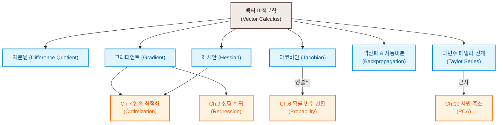

# 5. 벡터 미적분학 (Vector Calculus)

머신러닝의 수많은 알고리즘은 관측된 데이터를 가장 잘 설명하거나 오차를 최소화하는 최적의 모델 매개변수(parameter)를 찾는 **최적화(Optimization)** 문제를 해결해야 합니다. 
* **선형 회귀 (Linear Regression)**: 곡선 적합 문제를 해결하기 위해 오차 제곱합을 최소화하거나 우도를 최대화하는 최중립 가중치 파라미터를 최적화합니다.
* **심층 신경망 (Deep Neural Networks)**: 각 레이어의 가중치(weights)와 편향(biases)에 대해 손실 함수의 오차 역전파(Backpropagation) 연산을 연쇄 법칙(Chain Rule)으로 반복 적용하여 오차를 최소화합니다.
* **혼합 가우스 모델 (GMM)**: 데이터 분포를 모델링하기 위해 각 혼합 성분의 위치(평균) 및 형태(공분산) 파라미터를 최대 우도 추정법(MLE)으로 최적화합니다.

이러한 최적화 알고리즘은 손실 함수의 변화 속도와 방향 정보를 제공하는 **그래디언트(Gradient)** 정보를 핵심적으로 활용합니다. 이번 장에서는 그래디언트의 수학적 정의에서 시작하여 야코비안 행렬, 오차 역전파의 계산 그래프 구조, 자동 미분, 그리고 고차 미분인 헤시안 행렬과 다변수 테일러 전개까지의 모든 대수적·기하학적 유도를 정밀하게 기술합니다.

---

### [시각 자료] 벡터 미적분학 개념 마인드맵 (Figure 5.2)

본 장에서 다루는 주요 개념과 이들이 머신러닝의 다른 장에서 어떻게 응용되는지 보여주는 도식입니다.



---

# 5.1 일변수 함수의 미분 (Differentiation of Univariate Functions)

일변수 함수 $y = f(x) \ (x, y \in \mathbb{R})$의 미분은 함수의 국소적인 변화율을 구하는 도구입니다. 이는 그래프 상의 두 점을 잇는 할선의 기울기에서 출발하여 정의됩니다.

### [정의 5.1] 차분몫 (Difference Quotient)
함수 $f$ 상의 두 점 $(x_0, f(x_0))$와 $(x_0 + \delta x, f(x_0 + \delta x))$를 지나는 할선(Secant line)의 기울기를 나타내는 비율을 **차분몫**이라 정의합니다 (Figure 5.3 참조).
$$\frac{\delta y}{\delta x} := \frac{f(x + \delta x) - f(x)}{\delta x} \tag{5.3}$$
차분몫은 구간 $[x, x + \delta x]$ 사이에서 함수 $f$의 평균 변화율을 계산한 것입니다.

### [정의 5.2] 미분 (Derivative)
차분몫 식에서 두 점 사이의 간격을 극한으로 좁히는 극한($\delta x \to 0$ 또는 $h \to 0$)을 취했을 때 수렴하는 극한값을 **미분(도함수)**이라 정의하며, 기하학적으로는 함수 $f$의 $x$ 지점에서의 **접선(Tangent line)의 기울기**가 됩니다.
$$\frac{df}{dx} := \lim_{h \to 0} \frac{f(x + h) - f(x)}{h} \tag{5.4}$$
함수의 미분 값은 함수값이 가장 가파르게 증가하는 방향(steepest ascent)을 가리킵니다.

### [예제 5.2] 다항식 $f(x) = x^n$의 미분 유도
도함수의 극한 정의식 (5.4)를 활용하여 다항식의 미분 공식을 유도합니다.
$$\frac{df}{dx} = \lim_{h \to 0} \frac{(x+h)^n - x^n}{h} \tag{5.5b}$$
분자의 항을 이항정리(Binomial Theorem)를 통해 전개하면 다음과 같습니다.
$$\frac{df}{dx} = \lim_{h \to 0} \frac{\sum_{i=0}^{n} \binom{n}{i} x^{n-i}h^i - x^n}{h} \tag{5.5c}$$
$i=0$에 해당하는 첫 번째 전개항 $\binom{n}{0}x^n h^0 = x^n$은 분자의 $-x^n$과 상쇄되므로, 합의 인덱스를 $i=1$부터 시작하여 분모 $h$를 나눕니다.
$$\frac{df}{dx} = \lim_{h \to 0} \sum_{i=1}^{n} \binom{n}{i} x^{n-i}h^{i-1} \tag{5.6b}$$
$i=1$인 첫 번째 항과 나머지 $i \ge 2$인 항들을 분리합니다.
$$\frac{df}{dx} = \lim_{h \to 0} \left[ \binom{n}{1} x^{n-1} + \sum_{i=2}^{n} \binom{n}{i} x^{n-i}h^{i-1} \right] \tag{5.6c}$$
$h \to 0$ 극한을 취하면 $i \ge 2$인 항들은 $h$ 성분을 여전히 포함하고 있으므로 모두 0으로 수렴하여 소멸합니다. 따라서 남는 항은 다음과 같습니다.
$$\frac{df}{dx} = \binom{n}{1} x^{n-1} = n x^{n-1} \tag{5.6d}$$

---

## 5.1.1 테일러 급수 (Taylor Series)

테일러 급수는 어떤 지점에서 함수의 도함수 값들을 계수로 하는 무한 다항식의 합으로 원래 함수를 표현하는 방법입니다.

### [정의 5.3] 테일러 다항식 (Taylor Polynomial)
함수 $f: \mathbb{R} \to \mathbb{R}$가 $x_0$ 지점에서 $n$번 미분 가능할 때, $x_0$ 부근에서 $f$를 근사하는 $n$차 다항식을 **테일러 다항식**이라 정의합니다.
$$T_n(x) := \sum_{k=0}^{n} \frac{f^{(k)}(x_0)}{k!} (x - x_0)^k \tag{5.7}$$
여기서 $f^{(k)}(x_0)$는 $x_0$에서의 $k$차 미분값이며, $f^{(0)}(x_0) = f(x_0)$이고 $0! = 1$입니다.

### [정의 5.4] 테일러 급수 (Taylor Series)
함수가 무한번 미분 가능한 매끄러운 함수($f \in C^{\infty}$)일 때, 항의 개수를 무한대로 확장한 급수를 **테일러 급수**라고 합니다.
$$T_{\infty}(x) = \sum_{k=0}^{\infty} \frac{f^{(k)}(x_0)}{k!} (x - x_0)^k \tag{5.8}$$
특히 기준점 $x_0 = 0$에서의 테일러 급수를 **맥클로린 급수 (Maclaurin Series)**라고 부릅니다. 만약 어떤 함수가 자신의 테일러 급수와 모든 수렴 구간에서 완벽히 일치하면 그 함수를 **해석적 함수 (Analytic Function)**라고 정의합니다.

> [!NOTE]
> 테일러 다항식 $T_n(x)$은 기준점 $x_0$ 근방에서 원래 함수와 고도의 국소적 유사성을 가집니다. 만약 원래 함수 $f$가 $d \le n$차 다항식이라면, $n+1$차 이상의 미분값은 전부 0이 되므로 테일러 다항식 $T_n(x)$은 원래 함수 $f(x)$와 완전히 일치하는 완전한 표현식이 됩니다.

### [예제 5.3] $f(x) = x^4$의 $x_0 = 1$에서의 6차 테일러 다항식 유도
1. 각 차수별 미분계수를 구합니다.
   * $f(1) = 1$
   * $f'(1) = 4, \quad f''(1) = 12$
   * $f^{(3)}(1) = 24, \quad f^{(4)}(1) = 24$
   * $f^{(5)}(1) = 0, \quad f^{(6)}(1) = 0$ (5차 이상의 미분은 모두 0)
2. 식 (5.7)에 대입하여 $T_6(x)$를 구성합니다.
   $$T_6(x) = 1 + 4(x-1) + \frac{12}{2!}(x-1)^2 + \frac{24}{3!}(x-1)^3 + \frac{24}{4!}(x-1)^4 + 0 \tag{5.17b}$$
   $$T_6(x) = 1 + 4(x-1) + 6(x-1)^2 + 4(x-1)^3 + (x-1)^4 \tag{5.17b}$$
   위 식을 전개하여 차수별로 묶어 정리하면 원래 식과 정확히 같아짐을 확인할 수 있습니다.
   $$T_6(x) = x^4 = f(x) \tag{5.18b}$$

---

### [예제 5.4] $f(x) = \sin(x) + \cos(x)$의 $x_0 = 0$에서의 테일러 급수 (Figure 5.4)
1. $x_0 = 0$ 지점에서의 미분 계수들의 주기적 규칙을 파악합니다.
   * $f(0) = \sin(0) + \cos(0) = 1$
   * $f'(0) = \cos(0) - \sin(0) = 1$
   * $f''(0) = -\sin(0) - \cos(0) = -1$
   * $f^{(3)}(0) = -\cos(0) + \sin(0) = -1$
   * $f^{(4)}(0) = \sin(0) + \cos(0) = 1$ (이후 $1, 1, -1, -1$ 구조 반복)
2. 이를 맥클로린 급수식에 주입하여 나열합니다.
   $$T_{\infty}(x) = 1 + x - \frac{1}{2!}x^2 - \frac{1}{3!}x^3 + \frac{1}{4!}x^4 + \frac{1}{5!}x^5 - \cdots \tag{5.25b}$$
3. 부호가 양수와 음수로 번갈아 나오는 짝수 차수 항들과 홀수 차수 항들로 분리하여 합 공식으로 묶습니다.
   $$T_{\infty}(x) = \left( 1 - \frac{1}{2!}x^2 + \frac{1}{4!}x^4 - \cdots \right) + \left( x - \frac{1}{3!}x^3 + \frac{1}{5!}x^5 - \cdots \right) \tag{5.25c}$$
   $$T_{\infty}(x) = \sum_{k=0}^{\infty} \frac{(-1)^k}{(2k)!}x^{2k} + \sum_{k=0}^{\infty} \frac{(-1)^k}{(2k+1)!}x^{2k+1} = \cos(x) + \sin(x) \tag{5.25d-e}$$
   각각 코사인과 사인의 거듭제곱 급수(Power Series) 표현에 부합하므로, 최종 합산식은 원래 함수식과 일치합니다. Figure 5.4는 차수가 올라갈수록($T_0 \to T_1 \to T_5 \to T_{10}$) 원래 삼각함수 곡선에 점점 더 광범위하게 수렴해 나가는 타원형의 수렴 양상을 보여줍니다.

---

## 5.1.2 미분의 기본 규칙들
고교 수학에서 다룬 미분의 대수적 성질들은 다변수 공간의 미분을 유도할 때 동일하게 계승됩니다.
* **곱의 미분 법칙 (Product Rule)**: $(fg)' = f'g + fg'$
* **몫의 미분 법칙 (Quotient Rule)**: $\left(\frac{f}{g}\right)' = \frac{f'g - fg'}{g^2}$
* **합의 미분 법칙 (Sum Rule)**: $(f + g)' = f' + g'$
* **연쇄 법칙 (Chain Rule)**: $(g \circ f)'(x) = g'(f(x))f'(x)$ (합성 사상 $x \mapsto f(x) \mapsto g(f(x))$의 미분)

---

# 5.2 편미분과 그래디언트 (Partial Differentiation and Gradients)

다변수 함수 $f(\mathbf{x}) = f(x_1, \dots, x_n) \ (\mathbf{x} \in \mathbb{R}^n)$의 미분은 여러 입력 변수 중 오직 **관심 있는 단 하나의 변수만 변화시키고 나머지 다른 변수들은 상수로 고정**한 채 미분을 수행하는 **편미분**을 기초로 정의됩니다.

### [정의 5.5] 편미분 (Partial Derivative)과 그래디언트 (Gradient)
다변수 함수 $f: \mathbb{R}^n \to \mathbb{R}$에 대하여, 각 변수 $x_i \ (i=1, \dots, n)$ 방향의 편미분은 다음과 같이 정의됩니다.
$$\frac{\partial f}{\partial x_i} := \lim_{h \to 0} \frac{f(x_1, \dots, x_i + h, \dots, x_n) - f(x_1, \dots, x_n)}{h} \tag{5.39}$$
이 편미분 성분들을 **행벡터** 형태로 한데 모아놓은 벡터를 **그래디언트** 또는 **야코비안(Jacobian)**이라 정의하며, $\nabla_{\mathbf{x}}f$ 또는 $\frac{df}{d\mathbf{x}}$로 표기합니다.
$$\nabla_{\mathbf{x}}f = \text{grad } f = \frac{df}{d\mathbf{x}} := \begin{bmatrix} \frac{\partial f(\mathbf{x})}{\partial x_1} & \frac{\partial f(\mathbf{x})}{\partial x_2} & \cdots & \frac{\partial f(\mathbf{x})}{\partial x_n} \end{bmatrix} \in \mathbb{R}^{1 \times n} \tag{5.40}$$
여기서 $n$은 입력 변수의 개수이고, $1$은 치역의 차원(출력 스칼라)에 대응합니다.

> [!IMPORTANT]
> **그래디언트를 왜 열벡터가 아닌 행벡터로 정의하는가?**
> 선형대수 및 미적분학 교과서 중에는 그래디언트를 열벡터로 표기하는 경우도 많으나, 본서에서는 **행벡터**로 일관되게 정의합니다. 그 이유는 두 가지입니다.
> 1. 출력이 벡터가 되는 다변량 함수(벡터장)의 미분으로 확장했을 때, 미분 결과인 **야코비안 행렬($\mathbb{R}^{m \times n}$)**의 구조와 완벽한 대수적 일치성을 갖습니다.
> 2. 다차원 합성함수 미분 시, 차원의 전치를 신경 쓰지 않고 단순한 **행렬 곱셈 법칙**만으로 **다변수 연쇄 법칙**을 깔끔하게 기술할 수 있습니다.

### [예제 5.6] 편미분 계산 예시 (연쇄 법칙 활용)
함수 $f(x, y) = (x + 2y^3)^2$에 대해 $x$와 $y$에 대한 편미분을 각각 구합니다.
* $x$에 대한 편미분:
  $$\frac{\partial f(x, y)}{\partial x} = 2(x + 2y^3) \cdot \frac{\partial}{\partial x}(x + 2y^3) = 2(x + 2y^3) \tag{5.41}$$
* $y$에 대한 편미분:
  $$\frac{\partial f(x, y)}{\partial y} = 2(x + 2y^3) \cdot \frac{\partial}{\partial y}(x + 2y^3) = 12(x + 2y^3)y^2 \tag{5.42}$$

### [예제 5.7] 그래디언트 행벡터 표현
함수 $f(x_1, x_2) = x_1^2 x_2 + x_1 x_2^3$의 그래디언트를 구하면 다음과 같이 $1 \times 2$ 크기의 행벡터가 됩니다.
$$\frac{df}{d\mathbf{x}} = \begin{bmatrix} \frac{\partial f}{\partial x_1} & \frac{\partial f}{\partial x_2} \end{bmatrix} = \begin{bmatrix} 2x_1x_2 + x_2^3 & x_1^2 + 3x_1x_2^2 \end{bmatrix} \in \mathbb{R}^{1 \times 2} \tag{5.45}$$

---

## 5.2.1 다변수 편미분의 연산 법칙
벡터 $\mathbf{x} \in \mathbb{R}^n$에 대해 미분을 가할 때도 합, 곱, 연쇄 법칙이 성립하지만, **행렬과 벡터의 곱은 교환법칙이 성립하지 않으므로 곱하는 순서에 엄격히 주의**해야 합니다.
* **곱의 법칙**: $\frac{\partial}{\partial \mathbf{x}} (f(\mathbf{x})g(\mathbf{x})) = \frac{\partial f}{\partial \mathbf{x}} g(\mathbf{x}) + f(\mathbf{x}) \frac{\partial g}{\partial \mathbf{x}} \tag{5.46}$
* **합의 법칙**: $\frac{\partial}{\partial \mathbf{x}} (f(\mathbf{x}) + g(\mathbf{x})) = \frac{\partial f}{\partial \mathbf{x}} + \frac{\partial g}{\partial \mathbf{x}} \tag{5.47}$
* **연쇄 법칙**: $\frac{\partial}{\partial \mathbf{x}} (g \circ f)(\mathbf{x}) = \frac{\partial}{\partial \mathbf{x}} g(f(\mathbf{x})) = \frac{\partial g}{\partial f} \frac{\partial f}{\partial \mathbf{x}} \tag{5.48}$

> [!TIP]
> **다변수 연쇄 법칙의 직관적 암기 팁**
> 연쇄 법칙 수식 $\frac{\partial g}{\partial f} \frac{\partial f}{\partial \mathbf{x}}$의 형태는 행렬 곱셈에서 안쪽 차원이 맞물리는 구조와 같습니다. 좌측 인자의 "분모" 성분인 $\partial f$와 우측 인자의 "분자" 성분인 $\partial f$가 행렬 곱 차원에서 서로 맞물려 소거되어 최종적으로 $\frac{\partial g}{\partial \mathbf{x}}$만 남는다고 생각하면 차원의 불일치 실수를 피할 수 있습니다.

---

## 5.2.2 다변수 합성함수와 연쇄 법칙 (Chain Rule)

입력 변수 $x_1, x_2$가 매개변수 $t$에 대한 함수 $x_1(t), x_2(t)$이고, 최종 함수가 $f(x_1, x_2)$일 때, $f$의 $t$에 대한 전미분(Total Derivative)은 각 편미분 경로의 합으로 구성됩니다.

$$\frac{df}{dt} = \begin{bmatrix} \frac{\partial f}{\partial x_1} & \frac{\partial f}{\partial x_2} \end{bmatrix} \begin{bmatrix} \frac{dx_1(t)}{dt} \\ \frac{dx_2(t)}{dt} \end{bmatrix} = \frac{\partial f}{\partial x_1}\frac{dx_1}{dt} + \frac{\partial f}{\partial x_2}\frac{dx_2}{dt} \tag{5.49}$$

### [예제 5.8] 시간에 따른 전미분 계산
함수 $f(x_1, x_2) = x_1^2 + 2x_2$가 있고, $x_1 = \sin t, x_2 = \cos t$로 매개변수화되어 있을 때, $t$에 대한 미분은 다음과 같습니다.
$$\frac{df}{dt} = \frac{\partial f}{\partial x_1}\frac{dx_1}{dt} + \frac{\partial f}{\partial x_2}\frac{dx_2}{dt} = (2x_1)(\cos t) + (2)(-\sin t) \tag{5.50b}$$
$$x_1 = \sin t$$를 대입하여 정리합니다.
$$\frac{df}{dt} = 2\sin t \cos t - 2\sin t = 2\sin t(\cos t - 1) \tag{5.50c}$$

### 2변수 매개변수 공간으로의 확장
만약 입력 변수들이 2개의 독립변수 $s$와 $t$의 함수($x_1(s, t), x_2(s, t)$)라면, 편미분 연쇄 법칙은 다음과 같이 행렬 곱셈 형태로 자연스럽게 기술됩니다.
$$\frac{\partial f}{\partial s} = \frac{\partial f}{\partial x_1}\frac{\partial x_1}{\partial s} + \frac{\partial f}{\partial x_2}\frac{\partial x_2}{\partial s} \tag{5.51}$$
$$\frac{\partial f}{\partial t} = \frac{\partial f}{\partial x_1}\frac{\partial x_1}{\partial t} + \frac{\partial f}{\partial x_2}\frac{\partial x_2}{\partial t} \tag{5.52}$$
이를 행렬 곱으로 묶으면 다음과 같이 완벽한 야코비안 행렬 곱 형태가 도출됩니다.
$$\frac{df}{d(s, t)} = \frac{\partial f}{\partial \mathbf{x}} \frac{\partial \mathbf{x}}{\partial (s, t)} = \underbrace{\begin{bmatrix} \frac{\partial f}{\partial x_1} & \frac{\partial f}{\partial x_2} \end{bmatrix}}_{1 \times 2} \underbrace{\begin{bmatrix} \frac{\partial x_1}{\partial s} & \frac{\partial x_1}{\partial t} \\ \frac{\partial x_2}{\partial s} & \frac{\partial x_2}{\partial t} \end{bmatrix}}_{2 \times 2} \tag{5.53}$$
이와 같이 그래디언트를 **행벡터**로 정의함으로써 전치 연산($\top$)을 번거롭게 수식 곳곳에 끼워 넣지 않고도 일관성 있는 행렬 곱 연산을 수행할 수 있게 됩니다.

---

# 5.3 벡터값 함수의 그래디언트 (Gradients of Vector-Valued Functions)

이제 스칼라 출력을 넘어, 다차원 벡터를 입력받아 다차원 벡터를 출력하는 일반적인 벡터 사상(Vector Field) $\mathbf{f}: \mathbb{R}^n \to \mathbb{R}^m$의 그래디언트를 유도합니다.

$$\mathbf{f}(\mathbf{x}) = \begin{bmatrix} f_1(\mathbf{x}) \\ \vdots \\ f_m(\mathbf{x}) \end{bmatrix} \in \mathbb{R}^m \tag{5.54}$$

벡터값 함수 $\mathbf{f}$는 각 원소별로 스칼라 함수 $f_i: \mathbb{R}^n \to \mathbb{R} \ (i=1, \dots, m)$들의 묶음으로 생각할 수 있습니다. 각 원소별 편미분 벡터 $\frac{\partial \mathbf{f}}{\partial x_j}$는 다음과 같이 $m$차원 열벡터가 됩니다.
$$\frac{\partial \mathbf{f}}{\partial x_j} = \begin{bmatrix} \frac{\partial f_1}{\partial x_j} & \cdots & \frac{\partial f_m}{\partial x_j} \end{bmatrix}^{\top} \in \mathbb{R}^m \tag{5.55}$$

### [정의 5.6] 야코비안 행렬 (Jacobian Matrix)
다변수 벡터값 함수 $\mathbf{f}: \mathbb{R}^n \to \mathbb{R}^m$의 모든 1차 편미분 정보를 행렬 형태로 모은 것을 **야코비안 행렬**이라 하며, $J$ 또는 $\nabla_{\mathbf{x}}\mathbf{f}$로 표기합니다.
$$J = \nabla_{\mathbf{x}}\mathbf{f} = \frac{d\mathbf{f}(\mathbf{x})}{d\mathbf{x}} := \begin{bmatrix} \frac{\partial \mathbf{f}(\mathbf{x})}{\partial x_1} & \cdots & \frac{\partial \mathbf{f}(\mathbf{x})}{\partial x_n} \end{bmatrix} \tag{5.57}$$
이를 원소별로 나열하여 풀면 다음과 같이 **$m \times n$ 행렬** 형태가 됨을 볼 수 있습니다.
$$J = \begin{bmatrix} \frac{\partial f_1(\mathbf{x})}{\partial x_1} & \cdots & \frac{\partial f_1(\mathbf{x})}{\partial x_n} \\ \vdots & \ddots & \vdots \\ \frac{\partial f_m(\mathbf{x})}{\partial x_1} & \cdots & \frac{\partial f_m(\mathbf{x})}{\partial x_n} \end{bmatrix} \in \mathbb{R}^{m \times n}, \quad J(i, j) = \frac{\partial f_i}{\partial x_j} \tag{5.58-5.59}$$
즉, 야코비안 행렬의 각 **행(Row)**은 출력 스칼라 성분 $f_i$의 그래디언트 행벡터에 대응하고, 각 **열(Column)**은 입력 변수 $x_j$에 대한 벡터 함수의 편미분 열벡터에 대응합니다.

---

### [시각 자료] 야코비안 행렬식의 기하학적 면적/부피 변화율 (Figure 5.5)

야코비안 행렬은 비선형 공간 변환 시 국소적인 격자의 찌그러짐을 설명하는 선형 매핑 변환입니다.
* 2차원 공간 상의 단위 정사각형 영역(파란색, 면적 1)에 변환 함수 $\mathbf{f}$를 가해 평행사변형 영역(주황색, c1 및 c2를 기저로 가짐)으로 매핑할 때, 이 변환이 선형 기저 변환이라면 변환 행렬 $J$는 다음과 같이 정의됩니다.
  $$J = \begin{bmatrix} -2 & 1 \\ 1 & 1 \end{bmatrix} \tag{5.62}$$
* 이때 변환된 영역의 실제 면적은 원래 넓이(1)에 **야코비안 행렬식의 절대값 $|\det(J)| = |-3| = 3$**을 곱한 값이 됩니다 (Figure 5.5 참조).
* 만약 공간 변환이 비선형(Non-linear) 변환이라면, 공간의 각 위치마다 찌그러지는 비율이 달라집니다. 이때 **야코비안 행렬 $J(\mathbf{x})$은 각 국소적 위치 $\mathbf{x}$에서의 공간 팽창/수축 배율(Jacobian Determinant)을 나타내는 국소 선형 근사 도구**가 됩니다. 이 성질은 6.7절의 확률 변수 변환(Change of Variables) 공식에서 핵심적으로 사용됩니다.

---

### [시각 자료] 입력/출력 차원에 따른 미분의 형태 정리 (Figure 5.6)

입력 차원 $D$와 출력 차원 $E$의 조합에 따라 도함수가 갖는 차원의 기하학적 구조입니다.

| | 출력 $E=1$ (스칼라) | 출력 $E>1$ (벡터) |
| :--- | :--- | :--- |
| **입력 $D=1$ (스칼라)** | **스칼라 (Scalar)** <br/> $\frac{df}{dx} \in \mathbb{R}$ | **열벡터 (Column Vector)** <br/> $\frac{d\mathbf{f}}{dx} \in \mathbb{R}^{E \times 1}$ |
| **입력 $D>1$ (벡터)** | **행벡터 (Row Vector)** <br/> $\frac{df}{d\mathbf{x}} \in \mathbb{R}^{1 \times D}$ | **야코비안 행렬 (Jacobian Matrix)** <br/> $\frac{d\mathbf{f}}{d\mathbf{x}} \in \mathbb{R}^{E \times D}$ |

---

### [예제 5.9] 선형 변환 $\mathbf{f}(\mathbf{x}) = A\mathbf{x}$의 그래디언트
함수 $\mathbf{f}: \mathbb{R}^n \to \mathbb{R}^m$가 행렬 $A \in \mathbb{R}^{m \times n}$에 의해 $\mathbf{f}(\mathbf{x}) = A\mathbf{x}$로 정의될 때, 그래디언트(야코비안)를 유도합니다.
먼저, 출력 $\mathbf{f}$가 $m$차원이고 입력 $\mathbf{x}$가 $n$차원이므로 그래디언트 행렬은 $m \times n$ 크기가 됩니다.
각 원소 $f_i(\mathbf{x}) = \sum_{k=1}^{n} A_{ik}x_k$이므로, 이를 $x_j$로 편미분하면 다음과 같습니다.
$$\frac{\partial f_i}{\partial x_j} = A_{ij} \tag{5.67}$$
이를 야코비안 행렬식 정의에 대입하여 나열하면 원래 행렬 $A$ 자체가 유도됨을 볼 수 있습니다.
$$\frac{d(A\mathbf{x})}{d\mathbf{x}} = A \in \mathbb{R}^{m \times n} \tag{5.68}$$

---

### [예제 5.11] 선형 모델 오차 제곱합(Least-Squares) 손실 함수의 그래디언트 유도
머신러닝의 선형 회귀 모델 $y = \mathbf{\Phi}\mathbf{\theta} \ (\mathbf{\theta} \in \mathbb{R}^D, \mathbf{\Phi} \in \mathbb{R}^{N \times D}, \mathbf{y} \in \mathbb{R}^N)$에서 정의되는 오차 제곱합 손실 함수를 다음과 같이 합성함수로 설계합니다.
$$L(\mathbf{e}) := \|\mathbf{e}\|_2^2 = \mathbf{e}^{\top}\mathbf{e} \tag{5.76}$$
$$\mathbf{e}(\mathbf{\theta}) := \mathbf{y} - \mathbf{\Phi}\mathbf{\theta} \tag{5.77}$$
파라미터 $\mathbf{\theta}$에 대한 손실 함수의 그래디언트 $\frac{\partial L}{\partial \mathbf{\theta}} \in \mathbb{R}^{1 \times D}$를 연쇄 법칙을 통해 구합니다.
$$\frac{\partial L}{\partial \mathbf{\theta}} = \frac{\partial L}{\partial \mathbf{e}} \frac{\partial \mathbf{e}}{\partial \mathbf{\theta}} \tag{5.79}$$
1. $L$의 오차 벡터 $\mathbf{e}$에 대한 미분:
   $$\frac{\partial L}{\partial \mathbf{e}} = 2\mathbf{e}^{\top} \in \mathbb{R}^{1 \times N} \tag{5.81}$$
2. $\mathbf{e}$의 파라미터 $\mathbf{\theta}$에 대한 미분:
   $$\frac{\partial \mathbf{e}}{\partial \mathbf{\theta}} = \frac{\partial (\mathbf{y} - \mathbf{\Phi}\mathbf{\theta})}{\partial \mathbf{\theta}} = -\mathbf{\Phi} \in \mathbb{R}^{N \times D} \tag{5.82}$$
3. 두 행렬을 순서대로 곱해 연쇄 법칙을 완성합니다.
   $$\frac{\partial L}{\partial \mathbf{\theta}} = (2\mathbf{e}^{\top})(-\mathbf{\Phi}) = -2\mathbf{e}^{\top}\mathbf{\Phi} \in \mathbb{R}^{1 \times D} \tag{5.83}$$
   여기에 $\mathbf{e}^{\top} = \mathbf{y}^{\top} - \mathbf{\theta}^{\top}\mathbf{\Phi}^{\top}$를 대입하여 $\mathbf{\theta}$에 대한 식으로 정리합니다.
   $$\frac{\partial L}{\partial \mathbf{\theta}} = -2(\mathbf{y}^{\top} - \mathbf{\theta}^{\top}\mathbf{\Phi}^{\top})\mathbf{\Phi} \in \mathbb{R}^{1 \times D} \tag{5.83}$$

---

# 5.4 행렬과 텐서의 그래디언트 (Gradients of Matrices)

최적화 대상 파라미터가 벡터가 아닌 행렬 $A \in \mathbb{R}^{m \times n}$이거나, 미분하려는 함수가 행렬을 출력하는 경우, 이들의 미분 성분은 3차원 혹은 4차원의 **텐서(Tensor)** 형태를 취하게 됩니다.
예를 들어, $m \times n$ 행렬 $A$를 $p \times q$ 행렬 $B$로 미분하는 경우, 미분 결과는 다음과 같은 4차원 야코비안 텐서 $J$가 됩니다.
$$J_{ijkl} = \frac{\partial A_{ij}}{\partial B_{kl}} \in \mathbb{R}^{m \times n \times p \times q}$$

---

### [시각 자료] 행렬 그래디언트 연산의 두 가지 접근법 (Figure 5.7)

다차원 텐서 미분 계산 시 발생하는 차원 관리 문제를 해결하기 위한 두 가지 수학적 접근 경로입니다.

```
[접근법 1: 텐서 직접 조립]
A (4x2 행렬) 를 x (3차원 벡터) 로 직접 미분
-> 각 성분별 편미분 행렬 dA/dx_j (4x2) 들을 깊이 방향으로 쌓음
-> 최종 3차원 텐서 dA/dx (4 x 2 x 3) 도출

[접근법 2: 행렬 평탄화 (Flattening)]
A (4x2 행렬) ---------------------- 평탄화 (Flattening) -----------------> A_tilde (8차원 벡터)
                                                                                  |
                                                                                  | dx 미분 (2차원 야코비안)
                                                                                  v
dA/dx (4 x 2 x 3 텐서) <------------ 차원 재정렬 (Reshaping) ------------ Jacobian Matrix (8 x 3)
```

* **접근법 1 (텐서 직접 빌드)**: 입력 벡터의 각 성분 $x_j$별로 편미분을 가해 얻은 행렬들을 슬라이스 삼아 쌓아서 직접 3차원 텐서를 구축합니다.
* **접근법 2 (평탄화 및 재정렬)**: 행렬 공간 $\mathbb{R}^{m \times n}$과 벡터 공간 $\mathbb{R}^{mn}$ 사이의 벡터 공간 동형사상(Isomorphism)을 활용합니다. 행렬을 1차원 벡터로 일렬로 쭉 펼친 뒤(Flattening), 표준 2차원 야코비안 행렬($mn \times pq$)을 구한 다음, 이를 원하는 차원의 텐서 형태로 복원(Reshaping)합니다. 이 방식은 프로그래밍 구현 시 복잡한 차원 연쇄 법칙을 단순 행렬 곱으로 환원할 수 있어 널리 쓰입니다.

---

### [예제 5.12] 벡터의 행렬에 대한 그래디언트 $\frac{d\mathbf{f}}{dA}$ 유도
식 $\mathbf{f} = A\mathbf{x} \ (\mathbf{f} \in \mathbb{R}^M, A \in \mathbb{R}^{M \times N}, \mathbf{x} \in \mathbb{R}^N)$에 대하여, 행렬 $A$에 대한 미분 $\frac{d\mathbf{f}}{dA}$를 구합니다.
미분 결과의 차원은 $M \times (M \times N)$인 3차원 텐서 구조를 가집니다.
$$\frac{d\mathbf{f}}{dA} = \begin{bmatrix} \frac{\partial f_1}{\partial A} \\ \vdots \\ \frac{\partial f_M}{\partial A} \end{bmatrix}, \quad \frac{\partial f_i}{\partial A} \in \mathbb{R}^{1 \times M \times N} \tag{5.87}$$
$\mathbf{f}$의 각 성분 공식 $f_i = \sum_{j=1}^{N} A_{ij}x_j$를 $A$의 원소 $A_{pq}$로 편미분합니다.
$$\frac{\partial f_i}{\partial A_{pq}} = \begin{cases} x_q & \text{if } p = i \\ 0 & \text{otherwise} \end{cases} \tag{5.89}$$
따라서, $f_i$를 $A$의 $i$번째 행 벡터 $A_{i,:}$로 미분한 결과는 $\mathbf{x}^{\top} \in \mathbb{R}^{1 \times 1 \times N}$이 되고, 다른 행으로 미분하면 $0$이 됩니다. 이 조각들을 모아 조립하면 최종 미분 텐서는 다음과 같은 스파스한 텐서 구조를 취합니다.
$$\frac{\partial f_i}{\partial A} = \begin{bmatrix} \mathbf{0}^{\top} \\ \vdots \\ \mathbf{x}^{\top} \\ \vdots \\ \mathbf{0}^{\top} \end{bmatrix} \leftarrow i\text{-th row} \quad \in \mathbb{R}^{M \times N} \tag{5.92}$$

---

# 5.5 그래디언트 계산을 위한 유용한 대수 공식들

머신러닝 식 유도 과정에서 자주 마주치는 대표적인 행렬 미분 공식들의 목록입니다 ($\mathbf{a}, \mathbf{b}$는 상수 벡터, $X, W$는 행렬).

* 전치 및 대각합 미분:
  $$\frac{\partial f(X)^{\top}}{\partial X} = \left( \frac{\partial f(X)}{\partial X} \right)^{\top} \tag{5.99}$$
  $$\frac{\partial \text{tr}(f(X))}{\partial X} = \text{tr}\left( \frac{\partial f(X)}{\partial X} \right) \tag{5.100}$$
* 행렬식 미분 (Jacobi's Formula):
  $$\frac{\partial \det(f(X))}{\partial X} = \det(f(X)) \text{tr}\left( f(X)^{-1} \frac{\partial f(X)}{\partial X} \right) \tag{5.101}$$
* 역행렬 미분:
  $$\frac{\partial f(X)^{-1}}{\partial X} = -f(X)^{-1} \frac{\partial f(X)}{\partial X} f(X)^{-1} \tag{5.102}$$
*二次 형식 및 선형 형식 벡터 미분:
  $$\frac{\partial (\mathbf{a}^{\top} X^{-1} \mathbf{b})}{\partial X} = -(X^{-1})^{\top} \mathbf{a} \mathbf{b}^{\top} (X^{-1})^{\top} \tag{5.103}$$
  $$\frac{\partial (\mathbf{x}^{\top}\mathbf{a})}{\partial \mathbf{x}} = \frac{\partial (\mathbf{a}^{\top}\mathbf{x})}{\partial \mathbf{x}} = \mathbf{a}^{\top} \tag{5.104-5.105}$$
  $$\frac{\partial (\mathbf{a}^{\top} X \mathbf{b})}{\partial X} = \mathbf{a}\mathbf{b}^{\top} \tag{5.106}$$
  $$\frac{\partial (\mathbf{x}^{\top} B \mathbf{x})}{\partial \mathbf{x}} = \mathbf{x}^{\top}(B + B^{\top}) \tag{5.107}$$
* 가중 편차 제곱합 미분 ($W$가 대칭 행렬인 경우):
  $$\frac{\partial}{\partial \mathbf{s}} (\mathbf{x} - A\mathbf{s})^{\top} W (\mathbf{x} - A\mathbf{s}) = -2(\mathbf{x} - A\mathbf{s})^{\top} W A \tag{5.108}$$

---

# 5.6 역전파와 자동 미분 (Backpropagation and Automatic Differentiation)

딥러닝의 핵심 학습 메커니즘인 **오차 역전파**는 심층적으로 꼬여있는 수많은 합성함수의 미분 과정을 대수적으로 끝까지 풀어내는 대신, 중간 연산 값들을 메모리에 저축하고 **연쇄 법칙을 역방향으로 순차적으로 적용**하여 기울기를 극도로 효율적으로 전파하는 수치적 계산 기법입니다.

## 5.6.1 심층 신경망에서의 그래디언트 흐름

심층 신경망에서 순방향 출력값 $\mathbf{y}$는 입력 $\mathbf{x}$로부터 다음과 같이 $K$개의 합성층을 거쳐 계산됩니다.
$$\mathbf{y} = (f_K \circ f_{K-1} \circ \dots \circ f_1)(\mathbf{x}) \tag{5.111}$$
각 레이어 $i$는 바로 앞 층의 출력 $\mathbf{f}^{i-1}$을 받아 가중치 곱과 활성화 함수 $\sigma$를 가해 결과를 출력합니다.
$$\mathbf{f}^i = \sigma_i(A_{i-1}\mathbf{f}^{i-1} + \mathbf{b}_{i-1}) \tag{5.113}$$
전체 모델 파라미터 집합 $\mathbf{\theta} = \{A_0, \mathbf{b}_0, \dots, A_{K-1}, \mathbf{b}_{K-1}\}$에 대해 최종 손실 함수 $L$의 그래디언트를 연쇄 법칙으로 나열하면 다음과 같습니다 (Figure 5.8 & 5.9 참조).

$$\frac{\partial L}{\partial \mathbf{\theta}_{K-1}} = \color{red}{\frac{\partial L}{\partial \mathbf{f}^K}} \color{blue}{\frac{\partial \mathbf{f}^K}{\partial \mathbf{\theta}_{K-1}}} \tag{5.115}$$
$$\frac{\partial L}{\partial \mathbf{\theta}_{K-2}} = \color{red}{\frac{\partial L}{\partial \mathbf{f}^K} \frac{\partial \mathbf{f}^K}{\partial \mathbf{f}^{K-1}}} \color{blue}{\frac{\partial \mathbf{f}^{K-1}}{\partial \mathbf{\theta}_{K-2}}} \tag{5.116}$$
$$\frac{\partial L}{\partial \mathbf{\theta}_{i}} = \underbrace{\color{red}{\frac{\partial L}{\partial \mathbf{f}^K} \frac{\partial \mathbf{f}^K}{\partial \mathbf{f}^{K-1}} \cdots \frac{\partial \mathbf{f}^{i+2}}{\partial \mathbf{f}^{i+1}}}}_{\text{오차 역방향 전파 성분}} \color{blue}{\frac{\partial \mathbf{f}^{i+1}}{\partial \mathbf{\theta}_{i}}} \tag{5.118}$$

* **빨간색 성분 (오차 전파)**: 출력 레이어에서부터 현재 레이어 직전까지 각 활성화 단계별 입력에 대한 출력의 편미분($\frac{\partial \mathbf{f}^{j+1}}{\partial \mathbf{f}^j}$)이 연쇄적으로 곱해지며 흘러오는 성분입니다. 이 성분은 하위 레이어로 내려갈 때 그대로 재사용(Reuse)되므로 중복 연산이 발생하지 않습니다.
* **파란색 성분 (로컬 그래디언트)**: 현재 레이어의 출력을 자신의 파라미터 $\mathbf{\theta}_i$로 직접 편미분한 로컬 미분 성분입니다.

이와 같이 기울기 정보가 역방향으로 흐르는 메커니즘을 시각화한 것이 Figure 5.9입니다.

---

## 5.6.2 자동 미분 (Automatic Differentiation)과 연산 그래프

자동 미분은 수식 자체를 미분 규칙에 따라 파싱하여 대수식 형태로 미분하는 **기호적 미분(Symbolic Differentiation)**이나, 수치적 차분몫을 통해 근사하는 **수치 미분(Numerical Differentiation / Finite Difference)**과 구별되는 독자적인 기법입니다.
프로그램 소스 코드 상의 모든 복잡한 연산 과정을 기본 4칙 연산과 기초 초월함수(sin, cos, exp, log)들의 조합으로 쪼갠 뒤, 컴퓨터가 연산 중간값과 로컬 미분 계수를 동시 기록하면서 수치적 정밀성을 유지하며 미분값을 산출합니다.

### 순방향 모드 (Forward Mode) vs. 역방향 모드 (Reverse Mode)
* **순방향 모드**: 데이터가 흘러가는 입력부터 출력 방향으로 기울기를 동시에 계산하여 곱해 나갑니다. 입력 변수의 수 $n$이 출력 변수의 수 $m$보다 훨씬 적을 때 효율적입니다.
* **역방향 모드 (오차 역전파)**: 순방향 연산을 통해 최종 값을 구한 뒤, 출력에서 입력 방향으로 기울기를 거슬러 올라가며 곱해 줍니다. 딥러닝과 같이 **파라미터 차원 $n$이 손실 값 차원(스칼라, $m=1$)보다 아도적으로 많은 시스템에서는 역방향 모드가 압도적으로 저렴하고 최적**입니다.

---

### [예제 5.14] 역방향 자동 미분 계산 과정 (Figure 5.10 & 5.11)
다음 함수 $f(x)$에 대해 역방향 자동 미분을 실행하는 과정입니다.
$$f(x) = \sqrt{x^2 + \exp(x^2)} + \cos(x^2 + \exp(x^2)) \tag{5.122}$$
이 복잡한 함수를 컴퓨터가 연산하는 순서에 따라 **중간 변수 (Intermediate Variables)**들로 쪼개어 연산 그래프(Computation Graph)를 만듭니다 (Figure 5.11 참조).

1. **순방향 계산 경로 (Forward Pass)**:
   * $a = x^2 \tag{5.123}$
   * $b = \exp(a) \tag{5.124}$
   * $c = a + b \tag{5.125}$
   * $d = \sqrt{c} \tag{5.126}$
   * $e = \cos(c) \tag{5.127}$
   * $f = d + e \tag{5.128}$
2. **로컬 미분 계산 (Local Derivatives)**: 각 노드는 자신의 바로 앞 부모 노드 방향의 기초 도함수 값을 계산합니다.
   * $\frac{\partial a}{\partial x} = 2x, \quad \frac{\partial b}{\partial a} = \exp(a), \quad \frac{\partial c}{\partial a} = 1, \quad \frac{\partial c}{\partial b} = 1$
   * $\frac{\partial d}{\partial c} = \frac{1}{2\sqrt{c}}, \quad \frac{\partial e}{\partial c} = -\sin(c), \quad \frac{\partial f}{\partial d} = 1, \quad \frac{\partial f}{\partial e} = 1$
3. **역방향 오차 전파 경로 (Backward Pass)**: 최종 출력 $\frac{\partial f}{\partial f} = 1$에서 출발하여 역순으로 부분적 기울기를 누적해 나갑니다.
   * $\frac{\partial f}{\partial c} = \frac{\partial f}{\partial d}\frac{\partial d}{\partial c} + \frac{\partial f}{\partial e}\frac{\partial e}{\partial c} = 1 \cdot \frac{1}{2\sqrt{c}} + 1 \cdot (-\sin(c)) \tag{5.139}$
   * $\frac{\partial f}{\partial b} = \frac{\partial f}{\partial c}\frac{\partial c}{\partial b} = \frac{\partial f}{\partial c} \cdot 1 \tag{5.140}$
   * $\frac{\partial f}{\partial a} = \frac{\partial f}{\partial b}\frac{\partial b}{\partial a} + \frac{\partial f}{\partial c}\frac{\partial c}{\partial a} = \frac{\partial f}{\partial b}\exp(a) + \frac{\partial f}{\partial c} \cdot 1 \tag{5.141}$
   * $\frac{\partial f}{\partial x} = \frac{\partial f}{\partial a}\frac{\partial a}{\partial x} = \frac{\partial f}{\partial a} \cdot 2x \tag{5.142}$

이 과정을 거쳐 구해진 최종 기울기 $\frac{\partial f}{\partial x}$의 수치 연산량은, 식 (5.110)의 복잡한 최종 미분 공식을 직접 수치 연산하는 속도에 비해 훨씬 간단하고 빠르며, 원래 함수의 순방향 연산 계산량 수준에 비례합니다.

---

# 5.7 고차 미분과 헤시안 행렬 (Higher-Order Derivatives)

함수의 곡률이나 최적화의 극점 형태를 파악하기 위해, 첫 번째 미분값(그래디언트)을 한 번 더 미분하는 고차 미분을 도입합니다.

### [정의 5.7] 헤시안 행렬 (Hessian Matrix)
다변수 스칼라 함수 $f: \mathbb{R}^n \to \mathbb{R}$의 모든 2차 편미분 성분들을 모은 정사각 행렬을 **헤시안 행렬**이라 하며, $H$ 또는 $\nabla_{\mathbf{x}}^2 f$로 표기합니다.
$$H = \nabla_{\mathbf{x}}^2 f := \begin{bmatrix} \frac{\partial^2 f}{\partial x_1^2} & \frac{\partial^2 f}{\partial x_1 \partial x_2} & \cdots & \frac{\partial^2 f}{\partial x_1 \partial x_n} \\ \vdots & \ddots & \vdots \\ \frac{\partial^2 f}{\partial x_n \partial x_1} & \cdots & \frac{\partial^2 f}{\partial x_n^2} \end{bmatrix} \in \mathbb{R}^{n \times n} \tag{5.147}$$
만약 함수 $f$가 2번 연속 미분 가능한 함수라면, 클레로의 정리(Clairaut's Theorem)에 의해 혼합 편미분의 순서가 무관하게 성립합니다.
$$\frac{\partial^2 f}{\partial x_i \partial x_j} = \frac{\partial^2 f}{\partial x_j \partial x_i} \tag{5.146}$$
따라서, **일반적인 물리계의 헤시안 행렬은 언제나 완벽한 대칭(Symmetric) 행렬**입니다. 헤시안 행렬은 해당 지점에서의 국소적인 공간의 휘어짐(곡률, Curvature)을 측정하는 물리량입니다.

---

# 5.8 다변수 테일러 급수 (Multivariate Taylor Series)

1변수 함수의 테일러 전개(5.1.1절)를 다차원 입력 변수를 가진 함수 $f: \mathbb{R}^D \to \mathbb{R}$로 확장합니다.

### [정의 5.8] 다변수 테일러 급수
점 $\mathbf{x}_0$ 부근에서 정의된 매끄러운 함수 $f$에 대하여, 변화 벡터를 $\mathbf{\delta} := \mathbf{x} - \mathbf{x}_0$라 두었을 때, 다변수 테일러 급수는 다음과 같이 정의됩니다.
$$f(\mathbf{x}) = \sum_{k=0}^{\infty} \frac{D_{\mathbf{x}}^k f(\mathbf{x}_0)}{k!} \mathbf{\delta}^k \tag{5.151}$$
여기서 도함수 성분 $D_{\mathbf{x}}^k f(\mathbf{x}_0)$와 변화 벡터의 거듭제곱 $\mathbf{\delta}^k$는 $k$차원의 고차원 **텐서**들 간의 곱(텐서 축약 연산)으로 정의됩니다.

### 텐서 외적 $\mathbf{\delta}^k$의 차원 팽창
* $k=2$인 경우: 외적 $\mathbf{\delta}^2 := \mathbf{\delta} \otimes \mathbf{\delta} = \mathbf{\delta}\mathbf{\delta}^{\top} \in \mathbb{R}^{D \times D}$ (2차원 행렬 형성)
* $k=3$인 경우: 외적 $\mathbf{\delta}^3 := \mathbf{\delta} \otimes \mathbf{\delta} \otimes \mathbf{\delta} \in \mathbb{R}^{D \times D \times D}$ (3차원 텐서 형성; Figure 5.13 참조)

### 다변수 테일러 다항식의 저차 항 분해 ($k=0, 1, 2, 3$)
다차원 테일러 급수의 $k=3$차 항까지를 행렬과 벡터 표기법으로 온전하게 풀어서 서술하면 다음과 같습니다.
1. **$k=0$ (상수 항)**:
   $$D_{\mathbf{x}}^0 f(\mathbf{x}_0)\mathbf{\delta}^0 = f(\mathbf{x}_0) \in \mathbb{R} \tag{5.156}$$
2. **$k=1$ (1차 선형 근사 항 - 그래디언트 개입)**:
   $$D_{\mathbf{x}}^1 f(\mathbf{x}_0)\mathbf{\delta}^1 = \nabla_{\mathbf{x}}f(\mathbf{x}_0)\mathbf{\delta} = \sum_{i=1}^{D} \frac{\partial f(\mathbf{x}_0)}{\partial x_i}\delta_i \in \mathbb{R} \tag{5.157}$$
3. **$k=2$ (2차 곡률 근사 항 - 헤시안 개입)**:
   $$D_{\mathbf{x}}^2 f(\mathbf{x}_0)\mathbf{\delta}^2 = \mathbf{\delta}^{\top}H(\mathbf{x}_0)\mathbf{\delta} = \sum_{i=1}^{D}\sum_{j=1}^{D} H_{ij}\delta_i\delta_j \in \mathbb{R} \tag{5.158-5.159}$$
4. **$k=3$ (3차 텐서 근사 항)**:
   $$D_{\mathbf{x}}^3 f(\mathbf{x}_0)\mathbf{\delta}^3 = \sum_{i=1}^{D}\sum_{j=1}^{D}\sum_{k=1}^{D} D_{\mathbf{x}}^3 f(\mathbf{x}_0)[i, j, k]\delta_i\delta_j\delta_k \in \mathbb{R} \tag{5.160}$$

---

### [예제 5.15] 2변수 함수의 테일러 전개 계산 과정
다음 3차 다항식 $f(x, y) = x^3 + 2xy + y^3$에 대해 기준점 $(x_0, y_0) = (1, 2)$에서의 테일러 전개를 수행합니다.
원래 식의 최고 차수가 3차이므로, 테일러 전개의 $k=3$차 항까지만 구하면 원래 다항식과 한 치의 오차도 없는 정확한 식이 도출될 것을 예측할 수 있습니다.

1. **상수 및 1차 그래디언트 구하기**:
   * $f(1, 2) = 1^3 + 2(1)(2) + 2^3 = 13 \tag{5.162}$
   * $\frac{\partial f}{\partial x} = 3x^2 + 2y \implies \frac{\partial f}{\partial x}(1, 2) = 7$
   * $\frac{\partial f}{\partial y} = 2x + 3y^2 \implies \frac{\partial f}{\partial y}(1, 2) = 14 \tag{5.164}$
   * 1차 테일러 항:
     $$D^1 f(1, 2)\mathbf{\delta} = \begin{bmatrix} 7 & 14 \end{bmatrix} \begin{bmatrix} x-1 \\ y-2 \end{bmatrix} = 7(x-1) + 14(y-2) \tag{5.166}$$
2. **2차 헤시안 구하기**:
   * $\frac{\partial^2 f}{\partial x^2} = 6x \implies \frac{\partial^2 f}{\partial x^2}(1, 2) = 6$
   * $\frac{\partial^2 f}{\partial y^2} = 6y \implies \frac{\partial^2 f}{\partial y^2}(1, 2) = 12$
   * $\frac{\partial^2 f}{\partial x \partial y} = \frac{\partial^2 f}{\partial y \partial x} = 2$
   * 헤시안 대입:
     $$H(1, 2) = \begin{bmatrix} 6 & 2 \\ 2 & 12 \end{bmatrix} \tag{5.172}$$
   * 2차 테일러 항:
     $$\frac{1}{2!} \mathbf{\delta}^{\top} H(1, 2)\mathbf{\delta} = \frac{1}{2} \begin{bmatrix} x-1 & y-2 \end{bmatrix} \begin{bmatrix} 6 & 2 \\ 2 & 12 \end{bmatrix} \begin{bmatrix} x-1 \\ y-2 \end{bmatrix} = 3(x-1)^2 + 2(x-1)(y-2) + 6(y-2)^2 \tag{5.173}$$
3. **3차 텐서 구하기**:
   3차 미분 정보 중 0이 아닌 유일한 성분은 다음과 같습니다.
   * $\frac{\partial^3 f}{\partial x^3} = 6 \implies \frac{\partial^3 f}{\partial x^3}(1, 2) = 6$
   * $\frac{\partial^3 f}{\partial y^3} = 6 \implies \frac{\partial^3 f}{\partial y^3}(1, 2) = 6$
   * 나머지 혼합 3차 미분 성분은 모두 0이 됩니다.
   * 3차 테일러 항:
     $$\frac{1}{3!} D^3 f(1, 2)\mathbf{\delta}^3 = \frac{6}{6}(x-1)^3 + \frac{6}{6}(y-2)^3 = (x-1)^3 + (y-2)^3 \tag{5.179}$$
4. **최종 식 합산**:
   $$f(x, y) = 13 + 7(x-1) + 14(y-2) + 3(x-1)^2 + 2(x-1)(y-2) + 6(y-2)^2 + (x-1)^3 + (y-2)^3 \tag{5.180b}$$
   이 다항식을 전개하여 동류항끼리 묶으면 원래의 $x^3 + 2xy + y^3$ 식으로 완벽하게 일치 복원됩니다.

---

# 5.9 더 읽을거리 (Further Reading)

* **행렬 미분의 정교한 전개**: 행렬의 대수적 미분 이론의 엄밀한 유도는 Magnus와 Neudecker(2007)의 문헌에서 깊게 찾아볼 수 있습니다.
* **기대값의 근사 계산**: 머신러닝의 베이지안 추론 과정 등에서 적분이 불가한 수학적 기대값 $\mathbb{E}_{\mathbf{x}}[f(\mathbf{x})] = \int f(\mathbf{x})p(\mathbf{x})d\mathbf{x}$을 다룰 때, 다변수 테일러 전개가 강력한 해법을 줍니다.
  * **확장 칼만 필터 (EKF)**: 비선형 상태 전이 함수 $f$를 1차 테일러 선형 근사하여 상태 공분산을 예측합니다.
  * **라플라스 근사 (Laplace Approximation)**: 확률 분포의 최빈값(Mode) 주위에서 2차 테일러 전개(헤시안 활용)를 수행하여 복잡한 비선형 분포를 다차원 가우시안 분포로 국소적 근사합니다.
  * **언센티드 변환 (Unscented Transform)**: 도함수 계산 없이 몇 개의 대표 샘플점(Sigma points)의 변환 결과만을 바탕으로 비선형 전이 후의 가우시안 확률 분포 파라미터를 정확하게 추정합니다.

---

# Related Concepts
* [MML Study Index](index.md)
* [ML Index](../index.md)

# Citations
* [Marc Peter Deisenroth, A. Aldo Faisal, Cheng Soon Ong, *Mathematics for Machine Learning* (Chapter 5)](../../../raw/notes/math_for_deeplearning/mml-book.pdf)
