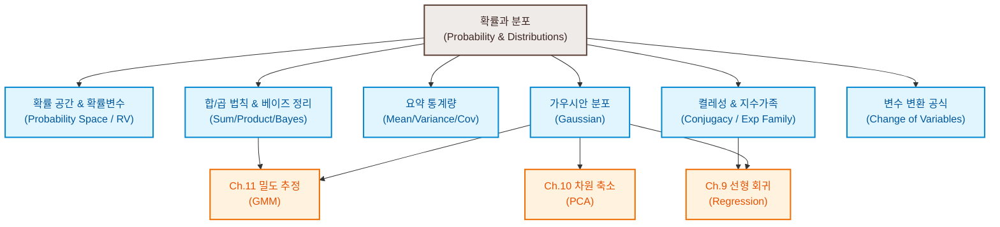

# 6. 확률과 분포 (Probability and Distributions)

머신러닝은 데이터 자체의 불확실성(Aleatoric uncertainty), 예측 모델 자체의 지식 한계로 인한 불확실성(Epistemic uncertainty), 그리고 모델이 생성하는 최종 예측의 확률적 오차를 정밀하게 다루어야 합니다. **확률론(Probability Theory)**은 이처럼 머신러닝의 전 과정에 내재된 불확실성을 정량화하고 일관된 규칙 하에 다룰 수 있게 해주는 핵심 수학적 뼈대입니다.

본 장에서는 확률의 대수적 기초 정의에서 출발하여 가우시안 분포의 수학적 보존성, 베이지안 켤레성, 충분 통계량과 지수 가족의 관계, 그리고 좌표 공간 변환 하에서의 확률 분포 변환 공식까지의 모든 수식적 유도와 직관을 상세히 다룹니다.

---

### [시각 자료] 확률 및 분포 개념 마인드맵 (Figure 6.1)

본 장에서 다루는 주요 개념과 이들이 머신러닝의 다른 장에서 어떻게 유기적으로 연결되는지 보여주는 도식입니다.

---

# 6.1 확률 공간의 구축 (Construction of a Probability Space)

확률론은 단순히 실험의 횟수를 헤아리는 것을 넘어, 고전적인 참/거짓 논리계를 연속적인 영역의 '그럴듯함(Plausibility)'으로 일반화하여 자동 추론을 수행하는 확장 논리 체계로 볼 수 있습니다 (Cox-Jaynes 정리).

### [정리] Cox-Jaynes 합리성 공리
인간이 상식에 부합하는 일관성 있는 추론 시스템을 만들고자 할 때, 그럴듯함의 정도를 나타내는 실수 값은 반드시 **확률의 대수적 규칙**을 만족해야 합니다. 이 일관성은 다음과 같은 세 가지 원칙을 따릅니다.
1. **비모순성(Consistency)**: 어떤 결과를 도출하는 경로가 다르더라도, 최종 추론 값은 항상 같아야 한다.
2. **솔직성(Honesty)**: 이용 가능한 모든 데이터가 추론에 빠짐없이 반영되어야 한다.
3. **재현성(Reproducibility)**: 두 문제에 대한 사전 지식 상태가 완벽히 같다면, 그들에 부여되는 타당성 등급 역시 같아야 한다.

### 확률에 대한 두 가지 관점
* **빈도주의자 관점 (Frequentist)**: 확률을 동일한 실험을 무한히 반복했을 때 특정 사건이 발생하는 극한의 '상대적 빈도(Relative Frequency)'로 정의합니다.
* **베이지안 관점 (Bayesian)**: 확률을 불확실한 사건에 대해 주체(모델 또는 관찰자)가 가지는 '믿음의 정도(Degree of Belief)' 혹은 '주관적 타당성'으로 정의합니다. 머신러닝의 다채로운 매개변수 최적화론은 이 베이지안 관점을 적극적으로 채택합니다.

---

## 6.1.1 Kolmogorov 확률 공간의 대수 구조

현대 확률론은 콜모고로프(Kolmogorov)가 정립한 세 가지 요소로 구성된 수학적 공간인 **확률 공간 $(\Omega, \mathcal{A}, P)$**을 기초로 동작합니다.

1. **표본 공간 $\Omega$ (Sample Space)**:
   임의의 무작위 실험을 가했을 때 발생할 수 있는 모든 가능한 개별 결과 $\omega$들의 총 집합입니다.
   * 예: 동전을 연속으로 두 번 던지는 실험의 표본 공간 $\Omega = \{hh, tt, ht, th\}$
2. **사건 공간 $\mathcal{A}$ (Event Space)**:
   실험 결과로서 우리가 관찰 및 판정하고자 하는 표본 공간의 부분집합(사건)들의 모음입니다. 이 사건 공간 $\mathcal{A}$는 집합의 합집합, 교집합, 여집합 연산에 대해 닫혀 있는 수학적 대수인 **$\sigma$-대수 ($\sigma$-algebra)**의 공리를 만족해야 합니다.
3. **확률 측도 $P$ (Probability Measure)**:
   각 사건 $A \in \mathcal{A}$에 대해 다음 세 가지 Kolmogorov 공리를 충족하며 $[0, 1]$ 사이의 실수를 대응시키는 함수입니다.
   * **공리 1 (비음성)**: 모든 $A \in \mathcal{A}$에 대해 $P(A) \ge 0$
   * **공리 2 (정규성)**: 전체 공간에 대한 확률은 1이다: $P(\Omega) = 1$
   * **공리 3 (가산 가법성)**: 서로소인 사건들 $A_1, A_2, \dots$에 대하여, 이들의 합집합 확률은 개별 확률의 합과 같다: $P(\bigcup_{i} A_i) = \sum_{i} P(A_i)$

---

## 6.1.2 확률 변수 (Random Variable)

현대 확률론 및 머신러닝에서는 추상적인 표본 공간 $\Omega$ 상에서 직접 확률을 다루는 대신, 표본의 결과를 현실적인 수치 공간이나 상태 공간인 **타겟 공간 $\mathcal{T}$**로 매핑하여 다룹니다.

### [정의] 확률 변수 (Random Variable)
확률 공간 $(\Omega, \mathcal{A}, P)$과 타겟 공간 $\mathcal{T}$에 대하여, 표본 공간의 원소 $\omega \in \Omega$를 타겟 공간의 상태 $x \in \mathcal{T}$로 매핑하는 함수 $X: \Omega \to \mathcal{T}$를 **확률 변수**라고 정의합니다.

> [!WARNING]
> '확률 변수(Random Variable)'라는 용어는 대단한 오해를 불러일으키는 이름입니다. 이 수학적 대상은 **변수(Variable)가 아니며 무작위(Random)도 아닙니다.** 그것은 표본의 상태를 다른 타겟 공간의 값으로 매핑하는 완벽하게 결정론적인 **함수(Function)**입니다.

### 역상(Pre-image)과 확률 분포(Law / Distribution)의 정의
확률 변수 $X$에 의해 변환된 타겟 공간의 특정 사건 집합 $S \subseteq \mathcal{T}$의 확률을 구할 때, $S$에 도달하는 표본들의 집합인 **역상(Pre-image) $X^{-1}(S)$**의 확률 측도를 통해 정의합니다.
$$P_X(S) = P(X \in S) := P(X^{-1}(S)) = P(\{\omega \in \Omega : X(\omega) \in S\}) \tag{6.8}$$
이때 타겟 공간의 모든 가능한 상태에 확률을 할당하는 이 확률 매핑 함수 $P_X$ (또는 합성 사상 $P \circ X^{-1}$)를 확률 변수 $X$의 **법칙(Law)** 또는 **확률 분포(Probability Distribution)**라고 정의합니다.

---

# 6.2 이산 및 연속 확률 변수 (Discrete and Continuous Probabilities)

확률 변수가 취하는 타겟 공간 $\mathcal{T}$의 위상학적 성질에 따라 이산 확률 변수와 연속 확률 변수로 나뉩니다.

## 6.2.1 이산 확률 변수와 이산 분포

타겟 공간 $\mathcal{T}$가 유한 집합이거나 셀 수 있는 무한 집합(Countably infinite)인 경우, $X$를 **이산 확률 변수**라고 합니다.

### 확률 질량 함수 (PMF: Probability Mass Function)
이산 확률 변수가 취하는 특정 지점 $x \in \mathcal{T}$에서의 단일점 확률을 나타내는 함수를 **확률 질량 함수**라고 정의하며, $P(X = x)$ 또는 $p(x)$로 표기합니다.
이산 확률 변수의 모든 가능한 단일 확률의 합은 1이 되어야 합니다.
$$\sum_{x \in \mathcal{T}} P(X = x) = 1 \tag{6.12}$$

### [예제 6.2] 이산 결합/주변/조건부 분포 테이블 연산 (Figure 6.2)
두 이산 확률 변수 $X$ (5개 상태 $\{x_1, \dots, x_5\}$)와 $Y$ (3개 상태 $\{y_1, \dots, y_3\}$)가 구성하는 결합 빈도 수 테이블이 주어졌을 때, 총 빈도 수 $N$에 대해 다음 공식들이 만족합니다.
* **결합 확률 (Joint Probability)**:
  $$P(X = x_i, Y = y_j) = \frac{n_{ij}}{N} \tag{6.9}$$
* **주변 확률 (Marginal Probability)**: 특정 변수의 상태를 제외하고 나머지 변수를 모두 더해내는 성분입니다.
  $$P(X = x_i) = \frac{c_i}{N} = \frac{\sum_{j=1}^{3} n_{ij}}{N} \tag{6.10}$$
  $$P(Y = y_j) = \frac{r_j}{N} = \frac{\sum_{i=1}^{5} n_{ij}}{N} \tag{6.11}$$
* **조건부 확률 (Conditional Probability)**: 특정 정보가 주어졌을 때 제한된 행이나 열에서의 상대적 확률 값입니다.
  $$P(Y = y_j \mid X = x_i) = \frac{P(X = x_i, Y = y_j)}{P(X = x_i)} = \frac{n_{ij}}{c_i} \tag{6.13}$$
  $$P(X = x_i \mid Y = y_j) = \frac{P(X = x_i, Y = y_j)}{P(Y = y_j)} = \frac{n_{ij}}{r_j} \tag{6.14}$$

---

## 6.2.2 연속 확률 변수와 연속 분포

타겟 공간 $\mathcal{T}$가 실수 전체선 $\mathbb{R}$이거나 다차원 유클리드 공간 $\mathbb{R}^D$와 같이 연속적인 구간인 경우, 이를 **연속 확률 변수**라고 합니다.

### [정의 6.1] 확률 밀도 함수 (PDF: Probability Density Function)
어떤 함수 $f: \mathbb{R}^D \to \mathbb{R}$가 다음 두 성질을 만족할 때, 이를 **확률 밀도 함수**라고 정의합니다.
1. 모든 $\mathbf{x} \in \mathbb{R}^D$에 대해, $f(\mathbf{x}) \ge 0$
2. 공간 전체에 대한 적분값이 1이다:
   $$\int_{\mathbb{R}^D} f(\mathbf{x}) d\mathbf{x} = 1 \tag{6.15}$$

연속 확률 변수 $X$가 특정 구간 $[a, b]$ 내에 존재할 확률은 이 밀도 함수 $f(x)$의 해당 구간 적분값으로 계산됩니다.
$$P(a \le X \le b) = \int_{a}^{b} f(x) dx \tag{6.16}$$

> [!WARNING]
> 연속 확률 변수의 경우, 특정 하나의 지점 $x$를 정확히 가질 확률은 항상 0입니다: **$P(X = x) = 0$**. 
> 기하학적으로 이는 적분 구간의 시점과 종점이 같은 상태($a=b$)이므로 선분의 넓이가 0이 되는 것과 같습니다. 따라서 연속 확률 변수에서 확률 밀도 함수값 $f(x)$ 자체는 확률 값이 아니며, 오직 적분을 거쳐야만 실제 확률이 도출됩니다.

### [정의 6.2] 누적 분포 함수 (CDF: Cumulative Distribution Function)
다변량 연속 확률 변수 $\mathbf{X} = [X_1, \dots, X_D]^{\top}$가 특정 값 벡터 $\mathbf{x} = [x_1, \dots, x_D]^{\top}$보다 작거나 같을 영역에 존재할 누적 확률을 나타내는 함수를 **누적 분포 함수**라고 정의합니다.
$$F_{\mathbf{X}}(\mathbf{x}) := P(X_1 \le x_1, \dots, X_D \le x_D) \tag{6.17}$$
CDF는 PDF의 음의 무한대부터의 다중 적분으로 표기되며, 반대로 CDF를 각 성분에 대해 편미분하면 PDF가 도출됩니다.
$$F_{\mathbf{X}}(\mathbf{x}) = \int_{-\infty}^{x_1} \cdots \int_{-\infty}^{x_D} f(z_1, \dots, z_D) dz_1 \cdots dz_D \tag{6.18}$$

---

## 6.2.3 이산 분포와 연속 분포의 비교 예시 (Example 6.3)

* **이산 균등 분포 (Discrete Uniform Distribution)**:
  유한개의 상태 $\{-1.1, 0.3, 1.5\}$를 가질 때, 각 지점의 단일 확률 $P(Z = z) = 1/3$으로 고정됩니다 (Figure 6.3(a) 참조). 모든 단일 지점 확률은 $1.0$을 넘을 수 없습니다.
* **연속 균등 분포 (Continuous Uniform Distribution)**:
  변수가 연속적인 닫힌 구간 $[0.9, 1.6]$ 내에 고르게 존재할 때, 구간의 폭은 $1.6 - 0.9 = 0.7$입니다. 전체 영역 적분값 1을 만족해야 하므로, 이 구간 내에서의 밀도 함수값은 $p(x) = \frac{1}{0.7} \approx 1.43$이 됩니다 (Figure 6.3(b) 참조).
  이와 같이 **연속 확률 분포의 밀도 함수값 $p(x)$는 얼마든지 1을 초과하여 매우 큰 값을 가질 수 있습니다.**

---

# 6.3 합의 법칙, 곱의 법칙, 베이즈 정리 (Sum & Product Rules, Bayes' Theorem)

확률 분포의 모든 복잡한 추론 연산은 단 두 가지의 근본적인 대수 법칙인 **합의 법칙**과 **곱의 법칙**만을 바탕으로 수행됩니다.

### 1. 합의 법칙 (Sum Rule / Marginalization)
결합 확률 분포 $p(x, y)$에서 관심 없는 변수 $y$를 모두 더하거나 적분해 내어 주변 분포 $p(x)$를 얻는 규칙입니다. 이를 **주변화(Marginalization)**라고 합니다.
$$p(x) = \begin{cases} \sum_{y \in \mathcal{Y}} p(x, y) & \text{if } y \text{ is discrete} \\ \int_{\mathcal{Y}} p(x, y) dy & \text{if } y \text{ is continuous} \end{cases} \tag{6.20}$$

> [!CAUTION]
> **확률론적 모델링의 주된 계산적 난제**
> 머신러닝 모델의 복잡도가 증가하고 변수의 차원이 수백 차원을 넘어가면, 합의 법칙 계산을 위한 적분 연산 $\int p(\mathbf{x}, \mathbf{y}) d\mathbf{y}$의 계산량이 지수적으로 급증하는 **차원의 저주**가 발생합니다. 이 고차원 적분은 다항 시간 내에 정확히 계산할 수 없으므로, 변이형 추론(Variational Inference)이나 MCMC 등의 근사 계산법이 필수적으로 동반됩니다.

### 2. 곱의 법칙 (Product Rule)
두 변수의 결합 분포를 조건부 분포와 주변 분포의 곱으로 쪼개어 나타내는 규칙입니다.
$$p(x, y) = p(y \mid x)p(x) = p(x \mid y)p(y) \tag{6.22}$$

---

## 6.3.1 베이즈 정리 (Bayes' Theorem)

곱의 법칙이 보장하는 결합 분포 표현식의 대칭성($p(x \mid y)p(y) = p(y \mid x)p(x)$)으로부터 베이지안 추론의 핵심인 **베이즈 정리**가 직접 도출됩니다.

$$p(x \mid y) = \frac{p(y \mid x)p(x)}{p(y)} \tag{6.23}$$

각 성분들은 머신러닝에서 다음과 같은 중요한 물리적 의미를 갖습니다.

* **사전 확률 (Prior) $p(x)$**:
  데이터 $y$를 관측하기 전에 우리가 숨겨진 매개변수나 라벨 $x$에 대해 가지고 있던 주관적 혹은 객관적 지식의 불확실성을 표현하는 분포입니다.
* **우도 (Likelihood) $p(y \mid x)$**:
  가상으로 매개변수 $x$가 고정되어 주어졌을 때, 우리가 관측한 데이터 $y$가 발생할 확률(혹은 그럴듯함)을 나타냅니다. 매개변수 $x$에 대한 함수로 취급할 때는 우도라고 부르며, 물리적 시스템의 측정 방식을 설계하는 **측정 모델 (Measurement Model)** 역할을 수행합니다.
* **사후 확률 (Posterior) $p(x \mid y)$**:
  데이터 $y$를 관측하여 반영한 이후, 갱신된 매개변수 $x$에 대한 최종 확률적 분포입니다.
* **증거 (Evidence / Marginal Likelihood) $p(y)$**:
  우도와 사전을 곱한 식을 매개변수 $x$ 전체에 대해 적분하여 소거해낸 주변 분포입니다.
  $$p(y) = \int_{\mathcal{X}} p(y \mid x) p(x) dx = \mathbb{E}_{X}[p(y \mid X)] \tag{6.27}$$
  이 값은 사후 확률이 확률 밀도 함수의 조건(적분합 1)을 만족하도록 만들어주는 정규화 상수 역할을 수행하며, 서로 다른 모델 간의 성능을 평가하는 **모델 선택 (Model Selection)** 분야에서도 결정적 척도로 작동합니다.

---

# 6.4 요약 통계량과 독립성 (Summary Statistics and Independence)

확률 분포 전체를 다 들고 다니는 대신, 분포의 평균적인 위치나 흩어진 정도를 숫자로 요약하는 통계량과 두 분포 간의 유기적 관계를 분석하는 개념들입니다.

## 6.4.1 기대값 (Expected Value)과 평균 (Mean)

기대값은 확률 분포 하에서 어떤 함수 $g(x)$가 가질 수 있는 값들의 확률 가중 평균치입니다.

### [정의 6.3] 기대값 (Expected Value)
연속 확률 변수 $X \sim p(x)$ 및 함수 $g: \mathbb{R} \to \mathbb{R}$에 대하여,
$$\mathbb{E}_X[g(x)] := \int_{\mathcal{X}} g(x)p(x) dx \tag{6.28}$$
이산 확률 변수의 경우에는 적분을 가산합으로 대체하여 정의합니다.
$$\mathbb{E}_X[g(x)] := \sum_{x \in \mathcal{X}} g(x)p(x) \tag{6.29}$$

### 기대값의 선형성 증명
기대값 연산자는 적분 및 시그마의 선형성에 의해 다음과 같이 **선형 연산자(Linear Operator)** 성질을 항상 가집니다.
$$\mathbb{E}_X[a g(x) + b h(x)] = a \mathbb{E}_X[g(x)] + b \mathbb{E}_X[h(x)] \tag{6.34d}$$

### [정의 6.4] 평균 (Mean)
기대값 공식에서 함수 $g(x)$를 항등 사상 $g(x) = x$로 지정했을 때 유도되는 기대값을 **평균**이라 정의합니다.
$$\mathbf{\mu} = \mathbb{E}_{\mathbf{X}}[\mathbf{x}] := \begin{bmatrix} \mathbb{E}_{X_1}[x_1] & \cdots & \mathbb{E}_{X_D}[x_D] \end{bmatrix}^{\top} \in \mathbb{R}^D \tag{6.31}$$

### 대표적인 평균의 다른 지표들과의 기하학적 비교 (Figure 6.4)
* **평균 (Mean)**: 분포 무게중심의 평균 위치입니다. 아웃라이어(이상치) 값에 매우 민감하게 출렁이는 경향이 있습니다.
* **중앙값 (Median)**: 크기순으로 정렬했을 때 상위 50%와 하위 50%를 가르는 지점입니다. 다차원 공간에서는 크기 정렬 순서($<$)를 고유하게 정의할 수 없기 때문에 다차원 일반화가 매우 어렵습니다.
* **최빈값 (Mode)**: 확률 밀도가 가장 높은 극대점(Peak)의 위치입니다. 봉우리가 여러 개인 다봉 분포(Bimodal/Multimodal)에서는 다수의 최빈값이 동시에 존재할 수 있어 탐색이 수치적으로 어렵습니다 (Figure 6.4 참조).

---

## 6.4.2 분산과 공분산 (Variance and Covariance)

변수가 평균으로부터 얼마나 멀리 떨어져서 분포하는지(퍼짐 정도)와 두 변수가 움직이는 선형적 방향의 상관성을 나타냅니다.

### [정의 6.5 & 6.6] 공분산 (Covariance)
두 연속 확률 변수 $X \in \mathbb{R}^D, Y \in \mathbb{R}^E$에 대하여, 이들이 각자의 평균으로부터 벌어진 편차들의 외적에 대한 기대값으로 정의됩니다.
$$\text{Cov}[\mathbf{x}, \mathbf{y}] := \mathbb{E}_{\mathbf{X}, \mathbf{Y}}[(\mathbf{x} - \mathbb{E}[\mathbf{x}])(\mathbf{y} - \mathbb{E}[\mathbf{y}])^{\top}] = \mathbb{E}[\mathbf{x}\mathbf{y}^{\top}] - \mathbb{E}[\mathbf{x}]\mathbb{E}[\mathbf{y}]^{\top} \in \mathbb{R}^{D \times E} \tag{6.37}$$

### [정의 6.7] 분산 (Variance)
동일한 다변량 변수끼리의 공분산 $\text{Cov}[\mathbf{x}, \mathbf{x}]$를 **분산(공분산 행렬)**이라 정의합니다.
$$\mathbf{\Sigma} = V_{\mathbf{X}}[\mathbf{x}] := \mathbb{E}_{\mathbf{X}}[(\mathbf{x} - \mathbf{\mu})(\mathbf{x} - \mathbf{\mu})^{\top}] = \mathbb{E}[\mathbf{x}\mathbf{x}^{\top}] - \mathbb{E}[\mathbf{x}]\mathbb{E}[\mathbf{x}]^{\top} \in \mathbb{R}^{D \times D} \tag{6.38b}$$

### 분산의 계산 공식 유도 (Raw-Score Formula)
분산의 정의식을 기대값 선형성을 활용해 전개하면 다음과 같은 등가식이 성립합니다.
$$V[x] = \mathbb{E}[(x - \mu)^2] = \mathbb{E}[x^2 - 2\mu x + \mu^2] = \mathbb{E}[x^2] - 2\mu\mathbb{E}[x] + \mu^2 = \mathbb{E}[x^2] - \mathbb{E}[x]^2 \tag{6.44}$$
이를 "제곱의 평균에서 평균의 제곱을 뺀 값"이라고 부릅니다. 이 식을 이용하면 데이터 전체를 한 번만 훑으면서(One-pass) 분산을 간편하게 계산할 수 있습니다. 단, 두 계산 항의 크기가 너무 크고 비슷한 경우에는 부동소수점 오차 감쇄 문제가 발생하므로 정밀한 구현 시 주의가 필요합니다.

### 분산과 쌍별 거리(Pairwise Distance)의 equivalence 증명
$N$개의 임의의 관측점 $x_1, \dots, x_N$에 대하여, 모든 쌍 간의 제곱 거리 평균을 내는 2중 합산 식은 다음과 같이 유도됩니다.
$$\frac{1}{N^2} \sum_{i=1}^{N}\sum_{j=1}^{N} (x_i - x_j)^2 = \frac{1}{N^2}\sum_{i}\sum_{j}(x_i^2 - 2x_i x_j + x_j^2) = \frac{1}{N^2}\left( N\sum_i x_i^2 - 2\sum_i x_i \sum_j x_j + N\sum_j x_j^2 \right)$$
$$\frac{1}{N^2} \sum_{i, j} (x_i - x_j)^2 = \frac{2}{N}\sum_i x_i^2 - 2\left(\frac{1}{N}\sum_i x_i\right)^2 = 2\left[ \frac{1}{N}\sum_{i=1}^{N} x_i^2 - \left(\frac{1}{N}\sum_{i=1}^{N} x_i\right)^2 \right] \tag{6.45}$$
즉, 모든 점들 사이의 거리의 총합은 중심(평균)으로부터 각 점들까지의 거리의 합의 정확히 2배와 같습니다.

---

## 6.4.3 아핀 변환 하에서의 통계량 변화 공식

임의의 다변량 변수 $\mathbf{X}$가 평균 $\mathbf{\mu}$, 공분산 $\mathbf{\Sigma}$를 따를 때, 결정론적 아핀 변환 사상 $\mathbf{Y} = A\mathbf{X} + \mathbf{b}$에 의해 정의되는 새로운 변수의 요약 통계량은 다음과 같습니다.
1. **평균의 변환**:
   $$\mathbb{E}[A\mathbf{x} + \mathbf{b}] = A\mathbb{E}[\mathbf{x}] + \mathbf{b} = A\mathbf{\mu} + \mathbf{b} \tag{6.50}$$
2. **분산의 변환**:
   $$V[A\mathbf{x} + \mathbf{b}] = V[A\mathbf{x}] = A V[\mathbf{x}] A^{\top} = A \mathbf{\Sigma} A^{\top} \tag{6.51}$$
3. **원본 변수와 변환 변수 간의 공분산**:
   $$\text{Cov}[\mathbf{x}, A\mathbf{x} + \mathbf{b}] = \text{Cov}[\mathbf{x}, A\mathbf{x}] = \mathbf{\Sigma} A^{\top} \tag{6.52d}$$

---

## 6.4.4 통계적 독립성 (Statistical Independence)

### [정의 6.10] 통계적 독립 (Statistical Independence)
두 확률 변수 $X$와 $Y$의 결합 분포가 각 주변 분포의 단순 곱으로 완전히 쪼개질 때, 두 변수를 **독립**이라고 정의합니다.
$$p(x, y) = p(x)p(y) \tag{6.53}$$
두 변수가 독립인 경우, 조건부 확률은 주변 확률과 완전히 같아지며($p(y \mid x) = p(y)$), 공분산은 0이 됩니다 ($\text{Cov}[x, y] = 0$).

> [!WARNING]
> **공분산이 0(무상관)이라고 해서 반드시 두 변수가 독립인 것은 아닙니다 (역은 불성립).**
> 공분산은 오직 두 변수 간의 **선형적인 의존성**만을 측정합니다. 만약 두 변수가 완벽한 비선형적 의존 관계(예: $Y = X^2$, 단 $\mathbb{E}[X] = 0, \mathbb{E}[X^3] = 0$)를 지닌다면, 둘의 공분산은 0이 계산되지만 독립은 아닙니다.
> $$\text{Cov}[X, X^2] = \mathbb{E}[X^3] - \mathbb{E}[X]\mathbb{E}[X^2] = 0 \tag{6.54}$$

### [정의 6.11] 조건부 독립 (Conditional Independence)
공통의 제3의 확률 변수 $Z$의 상태가 주어졌을 때, 두 변수 $X, Y$의 조건부 결합 분포가 쪼개지는 성질입니다. 이를 $X \perp\!\!\perp Y \mid Z$로 표기합니다.
$$p(x, y \mid z) = p(x \mid z)p(y \mid z) \tag{6.55}$$
동치 표현식으로 다음이 성립합니다.
$$p(x \mid y, z) = p(x \mid z) \tag{6.57}$$
즉, $z$라는 정보가 일단 완벽하게 확보되면, $y$를 추가로 아는 것은 $x$에 대한 새로운 정보를 제공하지 못합니다.

---

## 6.4.5 확률 변수의 기하학적 내적 공간 (Figure 6.6)

확률 변수들을 추상적인 벡터 공간 상의 기하학적 **벡터(Vectors)**로 간주할 수 있습니다.
평균이 0인 확률 변수 $X, Y$들의 공간에서 내적을 두 변수의 **공분산**으로 정의합니다.
$$\langle X, Y \rangle := \text{Cov}[X, Y] \tag{6.59}$$
이 정의 하에 기하학적 성질들이 다음과 같이 성립합니다.
* **벡터의 길이(Norm)**: 공분산의 제곱근인 **표준편차 $\sigma_X$**가 됩니다.
  $$\|X\| = \sqrt{\langle X, X \rangle} = \sqrt{V[X]} = \sigma_X \tag{6.60}$$
  표준편차(길이)가 길어질수록 변수의 불확실성이 큰 상태를 대변하며, 길이가 0이 되면 확실성(상수)에 도달합니다.
* **두 벡터 사이의 각도 $\theta$**:
  $$\cos\theta = \frac{\langle X, Y \rangle}{\|X\|\|Y\|} = \frac{\text{Cov}[X, Y]}{\sqrt{V[X]V[Y]}} \tag{6.61}$$
  이 수식은 통계학의 **상관계수 (Correlation coefficient)** 공식과 정확히 부합합니다. 즉, 상관계수가 1이라는 것은 두 벡터가 같은 방향을 향하는 것이고, 상관성이 없다는 것은 두 벡터가 완벽히 수직($\theta = 90^{\circ}$)을 이루는 직교 상태임을 기하학적으로 뜻합니다 (Figure 6.6 참조).

---

# 6.5 가우시안 분포 (Gaussian Distribution / Normal Distribution)

가우시안 분포는 자연계의 독립적인 무작위 오차가 누적되었을 때 중심극한정리(Central Limit Theorem)에 의해 최종적으로 도달하게 되는 물리적으로 가장 중요한 연속 확률 분포입니다.

### [정의] 다차원 가우시안 분포 (Multivariate Gaussian)
평균 벡터 $\mathbf{\mu} \in \mathbb{R}^D$와 대칭 양의 정치 공분산 행렬 $\mathbf{\Sigma} \in \mathbb{R}^{D \times D}$를 매개변수로 가지는 다차원 정규분포의 확률 밀도 함수는 다음과 같이 정의됩니다.
$$p(\mathbf{x} \mid \mathbf{\mu}, \mathbf{\Sigma}) = (2\pi)^{-\frac{D}{2}} |\mathbf{\Sigma}|^{-\frac{1}{2}} \exp\left( -\frac{1}{2} (\mathbf{x} - \mathbf{\mu})^{\top} \mathbf{\Sigma}^{-1} (\mathbf{x} - \mathbf{\mu}) \right) \tag{6.63}$$
이를 줄여서 $\mathbf{X} \sim \mathcal{N}(\mathbf{\mu}, \mathbf{\Sigma})$라고 표기합니다. 평균이 $\mathbf{0}$이고 공분산이 단위 행렬 $\mathbf{I}_D$인 특수한 정규분포를 **표준 정규분포**라고 합니다.

---

## 6.5.1 가우시안 분포의 주변화와 조건부 자기 보존성 (Figure 6.9)

다차원 가우시안 분포의 핵심적인 수학적 강점은 **주변화와 조건부 연산을 거친 결과 역시 항상 가우시안 분포의 성질을 보존한다는 점**입니다.
concatenated 형태로 결합 가우시안 분포를 구성합니다.
$$p(\mathbf{x}, \mathbf{y}) = \mathcal{N}\left( \begin{bmatrix} \mathbf{\mu}_x \\ \mathbf{\mu}_y \end{bmatrix}, \begin{bmatrix} \mathbf{\Sigma}_{xx} & \mathbf{\Sigma}_{xy} \\ \mathbf{\Sigma}_{yx} & \mathbf{\Sigma}_{yy} \end{bmatrix} \right) \tag{6.64}$$

### 1. 조건부 분포 (Conditional Distribution)
$\mathbf{y}$의 관측값 정보를 반영했을 때의 조건부 분포 $p(\mathbf{x} \mid \mathbf{y}) = \mathcal{N}(\mathbf{\mu}_{\mathbf{x}\mid\mathbf{y}}, \mathbf{\Sigma}_{\mathbf{x}\mid\mathbf{y}})$는 다음과 같이 유도됩니다.
$$\mathbf{\mu}_{\mathbf{x}\mid\mathbf{y}} = \mathbf{\mu}_x + \mathbf{\Sigma}_{xy}\mathbf{\Sigma}_{yy}^{-1}(\mathbf{y} - \mathbf{\mu}_y) \tag{6.66}$$
$$\mathbf{\Sigma}_{\mathbf{x}\mid\mathbf{y}} = \mathbf{\Sigma}_{xx} - \mathbf{\Sigma}_{xy}\mathbf{\Sigma}_{yy}^{-1}\mathbf{\Sigma}_{yx} \tag{6.67}$$
조건부 평균 식 (6.66)에서, 얻어진 실제 관측값 $\mathbf{y}$와 그의 평균 $\mathbf{\mu}_y$ 사이의 오차 편차에 공분산 정보($\mathbf{\Sigma}_{xy}\mathbf{\Sigma}_{yy}^{-1}$)를 곱하여 기존 평균 $\mathbf{\mu}_x$를 보정하는 칼만 필터의 핵심 갱신 아이디어가 도출됩니다.

### 2. 주변 분포 (Marginal Distribution)
$\mathbf{y}$ 성분을 소거한 주변 분포 $p(\mathbf{x}) = \int p(\mathbf{x}, \mathbf{y})d\mathbf{y}$는 가우시안의 성질에 의해 결합 공분산 행렬에서 단순히 해당하는 블록을 그대로 떼어내면 성립합니다.
$$p(\mathbf{x}) = \mathcal{N}(\mathbf{\mu}_x, \mathbf{\Sigma}_{xx}) \tag{6.68}$$

---

## 6.5.2 두 가우시안 밀도 함수의 곱 (Product of Gaussians)

Bayes 정리를 풀거나 센서 관측을 조합할 때 두 개의 독립적인 가우시안 분포 밀도 함수 $\mathcal{N}(\mathbf{x} \mid \mathbf{a}, A)$와 $\mathcal{N}(\mathbf{x} \mid \mathbf{b}, B)$의 곱을 계산해야 하는 상황이 많습니다. 이 두 곱은 새로운 정규분포 밀도에 특정 정규화 스케일링 상수 $c$가 곱해진 형태로 복원됩니다.
$$\mathcal{N}(\mathbf{x} \mid \mathbf{a}, A) \mathcal{N}(\mathbf{x} \mid \mathbf{b}, B) = c \mathcal{N}(\mathbf{x} \mid \mathbf{c}, C)$$
이때 결정되는 매개변수들은 다음과 같습니다.
$$C = (A^{-1} + B^{-1})^{-1} \tag{6.74}$$
$$\mathbf{c} = C(A^{-1}\mathbf{a} + B^{-1}\mathbf{b}) \tag{6.75}$$
$$c = (2\pi)^{-\frac{D}{2}} |A + B|^{-\frac{1}{2}} \exp\left( -\frac{1}{2}(\mathbf{a} - \mathbf{b})^{\top}(A + B)^{-1}(\mathbf{a} - \mathbf{b}) \right) \tag{6.76}$$
여기서 스케일링 상수 $c$ 자체도 $\mathbf{a}$와 $\mathbf{b}$ 사이의 가우시안 밀도 구조인 $\mathcal{N}(\mathbf{a} \mid \mathbf{b}, A + B)$ 형태로 컴팩트하게 기술될 수 있습니다.

---

## 6.5.3 가우시안 혼합 밀도 (GMM Mixture Density)의 통계량 (Theorem 6.12)

가우시안 변수 자체를 더하는 것($X+Y$)과 가우시안 분포 밀도 자체를 가중합하여 쌓는 것(GMM)은 수학적으로 완전히 다른 연산입니다.

### [정리] 가우시안 가중 혼합 밀도의 평균과 분산 유도
두 일변량 가우시안 분포 밀도를 α 비율로 혼합한 밀도 함수가 다음과 같을 때,
$$p(x) = \alpha p_1(x) + (1-\alpha)p_2(x) \tag{6.80}$$
1. **혼합 밀도의 평균**:
   $$\mathbb{E}[x] = \alpha\mu_1 + (1-\alpha)\mu_2 \tag{6.81}$$
2. **혼합 밀도의 분산**:
   $$V[x] = \left[ \alpha\sigma_1^2 + (1-\alpha)\sigma_2^2 \right] + \left[ \alpha\mu_1^2 + (1-\alpha)\mu_2^2 - (\alpha\mu_1 + (1-\alpha)\mu_2)^2 \right] \tag{6.82}$$

### [증명 유도]
* **평균**: 적분의 선형성에 의해 직접 도출됩니다.
  $$\mathbb{E}[x] = \int x [\alpha p_1(x) + (1-\alpha)p_2(x)] dx = \alpha\int x p_1(x)dx + (1-\alpha)\int x p_2(x)dx = \alpha\mu_1 + (1-\alpha)\mu_2 \tag{6.83}$$
* **분산**: 제곱의 기대치 $\mathbb{E}[x^2]$를 먼저 계산합니다.
  $$\mathbb{E}[x^2] = \alpha\int x^2 p_1(x)dx + (1-\alpha)\int x^2 p_2(x)dx = \alpha(\mu_1^2 + \sigma_1^2) + (1-\alpha)(\mu_2^2 + \sigma_2^2) \tag{6.84}$$
  Raw-Score 분산 공식 $V[x] = \mathbb{E}[x^2] - (\mathbb{E}[x])^2$에 대입하여 식을 결합합니다.
  $$V[x] = \alpha(\mu_1^2 + \sigma_1^2) + (1-\alpha)(\mu_2^2 + \sigma_2^2) - (\alpha\mu_1 + (1-\alpha)\mu_2)^2$$
  이를 차수별로 묶어 정리하면 식 (6.82)가 유도됩니다. 이 관계는 임의의 두 변수 간의 분산을 조건부 관점에서 전개하는 **전분산의 법칙(Law of Total Variance)**의 구체적인 구현체입니다.
  $$V[X] = \mathbb{E}_Y[V[X \mid Y]] + V_Y[\mathbb{E}[X \mid Y]]$

---

## 6.5.4 가우시안 선형 사상과 가우시안 샘플링

### 1. 선형 변환 하에서의 가우시안
$\mathbf{X} \sim \mathcal{N}(\mathbf{\mu}, \mathbf{\Sigma})$에 대해 행렬 $A$에 의한 사상 $\mathbf{Y} = A\mathbf{X}$를 수행하면 다음 분포가 유도됩니다.
$$\mathbf{Y} \sim \mathcal{N}(A\mathbf{\mu}, A\mathbf{\Sigma}A^{\top}) \tag{6.88}$$

### 2. 역 선형 전이 관계식 (Pseudo-Inverse 응용)
만약 역으로 가변적이지 않은 $M \ge N$ 차원 사상 $\mathbf{y} = A\mathbf{x}$를 거친 $\mathbf{y}$의 분포가 $\mathbf{y} \sim \mathcal{N}(A\mathbf{x}, \mathbf{\Sigma})$로 주어졌을 때, 원래 $\mathbf{x}$의 역분포는 의사역행렬 투영 방식을 적용하여 다음과 같이 유도됩니다.
$$\mathbf{x} = (A^{\top}A)^{-1}A^{\top}\mathbf{y} \tag{6.90}$$
$$p(\mathbf{x}) = \mathcal{N}\left( (A^{\top}A)^{-1}A^{\top}\mathbf{y}, \ (A^{\top}A)^{-1}A^{\top}\mathbf{\Sigma}A(A^{\top}A)^{-1} \right) \tag{6.91}$$

### 3. 다차원 가우시안 샘플링 메커니즘
컴퓨터 내부적으로 임의의 평균 $\mathbf{\mu}$와 공분산 $\mathbf{\Sigma}$를 가지는 임의의 다차원 정규분포 샘플을 모사하여 추출하고자 할 때, 다음 단계를 밟습니다.
* 독립적인 표준정규분포 난수 발생기(Box-Muller 변환 등)를 사용해 $\mathbf{z} \sim \mathcal{N}(\mathbf{0}, \mathbf{I})$를 생성합니다.
* 공분산 행렬의 숄레스키 분해 $\mathbf{\Sigma} = A A^{\top}$를 계산하여 삼각 행렬 인자 $A$를 구합니다.
* 최종 샘플 $\mathbf{x} = A\mathbf{z} + \mathbf{\mu}$를 조립하여 반환합니다.

---

# 6.6 켤레성 및 지수 가족 (Conjugacy and the Exponential Family)

특정 형태를 지닌 확률 분포의 묶음은 베이즈 추론을 수행할 때 매우 편리한 대수적 폐쇄성을 제공하는데, 이를 **지수 가족**이라 부릅니다.

### [정의 6.13] 켤레 사전분포 (Conjugate Prior)
사전 확률 분포 $p(\theta)$와 우도 함수 $p(y \mid \theta)$에 대하여, 계산된 사후 확률 분포 $p(\theta \mid y) \propto p(y \mid \theta)p(\theta)$가 **사전 분포와 동일한 유형의 확률 분포 계통에 포함될 때**, 이 사전 분포를 해당 우도에 대한 **켤레 사전분포**라고 정의합니다.

켤레 관계를 사용하면 어려운 다차원 분모 적분(Evidence)을 수행할 필요 없이, 사전 분포의 하이퍼파라미터 값만 간단한 덧셈 법칙으로 대수적 업데이트를 가하여 사후 분포의 파라미터를 완성할 수 있습니다.

---

## 6.6.1 대표적인 켤레 확률 분포 공식 유도

지수 가족을 구성하기에 앞서, 머신러닝의 베이지안 기초가 되는 대표적인 세 분포를 정의합니다.
* **베르누이 분포 (Bernoulli)**: 단일 바이너리 시도 $x \in \{0, 1\}$에 대한 분포입니다.
  $$p(x \mid \mu) = \mu^x (1-\mu)^{1-x} \tag{6.92}$$
* **이항 분포 (Binomial)**: 독립적인 베르누이 시도를 $N$번 반복했을 때 성공 횟수 $m$에 대한 분포입니다.
  $$p(m \mid N, \mu) = \binom{N}{m}\mu^m (1-\mu)^{N-m} \tag{6.95}$$
* **베타 분포 (Beta)**: 연속 변수 $\mu \in [0, 1]$ 상에 정의되어 하이퍼파라미터 $\alpha, \beta$로 모양을 조절하는 밀도 함수입니다.
  $$p(µ \mid \alpha, \beta) = \frac{\Gamma(\alpha + \beta)}{\Gamma(\alpha)\Gamma(\beta)} \mu^{\alpha-1}(1-\mu)^{\beta-1} \tag{6.98}$$

### [예제 6.11] 베타-이항 켤레성 (Beta-Binomial Conjugacy) 유도
이항 분포 우도 $p(x \mid N, \mu) \propto \mu^x(1-\mu)^{N-x}$와 베타 분포 사전분포 $p(\mu \mid \alpha, \beta) \propto \mu^{\alpha-1}(1-\mu)^{\beta-1}$가 곱해진 사후 분포 식을 전개합니다.
$$p(\mu \mid x, N, \alpha, \beta) \propto p(x \mid N, \mu)p(\mu \mid \alpha, \beta) \propto \left[ \mu^x (1-\mu)^{N-x} \right] \left[ \mu^{\alpha-1}(1-\mu)^{\beta-1} \right] \tag{6.104b}$$
지수 성분끼리 더하여 정리합니다.
$$p(\mu \mid x, N, \alpha, \beta) \propto \mu^{x+\alpha-1} (1-\mu)^{N-x+\beta-1} \tag{6.104c}$$
이 최종 결과식은 하이퍼파라미터가 $\alpha' = x + \alpha$, $\beta' = N - x + \beta$인 새로운 **Beta 분포**의 함수 형태와 완벽하게 일치합니다. 따라서 베타 사전분포는 이항 우도에 대한 공액 관계를 만족합니다.

---

## 6.6.2 충분 통계량 (Sufficient Statistics)

### [정리 6.14] 피셔-네이만 분해 정리 (Fisher-Neyman Factorization)
파라미터 $\theta$를 추정하는 데 필요한 데이터 $x$의 모든 핵심 유효 정보를 남김없이 보존하여 축약해낸 통계량 ϕ(x)를 **충분 통계량**이라 정의합니다. 
확률 밀도 함수 $p(x \mid \theta)$가 충분 통계량 $\phi(x)$를 가질 필요충분조건은 다음과 같이 $\theta$에 의존하지 않는 함수 $h(x)$와 $\theta$의 영향이 오직 $\phi(x)$를 통해서만 개입하는 함수 $g_{\theta}$의 곱으로 분해되는 것입니다.
$$p(x \mid \theta) = h(x) g_{\theta}(\phi(x)) \tag{6.106}$$

---

## 6.6.3 지수 가족 (Exponential Family)

지수 가족은 충분 통계량을 유한한 고정 차원으로 유지하면서 베이지안 켤레성을 제공하는 매우 광범위한 확률 분포 계통의 통일적 표현식입니다.

### [정의] 지수 가족
파라미터 $\mathbf{\theta} \in \mathbb{R}^D$에 대하여, 확률 분포 밀도가 다음과 같은 일반 구조식으로 표현될 때, 이를 **지수 가족**이라 정의합니다.
$$p(x \mid \mathbf{\theta}) = h(x) \exp\left( \mathbf{\theta}^{\top} \mathbf{\phi}(x) - A(\mathbf{\theta}) \right) \tag{6.107}$$
* **$\mathbf{\theta}$ (Natural Parameters)**: 분포의 변형을 지배하는 자연 파라미터 벡터입니다.
* **$\mathbf{\phi}(x)$ (Sufficient Statistics)**: 데이터로부터 요약해내는 충분 통계량 벡터입니다.
* **$A(\mathbf{\theta})$ (Log-partition Function)**: 밀도의 전체 적분합이 1이 되도록 맞추어주는 로그 분할 정규화 함수입니다.
  $$A(\mathbf{\theta}) = \log \int h(x) \exp(\mathbf{\theta}^{\top}\mathbf{\phi}(x)) dx$$

---

### [예제 6.14] 베르누이 분포의 지수 가족 폼 변환 및 시그모이드 유도
베르누이 분포 식 $p(x \mid \mu) = \mu^x(1-\mu)^{1-x} \ (x \in \{0, 1\})$를 지수 함수 내부로 밀어 넣습니다.
$$p(x \mid \mu) = \exp\left( \log \left[ \mu^x (1-\mu)^{1-x} \right] \right) = \exp\left( x \log\mu + (1-x)\log(1-\mu) \right) \tag{6.113b}$$
$x$에 대해 묶어서 전개합니다.
$$p(x \mid \mu) = \exp\left( x \log\left(\frac{\mu}{1-\mu}\right) + \log(1-\mu) \right) \tag{6.113d}$$
이 식을 지수 가족 표준 정의식 (6.107)과 매핑하여 대조합니다.
* $h(x) = 1$
* $\theta = \log\left(\frac{\mu}{1-\mu}\right)$ (오즈비의 로그값인 **로짓(Logit) 변환**)
* $\phi(x) = x$
* $A(\theta) = -\log(1-\mu) = \log(1 + \exp(\theta))$ (로그 파티션)

이때 자연 파라미터 $\theta$에 대한 원래 확률 모수 $\mu$의 역사상을 계산해 보면 다음과 같습니다.
$$\mu = \frac{1}{1 + \exp(-\theta)} \tag{6.118}$$
이 공식은 딥러닝과 로지스틱 회귀에서 양극단의 실수 값을 $(0, 1)$ 사이의 확률 범위로 스쿼싱하는 데 사용하는 핵심 활성화 함수인 **시그모이드(Sigmoid) 함수**와 정확하게 일치합니다.

---

### 지수 가족 정형 사전분포(Canonical Conjugate Prior)의 자동 빌드
어떤 분포가 지수 가족에 속한다면, 그의 공액 분포는 기하학적 켤레 성질에 의해 다음 구조식으로 항상 즉시 유도됩니다.
$$p(\mathbf{\theta} \mid \mathbf{\gamma}) = h_c(\mathbf{\theta}) \exp\left( \begin{bmatrix} \mathbf{\gamma}_1 \\ \gamma_2 \end{bmatrix}^{\top} \begin{bmatrix} \mathbf{\theta} \\ -A(\mathbf{\theta}) \end{bmatrix} - A_c(\mathbf{\gamma}) \right) \tag{6.120}$$
예제 6.15와 같이 베르누이의 정형 사전분포를 위 식에 맞춰 전개하면 사전 지식 없이도 베타 분포의 형상이 대수적으로 자동 도출됩니다.

---

# 6.7 변수 변환과 역변환 (Change of Variables/Inverse Transform)

원래의 확률 변수 $X$에 결정론적 변환 $Y = U(X)$를 가했을 때, 새로이 유도되는 확률 변수 $Y$의 확률 밀도 함수를 구하는 기법입니다.

## 6.7.1 분포 함수법 (Distribution Function Technique)

가장 기초적인 수학적 방법으로, $Y$의 누적 분포 함수(CDF)를 구한 뒤 이를 미분하여 최종 PDF를 얻는 방식입니다.

### [예제 6.16] $Y = X^2$의 PDF 유도
구간 $[0, 1]$ 상에서 밀도가 $f(x) = 3x^2$로 정의되는 연속 확률 변수 $X$에 대해 $Y = X^2$의 밀도를 구합니다.
1. **CDF 유도**:
   $$F_Y(y) = P(Y \le y) = P(X^2 \le y) = P(X \le \sqrt{y}) = F_X(\sqrt{y}) \tag{6.129}$$
   $$F_Y(y) = \int_{0}^{\sqrt{y}} 3t^2 dt = \left[ t^3 \right]_{0}^{\sqrt{y}} = y^{\frac{3}{2}} \tag{6.129g}$$
2. **미분을 통한 PDF 도출**:
   $$f(y) = \frac{d}{dy}F_Y(y) = \frac{3}{2}y^{\frac{1}{2}} \quad (0 \le y \le 1) \tag{6.131}$$

---

### [정리] 확률 적분 변환 (Probability Integral Transform)
strictly monotonic한 CDF $F_X(x)$를 가진 임의의 연속 확률 변수 $X$에 대하여, 이 CDF 함수 자체로 변환을 가한 새로운 확률 변수 $Y := F_X(X)$는 **구간 $[0, 1]$ 상의 연속 균등 분포 $\mathcal{U}[0, 1]$를 따릅니다.**
$$Y \sim \mathcal{U}[0, 1]$$
이 성질의 역함수 관계($X = F_X^{-1}(Y)$)를 이용하면, 컴퓨터에서 균등 분포 난수 하나만 잘 뽑아내도 원하는 모든 특이한 연속 확률 분포의 샘플을 역함수 매핑만으로 간편하게 모사해낼 수 있습니다 (역함수 샘플링).

---

## 6.7.2 다변수 변환 공식 (Change of Variables)

1변수 함수 하에서 변수 변환은 CDF의 연쇄 미분 과정에서 내부 기하학적 팽창율인 도함수의 절대값이 곱해지게 됩니다.
$$f_Y(y) = f_X(U^{-1}(y)) \left| \frac{d}{dy}U^{-1}(y) \right| \tag{6.143}$$

이를 다차원 공간 상의 다변량 연속 확률 변수로 확장하면 미분 항이 **야코비안 행렬**로 대체됩니다.

### [정리 6.16] 다변량 변수 변환 공식
다변량 연속 확률 변수 $\mathbf{X}$의 확률 밀도가 $f(\mathbf{x})$이고, 미분 가능하며 가역적인 다차원 사상 $\mathbf{Y} = U(\mathbf{X})$가 있을 때, 변환된 변수의 확률 밀도 함수 $f(\mathbf{y})$는 다음과 같이 정의됩니다.
$$f(\mathbf{y}) = f_{\mathbf{X}}(U^{-1}(\mathbf{y})) \cdot \left| \det\left( \frac{\partial U^{-1}(\mathbf{y})}{\partial \mathbf{y}} \right) \right| \tag{6.144}$$
여기서 $\det\left( \frac{\partial U^{-1}(\mathbf{y})}{\partial \mathbf{y}} \right)$는 역함수 사상에 대한 야코비안 행렬식이며, 공간의 국소적 부피 팽창 배율을 보정해주는 중요한 스케일 팩터입니다.

---

### [예제 6.17] 2차원 선형 변환 하에서의 가우시안 유도
표준 정규분포 $X \sim \mathcal{N}(\mathbf{0}, \mathbf{I})$의 밀도 함수가 다음과 같고,
$$f(\mathbf{x}) = \frac{1}{2\pi} \exp\left( -\frac{1}{2}\mathbf{x}^{\top}\mathbf{x} \right) \tag{6.145}$$
가역 행렬 $A$에 의한 선형 변환 $\mathbf{Y} = A\mathbf{X}$를 수행했을 때의 $\mathbf{Y}$의 밀도를 정리 6.16을 통해 유도합니다.

1. **역사상 계산**: $\mathbf{x} = A^{-1}\mathbf{y}$
2. **역사상의 PDF 주입**:
   $$f(A^{-1}\mathbf{y}) = \frac{1}{2\pi} \exp\left( -\frac{1}{2} (A^{-1}\mathbf{y})^{\top}(A^{-1}\mathbf{y}) \right) = \frac{1}{2\pi} \exp\left( -\frac{1}{2} \mathbf{y}^{\top} A^{-\top} A^{-1} \mathbf{y} \right) \tag{6.148}$$
3. **야코비안 행렬 및 행렬식 계산**:
   $$\frac{\partial (A^{-1}\mathbf{y})}{\partial \mathbf{y}} = A^{-1} \tag{6.149}$$
   $$\left| \det(A^{-1}) \right| = \frac{1}{|\det(A)|} \tag{6.150}$$
4. **최종 곱산**:
   $$f(\mathbf{y}) = \frac{1}{2\pi} \exp\left( -\frac{1}{2}\mathbf{y}^{\top}(A A^{\top})^{-1}\mathbf{y} \right) \frac{1}{|\det(A)|} \tag{6.151b}$$
이 결과는 공분산 행렬 $\mathbf{\Sigma} = A A^{\top}$이고 평균이 $\mathbf{0}$인 가우시안 분포 $\mathcal{N}(\mathbf{0}, A A^{\top})$의 정의와 완벽하게 일치합니다.

---

# 6.8 더 읽을거리 (Further Reading)

* **확률의 공리적 이해**: 콜모고로프의 공리적 확률론과 측도론의 엄밀한 구축은 Billingsley(1995) 또는 Jacod와 Protter(2004)에서 다루어집니다.
* **정보 기하학 (Information Geometry)**: 확률 분포들이 이루는 기하학적 다양체(Manifold) 상에서의 거리와 휘어짐을 다루는 학문으로, 쿨백-라이블러 발산(KLD) 등의 척도를 해석하는 기반을 제공합니다 (Amari, 2016).
* **확률 분포 계통**: 다양한 분포들의 연계 관계와 유도는 Leemis와 McQueston(2008)에서 시각적으로 확인해볼 수 있습니다.

---

# Related Concepts
* [MML Study Index](index.md)
* [ML Index](../index.md)

# Citations
* [Marc Peter Deisenroth, A. Aldo Faisal, Cheng Soon Ong, *Mathematics for Machine Learning* (Chapter 6)](../../../raw/notes/math_for_deeplearning/mml-book.pdf)
