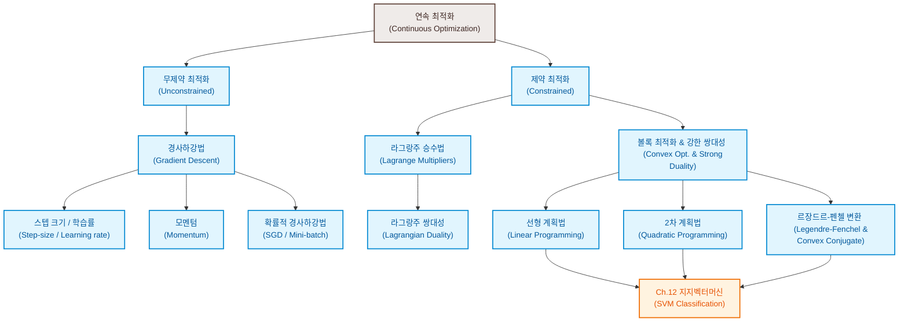

# 7. 연속 최적화 (Continuous Optimization)

머신러닝 알고리즘이 컴퓨터상에서 효율적으로 구현되기 위해서는, 수학적 문제 모델링이 수치적 최적화 방법론으로 정식화되어야 합니다. 머신러닝 모델을 훈련하는 과정은 목적 함수(Objective function)나 확률 모델이 규정하는 '좋은 매개변수(Good parameters)'의 집합을 찾아내는 문제로 귀착됩니다. 

우리가 다루는 데이터와 매개변수는 이산적인 집합이 아닌 실수 공간 $\mathbb{R}^D$ 상에 존재하므로, 이 장에서는 조합 최적화(Combinatorial optimization)와 대조되는 **연속 최적화(Continuous Optimization)**를 집중적으로 다룹니다. 본 장에서는 목적 함수가 미분 가능하여 최적화 과정에서 매 지점의 기울기(Gradient) 정보를 활용할 수 있다고 가정합니다. 또한 머신러닝의 표준 관례에 따라 목적 함수를 최소화(Minimization)하는 방향으로 수식을 전개합니다.

---

### [시각 자료] 연속 최적화 개념 구조도 (Figure 7.1)

본 장에서 학습하는 최적화 이론의 두 핵심 기둥인 무제약 최적화(경사하강법 계열)와 제약 최적화(볼록 최적화 및 쌍대성 계열)의 구조를 보여주는 마인드맵입니다.



---

# 7.1 경사하강법을 이용한 최적화 (Optimization Using Gradient Descent)

우선 매개변수 $\mathbf{x} \in \mathbb{R}^d$에 대해 아무런 제약 조건이 존재하지 않는 무제약 최적화 문제를 고려해 봅시다.

$$\min_{\mathbf{x}} f(\mathbf{x}) \tag{7.4}$$

여기서 $f: \mathbb{R}^d \to \mathbb{R}$은 목적 함수(Objective function)이며, 미분 가능하지만 대수적인 닫힌 형식(Closed-form)의 해를 해석적으로 구할 수 없다고 가정합니다.

**경사하강법(Gradient Descent)**은 1차(First-order) 최적화 알고리즘입니다. 함수의 특정 지점에서 그래디언트는 함수가 가장 가파르게 증가하는 방향(최대 상승 방향)을 가리킵니다. 따라서 함수의 국소 극소값(Local minimum)을 찾기 위해서는 현재 위치에서 그래디언트의 음의 방향(최대 하강 방향)으로 매개변수를 이동시켜야 합니다.

기하학적으로, 함수값이 일정한 점들을 이은 선인 **등고선(Contour lines)** $f(\mathbf{x}) = c$를 정의할 때, 특정 지점에서의 그래디언트 벡터는 해당 지점을 지나는 등고선에 항상 **직교(Orthogonal)**합니다.

다차원 공간에서의 경사하강법 알고리즘은 임의의 초기값 $\mathbf{x}_0$에서 출발하여 다음과 같이 반복적으로 매개변수를 갱신합니다.

$$\mathbf{x}_{i+1} = \mathbf{x}_i - \gamma_i (\nabla f(\mathbf{x}_i))^\top \tag{7.6}$$

여기서 $\gamma_i \ge 0$는 **스텝 크기(Step-size)** 또는 **학습률(Learning rate)**입니다. 본 교재의 관례에 따라 그래디언트 $\nabla f(\mathbf{x}_i)$는 행 벡터(Row vector)로 정의되므로, 열 벡터인 매개변수 $\mathbf{x}_i$와의 차원을 맞춰주기 위해 전치(Transpose)인 $(\nabla f(\mathbf{x}_i))^\top$를 빼줍니다. 적절한 스텝 크기 $\gamma_i$ 하에서, 갱신된 지점들의 함수값 수열 $f(\mathbf{x}_0) \ge f(\mathbf{x}_1) \ge f(\mathbf{x}_2) \ge \dots$은 국소 극소값으로 수렴하게 됩니다.

---

### [예제 7.1] 2차원 이차 형식 함수의 경사하강법 갱신 과정

다음과 같이 정의된 2차원 이차 형식(Quadratic form) 함수를 최소화하는 문제를 생각해 봅시다.

$$f(\mathbf{x}) = \frac{1}{2} \mathbf{x}^\top A \mathbf{x} - \mathbf{b}^\top \mathbf{x} = \frac{1}{2} \begin{bmatrix} x_1 \\ x_2 \end{bmatrix}^\top \begin{bmatrix} 2 & 1 \\ 1 & 20 \end{bmatrix} \begin{bmatrix} x_1 \\ x_2 \end{bmatrix} - \begin{bmatrix} 5 \\ 3 \end{bmatrix}^\top \begin{bmatrix} x_1 \\ x_2 \end{bmatrix} \tag{7.7}$$

이 함수의 그래디언트 행 벡터를 계산하면 다음과 같습니다.

$$\nabla f(\mathbf{x}) = \mathbf{x}^\top A - \mathbf{b}^\top = \begin{bmatrix} x_1 \\ x_2 \end{bmatrix}^\top \begin{bmatrix} 2 & 1 \\ 1 & 20 \end{bmatrix} - \begin{bmatrix} 5 \\ 3 \end{bmatrix}^\top \tag{7.8}$$

초기 위치가 $\mathbf{x}_0 = [-3, -1]^\top$이고, 고정된 스텝 크기가 $\gamma = 0.085$일 때 갱신 단계를 구체적으로 전개해 봅시다.

1. **초기 지점에서의 그래디언트 계산**:
   $$\nabla f(\mathbf{x}_0) = \begin{bmatrix} -3 & -1 \end{bmatrix} \begin{bmatrix} 2 & 1 \\ 1 & 20 \end{bmatrix} - \begin{bmatrix} 5 & 3 \end{bmatrix} = \begin{bmatrix} -7 & -23 \end{bmatrix} - \begin{bmatrix} 5 & 3 \end{bmatrix} = \begin{bmatrix} -12 & -26 \end{bmatrix}$$
   음의 그래디언트 방향(최대 하강 방향)은 $[12, 26]^\top$으로 동북쪽을 향합니다.

2. **첫 번째 갱신 ($\mathbf{x}_1$)**:
   $$\mathbf{x}_1 = \mathbf{x}_0 - \gamma (\nabla f(\mathbf{x}_0))^\top = \begin{bmatrix} -3 \\ -1 \end{bmatrix} - 0.085 \begin{bmatrix} -12 \\ -26 \end{bmatrix} = \begin{bmatrix} -3 + 1.02 \\ -1 + 2.21 \end{bmatrix} = \begin{bmatrix} -1.98 \\ 1.21 \end{bmatrix}$$

3. **두 번째 지점에서의 그래디언트 계산**:
   $$\nabla f(\mathbf{x}_1) = \begin{bmatrix} -1.98 & 1.21 \end{bmatrix} \begin{bmatrix} 2 & 1 \\ 1 & 20 \end{bmatrix} - \begin{bmatrix} 5 & 3 \end{bmatrix} = \begin{bmatrix} -2.75 & 22.22 \end{bmatrix} - \begin{bmatrix} 5 & 3 \end{bmatrix} = \begin{bmatrix} -7.75 & 19.22 \end{bmatrix}$$

4. **두 번째 갱신 ($\mathbf{x}_2$)**:
   $$\mathbf{x}_2 = \mathbf{x}_1 - \gamma (\nabla f(\mathbf{x}_1))^\top = \begin{bmatrix} -1.98 \\ 1.21 \end{bmatrix} - 0.085 \begin{bmatrix} -7.75 \\ 19.22 \end{bmatrix} = \begin{bmatrix} -1.98 + 0.65875 \\ 1.21 - 1.6337 \end{bmatrix} \approx \begin{bmatrix} -1.32 \\ -0.42 \end{bmatrix}$$

이 과정을 반복하면 매개변수 벡터는 최종적으로 대수적 최소값인 $A^{-1}\mathbf{b} = \begin{bmatrix} 2 & 1 \\ 1 & 20 \end{bmatrix}^{-1} \begin{bmatrix} 5 \\ 3 \end{bmatrix} \approx \begin{bmatrix} 2.487 \\ 0.026 \end{bmatrix}$을 향해 수렴합니다.

> [!NOTE]
> **병태 상태(Poorly Conditioned)와 지그재그 현상**
> 경사하강법은 극소값 근처에서 수렴이 매우 느려지는 점근적 특성을 보입니다. 특히 최적화 곡면이 좁고 긴 골짜기 형태를 띨 때(즉, 한 축 방향으로는 곡률이 매우 크고 다른 축 방향으로는 매우 평탄한 비대칭적 형태일 때)를 **병태(Poorly conditioned) 문제**라고 합니다. 이 경우 음의 그래디언트 벡터가 최적점을 곧바로 향하지 못하고, 골짜기 벽면 사이를 격렬하게 진동하며 나아가는 **지그재그(Zigzag) 현상**이 발생합니다 (Figure 7.3 참조).

---

### [시각 자료] 병태 공간에서의 지그재그 경사하강 기하 (Figure 7.3)

아래 도식은 곡률이 매우 비대칭적인 등고선(타원형) 상에서 경사하강법이 겪는 지그재그 진동 현상을 보여줍니다. 그래디언트 벡터는 항상 등고선에 수직이므로 벽면을 치는 방향으로 진행하게 됩니다.

```
       x2 Axis
         ^
         |      (Wall of the Valley)
         |     .------------------------.
         |    /   .----------------.     \
         |   /   /   .----------.   \     \
         |  |   |   |   (Opt)    |   |     |
         |  |   |   |     *      |   |     |
         |  |   |    `----------'    |     |
         |   \   \     ^            /     /
         |    \   `----|-----------'     /
         |     `-------|----------------'
         |            / \ 
         |           /   \  (Zigzag Updates)
         |          /     \
         |       x_0 ------> x_1
         +-----------------------------------> x_1 Axis
```

---

## 7.1.1 스텝 크기 (Step-size)

경사하강법의 성능을 결정하는 가장 핵심적인 하이퍼파라미터는 스텝 크기 $\gamma$입니다.
* **너무 작은 스텝 크기**: 매개변수 갱신이 지나치게 미미하여 수렴 속도가 매우 느려집니다.
* **너무 큰 스텝 크기**: 최적값을 지나쳐 버리는 오버슈트(Overshoot)가 발생하거나, 아예 수렴하지 못하고 발산(Divergence)할 위험이 있습니다.

수치 최적화에서는 매 반복 단계마다 함수의 국소적 곡률에 기반하여 스텝 크기를 동적으로 재조정하는 **적응적 스텝 크기 방법(Adaptive step-size methods)**을 사용합니다. 대표적인 두 가지 직관적 휴리스틱은 다음과 같습니다 (Toussaint, 2012).

1. **하강 실패 시 축소**: 그래디언트 단계를 진행한 후 계산된 목적 함수값 $f(\mathbf{x}_{i+1})$이 이전 값 $f(\mathbf{x}_i)$보다 커졌다면, 스텝 크기가 지나치게 컸음을 의미합니다. 이때는 방금 수행한 갱신 단계를 **취소(Undo)**하고 스텝 크기 $\gamma_i$를 감소시킨 뒤 다시 시도합니다.
2. **하강 성공 시 확대**: 갱신 후 함수값 $f(\mathbf{x}_{i+1}) < f(\mathbf{x}_i)$로 순조롭게 감소했다면, 다음 단계에서는 더 과감한 보폭을 가져갈 수 있습니다. 따라서 스텝 크기 $\gamma_i$를 일정 비율 증가시킵니다.

이러한 취소(Undo) 메커니즘은 매 단계 추가적인 함수값 평가 연산을 요구하지만, 수학적으로 **단조 수렴(Monotonic convergence)**을 보장하는 매우 강력한 안정 장치입니다.

---

### [예제 7.2] 선형 연립방정식 $A\mathbf{x} = \mathbf{b}$의 최소제곱 문제 변환

컴퓨터 프로그래밍 상에서 연립방정식 $A\mathbf{x} = \mathbf{b}$을 직접 풀 때, 역행렬 계산의 오차를 줄이기 위해 유클리드 노름을 최소화하는 최소제곱 오차(Squared error) 문제로 우회하여 풉니다.

$$\min_{\mathbf{x}} \|A\mathbf{x} - \mathbf{b}\|^2 = (A\mathbf{x} - \mathbf{b})^\top(A\mathbf{x} - \mathbf{b}) \tag{7.9}$$

이 목적 함수에 대해 매개변수 벡터 $\mathbf{x}$로 편미분을 가하여 그래디언트 행 벡터를 도출해 봅시다.
행렬 미분 공식 $\frac{\partial}{\partial \mathbf{x}} (\mathbf{x}^\top C \mathbf{x}) = 2\mathbf{x}^\top C$ 및 $\frac{\partial}{\partial \mathbf{x}} (\mathbf{d}^\top \mathbf{x}) = \mathbf{d}^\top$를 적용하기 위해 수식을 전개합니다.

$$\|A\mathbf{x} - \mathbf{b}\|^2 = \mathbf{x}^\top A^\top A \mathbf{x} - 2\mathbf{b}^\top A \mathbf{x} + \mathbf{b}^\top \mathbf{b}$$

따라서 그래디언트는 다음과 같습니다.

$$\nabla_{\mathbf{x}} (\|A\mathbf{x} - \mathbf{b}\|^2) = 2\mathbf{x}^\top A^\top A - 2\mathbf{b}^\top A = 2(A\mathbf{x} - \mathbf{b})^\top A \tag{7.10}$$

이 그래디언트 식을 경사하강법 갱신 식에 대입하여 반복적으로 최적 해를 수렴시킬 수 있습니다.

> [!TIP]
> **조건수(Condition Number)와 사전조건화(Preconditioning)**
> 선형 시스템의 최적화 수렴 속도는 행렬 $A$의 **조건수(Condition number) $\kappa$**에 직접적으로 좌우됩니다.
> $$\kappa = \frac{\sigma(A)_{\max}}{\sigma(A)_{\min}} \ge 1$$
> 여기서 $\sigma(A)_{\max}$와 $\sigma(A)_{\min}$은 각각 행렬 $A$의 최대 및 최소 특이값(Singular value)입니다. 조건수는 곡면의 '가장 가파른 방향의 곡률'과 '가장 평탄한 방향의 곡률'의 비율을 나타냅니다. 이 문제를 대수적으로 완화하기 위해 본래 식 대신 적절한 정칙 행렬 $P^{-1}$을 곱한 사전조건화 방정식 $P^{-1}(A\mathbf{x} - \mathbf{b}) = 0$을 구성합니다. 이때 $P$를 **사전조건자(Preconditioner)**라고 하며, $P^{-1}A$의 조건수가 최대한 1에 가깝도록 설계하여 경사하강법의 수렴 경로를 골짜기가 아닌 원형 그릇 모양에 가깝게 대수적으로 선형 변환합니다.

---

## 7.1.2 모멘텀을 적용한 경사하강법 (Gradient Descent With Momentum)

병태 공간에서 발생하는 격렬한 지그재그 진동을 제어하고 수렴 경로를 부드럽게 만들기 위해, 물리학의 관성 개념을 갱신 식에 결합한 방법이 **모멘텀 경사하강법**입니다. 이 방법은 과거에 이동했던 방향과 크기를 일종의 '기억(Memory)' 장치로 저장해 둡니다.

모멘텀 알고리즘은 이전 단계의 매개변수 변화량 $\Delta \mathbf{x}_i$를 축적하여 현재 단계의 그래디언트와 선형 결합합니다.

$$\mathbf{x}_{i+1} = \mathbf{x}_i - \gamma_i (\nabla f(\mathbf{x}_i))^\top + \alpha \Delta \mathbf{x}_i \tag{7.11}$$

$$\Delta \mathbf{x}_i = \mathbf{x}_i - \mathbf{x}_{i-1} = \alpha \Delta \mathbf{x}_{i-1} - \gamma_{i-1} (\nabla f(\mathbf{x}_{i-1}))^\top \tag{7.12}$$

여기서 하이퍼파라미터 $\alpha \in [0, 1]$은 직전 관성을 얼마나 유지할지 결정하는 감쇠 매개변수입니다. 대수적으로 볼 때, 모멘텀 항은 과거 그래디언트들의 지수 이동 평균(Exponential Moving Average)을 계산하는 효과를 냅니다. 이 관성 덕분에 지그재그 진동이 서로 상쇄되어 감쇠되고, 경사가 완만한 평탄한 방향으로의 전진 속도는 가속됩니다. 또한, 실제 그래디언트 정보에 노이즈가 강하게 섞여 있을 때 노이즈를 평균화하여 걸러내는 훌륭한 필터 역할을 수행합니다.

---

## 7.1.3 확률적 경사하강법 (Stochastic Gradient Descent, SGD)

현대 대규모 머신러닝 문제에서는 전체 데이터의 개수 $N$이 수만에서 수십억 개에 달합니다. 매개변수 $\boldsymbol{\theta}$에 대한 전체 손실 함수 $L(\boldsymbol{\theta})$는 개별 데이터 포인트 $n$이 유발하는 손실 $L_n(\boldsymbol{\theta})$들의 합으로 정의됩니다.

$$L(\boldsymbol{\theta}) = \sum_{n=1}^N L_n(\boldsymbol{\theta}) \tag{7.13}$$

배치(Batch) 경사하강법을 적용하기 위해서는 매 반복마다 전체 손실 함수의 그래디언트 합을 매번 새로 평가해야 합니다.

$$\boldsymbol{\theta}_{i+1} = \boldsymbol{\theta}_i - \gamma_i (\nabla L(\boldsymbol{\theta}_i))^\top = \boldsymbol{\theta}_i - \gamma_i \sum_{n=1}^N (\nabla L_n(\boldsymbol{\theta}_i))^\top \tag{7.15}$$

이 연산은 데이터 크기 $N$에 비례하여 계산 비용이 선형적으로 증가($\mathcal{O}(N)$)하므로 대규모 데이터셋에서는 사실상 갱신이 불가능합니다.

**확률적 경사하강법(Stochastic Gradient Descent, SGD)**은 전체 합 대신 무작위로 추출한 소수의 데이터 샘플(Mini-batch) 혹은 단 하나의 데이터 포인트 $L_n(\boldsymbol{\theta})$에 대한 그래디언트만을 활용하여 전체 그래디언트 합을 근사(Approximation)합니다.

이 근사법이 이론적으로 유효한 이유는 대수적 기댓값의 정의에 있습니다. 전체 그래디언트 합 $\sum_{n=1}^N \nabla L_n(\boldsymbol{\theta}_i)$은 데이터 전체 공간 하에서 그래디언트 기댓값의 경험적 추정치(Empirical estimate)입니다. 따라서 무작위 복원 추출한 미니배치 데이터 샘플에 기초한 그래디언트 추정량 $\mathbf{g}_i(\boldsymbol{\theta})$ 역시 참 그래디언트의 **편향되지 않은 추정량(Unbiased estimator)**이 됩니다.

$$\mathbb{E}[\mathbf{g}_i(\boldsymbol{\theta})] = \nabla L(\boldsymbol{\theta})$$

수학적으로 그래디언트 추정량에 편향이 없기 때문에, 비록 매 단계 노이즈(분산)가 크게 발생할지라도 학습률 $\gamma_i$가 적절한 속도로 감쇠한다는 조건(Robbins-Monro 조건: $\sum \gamma_i = \infty$, $\sum \gamma_i^2 < \infty$) 하에, 거의 확실히(Almost surely) 국소 극소값으로 수렴함이 보장됩니다.

### 미니배치(Mini-batch) 크기에 따른 수학적 트레이드오프

* **대규모 미니배치 (Large Mini-batch)**:
  * 장점: 경험적 기댓값의 분산이 대수적으로 감소하여 매개변수 업데이트 경로가 매우 안정적이고 수렴이 일정하게 유지됩니다. 최적화된 행렬 연산 라이브러리와 병렬 GPU 가속 연산을 100% 활용할 수 있습니다.
  * 단점: 1회 갱신을 위한 계산 및 메모리 비용이 증가합니다.
* **소규모 미니배치 / 단일 샘플 (Small Mini-batch / SGD)**:
  * 장점: 매 업데이트 연산 속도가 압도적으로 빠릅니다. 그래디언트 추정량에 내재된 확률적 노이즈(Variance) 덕분에, 배치 경사하강법이라면 꼼짝없이 갇혔을 얕은 국소 극소점(Local minima)이나 안장점(Saddle point)을 뚫고 탈출하는 부차적 효과를 누릴 수 있습니다.
  * 단점: 수렴 경로가 매우 불규칙하게 요동칩니다.

머신러닝 최적화의 궁극적 지향점은 훈련 데이터 손실 최소화를 넘어 새로운 데이터에 대한 **일반화 성능(Generalization performance)**의 극대화입니다. 정밀한 전역 극소값 탐색보다 일반화가 중요하므로, 적절한 노이즈를 동반한 SGD 및 미니배치 최적화 기법이 딥러닝을 비롯한 대규모 기계학습의 표준 최적화 도구로 자리잡았습니다.

---

# 7.2 제약 최적화와 라그랑주 승수법 (Constrained Optimization and Lagrange Multipliers)

실제 최적화 문제에서는 매개변수가 특정 물리적 한계나 자원 제약을 만족해야 하는 상황이 빈번합니다. $m$개의 부등식 제약 조건 $g_i(\mathbf{x}) \le 0$가 주어지는 제약 최적화 문제를 정식화해 봅시다.

$$\begin{aligned} \min_{\mathbf{x}} & \quad f(\mathbf{x}) \\ \text{subject to} & \quad g_i(\mathbf{x}) \le 0 \quad \text{for all } i = 1, \dots, m \end{aligned} \tag{7.17}$$

여기서 $f, g_i: \mathbb{R}^d \to \mathbb{R}$은 일반적인 미분 가능 함수입니다. 이 제약 최적화 영역을 기하학적으로 도식화하면 아래와 같습니다.

---

### [시각 자료] 제약 최적화의 기하학적 메커니즘 (Figure 7.4)

무제약 상태에서의 전역 최적점(Circle)이 제약 조건이 정의하는 **가능 영역(Feasible region)** 밖에 위치할 때, 실제 제약 최적점(Star)은 제약 경계면 상에 안착하게 됩니다.

```
       x2 Axis
         ^
         |
         |         /  (Constraint Boundary: g(x) = 0)
         |        /     Feasible Region [ g(x) <= 0 ]
         |       /      .------------------------.
         |      /      /                          \
         |     /      /   (Contour of f)           \
         |    /      |      .-------.               |
         |   /       |     /         \              |
         |  /        |    /    *      \             |
         | /         |   |  (Primal    |            |   (Unconstrained
         |/           \  |   Optimal)  |            /     Minima)
         |             \  \           /            /         o
         |              \  `---------'            /
         |               `-----------------------'
         +----------------------------------------------------> x1 Axis
```

---

제약 문제를 해결하는 가장 투박한 대수적 변환 방식은 제약을 만족하지 않는 영역에 무한대의 페널티를 부과하는 **지시 함수(Indicator function)** $\mathbf{I}(z)$를 더해 무제약 목적 함수 $J(\mathbf{x})$를 구성하는 것입니다.

$$J(\mathbf{x}) = f(\mathbf{x}) + \sum_{i=1}^m \mathbf{I}(g_i(\mathbf{x})) \tag{7.18}$$

$$\mathbf{I}(z) = \begin{cases} 0 & \text{if } z \le 0 \\ \infty & \text{otherwise} \end{cases} \tag{7.19}$$

수학적으로 $J(\mathbf{x})$를 최소화하는 해는 원래 제약 조건 식 (7.17)의 최적 해와 완벽히 동치입니다. 하지만 지시 함수 $\mathbf{I}(z)$는 제약 경계선 $z=0$에서 비연속적이고 미분 불가능(즉, 페널티가 $0$에서 $\infty$로 도약)하므로, 수치적 경사하강법을 적용하기에 불가능한 형태입니다.

이 불연속적인 단차 함수를 매끄럽고 최적화 가능한 형태로 완화(Relaxation)하기 위해 **라그랑주 승수(Lagrange Multipliers)** $\lambda_i \ge 0$를 도입합니다. 불연속 페널티 단차 함수를 라그랑주 승수와의 선형 결합으로 대체하여 다변수 함수인 **라그랑지안(Lagrangian)**을 정의합니다.

$$L(\mathbf{x}, \boldsymbol{\lambda}) = f(\mathbf{x}) + \sum_{i=1}^m \lambda_i g_i(\mathbf{x}) = f(\mathbf{x}) + \boldsymbol{\lambda}^\top \mathbf{g}(\mathbf{x}) \tag{7.20}$$

여기서 $\mathbf{g}(\mathbf{x}) = [g_1(\mathbf{x}), \dots, g_m(\mathbf{x})]^\top \in \mathbb{R}^m$은 제약 함수들을 쌓아 만든 벡터이며, $\boldsymbol{\lambda} = [\lambda_1, \dots, \lambda_m]^\top \in \mathbb{R}^m$은 라그랑주 승수 벡터입니다.

---

## 7.2.1 라그랑주 쌍대성 (Lagrangian Duality)

최적화 이론에서 **쌍대성(Duality)**이란 본래의 매개변수 공간 $\mathbf{x}$에서 정의된 복잡한 최적화 문제를 새로운 승수 공간 $\boldsymbol{\lambda}$ 상에서의 변형된 최적화 문제로 1대1 매핑하여 변환해내는 대수적 메커니즘을 의미합니다. 원래의 최적화 변수 $\mathbf{x}$를 **원 변수(Primal variables)**, 변환된 변수 $\boldsymbol{\lambda}$를 **쌍대 변수(Dual variables)**라고 부릅니다.

### [정의 7.1] 원 문제와 쌍대 문제
* **원 문제 (Primal Problem)**:
  $$\min_{\mathbf{x}} f(\mathbf{x}) \quad \text{subject to } g_i(\mathbf{x}) \le 0 \quad \text{for all } i = 1, \dots, m \tag{7.21}$$
* **라그랑주 쌍대 문제 (Lagrangian Dual Problem)**:
  $$\max_{\boldsymbol{\lambda} \in \mathbb{R}^m} D(\boldsymbol{\lambda}) \quad \text{subject to } \boldsymbol{\lambda} \ge \mathbf{0} \tag{7.22}$$
  여기서 쌍대 목적 함수 $D(\boldsymbol{\lambda})$는 다음과 같이 원 변수에 대해 라그랑지안을 최소화하여 원 변수를 소거한 함수입니다.
  $$D(\boldsymbol{\lambda}) = \min_{\mathbf{x} \in \mathbb{R}^d} L(\mathbf{x}, \boldsymbol{\lambda})$$

이 원-쌍대 관계를 수학적으로 명확하게 파악하기 위해서는 최적화 이론의 두 가지 핵심적인 개념적 도구를 정립해야 합니다.

### 1. 미니맥스 부등식 (Minimax Inequality)
임의의 두 매개변수를 가지는 이변수 함수 $\phi(\mathbf{x}, \mathbf{y})$에 대하여, '최대값들의 최소값(미니맥스)'은 항상 '최소값들의 최대값(맥시민)'보다 크거나 같습니다.

$$\max_{\mathbf{y}} \min_{\mathbf{x}} \phi(\mathbf{x}, \mathbf{y}) \le \min_{\mathbf{x}} \max_{\mathbf{y}} \phi(\mathbf{x}, \mathbf{y}) \tag{7.23}$$

* **대수적 증명**:
  모든 임의의 $\mathbf{x}$와 $\mathbf{y}$의 좌표쌍에 대하여, 특정 변수를 먼저 최소화/최대화한 값들 사이에 다음 부등식이 당연히 성립합니다.
  $$\min_{\mathbf{x}'} \phi(\mathbf{x}', \mathbf{y}) \le \phi(\mathbf{x}, \mathbf{y}) \le \max_{\mathbf{y}'} \phi(\mathbf{x}, \mathbf{y}')$$
  따라서 모든 $\mathbf{x}$와 $\mathbf{y}$에 대해 아래 관계가 유지됩니다.
  $$\min_{\mathbf{x}'} \phi(\mathbf{x}', \mathbf{y}) \le \max_{\mathbf{y}'} \phi(\mathbf{x}, \mathbf{y}')$$
  우변은 오직 $\mathbf{x}$만의 함수이고 좌변은 오직 $\mathbf{y}$만의 함수입니다. 이 부등식은 모든 개별 $\mathbf{x}, \mathbf{y}$에 대해 독립적으로 성립하므로, 좌변의 $\mathbf{y}$에 대해 최대값을 취하더라도 우변의 임의의 $\mathbf{x}$보다 여전히 작거나 같아야 합니다.
  $$\max_{\mathbf{y}} \min_{\mathbf{x}'} \phi(\mathbf{x}', \mathbf{y}) \le \max_{\mathbf{y}'} \phi(\mathbf{x}, \mathbf{y}')$$
  마찬가지 성질로 우변의 $\mathbf{x}$에 대해 최소값을 취하더라도 위 부등식의 방향은 보존됩니다.
  $$\max_{\mathbf{y}} \min_{\mathbf{x}'} \phi(\mathbf{x}', \mathbf{y}) \le \min_{\mathbf{x}} \max_{\mathbf{y}'} \phi(\mathbf{x}, \mathbf{y}')$$
  변수 인덱스 이름을 통일하면 미니맥스 부등식 (7.23)이 엄밀하게 증명됩니다.

### 2. 약한 쌍대성 (Weak Duality)
약한 쌍대성은 미니맥스 부등식을 라그랑지안에 투영하여, 원 문제의 최적값이 항상 쌍대 문제의 최적값 이상임을 보장하는 정리입니다.

쌍대 변수의 범위가 $\boldsymbol{\lambda} \ge \mathbf{0}$로 제한될 때, 제약을 어긴 영역($g_i(\mathbf{x}) > 0$)에서는 라그랑지안의 선형 결합 항 $\lambda_i g_i(\mathbf{x})$이 양수가 되며 $\lambda_i \to \infty$로 보낼 때 라그랑지안이 $\infty$로 치솟습니다. 반면 제약을 만족한 영역($g_i(\mathbf{x}) \le 0$)에서는 이 선형 결합 항이 항상 음수 혹은 0이 되므로, $\boldsymbol{\lambda}$에 대해 라그랑지안을 극대화하면 페널티 항이 정확히 0이 되어 원래 목적 함수 $f(\mathbf{x})$와 완벽하게 일치하게 됩니다.

따라서 원래의 제약 목적 함수 $J(\mathbf{x})$는 라그랑지안의 극대화 식으로 다음과 같이 표현할 수 있습니다.

$$J(\mathbf{x}) = \max_{\boldsymbol{\lambda} \ge \mathbf{0}} L(\mathbf{x}, \boldsymbol{\lambda}) \tag{7.25}$$

이에 따라 원 최적화 문제는 다음과 같이 표현됩니다.

$$\min_{\mathbf{x} \in \mathbb{R}^d} \max_{\boldsymbol{\lambda} \ge \mathbf{0}} L(\mathbf{x}, \boldsymbol{\lambda}) \tag{7.26}$$

여기에 미니맥스 부등식 (7.23)을 그대로 대입하여 순서를 변경하면 다음과 같은 부등식이 유도됩니다.

$$\min_{\mathbf{x} \in \mathbb{R}^d} \max_{\boldsymbol{\lambda} \ge \mathbf{0}} L(\mathbf{x}, \boldsymbol{\lambda}) \ge \max_{\boldsymbol{\lambda} \ge \mathbf{0}} \min_{\mathbf{x} \in \mathbb{R}^d} L(\mathbf{x}, \boldsymbol{\lambda}) \tag{7.27}$$

LHS는 원 문제의 최적값 $p^*$, RHS는 쌍대 문제의 최적값 $d^*$를 나타내므로, 약한 쌍대성에 의해 항상 다음이 성립합니다.

$$p^* \ge d^*$$

### 쌍대 목적 함수 $D(\boldsymbol{\lambda})$의 볼록 수학적 성질
라그랑지안 $L(\mathbf{x}, \boldsymbol{\lambda}) = f(\mathbf{x}) + \boldsymbol{\lambda}^\top \mathbf{g}(\mathbf{x})$은 식 자체의 성질상 쌍대 변수 $\boldsymbol{\lambda}$에 대해 완벽한 일차식(Affine function)입니다. 쌍대 목적 함수 $D(\boldsymbol{\lambda}) = \min_{\mathbf{x}} L(\mathbf{x}, \boldsymbol{\lambda})$는 이러한 $\boldsymbol{\lambda}$에 대한 아핀 함수들의 점별 최소값(Pointwise minimum)으로 정의됩니다.

수학적으로 아핀 함수들은 볼록 함수이자 오목 함수이며, 오목 함수들의 점별 하한(Minimum) 집합은 **원래 함수 $f(\mathbf{x})$나 제약 함수 $g_i(\mathbf{x})$의 볼록성 여부와 아무런 상관없이 항상 오목 함수(Concave function)**가 됩니다.

따라서 쌍대 문제를 해결하는 외부 최적화 과정($\max_{\boldsymbol{\lambda} \ge \mathbf{0}} D(\boldsymbol{\lambda})$)은 항상 오목 함수의 극대화 문제, 즉 **표준적인 볼록 최적화 문제**가 되므로 국소 최적점 계산 시 전역 최적성을 보장받으며 극히 효율적으로 해결할 수 있게 됩니다.

---

> [!NOTE]
> **등식 제약 조건(Equality Constraints)의 대수적 통합**
> 등식 제약 조건 $h_j(\mathbf{x}) = 0$ ($j = 1, \dots, n$)이 추가로 존재하는 일반적인 제약 최적화 문제를 고려해 봅시다.
> $$\begin{aligned} \min_{\mathbf{x}} & \quad f(\mathbf{x}) \\ \text{subject to} & \quad g_i(\mathbf{x}) \le 0 \quad \text{for } i=1,\dots,m \\ & \quad h_j(\mathbf{x}) = 0 \quad \text{for } j=1,\dots,n \end{aligned} \tag{7.28}$$
> 이 등식 제약 조건은 부등식 기호로 쪼개어 각각 $h_j(\mathbf{x}) \le 0$ 및 $-h_j(\mathbf{x}) \le 0$라는 두 개의 부등식 제약 조건의 결합으로 동치 변환할 수 있습니다. 이에 대응하는 양의 라그랑주 승수를 각각 $\mu_j^+ \ge 0$, $\mu_j^- \ge 0$라고 지정하면, 라그랑지안 내부의 제약 항은 다음과 같이 묶입니다.
> $$\mu_j^+ h_j(\mathbf{x}) + \mu_j^- (-h_j(\mathbf{x})) = (\mu_j^+ - \mu_j^-) h_j(\mathbf{x})$$
> 여기서 두 양수의 차이 $\nu_j = \mu_j^+ - \mu_j^-$는 부호의 제약이 없는 임의의 실수 전체 값($\nu_j \in \mathbb{R}$)을 가질 수 있게 됩니다. 따라서 등식 제약 조건에 도입되는 라그랑주 승수 $\nu_j$에 대해서는 비음 제약($\ge 0$)을 부과하지 않고 자유 변수로 내버려 둡니다.

---

# 7.3 볼록 최적화 (Convex Optimization)

이제 제약 최적화 문제 중에서도 수학적 성질이 가장 완벽한 **볼록 최적화 문제(Convex optimization problem)**에 집중해 봅시다. 목적 함수 $f(\mathbf{x})$가 볼록 함수이고, 부등식 제약 $g_i(\mathbf{x})$들이 볼록 함수이며, 모든 등식 제약 $h_j(\mathbf{x})$가 아핀 함수(선형식)인 최적화 문제를 의미합니다.

볼록 최적화 문제에서는 약한 쌍대성의 등호가 성립하는 **강한 쌍대성(Strong Duality)**이 보장됩니다.

$$p^* = d^*$$

즉, 다루기 힘들었던 원 공간의 최적 해 $p^*$를 계산하는 대신, 제약 조건이 단순한 비음 제약($\boldsymbol{\lambda} \ge \mathbf{0}$)으로 통일된 쌍대 최적화 공간의 해 $d^*$를 풀어내어 완전히 동일한 최적 해를 찾을 수 있습니다.

### [정의 7.2] 볼록 집합 (Convex Set)
어떤 집합 $C$가 볼록 집합이라는 것은, 집합 내부의 임의의 두 점 $\mathbf{x}, \mathbf{y} \in C$을 연결하는 모든 선분이 다시 집합 $C$ 내부에 완전히 포함됨을 의미합니다. 수학적으로 $0 \le \theta \le 1$인 모든 실수 $\theta$에 대해 다음이 성립해야 합니다.

$$\theta \mathbf{x} + (1-\theta)\mathbf{y} \in C \tag{7.29}$$

---

### [시각 자료] 볼록 집합과 비볼록 집합의 위상 기하 (Figure 7.5 & 7.6)

* **볼록 집합 (Convex Set)**: 두 점을 잇는 선분이 온전히 집합 내부에 안착합니다.
```
         .-------------------.
        /    x1               \
       /      \                \
      |        \ (All inside)   |
      |         \               |
       \         x2            /
        `---------------------'
```
* **비볼록 집합 (Non-convex Set)**: 집합 경계면이 함몰되어 있어, 두 점을 잇는 선분 중 일부가 집합 외부로 탈출합니다.
```
         .--------.     .-----.
        /   x1     \   /       \
       /     \      `-'         \
      |       \ (Outside)        |
      |        \                 |
       \        x2              /
        `----------------------'
```

---

### [정의 7.3] 볼록 함수 (Convex Function)
정의역 자체가 볼록 집합인 함수 $f: \mathbb{R}^D \to \mathbb{R}$에 대하여, 함수 그래프 상의 임의의 두 점을 연결한 할선(Chord)이 항상 함수 그래프 본체보다 기하학적으로 같거나 위에 위치할 때 이를 볼록 함수라고 합니다. 수학적으로 $0 \le \theta \le 1$인 모든 $\theta$와 정의역 내의 임의의 두 지점 $\mathbf{x}, \mathbf{y}$에 대해 다음 부등식을 충족해야 합니다.

$$f(\theta \mathbf{x} + (1 - \theta)\mathbf{y}) \le \theta f(\mathbf{x}) + (1 - \theta)f(\mathbf{y}) \tag{7.30}$$

이 부등식의 음수 방향($-f$)은 **오목 함수(Concave function)**를 정의합니다.

> [!TIP]
> **에피그래프(Epigraph)를 통한 기하학적 연결**
> 볼록 함수와 볼록 집합 사이의 관계는 **에피그래프(Epigraph)**를 통해 대수적으로 직접 연결됩니다. 임의의 함수 $f$의 에피그래프는 함수값 그래프의 상부 영역을 통째로 채워 넣은 다차원 공간 상의 집합입니다.
> $$\text{epi } f = \{ (\mathbf{x}, t) \in \mathbb{R}^{D+1} \mid f(\mathbf{x}) \le t \}$$
> 특정 함수 $f$가 볼록 함수라는 사실과 그 함수의 에피그래프 $\text{epi } f$가 유클리드 공간 상의 볼록 집합인 것은 **필요충분조건(Equivalent)**입니다.

### 미분 가능한 함수의 대수적 볼록성 조건
1. **1차 미분 조건 (First-order condition)**:
   함수가 미분 가능할 때, 모든 정의역 내의 $\mathbf{x}, \mathbf{y}$에 대해 다음 부등식이 성립하는 것과 볼록성은 동치입니다.
   $$f(\mathbf{y}) \ge f(\mathbf{x}) + \nabla f(\mathbf{x})^\top (\mathbf{y} - \mathbf{x}) \tag{7.31}$$
   이 식의 우변은 지점 $\mathbf{x}$에서의 접평면(Tangent hyperplane) 방정식입니다. 즉, 볼록 함수의 모든 접선/접평면은 항상 함수 곡면 아래에 위치합니다.
2. **2차 미분 조건 (Second-order condition)**:
   함수가 2번 미분 가능하여 임의의 위치에서 헤시안 행렬(Hessian matrix) $\nabla^2 f(\mathbf{x})$이 존재할 때, 함수가 볼록할 조건은 모든 매개변수 공간 상에서 헤시안 행렬이 **반양의 정치(Positive semidefinite, PSD)** 행렬인 것입니다.
   $$\mathbf{v}^\top (\nabla^2 f(\mathbf{x})) \mathbf{v} \ge 0 \quad \text{for all } \mathbf{v} \in \mathbb{R}^d$$

---

### [예제 7.3] 음의 엔트로피 함수 $f(x) = x \log_2 x$ ($x > 0$)의 볼록성 증명

이 함수의 볼록성을 정의와 1차 미분 조건을 사용하여 대수적으로 실증해 봅시다.

1. **볼록 함수 정의를 통한 검증 ($x=2, y=4, \theta = 0.5$)**:
   * **좌변 (LHS)**:
     $$f(0.5 \cdot 2 + 0.5 \cdot 4) = f(3) = 3 \log_2 3 \approx 3 \times 1.58496 = 4.7549$$
   * **우변 (RHS)**:
     $$0.5 f(2) + 0.5 f(4) = 0.5 (2 \log_2 2) + 0.5 (4 \log_2 4) = 0.5(2) + 0.5(8) = 1 + 4 = 5$$
   * **결과**: LHS ($4.7549$) $\le$ RHS ($5$)를 완벽하게 충족합니다.

2. **1차 미분 조건을 통한 검증**:
   함수 $f(x) = x \frac{\ln x}{\ln 2}$의 도함수를 구합니다.
   $$\nabla_x(x \log_2 x) = 1 \cdot \log_2 x + x \cdot \frac{1}{x \ln 2} = \log_2 x + \frac{1}{\ln 2} \tag{7.32}$$
   지점 $x=2$에서 접선을 세우고, $y=4$에서의 함수값과 접선값을 대조합니다.
   * **좌변 (LHS)**: $f(4) = 4 \log_2 4 = 8$
   * **우변 (RHS)**:
     $$f(2) + \nabla f(2)(4 - 2) = 2 \log_2 2 + \left(\log_2 2 + \frac{1}{\ln 2}\right)(2) = 2 + \left(1 + 1.4427\right)(2) \approx 6.885$$
   * **결과**: LHS ($8$) $\ge$ RHS ($6.885$) 부등식을 완벽히 만족합니다.

---

### [예제 7.4] 볼록성 보존 연산: 음이 아닌 가중치 합

어떤 두 볼록 함수 $f_1(\mathbf{x}), f_2(\mathbf{x})$와 비음 스칼라 계수 $\alpha, \beta \ge 0$에 대하여, 이들의 선형 합 $g(\mathbf{x}) = \alpha f_1(\mathbf{x}) + \beta f_2(\mathbf{x})$ 역시 볼록 함수가 됨을 증명해 봅시다.

볼록 함수의 정의식에 의해 다음 두 부등식이 참입니다.
$$f_1(\theta\mathbf{x} + (1-\theta)\mathbf{y}) \le \theta f_1(\mathbf{x}) + (1-\theta)f_1(\mathbf{y}) \tag{7.34}$$
$$f_2(\theta\mathbf{x} + (1-\theta)\mathbf{y}) \le \theta f_2(\mathbf{x}) + (1-\theta)f_2(\mathbf{y}) \tag{7.35}$$

양수 계수 $\alpha, \beta \ge 0$를 각 식에 곱하더라도 부등호 방향은 유지됩니다. 두 식을 더해 결합합니다.
$$\begin{aligned}
& \alpha f_1(\theta\mathbf{x} + (1-\theta)\mathbf{y}) + \beta f_2(\theta\mathbf{x} + (1-\theta)\mathbf{y}) \\
\le & \alpha \big( \theta f_1(\mathbf{x}) + (1-\theta)f_1(\mathbf{y}) \big) + \beta \big( \theta f_2(\mathbf{x}) + (1-\theta)f_2(\mathbf{y}) \big)
\end{aligned} \tag{7.36}$$

이 식의 우변을 가중치 $\theta$와 $(1-\theta)$를 기준으로 다시 묶어 정렬합니다.
$$\theta \big( \alpha f_1(\mathbf{x}) + \beta f_2(\mathbf{x}) \big) + (1-\theta) \big( \alpha f_1(\mathbf{y}) + \beta f_2(\mathbf{y}) \big) \tag{7.37}$$

이것은 최종적으로 다음 식과 동일합니다.
$$g(\theta\mathbf{x} + (1-\theta)\mathbf{y}) \le \theta g(\mathbf{x}) + (1-\theta)g(\mathbf{y})$$

따라서 볼록 함수의 비음 선형 결합은 항상 볼록성 대수 구조 하에 닫혀 있습니다(Closure property).

---

## 7.3.1 선형 계획법 (Linear Programming, LP)

목적 함수와 모든 제약 조건이 매개변수의 선형 결합(일차식)으로만 이루어진 최적화 문제를 **선형 계획법(Linear Programming, LP)**이라고 합니다. 표준형은 다음과 같이 기술됩니다.

$$\begin{aligned} \min_{\mathbf{x} \in \mathbb{R}^d} & \quad \mathbf{c}^\top \mathbf{x} \\ \text{subject to} & \quad A\mathbf{x} \le \mathbf{b} \end{aligned} \tag{7.39}$$

여기서 $A \in \mathbb{R}^{m \times d}$, $\mathbf{b} \in \mathbb{R}^m$입니다. 이 선형 계획법에 비음 라그랑주 승수 벡터 $\boldsymbol{\lambda} \in \mathbb{R}^m$ ($\boldsymbol{\lambda} \ge \mathbf{0}$)를 도입하여 라그랑지안을 설계합니다.

$$L(\mathbf{x}, \boldsymbol{\lambda}) = \mathbf{c}^\top \mathbf{x} + \boldsymbol{\lambda}^\top(A\mathbf{x} - \mathbf{b}) \tag{7.40}$$

원 변수 $\mathbf{x}$가 결합된 항들을 따로 묶어 아핀 형태로 정리합니다.

$$L(\mathbf{x}, \boldsymbol{\lambda}) = (\mathbf{c} + A^\top \boldsymbol{\lambda})^\top \mathbf{x} - \boldsymbol{\lambda}^\top \mathbf{b} \tag{7.41}$$

라그랑주 쌍대 함수 $D(\boldsymbol{\lambda})$를 도출하기 위해 원 변수 $\mathbf{x}$에 대해 라그랑지안을 최소화해야 합니다.

$$D(\boldsymbol{\lambda}) = \min_{\mathbf{x}} \big[ (\mathbf{c} + A^\top \boldsymbol{\lambda})^\top \mathbf{x} - \boldsymbol{\lambda}^\top \mathbf{b} \big]$$

만약 일차식 계수 벡터가 영 벡터가 아니라면($\mathbf{c} + A^\top \boldsymbol{\lambda} \neq \mathbf{0}$), 원 변수 $\mathbf{x}$의 값을 음의 무한대 방향으로 발산시켜 하한을 $-\infty$로 만들 수 있습니다. 쌍대 문제의 목표는 극대화이므로 $-\infty$ 영역은 원천 배제됩니다. 따라서 쌍대 함수의 함숫값이 유한한 값을 가지기 위해 반드시 다음 등식 제약 조건이 대수적으로 성립해야만 합니다.

$$\mathbf{c} + A^\top \boldsymbol{\lambda} = \mathbf{0} \tag{7.42}$$

이 제약이 충족될 때, 라그랑지안의 앞 항은 통째로 0이 되므로 쌍대 함수는 $D(\boldsymbol{\lambda}) = -\mathbf{b}^\top \boldsymbol{\lambda}$로 수렴합니다. 이에 따라 구성된 **쌍대 선형 계획법(Dual LP)**은 다음과 같습니다.

$$\begin{aligned} \max_{\boldsymbol{\lambda} \in \mathbb{R}^m} & \quad -\mathbf{b}^\top \boldsymbol{\lambda} \\ \text{subject to} & \quad A^\top \boldsymbol{\lambda} + \mathbf{c} = \mathbf{0} \\ & \quad \boldsymbol{\lambda} \ge \mathbf{0} \end{aligned} \tag{7.43}$$

원 문제의 변수 차원은 $d$개이고 제약 수는 $m$개였던 것에 반해, 쌍대 선형 계획법의 변수 차원은 $m$개이고 제약 수는 $d$개로 반전되었습니다. 컴퓨터 수치 솔버를 사용할 때 데이터 차원 $d$와 데이터 개수 $m$ 중 어떤 것이 현격히 작으냐에 따라 원 문제와 쌍대 문제 중 연산 효율이 극대화되는 편을 임의로 선택하여 효율적으로 해결할 수 있습니다.

---

### [예제 7.5] 2차원 선형 계획법 수식의 기하학적 매핑

다음과 같이 주어진 2차원 공간 상의 선형 계획법 문제를 살펴봅시다.

$$\min_{\mathbf{x} \in \mathbb{R}^2} -\begin{bmatrix} 5 \\ 3 \end{bmatrix}^\top \begin{bmatrix} x_1 \\ x_2 \end{bmatrix} \quad \text{subject to } \begin{bmatrix} 2 & 2 \\ 2 & -4 \\ -2 & 1 \\ 0 & -1 \\ 0 & 1 \end{bmatrix} \begin{bmatrix} x_1 \\ x_2 \end{bmatrix} \le \begin{bmatrix} 33 \\ 8 \\ 5 \\ -1 \\ 8 \end{bmatrix} \tag{7.44}$$

이 문제의 5가지 제약 부등식 평면을 일차 연립 부등식으로 하나씩 풀어내면 다음과 같습니다.
1. $2x_1 + 2x_2 \le 33 \implies x_2 \le 16.5 - x_1$
2. $2x_1 - 4x_2 \le 8 \implies x_2 \ge 0.5x_1 - 2$
3. $-2x_1 + x_2 \le 5 \implies x_2 \le 2x_1 + 5$
4. $-x_2 \le -1 \implies x_2 \ge 1$
5. $x_2 \le 8$

이 부등식들이 겹치는 교집합이 차단된 다각형의 **가능 영역(Feasible polyhedron)**을 생성하며, 선형 목적 함수의 일차 등고 평면이 이 다각형의 꼭짓점 경계에 접하는 지점(Figure 7.9의 Star 지점)이 최적 해로 수렴하게 됩니다.

---

## 7.3.2 2차 계획법 (Quadratic Programming, QP)

목적 함수가 볼록 이차 형식(Quadratic form)이고 제약 조건들이 전부 아핀(선형식)으로 제한된 최적화 문제를 **2차 계획법(Quadratic Programming, QP)**이라고 부르며, 다음과 같이 정식화합니다.

$$\begin{aligned} \min_{\mathbf{x} \in \mathbb{R}^d} & \quad \frac{1}{2} \mathbf{x}^\top Q \mathbf{x} + \mathbf{c}^\top \mathbf{x} \\ \text{subject to} & \quad A\mathbf{x} \le \mathbf{b} \end{aligned} \tag{7.45}$$

여기서 $A \in \mathbb{R}^{m \times d}$, $\mathbf{b} \in \mathbb{R}^m$, $\mathbf{c} \in \mathbb{R}^d$이며, 목적 함수의 Hessian에 해당하는 대칭 행렬 $Q \in \mathbb{R}^{d \times d}$는 **양의 정치(Positive definite) 행렬**로 정의되어 목적 함수의 엄밀한 볼록성을 보장합니다.

라그랑주 쌍대 승수 벡터 $\boldsymbol{\lambda} \ge \mathbf{0}$를 도입하여 라그랑지안을 작성하고 정렬해 봅시다.

$$L(\mathbf{x}, \boldsymbol{\lambda}) = \frac{1}{2} \mathbf{x}^\top Q \mathbf{x} + \mathbf{c}^\top \mathbf{x} + \boldsymbol{\lambda}^\top(A\mathbf{x} - \mathbf{b}) \tag{7.48a}$$

$$L(\mathbf{x}, \boldsymbol{\lambda}) = \frac{1}{2} \mathbf{x}^\top Q \mathbf{x} + (\mathbf{c} + A^\top \boldsymbol{\lambda})^\top \mathbf{x} - \boldsymbol{\lambda}^\top \mathbf{b} \tag{7.48b}$$

쌍대 함수 $D(\boldsymbol{\lambda}) = \min_{\mathbf{x}} L(\mathbf{x}, \boldsymbol{\lambda})$를 도출하기 위해, 원 변수 $\mathbf{x}$에 대해 라그랑지안을 편미분하여 극소점 조건을 도출합니다.

$$\nabla_{\mathbf{x}} L(\mathbf{x}, \boldsymbol{\lambda}) = \mathbf{x}^\top Q + (\mathbf{c} + A^\top \boldsymbol{\lambda})^\top = \mathbf{0} \tag{7.49}$$

양변에 전치를 취하여 정리합니다.

$$Q\mathbf{x} + (\mathbf{c} + A^\top \boldsymbol{\lambda}) = \mathbf{0}$$

행렬 $Q$가 양의 정치 행렬이므로 역행렬 $Q^{-1}$이 항상 유일하게 존재합니다. 따라서 원 변수 $\mathbf{x}$와 쌍대 변수 $\boldsymbol{\lambda}$ 사이의 대수적 1대1 변환 공식이 다음과 같이 도출됩니다.

$$\mathbf{x}^*(\boldsymbol{\lambda}) = -Q^{-1}(\mathbf{c} + A^\top \boldsymbol{\lambda}) \tag{7.50}$$

이 변환 공식을 원래 라그랑지안 식 (7.48b)의 $\mathbf{x}$ 자리에 역대입하여 원 변수를 완벽히 소거합니다.

$$D(\boldsymbol{\lambda}) = \frac{1}{2} \big[ -Q^{-1}(\mathbf{c} + A^\top \boldsymbol{\lambda}) \big]^\top Q \big[ -Q^{-1}(\mathbf{c} + A^\top \boldsymbol{\lambda}) \big] + (\mathbf{c} + A^\top \boldsymbol{\lambda})^\top \big[ -Q^{-1}(\mathbf{c} + A^\top \boldsymbol{\lambda}) \big] - \boldsymbol{\lambda}^\top \mathbf{b}$$

벡터 전치 분배 법칙과 행렬 곱의 결합 법칙을 순차적으로 적용하여 단순화합니다.

$$D(\boldsymbol{\lambda}) = \frac{1}{2} (\mathbf{c} + A^\top \boldsymbol{\lambda})^\top Q^{-1} Q Q^{-1} (\mathbf{c} + A^\top \boldsymbol{\lambda}) - (\mathbf{c} + A^\top \boldsymbol{\lambda})^\top Q^{-1} (\mathbf{c} + A^\top \boldsymbol{\lambda}) - \boldsymbol{\lambda}^\top \mathbf{b}$$

$$D(\boldsymbol{\lambda}) = \frac{1}{2} (\mathbf{c} + A^\top \boldsymbol{\lambda})^\top Q^{-1} (\mathbf{c} + A^\top \boldsymbol{\lambda}) - (\mathbf{c} + A^\top \boldsymbol{\lambda})^\top Q^{-1} (\mathbf{c} + A^\top \boldsymbol{\lambda}) - \boldsymbol{\lambda}^\top \mathbf{b}$$

동류항을 묶어 내어 최종적으로 정리된 쌍대 함수 식을 유도합니다.

$$D(\boldsymbol{\lambda}) = -\frac{1}{2} (\mathbf{c} + A^\top \boldsymbol{\lambda})^\top Q^{-1} (\mathbf{c} + A^\top \boldsymbol{\lambda}) - \mathbf{b}^\top \boldsymbol{\lambda} \tag{7.51}$$

이로써 완성된 **쌍대 2차 계획법(Dual QP)**은 다음과 같습니다.

$$\begin{aligned} \max_{\boldsymbol{\lambda} \in \mathbb{R}^m} & \quad -\frac{1}{2} (\mathbf{c} + A^\top \boldsymbol{\lambda})^\top Q^{-1} (\mathbf{c} + A^\top \boldsymbol{\lambda}) - \mathbf{b}^\top \boldsymbol{\lambda} \\ \text{subject to} & \quad \boldsymbol{\lambda} \ge \mathbf{0} \end{aligned} \tag{7.52}$$

---

# 7.3.3 르장드르-펜첼 변환과 볼록 공액 (Legendre–Fenchel Transform and Convex Conjugate)

앞에서는 제약 조건이 걸린 영역을 다루기 위해 승수법을 써서 쌍대성으로 도달했습니다. 이번에는 제약 조건 없이도 기하학적 성질을 활용해 함수를 완벽히 다른 듀얼 공간으로 사영시키는 **르장드르-펜첼 변환(Legendre-Fenchel Transform)**을 다룹니다.

이 기하학적 변환의 핵심 아이디어는 **"임의의 볼록 집합은 그 집합을 지지하는 초평면(Supporting hyperplanes)들의 교집합 집합으로 완벽하게 재구성할 수 있다"**는 사실에 기반합니다. 볼록 함수의 에피그래프 역시 볼록 집합이므로, 접선(접평면)들의 정보만으로 원래 함수 곡면을 완벽히 재현해낼 수 있습니다. 

즉, 매개변수 $\mathbf{x}$ 공간에서의 함수값 $f(\mathbf{x})$를 묘사하는 것과, 해당 점에서의 기울기(그래디언트) 값 $\mathbf{s} = \nabla f(\mathbf{x})$을 활용하여 접선들의 절편 정보를 기술하는 것은 완전히 동등한 정보를 담고 있습니다. 르장드르 변환은 함수 자체를 이 기울기 공간 $\mathbf{s}$의 절편 함수로 맵핑합니다.

---

### [시각 자료] 르장드르 변환의 1차원 기하학적 유도 과정 (Figure 7.8)

1차원 공간에서 주어진 임의의 미분 가능한 볼록 함수 $f(x) = x^2$을 고려해 봅시다.

기울기가 $s \in \mathbb{R}$로 고정된 일차 직선 $y = sx + c$를 정의합니다. 이 직선이 볼록 함수 $f(x)$와 교점을 가지는 상태를 유지하면서 $y$-절편 $c$를 서서히 낮춘다고 상상해 봅시다. 절편 $c$가 최소가 될 때, 직선은 함수 곡면 아래쪽 경계에 완전히 밀착하면서 곡면의 특정 지점 $x_0$에서의 **접선(Tangent line)**이 됩니다.

```
          y Axis
            ^
            |           . f(x) = x^2
            |          /
            |         /     . [ Slope s ]
            |        /    .
            |       /   .   y = sx + c (Supporting line)
            |      /  .
            |     / .  (x_0, f(x_0))
            |    * .
            |   /.
            |  / .
            | /  .
            |/   .
            |----+----------------------------------> x Axis
           /|    x_0
          / |
         /  |
        *   | c = y-intercept (Minimum value)
```

이 최소 절편 $c$가 도달하는 지점을 수학적으로 추적해 봅시다. 점 $(x_0, f(x_0))$를 지나고 기울기가 $s$인 접선의 방정식은 다음과 같습니다.

$$y - f(x_0) = s(x - x_0) \tag{7.54}$$

이 식의 $y$-절편($x=0$일 때의 $y$값)을 구하면 다음과 같습니다.

$$y(0) = -sx_0 + f(x_0)$$

따라서 임의의 교점을 갖는 모든 $x_0$ 후보들 중 $y$-절편 $c$의 최소값(하한, Infimum)은 다음과 같이 정의됩니다.

$$\inf_{x_0} \big( -sx_0 + f(x_0) \big) \tag{7.55}$$

수학자들은 관례상 이 하한 부호의 부호를 양수로 반전시키고 최소값(inf)을 최대값(sup)으로 변환하여, 기울기 $s$에 종속된 새로운 함수인 **볼록 공액(Convex conjugate) 함수 $f^*(s)$**를 정립했습니다.

$$f^*(s) = -\inf_{x_0} \big( -sx_0 + f(x_0) \big) = \sup_{x_0} \big( sx_0 - f(x_0) \big)$$

---

### [정의 7.4] 볼록 공액 (Convex Conjugate)
일반적인 $D$-차원 벡터 공간 $\mathbb{R}^D$ 상에서 정의된 함수 $f: \mathbb{R}^D \to \mathbb{R}$에 대하여, 표준 내적(Dot product) $\langle \mathbf{s}, \mathbf{x} \rangle = \mathbf{s}^\top \mathbf{x}$을 사용할 때 볼록 공액 함수 $f^*: \mathbb{R}^D \to \mathbb{R}$는 다음과 같이 정의됩니다.

$$f^*(\mathbf{s}) = \sup_{\mathbf{x} \in \mathbb{R}^D} \big( \mathbf{s}^\top \mathbf{x} - f(\mathbf{x}) \big) \tag{7.53}$$

이 볼록 공액 정의는 원래 함수 $f$가 미분 가능하지 않거나, 심지어 볼록 함수가 아닐 때도 문제없이 잘 작동합니다.

> [!TIP]
> **이중 공액(Double Conjugate)과 복원**
> 원래 함수 $f(\mathbf{x})$가 완벽한 볼록 함수이고 하반연속(Lower semi-continuous)이라면, 공액 함수 $f^*(\mathbf{s})$에 대해 다시 한번 르장드르-펜첼 변환을 수행하여 이중 공액(Double conjugate) 함수를 도출했을 때 원래 함수 본래의 식으로 정확히 복원됩니다.
> $$(f^*)^*(\mathbf{x}) = f(\mathbf{x})$$
> 또한 대수적 대칭성에 의해, 원래 공간에서 함수 $f(\mathbf{x})$의 접선 기울기가 $\mathbf{s}$였다면, 쌍대 공간에서 공액 함수 $f^*(\mathbf{s})$의 접선 기울기는 원래의 매개변수 $\mathbf{x}$가 됩니다.
> $$\mathbf{s} = \nabla_{\mathbf{x}} f(\mathbf{x}) \iff \mathbf{x} = \nabla_{\mathbf{s}} f^*(\mathbf{s})$$

---

### [예제 7.7] 양의 정치 행렬 기반 이차 형식의 볼록 공액 유도

양의 정치 행렬 $K \in \mathbb{R}^{n \times n}$과 정규화 하이퍼파라미터 $\lambda > 0$에 대하여, 다음 이차 형식 원 목적 함수의 볼록 공액을 대수적으로 엄밀히 유도해 봅시다.

$$f(\mathbf{y}) = \frac{\lambda}{2} \mathbf{y}^\top K^{-1} \mathbf{y} \tag{7.59}$$

정의 7.4에 따라 쌍대 변수 $\boldsymbol{\alpha} \in \mathbb{R}^n$에 대한 볼록 공액 식을 작성합니다.

$$f^*(\boldsymbol{\alpha}) = \sup_{\mathbf{y} \in \mathbb{R}^n} \big( \mathbf{y}^\top \boldsymbol{\alpha} - \frac{\lambda}{2} \mathbf{y}^\top K^{-1} \mathbf{y} \big) \tag{7.60}$$

괄호 안의 식은 원 변수 $\mathbf{y}$에 대해 오목한 형태이므로, $\mathbf{y}$로 편미분하여 도함수를 0으로 만드는 유일한 지점에서 최댓값(Supremum)이 결정됩니다.

$$\frac{\partial}{\partial \mathbf{y}} \big( \mathbf{y}^\top \boldsymbol{\alpha} - \frac{\lambda}{2} \mathbf{y}^\top K^{-1} \mathbf{y} \big) = \boldsymbol{\alpha}^\top - \lambda \mathbf{y}^\top K^{-1} = \mathbf{0}^\top \tag{7.61}$$

양변에 전치를 가하고 정렬합니다.

$$\lambda K^{-1} \mathbf{y} = \boldsymbol{\alpha} \implies \mathbf{y}^* = \frac{1}{\lambda} K \boldsymbol{\alpha}$$

이 최적 점의 물리적 맵핑 식 $\mathbf{y}^*$를 볼록 공액 식 (7.60)의 $\mathbf{y}$ 자리에 그대로 대입합니다.

$$f^*(\boldsymbol{\alpha}) = \left( \frac{1}{\lambda} K \boldsymbol{\alpha} \right)^\top \boldsymbol{\alpha} - \frac{\lambda}{2} \left( \frac{1}{\lambda} K \boldsymbol{\alpha} \right)^\top K^{-1} \left( \frac{1}{\lambda} K \boldsymbol{\alpha} \right)$$

벡터의 전치 분배 법칙과 행렬 곱의 결합 법칙을 순차적으로 적용하여 정리합니다.

$$f^*(\boldsymbol{\alpha}) = \frac{1}{\lambda} \boldsymbol{\alpha}^\top K \boldsymbol{\alpha} - \frac{\lambda}{2} \cdot \frac{1}{\lambda^2} \boldsymbol{\alpha}^\top K^\top K^{-1} K \boldsymbol{\alpha}$$

대칭 행렬 $K$의 성질($K^\top = K$)과 역행렬 성질($K^{-1}K = I$)을 대입합니다.

$$f^*(\boldsymbol{\alpha}) = \frac{1}{\lambda} \boldsymbol{\alpha}^\top K \boldsymbol{\alpha} - \frac{1}{2\lambda} \boldsymbol{\alpha}^\top K \boldsymbol{\alpha}$$

동류항을 합쳐 최종적으로 매우 깔끔하게 정리된 이차 형식 공액 함수를 유도합니다.

$$f^*(\boldsymbol{\alpha}) = \frac{1}{2\lambda} \boldsymbol{\alpha}^\top K \boldsymbol{\alpha} \tag{7.62}$$

---

### [예제 7.8] 개별 손실 함수 합의 다차원 볼록 공액 유도

머신러닝에서는 각 훈련 샘플마다 가해지는 개별 손실 함수들의 총합 $L(\mathbf{t}) = \sum_{i=1}^n \ell_i(t_i)$을 다룹니다. 이 벡터 변수 함수 $L(\mathbf{t})$의 볼록 공액을 유도해 봅시다.

$$L^*(\mathbf{z}) = \sup_{\mathbf{t} \in \mathbb{R}^n} \big( \langle \mathbf{z}, \mathbf{t} \rangle - L(\mathbf{t}) \big) \tag{7.63a}$$

표준 내적 공식 $\langle \mathbf{z}, \mathbf{t} \rangle = \sum_{i=1}^n z_i t_i$을 대입합니다.

$$L^*(\mathbf{z}) = \sup_{\mathbf{t} \in \mathbb{R}^n} \left( \sum_{i=1}^n z_i t_i - \sum_{i=1}^n \ell_i(t_i) \right) \tag{7.63b}$$

두 시그마 합 기호를 하나로 병합합니다.

$$L^*(\mathbf{z}) = \sup_{\mathbf{t} \in \mathbb{R}^n} \sum_{i=1}^n \big( z_i t_i - \ell_i(t_i) \big)$$

각 변수 $t_i$는 서로 아무런 대수적 종속성 없이 완전히 독립적이므로, 전체 다차원 벡터에 대한 최댓값(supremum) 연산은 개별 차원에 대한 최댓값 연산들의 합으로 분배될 수 있습니다.

$$L^*(\mathbf{z}) = \sum_{i=1}^n \sup_{t_i \in \mathbb{R}} \big( z_i t_i - \ell_i(t_i) \big) \tag{7.63c}$$

괄호 내부의 상한 식은 단변수 볼록 공액 함수 $\ell_i^*(z_i)$의 정의와 일치합니다.

$$L^*(\mathbf{z}) = \sum_{i=1}^n \ell_i^*(z_i) \tag{7.63d}$$

따라서 독립 변수들로 쪼개지는 함수 합의 공액은 각 개별 성분 공액 함수의 합으로 분해됩니다.

---

### [예제 7.9] 볼록 공액을 통한 선형 등식 제약 쌍대 문제 유도

르장드르-펜첼 변환은 승수법을 거치지 않고 직접 제약 최적화의 쌍대 문제를 도출하는 우아한 수학적 통로를 제공합니다. 선형 관계 $A\mathbf{x} = \mathbf{y}$로 커플링된 다음 볼록 최적화 문제를 검토해 봅시다.

$$\min_{\mathbf{x}} f(A\mathbf{x}) + g(\mathbf{x}) \tag{7.64}$$

여기서 $f$와 $g$는 볼록 함수입니다. 

1. **인공 변수 $\mathbf{y}$의 도입을 통한 문제 재구성**:
   $$\min_{A\mathbf{x} = \mathbf{y}} f(\mathbf{y}) + g(\mathbf{x})$$

2. **라그랑주 승수 벡터 $\mathbf{u}$ 도입**:
   $$\min_{\mathbf{x}, \mathbf{y}} \max_{\mathbf{u}} \big[ f(\mathbf{y}) + g(\mathbf{x}) + \mathbf{u}^\top(A\mathbf{x} - \mathbf{y}) \big] \tag{7.65a}$$

3. **강한 쌍대성에 의한 극소/극대 순서 변경**:
   $$\max_{\mathbf{u}} \min_{\mathbf{x}, \mathbf{y}} \big[ f(\mathbf{y}) + g(\mathbf{x}) + \mathbf{u}^\top A\mathbf{x} - \mathbf{u}^\top \mathbf{y} \big] \tag{7.65b}$$

4. **변수 $\mathbf{x}$와 $\mathbf{y}$에 대한 완전한 독립 항 분리**:
   $$\max_{\mathbf{u}} \left( \min_{\mathbf{y}} \big[ f(\mathbf{y}) - \mathbf{u}^\top \mathbf{y} \big] + \min_{\mathbf{x}} \big[ g(\mathbf{x}) + \mathbf{u}^\top A\mathbf{x} \big] \right) \tag{7.66b}$$

5. **볼록 공액 정의에 의한 최소화 식 변환**:
   볼록 공액의 정의 식 $f^*(\mathbf{u}) = \sup_{\mathbf{y}} (\mathbf{u}^\top \mathbf{y} - f(\mathbf{y}))$에 음의 부호를 취하면 다음과 같습니다.
   $$-f^*(\mathbf{u}) = -\sup_{\mathbf{y}} (\mathbf{u}^\top \mathbf{y} - f(\mathbf{y})) = \inf_{\mathbf{y}} (f(\mathbf{y}) - \mathbf{u}^\top \mathbf{y}) = \min_{\mathbf{y}} (f(\mathbf{y}) - \mathbf{u}^\top \mathbf{y})$$
   마찬가지 방식으로 $\mathbf{x}$ 항도 정리해 줍니다.
   $$\min_{\mathbf{x}} \big[ g(\mathbf{x}) + \mathbf{x}^\top A^\top \mathbf{u} \big] = \min_{\mathbf{x}} \big[ g(\mathbf{x}) - \mathbf{x}^\top (-A^\top \mathbf{u}) \big] = -g^*(-A^\top \mathbf{u})$$

6. **최종 쌍대 목적 함수 조립**:
   분리해 둔 두 최소화 항 자리에 공액 변환 식을 대치합니다.
   $$\max_{\mathbf{u}} -f^*(\mathbf{u}) - g^*(-A^\top \mathbf{u}) \tag{7.67b}$$

이로써 두 볼록 함수의 복잡한 합성 형태였던 Primal 최적화 문제가, 각각의 볼록 공액 함수의 단순 합 구조인 Dual 최적화 문제로 완전히 변환되었습니다.

$$\min_{\mathbf{x}} f(A\mathbf{x}) + g(\mathbf{x}) = \max_{\mathbf{u}} -f^*(\mathbf{u}) - g^*(-A^\top \mathbf{u}) \tag{7.68}$$

---

# 7.4 요약 및 추천 도서 (Summary & Further Reading)

본 장에서는 머신러닝의 핵심 훈련 도구인 연속 최적화 방법론을 살펴보았습니다. 무제약 최적화의 기본인 경사하강법에서 출발하여 모멘텀, 대규모 훈련의 중추인 SGD 및 미니배치를 학습하였습니다. 제약 최적화 영역으로 넘어와서는 라그랑주 승수법을 매개로 한 쌍대 이론을 미니맥스 부등식과 약한 쌍대성 수준에서 수식적으로 증명하였습니다. 또한 전역 최적성이 담보되는 볼록 최적화 환경에서 LP와 QP의 원-쌍대 유도 과정을 고찰하고, 르장드르-펜첼 변환과 볼록 공액이 가진 기하학적 의미 및 대수적 쌍대 변환 메커니즘을 상세히 다루었습니다.

최적화 분야의 깊이 있는 심화 학습을 위해 다음 문헌들을 강력히 추천합니다.

1. **볼록 최적화의 바이블**:
   * Stephen Boyd and Lieven Vandenberghe, *Convex Optimization*, Cambridge University Press, 2004. (온라인 교재 및 전 챕터 강의 슬라이드가 무료 제공되어 독학에 최적화되어 있습니다.)
2. **수치 연속 최적화 알고리즘 총망라**:
   * Jorge Nocedal and Stephen J. Wright, *Numerical Optimization*, Springer, 2006. (Quasi-Newton, L-BFGS, 신뢰 영역 방법 등 실무 라이브러리 내부 메커니즘을 깊이 있게 학습할 수 있습니다.)
3. **확률적 최적화 및 대규모 훈련 분석**:
   * Léon Bottou, Frank E. Curtis, and Jorge Nocedal, "Optimization Methods for Large-Scale Machine Learning", *SIAM Review*, 2018. (현대 딥러닝 최적화에 적용되는 SGD의 점근적 특성과 성능을 집대성한 서베이 논문입니다.)

---

# Citations
* Marc Peter Deisenroth, A. Aldo Faisal, and Cheng Soon Ong, *Mathematics for Machine Learning*, Cambridge University Press, 2020. (Chapter 7: Continuous Optimization)
* Stephen Boyd and Lieven Vandenberghe, *Convex Optimization*, Cambridge University Press, 2004.
* Léon Bottou, "Online Algorithms and Stochastic Approximations", *Online Learning and Neural Networks*, 1998.
