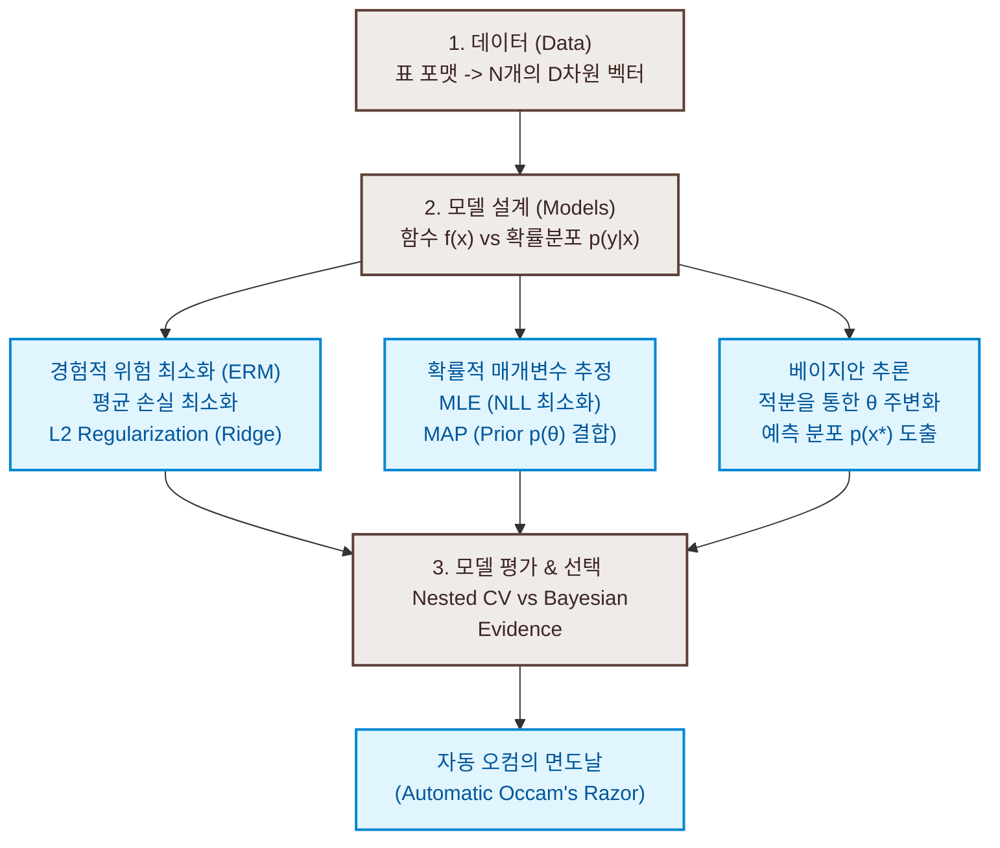

# 8. 모델과 데이터의 결합 (When Models Meet Data)

본 도서의 1부(Part I)에서는 머신러닝 방법론들의 수학적 뼈대가 되는 **선형대수, 해석기하학, 행렬 분해, 벡터 미분, 확률론, 연속 최적화**의 개념을 학습했습니다. 2부(Part II)부터는 이 수학적 도구들을 유기적으로 결합하여 머신러닝의 4대 기둥인 **회귀 분석(Chapter 9), 차원 축소(Chapter 10), 밀도 추정(Chapter 11), 분류 분석(Chapter 12)** 알고리즘을 설계하고 해결하는 실질적인 과정을 다룹니다.

본 장은 1부의 기초 수학이 어떻게 2부의 구체적인 머신러닝 방법론으로 매끄럽게 연결되는지 다리를 놓아주는 장입니다. 모델의 학습 방식을 크게 **경험적 위험 최소화(ERM)**, **매개변수 추정(MLE/MAP)**, **베이지안 추론(Bayesian Inference)**의 세 가지 패러다임으로 분류하고, 이를 평가하고 선택하는 수학적 원리를 고찰합니다.

---

### [시각 자료] 모델과 데이터의 결합 핵심 개념 흐름도 (Figure 8.15)

데이터를 모델에 피팅하고 성능을 평가하여 모델을 선택하기까지의 전체 프로세스와 핵심 개념들 사이의 대수적 관계를 묘사한 흐름도입니다.



---

# 8.1 데이터, 모델, 그리고 학습 (Data, Models, and Learning)

머신러닝의 궁극적인 질문은 **"무엇이 좋은 모델인가?"**입니다. 머신러닝 시스템은 세 가지 핵심 요소로 구성됩니다.
1. **데이터 (Data)**: 현실 세계의 현상을 수치적으로 기록한 것.
2. **모델 (Models)**: 데이터 뒤에 숨겨진 규칙성을 기술하는 수학적 공식 구조.
3. **학습 (Learning)**: 데이터에 부합하도록 모델의 자유 매개변수(Parameters)를 조정하는 수치 최적화 과정.

좋은 모델이란 단순히 기존에 관찰된 데이터를 잘 설명하는 것을 넘어, 아직 관찰되지 않은 **새로운 데이터(Unseen data)에 대해 훌륭한 예측 성능(일반화 성능)**을 보이는 모델을 뜻합니다.

---

## 8.1.1 벡터로서의 데이터 (Data as Vectors)

우리는 컴퓨터가 처리할 수 있는 형태의 정형화된 **테이블(Tabular) 형태의 데이터**를 가정합니다.
* 테이블의 **행(Row)**: 개별 데이터 인스턴스(Example, Data point)를 의미하며, $N$개로 구성됩니다 ($n = 1, \dots, N$).
* 테이블의 **열(Column)**: 각 인스턴스의 특징(Feature, Attribute, Covariate)을 의미하며, $D$차원으로 구성됩니다 ($d = 1, \dots, D$).

비수치 데이터(예: 성별, 학위, 우편번호)는 적절한 카테고리 매핑이나 지리 좌표(위도/경도) 변환 등을 거쳐 반드시 실수 벡터 공간 $\mathbb{R}^D$ 상의 한 점 $\mathbf{x}_n = [x_n^{(1)}, \dots, x_n^{(D)}]^\top$으로 변환되어야 합니다.

### 데이터 스케일링 (Data Scaling)
서로 다른 특징 열들이 가지는 수치적 크기 범위가 다르면, 최적화 과정에서 큰 값의 열이 전체를 지배하는 심각한 병태(Poorly conditioned) 문제가 생깁니다. 따라서 추가 정보가 없을 때, 모든 데이터 열의 평균을 $0$, 분산을 $1$로 강제 이동 및 조절하는 **표준화(Standardization)** 전처리를 가합니다.
$$\tilde{x}_n^{(d)} = \frac{x_n^{(d)} - \mu_d}{\sigma_d}$$
여기서 $\mu_d$는 $d$번째 열의 경험적 평균(Empirical mean), $\sigma_d$는 경험적 표준편차(Empirical standard deviation)입니다.

* **지도 학습 (Supervised Learning)**: 각 입력 데이터 벡터 $\mathbf{x}_n \in \mathbb{R}^D$마다 목표 타겟값인 라벨 $y_n \in \mathbb{R}$이 함께 짝지어진 쌍 $\{(\mathbf{x}_1, y_1), \dots, (\mathbf{x}_N, y_N)\}$을 학습하는 환경입니다. 전체 입력은 행렬 $X \in \mathbb{R}^{N \times D}$로, 라벨은 벡터 $\mathbf{y} \in \mathbb{R}^N$로 쌓아서 표기합니다.

---

## 8.1.2 함수의 관점에서의 모델 (Models as Functions)

첫 번째 모델 해석 패러다임은 모델을 단순히 입력 벡터를 받아 출력값을 내놓는 하나의 결정론적 **예측 함수(Predictor)**로 취급하는 것입니다.

$$f: \mathbb{R}^D \to \mathbb{R} \tag{8.1}$$

본 도서에서는 가장 단순하면서도 엄밀한 수학적 토대가 구축된 **선형 함수(Linear functions)**를 기본 모델로 채택합니다.

$$f(\mathbf{x}, \boldsymbol{\theta}) = \boldsymbol{\theta}^\top \mathbf{x} + \theta_0 \tag{8.2}$$

여기서 $\boldsymbol{\theta} \in \mathbb{R}^D$는 가중치 벡터, $\theta_0 \in \mathbb{R}$는 편향(Bias) 매개변수입니다. 대수 연산의 편의를 위해 입력 벡터 맨 앞에 가상의 특징 $x^{(0)} = 1$을 추가하여 $\mathbf{x}_n = [1, x_n^{(1)}, \dots, x_n^{(D)}]^\top \in \mathbb{R}^{D+1}$로 정의하고, 매개변수 벡터 역시 $\boldsymbol{\theta} = [\theta_0, \theta_1, \dots, \theta_D]^\top \in \mathbb{R}^{D+1}$로 확장하면 다음과 같이 아핀 함수를 완전한 내적 형태로 압축해 쓸 수 있습니다.

$$f(\mathbf{x}_n, \boldsymbol{\theta}) = \boldsymbol{\theta}^\top \mathbf{x}_n = \theta_0 + \sum_{d=1}^D \theta_d x_n^{(d)} \tag{8.4, 8.5}$$

---

## 8.1.3 확률 분포의 관점에서의 모델 (Models as Probability Distributions)

두 번째 패러다임은 현실의 데이터가 참 신호(Signal)에 무작위 잡음(Noise)이 뒤섞인 불안정한 상태로 관측된다고 보고, 모델을 **확률 분포(Probability distribution)** 자체로 정의하는 것입니다.

이 방식은 예측값의 단일 지점만을 내놓는 함수 관점과 달리, "해당 예측을 얼마나 확신할 수 있는가"에 대한 **예측 불확실성(Predictive uncertainty)**을 확률 분포의 분산 크기를 통해 정량적으로 제시할 수 있게 해줍니다 (Figure 8.3 참조). 우리는 매개변수의 차원이 유한한 확률 분포족만을 다룸으로써, 무한 차원을 다루는 복잡한 확률 과정(Stochastic process) 이론 없이도 풍부한 확률 모델을 구축합니다.

---

## 8.1.4 학습이란 매개변수를 찾는 과정 (Learning is Finding Parameters)

머신러닝의 알고리즘 실행 단계는 대수적으로 다음 세 단계로 엄밀히 구분됩니다.

1. **예측 또는 추론 (Prediction / Inference)**: 훈련이 완전히 끝나 매개변수 $\boldsymbol{\theta}^*$가 고정된 상태에서, 새로운 테스트 데이터 $\mathbf{x}_*$를 입력하여 예측값 $f(\mathbf{x}_*, \boldsymbol{\theta}^*)$을 계산하거나 조건부 확률 분포 $p(y_* \mid \mathbf{x}_*, \boldsymbol{\theta}^*)$를 도출하는 단계입니다.
2. **훈련 또는 매개변수 추정 (Training / Parameter Estimation)**: 준비된 훈련 데이터를 사용하여 모델의 내부 매개변수 $\boldsymbol{\theta}$를 최적화 기법을 동원하여 결정하는 단계입니다.
3. **하이퍼파라미터 튜닝 또는 모델 선택 (Hyperparameter Tuning / Model Selection)**: 모델의 구조나 정칙화 강도 등, 수치적으로 직접 미분하여 최적화하기 곤란한 상위 하이퍼파라미터를 결정하고 복수의 모델 후보군 중 최적을 선택하는 단계입니다.

---

# 8.2 경험적 위험 최소화 (Empirical Risk Minimization)

함수 관점의 예측 모델을 학습시킬 때 표준적으로 도입되는 프레임워크가 바로 **경험적 위험 최소화(ERM)**입니다. 여기서는 모델의 불확실성을 표현하는 복잡한 확률 분포 대신, 오직 오차를 정량화하는 실숫값 함수만을 사용하여 최적화를 수행합니다.

---

## 8.2.1 가설 함수군 (Hypothesis Class)

학습을 시작하기 전, 우리는 예측기 $f(\mathbf{x}, \boldsymbol{\theta})$가 취할 수 있는 함수의 범위를 미리 한정해야 합니다. 이 허용 가능한 함수들의 총집합을 **가설군(Hypothesis class)** $\mathcal{H}$라고 정의합니다. 
예를 들어 선형 회귀의 가설군은 모든 $D$-차원 아핀 함수들의 집합입니다.

$$\mathcal{H} = \{ f(\cdot, \boldsymbol{\theta}) \mid f(\mathbf{x}, \boldsymbol{\theta}) = \boldsymbol{\theta}^\top \mathbf{x}, \boldsymbol{\theta} \in \mathbb{R}^{D+1} \}$$

학습의 목표는 이 가설군 $\mathcal{H}$ 내부에서 전체 데이터셋에 대해 가장 오차가 적은 최적의 함수(즉, 최적의 매개변수 $\boldsymbol{\theta}^*$)를 건져 올리는 것입니다.

---

## 8.2.2 학습을 위한 손실 함수 (Loss Function)

개별 데이터 포인트 $(\mathbf{x}_n, y_n)$에 대하여 모델이 출력한 예측값을 $\hat{y}_n = f(\mathbf{x}_n, \boldsymbol{\theta})$라 정의합니다. 참 라벨 $y_n$과 예측값 $\hat{y}_n$ 사이의 차이로 인해 유발되는 손실을 측정하는 비음 함수 $\ell(y_n, \hat{y}_n) \ge 0$를 **손실 함수(Loss function)**라고 정의합니다.

데이터의 각 관측값들이 서로 통계적으로 연관되지 않고 동일한 분포에서 독립적으로 추출되었다는 **i.i.d. (Independent and Identically Distributed)** 가정을 채택하면, 전체 $N$개 데이터셋에 대한 총 오차는 각 샘플 손실들의 단순 평균으로 정의할 수 있습니다. 이를 **경험적 위험(Empirical Risk)** $R_{\text{emp}}$이라고 정의합니다.

$$R_{\text{emp}}(f, X, \mathbf{y}) = \frac{1}{N} \sum_{n=1}^N \ell(y_n, f(\mathbf{x}_n, \boldsymbol{\theta})) \tag{8.6}$$

이 경험적 위험 최소화(ERM) 전략은 수학적으로 다음과 같은 최적화 문제로 정식화됩니다.

$$\boldsymbol{\theta}^* = \arg\min_{\boldsymbol{\theta}} R_{\text{emp}}(f, X, \mathbf{y})$$

---

### [예제 8.2] 최소제곱 손실 (Least-Squares Loss)

손실 함수로 오차의 제곱 형태인 $\ell(y_n, \hat{y}_n) = (y_n - \hat{y}_n)^2$을 선택하고, 선형 가설군 $f(\mathbf{x}_n, \boldsymbol{\theta}) = \boldsymbol{\theta}^\top \mathbf{x}_n$을 사용하면 경험적 위험 식은 다음과 같이 유도됩니다.

$$\min_{\boldsymbol{\theta} \in \mathbb{R}^{D+1}} \frac{1}{N} \sum_{n=1}^N (y_n - \boldsymbol{\theta}^\top \mathbf{x}_n)^2 \tag{8.8}$$

이를 데이터 행렬 $X \in \mathbb{R}^{N \times (D+1)}$과 라벨 벡터 $\mathbf{y} \in \mathbb{R}^N$을 사용하여 행렬 노름(Norm) 형식으로 간결하게 표현하면 다음과 같으며, 이를 **최소제곱 문제(Least-squares problem)**라고 부릅니다.

$$\min_{\boldsymbol{\theta} \in \mathbb{R}^{D+1}} \frac{1}{N} \|\mathbf{y} - X\boldsymbol{\theta}\|^2 \tag{8.9}$$

---

### 경험적 위험(Empirical Risk) vs 참 위험(Expected Risk)
우리가 정작 최소화하고자 하는 궁극적 대상은 가진 훈련 데이터만이 아닌, 세상에 존재할 수 있는 모든 무한한 가상의 데이터 기댓값 하에서의 오차인 **참 위험(Expected Risk / Population Risk)** $R_{\text{true}}$입니다.

$$R_{\text{true}}(f) = \mathbb{E}_{\mathbf{x}, y} \big[ \ell(y, f(\mathbf{x})) \big] \tag{8.10}$$

실제로는 무한한 데이터를 얻는 것이 불가능하므로 유한한 데이터로 이루어진 $R_{\text{emp}}$로 대치하여 풀게 되는데, 이 과정에서 태생적으로 **과대적합(Overfitting)**이라는 치명적인 대수적 괴리가 발생하게 됩니다.

---

## 8.2.3 과대적합 방지를 위한 정칙화 (Regularization)

만약 가설군 $\mathcal{H}$가 매우 풍부하고 복잡한 함수들(예: 고차 다항식 또는 수억 개의 매개변수를 가진 신경망)을 포함하고 있다면, 최적화 알고리즘은 훈련 데이터 전체를 완벽하게 암기하여 경험적 위험 $R_{\text{emp}}$을 $0$으로 만들어 버릴 수 있습니다. 이 상태가 되면 모델은 훈련 데이터의 무작위 잡음(Noise)까지 신호로 인식하여 오버피팅을 겪게 되며, 테스트 데이터셋에서의 참 위험 $R_{\text{true}}$은 심각하게 치솟게 됩니다.

이처럼 과도한 유연성을 가진 모델의 자유도를 제한하고 매개변수 탐색 영역을 원점 부근으로 한정시키는 페널티 항을 목적 함수에 더해주는 기법을 **정칙화(Regularization)**라고 합니다.

---

### [예제 8.3] 정칙화된 최소제곱 (Regularized Least Squares / Ridge Regression)

최소제곱 문제식에 매개변수 벡터의 유클리드 $L_2$ 제곱 노름 페널티 항을 더해 정칙화된 최적화 식을 정의합니다.

$$\min_{\boldsymbol{\theta}} \frac{1}{N} \|\mathbf{y} - X\boldsymbol{\theta}\|^2 + \lambda \|\boldsymbol{\theta}\|^2 \tag{8.12}$$

여기서 $\|\boldsymbol{\theta}\|^2 = \boldsymbol{\theta}^\top \boldsymbol{\theta}$를 **정칙화기(Regularizer)**라고 부르며, 수치 최적화 분야에서는 Tikhonov 정칙화, 머신러닝 분야에서는 Ridge 페널티 또는 가중치 감쇠(Weight decay)라고 일컫습니다. 하이퍼파라미터 $\lambda \ge 0$는 **정칙화 매개변수(Regularization parameter)**로, 데이터 오차 최소화와 매개변수 크기 억제 사이의 상충 관계(Trade-off)를 조율합니다. 매개변수 크기가 정칙화에 의해 0 근처로 묶이면 최적화 곡면이 부드러워져 일반화 능력이 향상됩니다.

---

## 8.2.4 일반화 평가를 위한 교차 검증 (Cross-Validation)

유한한 크기의 전체 데이터셋 $D$ 하에서 일반화 성능을 정밀하게 평가하기 위해, 데이터를 직접 학습에 사용하는 **훈련 집합(Training set)**과 학습 중 절대 보여주지 않고 최종 일반화 오차만 평가하는 **테스트 집합(Test set)**으로 엄밀하게 분할합니다.

하지만 데이터의 크기가 다소 작을 때 테스트 집합을 크게 떼어 놓으면 모델 훈련을 위한 데이터가 부족해집니다. 반대로 테스트 집합을 너무 작게 설정하면 일반화 오차의 추정치 분산(Variance)이 크게 요동쳐 정확한 검증이 어려워집니다. 이 모순을 극복하기 위해 **$K$-겹 교차 검증($K$-fold Cross-Validation)**을 적용합니다.

1. 전체 데이터를 겹치지 않는 동등한 크기의 $K$개 조각(Chunks)으로 분할합니다 ($D = C_1 \cup \dots \cup C_K$).
2. 각 라운드 $k = 1, \dots, K$마다 $k$번째 조각 $C_k$를 검증 집합(Validation set) $V^{(k)}$으로 두고, 나머지 $K-1$개 조각의 합집합을 훈련 집합 $R^{(k)}$로 삼아 모델 $f^{(k)}$를 훈련합니다.
3. 검증 집합 $V^{(k)}$에 대한 평균 오차 $R(f^{(k)}, V^{(k)})$를 구합니다.
4. $K$개 라운드의 검증 오차를 최종 평균 내어 참 일반화 오차의 기댓값을 근사합니다.

$$\mathbb{E}_V \big[ R(f, V) \big] \approx \frac{1}{K} \sum_{k=1}^K R(f^{(k)}, V^{(k)}) \tag{8.13}$$

교차 검증은 각 폴드 간의 의존성이 전혀 없는 **대단히 병렬화 가능한(Embarrassingly parallel)** 문제이므로, 충분한 하드웨어 자원이 확보된다면 연산 시간을 대폭 줄일 수 있습니다.

---

# 8.3 매개변수 추정 (Parameter Estimation)

세 번째 패러다임은 확률론적 표현 방식을 사용하여 데이터 관측 노이즈의 불확실성을 모델링하는 **매개변수 추정(Parameter Estimation)**입니다. 여기서는 손실 함수 대신 **우도(Likelihood)**의 개념을 정의하여 최적화를 수행합니다.

---

## 8.3.1 최대 우도 추정 (Maximum Likelihood Estimation, MLE)

데이터 확률 변수 $\mathbf{x}$에 대하여 매개변수 $\boldsymbol{\theta}$를 갖는 확률 밀도 함수군 $p(\mathbf{x} \mid \boldsymbol{\theta})$를 정의합시다. 이미 데이터 $\mathbf{x}$가 관측되어 상수로 고정된 상태에서, 매개변수 $\boldsymbol{\theta}$를 변수로 취급하는 이 함수를 **우도 함수(Likelihood function)**라고 정의합니다.

최적화의 정합성을 위해 우도 함수에 로그를 취하고 부호를 반전시킨 **음의 로그 우도(Negative Log-Likelihood, NLL)** $L(\boldsymbol{\theta})$를 정의하여 최소화 문제를 구성합니다.

$$L(\boldsymbol{\theta}) = -\log p(\mathbf{x} \mid \boldsymbol{\theta}) \tag{8.14}$$

전체 데이터가 i.i.d. 가정 하에 수집되었다면, 조건부 라벨 관측의 결합 우도 $p(\mathbf{y} \mid X, \boldsymbol{\theta})$는 개별 데이터 우도들의 단순 곱으로 인수분해(Factorization)됩니다.

$$p(\mathbf{y} \mid X, \boldsymbol{\theta}) = \prod_{n=1}^N p(y_n \mid \mathbf{x}_n, \boldsymbol{\theta}) \tag{8.16}$$

여기에 음의 로그를 취하면 곱셈 연산이 덧셈 연산으로 변환되어 수치적으로 훨씬 안정적이고 미분하기 편리한 NLL 최소화 목적 함수가 완성됩니다.

$$L(\boldsymbol{\theta}) = -\log p(\mathbf{y} \mid X, \boldsymbol{\theta}) = -\sum_{n=1}^N \log p(y_n \mid \mathbf{x}_n, \boldsymbol{\theta}) \tag{8.17}$$

---

### [예제 8.5] 가우시안 노이즈 우도로부터의 최소제곱 오차 유도

라벨의 조건부 관측 확률이 참 선형 신호 $\boldsymbol{\theta}^\top \mathbf{x}_n$에 가우시안 백색 잡음 $\epsilon_n \sim \mathcal{N}(0, \sigma^2)$이 더해진 형태라고 정식화해 봅시다.
$$y_n = \boldsymbol{\theta}^\top \mathbf{x}_n + \epsilon_n \implies p(y_n \mid \mathbf{x}_n, \boldsymbol{\theta}) = \mathcal{N}(y_n \mid \boldsymbol{\theta}^\top \mathbf{x}_n, \sigma^2) \tag{8.15}$$

이 가우시안 우도 가정을 NLL 공식에 대입하여 대수적으로 끝까지 전개해 봅시다.
$$\begin{aligned}
L(\boldsymbol{\theta}) &= -\sum_{n=1}^N \log \left[ \frac{1}{\sqrt{2\pi\sigma^2}} \exp\left( -\frac{(y_n - \boldsymbol{\theta}^\top \mathbf{x}_n)^2}{2\sigma^2} \right) \right] \tag{8.18b} \\
&= -\sum_{n=1}^N \left[ -\frac{(y_n - \boldsymbol{\theta}^\top \mathbf{x}_n)^2}{2\sigma^2} - \log \sqrt{2\pi\sigma^2} \right] \tag{8.18c} \\
&= \frac{1}{2\sigma^2} \sum_{n=1}^N (y_n - \boldsymbol{\theta}^\top \mathbf{x}_n)^2 + \frac{N}{2} \log (2\pi\sigma^2) \tag{8.18d}
\end{aligned}$$

노이즈의 분산 $\sigma^2$이 상수로서 주어져 있다면, 두 번째 로그 항은 매개변수 $\boldsymbol{\theta}$와 완전히 독립된 상수이므로 최적화 경로에서 무시됩니다. 또한 첫 번째 항의 가중 계수 $\frac{1}{2\sigma^2}$ 역시 양의 상수이므로 최적점의 위치에 영향을 주지 않습니다. 
결과적으로 가우시안 노이즈 우도 하에서의 최대 우도 추정(MLE)은 **경험적 위험 최소화(ERM) 하에서의 최소제곱(Least-Squares) 문제식 (8.8)을 푸는 것과 완전히 일치함**이 수학적으로 증명됩니다.

---

## 8.3.2 최대 사후 확률 추정 (Maximum A Posteriori Estimation, MAP)

만약 우리가 학습을 시작하기 전, 매개변수 $\boldsymbol{\theta}$가 특정 범위 내에 존재할 확률이 높다는 식의 **사전 지식(Prior knowledge)**을 확률 분포 $p(\boldsymbol{\theta})$의 형태로 가지고 있다면, 이를 우도 함수에 결합할 수 있습니다. 

데이터 관측값 $X$를 목격한 후 업데이트된 매개변수의 사후 확률 분포 $p(\boldsymbol{\theta} \mid X)$는 **베이즈 정리(Bayes' Theorem)**에 의해 다음과 같이 도출됩니다.

$$p(\boldsymbol{\theta} \mid X) = \frac{p(X \mid \boldsymbol{\theta})p(\boldsymbol{\theta})}{p(X)} \tag{8.19}$$

매개변수의 최적값을 찾는 최적화 관점에서는 매개변수 $\boldsymbol{\theta}$와 완전히 독립적인 분모의 주변 우도(Marginal likelihood) $p(X)$를 상수 취급하여 생략할 수 있습니다.

$$p(\boldsymbol{\theta} \mid X) \propto p(X \mid \boldsymbol{\theta})p(\boldsymbol{\theta}) \tag{8.20}$$

여기에 음의 로그를 취하여 음의 로그 사후 확률을 최소화하는 문제를 정의하며, 이를 **최대 사후 확률 추정(MAP Estimation)**이라고 합니다.

$$-\log p(\boldsymbol{\theta} \mid X) = -\log p(X \mid \boldsymbol{\theta}) - \log p(\boldsymbol{\theta}) + \text{const}$$

이 식에서 알 수 있듯, 우도 항 $-\log p(X \mid \boldsymbol{\theta})$ 뒤에 더해진 사전 분포 항 $-\log p(\boldsymbol{\theta})$은 비확률론적 ERM 프레임워크에서의 **정칙화 페널티 항(Regularization term)**과 완벽히 상응하는 대수적 구조를 이룹니다.
예를 들어, 매개변수에 평균이 0인 독립 가우시안 사전 분포 $p(\boldsymbol{\theta}) = \mathcal{N}(\mathbf{0}, \sigma_0^2 I)$를 부과하고 음의 로그를 취하면 매개변수의 제곱합인 $\|\boldsymbol{\theta}\|^2$ 페널티가 자연스럽게 튀어나옵니다. 즉, **가우시안 Prior를 적용한 MAP 추정은 $L_2$ 정칙화(Ridge Regression)와 수학적으로 정확히 동치**입니다.

---

## 8.3.3 모델 피팅 상태의 분류 (Model Fitting)

훈련 데이터에 모델을 최적화(피팅)하고 난 후, 우리는 매개변수의 수용 공간 크기와 데이터 적합 상태에 따라 다음과 같은 세 가지 시나리오를 마주하게 됩니다 (Figure 8.8 참조).

1. **과대적합 (Overfitting)**: 모델 클래스가 타겟 현상에 비해 지나치게 많은 매개변수를 담고 있어(즉, 너무 유연하여), 데이터 본연의 경향성뿐 아니라 관측에 내재된 무작위 잡음까지 완벽하게 적합해 버린 상태입니다. 훈련 오차는 $0$에 수렴하지만 일반화 에러는 극도로 나빠집니다.
2. **과소적합 (Underfitting)**: 모델 클래스가 타겟 현상을 설명하기에 너무 단순한 가설군으로 제약되어 있어(예: 구불구불한 데이터를 직선 모델로 피팅), 데이터의 주요 경향성조차 반영하지 못하는 상태입니다. 훈련 오차와 테스트 오차 모두 높게 나타납니다.
3. **적절한 적합 (Fitting Well)**: 모델 클래스의 복잡도가 실제 현상의 복잡도와 절묘하게 정합하여, 잡음을 효과적으로 걸러내면서도 본질적인 경향성을 성공적으로 포착해 낸 이상적인 일반화 상태입니다.

---

# 8.4 확률적 모델링과 추론 (Probabilistic Modeling and Inference)

최대 우도 추정(MLE)과 최대 사후 확률 추정(MAP)은 결국 단 하나의 '가장 유력한' 매개변수 점 추정치 $\boldsymbol{\theta}^*$만을 계산하여 예측 함수 $f(\mathbf{x}, \boldsymbol{\theta}^*)$를 조립하는 방식입니다. 반면 **베이즈 추론(Bayesian Inference)**은 매개변수 $\boldsymbol{\theta}$를 단일한 상수가 아닌, 학습 과정 전체에 걸쳐 불확실성을 수반하는 **확률 변수(Random variable)** 그 자체로 취급합니다.

---

## 8.4.1 확률 모델의 정식화

확률 모델을 정의한다는 것은 관측된 데이터 변수 $\mathbf{x}$와 보이지 않는 숨겨진 매개변수 변수 $\boldsymbol{\theta}$의 **결합 확률 분포(Joint probability distribution)** $p(\mathbf{x}, \boldsymbol{\theta})$를 선언하는 것과 정확히 같습니다.
곱의 법칙(Product rule)에 의해 결합 분포를 사전 분포와 우도의 곱으로 표현할 수 있습니다.
$$p(\mathbf{x}, \boldsymbol{\theta}) = p(\mathbf{x} \mid \boldsymbol{\theta})p(\boldsymbol{\theta})$$

이 결합 분포 하나만 명확히 정의해 두면, 적분(Marginalization)과 나눗셈 연산만으로 주변 우도 $p(\mathbf{x})$, 사후 분포 $p(\boldsymbol{\theta} \mid \mathbf{x})$를 수학적 일관성을 유지하며 전부 유도해낼 수 있습니다.

---

## 8.4.2 베이즈 추론 (Bayesian Inference)

베이즈 추론의 목표는 단일점 $\boldsymbol{\theta}^*$를 골라내는 최적화 문제를 푸는 것이 아니라, 관측 데이터 $X$를 반영하여 매개변수의 불확실성 전체를 나타내는 **사후 확률 분포(Posterior distribution)** $p(\boldsymbol{\theta} \mid X)$의 분포 형태 전체를 계산해내는 것입니다.

$$p(\boldsymbol{\theta} \mid X) = \frac{p(X \mid \boldsymbol{\theta})p(\boldsymbol{\theta})}{p(X)} \tag{8.22}$$

여기서 분모의 **marginal likelihood(주변 우도 / Model evidence)** $p(X)$는 다음과 같이 매개변수 공간 전체에 대해 우도와 사후 확률의 곱을 적분하여 매개변수를 완전히 없앤(Marginalized) 데이터 자체의 생성이 나타날 확률입니다.

$$p(X) = \int_{\boldsymbol{\theta}} p(X \mid \boldsymbol{\theta})p(\boldsymbol{\theta}) d\boldsymbol{\theta} \tag{8.22}$$

### 예측 분포 (Predictive Distribution)의 대수적 도출
새로운 입력 데이터 $\mathbf{x}_*$가 주어졌을 때, 베이즈 추론 하에서의 예측 분포 $p(y_* \mid \mathbf{x}_*, X)$는 단일 매개변수를 사용하는 대신, 사후 분포 $p(\boldsymbol{\theta} \mid X)$가 가리키는 모든 가능한 매개변수 후보군들의 예측 능력을 각각의 확률 크기로 가중 평균(Marginalization 적분)하여 결정합니다.

$$p(y_* \mid \mathbf{x}_*, X) = \int_{\boldsymbol{\theta}} p(y_* \mid \mathbf{x}_*, \boldsymbol{\theta}) p(\boldsymbol{\theta} \mid X) d\boldsymbol{\theta} \tag{8.23}$$

이 적분을 수행함으로써 매개변수의 추정 불확실성이 예측값으로 정밀하게 전파(Propagation of uncertainty)됩니다.

> [!CAUTION]
> **베이지안 추론의 계산적 장벽: 적분(Integration) 문제**
> 점 추정(MLE/MAP)의 핵심 연산은 경사하강법으로 극대값을 찾는 **최적화(Optimization)** 연산인 반면, 베이즈 추론의 핵심 연산은 주변 우도와 예측 분포를 구하기 위해 고차원 매개변수 공간 전체를 뭉개어 합치는 **적분(Integration)** 연산입니다. 
> 만약 우도와 사전 분포가 켤레(Conjugate) 관계가 아니라면 이 적분식은 수학적으로 닫힌 형식(Closed-form)의 해석적 해를 구할 수 없는 난제가 됩니다. 이 경우 마르코프 체인 몬테카를로(MCMC)와 같은 확률적 샘플링 근사 기법이나, 라플라스 근사, 변분 추론(Variational Inference, VI), 기대값 전파(EP) 같은 결정론적 최적화 우회 근사 기법을 사용해야만 합니다.

---

## 8.4.3 잠재 변수 모델 (Latent-Variable Models)

실제 데이터 생성 메커니즘을 보다 명밀하게 설명하기 위해, 모델 매개변수 $\boldsymbol{\theta}$ 외에 각 데이터 샘플 마다 개별적으로 대응되는 관측되지 않은 또 다른 숨겨진 확률 변수인 **잠재 변수(Latent variable) $\mathbf{z}$**를 명시적으로 도입하여 모델을 설계하기도 합니다. 

잠재 변수 모델의 결합 확률 분포는 다음과 같이 정의됩니다.
$$p(\mathbf{x}, \mathbf{z} \mid \boldsymbol{\theta}) = p(\mathbf{x} \mid \mathbf{z}, \boldsymbol{\theta})p(\mathbf{z})$$

이 모델에서 관측 데이터의 주변 우도(Likelihood)는 숨겨진 잠재 변수 $\mathbf{z}$ 공간 전체에 대해 적분(주변화)을 취해 소거해 줌으로써 도출됩니다.

$$p(\mathbf{x} \mid \boldsymbol{\theta}) = \int_{\mathbf{z}} p(\mathbf{x} \mid \mathbf{z}, \boldsymbol{\theta})p(\mathbf{z}) d\mathbf{z} \tag{8.25}$$

잠재 변수 $\mathbf{z}$가 소거된 우도 함수 식 (8.25)가 도출되면, 이를 사용하여 앞서 다룬 MLE 및 MAP 최적화를 동일하게 적용할 수 있습니다. 또한 매개변수 $\boldsymbol{\theta}$를 고정한 상태에서 특정 데이터 관측값 $\mathbf{x}$가 주어졌을 때 잠재 변수의 상태를 추론하는 **잠재 변수 사후 분포**는 다음과 같이 계산됩니다.

$$p(\mathbf{z} \mid \mathbf{x}, \boldsymbol{\theta}) = \frac{p(\mathbf{x} \mid \mathbf{z}, \boldsymbol{\theta})p(\mathbf{z})}{p(\mathbf{x} \mid \boldsymbol{\theta})} \tag{8.28}$$

이러한 잠재 변수 모델의 최적 매개변수를 구하는 대표적인 수치 알고리즘이 바로 **기대값 극대화(Expectation-Maximization, EM) 알고리즘**이며, 차원 축소의 PCA(Chapter 10) 및 밀도 추정의 가우시안 혼합 모델(Chapter 11)에서 그 구체적인 대수 전개와 작동 원리를 학습하게 됩니다.

---

# 8.5 방향성 그래픽 모델 (Directed Graphical Models)

확률 모델을 설계할 때 확률 변수들의 개수가 많아지면 결합 확률 분포 식의 결합 관계가 극도로 복잡해집니다. 이 변수들 간의 조건부 의존성(Conditional dependency)과 독립성 관계를 시각적으로 한눈에 파악하고 컴팩트하게 표기하기 위해 **방향성 그래픽 모델(Directed Graphical Model / Bayesian Network)**을 사용합니다.

---

## 8.5.1 그래프의 문법과 판독 법칙 (Graph Semantics)

그래픽 모델을 구성하는 대수적 규칙은 다음과 같습니다.
1. **노드(Node)**: 각각의 무작위 확률 변수를 나타냅니다.
   * **하얀색 빈 노드**: 관측되지 않은 숨겨진 변수 또는 매개변수 ($\boldsymbol{\theta}, \mathbf{z}$ 등)
   * **음영 처리된 노드**: 실제로 값을 목격하여 상수로 고정된 관측 변수 ($\mathbf{x}$ 등)
2. **방향 화살표(Directed Edge)**: 조건부 의존성(Conditional probability)을 나타냅니다. 예를 들어 노드 $a$에서 노드 $b$로 향하는 화살표($a \to b$)는 조건부 확률 $p(b \mid a)$ 항이 결합 분포에 곱해짐을 뜻합니다. 이때 $a$를 $b$의 **부모 노드(Parent node)**라고 부릅니다.

그래프 상에 나타난 모든 부모-자식 화살표 구조를 활용하면, 복잡한 다차원 결합 확률 분포를 개별 자식 노드가 자신의 부모 노드들($\text{Pa}_k$)에만 종속되는 조건부 확률들의 단순 곱으로 완벽히 분해(Factorization)하여 정의할 수 있습니다.

$$p(\mathbf{x}_1, \dots, \mathbf{x}_K) = \prod_{k=1}^K p(\mathbf{x}_k \mid \text{Pa}_k) \tag{8.31}$$

---

### [시각 자료] 그래픽 모델의 기본 노드 표현 및 플레이트 표기법 (Figure 8.10)

동일한 독립 실험을 $N$번 반복할 때 개별 노드를 일렬로 중복해서 그리는 비효율을 방지하기 위해, 반복 영역을 묶어 우하단에 반복 횟수 $N$을 기입하는 **플레이트 표기법(Plate notation)**을 사용합니다. 아래는 하이퍼파라미터 $\alpha, \beta$의 지배를 받는 파라미터 $\mu$에 기해 $N$개의 관측 $\mathbf{x}_n$이 독립 생성되는 베이지안 그래픽 모델의 도식입니다.

```
       [Deterministic parameters]     (α, β)
                                        |
                                        v
       [Unobserved random variable]   ( μ )  <-- Latent parameter
                                        |
                                        v
                                    .---------.
                                    |         |
       [Observed random variable]   |  ((xn)) |  <-- Shaded/Double circles
                                    |         |
                                    `---------'
                                         N   <-- Repeat N times (Plate)
```

---

## 8.5.2 조건부 독립성과 d-분리 (d-Separation)

그래픽 모델의 가장 강력한 용도는 확률 분포의 대수적 식을 직접 계산해보지 않고도, 오직 화살표의 연결 기하학적 구조만 보고 임의의 두 확률 변수 집합 $A$와 $B$가 특정 변수 집합 $C$가 주어졌을 때 서로 **조건부 독립(Conditionally Independent)** 관계 $A \perp\!\!\perp B \mid C$인지 즉시 판독해낼 수 있다는 점입니다. 이 판독 규칙을 **d-분리(d-separation)**라고 부릅니다.

### d-분리 차단 판정 알고리즘
$A$에서 출발하여 화살표의 원래 방향을 완전히 무시한 채 선을 타고 $B$에 도달하는 모든 가능한 가상의 경로(Trail)를 추적합니다. 특정 경로 상에 존재하는 임의의 노드 $v$에 대해 다음 두 조건 중 **단 하나라도 충족되면 해당 경로는 차단(Blocked)**되었다고 판정합니다.

1. **꼬리-머리($\to v \to$) 또는 꼬리-꼬리($\leftarrow v \to$) 구조**에서, 중간 노드 $v$가 우리가 알고 조건부로 준 관측 집합 $C$에 포함되는 경우 ($v \in C$).
2. **머리-머리($\to v \leftarrow$) 충돌(Collider) 구조**에서, 충돌 노드 $v$와 그 노드의 어떠한 후손(Descendants) 노드들도 전부 관측 집합 $C$에 포함되지 않는 경우 ($v \notin C$ 이고 후손 $\notin C$).

만약 $A$와 $B$를 잇는 모든 가능한 경로가 최소 하나 이상의 노드에 의해 완벽하게 차단되어 통행이 불가능하다면, $A$와 $B$는 $C$에 의해 **d-separated** 되었다고 하며, 실제 확률 분포 상에서 조건부 독립성 $A \perp\!\!\perp B \mid C$가 보장됩니다.

---

# 8.6 모델 선택 (Model Selection)

우리는 하이퍼파라미터(예: 다항식 차수, 신경망 층수, 정칙화 계수 $\lambda$)를 조절하여 모델의 복잡도와 가설 공간 $\mathcal{H}$의 크기를 변경합니다. 최적의 일반화 능력을 갖추기 위해 상이한 복잡도를 지닌 모델 후보군 중 최선의 하나를 골라내는 이론을 **모델 선택(Model Selection)**이라고 합니다.

---

## 8.6.1 Nested 교차 검증 (Nested Cross-Validation)

모델의 가중치 매개변수 $\boldsymbol{\theta}$를 훈련하면서 동시에 최적의 하이퍼파라미터 $\lambda$를 탐색할 때, 일반적인 1차원 교차 검증을 사용하면 하이퍼파라미터 정보가 검증 집합으로 누수(Leakage)되어 최종 일반화 성능 평가가 편향됩니다. 이를 완벽하게 차단하기 위해 이중 루프로 교차 검증을 수행하는 **Nested 교차 검증**을 구현합니다 (Figure 8.13 참조).

1. **외곽 루프 (Outer Loop)**: 전체 데이터를 훈련 데이터와 테스트 데이터로 분할합니다. 최종 모델의 순수한 일반화 성능을 평가하는 용도입니다.
2. **내부 루프 (Inner Loop)**: 외곽 루프의 훈련 데이터를 다시 내부 훈련 데이터와 내부 검증 데이터로 한 번 더 분할하여 교차 검증을 가합니다. 다양한 하이퍼파라미터 후보군 중 내부 검증 오차 평균 (8.39)을 가장 최소화하는 '최적의 하이퍼파라미터'를 건져내는 용도입니다.
3. 내부 루프에서 결정된 최적의 하이퍼파라미터를 사용하여 외곽 루프의 전체 훈련 데이터로 모델을 재훈련한 뒤, 외곽의 테스트 데이터로 최종 성능을 측정합니다.

---

## 8.6.2 베이즈 모델 선택과 오컴의 면도날 (Bayesian Model Selection & Occam's Razor)

비베이지안 패러다임에서는 모델 선택을 위해 CV를 돌려 모델을 수십 수백 번 재훈련해야 하는 극심한 계산적 비용을 지불해야 합니다. 반면 베이지안 프레임워크에서는 모델 $M_k$ 자체의 불확실성을 상위 계층의 확률 변수로 두어 계층적 베이지안 모델을 구축함으로써 단 한 번에 모델 선택을 수행합니다.

데이터 $D$가 관측되었을 때 특정 모델 구조 $M_k$가 진실일 사후 확률 $p(M_k \mid D)$는 다음과 같습니다.
$$p(M_k \mid D) \propto p(M_k) p(D \mid M_k) \tag{8.43}$$

여기서 곱해지는 **모델 에비던스(Model Evidence / Marginal Likelihood)** $p(D \mid M_k)$는 다음과 같이 모델 $M_k$가 가진 매개변수 $\boldsymbol{\theta}_k$ 전체를 적분하여 날려버린 값입니다.

$$p(D \mid M_k) = \int_{\boldsymbol{\theta}_k} p(D \mid \boldsymbol{\theta}_k) p(\boldsymbol{\theta}_k \mid M_k) d\boldsymbol{\theta}_k \tag{8.44}$$

### 자동 오컴의 면도날 (Automatic Occam's Razor)
수학적으로 확률 분포는 모든 가능한 데이터 공간 $D$에 대해 적분하면 반드시 $1$이 되어야 합니다 ($\int p(D \mid M) dD = 1$). 

* **단순한 모델 $M_1$**: 극히 제한된 종류의 단순한 데이터셋만을 생성할 수 있으므로, 그 좁은 데이터 영역에 확률 밀도를 높게 밀집시켜 분포시킵니다.
* **지나치게 복잡한 모델 $M_2$**: 수많은 자유 매개변수 덕분에 세상의 거의 모든 기기괴괴한 데이터셋을 다 흉내 내어 설명할 수 있습니다. 하지만 확률 보존 법칙($\text{Sum}=1$)으로 인해 확률 밀도가 모든 데이터 영역으로 아주 얇고 넓게 흩어지게 됩니다.

만약 우리가 실제로 목격한 데이터 $D$가 단순한 형태 영역에 위치한다면, 복잡한 모델 $M_2$의 에비던스 값 $p(D \mid M_2)$은 얇게 퍼진 확률 밀도 때문에 극히 작게 떨어집니다. 반면 단순한 모델 $M_1$의 에비던스 $p(D \mid M_1)$은 좁은 곳에 뭉쳐진 밀도 덕분에 훨씬 크게 나타납니다. 
따라서 베이즈 모델 사후 확률을 극대화하면, 인위적인 페널티 항을 수동으로 조절하지 않아도 **현상을 설명할 수 있는 가장 단순한 모델을 자동으로 선택하게 되는 오컴의 면도날 법칙**이 수학적으로 자동 내재화되어 작동합니다 (Figure 8.14 참조).

---

## 8.6.3 모델 비교를 위한 베이즈 인자 (Bayes Factors)

두 구체적인 경쟁 모델 $M_1, M_2$에 대한 사후 확률의 비율인 **사후 오즈(Posterior odds)**를 계산하여 모델 비교를 수행합니다.

$$\frac{p(M_1 \mid D)}{p(M_2 \mid D)} = \left( \frac{p(M_1)}{p(M_2)} \right) \left( \frac{p(D \mid M_1)}{p(D \mid M_2)} \right) \tag{8.46}$$

* **우변 첫 번째 항**: 학습 전 두 모델에 대해 가졌던 선호도 비율인 **사전 오즈(Prior odds)**입니다. 보통 균등분포($1/2$)를 가하여 $1$로 소거합니다.
* **우변 두 번째 항**: 두 모델의 marginal likelihood 비율인 **베이즈 인자(Bayes factor)** $B_{12}$입니다.
  $$B_{12} = \frac{p(D \mid M_1)}{p(D \mid M_2)} \tag{8.47}$$

베이즈 인자 $B_{12} > 1$이면 데이터가 모델 $M_1$을 지지하는 것이고, $B_{12} < 1$이면 $M_2$를 지지하는 것으로 명확하게 판정합니다.

---

### [정리] 정보 기준 (Information Criteria)을 통한 간이 모델 선택

모델 에비던스의 어려운 고차원 적분을 대수적으로 근사하거나, MLE의 과대적합 편향을 보정하기 위해 점 추정 정보에 페널티를 더한 간이 지표들을 활용합니다.

1. **아카이케 정보 기준 (AIC: Akaike Information Criterion)**:
   $$\text{AIC} = \log p(D \mid \boldsymbol{\theta}_{\text{ML}}) - M \tag{8.48}$$
   여기서 $M$은 모델의 자유 매개변수 개수입니다. 더 복잡한 모델이 유발하는 최대 우도의 낙관적 편향을 매개변수 수만큼 선형 페널티로 직접 깎아내어 보정합니다.
2. **베이지안 정보 기준 (BIC: Bayesian Information Criterion)**:
   $$\text{BIC} = \log p(D \mid \boldsymbol{\theta}_{\text{ML}}) - \frac{1}{2} M \log N \tag{8.49}$$
   여기서 $N$은 데이터 샘플 개수입니다. 이는 하부의 사전 분포가 완만한 상태에서의 모델 에비던스 $\log p(D)$를 라플라스 근사법(Laplace approximation)을 사용하여 2차 테일러 전개하여 유도해낸 대수적 근사치입니다. 데이터 개수 $N$이 커질수록 복잡한 모델에 AIC보다 훨씬 가혹한 벌점을 부과합니다.

---

# Citations
* Marc Peter Deisenroth, A. Aldo Faisal, and Cheng Soon Ong, *Mathematics for Machine Learning*, Cambridge University Press, 2020. (Chapter 8: When Models Meet Data)
* Christopher M. Bishop, *Pattern Recognition and Machine Learning*, Springer, 2006.
* David J.C. MacKay, *Information Theory, Inference and Learning Algorithms*, Cambridge University Press, 2003.
* Judea Pearl, *Probabilistic Reasoning in Intelligent Systems: Networks of Plausible Inference*, Morgan Kaufmann, 1988.
