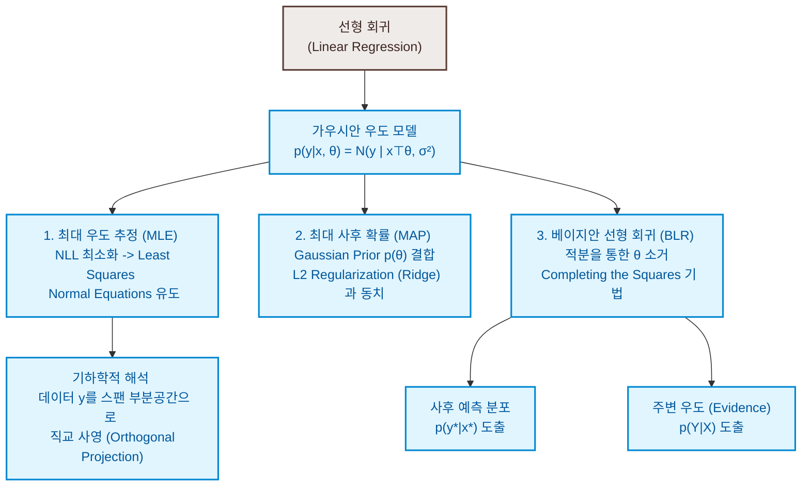

# 9. 선형 회귀 (Linear Regression)

본 장에서는 1부에서 다룬 **선형대수, 해석기하학, 확률론, 연속 최적화**의 모든 개념을 총동원하여, 머신러닝의 가장 클래식하면서도 강력한 첫 번째 기둥인 **선형 회귀(Linear Regression)** 문제를 완벽히 해결합니다. 

회귀 분석의 목적은 입력 벡터 $\mathbf{x} \in \mathbb{R}^D$를 타겟 실수값 $y \in \mathbb{R}$로 매핑하는 연속 함수 $f$를 찾아내는 것입니다. 관측 데이터는 참 신호에 관측 잡음이 섞여 있는 형태이며, 본 장에서는 평균이 $0$인 가우시안 노이즈 모델을 상정합니다. 학습된 모델은 기존 데이터뿐 아니라 새로운 지점에서도 신뢰성 있는 예측을 제공해야 하며, 이를 위해 점 추정 방식(MLE/MAP)과 분포 추정 방식(Bayesian Regression)의 수학적 유도 과정을 명밀하게 다룹니다.

---

### [시각 자료] 선형 회귀의 수학적 구조도 (Figure 9.1)

선형 회귀 문제를 푸는 세 가지 기법(MLE, MAP, BLR)과 이들의 수식적 변환 관계 및 기하학적 의미를 시각화한 맵입니다.



---

# 9.1 문제 정의 (Problem Formulation)

데이터에 본질적으로 내재된 관측 잡음을 명시적으로 다루기 위해, 입력 $\mathbf{x} \in \mathbb{R}^D$와 타겟 $y \in \mathbb{R}$ 사이의 관계를 다음과 같은 조건부 가우시안 **우도 함수(Likelihood function)**로 정의합니다.

$$p(y \mid \mathbf{x}, \boldsymbol{\theta}) = \mathcal{N}(y \mid f(\mathbf{x}), \sigma^2) \tag{9.1}$$

이를 확률 변수 방정식으로 표현하면 다음과 같습니다.

$$y = f(\mathbf{x}) + \epsilon , \quad \epsilon \sim \mathcal{N}(0, \sigma^2) \tag{9.2}$$

여기서 측정 잡음 $\epsilon$은 서로 독립이고 동일한 분포를 따르는(i.i.d.) 평균 $0$, 분산 $\sigma^2$의 가우시안 랜덤 변수입니다. 

**선형 회귀(Linear Regression)**란 예측하고자 하는 타겟 함수가 매개변수 $\boldsymbol{\theta}$에 대해 **선형 결합(Linear in the parameters)** 형태로 정식화되는 모델을 지칭합니다. 가장 단순하게 입력 변수 $\mathbf{x}$ 자체와도 선형 관계를 이루는 직선 모델은 다음과 같이 기술됩니다.

$$p(y \mid \mathbf{x}, \boldsymbol{\theta}) = \mathcal{N}(y \mid \mathbf{x}^\top \boldsymbol{\theta}, \sigma^2) \iff y = \mathbf{x}^\top \boldsymbol{\theta} + \epsilon \tag{9.3, 9.4}$$

여기서 $\boldsymbol{\theta} \in \mathbb{R}^D$는 우리가 찾아내고자 하는 최적의 매개변수 가중치 벡터입니다. 이 모델은 원점($\mathbf{0}$)을 통과하는 일련의 직선 군을 의미합니다. (절편을 다루기 위해 8.1.2절의 방식대로 입력을 확장합니다.)

---

# 9.2 매개변수 추정 (Parameter Estimation)

독립적으로 수집된 $N$개의 훈련 데이터셋 $D = \{(\mathbf{x}_1, y_1), \dots, (\mathbf{x}_N, y_N)\}$이 주어졌을 때, 각 샘플 간의 조건부 독립성에 기해 전체 데이터의 결합 우도는 각 샘플 우도들의 곱으로 완벽히 인수분해됩니다.

$$p(\mathbf{y} \mid X, \boldsymbol{\theta}) = \prod_{n=1}^N p(y_n \mid \mathbf{x}_n, \boldsymbol{\theta}) = \prod_{n=1}^N \mathcal{N}(y_n \mid \mathbf{x}_n^\top \boldsymbol{\theta}, \sigma^2) \tag{9.5}$$

여기서 $X = [\mathbf{x}_1, \dots, \mathbf{x}_N]^\top \in \mathbb{R}^{N \times D}$는 디자인 행렬(Design Matrix), $\mathbf{y} = [y_n, \dots, y_N]^\top \in \mathbb{R}^N$는 타겟 벡터입니다.

---

## 9.2.1 최대 우도 추정 (Maximum Likelihood Estimation)

최대 우도 추정치 $\boldsymbol{\theta}_{\text{ML}}$은 관측 데이터를 발생시킬 확률을 가장 극대화하는 매개변수 지점입니다.

$$\boldsymbol{\theta}_{\text{ML}} = \arg\max_{\boldsymbol{\theta}} p(\mathbf{y} \mid X, \boldsymbol{\theta}) \tag{9.7}$$

대수적 편의와 수치 연산의 오버플로우 방지를 위해 음의 로그 우도(Negative Log-Likelihood, NLL)를 취해 곱셈을 덧셈으로 완화하고, 최소화 문제를 구성합니다.

$$L(\boldsymbol{\theta}) = -\sum_{n=1}^N \log p(y_n \mid \mathbf{x}_n, \boldsymbol{\theta}) \tag{9.8}$$

여기에 가우시안 분포의 확률 밀도 공식을 대입하여 전개합니다.

$$\log p(y_n \mid \mathbf{x}_n, \boldsymbol{\theta}) = -\frac{1}{2}\log(2\pi) - \frac{1}{2}\log(\sigma^2) - \frac{1}{2\sigma^2}(y_n - \mathbf{x}_n^\top \boldsymbol{\theta})^2 \tag{9.9}$$

매개변수 $\boldsymbol{\theta}$와 무관한 상수 항들을 전부 제외하고, NLL 목적 함수 $L(\boldsymbol{\theta})$를 정렬합니다.

$$L(\boldsymbol{\theta}) = \frac{1}{2\sigma^2} \sum_{n=1}^N (y_n - \mathbf{x}_n^\top \boldsymbol{\theta})^2 = \frac{1}{2\sigma^2} (\mathbf{y} - X\boldsymbol{\theta})^\top (\mathbf{y} - X\boldsymbol{\theta}) = \frac{1}{2\sigma^2} \|\mathbf{y} - X\boldsymbol{\theta}\|^2 \tag{9.10}$$

이 식은 매개변수 $\boldsymbol{\theta}$에 대한 볼록 이차 형식(Convex quadratic form)입니다. 따라서 전역 최적점은 미분한 그래디언트 벡터를 영 벡터 $\mathbf{0}^\top$로 만드는 유일한 지점에서 결정됩니다. 행렬 미분 공식 $\frac{d}{d\mathbf{x}}(\mathbf{x}^\top C \mathbf{x}) = 2\mathbf{x}^\top C$와 $\frac{d}{d\mathbf{x}}(\mathbf{d}^\top \mathbf{x}) = \mathbf{d}^\top$를 가해주기 위해 NLL 항을 완전히 전개합니다.

$$L(\boldsymbol{\theta}) = \frac{1}{2\sigma^2} \big( \mathbf{y}^\top \mathbf{y} - 2\mathbf{y}^\top X \boldsymbol{\theta} + \boldsymbol{\theta}^\top X^\top X \boldsymbol{\theta} \big)$$

매개변수 $\boldsymbol{\theta}$로 미분을 가하여 그래디언트 행 벡터를 도출합니다.

$$\frac{d L}{d \boldsymbol{\theta}} = \frac{1}{2\sigma^2} \big( \mathbf{0} - 2\mathbf{y}^\top X + 2\boldsymbol{\theta}^\top X^\top X \big) = \frac{1}{\sigma^2} \big( -\mathbf{y}^\top X + \boldsymbol{\theta}^\top X^\top X \big) \tag{9.11}$$

이 그래디언트를 영 벡터 $\mathbf{0}^\top$로 두어 필요충분조건식을 도출합니다.

$$\frac{d L}{d \boldsymbol{\theta}} = \mathbf{0}^\top \iff \boldsymbol{\theta}_{\text{ML}}^\top X^\top X = \mathbf{y}^\top X \iff X^\top X \boldsymbol{\theta}_{\text{ML}} = X^\top \mathbf{y} \tag{9.12}$$

이 연립 방정식을 **정규 방정식(Normal Equations)**이라고 부릅니다. 디자인 행렬 $X$의 열 벡터들이 선형 독립하여 역행렬이 존재한다면, 다음과 같이 유일한 최대 우도 추정 해가 도출됩니다.

$$\boldsymbol{\theta}_{\text{ML}} = (X^\top X)^{-1} X^\top \mathbf{y} \tag{9.12c}$$

### 비선형 피처 맵(Feature Map)을 통한 확장
선형 회귀의 '선형성'은 매개변수에만 걸리는 제약이므로, 입력 공간 $\mathbf{x} \in \mathbb{R}^D$를 비선형 함수를 통해 $K$-차원의 고차원 특징 공간 $\boldsymbol{\phi}(\mathbf{x}) \in \mathbb{R}^K$로 올리는 임의의 **피처 맵(Feature map)**을 도입하더라도 선형 회귀의 대수 구조가 그대로 보존됩니다.

$$y = \boldsymbol{\phi}^\top(\mathbf{x})\boldsymbol{\theta} + \epsilon = \sum_{k=0}^{K-1} \theta_k \phi_k(\mathbf{x}) + \epsilon \tag{9.13}$$

* **다항식 회귀 (Polynomial Regression)**: 1차원 입력 $x$에 대해 피처 공간을 단항식들의 기저로 구성하는 대표적 예시입니다.
  $$\boldsymbol{\phi}(x) = [1, x, x^2, \dots, x^{K-1}]^\top \in \mathbb{R}^K \tag{9.14}$$

전체 $N$개 훈련 데이터에 대해 피처 공간 벡터를 쌓아 만든 **피처 행렬(Feature matrix) $\Phi \in \mathbb{R}^{N \times K}$**를 다음과 같이 정의합니다.

$$\Phi = \begin{bmatrix} \boldsymbol{\phi}^\top(\mathbf{x}_1) \\ \vdots \\ \boldsymbol{\phi}^\top(\mathbf{x}_N) \end{bmatrix} = \begin{bmatrix} \phi_0(\mathbf{x}_1) & \dots & \phi_{K-1}(\mathbf{x}_1) \\ \vdots & \ddots & \vdots \\ \phi_0(\mathbf{x}_N) & \dots & \phi_{K-1}(\mathbf{x}_N) \end{bmatrix} \tag{9.16}$$

NLL 식의 $X$ 자리에 피처 행렬 $\Phi$를 대치하면, 동일한 논리에 기해 피처 공간 하에서의 최대 우도 추정치 공식이 유도됩니다.

$$\boldsymbol{\theta}_{\text{ML}} = (\Phi^\top \Phi)^{-1} \Phi^\top \mathbf{y} \tag{9.19}$$

---

### [정리] 관측 잡음 분산 ($\sigma^2$)의 최대 우도 추정 유도 과정

그동안 상수로 취급하여 고정해 두었던 노이즈 분산 매개변수 $\sigma^2$ 역시 최대 우도 원리를 적용하여 데이터로부터 최적값을 유도해낼 수 있습니다.
매개변수 $\boldsymbol{\theta}$와 분산 $\sigma^2$을 모두 명시한 전체 로그 우도 식을 작성합니다.
$$\log p(\mathbf{y} \mid X, \boldsymbol{\theta}, \sigma^2) = -\frac{N}{2}\log(2\pi) - \frac{N}{2}\log(\sigma^2) - \frac{1}{2\sigma^2} \sum_{n=1}^N (y_n - \boldsymbol{\phi}^\top(\mathbf{x}_n)\boldsymbol{\theta})^2 \tag{9.20}$$

계산의 편의를 위해 오차 제곱의 합을 $s = \sum_{n=1}^N (y_n - \boldsymbol{\phi}^\top(\mathbf{x}_n)\boldsymbol{\theta})^2$로 정의합니다. 분산 $\sigma^2$에 대하여 편미분을 가합니다.

$$\frac{\partial \log p}{\partial \sigma^2} = -\frac{N}{2\sigma^2} + \frac{1}{2(\sigma^2)^2} s$$

이 도함수 값을 0으로 설정하여 필요조건식을 도출합니다.

$$-\frac{N}{2\sigma^2} + \frac{s}{2\sigma^4} = 0 \iff \frac{N}{2\sigma^2} = \frac{s}{2\sigma^4} \iff \sigma^2_{\text{ML}} = \frac{s}{N}$$

$s$ 자리에 원래 제곱 합 공식을 환원하면, 잡음 분산의 최대 우도 추정량이 아래와 같이 엄밀히 유도됩니다.

$$\sigma^2_{\text{ML}} = \frac{1}{N} \sum_{n=1}^N (y_n - \boldsymbol{\phi}^\top(\mathbf{x}_n)\boldsymbol{\theta})^2 \tag{9.22}$$

즉, 노이즈 분산의 MLE 추정치는 최적 모델 예측값과 실제 데이터 타겟값 사이의 **경험적 평균 제곱 오차(Mean Squared Error)**와 완벽하게 일치합니다.

---

## 9.2.2 선형 회귀에서의 과대적합과 RMSE

모델의 예측 적합도를 정량 평가할 때, 데이터 크기 $N$의 영향력을 배제하여 데이터셋 규모가 다른 모델들끼리도 오차를 공정하게 비교하고, 타겟 $y$와 단위를 완벽히 정합시키기 위해 **Root Mean Square Error (RMSE)**를 성능 지표로 사용합니다.

$$\text{RMSE} = \sqrt{\frac{1}{N} \|\mathbf{y} - \Phi\boldsymbol{\theta}\|^2} = \sqrt{\frac{1}{N} \sum_{n=1}^N (y_n - \boldsymbol{\phi}^\top(\mathbf{x}_n)\boldsymbol{\theta})^2} \tag{9.23}$$

피처 스페이스의 차원 $K$(다항식 차수 $M = K-1$)가 증가할수록, 가설군의 복잡도가 급격히 유연해집니다.
* **훈련 오차 (Training Error)**: 차원 $K$가 증가함에 따라 절대 증가하지 않고 단조 감소하며, 극단적으로 데이터 개수와 동일해지는 지점($K = N$)에 도달하면 모든 데이터를 완벽히 통과하여 훈련 RMSE가 정확히 $0$이 됩니다.
* **테스트 오차 (Test Error)**: 차원 $K$가 적절한 지점까지는 훈련 오차와 함께 감소하지만, 적정 복잡도를 넘어서 과대적합 임계 영역에 돌입하면 테스트 RMSE가 급격하게 치솟는 U자 곡선 형태를 그립니다 (Figure 9.6 참조).

---

## 9.2.3 최대 사후 확률 추정 (Maximum A Posteriori)

과대적합 시 매개변수들의 계수 값이 비정상적으로 비대해지는 성질을 억제하기 위해, 매개변수에 평균이 $\mathbf{0}$인 등방성 가우시안 사전 분포(Prior)를 도입하여 MAP 최적화를 구성합니다.

$$p(\boldsymbol{\theta}) = \mathcal{N}(\mathbf{0}, b^2 I) \tag{9.28}$$

베이즈 정리에 의한 사후 분포 최적화 식에 가우시안 우도와 사후 확률의 수식을 결합하여 음의 로그 사후 확률 식을 전개합니다.

$$-\log p(\boldsymbol{\theta} \mid X, \mathbf{y}) = \frac{1}{2\sigma^2} (\mathbf{y} - \Phi\boldsymbol{\theta})^\top (\mathbf{y} - \Phi\boldsymbol{\theta}) + \frac{1}{2b^2} \boldsymbol{\theta}^\top \boldsymbol{\theta} + \text{const} \tag{9.28}$$

이 식을 매개변수 $\boldsymbol{\theta}$로 미분하여 그래디언트를 도출합니다.

$$-\frac{d \log p(\boldsymbol{\theta} \mid X, \mathbf{y})}{d \boldsymbol{\theta}} = \frac{1}{\sigma^2} \big( \boldsymbol{\theta}^\top \Phi^\top \Phi - \mathbf{y}^\top \Phi \big) + \frac{1}{b^2} \boldsymbol{\theta}^\top \tag{9.29}$$

이 값을 영 벡터 $\mathbf{0}^\top$로 두고 식을 정리해 나갑니다.

$$\frac{1}{\sigma^2} \big( \boldsymbol{\theta}^\top \Phi^\top \Phi - \mathbf{y}^\top \Phi \big) + \frac{1}{b^2} \boldsymbol{\theta}^\top = \mathbf{0}^\top \iff \boldsymbol{\theta}^\top \left( \frac{1}{\sigma^2} \Phi^\top \Phi + \frac{1}{b^2} I \right) = \frac{1}{\sigma^2} \mathbf{y}^\top \Phi$$

양변에 스칼라 상수 $\sigma^2$을 곱합니다.

$$\boldsymbol{\theta}^\top \left( \Phi^\top \Phi + \frac{\sigma^2}{b^2} I \right) = \mathbf{y}^\top \Phi$$

양변에 전치를 취하고 역행렬을 곱하여 최종적인 MAP 매개변수 추정 해를 도출합니다.

$$\boldsymbol{\theta}_{\text{MAP}} = \left( \Phi^\top \Phi + \frac{\sigma^2}{b^2} I \right)^{-1} \Phi^\top \mathbf{y} \tag{9.31}$$

행렬 $\Phi^\top \Phi$는 반양의 정치(PSD) 행렬이지만, 여기에 양의 대각 성분인 $\frac{\sigma^2}{b^2} I$ 항이 가산됨으로써 전체 연산 행렬이 **엄밀한 양의 정치(Symmetric Positive Definite) 행렬로 대수적 변환**이 이루어집니다. 따라서 데이터 개수가 피처 차원보다 적어 언더디터민드(Underdetermined)된 상태이더라도 언제나 유일한 역행렬이 안정적으로 존재하게 됩니다.

---

## 9.2.4 MAP 추정과 Regularization의 동치

MAP 최적화 목적 식 (9.28)에 양의 스칼라 계수 $2\sigma^2$을 통째로 곱해 최적값의 위치를 보존한 채로 정형화하면 다음과 같습니다.

$$\arg\min_{\boldsymbol{\theta}} \|\mathbf{y} - \Phi\boldsymbol{\theta}\|^2 + \left( \frac{\sigma^2}{b^2} \right) \|\boldsymbol{\theta}\|^2$$

이 식은 비확률론적 ERM 패러다임 하에서 규정된 L2 정칙화 최소제곱 오차 식인 **Ridge Regression**의 비용 함수와 대수적으로 완벽히 동일합니다.

$$\mathcal{L}_{\text{RLS}}(\boldsymbol{\theta}) = \|\mathbf{y} - \Phi\boldsymbol{\theta}\|^2 + \lambda \|\boldsymbol{\theta}\|^2 \tag{9.32}$$

따라서 Ridge Regression의 대수적 최적 해인 $\boldsymbol{\theta}_{\text{RLS}} = (\Phi^\top \Phi + \lambda I)^{-1}\Phi^\top \mathbf{y}$는 **정칙화 하이퍼파라미터를 $\lambda = \frac{\sigma^2}{b^2}$로 맵핑했을 때의 MAP 추정 해와 완벽히 동치**임이 수학적으로 정립됩니다.

---

# 9.3 베이즈 선형 회귀 (Bayesian Linear Regression)

**베이즈 선형 회귀(Bayesian Linear Regression)**는 매개변수를 완전히 없애는 주변화(Marginalization) 적분 연산을 통해, 매개변수의 점 추정이 아닌 분포 전체를 활용해 예측을 수행합니다.

---

## 9.3.1 모델 및 사전 기하학

* **매개변수 사전 분포**: 일반적인 가우시안 분포를 설정합니다.
  $$p(\boldsymbol{\theta}) = \mathcal{N}(\boldsymbol{\theta} \mid \mathbf{m}_0, S_0) \tag{9.35a}$$
* **데이터 우도 함수**:
  $$p(y \mid \mathbf{x}, \boldsymbol{\theta}) = \mathcal{N}(y \mid \boldsymbol{\phi}^\top(\mathbf{x})\boldsymbol{\theta}, \sigma^2) \tag{9.35b}$$

사전 분포가 가우시안이고 우도 역시 매개변수 $\boldsymbol{\theta}$에 대해 선형 결합 구조인 가우시안이므로, 이 둘은 서로 완벽한 **켤레(Conjugate) 관계**를 만족합니다. 이에 따라 사후 분포 역시 해석적으로 유도 가능한 가우시안 분포의 형태를 띠게 됩니다.

---

## 9.3.2 데이터 유입 전의 사전 예측 분포 (Prior Predictive Distribution)

훈련 데이터를 관측하기 전, 오직 사전 정보 $p(\boldsymbol{\theta})$만을 사용하여 새로운 테스트 입력 $\mathbf{x}_*$에서의 예측 분포 $p(y_* \mid \mathbf{x}_*)$를 도출해 봅시다.

$$p(y_* \mid \mathbf{x}_*) = \int_{\boldsymbol{\theta}} p(y_* \mid \mathbf{x}_*, \boldsymbol{\theta}) p(\boldsymbol{\theta}) d\boldsymbol{\theta} \tag{9.37}$$

이 적분식은 가우시안 랜덤 변수 $\boldsymbol{\theta} \sim \mathcal{N}(\mathbf{m}_0, S_0)$에 아핀 선형 변환 $y_* = \boldsymbol{\phi}^\top(\mathbf{x}_*)\boldsymbol{\theta} + \epsilon$을 가한 합성 변수의 기댓값과 분산을 계산하는 문제와 대수적으로 동치입니다. 가우시안 선형 변환 성질 공식 (6.50, 6.51)을 즉시 적용합니다.

* **예측 기댓값**:
  $$\mathbb{E}[y_*] = \mathbb{E}_{\boldsymbol{\theta}, \epsilon}[\boldsymbol{\phi}^\top(\mathbf{x}_*)\boldsymbol{\theta} + \epsilon] = \boldsymbol{\phi}^\top(\mathbf{x}_*)\mathbb{E}[\boldsymbol{\theta}] + 0 = \boldsymbol{\phi}^\top(\mathbf{x}_*)\mathbf{m}_0$$
* **예측 분산**:
  독립 잡음 관계에 의해 매개변수 파트 분산과 관측 잡음 파트 분산의 단순 합으로 분해됩니다.
  $$\mathbb{V}[y_*] = \mathbb{V}_{\boldsymbol{\theta}}[\boldsymbol{\phi}^\top(\mathbf{x}_*)\boldsymbol{\theta}] + \mathbb{V}_{\epsilon}[\epsilon] = \boldsymbol{\phi}^\top(\mathbf{x}_*) S_0 \boldsymbol{\phi}(\mathbf{x}_*) + \sigma^2$$

따라서 해석적인 닫힌 형식의 사전 예측 분포 공식이 다음과 같이 도출됩니다.

$$p(y_* \mid \mathbf{x}_*) = \mathcal{N}\big( y_* \mid \boldsymbol{\phi}^\top(\mathbf{x}_*)\mathbf{m}_0, \boldsymbol{\phi}^\top(\mathbf{x}_*) S_0 \boldsymbol{\phi}(\mathbf{x}_*) + \sigma^2 \big) \tag{9.38}$$

---

## 9.3.3 사후 분포의 도출 (Theorem 9.1: Parameter Posterior)

훈련 데이터셋 $X, \mathbf{y}$가 유입된 후, 매개변수 $\boldsymbol{\theta}$의 최종 사후 분포 $p(\boldsymbol{\theta} \mid X, \mathbf{y})$는 평균이 $\mathbf{m}_N$, 공분산 행렬이 $S_N$인 다변수 가우시안 분포가 됨을 완성해 봅시다.

$$p(\boldsymbol{\theta} \mid X, \mathbf{y}) = \mathcal{N}(\boldsymbol{\theta} \mid \mathbf{m}_N, S_N) \tag{9.43a}$$

$$S_N = \left( S_0^{-1} + \sigma^{-2} \Phi^\top \Phi \right)^{-1} \tag{9.43b}$$

$$\mathbf{m}_N = S_N \left( S_0^{-1} \mathbf{m}_0 + \sigma^{-2} \Phi^\top \mathbf{y} \right) \tag{9.43c}$$

---

### [대수적 증명] Completing the Squares (제곱 완비화) 기법을 통한 사후 분포 공식 유도

사후 분포 $p(\boldsymbol{\theta} \mid X, \mathbf{y})$는 우도와 사전 확률의 곱에 비례하므로, 로그를 취하면 다음과 같습니다.
$$\log p(\boldsymbol{\theta} \mid X, \mathbf{y}) = \log p(\mathbf{y} \mid \Phi, \boldsymbol{\theta}) + \log p(\boldsymbol{\theta}) + \text{const}$$

이 식의 우변에 다변수 가우시안 밀도 공식을 적용하여 전개합니다.
$$\begin{aligned}
& -\frac{1}{2} (\mathbf{y} - \Phi\boldsymbol{\theta})^\top (\sigma^{-2} I) (\mathbf{y} - \Phi\boldsymbol{\theta}) - \frac{1}{2}(\boldsymbol{\theta} - \mathbf{m}_0)^\top S_0^{-1} (\boldsymbol{\theta} - \mathbf{m}_0) + \text{const} \\
= & -\frac{1}{2} \Big[ \sigma^{-2} \mathbf{y}^\top \mathbf{y} - 2\sigma^{-2}\mathbf{y}^\top \Phi \boldsymbol{\theta} + \boldsymbol{\theta}^\top \sigma^{-2} \Phi^\top \Phi \boldsymbol{\theta} + \boldsymbol{\theta}^\top S_0^{-1}\boldsymbol{\theta} - 2\mathbf{m}_0^\top S_0^{-1}\boldsymbol{\theta} + \mathbf{m}_0^\top S_0^{-1}\mathbf{m}_0 \Big] + \text{const}
\end{aligned}$$

매개변수 $\boldsymbol{\theta}$와 관련이 없는 검은색 상수 항($\sigma^{-2}\mathbf{y}^\top\mathbf{y}, \mathbf{m}_0^\top S_0^{-1}\mathbf{m}_0$)들을 전부 상수 파트로 몰아내고, $\boldsymbol{\theta}$의 이차 형식 항(파란색)과 일차 형식 항(황토색)을 기준으로 항을 재결합합니다.
$$= -\frac{1}{2} \left[ \boldsymbol{\theta}^\top \big( \sigma^{-2}\Phi^\top\Phi + S_0^{-1} \big) \boldsymbol{\theta} - 2\big( \sigma^{-2}\Phi^\top\mathbf{y} + S_0^{-1}\mathbf{m}_0 \big)^\top \boldsymbol{\theta} \right] + \text{const} \tag{9.46b}$$

이 식의 내부 괄호는 매개변수 $\boldsymbol{\theta}$에 대한 일반적인 이차 형식인 $\boldsymbol{\theta}^\top A \boldsymbol{\theta} - 2\mathbf{a}^\top \boldsymbol{\theta}$의 형태를 가집니다.
* **이차항 계수 행렬 $A$**: $A = \sigma^{-2}\Phi^\top\Phi + S_0^{-1}$
* **일차항 계수 벡터 $\mathbf{a}$**: $\mathbf{a} = \sigma^{-2}\Phi^\top\mathbf{y} + S_0^{-1}\mathbf{m}_0$

우리가 도달하고자 하는 목표 분포인 가우시안 $\mathcal{N}(\boldsymbol{\theta} \mid \mathbf{m}_N, S_N)$의 로그 식을 동일하게 전개합니다.
$$\log \mathcal{N}(\boldsymbol{\theta} \mid \mathbf{m}_N, S_N) = -\frac{1}{2}(\boldsymbol{\theta} - \mathbf{m}_N)^\top S_N^{-1} (\boldsymbol{\theta} - \mathbf{m}_N) + \text{const}$$
$$= -\frac{1}{2} \left[ \boldsymbol{\theta}^\top S_N^{-1} \boldsymbol{\theta} - 2\mathbf{m}_N^\top S_N^{-1} \boldsymbol{\theta} + \mathbf{m}_N^\top S_N^{-1}\mathbf{m}_N \right] + \text{const} \tag{9.48b}$$

식 (9.46b)와 식 (9.48b)의 파란색 이차항 계수와 황토색 일차항 계수를 각각 매칭시킵니다.
1. **이차항 매칭**:
   $$S_N^{-1} = A = \sigma^{-2}\Phi^\top\Phi + S_0^{-1} \implies S_N = \left( S_0^{-1} + \sigma^{-2} \Phi^\top \Phi \right)^{-1}$$
2. **일차항 매칭**:
   $$\mathbf{m}_N^\top S_N^{-1} = \mathbf{a}^\top \iff S_N^{-1} \mathbf{m}_N = \mathbf{a} \implies \mathbf{m}_N = S_N \mathbf{a}$$
   $$\mathbf{m}_N = S_N \left( S_0^{-1}\mathbf{m}_0 + \sigma^{-2} \Phi^\top \mathbf{y} \right)$$

이로써 Theorem 9.1의 사후 공분산 및 평균 공식이 수학적 제곱 완비화 기법에 의해 엄밀하게 증명되었습니다.

---

## 9.3.4 사후 예측 분포 (Posterior Predictive Distribution)

데이터를 보고 난 후의 최종 사후 예측 분포 $p(y_* \mid X, \mathbf{y}, \mathbf{x}_*)$는 사전 예측 분포 유도식 (9.38)의 사전 평균 $\mathbf{m}_0$와 사전 공분산 $S_0$ 자리에 사후 평균 $\mathbf{m}_N$과 사후 공분산 $S_N$을 대치함으로써 곧바로 도출됩니다.

$$p(y_* \mid X, \mathbf{y}, \mathbf{x}_*) = \mathcal{N}\big( y_* \mid \boldsymbol{\phi}^\top(\mathbf{x}_*)\mathbf{m}_N, \boldsymbol{\phi}^\top(\mathbf{x}_*) S_N \boldsymbol{\phi}(\mathbf{x}_*) + \sigma^2 \big) \tag{9.57c}$$

여기서 분산 항의 두 요소는 각각 다음과 같은 불확실성을 대변합니다.
* $\boldsymbol{\phi}^\top(\mathbf{x}_*) S_N \boldsymbol{\phi}(\mathbf{x}_*)$: 학습 데이터 크기가 유한하여 매개변수 값을 모르는 데서 오는 **모델의 불확실성(Epistemic uncertainty)**
* $\sigma^2$: 데이터 본연의 통제 불가능한 측정 오차인 **데이터의 불확실성(Aleatoric uncertainty)**

만약 관측 잡음이 거세되지 않은 참 함수값 $f(\mathbf{x}_*) = \boldsymbol{\phi}^\top(\mathbf{x}_*)\boldsymbol{\theta}$의 분포만을 순수하게 예측하고자 한다면 분산 항에서 $\sigma^2$만을 제외합니다.

$$p(f(\mathbf{x}_*)) = \mathcal{N}\big( f_* \mid \boldsymbol{\phi}^\top(\mathbf{x}_*)\mathbf{m}_N, \boldsymbol{\phi}^\top(\mathbf{x}_*) S_N \boldsymbol{\phi}(\mathbf{x}_*) \big) \tag{9.40, 9.59}$$

---

## 9.3.5 주변 우도 (Marginal Likelihood / Evidence)의 계산

베이지안 모델 선택을 수행하기 위해 매개변수 $\boldsymbol{\theta}$가 완전히Marginalized된 주변 우도 $p(\mathbf{y} \mid X)$를 계산해 봅시다. 
이 적분식은 가우시안 랜덤 변수 $\boldsymbol{\theta} \sim \mathcal{N}(\mathbf{m}_0, S_0)$에 대한 가우시안 관측 변수 $\mathbf{y} = \Phi\boldsymbol{\theta} + \boldsymbol{\epsilon}$ (여기서 $\boldsymbol{\epsilon} \sim \mathcal{N}(\mathbf{0}, \sigma^2 I)$)의 결합 분포 기댓값과 분산을 구하는 것과 대수적으로 일치합니다.

* **기댓값**:
  $$\mathbb{E}[\mathbf{y}] = \mathbb{E}_{\boldsymbol{\theta}, \boldsymbol{\epsilon}}[\Phi\boldsymbol{\theta} + \boldsymbol{\epsilon}] = \Phi\mathbb{E}[\boldsymbol{\theta}] + \mathbf{0} = \Phi\mathbf{m}_0 \tag{9.62}$$
* **공분산 행렬**:
  변수의 선형 변환 성질을 다차원 공분산 공식 (6.51)에 맞춰 전개합니다.
  $$\mathbb{C}\text{ov}[\mathbf{y}] = \mathbb{C}\text{ov}_{\boldsymbol{\theta}}[\Phi\boldsymbol{\theta}] + \mathbb{C}\text{ov}_{\boldsymbol{\epsilon}}[\boldsymbol{\epsilon}] = \Phi \mathbb{C}\text{ov}[\boldsymbol{\theta}] \Phi^\top + \sigma^2 I = \Phi S_0 \Phi^\top + \sigma^2 I \tag{9.63}$$

따라서 $N$-차원 다변수 가우시안 분포 형태의 주변 우도식이 해석적으로 유도됩니다.

$$p(\mathbf{y} \mid X) = \mathcal{N}\big( \mathbf{y} \mid \Phi\mathbf{m}_0, \Phi S_0 \Phi^\top + \sigma^2 I \big) \tag{9.64b}$$

이 공식은 파라미터가 완전히 제거된 순수한 데이터 공간 $\mathbb{R}^N$ 상에서의 가우시안 분포이며, 이를 통하여 하이퍼파라미터의 우도 극대화(Empirical Bayes)나 모델 비교 연산을 해석적으로 신속하게 집행할 수 있습니다.

---

# 9.4 직교 사영으로서의 최대 우도 추정 (Orthogonal Projection)

최소제곱법과 최대 우도 추정의 정상 방정식 식 (9.12c)가 내포한 심오한 선형대수학적 의미는 다차원 유클리드 공간에서의 **직교 사영(Orthogonal Projection)** 기하학으로 설명됩니다.

---

### [시각 자료] 최소제곱법의 부분공간 직교 사영 기하 (Figure 9.12)

라벨 데이터 타겟 벡터 $\mathbf{y}$가 피처 행렬 $\Phi$의 열 벡터들이 스팬(Span)하는 부분공간 외부로 이탈해 있을 때, 부분공간 상의 가장 가까운 점(즉, 오차 거리가 직교하는 점)으로 사영하는 기하학적 형상입니다.

```
                  y (Target Vector in R^N)
                 ^
                 | \ 
                 |  \  e = y - Φθ_ML  (Error Vector: Orthogonal to Subspace)
                 |   \ 
                 |    v
                 +----*--------------------> Subspace (Span of columns of Φ)
                    Φθ_ML (Projected Vector in Subspace)
```

우리가 풀고자 하는 연립 방정식 $\Phi\boldsymbol{\theta} = \mathbf{y}$는 데이터 개수 $N$이 피처 차원 $K$보다 훨씬 많으므로 해가 존재하지 않는 오버디터민드(Overdetermined) 상태입니다. 즉, 관측 벡터 $\mathbf{y} \in \mathbb{R}^N$는 $\Phi$의 열 벡터들이 생성하는 $K$-차원 부분공간 $U \subseteq \mathbb{R}^N$의 바깥에 붕 떠 있습니다.

우리가 취할 수 있는 기하학적 최선은 부분공간 $U$ 상에 존재하는 수많은 벡터들 중, 관측 벡터 $\mathbf{y}$와 거리가 가장 짧은 **'가장 가까운 벡터'**를 사영해내는 것입니다. 해석기하학에 기해 오차 벡터 $\mathbf{e} = \mathbf{y} - \Phi\boldsymbol{\theta}$가 부분공간 $U$에 직교할 때(즉, $\Phi$의 모든 기저 열 벡터들과 수직일 때) 거리가 가장 짧아집니다.

$$\Phi^\top \mathbf{e} = \mathbf{0} \iff \Phi^\top (\mathbf{y} - \Phi\boldsymbol{\theta}) = \mathbf{0} \iff \Phi^\top \Phi \boldsymbol{\theta} = \Phi^\top \mathbf{y}$$

이 수직 조건식이 우리가 9.2.1절에서 NLL의 기울기를 미분하여 유도해낸 **정규 방정식 (9.12)과 완전히 일치함**을 알 수 있습니다. 이 기하학적 사영 연산을 매핑하는 **사영 행렬(Projection Matrix) $P$**를 다음과 같이 정의합니다.

$$P = \Phi(\Phi^\top \Phi)^{-1} \Phi^\top \tag{9.71}$$

관측 벡터 $\mathbf{y}$에 이 사영 행렬을 곱하면 정확히 부분공간 내부의 최소 오차 벡터 $\hat{\mathbf{y}} = P\mathbf{y} = \Phi\boldsymbol{\theta}_{\text{ML}}$로 맵핑됩니다. 

* **정규직교 특징 기저 (Orthonormal Basis)**: 만약 우리가 선택한 피처 기저 함수들이 서로 완벽한 정규직교 관계를 만족하여 $\Phi^\top \Phi = I$가 성립한다면, 사영 행렬은 각각의 기저 축으로의 사영들의 단순 합으로 인수분해되어 연산량이 극적으로 단축됩니다.
  $$P\mathbf{y} = \Phi\Phi^\top \mathbf{y} = \sum_{k=1}^K \boldsymbol{\phi}_k \boldsymbol{\phi}_k^\top \mathbf{y} \tag{9.71}$$

---

# 9.5 요약 및 추천 도서 (Summary & Further Reading)

본 장에서는 기초적인 수학 도구들을 유기적으로 엮어 선형 회귀 문제를 완벽히 다루었습니다. 가우시안 노이즈 하의 MLE 가 최소제곱법과 완벽히 동치됨을 증명하였고, 가우시안 Prior를 적용한 MAP 가 L2 정칙화(Ridge)와 대수적으로 일치함을 보였으며, 베이지안 회귀에서 사후 분포와 예측 분포의 해석적 해를Completing the Squares 기법으로 완전히 유도하였습니다. 마지막으로 최소제곱 솔루션이 데이터 벡터를 특징 부분공간으로 orthogonal projection 시키는 최적 기하학적 행위임을 고찰하였습니다.

회귀 분석과 관련된 깊이 있는 입문을 위해 다음 문헌들을 추천합니다.

1. **커널 트릭과 가우시안 프로세스로의 확장**:
   * Carl Edward Rasmussen and Christopher K. I. Williams, *Gaussian Processes for Machine Learning*, MIT Press, 2006. (선형 회귀의 피처 차원을 무한대로 확장하는 가우시안 프로세스 방법론의 최고의 바이블입니다.)
2. **희소성 정칙화와 LASSO 분석**:
   * Trevor Hastie, Robert Tibshirani, and Martin Wainwright, *Statistical Learning with Sparsity: The Lasso and Generalizations*, CRC Press, 2015. (L1 정칙화와 라플라스 사전 분포가 유발하는 희소 매개변수 특징 공간 최적화를 깊이 다룹니다.)

---

# Citations
* Marc Peter Deisenroth, A. Aldo Faisal, and Cheng Soon Ong, *Mathematics for Machine Learning*, Cambridge University Press, 2020. (Chapter 9: Linear Regression)
* Christopher M. Bishop, *Pattern Recognition and Machine Learning*, Springer, 2006.
* Carl Edward Rasmussen and Christopher K. I. Williams, *Gaussian Processes for Machine Learning*, MIT Press, 2006.
* Robert Tibshirani, "Regression Shrinkage and Selection via the Lasso", *Journal of the Royal Statistical Society*, 1996.
