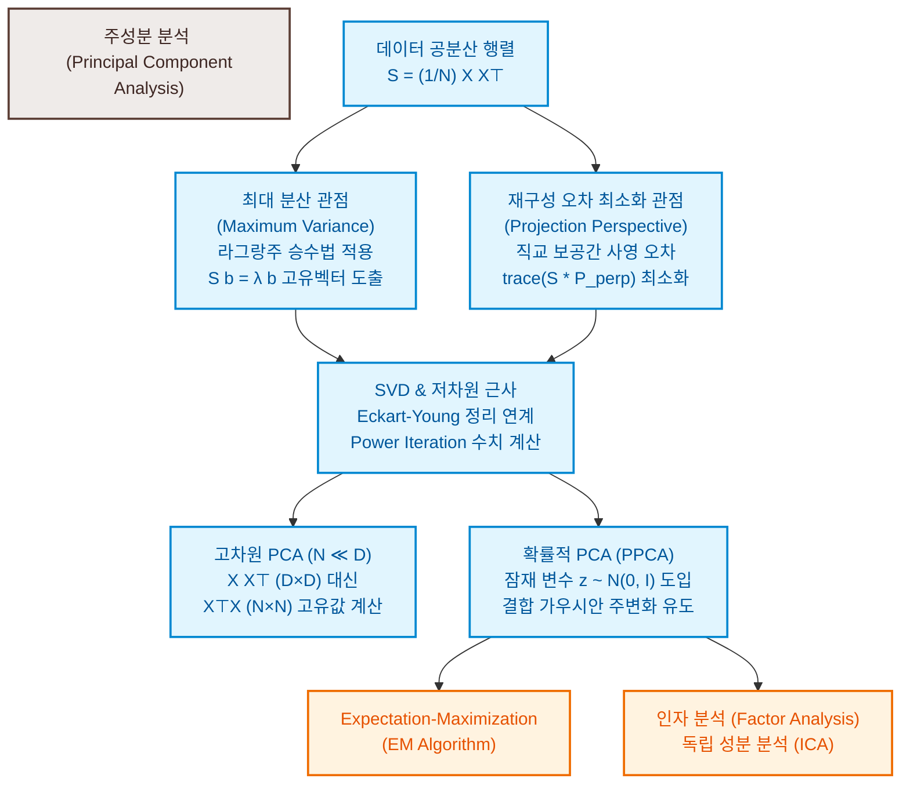

# 10. 주성분 분석을 통한 차원 축소 (Dimensionality Reduction with PCA)

이미지나 텍스트, 유전자 서열 데이터와 같이 고차원 데이터 공간 $\mathbb{R}^D$ 상에서 기계학습 모델을 직접 다루는 것은 여러 대수학적 난제(분석의 난해함, 시각화의 불가능성, 메모리 및 연산 비용의 폭증 등)를 수반합니다. 그러나 다행히도, 고차원 데이터의 실제 유효 차원은 데이터 열 간의 강한 상관관계(Correlation) 및 잉여성(Redundancy)으로 인해 고유한 저차원 부분공간 상에 국한되는 경향이 있습니다.

**차원 축소(Dimensionality Reduction)**는 데이터가 가진 내재적인 저차원 구조를 추출하여 정보 손실을 최소화하면서 컴팩트하게 압축하는 기술입니다. 본 장에서는 100년이 넘는 역사 동안 데이터 압축과 시각화의 표준 도구로 군림해 온 **주성분 분석(Principal Component Analysis, PCA)**을 최대 분산 보존 관점과 재구성 오차 최소화 관점, 그리고 확률적 잠재 변수 모델(PPCA) 관점에서 엄밀하게 도출합니다.

---

### [시각 자료] PCA 및 차원 축소 이론 마인드맵 (Figure 10.2)

PCA의 주요 수학적 도출 방식(분산 보존 및 투영 오차 최소화)과 이를 실제 고차원 환경 및 확률 모델로 확장하는 이론적 연계망을 보여줍니다.

---

# 10.1 문제 설정 (Problem Setting)

평균이 $\mathbf{0}$으로 센터링된 독립항등분포(i.i.d.) 데이터셋 $X = [\mathbf{x}_1, \dots, \mathbf{x}_N] \in \mathbb{R}^{D \times N}$이 주어졌다고 가정합니다.
(대수 연산의 가독성을 위해 본 장에서는 전통적인 $N \times D$ 행렬 대신, **데이터 개별 벡터가 열(Column) 벡터가 되는 $D \times N$ 차원의 디자인 행렬**을 정의하여 사용합니다.)

이 데이터셋의 경험적 **데이터 공분산 행렬(Data Covariance Matrix) $S \in \mathbb{R}^{D \times D}$**은 다음과 같이 정의됩니다.

$$S = \frac{1}{N} \sum_{n=1}^N \mathbf{x}_n \mathbf{x}_n^\top = \frac{1}{N} X X^\top \tag{10.1}$$

우리의 목표는 차원이 $M < D$인 저차원 부분공간 $U \subseteq \mathbb{R}^D$를 찾아, 고차원 데이터 $\mathbf{x}_n$을 이 공간으로 투영하는 것입니다. 부분공간 $U$의 정규직교 기저(Orthonormal basis) 벡터들을 열로 하는 투영 행렬 $B \in \mathbb{R}^{D \times M}$를 선언합니다.

$$B = [\mathbf{b}_1, \dots, \mathbf{b}_M] \in \mathbb{R}^{D \times M} \tag{10.3}$$

여기서 기저의 정규직교성 제약에 의해 $\mathbf{b}_i^\top \mathbf{b}_j = \delta_{ij}$ (즉, $B^\top B = I_M$)가 만족합니다.

* **인코딩 (Encoding / Compression)**: 고차원 데이터 $\mathbf{x}_n \in \mathbb{R}^D$를 저차원 공간의 좌표계인 코드(Code) $\mathbf{z}_n \in \mathbb{R}^M$로 매핑합니다.
  $$\mathbf{z}_n = B^\top \mathbf{x}_n \tag{10.2}$$
* **디코딩 (Decoding / Reconstruction)**: 코드 $\mathbf{z}_n$를 다시 본래의 고차원 데이터 공간으로 복원하여 재구성 벡터 $\tilde{\mathbf{x}}_n \in \mathbb{R}^D$를 계산합니다.
  $$\tilde{\mathbf{x}}_n = B \mathbf{z}_n = B B^\top \mathbf{x}_n \tag{10.28}$$

이 선형 변환 병목 경로(Figure 10.2의 Bottleneck) 상에서 정보 손실을 극소화하는 기저 $B$를 구해야 합니다.

---

# 10.2 최대 분산 관점 (Maximum Variance Perspective)

정보 이론적으로 데이터가 가진 유의미한 정보량이란 데이터의 흩어짐(Spread), 즉 **분산(Variance)**의 크기에 직결됩니다. 따라서 PCA는 저차원 공간으로 사영된 코드 $\mathbf{z}_n$들이 보존하는 분산의 총합을 극대화하는 방향으로 기저 벡터들을 순차적으로 도출합니다.

---

## 10.2.1 최대 분산의 첫 번째 주성분 유도

가장 먼저 저차원 코드의 첫 번째 축 성분인 $z_{1n} = \mathbf{b}_1^\top \mathbf{x}_n \in \mathbb{R}$의 경험적 분산 $V_1$을 극대화하는 단위 기저 벡터 $\mathbf{b}_1$을 찾아봅시다.

$$V_1 = \frac{1}{N} \sum_{n=1}^N z_{1n}^2 = \frac{1}{N} \sum_{n=1}^N (\mathbf{b}_1^\top \mathbf{x}_n)^2 \tag{10.7}$$

내적의 대칭성 $\mathbf{b}_1^\top \mathbf{x}_n = \mathbf{x}_n^\top \mathbf{b}_1$을 적용하여 식을 전개합니다.

$$V_1 = \frac{1}{N} \sum_{n=1}^N \mathbf{b}_1^\top \mathbf{x}_n \mathbf{x}_n^\top \mathbf{b}_1 = \mathbf{b}_1^\top \left( \frac{1}{N} \sum_{n=1}^N \mathbf{x}_n \mathbf{x}_n^\top \right) \mathbf{b}_1 = \mathbf{b}_1^\top S \mathbf{b}_1 \tag{10.9}$$

기저 벡터의 크기를 기하학적으로 $1$로 강제하지 않으면, $\mathbf{b}_1$의 크기를 무한히 키움으로써 분산이 겉보기상으로 계속 증가하게 됩니다. 따라서 단위 원 제약 조건 $\|\mathbf{b}_1\|^2 = 1$ 하에서 분산을 극대화하는 제약 최적화 문제를 정식화합니다.

$$\max_{\mathbf{b}_1} \mathbf{b}_1^\top S \mathbf{b}_1 \quad \text{subject to } \mathbf{b}_1^\top \mathbf{b}_1 = 1 \tag{10.10}$$

라그랑주 승수 $\lambda_1 \ge 0$를 도입하여 라그랑지안을 설계합니다.

$$\mathcal{L}(\mathbf{b}_1, \lambda_1) = \mathbf{b}_1^\top S \mathbf{b}_1 + \lambda_1 (1 - \mathbf{b}_1^\top \mathbf{b}_1) \tag{10.11}$$

이 식을 벡터 $\mathbf{b}_1$로 편미분하여 도함수를 구합니다.

$$\frac{\partial \mathcal{L}}{\partial \mathbf{b}_1} = 2 \mathbf{b}_1^\top S - 2\lambda_1 \mathbf{b}_1^\top$$

도함수를 행 벡터 $\mathbf{0}^\top$로 두고 전치하여 정리하면, 다음과 같은 고유값 방정식을 얻게 됩니다.

$$S \mathbf{b}_1 = \lambda_1 \mathbf{b}_1 \tag{10.13}$$

즉, 최적의 방향 벡터 $\mathbf{b}_1$은 데이터 공분산 행렬 $S$의 **고유벡터(Eigenvector)**이어야 하며, 라그랑주 승수 $\lambda_1$은 이에 해당하는 **고유값(Eigenvalue)**입니다. 이때 투영 공간 상의 분산의 정량적 크기는 다음과 같습니다.

$$V_1 = \mathbf{b}_1^\top S \mathbf{b}_1 = \lambda_1 \mathbf{b}_1^\top \mathbf{b}_1 = \lambda_1 \tag{10.15}$$

따라서 투영된 분산을 최대로 극대화하기 위해서는 공분산 행렬 $S$의 고유값들 중 **가장 크기가 큰 최대 고유값**에 대응하는 고유벡터를 기저로 선택해야 하며, 이를 **첫 번째 주성분(First Principal Component)**이라고 부릅니다.

---

## 10.2.2 $M$-차원 최대 분산 주성분 공간으로의 확장

이미 앞서 $m-1$개의 주성분 기저 벡터 $\{\mathbf{b}_1, \dots, \mathbf{b}_{m-1}\}$을 순차적으로 구해두었다고 가정합시다. $m$번째 새로운 주성분을 찾기 위해, 기존 주성분 공간으로 설명되는 성분을 원본 데이터에서 빼버린 잔차(Residual) 데이터 행렬 $\hat{X}$를 구성합니다.

$$\hat{X} = X - B_{m-1} X = (I - B_{m-1}) X \tag{10.17}$$

여기서 $B_{m-1} = \sum_{i=1}^{m-1} \mathbf{b}_i \mathbf{b}_i^\top$은 기존 주성분 부분공간으로 맵핑하는 사영 행렬입니다. 잔차 데이터의 공분산 행렬을 $\hat{S}$라고 정의할 때, 새로운 기저 $\mathbf{b}_m$은 다음 제약 최적화를 만족해야 합니다.

$$\max_{\mathbf{b}_m} \mathbf{b}_m^\top \hat{S} \mathbf{b}_m \quad \text{subject to } \mathbf{b}_m^\top \mathbf{b}_m = 1$$

이 최적화 문제의 해 역시 고유값 방정식 $\hat{S} \mathbf{b}_m = \lambda_m \mathbf{b}_m$을 충족해야 합니다. 이때 원래 공분산 행렬 $S$와 잔차 공분산 $\hat{S}$의 고유벡터 집합은 대수적으로 완전히 일치합니다.

* **대수적 증명**:
  사전 주성분 고유벡터 $\mathbf{b}_i$ ($i < m$)는 서로 직교하므로, 임의의 고유벡터 $\mathbf{b}_j$ ($j \ge m$)에 대해 $B_{m-1} \mathbf{b}_j = \mathbf{0}$이고, $i < m$인 기저에 대해서는 $B_{m-1} \mathbf{b}_i = \mathbf{b}_i$입니다. 이를 잔차 공분산 전개식에 대입합니다.
  $$\hat{S}\mathbf{b}_j = (S - S B_{m-1} - B_{m-1} S + B_{m-1} S B_{m-1})\mathbf{b}_j \tag{10.19}$$
  * $j \ge m$인 경우: $B_{m-1} \mathbf{b}_j = \mathbf{0}$이므로 우변은 $S \mathbf{b}_j = \lambda_j \mathbf{b}_j$가 되어 $\hat{S}\mathbf{b}_j = \lambda_j \mathbf{b}_j$가 성립합니다.
  * $i < m$인 경우: $B_{m-1} \mathbf{b}_i = \mathbf{b}_i$이므로 우변은 $S\mathbf{b}_i - S\mathbf{b}_i - S\mathbf{b}_i + S\mathbf{b}_i = \mathbf{0}$이 되어 고유값 $0$을 갖는 고유벡터가 됩니다.

즉, 잔차 공분산 행렬 $\hat{S}$의 최대 고유값에 대응하는 고유벡터 $\mathbf{b}_m$은 원래 공분산 행렬 $S$의 고유벡터들 중 **$m$번째로 큰 고유값**을 가지는 고유벡터가 됩니다.

결론적으로, $M$-차원 공간 상에서 정보 유실을 최소화하는 최적의 투영 행렬 $B$는 **공분산 행렬 $S$의 상위 $M$개 최대 고유값에 대응하는 고유벡터들**로 구성되어야 합니다.
* **보존된 총 분산**: $V_M = \sum_{m=1}^M \lambda_m \tag{10.24}$
* **손실된 총 분산**: $J_M = \sum_{j=M+1}^D \lambda_j = V_D - V_M \tag{10.25}$

---

# 10.3 재구성 오차 최소화 관점 (Projection Perspective)

두 번째 관점은 압축 해제 후 복원된 재구성 데이터 $\tilde{\mathbf{x}}_n = \sum_{m=1}^M z_{mn} \mathbf{b}_m$과 원래 데이터 $\mathbf{x}_n$ 사이의 유클리드 제곱 거리인 **재구성 오차(Reconstruction error)**를 최소화하는 방향으로 수식을 도출합니다.

$$J_M = \frac{1}{N} \sum_{n=1}^N \|\mathbf{x}_n - \tilde{\mathbf{x}_n}\|^2 \tag{10.29}$$

---

## 10.3.1 최적의 저차원 투영 좌표 ($z_{in}$)의 유도

정규직교 기저 기하를 고정한 상태에서, 재구성 오차를 최소화하는 개별 데이터의 좌표 $z_{in}$을 편미분을 통해 계산해 봅시다.

$$\frac{\partial J_M}{\partial z_{in}} = \frac{\partial J_M}{\partial \tilde{\mathbf{x}}_n} \frac{\partial \tilde{\mathbf{x}}_n}{\partial z_{in}} \tag{10.30a}$$

오차 거리를 재구성 벡터 $\tilde{\mathbf{x}}_n$로 미분합니다.

$$\frac{\partial J_M}{\partial \tilde{\mathbf{x}}_n} = -\frac{2}{N}(\mathbf{x}_n - \tilde{\mathbf{x}}_n)^\top \tag{10.30b}$$

재구성 식 (10.28)을 성분 $z_{in}$으로 미분하면, 해당 기저 벡터 $\mathbf{b}_i$만이 도출됩니다.

$$\frac{\partial \tilde{\mathbf{x}}_n}{\partial z_{in}} = \mathbf{b}_i \tag{10.30c}$$

이 둘을 합성하여 도함수 식을 완성합니다.

$$\frac{\partial J_M}{\partial z_{in}} = -\frac{2}{N}(\mathbf{x}_n - \tilde{\mathbf{x}}_n)^\top \mathbf{b}_i = -\frac{2}{N}\left( \mathbf{x}_n - \sum_{m=1}^M z_{mn} \mathbf{b}_m \right)^\top \mathbf{b}_i$$

기저의 정규직교성($\mathbf{b}_m^\top \mathbf{b}_i = \delta_{mi}$)을 활용하여 괄호를 분배합니다.

$$\frac{\partial J_M}{\partial z_{in}} = -\frac{2}{N}\big( \mathbf{x}_n^\top \mathbf{b}_i - z_{in} \mathbf{b}_i^\top \mathbf{b}_i \big) = -\frac{2}{N}\big( \mathbf{b}_i^\top \mathbf{x}_n - z_{in} \big)$$

이 도함수 값을 0으로 설정하면 최적의 투영 좌표가 엄밀히 유도됩니다.

$$z_{in}^* = \mathbf{b}_i^\top \mathbf{x}_n \tag{10.32}$$

기하학적으로, 이 공식은 원래의 점 $\mathbf{x}_n$을 부분공간으로 **직교 사영(Orthogonal projection)**하였을 때의 사영 계수 좌표입니다 (Figure 10.8 참조). 즉, 재구성 오차를 최소화하는 최적의 부호화 사상은 직교 사영 사상입니다.

---

## 10.3.2 최적의 주성분 기저 벡터 유도

최적 좌표 $z_{mn} = \mathbf{b}_m^\top \mathbf{x}_n$을 목적식에 역대입하여 재구성 오차 식을 다시 포장해 봅시다.
전체 공간 $\mathbb{R}^D$의 정규직교 기저 완비성(Completeness)에 기해 $\mathbf{x}_n = \sum_{d=1}^D (\mathbf{b}_d^\top \mathbf{x}_n)\mathbf{b}_d$로 쪼갤 수 있습니다. 따라서 오차 오프셋(displacement) 벡터 $\mathbf{x}_n - \tilde{\mathbf{x}}_n$는 다음과 같이 주성분 공간의 **직교 여공간(Orthogonal complement) 부분공간** 상에서의 투영 성분들의 합으로 수렴합니다 (Figure 10.9 참조).

$$\mathbf{x}_n - \tilde{\mathbf{x}}_n = \sum_{j=M+1}^D (\mathbf{b}_j^\top \mathbf{x}_n)\mathbf{b}_j \tag{10.38}$$

이 식을 재구성 오차 수식 (10.29)에 대입하고 기저의 정규직교성을 적용하여 전개합니다.

$$J_M = \frac{1}{N} \sum_{n=1}^N \left\| \sum_{j=M+1}^D (\mathbf{b}_j^\top \mathbf{x}_n)\mathbf{b}_j \right\|^2 = \frac{1}{N} \sum_{n=1}^N \sum_{j=M+1}^D (\mathbf{b}_j^\top \mathbf{x}_n)^2 \tag{10.42}$$

시그마 합의 기호를 교환하고 대칭성을 반영합니다.

$$J_M = \sum_{j=M+1}^D \mathbf{b}_j^\top \left( \frac{1}{N} \sum_{n=1}^N \mathbf{x}_n \mathbf{x}_n^\top \right) \mathbf{b}_j = \sum_{j=M+1}^D \mathbf{b}_j^\top S \mathbf{b}_j \tag{10.43}$$

이 수식은 재구성 오차의 크기가 **우리가 버리기로 선택한 버려진 차원들(직교 여공간) 상에서의 분산의 총합**과 같음을 보여줍니다. 
재구성 오차 $J_M$을 최소화하기 위해서는 이 버려진 영역의 분산 합을 극소화해야 하며, 이는 반대로 우리가 유지하는 주성분 공간의 분산을 극대화하는 것과 동치입니다. 

따라서 여공간의 기저 $\{\mathbf{b}_{M+1}, \dots, \mathbf{b}_D\}$는 공분산 행렬 $S$의 가장 작은 하위 고유값들에 해당하는 고유벡터로 채워져야 하고, 우리가 보존해야 할 주성분 기저 $\{\mathbf{b}_1, \dots, \mathbf{b}_M\}$은 **가장 큰 상위 $M$개의 고유값에 대응하는 고유벡터들**로 채워져야 합니다. 이 결과는 10.2절의 최대 분산 관점과 완벽하게 일치합니다.

---

# 10.4 고유벡터 계산과 저차원 행렬 근사

공분산 행렬 $S = \frac{1}{N} X X^\top$의 고유값 분해는 대수적으로 데이터 행렬 $X \in \mathbb{R}^{D \times N}$의 **특이값 분해(SVD)**와 직접 맞물립니다.

$$X = U \Sigma V^\top \tag{10.47}$$

이를 공분산 행렬 식에 대입하면 다음과 같습니다.

$$S = \frac{1}{N} X X^\top = \frac{1}{N} U \Sigma V^\top V \Sigma^\top U^\top = \frac{1}{N} U \Sigma \Sigma^\top U^\top \tag{10.48}$$

따라서 $S$의 고유벡터 행렬은 SVD의 좌측 특이 벡터 행렬 $U \in \mathbb{R}^{D \times D}$와 완벽하게 일치하며, 공분산의 고유값 $\lambda_d$는 특이값 $\sigma_d$와 다음과 같은 대수적 관계를 이룹니다.

$$\lambda_d = \frac{\sigma_d^2}{N} \tag{10.49}$$

이 성질은 PCA가 Eckart-Young 정리에 의거하여 데이터 행렬 $X$의 프로베니우스 노름 또는 스펙트럼 노름 하에서의 최적의 저차원 랭크-$M$ 근사 행렬 $\tilde{X}_M = U_M \Sigma_M V_M^\top$을 계산해내는 행위와 근본적으로 동치임을 증명합니다.

> [!TIP]
> **Power Iteration을 통한 단일 최대 고유벡터의 효율적 수치 계산**
> 데이터의 크기가 매우 커서 전체 고유값 분해를 수행하는 것이 비효율적이고 오직 최대 고유벡터 1개만 신속하게 필요한 경우, 수치 해석적 기법인 **Power Iteration**을 가해 연산량을 획기적으로 줄입니다.
> $$\mathbf{x}_{k+1} = \frac{S \mathbf{x}_k}{\|S \mathbf{x}_k\|} \tag{10.52}$$
> 초기 무작위 벡터 $\mathbf{x}_0$에서 출발하여 이 과정을 반복하면, 기하학적으로 행렬 $S$의 거듭제곱 작용에 의해 벡터의 방향이 최대 고유값의 축 방향으로 정렬되어 수렴하게 됩니다. 구글의 초기 PageRank 알고리즘이 웹페이지 순위를 매길 때 이 Power Iteration 기법을 사용하여 대규모 링크 행렬의 최대 고유벡터를 계산해 냈습니다.

---

# 10.5 고차원 데이터 환경 하에서의 PCA (High-Dimensional PCA)

이미지 데이터와 같이 특징 차원 $D$는 수만 개에 달하지만 확보된 샘플 데이터 개수 $N$은 수백 개에 불과한 **고차원-소표본 ($N \ll D$)** 환경을 고려해 봅시다.
이때 공분산 행렬 $S \in \mathbb{R}^{D \times D}$는 초대형 행렬이 되며, 이를 직접 고유값 분해하기 위해 수치 솔버를 가하면 연산 복잡도가 차원의 세제곱인 $\mathcal{O}(D^3)$에 비례하여 폭증하므로 실행 불가능 상태에 빠집니다.

이 문제를 대수적으로 극복하기 위해, $S$와 대수적 뼈대를 공유하는 훨씬 크기가 작은 $N \times N$ 차원의 행렬을 구성하여 풀이하는 기법을 유도해 봅시다.
원래 고유벡터 방정식은 다음과 같습니다.

$$\frac{1}{N} X X^\top \mathbf{b}_m = \lambda_m \mathbf{b}_m \tag{10.55}$$

이 식의 양변 왼쪽에 행렬 $X^\top \in \mathbb{R}^{N \times D}$을 곱합니다.

$$\frac{1}{N} X^\top X (X^\top \mathbf{b}_m) = \lambda_m (X^\top \mathbf{b}_m) \tag{10.56}$$

여기서 새로운 벡터 $\mathbf{c}_m = X^\top \mathbf{b}_m \in \mathbb{R}^N$을 선언합니다.

$$\left( \frac{1}{N} X^\top X \right) \mathbf{c}_m = \lambda_m \mathbf{c}_m \tag{10.56}$$

이 식은 크기가 $N \times N$에 불과한 소형 행렬 $\frac{1}{N} X^\top X$에 대한 고유값 문제 식입니다. 이 식을 풀어 고유값 $\lambda_m$과 저차원 고유벡터 $\mathbf{c}_m$을 신속하게 획득합니다. 
이후 본래 공간의 고유벡터 $\mathbf{b}_m$을 복원하기 위해 원래 식 (10.55)의 형태를 이용합니다. 양변 왼쪽에 $X$를 곱해 줍니다.

$$\frac{1}{N} X X^\top (X \mathbf{c}_m) = \lambda_m (X \mathbf{c}_m) \tag{10.57}$$

이 식은 $X\mathbf{c}_m$이 원래 공분산 행렬 $S$의 고유벡터임을 가리킵니다. 따라서 본래 공간의 단위 고유벡터 $\mathbf{b}_m$은 이 벡터를 크기로 나누어 정규화해 줌으로써 완벽히 복원됩니다.

$$\mathbf{b}_m = \frac{X \mathbf{c}_m}{\|X \mathbf{c}_m\|}$$

이 대수적 우회를 통해 연산 복잡도를 $\mathcal{O}(D^3)$에서 **$\mathcal{O}(N^3)$으로 대폭 절감**하여 매우 효율적으로 PCA를 수행할 수 있게 됩니다.

---

# 10.6 실무적인 PCA 수행 5단계 프로세스 (Figure 10.11)

실무에서 데이터셋에 PCA를 적용하여 압축 좌표를 획득하는 엄밀한 절차는 다음과 같이 5단계로 진행됩니다.

1. **평균 센터링 (Mean Centering)**:
   데이터의 경험적 평균 벡터 $\boldsymbol{\mu} = \frac{1}{N} \sum \mathbf{x}_n$을 계산하고, 모든 데이터 포인트에서 이를 빼내어 데이터의 평균 원점을 $\mathbf{0}$으로 조율합니다.
   $$\mathbf{x}_n \leftarrow \mathbf{x}_n - \boldsymbol{\mu}$$
2. **표준화 (Standardization)**:
   각 축 dimension의 스케일 크기에 의한 왜곡을 지우기 위해 축별 표준편차 $\sigma_d$로 값을 나누어 단위(Unit)를 통일시킵니다.
   $$x_n^{(d)} \leftarrow \frac{x_n^{(d)}}{\sigma_d}$$
3. **공분산 행렬 고유값 분해**:
   공분산 행렬 $S$를 계산하고, 고유값 분해를 통해 상위 $M$개의 최대 고유값에 대응하는 고유벡터들로 기저 행렬 $B = [\mathbf{b}_1, \dots, \mathbf{b}_M]$를 구성합니다.
4. **저차원 사영 좌표 추출**:
   임의의 데이터 $\mathbf{x}_*$를 동일 규격으로 전처리한 뒤, 기저 행렬과 내적하여 저차원 압축 코드 $\mathbf{z}_*$를 획득합니다.
   $$\mathbf{z}_* = B^\top \mathbf{x}_* \tag{10.60}$$
5. **재구성 및 전처리 환원 (Reconstruction & Un-standardization)**:
   저차원 코드를 본래 공간으로 재사영한 뒤, 전처리 과정을 역순으로 곱하고 더해주어 본래 축 스케일 상의 복원 이미지 $\tilde{\mathbf{x}}_*$를 조립합니다.
   $$\tilde{x}_*^{(d)} \leftarrow \tilde{x}_*^{(d)} \sigma_d + \mu_d \tag{10.61}$$

---

# 10.7 잠재 변수 관점의 확률적 PCA (Probabilistic PCA, PPCA)

비확률론적 PCA는 잡음이 뒤섞인 현실 데이터의 관측 신뢰도를 정량화할 수 없고, 유실된 유실 데이터 값을 복원하거나 새로운 데이터를 샘플링 생성해내는 등의 생성 모델(Generative model) 역할을 수행할 수 없습니다. 이를 보완하기 위해 잠재 변수 공간을 가우시안 확률 분포로 정의한 **확률적 PCA (PPCA)**를 구축합니다.

---

## 10.7.1 생성 메커니즘과 확률 모델

우리는 저차원 코드 좌표를 표준 가우시안 분포를 따르는 **잠재 확률 변수(Latent variable) $\mathbf{z} \in \mathbb{R}^M$**로 정의하고 사전 분포를 부여합니다.

$$p(\mathbf{z}) = \mathcal{N}(\mathbf{z} \mid \mathbf{0}, I_M) \tag{10.65}$$

그리고 저차원 잠재 공간에서 고차원 관측 공간 $\mathbb{R}^D$로 갈 때 선형 아핀 사상과 가우시안 관측 잡음 $\boldsymbol{\epsilon} \sim \mathcal{N}(\mathbf{0}, \sigma^2 I_D)$이 유입된다고 정식화합니다.

$$\mathbf{x} = B\mathbf{z} + \boldsymbol{\mu} + \boldsymbol{\epsilon} \tag{10.63}$$

따라서 잠재 변수 $\mathbf{z}$가 특정 위치로 결정되었을 때 관측값 $\mathbf{x}$가 목격될 **조건부 우도(Likelihood) 분포**는 다음과 같이 가우시안 분포로 선언됩니다.

$$p(\mathbf{x} \mid \mathbf{z}, B, \boldsymbol{\mu}, \sigma^2) = \mathcal{N}(\mathbf{x} \mid B\mathbf{z} + \boldsymbol{\mu}, \sigma^2 I_D) \tag{10.64}$$

이로써 조립된 잠재 변수 모델의 결합 확률 분포(Joint distribution) 식은 다음과 같습니다.

$$p(\mathbf{x}, \mathbf{z} \mid B, \boldsymbol{\mu}, \sigma^2) = p(\mathbf{x} \mid \mathbf{z}, B, \boldsymbol{\mu}, \sigma^2) p(\mathbf{z}) \tag{10.67}$$

---

## 10.7.2 주변 우도와 결합 가우시안 분포

모델의 최적 매개변수 $\{B, \boldsymbol{\mu}, \sigma^2\}$를 최대 우도법으로 구하기 위해, 식 (10.68b)의 잠재 변수 $\mathbf{z}$에 대한 적분(주변화) 연산을 가하여 주변 우도 $p(\mathbf{x} \mid B, \boldsymbol{\mu}, \sigma^2)$를 도출합니다.

$$p(\mathbf{x} \mid B, \boldsymbol{\mu}, \sigma^2) = \int_{\mathbf{z}} \mathcal{N}(\mathbf{x} \mid B\mathbf{z} + \boldsymbol{\mu}, \sigma^2 I_D) \mathcal{N}(\mathbf{z} \mid \mathbf{0}, I_M) d\mathbf{z} \tag{10.68}$$

이 적분식은 가우시안 선형 변환 성질 공식 (6.50, 6.51)에 기해 다음과 같이 해석적 가우시안 분포로 수렴합니다.
* **평균**: $\mathbb{E}[\mathbf{x}] = \mathbb{E}_{\mathbf{z}, \boldsymbol{\epsilon}}[B\mathbf{z} + \boldsymbol{\mu} + \boldsymbol{\epsilon}] = B\mathbf{0} + \boldsymbol{\mu} + \mathbf{0} = \boldsymbol{\mu}$
* **공분산 행렬**: 
  $$\mathbb{V}[\mathbf{x}] = \mathbb{V}_{\mathbf{z}}[B\mathbf{z}] + \mathbb{V}_{\boldsymbol{\epsilon}}[\boldsymbol{\epsilon}] = B \mathbb{V}[\mathbf{z}] B^\top + \sigma^2 I_D = B B^\top + \sigma^2 I_D$$

따라서 데이터 관측값의 주변 우도는 다음과 같이 정립됩니다.

$$p(\mathbf{x} \mid B, \boldsymbol{\mu}, \sigma^2) = \mathcal{N}\big( \mathbf{x} \mid \boldsymbol{\mu}, B B^\top + \sigma^2 I_D \big) \tag{10.70b}$$

나아가, 잠재 변수 $\mathbf{z}$와 관측 변수 $\mathbf{x}$ 사이의 크로스 공분산 $\mathbb{C}\text{ov}[\mathbf{x}, \mathbf{z}] = B \mathbb{V}[\mathbf{z}] = B$를 산출하면, PPCA 모델 하의 전체 결합 가우시안 분포(Joint Gaussian)를 명밀하게 도출할 수 있습니다.

$$p\left( \begin{bmatrix} \mathbf{x} \\ \mathbf{z} \end{bmatrix} \mathrel{\Bigg|} B, \boldsymbol{\mu}, \sigma^2 \right) = \mathcal{N}\left( \begin{bmatrix} \mathbf{x} \\ \mathbf{z} \end{bmatrix} \mathrel{\Bigg|} \begin{bmatrix} \boldsymbol{\mu} \\ \mathbf{0} \end{bmatrix}, \begin{bmatrix} B B^\top + \sigma^2 I_D & B \\ B^\top & I_M \end{bmatrix} \right) \tag{10.72}$$

---

## 10.7.3 사후 잠재 분포 (Posterior Distribution)

관측 데이터 $\mathbf{x}$를 목격하고 난 후, 역으로 잠재 공간 상에서의 분포를 추정하는 **잠재 사후 분포 $p(\mathbf{z} \mid \mathbf{x})$**는 결합 가우시안 분포식 (10.72)에 가우시안 조건부 공식 (6.65, 6.66)을 직접 적용하여 다음과 같이 즉각 산출됩니다.

$$p(\mathbf{z} \mid \mathbf{x}) = \mathcal{N}(\mathbf{z} \mid \mathbf{m}, C) \tag{10.73}$$

$$\mathbf{m} = B^\top (B B^\top + \sigma^2 I_D)^{-1} (\mathbf{x} - \boldsymbol{\mu}) \tag{10.74}$$

$$C = I_M - B^\top (B B^\top + \sigma^2 I_D)^{-1} B \tag{10.75}$$

사후 공분산 행렬 $C$의 행렬식(Determinant) 크기는 저차원 사영 위치의 불확실한 체적(부피)을 나타냅니다. 따라서 임의의 데이터가 유입되었을 때 $C$의 분산이 크게 요동친다면, 해당 데이터는 모델이 학습해 본 적 없는 이상치(Outlier) 내지 노벨티(Novelty) 데이터임을 통계적으로 판정해낼 수 있습니다.

---

# 10.8 요약 및 추천 도서 (Summary & Further Reading)

본 장에서는 차원 축소의 핵심 알고리즘인 PCA를 최대 분산과 투영 오차 최소화라는 두 가지 서로 다른 출발선에서 증명하고 이들이 고유벡터 문제로 일치함을 고찰하였습니다. SVD와 Eckart-Young 행렬 근사와의 긴밀한 동치 관계를 다루고, 고차원 소표본 환경 하에서 $N \times N$ 차원으로 행렬 연산을 축소하는 실무적인 해법을 규명하였습니다. 마지막으로 확률적 PCA(PPCA)를 구축하여 잠재 변수와 데이터 관측 우도의 주변화 및 추론 과정을 확률론적으로 유도하였습니다.

차원 축소 및 비선형 임베딩 기법의 심화 학습을 위해 다음 문헌들을 강력히 추천합니다.

1. **커널 PCA 및 비선형 차원 축소**:
   * Bernhard Schölkopf and Alexander J. Smola, *Learning with Kernels*, MIT Press, 2002. (데이터 내적 계산을 커널로 대체하여 복잡한 비선형 매니폴드를 평탄화하는 Kernel PCA의 대수 구조를 정립합니다.)
2. **다차원 척도법(MDS) 및 매니폴드 학습**:
   * Lawrence Cayton, "Algorithms for Manifold Learning", *Technical Report*, 2005. (Isomap, LLE, t-SNE 등 데이터의 비선형적인 위상 기하적 근접성을 보존하며 차원을 축소하는 마크다운 요약서입니다.)

---

# Citations
* Marc Peter Deisenroth, A. Aldo Faisal, and Cheng Soon Ong, *Mathematics for Machine Learning*, Cambridge University Press, 2020. (Chapter 10: Dimensionality Reduction with PCA)
* Michael E. Tipping and Christopher M. Bishop, "Probabilistic Principal Component Analysis", *Journal of the Royal Statistical Society*, 1999.
* Carl Eckart and Gale Young, "The approximation of one matrix by another of lower rank", *Psychometrika*, 1936.
* Neil D. Lawrence, "Probabilistic Non-linear Dimensionality Reduction as a Gaussian Process Latent Variable Model", *Journal of Machine Learning Research*, 2005.
