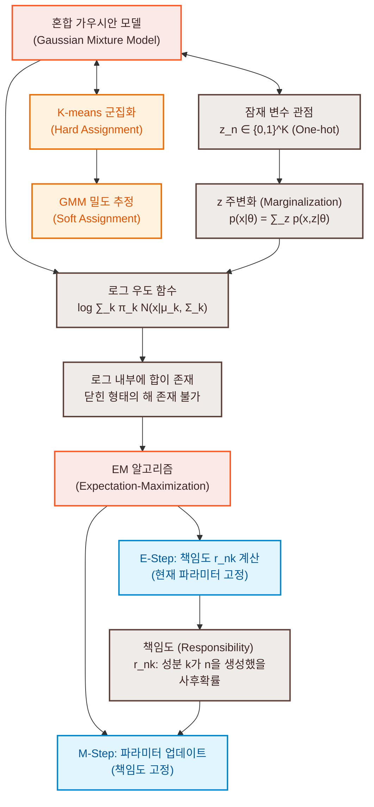

# 11. 혼합 가우시안 모델을 통한 밀도 추정 (Density Estimation with GMM)

기계학습의 3대 지지대 중 회귀 분석(Regression, 9장)과 차원 축소(Dimensionality Reduction, 10장)를 앞서 살펴보았습니다. 본 장에서는 세 번째 기둥에 해당하는 **밀도 추정(Density Estimation)**을 학습합니다. 

밀도 추정이란 주어진 데이터셋 $X = \{\mathbf{x}_1, \dots, \mathbf{x}_N\}$이 추출되었을 것으로 추정되는 미지의 참 확률 밀도 함수(Probability Density Function) $p(\mathbf{x})$를 수학적 모델을 통해 근사하는 과정입니다. 데이터를 컴팩트하게 요약하여 나타내는 대표적인 방법으로 파라미터 가족(Parametric family, 예: 가우시안 분포)을 정의하고, 8.3절에서 배운 최대 우도 추정(MLE)이나 최대 사후 확률 추정(MAP)을 활용하여 평균과 분산을 찾는 방식을 취합니다. 

그러나 단일 가우시안 분포(Single Gaussian Distribution)는 단봉형(Unimodal) 대칭 구조만을 표현할 수 있으므로, 다봉형(Multimodal) 분포나 복잡한 군집 구조를 지닌 실제 데이터(Figure 11.1과 같은 비볼록성 분포)를 표현하기에는 모델링 역량이 크게 제한됩니다. 이러한 한계를 극복하기 위해, 복수 개의 단순 기본 분포들의 볼록 조합(Convex combination)으로 더 강력한 표현력을 제공하는 **혼합 모델(Mixture Models)**, 그중에서도 각 성분이 가우시안 분포인 **혼합 가우시안 모델(Gaussian Mixture Model, GMM)**의 매개변수를 추정하는 체계적인 방법론을 다룹니다.

GMM의 최대 우도 추정은 선형 회귀나 PCA와 달리 대수적으로 닫힌 형태의 해(Closed-form solution)를 얻을 수 없으며, 매개변수 간의 상호 의존 관계를 유도한 뒤 반복적인 최적화를 수행하는 **기댓값 극대화(Expectation-Maximization, EM) 알고리즘**을 통해 수치적으로 수렴시킵니다.

---

### [시각 자료] 혼합 가우시안 모델(GMM) 및 EM 알고리즘의 수학적 관계도

GMM의 수학적 정의부터 시작하여, 우도 함수의 한계로 인한 EM 알고리즘 유도, 그리고 잠재 변수 관점과의 동치성을 보여주는 마인드맵입니다.



---

# 11.1 혼합 가우시안 모델 (Gaussian Mixture Model)

수학적으로 **혼합 모델(Mixture Model)**은 $K$개의 단순 기본 분포(Base distributions) $p_k(\mathbf{x})$의 **볼록 조합(Convex combination)**으로 전체 분포 $p(\mathbf{x})$를 구성합니다.

$$p(\mathbf{x}) = \sum_{k=1}^K \pi_k p_k(\mathbf{x}) \tag{11.1}$$

이때 혼합 계수 혹은 **혼합 가중치(Mixture weights)** $\pi_k$는 확률의 공리를 만족해야 하므로 다음의 제약 조건을 따릅니다.

$$0 \le \pi_k \le 1, \quad \sum_{k=1}^K \pi_k = 1 \tag{11.2}$$

기본 성분 분포 $p_k(\mathbf{x})$로서 가우시안 분포 $\mathcal{N}(\mathbf{x} | \boldsymbol{\mu}_k, \boldsymbol{\Sigma}_k)$를 선택한 것이 바로 **혼합 가우시안 모델(Gaussian Mixture Model, GMM)**입니다. GMM의 확률 밀도 함수는 다음과 같이 정의됩니다.

$$p(\mathbf{x} | \boldsymbol{\theta}) = \sum_{k=1}^K \pi_k \mathcal{N}(\mathbf{x} | \boldsymbol{\mu}_k, \boldsymbol{\Sigma}_k) \tag{11.3}$$

여기서 전체 매개변수 집합 $\boldsymbol{\theta}$는 각 성분의 가중치, 평균, 공분산 행렬들의 모임입니다.

$$\boldsymbol{\theta} := \{\boldsymbol{\mu}_k, \boldsymbol{\Sigma}_k, \pi_k : k = 1, \dots, K\}$$

GMM은 각각의 가우시안 성분들이 결합하여 단일 가우시안보다 훨씬 복잡하고 비대칭적인 다봉형 분포를 정밀하게 표현할 수 있게 합니다.

---

# 11.2 최대 우도를 통한 매개변수 학습 (Parameter Learning via Maximum Likelihood)

독립항등분포(i.i.d.) 가정에 기초하여 크기가 $N$인 데이터셋 $X = \{\mathbf{x}_1, \dots, \mathbf{x}_N\}$이 주어졌을 때, GMM의 우도 함수(Likelihood function) $p(X | \boldsymbol{\theta})$는 다음과 같이 개별 우도 항들의 곱으로 분해됩니다.

$$p(X | \boldsymbol{\theta}) = \prod_{n=1}^N p(\mathbf{x}_n | \boldsymbol{\theta}) = \prod_{n=1}^N \sum_{k=1}^K \pi_k \mathcal{N}(\mathbf{x}_n | \boldsymbol{\mu}_k, \boldsymbol{\Sigma}_k) \tag{11.9}$$

양변에 자연로그를 취하여 **로그 우도 함수(Log-likelihood function) $\mathcal{L}$**을 도출합니다.

$$\mathcal{L}(\boldsymbol{\theta}) = \log p(X | \boldsymbol{\theta}) = \sum_{n=1}^N \log \left( \sum_{k=1}^K \pi_k \mathcal{N}(\mathbf{x}_n | \boldsymbol{\mu}_k, \boldsymbol{\Sigma}_k) \right) \tag{11.10}$$

### 닫힌 형태 해(Closed-form solution)가 존재하지 않는 이유

단일 가우시안 모델의 경우(즉, $K=1$), 로그 함수가 지수 분포족인 가우시안의 지수 항과 바로 결합하여 로그 기호가 덧셈 연산 내부로 스며들 수 있습니다.

$$\log \mathcal{N}(\mathbf{x} | \boldsymbol{\mu}, \boldsymbol{\Sigma}) = -\frac{D}{2}\log(2\pi) - \frac{1}{2}\log\det(\boldsymbol{\Sigma}) - \frac{1}{2}(\mathbf{x} - \boldsymbol{\mu})^\top \boldsymbol{\Sigma}^{-1}(\mathbf{x} - \boldsymbol{\mu}) \tag{11.11}$$

이 경우 목적 함수가 이차 형식(Quadratic form)이 되므로, $\boldsymbol{\mu}$와 $\boldsymbol{\Sigma}$에 대해 미분하여 0으로 두는 단순 연산만으로 대수적인 닫힌 해를 쉽게 얻을 수 있습니다 (8장 참고).

반면 GMM ($K \ge 2$)의 로그 우도 함수 (11.10) 식에서는 **로그 기호 바로 오른쪽에 $K$개 성분의 덧셈 기호($\sum_{k=1}^K$)가 가로막고 있습니다.** 로그 함수는 덧셈에 대해 선형성을 가지지 않으므로($\log(a+b) \neq \log a + \log b$), 로그 기호를 덧셈 안으로 전개할 수 없습니다. 

따라서 미분을 수행할 때 체인 룰(Chain rule)에 의해 분모에 복잡한 가중합 $\sum_j \pi_j \mathcal{N}(\mathbf{x}_n | \boldsymbol{\mu}_j, \boldsymbol{\Sigma}_j)$이 위치하게 되고, 이는 모든 파라미터들이 고도로 얽혀 있는 복잡한 연립 방정식을 형성합니다. 이로 인해 분석적 기법(Analytic method)으로 한 번에 전역 최적해를 연산하는 것은 대수적으로 불가능하며, 수치적인 반복 갱신(Iterative update) 기법이 강제됩니다.

최적 조건의 정식화를 위해 목적 함수 $\mathcal{L}$에 대한 각 매개변수의 그레이디언트(Gradient)가 영벡터가 되는 필요조건을 수립합니다.

$$\frac{\partial \mathcal{L}}{\partial \boldsymbol{\mu}_k} = \mathbf{0}^\top, \quad \frac{\partial \mathcal{L}}{\partial \boldsymbol{\Sigma}_k} = \mathbf{0}, \quad \frac{\partial \mathcal{L}}{\partial \pi_k} = 0 \tag{11.12-11.14}$$

임의의 파라미터 $\boldsymbol{\theta}$에 대해 로그 우도 미분 구조를 전개하면 다음과 같은 형태가 요구됩니다.

$$\frac{\partial \log p(\mathbf{x}_n | \boldsymbol{\theta})}{\partial \boldsymbol{\theta}} = \frac{1}{p(\mathbf{x}_n | \boldsymbol{\theta})} \frac{\partial p(\mathbf{x}_n | \boldsymbol{\theta})}{\partial \boldsymbol{\theta}} \tag{11.15}$$

여기서 분모의 역수 항은 다음과 같습니다.

$$\frac{1}{p(\mathbf{x}_n | \boldsymbol{\theta})} = \frac{1}{\sum_{j=1}^K \pi_j \mathcal{N}(\mathbf{x}_n | \boldsymbol{\mu}_j, \boldsymbol{\Sigma}_j)} \tag{11.16}$$

이 구조에서 핵심 매개변수 갱신 가중치 역할을 하는 **책임도(Responsibility)**를 정의합니다.

---

## 11.2.1 책임도 (Responsibilities)

$n$번째 데이터 포인트 $\mathbf{x}_n$에 대해 $k$번째 가우시안 성분이 가지는 사후 점유 확률을 **책임도 $r_{nk}$**라고 정의합니다.

$$r_{nk} := \frac{\pi_k \mathcal{N}(\mathbf{x}_n | \boldsymbol{\mu}_k, \boldsymbol{\Sigma}_k)}{\sum_{j=1}^K \pi_j \mathcal{N}(\mathbf{x}_n | \boldsymbol{\mu}_j, \boldsymbol{\Sigma}_j)} \tag{11.17}$$

이 값은 해당 성분이 가지는 우도값 $\pi_k \mathcal{N}(\mathbf{x}_n | \boldsymbol{\mu}_k, \boldsymbol{\Sigma}_k)$의 상대적인 크기에 비례합니다.

* **확률 벡터적 성질**: 개별 데이터 포인트 $n$에 대해 책임도 벡터 $\mathbf{r}_n := [r_{n1}, \dots, r_{nK}]^\top \in \mathbb{R}^K$는 성분이 모두 양수이고 합이 1인 정규화된 확률 분포(Probability vector)를 이룹니다.
  $$\sum_{k=1}^K r_{nk} = 1, \quad r_{nk} \ge 0$$
* **부드러운 할당 (Soft assignment)**: 클러스터링 관점에서 이 확률 벡터는 데이터를 하나의 성분에 무조건 할당하는 '단단한 할당(Hard assignment)' 대신, 여러 성분에 확률적 무게를 나누어 배정하는 '부드러운 할당'의 성격을 갖습니다.
* **물리적 해석 (Gibbs/Boltzmann 분포)**: 통계물리학 관점에서 책임도 수식은 상태 에너지와 온도가 가미된 Gibbs 혹은 Boltzmann 분포의 수학적 구조와 일치합니다. 즉, 각 성분 가우시안과의 마할라노비스 거리(Mahalanobis distance) 제곱이 상태 에너지 역할을 하고, 정규화 분모는 분배 함수(Partition function) 역할을 하여 에너지 상태에 따라 확률 질량을 분배하는 것으로 해석할 수 있습니다.

---

## 11.2.2 평균의 갱신 (Updating the Means)

### 정리 11.1 (GMM 평균 갱신 공식)
책임도 $r_{nk}$가 주어진 상태에서 로그 우도를 극대화하는 GMM 평균 매개변수 $\boldsymbol{\mu}_k$의 최적 갱신값 $\boldsymbol{\mu}_k^{\text{new}}$는 다음과 같습니다.

$$\boldsymbol{\mu}_k^{\text{new}} = \frac{\sum_{n=1}^N r_{nk} \mathbf{x}_n}{\sum_{n=1}^N r_{nk}} \tag{11.20}$$

### 증명
로그 우도 함수 $\mathcal{L}$을 평균 벡터 $\boldsymbol{\mu}_k$에 대해 편미분해 봅시다. $p(\mathbf{x}_n | \boldsymbol{\theta})$의 합 기호 내에서 오직 $k$번째 성분만이 $\boldsymbol{\mu}_k$에 의존하므로,

$$\frac{\partial p(\mathbf{x}_n | \boldsymbol{\theta})}{\partial \boldsymbol{\mu}_k} = \frac{\partial}{\partial \boldsymbol{\mu}_k} \sum_{j=1}^K \pi_j \mathcal{N}(\mathbf{x}_n | \boldsymbol{\mu}_j, \boldsymbol{\Sigma}_j) = \pi_k \frac{\partial \mathcal{N}(\mathbf{x}_n | \boldsymbol{\mu}_k, \boldsymbol{\Sigma}_k)}{\partial \boldsymbol{\mu}_k} \tag{11.21a}$$

벡터 미분 공식 $\frac{\partial}{\partial \mathbf{s}} \exp(-\frac{1}{2}(\mathbf{y}-\mathbf{s})^\top \mathbf{W}(\mathbf{y}-\mathbf{s})) = \exp(\dots) (\mathbf{y}-\mathbf{s})^\top \mathbf{W}$를 적용하면,

$$\frac{\partial \mathcal{N}(\mathbf{x}_n | \boldsymbol{\mu}_k, \boldsymbol{\Sigma}_k)}{\partial \boldsymbol{\mu}_k} = (\mathbf{x}_n - \boldsymbol{\mu}_k)^\top \boldsymbol{\Sigma}_k^{-1} \mathcal{N}(\mathbf{x}_n | \boldsymbol{\mu}_k, \boldsymbol{\Sigma}_k)$$

따라서,

$$\frac{\partial p(\mathbf{x}_n | \boldsymbol{\theta})}{\partial \boldsymbol{\mu}_k} = \pi_k (\mathbf{x}_n - \boldsymbol{\mu}_k)^\top \boldsymbol{\Sigma}_k^{-1} \mathcal{N}(\mathbf{x}_n | \boldsymbol{\mu}_k, \boldsymbol{\Sigma}_k) \tag{11.21b}$$

이를 로그 우도의 합 미분 식 (11.15)에 대입합니다.

$$\frac{\partial \mathcal{L}}{\partial \boldsymbol{\mu}_k} = \sum_{n=1}^N \frac{1}{p(\mathbf{x}_n | \boldsymbol{\theta})} \frac{\partial p(\mathbf{x}_n | \boldsymbol{\theta})}{\partial \boldsymbol{\mu}_k} = \sum_{n=1}^N \frac{\pi_k \mathcal{N}(\mathbf{x}_n | \boldsymbol{\mu}_k, \boldsymbol{\Sigma}_k)}{\sum_{j=1}^K \pi_j \mathcal{N}(\mathbf{x}_n | \boldsymbol{\mu}_j, \boldsymbol{\Sigma}_j)} (\mathbf{x}_n - \boldsymbol{\mu}_k)^\top \boldsymbol{\Sigma}_k^{-1} \tag{11.22b}$$

가운데 분수 항을 앞서 정의한 책임도 $r_{nk}$로 치환하여 정리합니다.

$$\frac{\partial \mathcal{L}}{\partial \boldsymbol{\mu}_k} = \sum_{n=1}^N r_{nk} (\mathbf{x}_n - \boldsymbol{\mu}_k)^\top \boldsymbol{\Sigma}_k^{-1} \tag{11.22c}$$

최적점에서는 이 임계 편미분 벡터의 값이 영벡터 $\mathbf{0}^\top$가 되어야 합니다. 우도 극대화 조건 하의 평균 갱신값을 $\boldsymbol{\mu}_k^{\text{new}}$라 할 때, 정칙 행렬(Regular matrix)인 $\boldsymbol{\Sigma}_k^{-1}$을 우측에 곱하는 연산은 임계 조건에 영향을 주지 않으므로 식은 다음과 같이 정리됩니다.

$$\sum_{n=1}^N r_{nk} (\mathbf{x}_n - \boldsymbol{\mu}_k^{\text{new}})^\top = \mathbf{0}^\top \implies \sum_{n=1}^N r_{nk} \mathbf{x}_n^\top = \sum_{n=1}^N r_{nk} (\boldsymbol{\mu}_k^{\text{new}})^\top$$

양변을 전치하고 $\boldsymbol{\mu}_k^{\text{new}}$에 대해 정리하면,

$$\boldsymbol{\mu}_k^{\text{new}} = \frac{\sum_{n=1}^N r_{nk} \mathbf{x}_n}{\sum_{n=1}^N r_{nk}} = \frac{1}{N_k} \sum_{n=1}^N r_{nk} \mathbf{x}_n \tag{11.23}$$

여기서 $N_k$는 $k$번째 가우시안 성분이 전체 데이터셋에 대해 짊어지는 책임도의 총량입니다.

$$N_k := \sum_{n=1}^N r_{nk} \tag{11.24}$$

이로써 정리 11.1의 증명이 완료됩니다. 

이 식은 가우시안 성분 $k$의 평균 $\boldsymbol{\mu}_k$가 데이터 포인트 $\mathbf{x}_n$들을 책임도 $r_{nk}$의 강도로 끌어당기는 물리적 중력 모델로 직관화될 수 있습니다.

---

## 11.2.3 공분산의 갱신 (Updating the Covariances)

### 정리 11.2 (GMM 공분산 갱신 공식)
GMM의 공분산 행렬 $\boldsymbol{\Sigma}_k$의 최적 갱신값 $\boldsymbol{\Sigma}_k^{\text{new}}$는 다음과 같습니다.

$$\boldsymbol{\Sigma}_k^{\text{new}} = \frac{1}{N_k} \sum_{n=1}^N r_{nk} (\mathbf{x}_n - \boldsymbol{\mu}_k) (\mathbf{x}_n - \boldsymbol{\mu}_k)^\top \tag{11.30}$$

### 증명
로그 우도 함수 $\mathcal{L}$을 공분산 행렬 $\boldsymbol{\Sigma}_k$에 대해 편미분하기 위해 개별 항들을 분석합니다.

$$\frac{\partial \mathcal{L}}{\partial \boldsymbol{\Sigma}_k} = \sum_{n=1}^N \frac{1}{p(\mathbf{x}_n | \boldsymbol{\theta})} \frac{\partial p(\mathbf{x}_n | \boldsymbol{\theta})}{\partial \boldsymbol{\Sigma}_k} \tag{11.31}$$

마찬가지로 오직 $k$번째 성분만이 $\boldsymbol{\Sigma}_k$에 의존하므로,

$$\frac{\partial p(\mathbf{x}_n | \boldsymbol{\theta})}{\partial \boldsymbol{\Sigma}_k} = \pi_k \frac{\partial \mathcal{N}(\mathbf{x}_n | \boldsymbol{\mu}_k, \boldsymbol{\Sigma}_k)}{\partial \boldsymbol{\Sigma}_k} \tag{11.32a}$$

가우시안 분포의 명시적 공식인 $\mathcal{N}(\mathbf{x}_n | \boldsymbol{\mu}_k, \boldsymbol{\Sigma}_k) = (2\pi)^{-\frac{D}{2}} \det(\boldsymbol{\Sigma}_k)^{-\frac{1}{2}} \exp\left(-\frac{1}{2}(\mathbf{x}_n - \boldsymbol{\mu}_k)^\top \boldsymbol{\Sigma}_k^{-1}(\mathbf{x}_n - \boldsymbol{\mu}_k)\right)$을 대입하고 곱의 미분법(Product rule)을 적용합니다.

$$\frac{\partial \mathcal{N}}{\partial \boldsymbol{\Sigma}_k} = (2\pi)^{-\frac{D}{2}} \left[ \frac{\partial \det(\boldsymbol{\Sigma}_k)^{-\frac{1}{2}}}{\partial \boldsymbol{\Sigma}_k} \exp(\dots) + \det(\boldsymbol{\Sigma}_k)^{-\frac{1}{2}} \frac{\partial \exp(\dots)}{\partial \boldsymbol{\Sigma}_k} \right] \tag{11.32c}$$

여기에 행렬 미분 공식 (5.101) $\frac{\partial \det(\mathbf{A})^r}{\partial \mathbf{A}} = r \det(\mathbf{A})^r \mathbf{A}^{-1}$과 (5.103) $\frac{\partial \mathbf{a}^\top \mathbf{X}^{-1} \mathbf{a}}{\partial \mathbf{X}} = -\mathbf{X}^{-1} \mathbf{a} \mathbf{a}^\top \mathbf{X}^{-1}$을 도입합니다.

$$\frac{\partial \det(\boldsymbol{\Sigma}_k)^{-\frac{1}{2}}}{\partial \boldsymbol{\Sigma}_k} = -\frac{1}{2} \det(\boldsymbol{\Sigma}_k)^{-\frac{1}{2} } \boldsymbol{\Sigma}_k^{-1} \tag{11.33}$$

$$\frac{\partial}{\partial \boldsymbol{\Sigma}_k} \left( -\frac{1}{2} (\mathbf{x}_n - \boldsymbol{\mu}_k)^\top \boldsymbol{\Sigma}_k^{-1} (\mathbf{x}_n - \boldsymbol{\mu}_k) \right) = \frac{1}{2} \boldsymbol{\Sigma}_k^{-1} (\mathbf{x}_n - \boldsymbol{\mu}_k) (\mathbf{x}_n - \boldsymbol{\mu}_k)^\top \boldsymbol{\Sigma}_k^{-1} \tag{11.34}$$

이 두 미분식을 곱의 미분 전개식에 합산하여 묶어줍니다.

$$\frac{\partial p(\mathbf{x}_n | \boldsymbol{\theta})}{\partial \boldsymbol{\Sigma}_k} = \pi_k \mathcal{N}(\mathbf{x}_n | \boldsymbol{\mu}_k, \boldsymbol{\Sigma}_k) \left[ -\frac{1}{2} \boldsymbol{\Sigma}_k^{-1} + \frac{1}{2} \boldsymbol{\Sigma}_k^{-1} (\mathbf{x}_n - \boldsymbol{\mu}_k) (\mathbf{x}_n - \boldsymbol{\mu}_k)^\top \boldsymbol{\Sigma}_k^{-1} \right] \tag{11.35}$$

이를 (11.31) 식에 결합하여 로그 우도의 공분산 미분을 도출합니다.

$$\frac{\partial \mathcal{L}}{\partial \boldsymbol{\Sigma}_k} = \sum_{n=1}^N \frac{\pi_k \mathcal{N}(\mathbf{x}_n | \boldsymbol{\mu}_k, \boldsymbol{\Sigma}_k)}{p(\mathbf{x}_n | \boldsymbol{\theta})} \left[ -\frac{1}{2} \left( \boldsymbol{\Sigma}_k^{-1} - \boldsymbol{\Sigma}_k^{-1} (\mathbf{x}_n - \boldsymbol{\mu}_k) (\mathbf{x}_n - \boldsymbol{\mu}_k)^\top \boldsymbol{\Sigma}_k^{-1} \right) \right] \tag{11.36b}$$

앞부분의 분수 결합식을 책임도 $r_{nk}$로 변경합니다.

$$\frac{\partial \mathcal{L}}{\partial \boldsymbol{\Sigma}_k} = -\frac{1}{2} \sum_{n=1}^N r_{nk} \left[ \boldsymbol{\Sigma}_k^{-1} - \boldsymbol{\Sigma}_k^{-1} (\mathbf{x}_n - \boldsymbol{\mu}_k) (\mathbf{x}_n - \boldsymbol{\mu}_k)^\top \boldsymbol{\Sigma}_k^{-1} \right] \tag{11.36c}$$

이 편미분 행렬을 영행렬 $\mathbf{0}$으로 설정하는 기하학적 임계점 조건을 정식화합니다.

$$-\frac{1}{2} \boldsymbol{\Sigma}_k^{-1} \sum_{n=1}^N r_{nk} + \frac{1}{2} \boldsymbol{\Sigma}_k^{-1} \left( \sum_{n=1}^N r_{nk} (\mathbf{x}_n - \boldsymbol{\mu}_k) (\mathbf{x}_n - \boldsymbol{\mu}_k)^\top \right) \boldsymbol{\Sigma}_k^{-1} = \mathbf{0} \tag{11.36d}$$

양변의 왼쪽에 $2\boldsymbol{\Sigma}_k$를 곱하여 정리합니다.

$$- \left( \sum_{n=1}^N r_{nk} \right) \mathbf{I} + \left( \sum_{n=1}^N r_{nk} (\mathbf{x}_n - \boldsymbol{\mu}_k) (\mathbf{x}_n - \boldsymbol{\mu}_k)^\top \right) \boldsymbol{\Sigma}_k^{-1} = \mathbf{0}$$

$$\implies N_k \mathbf{I} = \left( \sum_{n=1}^N r_{nk} (\mathbf{x}_n - \boldsymbol{\mu}_k) (\mathbf{x}_n - \boldsymbol{\mu}_k)^\top \right) \boldsymbol{\Sigma}_k^{-1} \tag{11.37b}$$

양변의 오른쪽에 새로운 갱신값 $\boldsymbol{\Sigma}_k^{\text{new}}$를 행렬 곱하면 최적화된 공분산 갱신 공식이 명확하게 도출됩니다.

$$\boldsymbol{\Sigma}_k^{\text{new}} = \frac{1}{N_k} \sum_{n=1}^N r_{nk} (\mathbf{x}_n - \boldsymbol{\mu}_k) (\mathbf{x}_n - \boldsymbol{\mu}_k)^\top \tag{11.38}$$

이로써 정리 11.2가 대수적으로 엄밀하게 증명됩니다. 

이는 각 데이터가 평균으로부터 떨어진 외적(Outer product) 분산 행렬에 책임도를 곱하여 가중 평균한 경험적 공분산의 형태로 직관화됩니다.

---

## 11.2.4 혼합 가중치의 갱신 (Updating the Mixture Weights)

### 정리 11.3 (GMM 혼합 가중치 갱신 공식)
제약 조건 $\sum_{k=1}^K \pi_k = 1$ 하에서 로그 우도를 최대화하는 혼합 가중치 $\pi_k^{\text{new}}$는 다음과 같습니다.

$$\pi_k^{\text{new}} = \frac{N_k}{N} \tag{11.42}$$

### 증명
혼합 가중치 $\pi_k$는 단순 자유 매개변수가 아니며, 총합이 1이 되어야 하고 음수가 아니어야 한다는 강력한 등식 제약 조건을 내포하고 있습니다. 따라서 7.2절에서 다룬 **라그랑주 승수법(Lagrange Multipliers)**을 적용하여 제약 제어 목적 함수를 설계해야 합니다. 등식 제약 조건 $\sum_{k=1}^K \pi_k - 1 = 0$에 대한 라그랑주 승수 $\lambda$를 도입하여 라그랑지안(Lagrangian) $\mathcal{G}$를 구성합니다.

$$\mathcal{G}(\boldsymbol{\pi}, \lambda) = \mathcal{L}(\boldsymbol{\theta}) + \lambda \left( \sum_{k=1}^K \pi_k - 1 \right) \tag{11.43a}$$

$$\mathcal{G}(\boldsymbol{\pi}, \lambda) = \sum_{n=1}^N \log \left( \sum_{j=1}^K \pi_j \mathcal{N}(\mathbf{x}_n | \boldsymbol{\mu}_j, \boldsymbol{\Sigma}_j) \right) + \lambda \left( \sum_{k=1}^K \pi_k - 1 \right) \tag{11.43b}$$

이 라그랑지안을 특정 가중치 $\pi_k$에 대해 편미분합니다.

$$\frac{\partial \mathcal{G}}{\partial \pi_k} = \sum_{n=1}^N \frac{\mathcal{N}(\mathbf{x}_n | \boldsymbol{\mu}_k, \boldsymbol{\Sigma}_k)}{\sum_{j=1}^K \pi_j \mathcal{N}(\mathbf{x}_n | \boldsymbol{\mu}_j, \boldsymbol{\Sigma}_j)} + \lambda \tag{11.44a}$$

수식 전개를 위해 첫 번째 항의 분자와 분모에 $\pi_k$를 곱해 줍니다.

$$\frac{\partial \mathcal{G}}{\partial \pi_k} = \frac{1}{\pi_k} \sum_{n=1}^N \frac{\pi_k \mathcal{N}(\mathbf{x}_n | \boldsymbol{\mu}_k, \boldsymbol{\Sigma}_k)}{\sum_{j=1}^K \pi_j \mathcal{N}(\mathbf{x}_n | \boldsymbol{\mu}_j, \boldsymbol{\Sigma}_j)} + \lambda = \frac{1}{\pi_k} \sum_{n=1}^N r_{nk} + \lambda = \frac{N_k}{\pi_k} + \lambda \tag{11.44b}$$

최적점에서는 이 그레이디언트 값과 라그랑주 승수 편미분 값이 모두 0이 되어야 합니다.

$$\frac{N_k}{\pi_k} + \lambda = 0 \implies \pi_k = -\frac{N_k}{\lambda} \tag{11.46}$$

이 식을 제약 조건 $\sum_{k=1}^K \pi_k = 1$에 대입하여 $\lambda$를 풀어냅니다.

$$\sum_{k=1}^K \left( -\frac{N_k}{\lambda} \right) = 1 \implies -\frac{1}{\lambda} \sum_{k=1}^K N_k = 1$$

이때 전체 성분에 대한 책임도 총량의 합은 다음과 같이 총 데이터 수 $N$과 대수적으로 동치입니다.
$$\sum_{k=1}^K N_k = \sum_{k=1}^K \sum_{n=1}^N r_{nk} = \sum_{n=1}^N \sum_{k=1}^K r_{nk} = \sum_{n=1}^N 1 = N$$

따라서,

$$-\frac{N}{\lambda} = 1 \implies \lambda = -N \tag{11.48}$$

구해진 $\lambda = -N$을 원래의 (11.46) 식에 대입하면 최적의 가중치 갱신 공식이 엄밀하게 유도됩니다.

$$\pi_k^{\text{new}} = \frac{N_k}{N} \tag{11.49}$$

이로써 정리 11.3의 증명이 완료됩니다. 

각 가우시안 성분의 가중치는 해당 성분이 데이터들에 대해 행사한 총 책임도 분율($N_k / N$)로 최적화됨을 알 수 있습니다.

---

# 11.3 EM 알고리즘 (Expectation-Maximization Algorithm)

앞서 도출한 모든 매개변수 업데이트 식(평균, 공분산, 가중치)이 우변의 책임도 $r_{nk}$에 고도로 의존하고 있으며, 책임도 역시 좌변의 모든 매개변수들의 복잡한 함수라는 딜레마(Mutual dependency)에 봉착합니다. 이를 조율하기 위해 두 단계를 교차 갱신하는 **기댓값 극대화(EM) 알고리즘**을 도입합니다.

```
                  ┌────────────────────────┐
                  │   Initialize Parameters │
                  │     μ_k, Σ_k, π_k      │
                  └───────────┬────────────┘
                              │
            ┌─────────────────┴─────────────────┐
            ▼                                   ▼
   ┌────────────────────────────────┐  ┌────────────────────────────────┐
   │    E-step (Expectation)        │  │      M-step (Maximization)     │
   │                                │  │                                │
   │ Current parameters 고정        │  │ E-step에서 구한 책임도 고정    │
   │ 모든 x_n의 책임도 r_nk 계산    │  │ 파라미터(μ, Σ, π) 순차적 갱신 │
   │                                │  │                                │
   │     r_nk ∝ π_k N(x_n|μ_k,Σ_k)  │  │      μ_k <- Weighted Mean      │
   │                                │  │      Σ_k <- Weighted Cov       │
   │                                │  │      π_k <- N_k / N            │
   └────────────────┬───────────────┘  └────────────────▲───────────────┘
                    │                                   │
                    └───────────────────────────────────┘
                             (Iterate to Convergence)
```

1. **초기화(Initialization)**: 매개변수 $\boldsymbol{\mu}_k, \boldsymbol{\Sigma}_k, \pi_k$의 초기값을 임의로 설정합니다 (통상 K-means 결과 활용).
2. **기댓값 단계 (E-step)**: 현재 설정된 모델 파라미터를 고정한 상태에서, 모든 데이터 포인트 $\mathbf{x}_n$에 대해 각 성분 $k$가 가지는 책임도 $r_{nk}$를 계산합니다.
   $$r_{nk} = \frac{\pi_k \mathcal{N}(\mathbf{x}_n | \boldsymbol{\mu}_k, \boldsymbol{\Sigma}_k)}{\sum_{j=1}^K \pi_j \mathcal{N}(\mathbf{x}_n | \boldsymbol{\mu}_j, \boldsymbol{\Sigma}_j)} \tag{11.53}$$
3. **극대화 단계 (M-step)**: E-step에서 계산해 둔 책임도 $r_{nk}$ 값을 상수처럼 고정한 상태에서, 로그 우도를 최대화하는 신규 파라미터 값들을 계산합니다.
   $$\boldsymbol{\mu}_k^{\text{new}} = \frac{1}{N_k} \sum_{n=1}^N r_{nk} \mathbf{x}_n \tag{11.54}$$
   $$\boldsymbol{\Sigma}_k^{\text{new}} = \frac{1}{N_k} \sum_{n=1}^N r_{nk} (\mathbf{x}_n - \boldsymbol{\mu}_k^{\text{new}}) (\mathbf{x}_n - \boldsymbol{\mu}_k^{\text{new}})^\top \tag{11.55}$$
   $$\pi_k^{\text{new}} = \frac{N_k}{N} \tag{11.56}$$
4. **수렴 판정(Convergence check)**: 매 반복 주기마다 로그 우도 $\mathcal{L}$을 모니터링하여 변동량이 임계값 이하로 작아지면 수렴한 것으로 판단하여 종료합니다. EM 알고리즘의 매 단계는 로그 우도 함수를 단조 증가(Monotonically increase)시킴이 증명되어 있습니다.

---

# 11.4 잠재 변수 관점 (Latent-Variable Perspective)

GMM을 수학적으로 보다 엄밀하고 우아하게 정식화하는 방법은 관측되지 않는 숨겨진 변수인 **이산 잠재 변수(Discrete latent variable) $\mathbf{z}$**를 명시적으로 도입하는 것입니다. PCA가 연속적인 잠재 변수를 다룬 것과 달리, GMM은 이산적인 잠재 범주 변수를 다룹니다.

---

## 11.4.1 생성 프로세스 및 확률 모델 (Generative Process)

각 데이터 포인트 $\mathbf{x}$가 $K$개의 가우시안 중 정확히 단 하나의 가우시안 성분으로부터 생성되었다고 가정합시다. 이를 나타내기 위해 다음과 같은 성질을 갖는 **이진 지시 변수(Binary indicator variable) $\mathbf{z} \in \{0, 1\}^K$**를 정의합니다.

$$\mathbf{z} = [z_1, \dots, z_K]^\top \in \{0, 1\}^K, \quad \sum_{k=1}^K z_k = 1$$

즉, $\mathbf{z}$는 단 하나의 원소만 1이고 나머지는 모두 0인 **원-핫 인코딩(One-hot encoding / 1-of-K representation)** 벡터입니다. 만약 $k$번째 가우시안에서 데이터가 생성되었다면 $z_k = 1$이 성립합니다.

* **조건부 데이터 생성 확률**: 잠재 지시 벡터의 $k$번째 원소가 1로 활성화되었을 때, 데이터가 관측될 조건부 분포는 해당 가우시안 성분을 따릅니다.
  $$p(\mathbf{x} | z_k = 1) = \mathcal{N}(\mathbf{x} | \boldsymbol{\mu}_k, \boldsymbol{\Sigma}_k) \tag{11.58}$$
* **잠재 변수의 사전 분포 (Prior)**: 잠재 변수 $\mathbf{z}$ 자체에 대한 사전 확률은 혼합 가중치 벡터 $\boldsymbol{\pi}$로 주어지는 멀티누이(Multinoulli / Categorical) 분포를 따릅니다.
  $$p(\mathbf{z}) = \boldsymbol{\pi} = [\pi_1, \dots, \pi_K]^\top \implies p(z_k = 1) = \pi_k \tag{11.59-11.60}$$
* **조상 샘플링 (Ancestral Sampling)**: 이 생성 모델 관점(Figure 11.11의 그래픽 모델 참고)을 활용하면 복잡한 GMM 분포로부터 데이터를 매우 쉽게 샘플링할 수 있습니다.
  1. 사전 분포 $p(\mathbf{z})$로부터 카테고리 샘플 $\mathbf{z}^{(i)}$를 추출합니다 (특정 성분 $k$가 선택됨).
  2. 선택된 성분의 조건부 가우시안 분포 $p(\mathbf{x} | \mathbf{z}^{(i)})$로부터 데이터 관측값 $\mathbf{x}^{(i)}$를 추출합니다.

결합 확률 분포(Joint probability distribution) $p(\mathbf{x}, \mathbf{z})$는 확률의 곱셈 정리에 의해 사전 분포와 조건부 분포의 곱으로 완전하게 명시됩니다.

$$p(\mathbf{x}, z_k = 1) = p(\mathbf{x} | z_k = 1) p(z_k = 1) = \pi_k \mathcal{N}(\mathbf{x} | \boldsymbol{\mu}_k, \boldsymbol{\Sigma}_k) \tag{11.61}$$

이를 벡터 전체로 확장하면 다음과 같이 각 성분의 가중 가우시안 확률들의 모임이 됩니다.

$$p(\mathbf{x}, \mathbf{z}) = \begin{bmatrix} p(\mathbf{x}, z_1 = 1) \\ \vdots \\ p(\mathbf{x}, z_K = 1) \end{bmatrix} = \begin{bmatrix} \pi_1 \mathcal{N}(\mathbf{x} | \boldsymbol{\mu}_1, \boldsymbol{\Sigma}_1) \\ \vdots \\ \pi_K \mathcal{N}(\mathbf{x} | \boldsymbol{\mu}_K, \boldsymbol{\Sigma}_K) \end{bmatrix} \tag{11.62}$$

---

## 11.4.2 우도 (Likelihood)

우리가 관측할 수 있는 것은 오직 관측 데이터 $\mathbf{x}$뿐이며 잠재 변수 $\mathbf{z}$는 관측 불가능하므로, 모델의 주변 우도(Marginal likelihood)를 구하기 위해 잠재 변수를 **주변화(Marginalization)**하여 제거해야 합니다.

$$p(\mathbf{x} | \boldsymbol{\theta}) = \sum_{\mathbf{z}} p(\mathbf{x}, \mathbf{z} | \boldsymbol{\theta}) = \sum_{\mathbf{z}} p(\mathbf{x} | \mathbf{z}, \boldsymbol{\theta}) p(\mathbf{z} | \boldsymbol{\theta}) \tag{11.63}$$

$\mathbf{z}$가 가질 수 있는 유효한 모든 상태(원-핫 벡터들)에 대해 합을 수행하는 것은 결국 1의 값을 가지는 인덱스 $k$를 1부터 $K$까지 순차적으로 대입하며 더하는 것과 대수적으로 일치합니다.

$$p(\mathbf{x} | \boldsymbol{\theta}) = \sum_{k=1}^K p(\mathbf{x} | z_k = 1, \boldsymbol{\theta}) p(z_k = 1 | \boldsymbol{\theta}) = \sum_{k=1}^K \pi_k \mathcal{N}(\mathbf{x} | \boldsymbol{\mu}_k, \boldsymbol{\Sigma}_k) \tag{11.66b}$$

이 주변 우도 수식은 앞서 직관적으로 정의했던 GMM의 정의 식 (11.3)과 수학적으로 완벽하게 일치합니다. 즉, 잠재 변수 모델로 정식화하는 것과 원래의 혼합 모델 정의는 완벽한 동치 관계에 있습니다.

---

## 11.4.3 사후 분포 (Posterior Distribution)

베이즈 정리(Bayes' theorem)를 사용해 관측값 $\mathbf{x}$가 주어졌을 때 잠재 변수 $\mathbf{z}$의 조건부 사후 확률 $p(z_k = 1 | \mathbf{x})$를 도출해 봅시다.

$$p(z_k = 1 | \mathbf{x}) = \frac{p(z_k = 1) p(\mathbf{x} | z_k = 1)}{p(\mathbf{x})} = \frac{\pi_k \mathcal{N}(\mathbf{x} | \boldsymbol{\mu}_k, \boldsymbol{\Sigma}_k)}{\sum_{j=1}^K \pi_j \mathcal{N}(\mathbf{x} | \boldsymbol{\mu}_j, \boldsymbol{\Sigma}_j)} \tag{11.69}$$

이 공식은 우리가 앞서 직관적으로 정의했던 **책임도 $r_{nk}$의 정의 식 (11.17)과 수학적으로 일치**합니다. 

이로써 단순한 가중치 분율로 취급했던 책임도가 사실은 **"데이터 $\mathbf{x}$가 관측되었을 때, 이 데이터가 $k$번째 가우시안 성분으로부터 나왔을 사후 확률(Posterior probability)"**이라는 엄밀한 베이지안 수학적 정당성을 획득하게 됩니다.

---

## 11.4.4 전체 데이터셋으로의 확장 (Extension to a Full Dataset)

데이터셋 $X = \{\mathbf{x}_1, \dots, \mathbf{x}_N\}$의 각 개별 데이터 $\mathbf{x}_n$마다 고유한 독립적 잠재 변수 $\mathbf{z}_n = [z_{n1}, \dots, z_{nK}]^\top \in \{0, 1\}^K$이 매핑됩니다 (Figure 11.12 플레이트 표기법 참고). 

사전 분포 $\boldsymbol{\pi}$는 모든 데이터 포인트가 공유하며, 각 데이터의 사후 분포 역시 베이즈 정리에 의해 동일하게 책임도 $r_{nk}$로 수렴합니다.

$$p(z_{nk} = 1 | \mathbf{x}_n) = r_{nk} \tag{11.72b}$$

---

## 11.4.5 EM 알고리즘의 재해석 (EM Algorithm Revisited)

잠재 변수 관점에서 EM 알고리즘은 관측 불가능한 잠재 변수 $\mathbf{z}$에 대해 참 사후 분포 $p(\mathbf{z} | X, \boldsymbol{\theta}^{(t)})$를 가중치로 사용하는 로그 우도 함수의 기댓값을 정의하고 최적화하는 과정으로 해석됩니다.

### E-step (Expectation)
현재 파라미터 $\boldsymbol{\theta}^{(t)}$ 하에서 잠재 변수 $\mathbf{z}$의 조건부 사후 분포에 대한 결합 로그 우도 $\log p(X, \mathbf{z} | \boldsymbol{\theta})$의 조건부 기댓값 함수 $Q(\boldsymbol{\theta} | \boldsymbol{\theta}^{(t)})$를 구성합니다.

$$Q(\boldsymbol{\theta} | \boldsymbol{\theta}^{(t)}) = \mathbb{E}_{\mathbf{z} | X, \boldsymbol{\theta}^{(t)}} \left[ \log p(X, \mathbf{z} | \boldsymbol{\theta}) \right] = \sum_{\mathbf{z}} p(\mathbf{z} | X, \boldsymbol{\theta}^{(t)}) \log p(X, \mathbf{z} | \boldsymbol{\theta}) \tag{11.73a-11.73b}$$

i.i.d. 조건 하에서 개별 데이터에 대해 합으로 정리하면 다음과 같습니다.

$$Q(\boldsymbol{\theta} | \boldsymbol{\theta}^{(t)}) = \sum_{n=1}^N \sum_{k=1}^K r_{nk}^{(t)} \left[ \log \pi_k + \log \mathcal{N}(\mathbf{x}_n | \boldsymbol{\mu}_k, \boldsymbol{\Sigma}_k) \right]$$

### M-step (Maximization)
이 기댓값 함수 $Q$를 최대로 만족하는 새로운 매개변수 $\boldsymbol{\theta}^{(t+1)}$을 선택합니다.

$$\boldsymbol{\theta}^{(t+1)} = \arg\max_{\boldsymbol{\theta}} Q(\boldsymbol{\theta} | \boldsymbol{\theta}^{(t)})$$

이 최적화 과정은 라그랑주 제약을 수반하는 미분 계산을 거쳐 앞서 11.2절에서 유도한 갱신 식들과 완벽히 일치하게 됩니다.

---

# 11.5 추가 정보 및 관련 방법론 (Further Reading)

## K-means와의 관계 (Hard vs. Soft Clustering)

GMM은 널리 알려진 군집화 알고리즘인 K-means와 수학적으로 매우 깊은 유대 관계를 맺고 있습니다. GMM의 각 성분의 평균 $\boldsymbol{\mu}_k$를 군집의 중심점으로 바라볼 수 있습니다. 

* **공분산 행렬의 축소**: 만약 모든 가우시안 성분의 공분산 행렬을 단위 행렬의 상수배 형태인 $\sigma^2 \mathbf{I}$로 통일하고 분산 $\sigma^2 \to 0$으로 수축시킨다면, 책임도 $r_{nk}$는 가장 가까운 중심점에 대해서만 1을 가지고 나머지는 모두 0이 되는 원-핫 지시 함수(Indicator function)로 변환됩니다.
* **의사 결정 방식의 차이**: K-means는 가장 가까운 중심점에 데이터를 무조건 100% 매핑하는 **단단한 결정(Hard assignment)** 방식을 채택하는 반면, GMM은 데이터의 밀도 경계면에서 확률적 비율로 부드럽게 점유율을 나누는 **부드러운 결정(Soft assignment)** 방식을 취해 기하학적 형태 유연성이 훨씬 뛰어납니다.

---

## 최대 우도 추정의 한계: 특이점 및 과적합 (Singularity & Overfitting)

GMM을 EM을 통한 최대 우도법으로 학습할 때 다음과 같은 두 가지 심각한 수학적 결함이 발생할 수 있습니다.

1. **특이점 문제 (Singularity / Likelihood Collapse)**: 특정 가우시안 성분 $k$의 평균 $\boldsymbol{\mu}_k$가 우연히 단 하나의 데이터 포인트 $\mathbf{x}_n$의 값과 정확히 일치하고($\boldsymbol{\mu}_k = \mathbf{x}_n$), 해당 성분의 분산 $\sigma_k^2$이 0으로 수축하게 되면($\sigma_k^2 \to 0$), 해당 데이터에 대한 우도값이 무한대($\infty$)로 치솟아 전체 우도 합이 발산하게 됩니다. 이는 수치 연산 장치에서 오버플로우를 발생시키는 요인입니다.
2. **베이지안 기법의 대안**: 이 문제를 해결하기 위해 매개변수 자체에 Prior를 설정하는 베이지안 GMM(Bayesian GMM) 기법이 활용됩니다. 매개변수 $\boldsymbol{\mu}, \boldsymbol{\Sigma}, \boldsymbol{\pi}$에 디리클레(Dirichlet) 및 위샤트(Wishart) 등의 켤레 사전 분포(Conjugate Prior)를 도입하면 특이점 발산을 방지할 수 있습니다. 다만 이 경우 사후 분포가 더 이상 닫힌 형태로 계산되지 않으므로, **변분 추론(Variational Inference, VI)** 등의 근사 기법을 이용하여 근사 사후 분포를 갱신해야 합니다.

---

## 비모수 밀도 추정 (Non-parametric Density Estimation)

GMM은 $K$라는 고정된 성분의 개수를 가정하는 모수적 기법입니다. 이와 대조적으로 사전에 데이터 분포 모양을 제한하지 않는 대표적인 **비모수적 밀도 추정(Non-parametric density estimation)** 방법론으로 히스토그램과 커널 밀도 추정이 존재합니다.

```
       [ 히스토그램 (Histogram) ]                   [ 커널 밀도 추정 (KDE) ]
       
    Height                                     Density
      ▲        ┌───┐                             ▲            .---.
      │        │   │                             │         .-/     \-.
      │    ┌───┤   │                             │       ./           \.
      │  ┌─┤   │   ├───┐                         │      /               \
      │  │ │   │   │   │                         │     /     .----.      \
      │  │ │   │   │   │                         │    /     /      \      \
      └──┴─┴───┴───┴───┴───►                     └───┴────┴──────┴──────┴───►
             Bins (구간)                                  xn (개별 데이터 포인트)
      
      - 공간을 균일 구간(Bin)으로 분할           - 모든 데이터 포인트 xn에 커널 배치
      - 구간 내 데이터 빈도 비례하여 기둥 배치   - 각 점의 커널 함수 합산 및 정규화
      - 불연속적인 계단형 형태                  - 대역폭 h에 따른 부드러운 곡선
```

### 1. 히스토그램 (Histogram)
가장 역사가 길고 직관적인 비모수적 추정법입니다. 데이터를 특정 간격의 격자 구간(Bin)으로 분할하고, 각 구간 안에 떨어지는 데이터 개수를 카운트하여 그 높이를 기둥 형태로 시각화합니다.
* **한계**: 구간의 경계면에서 확률 밀도가 뚝뚝 끊기는 불연속성을 나타내며, 격자 크기(Bin width) 및 격자 원점 설정에 따라 분포 형태가 극도로 왜곡되는 한계가 있습니다.

### 2. 커널 밀도 추정 (Kernel Density Estimation, KDE)
히스토그램의 불연속성 문제를 해결하기 위해, 개별 데이터 포인트 $\mathbf{x}_n$ 마다 미분 가능하고 부드러운 대칭 형태의 **커널 함수(Kernel function) $k(\cdot)$**를 얹은 뒤 이들의 평균합으로 전체 밀도를 구성합니다.

$$p(\mathbf{x}) = \frac{1}{N h^D} \sum_{n=1}^N k\left( \frac{\mathbf{x} - \mathbf{x}_n}{h} \right) \tag{11.74}$$

* **커널 제약 조건**: 커널 함수 $k(\mathbf{u})$는 수학적으로 모든 영역에서 음수가 아니어야 하며, 전체 공간에 대한 적분값이 1이어야 밀도 함수의 조건을 충족합니다.
  $$k(\mathbf{u}) \ge 0, \quad \int_{\mathbb{R}^D} k(\mathbf{u}) d\mathbf{u} = 1$$
  대표적으로 가우시안 커널 $k(\mathbf{u}) = (2\pi)^{-\frac{D}{2}} \exp(-\frac{1}{2}\|\mathbf{u}\|^2)$이 널리 쓰입니다.
* **대역폭(Bandwidth) $h$**: 대역폭 파라미터 $h > 0$는 평활도(Smoothness)를 조절하는 초매개변수입니다. $h$가 너무 작으면 각각의 데이터 포인트 위에서 커널이 뾰족하게 솟아 과적합(Overfitting/Under-smoothing)이 발생하고, $h$가 너무 크면 세부 정보를 다 뭉개버려 과소적합(Underfitting/Over-smoothing)이 초래됩니다.

---

# Citations
* Deisenroth, M. P., Faisal, A. A., & Ong, C. S. (2020). *Mathematics for Machine Learning*. Cambridge University Press. [mml-book.pdf](../../../raw/notes/math_for_deeplearning/mml-book.pdf)
