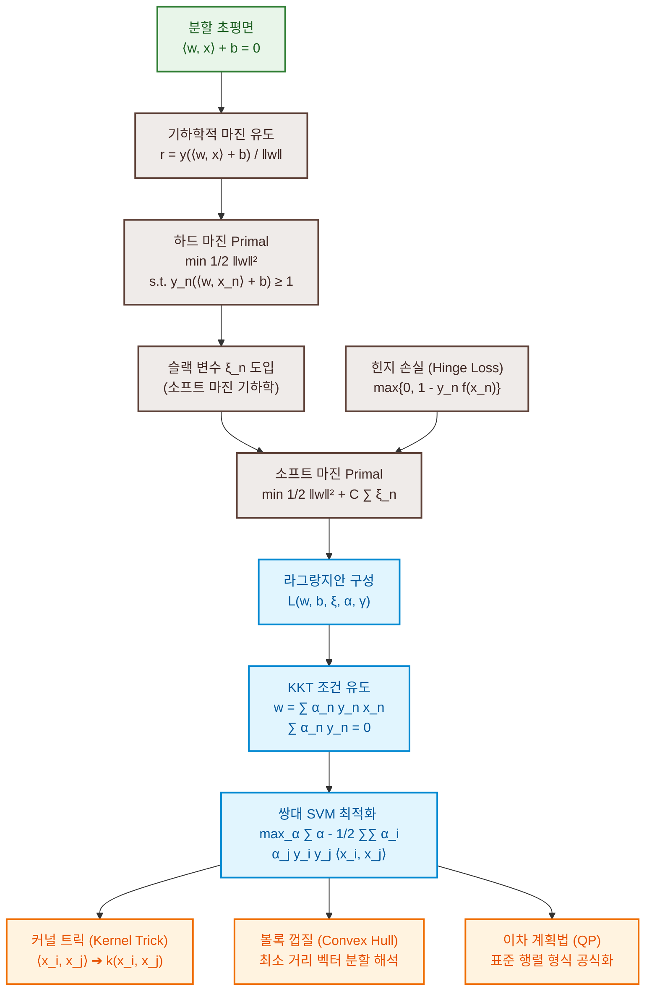

# 12. 서포트 벡터 머신을 통한 분류 (Classification with SVM)

실세계의 많은 데이터 의사 결정 상황에서 기계학습 알고리즘은 이산적인(Discrete) 결과를 예측하도록 요구받습니다. 예를 들어 스팸 메일 분류(정상 vs. 스팸)와 같은 이진 결과 예측이나, 천체 망원경의 관측 데이터를 은하, 항성, 행성 등으로 구분하는 다중 분류 등이 대표적입니다. 본 장에서는 예측의 결과값이 가장 기본 형태인 이진(Binary)으로 주어지는 **이진 분류(Binary Classification)** 문제를 집중하여 다룹니다. 

이진 분류 문제에서 타겟 클래스 레이블의 집합은 수학적으로 편의상 $\{+1, -1\}$로 선언됩니다.

$$f : \mathbb{R}^D \to \{+1, -1\} \tag{12.1}$$

본 장에서 다루는 **서포트 벡터 머신(Support Vector Machine, SVM)**은 지도 학습(Supervised Learning) 하에서 이진 분류를 해결하는 최적의 기하학적 방법론입니다. 9장의 선형 회귀가 확률적 우도 극대화(MLE)와 베이지안 추론에 기반했다면, SVM은 **기하학적 투영(Geometric Projections)과 벡터 내적** 개념을 바탕으로 분할 경계면을 수학적으로 도출합니다. 또한, 대수적인 분석적 닫힌 해가 존재하지 않으므로 7장에서 학습한 라그랑주 쌍대성(Lagrange Duality)과 수치 최적화 도구를 적극적으로 활용하게 됩니다.

---

### [시각 자료] SVM 이론 및 수식 유도 체계도 (Figure 12.2)

SVM 최적화 문제의 Primal 수립부터 Dual 변환, 커널 확장 및 수치적 해결책에 이르는 이론적 흐름을 보여주는 마인드맵입니다.



---

# 12.1 분할 초평면 (Separating Hyperplanes)

데이터를 분류하기 위해 공간을 분할하는 가장 기본적이고 직관적인 도구는 **초평면(Hyperplane)**입니다. 초평면은 $D$차원 공간 상에서 차원이 $D-1$인 아핀 부분공간(Affine subspace)으로 정의됩니다 (2.8절 참고).

매개변수 벡터 $\mathbf{w} \in \mathbb{R}^D$와 편향(Intercept) $b \in \mathbb{R}$에 의해 제어되는 초평면 방정식은 다음과 같습니다.

$$\{ \mathbf{x} \in \mathbb{R}^D : f(\mathbf{x}) = \langle \mathbf{w}, \mathbf{x} \rangle + b = 0 \} \tag{12.3}$$

### 대수학적 법선 벡터(Normal vector) 증명

초평면의 매개변수 $\mathbf{w}$가 초평면과 수직을 이루는 법선 벡터(Normal vector)임을 대수학적으로 규명해 봅시다. 초평면 상에 존재하는 임의의 두 데이터 포인트 $\mathbf{x}_a$와 $\mathbf{x}_b$를 선택합니다. 이 두 점은 초평면 위에 있으므로 정의에 의해 다음 조건이 만족됩니다.

$$f(\mathbf{x}_a) = \langle \mathbf{w}, \mathbf{x}_a \rangle + b = 0 \tag{12.4a}$$
$$f(\mathbf{x}_b) = \langle \mathbf{w}, \mathbf{x}_b \rangle + b = 0$$

두 식의 차이를 구하고 내적의 선형성(Bilinearity)을 이용해 괄호를 묶어 정리합니다.

$$f(\mathbf{x}_a) - f(\mathbf{x}_b) = \langle \mathbf{w}, \mathbf{x}_a \rangle + b - (\langle \mathbf{w}, \mathbf{x}_b \rangle + b) = 0$$
$$\implies \langle \mathbf{w}, \mathbf{x}_a - \mathbf{x}_b \rangle = 0 \tag{12.4b}$$

두 벡터의 내적값이 0이라는 것은 기하학적으로 두 벡터가 직교(Orthogonal)함을 지칭합니다. 초평면 위의 두 점을 잇는 변위 벡터 $\mathbf{x}_a - \mathbf{x}_b$는 초평면과 나란한 방향의 임의의 선분입니다. 따라서 가중치 벡터 $\mathbf{w}$는 초평면 상의 임의의 직선과 직교하므로, **초평면 전체에 수직인 법선 벡터**가 됨이 명백하게 증명됩니다.

---

### 부호 제약 조건의 통합

새로운 테스트 샘플 $\mathbf{x}_{\text{test}}$가 입력되었을 때, 분류 예측값은 초평면을 기준으로 어느 쪽에 배치되는지에 따라 결정됩니다. 즉, $f(\mathbf{x}_{\text{test}}) \ge 0$이면 $+1$ 클래스로, $f(\mathbf{x}_{\text{test}}) < 0$이면 $-1$ 클래스로 매핑합니다.

지도 학습의 분류 훈련 목표는 모든 양성 데이터($y_n = +1$)는 초평면 위에, 음성 데이터($y_n = -1$)는 초평면 아래에 오게끔 정렬하는 것입니다.

$$\langle \mathbf{w}, \mathbf{x}_n \rangle + b \ge 0 \quad (\text{if } y_n = +1) \tag{12.5}$$
$$\langle \mathbf{w}, \mathbf{x}_n \rangle + b < 0 \quad (\text{if } y_n = -1) \tag{12.6}$$

이 두 개의 서로 다른 부등식 조건은 참 레이블 값인 $y_n \in \{+1, -1\}$을 식 전체에 양방향 곱해 줌으로써 하나의 단일 조건 부등식으로 간결하게 병합됩니다.

$$y_n (\langle \mathbf{w}, \mathbf{x}_n \rangle + b) \ge 0 \tag{12.7}$$

---

# 12.2 주 원시 서포트 벡터 머신 (Primal Support Vector Machine)

데이터셋이 선형 분할 가능하다면, 두 클래스를 완벽히 가르는 초평면은 기하학적으로 무한히 많이 존재할 수 있습니다 (Figure 12.3). 이 중 최적의 고유한 솔루션을 결정하기 위해 경계면과 가장 가까운 점 사이의 여유 공간인 **마진(Margin)**을 극대화하는 규칙을 고안합니다.

---

## 12.2.1 마진의 개념과 수학적 유도

초평면 $\langle \mathbf{w}, \mathbf{x} \rangle + b = 0$이 있고, 양의 영역에 데이터 포인트 $\mathbf{x}_a$가 위치해 있다고 가정합시다. 점 $\mathbf{x}_a$와 초평면 사이의 최단 기하학적 거리 $r > 0$을 직교 사영(Orthogonal Projection, 3.8절) 기법으로 도출합니다.

```
                  x_a (임의의 고차원 데이터 점)
                  o
                 /│
                / │
               /  │  Distance r
              /   │
             /    ▼ 
            /─────o  x'_a (초평면 위의 최단 사영 점)
    ───────/────────────────────────────────────
          /  ⟨w, x⟩ + b = 0 (초평면)
         /
        ▼ w (Normal vector, 법선 벡터)
```

$\mathbf{x}_a$에서 초평면 방향으로 내린 최단 사영 벡터 점을 $\mathbf{x}'_a$라 합시다. 법선 벡터 $\mathbf{w}$의 방향을 따라 기하학적으로 분해하면 다음과 같이 표현됩니다.

$$\mathbf{x}_a = \mathbf{x}'_a + r \frac{\mathbf{w}}{\|\mathbf{w}\|} \tag{12.8}$$

여기서 $\frac{\mathbf{w}}{\|\mathbf{w}\|}$는 크기가 1인 단위 법선 벡터이며, $r$은 사영된 스칼라 거리입니다. 점 $\mathbf{x}'_a$는 초평면 위에 올라와 있으므로 초평면 만족 조건(12.11)을 따릅니다.

$$\langle \mathbf{w}, \mathbf{x}'_a \rangle + b = 0 \tag{12.11}$$

식 (12.8)을 $\mathbf{x}'_a$에 관해 대수적으로 정리합니다.

$$\mathbf{x}'_a = \mathbf{x}_a - r \frac{\mathbf{w}}{\|\mathbf{w}\|}$$

이 식을 초평면 만족 조건 (12.11)의 내부 변수에 대입합니다.

$$\left\langle \mathbf{w}, \mathbf{x}_a - r \frac{\mathbf{w}}{\|\mathbf{w}\|} \right\rangle + b = 0 \tag{12.12}$$

내적의 선형 분배 법칙을 가해 전개합니다.

$$\langle \mathbf{w}, \mathbf{x}_a \rangle + b - r \frac{\langle \mathbf{w}, \mathbf{w} \rangle}{\|\mathbf{w}\|} = 0 \tag{12.13}$$

대수적 정의에 의해 $\langle \mathbf{w}, \mathbf{w} \rangle = \|\mathbf{w}\|^2$이 성립하므로 세 번째 스칼라 항은 $\frac{r \|\mathbf{w}\|^2}{\|\mathbf{w}\|} = r \|\mathbf{w}\|$로 약분됩니다.

$$\langle \mathbf{w}, \mathbf{x}_a \rangle + b - r \|\mathbf{w}\| = 0$$
$$\implies r = \frac{\langle \mathbf{w}, \mathbf{x}_a \rangle + b}{\|\mathbf{w}\|} \tag{12.14}$$

양성과 음성을 모두 포함한 임의의 점 $\mathbf{x}_n$에 대해서는 클래스 레이블 $y_n$을 분자에 곱해 절대적인 기하학적 마진 거리를 산출합니다.

$$r_n = \frac{y_n(\langle \mathbf{w}, \mathbf{x}_n \rangle + b)}{\|\mathbf{w}\|}$$

가장 거리가 가까운 포인트에서의 임계 마진을 $r$이라 할 때, 마진 극대화 최적화 문제는 다음과 같이 정식화됩니다.

$$\max_{\mathbf{w}, b, r} r \quad \text{subject to } y_n(\langle \mathbf{w}, \mathbf{x}_n \rangle + b) \ge r, \quad \|\mathbf{w}\| = 1, \quad r > 0 \tag{12.10}$$

---

## 12.2.2 전통적 마진 최대화 최적화 문제로의 변환

상기 최적화 문제에서는 법선 벡터의 노름 크기를 1로 고정하는 제약 조건 $\|\mathbf{w}\| = 1$이 가해져 있어 연산이 번거롭습니다. 이를 우회하기 위해 데이터의 스케일을 인위적으로 조정하는 기하학적 스케일링 규칙을 정의합니다.

가장 가까운 데이터 포인트 $\mathbf{x}_n$에 대해 결정 경계 함수의 점수를 1이 되도록 전체 좌표 스케일을 정규화합니다.

$$y_n(\langle \mathbf{w}, \mathbf{x}_n \rangle + b) = 1$$

이렇게 임계 마진 상의 점들의 값을 1로 스케일링하게 되면 최단 사영 점과의 점수차가 $1 - 0 = 1$이 됩니다. 앞서 증명한 기하학적 거리 도출 식에 분자값 1을 대입하면, 실제 물리적 마진 거리 $r$은 다음과 같이 심플하게 축소됩니다.

$$r = \frac{1}{\|\mathbf{w}\|} \tag{12.14}$$

이 조건 하에서 임계 마진 거리인 $1 / \|\mathbf{w}\|$를 최대화하는 것은 수학적으로 공칭 파라미터의 제곱 노름인 $\|\mathbf{w}\|^2$을 최소화하는 것과 동치입니다. 목적 함수의 도함수 정리를 위해 스케일링 상수 $1/2$을 추가하여 최적화 문제를 수립합니다.

$$\min_{\mathbf{w}, b} \frac{1}{2} \|\mathbf{w}\|^2 \quad \text{subject to } y_n(\langle \mathbf{w}, \mathbf{x}_n \rangle + b) \ge 1, \quad \forall n = 1, \dots, N \tag{12.18-12.19}$$

이 식을 어떠한 오차나 마진 침범도 절대 허용하지 않는 강력한 최적화 기준이라는 의미에서 **하드 마진 SVM (Hard Margin SVM)**이라고 지칭합니다.

---

## 12.2.3 마진 스케일 고정의 동치성 증명

### 정리 12.1 (두 마진 최적화 문제의 수학적 동치성)
단위 구 제약 조건 하에서 마진을 최대화하는 문제 (12.20)과 마진 점수를 1로 고정하고 가중치 크기를 최소화하는 문제 (12.21)은 대수학적으로 완벽히 동일한 매개변수 해를 도출합니다.

### 증명
식 (12.20)의 극대화 문제에서 목적 함수를 단조 증가 변환인 제곱 형식 $r^2$로 전환하고 정규화 조건 $\|\mathbf{w}\| = 1$을 적용하여 다음의 원시 정식화를 구성합니다.

$$\max_{\mathbf{w}, b, r} r^2 \quad \text{subject to } y_n\left(\left\langle \frac{\mathbf{w}}{\|\mathbf{w}\|}, \mathbf{x}_n \right\rangle + b\right) \ge r, \quad r > 0 \tag{12.22}$$

여기서 $r > 0$이므로 제약 식의 양변을 $r$로 나눌 수 있습니다.

$$\max_{\mathbf{w}, b, r} r^2 \quad \text{subject to } y_n\left(\left\langle \frac{\mathbf{w}}{\|\mathbf{w}\| r}, \mathbf{x}_n \right\rangle + \frac{b}{r}\right) \ge 1 \tag{12.23}$$

여기서 비정규화 가중치 벡터 $\mathbf{w}''$와 편향 $b''$를 다음과 같이 새롭게 선언하여 파라미터를 치환합니다.

$$\mathbf{w}'' := \frac{\mathbf{w}}{\|\mathbf{w}\| r}, \quad b'' := \frac{b}{r}$$

치환된 벡터 $\mathbf{w}''$의 유클리드 노름 크기를 대수적으로 전개합니다.

$$\|\mathbf{w}''\| = \left\| \frac{\mathbf{w}}{\|\mathbf{w}\|} \frac{1}{r} \right\| = \frac{1}{r} \left\| \frac{\mathbf{w}}{\|\mathbf{w}\|} \right\| = \frac{1}{r} \cdot 1 = \frac{1}{r} \tag{12.24}$$

따라서 $r = 1 / \|\mathbf{w}''\|$가 성립하므로, 원래의 극대화 목적식인 $r^2$은 치환된 변수에 관해 다음과 같이 포장됩니다.

$$\max_{\mathbf{w}'', b''} \frac{1}{\|\mathbf{w}''\|^2} \quad \text{subject to } y_n (\langle \mathbf{w}'', \mathbf{x}_n \rangle + b'') \ge 1 \tag{12.25}$$

대수적으로 목적 함수의 역수 값을 극대화하는 최적화 방향은 원래 함수의 값을 최소화하는 방향과 정확히 합치합니다. 따라서 이는 다음과 같이 축소 재정의되며 정리 12.1의 증명이 완성됩니다.

$$\min_{\mathbf{w}'', b''} \frac{1}{2} \|\mathbf{w}''\|^2 \quad \text{subject to } y_n (\langle \mathbf{w}'', \mathbf{x}_n \rangle + b'') \ge 1$$

---

## 12.2.4 소프트 마진 SVM: 기하학적 관점 (Soft Margin SVM)

실제 현업 데이터 환경에서는 데이터 분포 경계선에 노이즈나 아웃라이어가 섞여 있어 하드 마진 경계 제약 조건을 충족하는 해가 애당초 존재하지 않을 수 있습니다 (Figure 12.6(b)). 이 경우 마진 경계선의 일부 침범을 허용하는 **소프트 마진 SVM (Soft Margin SVM)**을 도입합니다.

이를 위해 각 데이터 포인트 $n$마다 개별적인 마진 이탈 거리 오차인 **슬랙 변수(Slack Variable) $\xi_n \ge 0$**을 허용 오차 매개변수로 추가 정의합니다 (Figure 12.7).

```
                      x_n (마진을 침범한 포인트)
         ⟨w, x⟩ + b = 1 ────o──────
                            │
                            │ Slack ξ_n (마진 경계선으로부터의 이탈 오차)
                            ▼
         ⟨w, x⟩ + b = 1 - ξ_n ────o──────
```

완화된 제약식은 마진 점수 1에서 슬랙 오차 $\xi_n$을 삭감하는 형식으로 설계됩니다.

$$y_n(\langle \mathbf{w}, \mathbf{x}_n \rangle + b) \ge 1 - \xi_n \tag{12.26b}$$

슬랙 변수가 한도 끝도 없이 증가하여 오차가 폭증하는 것을 막기 위해, 목적 함수에 오차의 단순 가중 합을 추가하여 패널티를 부여합니다.

$$\min_{\mathbf{w}, b, \boldsymbol{\xi}} \frac{1}{2} \|\mathbf{w}\|^2 + C \sum_{n=1}^N \xi_n \tag{12.26a}$$
$$\text{subject to } y_n(\langle \mathbf{w}, \mathbf{x}_n \rangle + b) \ge 1 - \xi_n, \quad \xi_n \ge 0, \quad \forall n = 1, \dots, N \tag{12.26b-12.26c}$$

여기서 초매개변수 **$C > 0$은 규제 조절 인자(Regularization parameter)**입니다. 
* **$C$의 강도**: $C$가 매우 크면 오차 슬랙에 대한 패널티가 커지므로 오차가 최소화되지만 마진 폭이 좁아지는 하드 마진에 근사합니다. 반대로 $C$가 매우 작으면 마진 폭을 넓히는 대신 대다수의 데이터가 마진 내부로 들어오는 슬랙 이탈을 비교적 너그럽게 허용합니다.

---

## 12.2.5 소프트 마진 SVM: 손실 함수 관점 (Loss Function View)

소프트 마진 SVM의 기하학적 제약 수식은 통계적 기계학습의 근간인 **경험적 위험 최소화(Empirical Risk Minimization, ERM)** 프레임워크 내에서 특수한 손실 함수를 통한 비제약 최적화 문제로 완전히 동일하게 재정의될 수 있습니다.

이때 활용되는 최적의 손실 함수를 **힌지 손실(Hinge Loss)**이라고 명명합니다.

$$\ell(t) = \max\{0, 1 - t\} \quad \text{where } t = y_n f(\mathbf{x}_n) = y_n(\langle \mathbf{w}, \mathbf{x}_n \rangle + b) \tag{12.28}$$

힌지 손실은 예측 신뢰 점수 $t$가 1 이상(즉, 마진 바깥 올바른 영역)일 때는 오차가 0이며, 마진 내부나 잘못된 클래스 경계로 침범할수록 오차가 1차 선형 비례 형식으로 일정하게 가중되는 특수한 절선 형태의 볼록 함수(Convex function)입니다 (Figure 12.8).

전체 훈련 데이터셋에 대해 $L_2$ 규제 항을 더해 비제약 목적 함수를 설계합니다.

$$\min_{\mathbf{w}, b} \frac{1}{2} \|\mathbf{w}\|^2 + C \sum_{n=1}^N \max\{0, 1 - y_n(\langle \mathbf{w}, \mathbf{x}_n \rangle + b)\} \tag{12.31}$$

### 기하학적 제약식과의 수학적 동치성 증명

이 비제약 목적 함수가 앞선 기하학적 제약식 (12.26)과 동일함을 규명하기 위해, 임의의 스칼라 $t$에 대한 힌지 손실 최소화 항을 슬랙 $\xi$로 치환해 봅시다.

$$\min_{t} \max\{0, 1 - t\} \tag{12.32}$$

이를 새로운 보조 변수 $\xi$의 최적화 제약 조건으로 변환 정식화합니다.

$$\min_{\xi, t} \xi \quad \text{subject to } \xi \ge 0, \quad \xi \ge 1 - t \tag{12.33}$$

이 변환 관계를 전체 손실합 식 (12.31)의 개별 항에 대입합니다. 각 $n$번째 데이터 포인트에 대해 $t_n = y_n(\langle \mathbf{w}, \mathbf{x}_n \rangle + b)$로 치환하면, 목적 함수는 $\frac{1}{2}\|\mathbf{w}\|^2 + C \sum \xi_n$으로 정의되고 제약 부등식은 $\xi_n \ge 1 - y_n(\langle \mathbf{w}, \mathbf{x}_n \rangle + b)$ 및 $\xi_n \ge 0$으로 재배열됩니다. 

이는 소프트 마진 SVM의 기하학적 제약식과 식의 구조상 한 치의 오차도 없이 완전 일치합니다.

---

# 12.3 쌍대 서포트 벡터 머신 (Dual Support Vector Machine)

원시(Primal) SVM 최적화 문제에서는 변수 $\mathbf{w}$의 차원이 데이터 공간의 차원인 $D$에 대응하므로, 차원의 크기가 데이터 개수보다 훨씬 큰 초고차원 특징 환경에서 연산량이 급증하는 치명적인 단점이 존재합니다. 

이를 해결하기 위해 7.2절에서 배운 **라그랑주 쌍대성(Lagrange Duality)**을 적용하여 차원 수 $D$와 무관하고 오직 데이터 수 $N$에만 지배되는 **쌍대(Dual) SVM 최적화 문제**를 유도합니다.

---

## 12.3.1 라그랑주 쌍대성 유도 과정 (Lagrangian Duality)

원시 소프트 마진 SVM 식 (12.26)에 대해 마진 침범 제약 조건에 대한 Lagrange 승수 $\alpha_n \ge 0$과 슬랙 양의 제약 조건에 대한 승수 $\gamma_n \ge 0$를 각각 대응하여 결합한 전체 **라그랑지안(Lagrangian) $\mathcal{L}$**을 정의합니다.

$$\mathcal{L}(\mathbf{w}, b, \boldsymbol{\xi}, \boldsymbol{\alpha}, \boldsymbol{\gamma}) = \frac{1}{2} \|\mathbf{w}\|^2 + C \sum_{n=1}^N \xi_n - \sum_{n=1}^N \alpha_n \left( y_n (\langle \mathbf{w}, \mathbf{x}_n \rangle + b) - 1 + \xi_n \right) - \sum_{n=1}^N \gamma_n \xi_n \tag{12.34}$$

쌍대 함수(Dual function) 도출을 위해 원시 변수 $\mathbf{w}, b, \xi_n$에 대해 일차 편미분을 수행하여 임계 극대화 조건을 확인합니다.

$$\frac{\partial \mathcal{L}}{\partial \mathbf{w}} = \mathbf{w}^\top - \sum_{n=1}^N \alpha_n y_n \mathbf{x}_n^\top = \mathbf{0}^\top \implies \mathbf{w} = \sum_{n=1}^N \alpha_n y_n \mathbf{x}_n \tag{12.35 / 12.38}$$

$$\frac{\partial \mathcal{L}}{\partial b} = -\sum_{n=1}^N \alpha_n y_n = 0 \implies \sum_{n=1}^N \alpha_n y_n = 0 \tag{12.36}$$

$$\frac{\partial \mathcal{L}}{\partial \xi_n} = C - \alpha_n - \gamma_n = 0 \implies \alpha_n + \gamma_n = C \tag{12.37}$$

이 미분 유도 식들로부터 기계학습의 핵심 이정표적 원리들이 증명됩니다.
1. **대표자 정리(Representer Theorem)**: 최적 가중치 벡터 $\mathbf{w}$는 오직 입력 훈련 데이터 $\mathbf{x}_n$들의 선형 결합(Linear combination)만으로 완전하게 복원될 수 있음이 입증됩니다 (12.38). 
2. **서포트 벡터(Support Vectors)**: 승수 조건 $\alpha_n > 0$을 만족하며 초평면 결정에 실질적으로 기여하는 물리적 데이터 포인트를 서포트 벡터라고 명명합니다.
3. **가중치 상한선 제약**: 조건 $\alpha_n + \gamma_n = C$에서 $\gamma_n \ge 0$이므로, 모든 Lagrange 승수는 반드시 $0 \le \alpha_n \le C$ 영역 내에 강제되는 강력한 박스 제약(Box constraint)을 가집니다.

---

### 쌍대 함수(Dual objective)로의 역대입 유도

미분으로 도출된 일치 관계 조건들을 원래의 라그랑지안 (12.34) 식에 대입하여 원시 변수들을 소거합니다. 

식 (12.37)의 관계 $C - \alpha_n - \gamma_n = 0$에 의해 슬랙 변수 $\xi_n$과 결합해 있던 $\sum (C - \alpha_n - \gamma_n)\xi_n$ 항은 대수적으로 깔끔하게 0이 되어 사라집니다. 또한 식 (12.36)의 $\sum \alpha_n y_n = 0$ 관계에 의해 편향 $b$와 묶여 있던 $b \sum \alpha_n y_n$ 항도 완전히 지워집니다.

나머지 가중치 $\mathbf{w}$와 관련된 제곱 유클리드 노름 항 및 내적 결합 항을 대표자 정리 $\mathbf{w} = \sum \alpha_i y_i \mathbf{x}_i$를 적용해 전개합니다.

$$\frac{1}{2} \|\mathbf{w}\|^2 = \frac{1}{2} \left\langle \sum_{i=1}^N \alpha_i y_i \mathbf{x}_i, \sum_{j=1}^N \alpha_j y_j \mathbf{x}_j \right\rangle = \frac{1}{2} \sum_{i=1}^N \sum_{j=1}^N \alpha_i \alpha_j y_i y_j \langle \mathbf{x}_i, \mathbf{x}_j \rangle$$

$$\sum_{n=1}^N \alpha_n y_n \langle \mathbf{w}, \mathbf{x}_n \rangle = \sum_{n=1}^N \alpha_n y_n \left\langle \sum_{i=1}^N \alpha_i y_i \mathbf{x}_i, \mathbf{x}_n \right\rangle = \sum_{i=1}^N \sum_{n=1}^N \alpha_i \alpha_n y_i y_n \langle \mathbf{x}_i, \mathbf{x}_n \rangle$$

이 두 전개식을 라그랑지안 잔여 수식에 대입하여 병합 정리합니다.

$$\mathcal{D}(\boldsymbol{\alpha}) = -\frac{1}{2} \sum_{i=1}^N \sum_{j=1}^N \alpha_i \alpha_j y_i y_j \langle \mathbf{x}_i, \mathbf{x}_j \rangle + \sum_{i=1}^N \alpha_i \tag{12.40}$$

최종적으로, 라그랑주 쌍대 정리에 의거하여 음의 기호를 곱하고 최소화 형식으로 정렬된 **쌍대 SVM 최적화 문제(Dual SVM)**를 공식화합니다.

$$\min_{\boldsymbol{\alpha}} \frac{1}{2} \sum_{i=1}^N \sum_{j=1}^N \alpha_i \alpha_j y_i y_j \langle \mathbf{x}_i, \mathbf{x}_j \rangle - \sum_{i=1}^N \alpha_i \tag{12.41}$$
$$\text{subject to } \sum_{i=1}^N \alpha_i y_i = 0, \quad 0 \le \alpha_i \le C, \quad \forall i = 1, \dots, N$$

쌍대 문제를 최적화하여 $\boldsymbol{\alpha}^*$를 찾아내면 최적 결정 가중치는 $\mathbf{w}^* = \sum \alpha_i^* y_i \mathbf{x}_i$로 즉시 도출되며, 최적 절편 $b^*$ 역시 마진 상의 활성 조건 점($0 < \alpha_n < C$)에 대해 다음과 같이 복원됩니다.

$$b^* = y_n - \langle \mathbf{w}^*, \mathbf{x}_n \rangle \tag{12.42}$$

---

## 12.3.2 쌍대 SVM: 볼록 껍질 관점 (Convex Hull View)

쌍대 SVM 최적화 식은 기하학적으로 각 클래스 데이터 집합이 그리는 최소 볼록 영역인 **볼록 껍질(Convex Hull)** 간의 최단거리를 양분하는 경계면 도출 기하와 완벽한 동치를 이룹니다.

수학적으로 훈련 데이터의 볼록 껍질 $\text{conv}(X)$는 양의 가중 계수들의 합이 1인 모든 볼록 조합의 집합 공간을 표방합니다.

$$\text{conv}(X) = \left\{ \sum_{n=1}^N \alpha_n \mathbf{x}_n \right\} \quad \text{subject to } \sum_{n=1}^N \alpha_n = 1, \quad \alpha_n \ge 0 \tag{12.43}$$

양성 데이터 포인트들의 볼록 껍질 내에 존재하는 임의의 한 점 $\mathbf{c}$와, 음성 데이터 포인트들의 볼록 껍질 내에 존재하는 한 점 $\mathbf{d}$를 각각 지정합니다 (Figure 12.9(b)).

$$\mathbf{c} = \sum_{n:y_n=+1} \alpha_n^+ \mathbf{x}_n, \quad \mathbf{d} = \sum_{n:y_n=-1} \alpha_n^- \mathbf{x}_n \tag{12.46-12.47}$$

두 볼록 영역 사이의 거리가 가장 가까워지는 최단 경로 벡터 $\mathbf{w}$의 길이를 최소화하는 정식화를 수립합니다.

$$\min_{\boldsymbol{\alpha}} \frac{1}{2} \|\mathbf{c} - \mathbf{d}\|^2 \implies \min_{\boldsymbol{\alpha}} \frac{1}{2} \left\| \sum_{n:y_n=+1} \alpha_n^+ \mathbf{x}_n - \sum_{n:y_n=-1} \alpha_n^- \mathbf{x}_n \right\|^2 \tag{12.48}$$

이때 각 볼록 조합 기하조건에 의해 계수 합 제약 $\sum \alpha_n^+ = 1$ 및 $\sum \alpha_n^- = 1$이 강제되므로, 양성 가중치를 $\alpha_n = \alpha_n^+$로, 음성 가중치를 $\alpha_n = \alpha_n^-$로 결합 선언하면 부호 결합 조건 $\sum_{n=1}^N y_n \alpha_n = 0$이 엄밀하게 유도됩니다 (12.51b).

이 볼록 껍질 최단 거리 탐색 목적식은 하드 마진 Dual SVM과 완벽하게 대수적으로 동치이며, 소프트 마진의 경우 계수 $\alpha_n$에 상한값 $C$를 두어 껍질의 부피를 축축시키는 **축소된 볼록 껍질(Reduced Convex Hull)** 기하 모형과 대응됩니다.

---

# 12.4 커널 트릭 (Kernels)

쌍대 SVM 최적화 식 (12.41)의 대수적 구조를 주의 깊게 살펴보면, 모든 데이터 포인트 $\mathbf{x}_i$와 $\mathbf{x}_j$가 오직 **내적 형태인 $\langle \mathbf{x}_i, \mathbf{x}_j \rangle$**로만 상호 결합하고 있음을 발견할 수 있습니다. 

이는 데이터를 명시적으로 고차원 공간으로 변환하는 매핑 함수 $\Phi(\mathbf{x})$를 수립하더라도, 실제 수식 상에서는 변환된 고차원 공간 상에서의 내적값만 알면 SVM을 완벽히 계산할 수 있음을 뜻합니다. 이 핵심 통찰에 근거하여 복잡한 고차원 매핑 계산을 내적 유사도 함수로 우회하는 **커널 트릭(Kernel Trick)**이 구현됩니다.

$$k(\mathbf{x}_i, \mathbf{x}_j) = \langle \Phi(\mathbf{x}_i), \Phi(\mathbf{x}_j) \rangle_{\mathcal{H}} \tag{12.52}$$

커널 함수 $k(\cdot, \cdot)$가 유효하기 위해 이의 출력 성분으로 구성되는 $N \times N$ 크기의 **Gram 행렬(또는 커널 행렬 $\mathbf{K}$)**이 반드시 대칭행렬이어야 하고 동시에 **양의 반정의(Positive Semi-definite, PSD)** 조건을 만족해야 합니다 (Mercer의 정리).

$$\forall \mathbf{z} \in \mathbb{R}^N : \mathbf{z}^\top \mathbf{K} \mathbf{z} \ge 0 \tag{12.53}$$

### 대표적인 범용 커널 함수 종류
* **선형 커널 (Linear Kernel)**:
  $$k(\mathbf{x}_i, \mathbf{x}_j) = \langle \mathbf{x}_i, \mathbf{x}_j \rangle$$
* **다항식 커널 (Polynomial Kernel)**:
  $$k(\mathbf{x}_i, \mathbf{x}_j) = (\langle \mathbf{x}_i, \mathbf{x}_j \rangle + c)^d$$
* **가우시안 RBF 커널 (Gaussian Radial Basis Function Kernel)**:
  $$k(\mathbf{x}_i, \mathbf{x}_j) = \exp\left( -\frac{\|\mathbf{x}_i - \mathbf{x}_j\|^2}{2\sigma^2} \right)$$

가우시안 RBF 커널은 무한 차원의 힐베르트 공간 매핑을 내포하고 있으며, 직접적인 무한 차원 내적 연산이 불가능함에도 지수 함수 계산 단 한 번으로 무한 차원 투영 분류 경계를 엄밀히 도출하게 해줍니다 (Figure 12.10(b) 참고).

---

# 12.5 수치적 해결책 (Numerical Solution)

SVM의 원시 및 쌍대 최적화 문제는 수학적으로 7.3절에서 학습한 **이차 계획법(Quadratic Programming, QP)**의 표준 형태(Standard Form)로 엄밀하게 정식화되어 솔버를 통해 수치 해석됩니다.

## 1. 원시(Primal) SVM의 QP 표준형 변환
원시 소프트 마진 SVM (12.26)의 부등식 제약조건 부호를 표준 형태에 맞게 우측이 작거나 같도록 반전 변형합니다.

$$-y_n \mathbf{x}_n^\top \mathbf{w} - y_n b - \xi_n \le -1 \tag{12.55}$$
$$-\xi_n \le 0$$

결정 변수 벡터를 $\mathbf{u} = [\mathbf{w}^\top, b, \boldsymbol{\xi}^\top]^\top \in \mathbb{R}^{D + 1 + N}$으로 결합 선언하고, 이에 맞춰 2차 형식 행렬과 1차 계수 벡터 및 부등식 제약 행렬을 다음과 같이 설계합니다.

$$\min_{\mathbf{w}, b, \boldsymbol{\xi}} \frac{1}{2} \begin{bmatrix} \mathbf{w} \\ b \\ \boldsymbol{\xi} \end{bmatrix}^\top \begin{bmatrix} \mathbf{I}_D & \mathbf{0}_{D, 1} & \mathbf{0}_{D, N} \\ \mathbf{0}_{1, D} & 0 & \mathbf{0}_{1, N} \\ \mathbf{0}_{N, D} & \mathbf{0}_{N, 1} & \mathbf{0}_{N, N} \end{bmatrix} \begin{bmatrix} \mathbf{w} \\ b \\ \boldsymbol{\xi} \end{bmatrix} + \begin{bmatrix} \mathbf{0}_{D, 1} \\ 0 \\ C \mathbf{1}_{N, 1} \end{bmatrix}^\top \begin{bmatrix} \mathbf{w} \\ b \\ \boldsymbol{\xi} \end{bmatrix} \tag{12.56}$$

$$\text{subject to } \begin{bmatrix} -\mathbf{Y}\mathbf{X} & -\mathbf{y} & -\mathbf{I}_N \\ \mathbf{0}_{N, D} & \mathbf{0}_{N, 1} & -\mathbf{I}_N \end{bmatrix} \begin{bmatrix} \mathbf{w} \\ b \\ \boldsymbol{\xi} \end{bmatrix} \le \begin{bmatrix} -\mathbf{1}_{N, 1} \\ \mathbf{0}_{N, 1} \end{bmatrix}$$

여기서 $\mathbf{X} \in \mathbb{R}^{N \times D}$는 디자인 행렬이고, $\mathbf{Y} = \text{diag}(\mathbf{y})$는 대각 레이블 행렬입니다.

---

## 2. 쌍대(Dual) SVM의 QP 표준형 변환
쌍대 최적화 변수 벡터를 $\boldsymbol{\alpha} = [\alpha_1, \dots, \alpha_N]^\top \in \mathbb{R}^N$으로 설정하고, 등식 제약 조건 $\sum \alpha_i y_i = 0$을 2개의 부등식 제약 $\mathbf{y}^\top \boldsymbol{\alpha} \le 0$ 및 $-\mathbf{y}^\top \boldsymbol{\alpha} \le 0$으로 분할 적용하여 표준형 QP를 수립합니다.

$$\min_{\boldsymbol{\alpha}} \frac{1}{2} \boldsymbol{\alpha}^\top (\mathbf{Y} \mathbf{K} \mathbf{Y}) \boldsymbol{\alpha} - \mathbf{1}_{N, 1}^\top \boldsymbol{\alpha} \tag{12.57}$$

$$\text{subject to } \begin{bmatrix} \mathbf{y}^\top \\ -\mathbf{y}^\top \\ -\mathbf{I}_N \\ \mathbf{I}_N \end{bmatrix} \boldsymbol{\alpha} \le \begin{bmatrix} 0 \\ 0 \\ \mathbf{0}_{N, 1} \\ C \mathbf{1}_{N, 1} \end{bmatrix}$$

여기서 $\mathbf{K} \in \mathbb{R}^{N \times N}$은 커널(Gram) 행렬입니다. 이 표준 양식을 통해 상용 2차 계획법 수치 연산 라이브러리(예: LIBSVM 등)를 가동하여 최적의 서포트 벡터 승수 $\boldsymbol{\alpha}$를 신속하게 추출할 수 있습니다.

---

# Citations
* Deisenroth, M. P., Faisal, A. A., & Ong, C. S. (2020). *Mathematics for Machine Learning*. Cambridge University Press. [mml-book.pdf](../../../raw/notes/math_for_deeplearning/mml-book.pdf)
