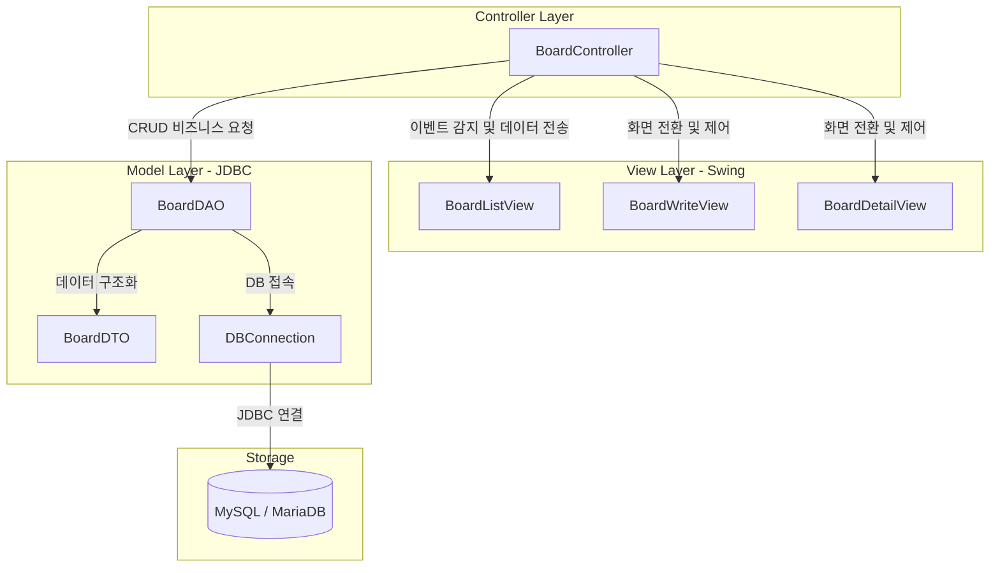

# Summary

본 프로젝트([Board0630](file:///D:/java2026/Board0630))는 자바 Swing GUI 라이브러리와 JDBC(Java Database Connectivity) API를 연동하여 동작하는 전형적인 **MVC(Model-View-Controller) 아키텍처 기반 게시판 프로그램**의 구현 흐름을 커밋(Commit) 히스토리 단위로 학습할 수 있도록 구성한 교보재입니다.

---

# Why it matters

- **MVC 아키텍처의 직관적 학습**: GUI 컴포넌트(View)와 데이터베이스 처리부(Model), 그리고 이벤트 핸들러 및 비즈니스 흐름 제어부(Controller)가 어떻게 분리되고 협력하는지 직관적으로 코드로 이해할 수 있습니다.
- **점진적(Incremental) 개발 역량 강화**: 빈 뼈대 코드에서 시작해 저장, 갱신, 상세조회, 삭제, 수정이라는 CRUD의 완성 과정을 한 단계씩 코드 변화를 보며 체득할 수 있습니다.
- **Swing UI 컴포넌트 활용 및 상태 전환 학습**: `JTable`의 데이터 연동 기법과 단일 뷰에서 수정 모드(Editable)와 읽기 모드(Read-only)를 유연하게 오가는 UI 상태 전환(Toggle) 기법을 학습합니다.

---

# Architecture (MVC Pattern)

---

# 학습 로드맵 (Commit-based Steps)

각 단계별 문서는 Git 커밋 이력의 변경점에 따라 구성되어 있으며, 이전 코드가 어떻게 리팩토링되고 진화하는지를 상세하게 다룹니다.

1. **[Step 1: MVC 뼈대 구축 및 DTO/DAO 기본 구조](step1_initial.md)**  
   - 최초 커밋 (`3a2cc62`)
   - Swing 화면 뼈대(`BoardListView`, `BoardWriteView`) 및 JDBC 커넥션(`DBConnection`), 데이터 모델(`BoardDTO`, `BoardDAO`)의 빈 뼈대 구현을 확인합니다.
2. **[Step 2: Controller 연결 및 글 등록(Insert) 연동](step2_write_db.md)**  
   - 두 번째 커밋 (`83efd36`)
   - `BoardController`를 신설하여 UI의 저장 액션과 `BoardDAO`의 `insert` SQL 처리를 연결하는 메커니즘을 학습합니다.
3. **[Step 3: 목록 동적 조회(Select All) 및 테이블 새로고침](step3_refresh_list.md)**  
   - 세 번째 커밋 (`ba1bfef`)
   - `dao.selectAll()`을 통한 전체 리스트 조회 처리와 Swing `JTable`의 `DefaultTableModel`을 갱신(`setRowCount(0)`)하여 리스트를 동적으로 리프레시하는 로직을 다룹니다.
4. **[Step 4: 상세보기 뷰(DetailView) 연동 및 단건 조회](step4_detail_view.md)**  
   - 네 번째 커밋 (`e8f12b3`)
   - 테이블에서 선택한 ID를 바탕으로 단건 게시물을 조회(`selectDetail`)하고 `BoardDetailView`에 데이터를 채워 보여주는 단계를 분석합니다.
5. **[Step 5: 게시물 삭제(Delete) 처리 및 컨펌 모달](step5_delete.md)**  
   - 다섯 번째 커밋 (`5de0352`)
   - 상세보기 화면의 삭제 버튼 액션을 구현하고, `JOptionPane.showConfirmDialog`를 통한 안전한 삭제 처리 흐름을 확인합니다.
6. **[Step 6: 게시물 수정(Update) 처리 및 UI 상태 토글(EditMode)](step6_update.md)**  
   - 여섯 번째 커밋 (`f55d412`)
   - '수정 ↔ 완료', '삭제 ↔ 취소' 버튼 텍스트와 필드의 수정 가능 여부(`setEditable`)를 상태 플래그(`isEditMode`)로 유연하게 제어하는 실무적인 UI 기법을 마스터합니다.

---

# Related Concepts

- [Java Programming](../../cs/java/index.md)
- [JDBC Framework](../../cs/java/chapter-16.md)
- MVC 패턴의 핵심: 역할과 책임의 분리 (Separation of Concerns)
